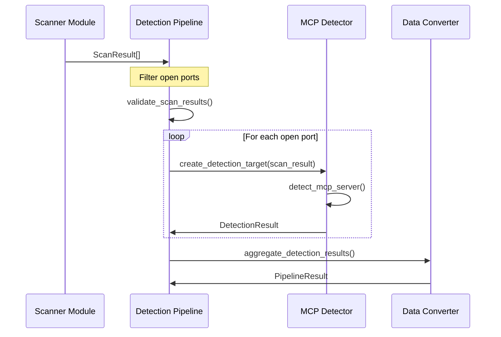
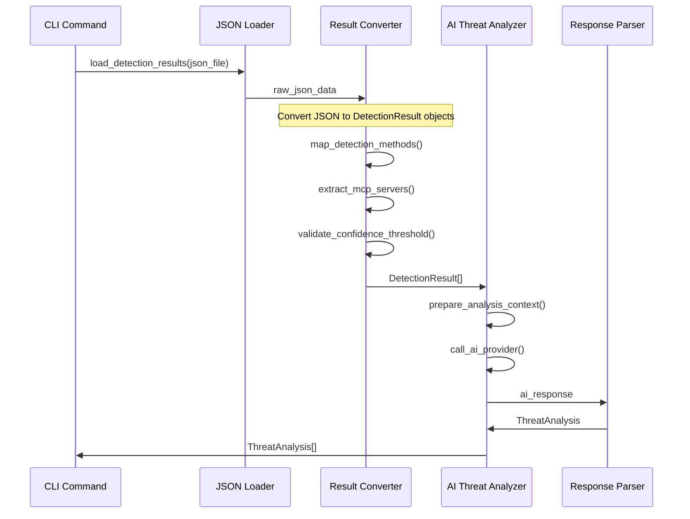
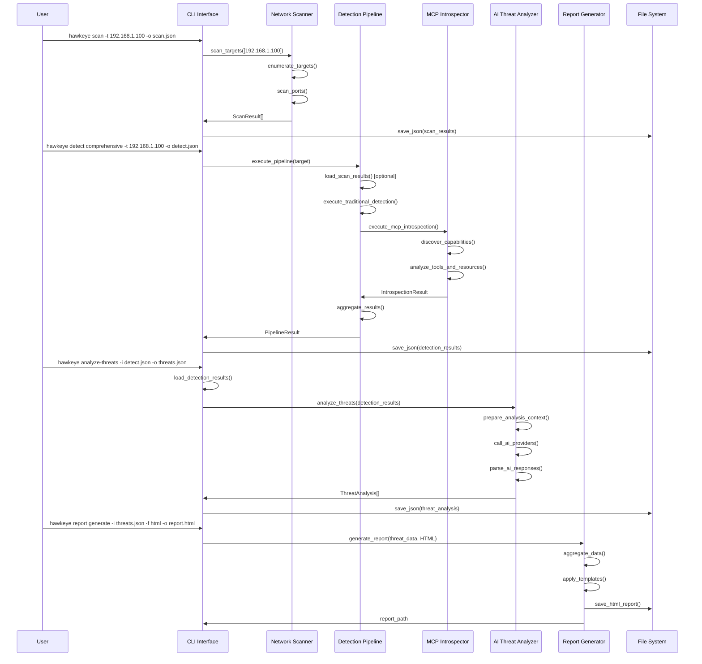
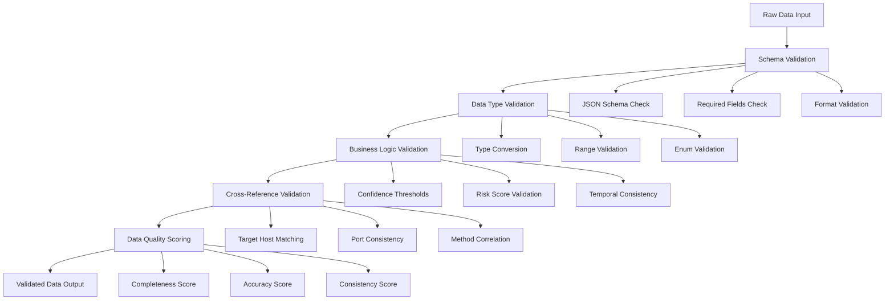
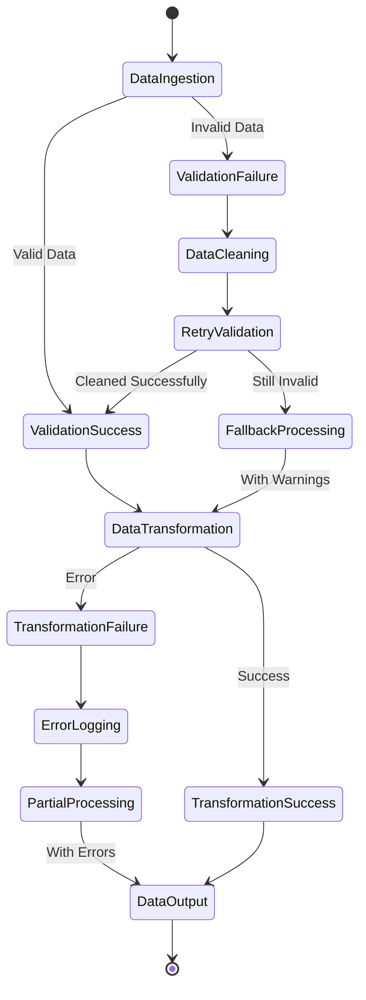
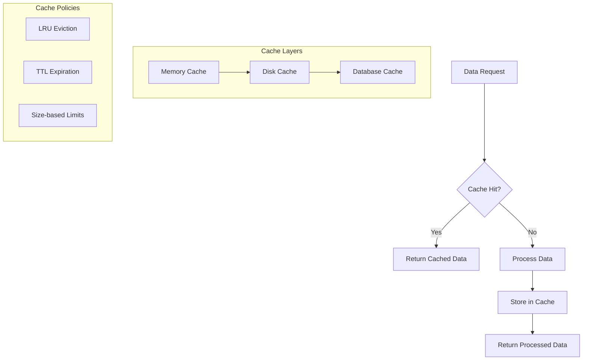
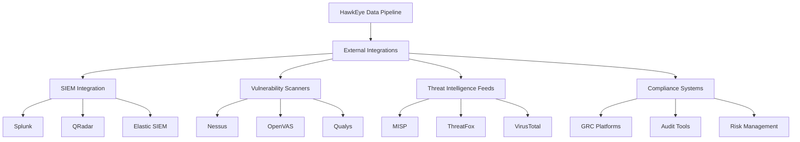

# HawkEye Data Flow Architecture

## Overview

The HawkEye system implements a sophisticated data pipeline that transforms raw network data through multiple stages of analysis, from basic network scanning to AI-powered threat assessment. This document details the data flow architecture, transformation points, and data structures used throughout the system.

## Data Flow Stages

The HawkEye data pipeline consists of four primary stages:

1. **Scan Stage**: Network discovery and port scanning
2. **Detect Stage**: MCP server detection and introspection  
3. **Analyze Stage**: AI-powered threat analysis
4. **Report Stage**: Multi-format report generation

```mermaid
flowchart LR
    A[Network Targets] --> B[Scan Stage]
    B --> C[ScanResult[]]
    C --> D[Detect Stage]
    D --> E[DetectionResult[]]
    E --> F[Analyze Stage]
    F --> G[ThreatAnalysis[]]
    G --> H[Report Stage]
    H --> I[Multi-Format Reports]
    
    subgraph "Data Transformations"
        C --> C1[Target Enumeration]
        C --> C2[Port States]
        C --> C3[Service Fingerprinting]
        
        E --> E1[MCP Server Discovery]
        E --> E2[Capability Analysis]
        E --> E3[Risk Assessment]
        
        G --> G1[Attack Vectors]
        G --> G2[Vulnerability Mapping]
        G --> G3[Mitigation Strategies]
        
        I --> I1[JSON Reports]
        I --> I2[HTML Reports]
        I --> I3[CSV Reports]
    end
```

## Core Data Structures

### 1. ScanResult Data Structure

**Source**: `src/hawkeye/scanner/base.py`

```python
@dataclass
class ScanResult:
    target: ScanTarget          # Host and port information
    port: int                   # Target port number
    state: PortState           # OPEN, CLOSED, FILTERED
    scan_type: ScanType        # TCP, UDP
    timestamp: float           # Scan execution time
    response_time: Optional[float]  # Network response time
    service_info: Optional[ServiceInfo]  # Detected service details
    error: Optional[str]       # Error information
    raw_data: Dict[str, str]   # Raw scan data
```

**Key Properties**:
- `is_open`: Boolean check for open ports
- `has_service_info`: Service detection status
- `to_dict()`: Dictionary serialization

### 2. DetectionResult Data Structure

**Source**: `src/hawkeye/detection/base.py`

```python
@dataclass
class DetectionResult:
    target_host: str           # Target host identifier
    detection_method: DetectionMethod  # Detection strategy used
    timestamp: float           # Detection execution time
    success: bool             # Detection operation success
    mcp_server: Optional[MCPServerInfo]  # Discovered MCP server
    confidence: float         # Detection confidence (0.0-1.0)
    error: Optional[str]      # Error information
    raw_data: Dict[str, Any]  # Raw detection data
    scan_duration: Optional[float]  # Detection duration
```

**Key Properties**:
- `is_mcp_detected`: Boolean check for MCP detection
- `risk_level`: Basic risk assessment (none/low/medium/high)
- `to_dict()`: Dictionary serialization with MCP server details

### 3. ThreatAnalysis Data Structure

**Source**: `src/hawkeye/detection/ai_threat/models.py`

```python
@dataclass
class ThreatAnalysis:
    server_id: str             # MCP server identifier
    analysis_timestamp: datetime  # Analysis execution time
    attack_vectors: List[AttackVector]  # Identified attack vectors
    abuse_scenarios: List[AbuseScenario]  # Potential abuse cases
    risk_score: float         # Overall risk score (0-10)
    severity_level: SeverityLevel  # Risk severity classification
    mitigation_strategies: List[MitigationStrategy]  # Remediation steps
    detection_indicators: List[DetectionIndicator]  # IOCs and signatures
    compliance_impact: List[ComplianceImpact]  # Regulatory implications
    business_impact: BusinessImpact  # Business risk assessment
    metadata: AnalysisMetadata  # Analysis context and metrics
```

### 4. ReportData Structure

**Source**: `src/hawkeye/reporting/base.py`

```python
@dataclass
class ReportData:
    metadata: ReportMetadata   # Report metadata and configuration
    scan_results: List[ScanResult]  # Network scan data
    detection_results: List[DetectionResult]  # MCP detection data
    assessment_results: List[AssessmentResult]  # Risk assessment data
    pipeline_results: List[PipelineResult]  # Pipeline execution data
    introspection_data: Dict[str, Any]  # MCP introspection details
    threat_analysis: List[ThreatAnalysis]  # AI threat analysis results
    generated_at: datetime     # Report generation timestamp
```

## Data Transformation Pipeline

### 1. Scan → Detect Transformation



**Transformation Logic**:
```python
def scan_to_detection_transform(scan_results: List[ScanResult]) -> List[DetectionTarget]:
    """Transform scan results into detection targets."""
    detection_targets = []
    
    for scan_result in scan_results:
        if scan_result.is_open and scan_result.has_service_info:
            # Create detection target from scan data
            target = DetectionTarget(
                host=scan_result.target.host,
                port=scan_result.port,
                service_info=scan_result.service_info,
                transport_hints=extract_transport_hints(scan_result),
                scan_metadata=scan_result.raw_data
            )
            detection_targets.append(target)
    
    return detection_targets
```

### 2. Detect → Analyze Transformation



**Key Transformation Points**:

1. **JSON to DetectionResult Conversion**:
```python
def convert_json_to_detection_result(result_data: Dict) -> DetectionResult:
    """Convert raw JSON detection data to DetectionResult object."""
    
    # Map detection method strings to enums
    method_mapping = {
        'process_enumeration': DetectionMethod.PROCESS_ENUMERATION,
        'config_discovery': DetectionMethod.CONFIG_FILE_DISCOVERY,
        'protocol_verification': DetectionMethod.PROTOCOL_HANDSHAKE,
        'transport_detection': DetectionMethod.TRANSPORT_DETECTION,
        'introspection': DetectionMethod.PROCESS_ENUMERATION
    }
    
    detection_method = method_mapping.get(
        result_data.get('detection_method', 'unknown'),
        DetectionMethod.PROCESS_ENUMERATION
    )
    
    # Extract and convert MCP server data
    mcp_server = None
    if 'mcp_server' in result_data and result_data['mcp_server']:
        mcp_server = create_mcp_server_from_json(result_data['mcp_server'])
    
    return DetectionResult(
        target_host=result_data.get('target_host', 'unknown'),
        detection_method=detection_method,
        timestamp=result_data.get('timestamp', time.time()),
        success=result_data.get('success', False),
        mcp_server=mcp_server,
        confidence=result_data.get('confidence', 0.0),
        error=result_data.get('error'),
        raw_data=result_data.get('raw_data', {})
    )
```

2. **MCP Server Context Preparation**:
```python
def prepare_threat_analysis_context(detection_results: List[DetectionResult]) -> AnalysisRequest:
    """Prepare context for AI threat analysis."""
    
    mcp_servers = []
    environment_context = infer_environment_context(detection_results)
    
    for result in detection_results:
        if result.is_mcp_detected and result.confidence >= threshold:
            # Extract tool capabilities
            tool_capabilities = extract_tool_capabilities(result.mcp_server)
            
            # Assess security posture
            security_posture = assess_security_posture(result.mcp_server)
            
            # Build analysis request
            analysis_request = AnalysisRequest(
                server_info=result.mcp_server,
                tool_capabilities=tool_capabilities,
                security_posture=security_posture,
                environment_context=environment_context
            )
            
            mcp_servers.append(analysis_request)
    
    return mcp_servers
```

### 3. Analyze → Report Transformation

```mermaid
flowchart TD
    A[ThreatAnalysis[]] --> B[Report Data Aggregation]
    B --> C[Format-Specific Transformation]
    
    C --> D[JSON Reporter]
    C --> E[HTML Reporter]
    C --> F[CSV Reporter]
    C --> G[XML Reporter]
    
    D --> H[Structured JSON]
    E --> I[Rich HTML Report]
    F --> J[Tabular CSV Data]
    G --> K[Structured XML]
    
    subgraph "Data Enrichment"
        B --> B1[Executive Summary]
        B --> B2[Risk Metrics]
        B --> B3[Compliance Mapping]
        B --> B4[Visualization Data]
    end
    
    subgraph "Template Processing"
        E --> E1[Template Engine]
        E1 --> E2[Dynamic Charts]
        E1 --> E3[Risk Matrices]
        E1 --> E4[Action Items]
    end
```

## End-to-End Data Flow Sequence

### Complete Workflow: Network → Threats → Reports



## Data Validation and Quality Assurance

### 1. Validation Pipeline



### 2. Data Quality Metrics

```python
@dataclass
class DataQualityMetrics:
    """Metrics for assessing data quality throughout the pipeline."""
    
    completeness: float        # Percentage of non-null values
    accuracy: float           # Validation success rate
    consistency: float        # Cross-reference match rate
    timeliness: float        # Data freshness score
    validity: float          # Schema compliance rate
    uniqueness: float        # Duplicate detection rate
    
    def overall_quality_score(self) -> float:
        """Calculate weighted overall quality score."""
        weights = {
            'completeness': 0.20,
            'accuracy': 0.25,
            'consistency': 0.20,
            'timeliness': 0.15,
            'validity': 0.15,
            'uniqueness': 0.05
        }
        
        return sum(
            getattr(self, metric) * weight
            for metric, weight in weights.items()
        )
```

### 3. Error Handling and Recovery



## Performance Optimization

### 1. Data Processing Optimization

**Streaming Processing**:
```python
def stream_process_detection_results(
    detection_results: Iterator[DetectionResult],
    batch_size: int = 100
) -> Iterator[ThreatAnalysis]:
    """Process detection results in streaming batches."""
    
    batch = []
    for result in detection_results:
        batch.append(result)
        
        if len(batch) >= batch_size:
            # Process batch
            threat_analyses = analyze_threat_batch(batch)
            yield from threat_analyses
            batch.clear()
    
    # Process remaining items
    if batch:
        threat_analyses = analyze_threat_batch(batch)
        yield from threat_analyses
```

**Parallel Processing**:
```python
async def parallel_threat_analysis(
    detection_results: List[DetectionResult],
    max_workers: int = 3
) -> List[ThreatAnalysis]:
    """Process threat analysis in parallel workers."""
    
    semaphore = asyncio.Semaphore(max_workers)
    
    async def analyze_with_semaphore(result: DetectionResult) -> ThreatAnalysis:
        async with semaphore:
            return await analyze_single_threat(result)
    
    tasks = [
        analyze_with_semaphore(result)
        for result in detection_results
    ]
    
    return await asyncio.gather(*tasks)
```

### 2. Memory Management

**Memory-Efficient Data Structures**:
```python
class MemoryEfficientScanResult:
    """Memory-optimized scan result using slots and lazy loading."""
    
    __slots__ = ['_target', '_port', '_state', '_timestamp', '_service_info_ref']
    
    def __init__(self, target: str, port: int, state: PortState):
        self._target = target
        self._port = port
        self._state = state
        self._timestamp = time.time()
        self._service_info_ref = None
    
    @property
    def service_info(self) -> Optional[ServiceInfo]:
        """Lazy-load service information when accessed."""
        if self._service_info_ref:
            return self._service_info_ref()
        return None
```

### 3. Caching Strategy



## Data Serialization and Persistence

### 1. JSON Serialization Strategy

```python
class HawkEyeJSONEncoder(json.JSONEncoder):
    """Custom JSON encoder for HawkEye data structures."""
    
    def default(self, obj):
        if isinstance(obj, datetime):
            return obj.isoformat()
        elif isinstance(obj, Enum):
            return obj.value
        elif hasattr(obj, 'to_dict'):
            return obj.to_dict()
        elif isinstance(obj, dataclass):
            return asdict(obj)
        
        return super().default(obj)

def save_detection_results(results: List[DetectionResult], filepath: Path):
    """Save detection results with optimized JSON serialization."""
    
    # Pre-process data for efficient serialization
    serializable_data = {
        'version': '1.0',
        'timestamp': datetime.now().isoformat(),
        'result_count': len(results),
        'results': [result.to_dict() for result in results]
    }
    
    with open(filepath, 'w') as f:
        json.dump(serializable_data, f, cls=HawkEyeJSONEncoder, indent=2)
```

### 2. Data Compression

```python
import gzip
import pickle
from typing import Union

def save_compressed_data(
    data: Union[List[ScanResult], List[DetectionResult], List[ThreatAnalysis]],
    filepath: Path,
    compression_level: int = 6
):
    """Save data with compression for large datasets."""
    
    with gzip.open(filepath, 'wb', compresslevel=compression_level) as f:
        pickle.dump(data, f, protocol=pickle.HIGHEST_PROTOCOL)

def load_compressed_data(filepath: Path) -> Any:
    """Load compressed data."""
    
    with gzip.open(filepath, 'rb') as f:
        return pickle.load(f)
```

## Data Consistency and Integrity

### 1. Checksum Validation

```python
import hashlib
from typing import Dict

def calculate_data_checksum(data: Any) -> str:
    """Calculate SHA-256 checksum for data integrity validation."""
    
    serialized = json.dumps(data, sort_keys=True, cls=HawkEyeJSONEncoder)
    return hashlib.sha256(serialized.encode()).hexdigest()

def validate_data_integrity(
    data: Any,
    expected_checksum: str
) -> bool:
    """Validate data integrity using checksum."""
    
    actual_checksum = calculate_data_checksum(data)
    return actual_checksum == expected_checksum
```

### 2. Data Versioning

```python
@dataclass
class DataVersion:
    """Data structure versioning for backward compatibility."""
    
    major: int
    minor: int
    patch: int
    schema_version: str
    migration_available: bool = False
    
    def __str__(self) -> str:
        return f"{self.major}.{self.minor}.{self.patch}"
    
    def is_compatible(self, other: 'DataVersion') -> bool:
        """Check if versions are compatible."""
        return (
            self.major == other.major and
            self.schema_version == other.schema_version
        )

def migrate_data_version(
    data: Dict[str, Any],
    from_version: DataVersion,
    to_version: DataVersion
) -> Dict[str, Any]:
    """Migrate data between versions."""
    
    if from_version.is_compatible(to_version):
        return data
    
    # Apply version-specific migrations
    for migration in get_migrations(from_version, to_version):
        data = migration.apply(data)
    
    return data
```

## Integration Points

### 1. External System Integration



### 2. API Data Exchange

```python
from typing import Protocol

class DataExchangeProtocol(Protocol):
    """Protocol for external data exchange."""
    
    def export_data(self, data: Any, format: str) -> bytes:
        """Export data in specified format."""
        ...
    
    def import_data(self, data: bytes, format: str) -> Any:
        """Import data from specified format."""
        ...
    
    def validate_schema(self, data: Any) -> bool:
        """Validate data against expected schema."""
        ...

class SIEMIntegration:
    """Integration with SIEM systems."""
    
    def export_to_cef(self, threat_analysis: ThreatAnalysis) -> str:
        """Export threat analysis to Common Event Format."""
        
        cef_fields = {
            'deviceVendor': 'HawkEye',
            'deviceProduct': 'MCP Security Scanner',
            'deviceVersion': '1.0',
            'signatureId': threat_analysis.server_id,
            'name': f'MCP Threat Detected: {threat_analysis.severity_level}',
            'severity': self._map_severity_to_cef(threat_analysis.severity_level)
        }
        
        extensions = {
            'src': threat_analysis.metadata.target_host,
            'spt': threat_analysis.metadata.target_port,
            'cs1': threat_analysis.risk_score,
            'cs1Label': 'Risk Score'
        }
        
        return self._format_cef_message(cef_fields, extensions)
```

## Future Enhancements

### 1. Real-time Data Streaming

```python
import asyncio
from asyncio import Queue

class RealTimeDataProcessor:
    """Real-time data processing with streaming capabilities."""
    
    def __init__(self, buffer_size: int = 1000):
        self.data_queue = Queue(maxsize=buffer_size)
        self.processors = []
        self.running = False
    
    async def start_streaming(self):
        """Start real-time data processing."""
        self.running = True
        
        # Start processor tasks
        tasks = [
            asyncio.create_task(self._process_data_stream()),
            asyncio.create_task(self._monitor_queue_health())
        ]
        
        await asyncio.gather(*tasks)
    
    async def _process_data_stream(self):
        """Process streaming data."""
        while self.running:
            try:
                data = await asyncio.wait_for(
                    self.data_queue.get(), 
                    timeout=1.0
                )
                
                # Process data through pipeline
                processed_data = await self._transform_data(data)
                await self._emit_results(processed_data)
                
            except asyncio.TimeoutError:
                continue
            except Exception as e:
                logger.error(f"Stream processing error: {e}")
```

### 2. Machine Learning Pipeline Integration

```python
from sklearn.base import BaseEstimator, TransformerMixin

class ThreatAnalysisFeatureExtractor(BaseEstimator, TransformerMixin):
    """Extract ML features from threat analysis data."""
    
    def fit(self, X, y=None):
        return self
    
    def transform(self, threat_analyses: List[ThreatAnalysis]) -> np.ndarray:
        """Transform threat analyses into ML feature vectors."""
        
        features = []
        for analysis in threat_analyses:
            feature_vector = [
                analysis.risk_score,
                len(analysis.attack_vectors),
                len(analysis.abuse_scenarios),
                self._encode_severity(analysis.severity_level),
                self._calculate_tool_risk_score(analysis.metadata),
                self._encode_transport_security(analysis.metadata)
            ]
            features.append(feature_vector)
        
        return np.array(features)
```

### 3. Graph-based Data Analysis

```python
import networkx as nx
from typing import Set

class ThreatGraphAnalyzer:
    """Analyze threat relationships using graph theory."""
    
    def __init__(self):
        self.threat_graph = nx.DiGraph()
    
    def build_threat_graph(self, threat_analyses: List[ThreatAnalysis]):
        """Build a graph representation of threat relationships."""
        
        for analysis in threat_analyses:
            # Add server node
            server_id = analysis.server_id
            self.threat_graph.add_node(
                server_id,
                node_type='server',
                risk_score=analysis.risk_score,
                severity=analysis.severity_level.value
            )
            
            # Add attack vector nodes and edges
            for vector in analysis.attack_vectors:
                vector_id = f"{server_id}_{vector.vector_id}"
                self.threat_graph.add_node(
                    vector_id,
                    node_type='attack_vector',
                    cvss_score=vector.cvss_score
                )
                
                self.threat_graph.add_edge(
                    server_id,
                    vector_id,
                    relationship='enables'
                )
    
    def find_attack_paths(self, source: str, target: str) -> List[List[str]]:
        """Find potential attack paths between servers."""
        
        try:
            paths = list(nx.all_simple_paths(
                self.threat_graph,
                source,
                target,
                cutoff=5  # Maximum path length
            ))
            return paths
        except nx.NetworkXNoPath:
            return []
    
    def identify_critical_nodes(self) -> Set[str]:
        """Identify critical nodes in the threat graph."""
        
        centrality = nx.betweenness_centrality(self.threat_graph)
        
        # Return nodes with high centrality scores
        threshold = 0.1
        return {
            node for node, score in centrality.items()
            if score > threshold
        }
```

## Conclusion

The HawkEye data flow architecture provides a robust, scalable foundation for security reconnaissance and threat analysis. Key architectural strengths include:

**Data Integrity**:
- Comprehensive validation at each transformation point
- Checksum-based integrity verification
- Version-aware data migration support

**Performance Optimization**:
- Streaming and batch processing capabilities
- Memory-efficient data structures
- Intelligent caching strategies

**Extensibility**:
- Pluggable data transformation components
- Standardized interfaces for external integrations
- Machine learning pipeline compatibility

**Quality Assurance**:
- Multi-layer validation pipeline
- Data quality metrics and monitoring
- Error handling and recovery mechanisms

The architecture supports both current operational requirements and future enhancements, ensuring HawkEye can evolve with changing security analysis needs while maintaining data consistency and processing efficiency. 