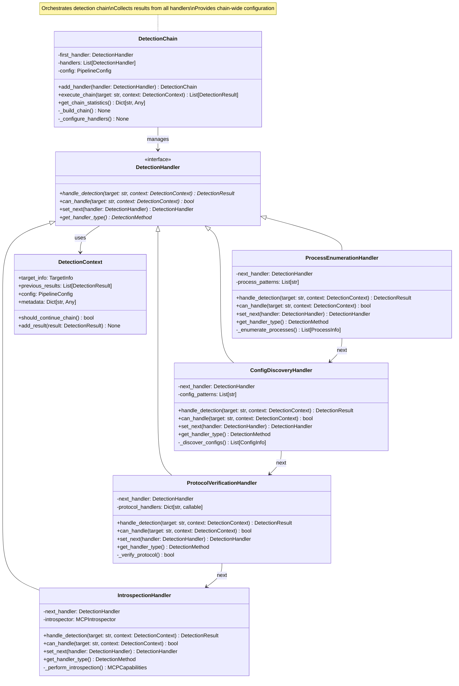
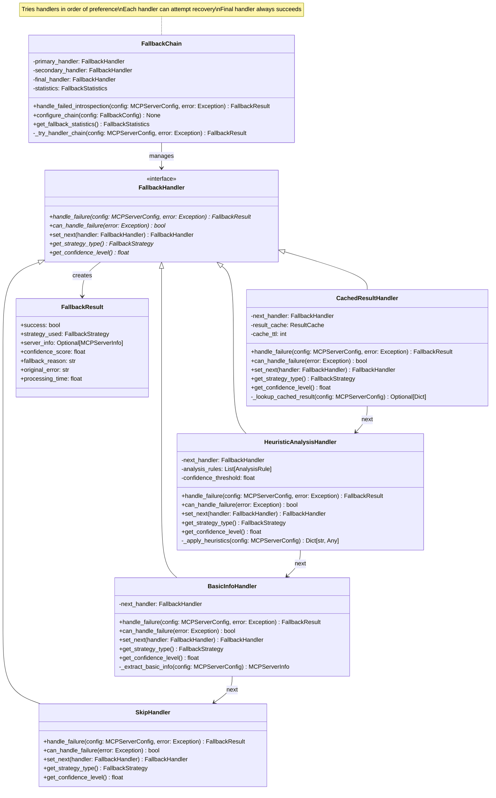
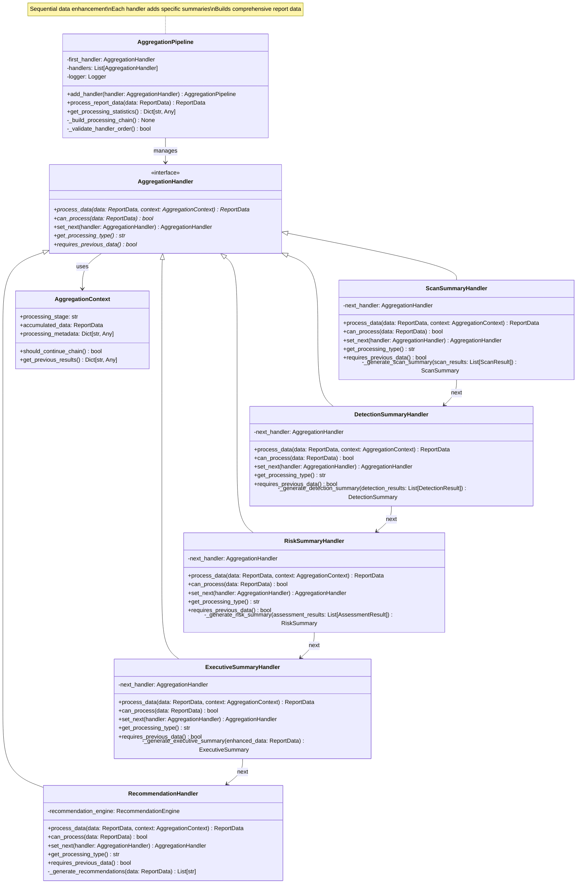
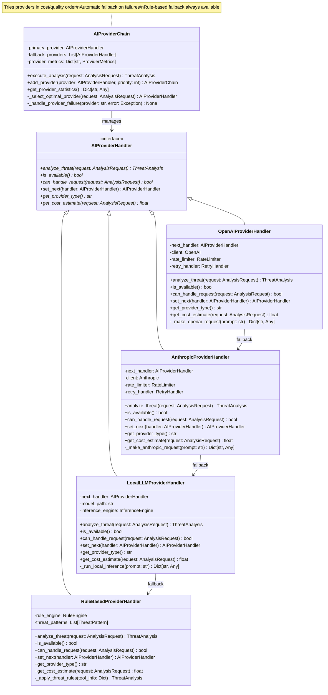
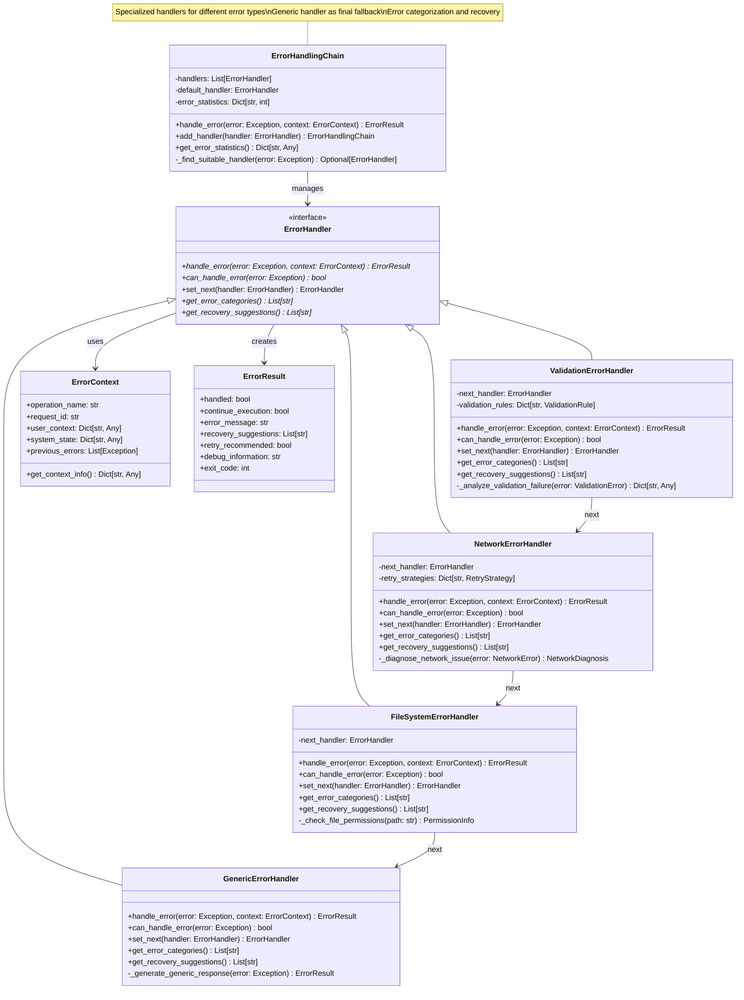

# Chain of Responsibility Pattern Documentation

## Overview

The Chain of Responsibility Pattern is extensively implemented throughout the HawkEye Security Reconnaissance Tool to handle requests by passing them through a chain of handlers, where each handler decides whether to process the request and/or pass it to the next handler in the chain. This pattern promotes loose coupling and flexible request processing workflows.

## Pattern Definition

The Chain of Responsibility Pattern:
- Passes requests along a chain of handlers
- Allows multiple objects to handle a request without coupling the sender to specific receivers
- Enables dynamic chain configuration and handler ordering
- Supports both sequential processing and early termination
- Provides graceful degradation through fallback mechanisms

## Implementation in HawkEye

HawkEye implements the Chain of Responsibility Pattern across multiple systems to provide flexible, fault-tolerant request processing:

1. **Detection Pipeline Chain** - Multiple detection methods process targets sequentially
2. **Fallback Management Chain** - Multiple fallback strategies handle failed operations
3. **Data Aggregation Chain** - Sequential data processing and enhancement stages
4. **AI Provider Chain** - Multiple AI providers with fallback mechanisms
5. **Assessment Processing Chain** - Chained security assessments and analysis
6. **Error Handling Chain** - Hierarchical error processing and resolution

## UML Class Diagrams

### 1. Detection Pipeline Chain Pattern



### 2. Fallback Management Chain Pattern



### 3. Data Aggregation Chain Pattern



### 4. AI Provider Chain Pattern



### 5. Error Handling Chain Pattern



## Implementation Examples

### 1. Detection Pipeline Chain Implementation

**Chain Handler Interface:**
```python
from abc import ABC, abstractmethod
from typing import Optional, Dict, Any

class DetectionHandler(ABC):
    """Abstract base class for detection handlers in the chain."""
    
    def __init__(self):
        self._next_handler: Optional[DetectionHandler] = None
        self.logger = get_logger(self.__class__.__name__)
        self.statistics = {
            'requests_handled': 0,
            'successful_detections': 0,
            'failed_detections': 0,
            'processing_time': 0.0
        }
    
    def set_next(self, handler: 'DetectionHandler') -> 'DetectionHandler':
        """Set the next handler in the chain."""
        self._next_handler = handler
        return handler
    
    @abstractmethod
    def handle_detection(self, target: str, context: DetectionContext) -> DetectionResult:
        """Handle the detection request."""
        pass
    
    @abstractmethod
    def can_handle(self, target: str, context: DetectionContext) -> bool:
        """Check if this handler can process the request."""
        pass
    
    @abstractmethod
    def get_handler_type(self) -> DetectionMethod:
        """Get the detection method type."""
        pass
    
    def handle_request(self, target: str, context: DetectionContext) -> DetectionResult:
        """Process request and potentially pass to next handler."""
        start_time = time.time()
        self.statistics['requests_handled'] += 1
        
        try:
            if self.can_handle(target, context):
                result = self.handle_detection(target, context)
                
                if result.success:
                    self.statistics['successful_detections'] += 1
                else:
                    self.statistics['failed_detections'] += 1
                
                # Add result to context for subsequent handlers
                context.add_result(result)
                
                # Continue chain if configured to do so
                if self._next_handler and context.should_continue_chain():
                    next_result = self._next_handler.handle_request(target, context)
                    # Could merge results here if needed
                
                return result
            else:
                # Pass to next handler if we can't handle this request
                if self._next_handler:
                    return self._next_handler.handle_request(target, context)
                else:
                    return DetectionResult(
                        target_host=target,
                        success=False,
                        detection_method=self.get_handler_type(),
                        error="No suitable handler found"
                    )
                    
        except Exception as e:
            self.logger.error(f"Detection handler {self.__class__.__name__} failed: {e}")
            self.statistics['failed_detections'] += 1
            
            # Try next handler on failure
            if self._next_handler:
                return self._next_handler.handle_request(target, context)
            else:
                return DetectionResult(
                    target_host=target,
                    success=False,
                    detection_method=self.get_handler_type(),
                    error=str(e)
                )
        finally:
            self.statistics['processing_time'] += time.time() - start_time
```

**Concrete Handler Implementation:**
```python
class ProcessEnumerationHandler(DetectionHandler):
    """Concrete handler for process enumeration detection."""
    
    def __init__(self, settings=None):
        super().__init__()
        self.settings = settings or get_settings()
        self.process_patterns = [
            r'.*mcp-server.*',
            r'.*@modelcontextprotocol.*',
            r'node.*mcp.*'
        ]
    
    def handle_detection(self, target: str, context: DetectionContext) -> DetectionResult:
        """Perform process enumeration detection."""
        self.logger.info(f"Starting process enumeration for {target}")
        
        try:
            # Enumerate processes
            processes = self._enumerate_processes()
            mcp_processes = self._filter_mcp_processes(processes)
            
            if mcp_processes:
                mcp_servers = self._analyze_mcp_processes(mcp_processes)
                
                return DetectionResult(
                    target_host=target,
                    success=True,
                    detection_method=self.get_handler_type(),
                    mcp_servers=mcp_servers,
                    process_info=mcp_processes,
                    confidence=0.9 if len(mcp_servers) > 0 else 0.5
                )
            else:
                return DetectionResult(
                    target_host=target,
                    success=False,
                    detection_method=self.get_handler_type(),
                    error="No MCP processes found"
                )
                
        except Exception as e:
            raise DetectionError(f"Process enumeration failed: {e}")
    
    def can_handle(self, target: str, context: DetectionContext) -> bool:
        """Check if we can perform process enumeration."""
        return target == "localhost" or target == "127.0.0.1"
    
    def get_handler_type(self) -> DetectionMethod:
        """Return detection method type."""
        return DetectionMethod.PROCESS_ENUMERATION
    
    def _enumerate_processes(self) -> List[ProcessInfo]:
        """Enumerate running processes."""
        processes = []
        for proc in psutil.process_iter(['pid', 'name', 'cmdline']):
            try:
                processes.append(ProcessInfo(
                    pid=proc.info['pid'],
                    name=proc.info['name'],
                    cmdline=' '.join(proc.info['cmdline']) if proc.info['cmdline'] else ''
                ))
            except (psutil.NoSuchProcess, psutil.AccessDenied):
                continue
        return processes
    
    def _filter_mcp_processes(self, processes: List[ProcessInfo]) -> List[ProcessInfo]:
        """Filter processes that match MCP patterns."""
        mcp_processes = []
        for process in processes:
            for pattern in self.process_patterns:
                if re.match(pattern, process.cmdline, re.IGNORECASE):
                    mcp_processes.append(process)
                    break
        return mcp_processes
```

**Chain Configuration:**
```python
class DetectionChain:
    """Main detection chain orchestrator."""
    
    def __init__(self, config: PipelineConfig):
        self.config = config
        self.logger = get_logger(__name__)
        self.first_handler = None
        self._build_chain()
    
    def _build_chain(self):
        """Build the detection chain based on configuration."""
        handlers = []
        
        # Add handlers based on configuration
        if self.config.enable_process_enumeration:
            handlers.append(ProcessEnumerationHandler())
        
        if self.config.enable_config_discovery:
            handlers.append(ConfigDiscoveryHandler())
        
        if self.config.enable_protocol_verification:
            handlers.append(ProtocolVerificationHandler())
        
        if self.config.enable_mcp_introspection:
            handlers.append(IntrospectionHandler())
        
        # Chain handlers together
        if handlers:
            self.first_handler = handlers[0]
            for i in range(len(handlers) - 1):
                handlers[i].set_next(handlers[i + 1])
    
    def execute_detection(self, target: str) -> List[DetectionResult]:
        """Execute the detection chain."""
        if not self.first_handler:
            return []
        
        context = DetectionContext(
            target_info=self._get_target_info(target),
            config=self.config
        )
        
        # Start the chain
        result = self.first_handler.handle_request(target, context)
        
        # Return all results collected in context
        return context.get_all_results()
```

### 2. Fallback Management Chain Implementation

**Fallback Handler Base:**
```python
class FallbackHandler(ABC):
    """Abstract base class for fallback handlers."""
    
    def __init__(self):
        self._next_handler: Optional[FallbackHandler] = None
        self.logger = get_logger(self.__class__.__name__)
    
    def set_next(self, handler: 'FallbackHandler') -> 'FallbackHandler':
        """Set the next handler in the fallback chain."""
        self._next_handler = handler
        return handler
    
    @abstractmethod
    def handle_failure(self, config: MCPServerConfig, error: Exception) -> FallbackResult:
        """Handle the failed operation."""
        pass
    
    @abstractmethod
    def can_handle_failure(self, error: Exception) -> bool:
        """Check if this handler can process the failure."""
        pass
    
    @abstractmethod
    def get_confidence_level(self) -> float:
        """Get the confidence level of this fallback strategy."""
        pass
    
    def handle_request(self, config: MCPServerConfig, error: Exception) -> FallbackResult:
        """Process the fallback request."""
        try:
            if self.can_handle_failure(error):
                result = self.handle_failure(config, error)
                
                # If successful and confident enough, return result
                if result.success and result.confidence_score >= 0.5:
                    return result
            
            # Try next handler if we can't handle or result isn't confident
            if self._next_handler:
                return self._next_handler.handle_request(config, error)
            else:
                # Final fallback - always return something
                return FallbackResult(
                    success=False,
                    strategy_used=FallbackStrategy.SKIP,
                    server_info=None,
                    confidence_score=0.0,
                    fallback_reason="No suitable fallback strategy found",
                    original_error=str(error)
                )
                
        except Exception as fallback_error:
            self.logger.error(f"Fallback handler failed: {fallback_error}")
            
            # Try next handler on error
            if self._next_handler:
                return self._next_handler.handle_request(config, error)
            else:
                return FallbackResult(
                    success=False,
                    strategy_used=self.get_strategy_type(),
                    server_info=None,
                    confidence_score=0.0,
                    fallback_reason=f"Fallback failed: {fallback_error}",
                    original_error=str(error)
                )
```

**Concrete Fallback Handlers:**
```python
class CachedResultHandler(FallbackHandler):
    """Handler that tries to use cached results."""
    
    def __init__(self, cache_ttl: int = 3600):
        super().__init__()
        self.result_cache = {}
        self.cache_ttl = cache_ttl
    
    def handle_failure(self, config: MCPServerConfig, error: Exception) -> FallbackResult:
        """Try to retrieve cached result."""
        cache_key = f"{config.name}:{config.host}:{config.port}"
        
        if cache_key in self.result_cache:
            cached_entry = self.result_cache[cache_key]
            
            # Check if cache is still valid
            if time.time() - cached_entry['timestamp'] < self.cache_ttl:
                self.logger.info(f"Using cached result for {config.name}")
                
                return FallbackResult(
                    success=True,
                    strategy_used=FallbackStrategy.CACHED_RESULT,
                    server_info=cached_entry['server_info'],
                    confidence_score=0.8,  # High confidence in cached data
                    fallback_reason="Retrieved from cache",
                    original_error=str(error)
                )
        
        # No valid cache entry found
        return FallbackResult(
            success=False,
            strategy_used=FallbackStrategy.CACHED_RESULT,
            server_info=None,
            confidence_score=0.0,
            fallback_reason="No cached result available",
            original_error=str(error)
        )
    
    def can_handle_failure(self, error: Exception) -> bool:
        """Can handle any type of failure if cache is available."""
        return True
    
    def get_confidence_level(self) -> float:
        """High confidence when cache is available."""
        return 0.8

class HeuristicAnalysisHandler(FallbackHandler):
    """Handler that performs heuristic analysis."""
    
    def __init__(self):
        super().__init__()
        self.analysis_rules = self._load_analysis_rules()
    
    def handle_failure(self, config: MCPServerConfig, error: Exception) -> FallbackResult:
        """Perform heuristic analysis of the server configuration."""
        try:
            # Apply heuristic rules
            analysis_result = self._apply_heuristics(config)
            
            if analysis_result['confidence'] > 0.3:
                server_info = self._build_server_info_from_heuristics(config, analysis_result)
                
                return FallbackResult(
                    success=True,
                    strategy_used=FallbackStrategy.HEURISTIC_ANALYSIS,
                    server_info=server_info,
                    confidence_score=analysis_result['confidence'],
                    fallback_reason="Generated using heuristic analysis",
                    original_error=str(error)
                )
            else:
                return FallbackResult(
                    success=False,
                    strategy_used=FallbackStrategy.HEURISTIC_ANALYSIS,
                    server_info=None,
                    confidence_score=analysis_result['confidence'],
                    fallback_reason="Heuristic analysis confidence too low",
                    original_error=str(error)
                )
                
        except Exception as e:
            return FallbackResult(
                success=False,
                strategy_used=FallbackStrategy.HEURISTIC_ANALYSIS,
                server_info=None,
                confidence_score=0.0,
                fallback_reason=f"Heuristic analysis failed: {e}",
                original_error=str(error)
            )
    
    def can_handle_failure(self, error: Exception) -> bool:
        """Can handle configuration-related failures."""
        return not isinstance(error, (NetworkError, TimeoutError))
    
    def get_confidence_level(self) -> float:
        """Moderate confidence in heuristic analysis."""
        return 0.6
```

### 3. Data Aggregation Chain Implementation

**Aggregation Chain:**
```python
class DataAggregationChain:
    """Chains multiple data aggregation handlers."""
    
    def __init__(self):
        self.logger = get_logger(__name__)
        self.first_handler = None
        self._build_aggregation_chain()
    
    def _build_aggregation_chain(self):
        """Build the data aggregation chain."""
        # Create handlers in processing order
        scan_handler = ScanSummaryHandler()
        detection_handler = DetectionSummaryHandler()
        risk_handler = RiskSummaryHandler()
        executive_handler = ExecutiveSummaryHandler()
        recommendation_handler = RecommendationHandler()
        
        # Chain them together
        self.first_handler = scan_handler
        scan_handler.set_next(detection_handler)
        detection_handler.set_next(risk_handler)
        risk_handler.set_next(executive_handler)
        executive_handler.set_next(recommendation_handler)
    
    def process_data(self, data: ReportData) -> ReportData:
        """Process data through the aggregation chain."""
        if not self.first_handler:
            return data
        
        context = AggregationContext(
            processing_stage="initialization",
            accumulated_data=data
        )
        
        # Start the aggregation chain
        return self.first_handler.process_request(data, context)

class ScanSummaryHandler(AggregationHandler):
    """Handler for generating scan summaries."""
    
    def process_data(self, data: ReportData, context: AggregationContext) -> ReportData:
        """Generate scan summary and pass to next handler."""
        if not data.has_scan_data:
            # Skip if no scan data, continue chain
            if self._next_handler:
                return self._next_handler.process_request(data, context)
            return data
        
        try:
            # Generate scan summary
            scan_summary = self._generate_scan_summary(data.scan_results)
            
            # Create enhanced data copy
            enhanced_data = copy.deepcopy(data)
            enhanced_data.scan_summary = scan_summary
            
            self.logger.info("Generated scan summary")
            
            # Continue chain with enhanced data
            if self._next_handler:
                return self._next_handler.process_request(enhanced_data, context)
            return enhanced_data
            
        except Exception as e:
            self.logger.error(f"Failed to generate scan summary: {e}")
            
            # Continue chain with original data on error
            if self._next_handler:
                return self._next_handler.process_request(data, context)
            return data
```

## Benefits of the Chain of Responsibility Pattern

### 1. **Decoupling**
- Senders and receivers are decoupled
- Handlers don't need to know about other handlers
- Request structure is separated from processing logic

### 2. **Flexibility**
- Handlers can be added, removed, or reordered dynamically
- Different chains can be configured for different scenarios
- Runtime chain modification based on conditions

### 3. **Single Responsibility**
- Each handler has a specific, focused responsibility
- Clear separation of concerns
- Easier testing and maintenance

### 4. **Extensibility**
- New handlers can be added without modifying existing code
- Chain behavior can be extended through configuration
- Supports plugin architectures

### 5. **Fault Tolerance**
- Graceful degradation through fallback mechanisms
- Error handling can be distributed across handlers
- Failed handlers don't break the entire chain

## Advanced Chain Techniques

### 1. **Conditional Chain Execution**
```python
class ConditionalChain:
    """Chain that executes handlers based on conditions."""
    
    def execute_chain(self, request: Any, context: Dict[str, Any]) -> Any:
        """Execute chain with conditional logic."""
        
        for handler in self.handlers:
            # Check execution conditions
            if self._should_execute_handler(handler, request, context):
                try:
                    result = handler.handle_request(request, context)
                    
                    # Check if we should continue
                    if not self._should_continue_chain(result, context):
                        return result
                        
                except Exception as e:
                    if self._should_stop_on_error(handler, e):
                        raise
                    # Continue to next handler
                    
        return self._create_default_result(request)
```

### 2. **Parallel Chain Processing**
```python
class ParallelChain:
    """Chain that can execute handlers in parallel."""
    
    async def execute_parallel_chain(self, request: Any) -> List[Any]:
        """Execute multiple handlers in parallel."""
        
        tasks = []
        for handler in self.parallel_handlers:
            if handler.can_handle(request):
                task = asyncio.create_task(
                    handler.handle_request_async(request)
                )
                tasks.append(task)
        
        # Wait for all handlers to complete
        results = await asyncio.gather(*tasks, return_exceptions=True)
        
        # Filter out exceptions and process results
        successful_results = [r for r in results if not isinstance(r, Exception)]
        
        return successful_results
```

### 3. **Chain Metrics and Monitoring**
```python
class MonitoredChain:
    """Chain with comprehensive metrics and monitoring."""
    
    def __init__(self):
        self.metrics = {
            'total_requests': 0,
            'successful_requests': 0,
            'failed_requests': 0,
            'handler_performance': defaultdict(dict),
            'chain_latency': []
        }
    
    def execute_with_monitoring(self, request: Any) -> Any:
        """Execute chain with full monitoring."""
        
        start_time = time.time()
        request_id = self._generate_request_id()
        
        try:
            self.metrics['total_requests'] += 1
            
            # Execute chain with per-handler monitoring
            result = self._execute_monitored_chain(request, request_id)
            
            self.metrics['successful_requests'] += 1
            return result
            
        except Exception as e:
            self.metrics['failed_requests'] += 1
            self.logger.error(f"Chain execution failed for {request_id}: {e}")
            raise
            
        finally:
            execution_time = time.time() - start_time
            self.metrics['chain_latency'].append(execution_time)
            
            # Log performance metrics
            self._log_performance_metrics(request_id, execution_time)
```

## Best Practices

### 1. **Handler Interface Design**
```python
class WellDesignedHandler(ABC):
    """Example of well-designed chain handler."""
    
    @abstractmethod
    def handle_request(self, request: Request) -> Response:
        """Handle the request with clear contract."""
        pass
    
    @abstractmethod
    def can_handle(self, request: Request) -> bool:
        """Check if handler can process this request."""
        pass
    
    def get_processing_metadata(self) -> Dict[str, Any]:
        """Provide metadata about handler capabilities."""
        return {
            'handler_type': self.__class__.__name__,
            'supported_request_types': self._get_supported_types(),
            'performance_characteristics': self._get_performance_info(),
            'dependencies': self._get_dependencies()
        }
```

### 2. **Chain Configuration Management**
```python
@dataclass
class ChainConfiguration:
    """Configuration for chain behavior."""
    handlers: List[str]
    fail_fast: bool = False
    parallel_execution: bool = False
    max_concurrent_handlers: int = 5
    timeout_per_handler: float = 30.0
    retry_failed_handlers: bool = True
    chain_metrics_enabled: bool = True

class ConfigurableChain:
    """Chain that can be configured declaratively."""
    
    def __init__(self, config: ChainConfiguration):
        self.config = config
        self.handlers = self._build_handlers_from_config()
    
    def _build_handlers_from_config(self) -> List[Handler]:
        """Build handler chain from configuration."""
        handlers = []
        for handler_name in self.config.handlers:
            handler_class = self._get_handler_class(handler_name)
            handler = handler_class()
            handlers.append(handler)
        
        return self._chain_handlers(handlers)
```

### 3. **Error Handling and Recovery**
```python
class RobustChain:
    """Chain with comprehensive error handling."""
    
    def execute_with_recovery(self, request: Any) -> Any:
        """Execute chain with error recovery."""
        
        last_successful_result = None
        
        for handler in self.handlers:
            try:
                result = handler.handle_request(request)
                last_successful_result = result
                
                # Update request with partial results
                request = self._update_request_with_result(request, result)
                
            except RetriableError as e:
                # Retry with exponential backoff
                result = self._retry_handler(handler, request, e)
                if result:
                    last_successful_result = result
                
            except FatalError as e:
                # Stop chain execution
                self.logger.error(f"Fatal error in handler {handler}: {e}")
                break
                
            except Exception as e:
                # Log and continue with next handler
                self.logger.warning(f"Handler {handler} failed: {e}")
                continue
        
        return last_successful_result or self._create_default_result()
```

## Usage Guidelines

### When to Use Chain of Responsibility Pattern

1. **Request Processing Pipelines**: When you have multiple ways to process a request
2. **Fallback Mechanisms**: When you need graceful degradation strategies
3. **Validation Chains**: When multiple validation steps need to be applied
4. **Plugin Architectures**: When you want to allow extensible request processing
5. **Error Handling**: When different types of errors need specialized handling

### When to Consider Alternatives

1. **Simple Linear Processing**: When processing is always sequential, consider Pipeline pattern
2. **Complex Branching Logic**: When logic is complex, consider State or Strategy patterns
3. **Performance Critical**: When overhead of chain traversal is too high
4. **Fixed Processing Order**: When order never changes, consider Template Method pattern

## Conclusion

The Chain of Responsibility Pattern is essential to HawkEye's fault-tolerant and extensible architecture. Key advantages include:

- **Fault Tolerance**: Multiple fallback strategies ensure system reliability
- **Extensibility**: New handlers can be added without modifying existing code
- **Flexibility**: Chains can be reconfigured based on requirements and conditions
- **Separation of Concerns**: Each handler focuses on a specific aspect of processing
- **Graceful Degradation**: System continues operating even when some handlers fail

The pattern's implementation in HawkEye demonstrates its value for building robust, adaptable systems that can handle diverse scenarios while maintaining consistent behavior and providing comprehensive error recovery mechanisms. 