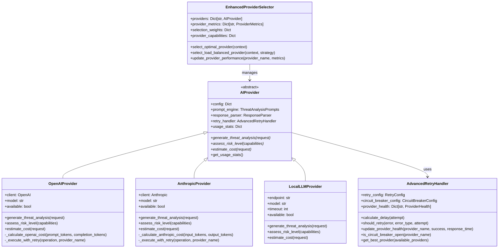
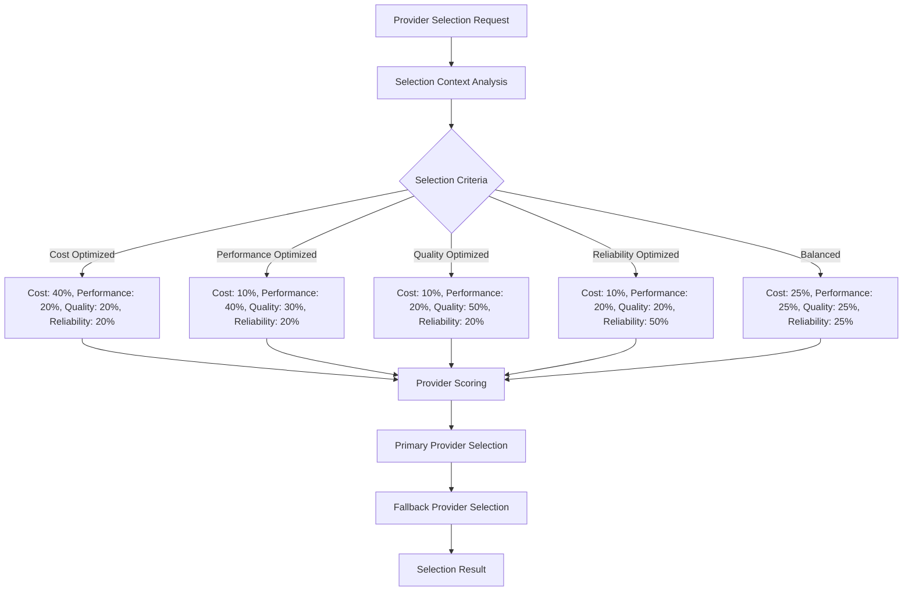
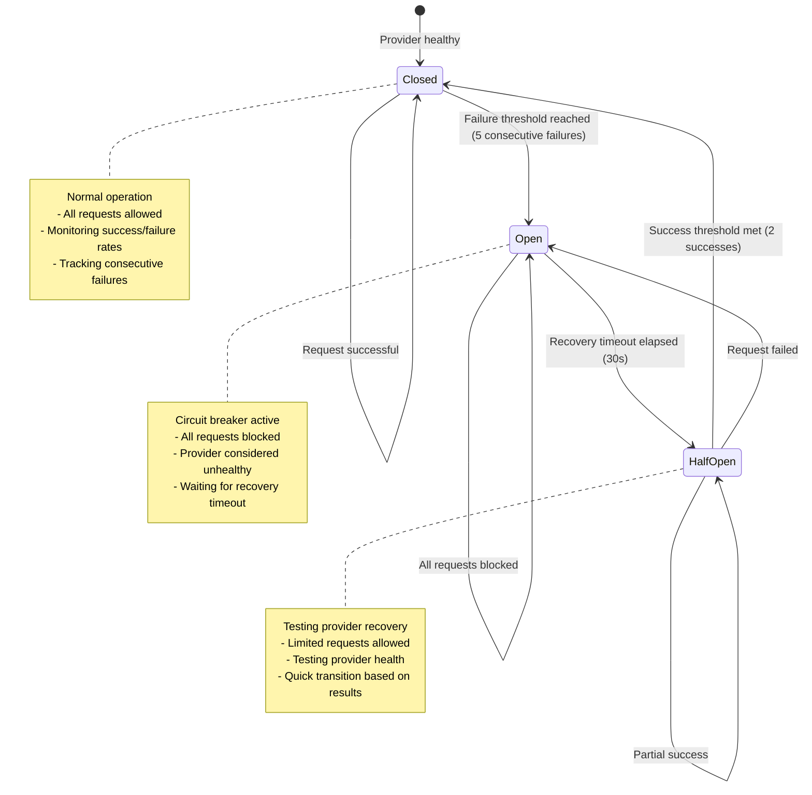
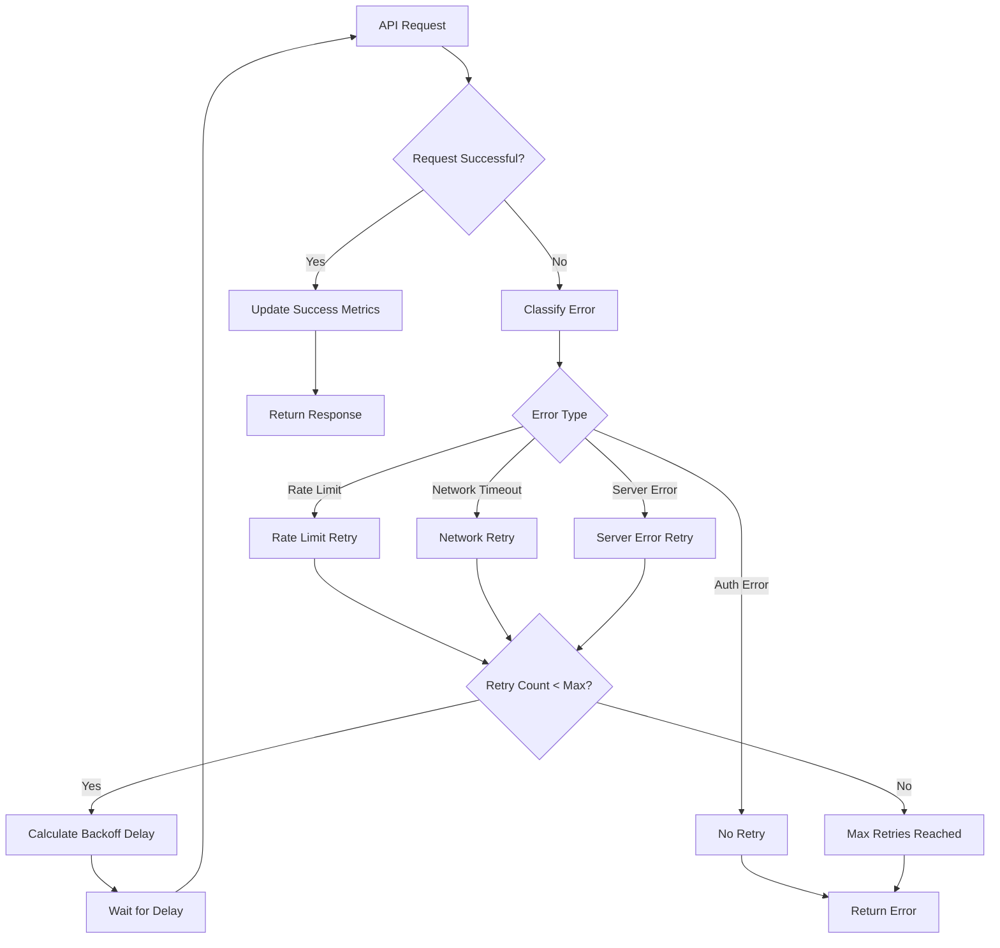
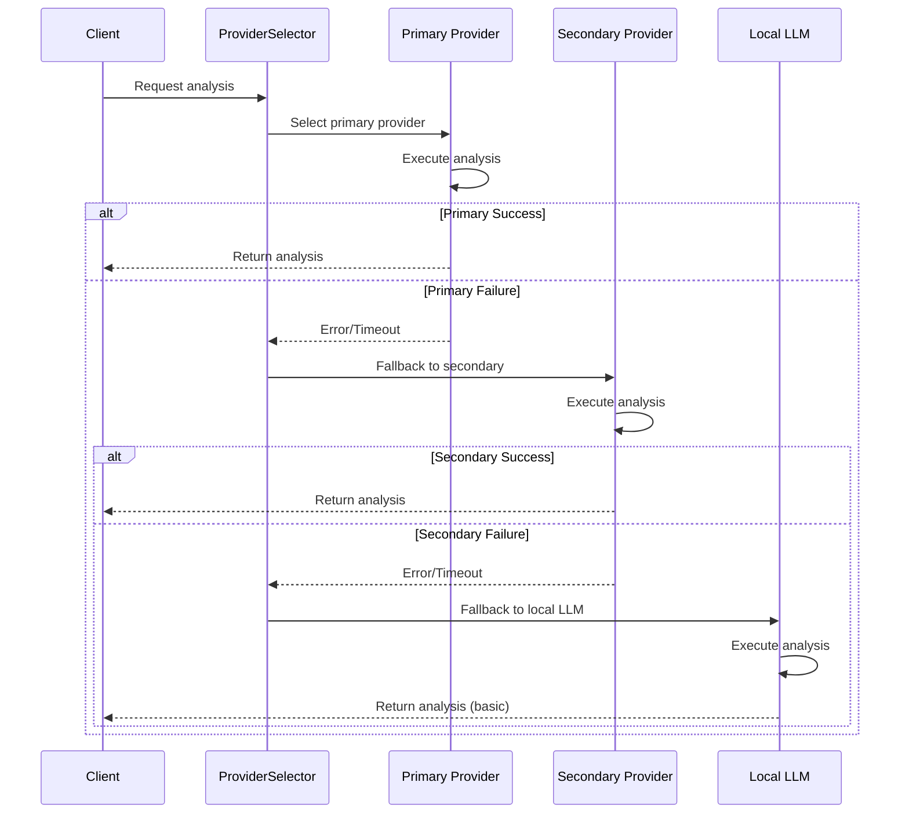

# AI Provider Architecture

## Overview

The AI Provider Architecture implements a sophisticated multi-provider system for AI-powered threat analysis, supporting OpenAI GPT, Anthropic Claude, and local LLM deployments. The architecture includes intelligent provider selection, automatic fallback mechanisms, cost optimization, rate limiting, and comprehensive performance monitoring.

## Provider Hierarchy and Architecture



## Provider Implementations

### 1. OpenAI Provider

```python
# Configuration
{
    "openai_api_key": "sk-...",
    "openai_model": "gpt-4",
    "openai_timeout": 60,
    "max_retry_attempts": 3,
    "circuit_breaker_failure_threshold": 5
}
```

**Features:**
- **Models Supported**: GPT-4, GPT-4-turbo, GPT-3.5-turbo
- **Cost Calculation**: Based on prompt/completion tokens with model-specific pricing
- **API Integration**: Official OpenAI Python client
- **Rate Limiting**: Built-in OpenAI rate limiting handling
- **Streaming Support**: Future enhancement planned

**Cost Structure:**
```python
def _calculate_openai_cost(self, prompt_tokens: int, completion_tokens: int) -> float:
    if "gpt-4" in self.model:
        prompt_cost = prompt_tokens * 0.00003  # $0.03 per 1K tokens
        completion_cost = completion_tokens * 0.00006  # $0.06 per 1K tokens
    elif "gpt-3.5-turbo" in self.model:
        prompt_cost = prompt_tokens * 0.0000015  # $0.0015 per 1K tokens
        completion_cost = completion_tokens * 0.000002  # $0.002 per 1K tokens
    return prompt_cost + completion_cost
```

### 2. Anthropic Provider

```python
# Configuration
{
    "anthropic_api_key": "sk-ant-...",
    "anthropic_model": "claude-3-5-sonnet-latest",
    "anthropic_timeout": 60,
    "max_retry_attempts": 3,
    "circuit_breaker_failure_threshold": 5
}
```

**Features:**
- **Models Supported**: Claude-3-5-Sonnet, Claude-3-Opus, Claude-3-Haiku
- **API Key Sources**: ANTHROPIC_API_KEY, AI_ANTHROPIC_API_KEY environment variables
- **Cost Calculation**: Based on input/output tokens with model-specific pricing
- **System Prompts**: Optimized for Claude's system prompt architecture
- **Context Length**: Extended context window support

**Cost Structure:**
```python
def _calculate_anthropic_cost(self, input_tokens: int, output_tokens: int) -> float:
    if "claude-3-opus" in self.model:
        input_cost = input_tokens * 0.000015  # $0.015 per 1K tokens
        output_cost = output_tokens * 0.000075  # $0.075 per 1K tokens
    elif "claude-3-5-sonnet" in self.model:
        input_cost = input_tokens * 0.000003  # $0.003 per 1K tokens
        output_cost = output_tokens * 0.000015  # $0.015 per 1K tokens
    return input_cost + output_cost
```

### 3. Local LLM Provider

```python
# Configuration
{
    "endpoint": "http://localhost:11434",
    "model": "llama2",
    "timeout": 60
}
```

**Features:**
- **Deployment**: Air-gapped and on-premises support
- **Models**: Ollama, LlamaCpp, custom REST API endpoints
- **Cost**: Zero cost (local compute)
- **Privacy**: Full data privacy and control
- **Customization**: Custom model fine-tuning support
- **Offline Operation**: No internet dependency

## Provider Selection Algorithm

### Selection Criteria and Weights



### Provider Scoring Algorithm

```python
def _calculate_provider_score(self, provider_name: str, context: SelectionContext) -> float:
    metrics = self.provider_metrics[provider_name]
    weights = self.selection_weights[context.selection_criteria]
    
    # Cost score (inverse - lower cost = higher score)
    cost_score = 1.0 / (1.0 + metrics.cost_per_analysis) if metrics.cost_per_analysis > 0 else 1.0
    
    # Performance score (inverse response time)
    performance_score = 1.0 / (1.0 + metrics.avg_response_time)
    
    # Quality score
    quality_score = metrics.avg_accuracy_score
    
    # Reliability score
    reliability_score = metrics.success_rate * (1.0 - metrics.circuit_breaker_penalty)
    
    # Weighted combination
    total_score = (
        weights["cost"] * cost_score +
        weights["performance"] * performance_score +
        weights["quality"] * quality_score +
        weights["reliability"] * reliability_score
    )
    
    return total_score
```

### Provider Capabilities Matrix

| Provider | Threat Analysis | Attack Chain | Context Understanding | Cost Tier | Max Concurrent |
|----------|----------------|--------------|---------------------|-----------|----------------|
| OpenAI | Expert | Advanced | Advanced | Premium | 50 |
| Anthropic | Expert | Advanced | Expert | Premium | 30 |
| Local LLM | Standard | Basic | Standard | Free | 5 |

## Circuit Breaker Implementation

### Circuit Breaker States



### Provider Health Monitoring

```python
@dataclass
class ProviderHealth:
    provider_name: str
    total_requests: int = 0
    successful_requests: int = 0
    failed_requests: int = 0
    consecutive_failures: int = 0
    last_success: Optional[datetime] = None
    last_failure: Optional[datetime] = None
    average_response_time: float = 0.0
    circuit_breaker_state: CircuitBreakerState = CircuitBreakerState.CLOSED
    circuit_breaker_until: Optional[datetime] = None
    error_rates: Dict[ErrorType, int] = None
    
    @property
    def success_rate(self) -> float:
        if self.total_requests == 0:
            return 1.0
        return self.successful_requests / self.total_requests
    
    @property
    def is_healthy(self) -> bool:
        return (
            self.circuit_breaker_state == CircuitBreakerState.CLOSED and
            self.consecutive_failures < 3 and
            self.success_rate > 0.7
        )
```

## Retry Logic and Error Handling

### Retry Strategy



### Exponential Backoff Configuration

```python
@dataclass
class RetryConfig:
    max_attempts: int = 3
    base_delay: float = 1.0      # 1 second base delay
    max_delay: float = 60.0      # 60 second maximum delay
    backoff_multiplier: float = 2.0  # Double delay each retry
    jitter: bool = True          # Add randomization to prevent thundering herd
    
def calculate_delay(self, attempt: int) -> float:
    """Calculate exponential backoff delay with jitter."""
    delay = self.retry_config.base_delay * (self.retry_config.backoff_multiplier ** attempt)
    delay = min(delay, self.retry_config.max_delay)
    
    if self.retry_config.jitter:
        jitter_amount = delay * 0.1 * random.random()
        delay += jitter_amount
    
    return delay
```

## Load Balancing Strategies

### 1. Weighted Round Robin

```python
def _select_weighted_round_robin(self, providers: List[str], context: SelectionContext) -> str:
    """Select provider using weighted round robin based on performance."""
    weights = {}
    for provider in providers:
        metrics = self.provider_metrics[provider]
        # Higher success rate and lower response time = higher weight
        weight = metrics.success_rate / max(metrics.avg_response_time, 0.1)
        weights[provider] = weight
    
    # Select based on weighted probability
    total_weight = sum(weights.values())
    if total_weight == 0:
        return random.choice(providers)
    
    # Weighted random selection
    rand_val = random.uniform(0, total_weight)
    cumulative_weight = 0
    for provider, weight in weights.items():
        cumulative_weight += weight
        if rand_val <= cumulative_weight:
            return provider
    
    return providers[-1]  # Fallback
```

### 2. Least Connections

```python
def _select_least_connections(self, providers: List[str]) -> str:
    """Select provider with least active connections."""
    min_connections = float('inf')
    selected_provider = providers[0]
    
    for provider in providers:
        metrics = self.provider_metrics[provider]
        if metrics.active_connections < min_connections:
            min_connections = metrics.active_connections
            selected_provider = provider
    
    return selected_provider
```

### 3. Least Response Time

```python
def _select_least_response_time(self, providers: List[str]) -> str:
    """Select provider with lowest average response time."""
    return min(providers, key=lambda p: self.provider_metrics[p].avg_response_time)
```

## Cost Optimization Strategies

### 1. Dynamic Cost Thresholds

```python
class CostOptimizer:
    def __init__(self, daily_budget: float = 100.0):
        self.daily_budget = daily_budget
        self.current_spend = 0.0
        self.cost_tracking = {}
    
    def should_use_provider(self, provider_name: str, estimated_cost: float) -> bool:
        """Determine if provider should be used based on cost constraints."""
        if self.current_spend + estimated_cost > self.daily_budget:
            return False
        
        # Use cheaper alternatives when approaching budget limits
        budget_remaining_ratio = (self.daily_budget - self.current_spend) / self.daily_budget
        
        if budget_remaining_ratio < 0.2:  # Less than 20% budget remaining
            return provider_name == "local_llm"  # Switch to free local LLM
        elif budget_remaining_ratio < 0.5:  # Less than 50% budget remaining
            return provider_name in ["local_llm", "anthropic"]  # Avoid most expensive
        
        return True  # All providers available
```

### 2. Cost-Performance Optimization

```python
def select_cost_optimized_provider(self, analysis_complexity: str) -> str:
    """Select provider based on cost-performance ratio for analysis complexity."""
    if analysis_complexity == "simple":
        # Use local LLM for simple analyses
        return "local_llm"
    elif analysis_complexity == "medium":
        # Use Anthropic for balanced cost-quality
        return "anthropic"
    else:  # complex analysis
        # Use OpenAI GPT-4 for complex analyses requiring highest quality
        return "openai"
```

## Fallback Mechanism Architecture

### Cascade Fallback Strategy



### Intelligent Fallback Selection

```python
def _select_fallback_providers(self, 
                             primary_provider: str, 
                             provider_scores: Dict[str, float],
                             context: SelectionContext) -> List[str]:
    """Select intelligent fallback providers."""
    # Remove primary provider from candidates
    candidates = {k: v for k, v in provider_scores.items() if k != primary_provider}
    
    # Sort by score (descending)
    sorted_candidates = sorted(candidates.items(), key=lambda x: x[1], reverse=True)
    
    fallback_providers = []
    
    # Add top-scoring provider as first fallback
    if sorted_candidates:
        fallback_providers.append(sorted_candidates[0][0])
    
    # Always include local LLM as final fallback (if not already selected)
    if "local_llm" not in [primary_provider] + fallback_providers:
        fallback_providers.append("local_llm")
    
    return fallback_providers[:2]  # Maximum 2 fallback providers
```

## Performance Monitoring and Analytics

### Real-time Metrics Collection

```python
@dataclass
class ProviderMetrics:
    provider_name: str
    total_requests: int = 0
    total_successes: int = 0
    total_failures: int = 0
    avg_response_time: float = 0.0
    avg_accuracy_score: float = 0.0
    cost_per_analysis: float = 0.0
    success_rate: float = 1.0
    last_success: Optional[datetime] = None
    last_failure: Optional[datetime] = None
    active_connections: int = 0
    rate_limit_hits: int = 0
    circuit_breaker_penalty: float = 0.0
    quality_scores: List[float] = field(default_factory=list)
    response_times: List[float] = field(default_factory=list)
```

### Performance Dashboard Data

```python
def get_provider_analytics(self) -> Dict[str, Any]:
    """Generate comprehensive provider analytics."""
    analytics = {
        "provider_health": {},
        "cost_analysis": {},
        "performance_trends": {},
        "selection_statistics": {}
    }
    
    for provider_name, metrics in self.provider_metrics.items():
        analytics["provider_health"][provider_name] = {
            "success_rate": metrics.success_rate,
            "avg_response_time": metrics.avg_response_time,
            "circuit_breaker_state": self.retry_handler.provider_health.get(
                provider_name, ProviderHealth(provider_name)
            ).circuit_breaker_state.value,
            "consecutive_failures": self.retry_handler.provider_health.get(
                provider_name, ProviderHealth(provider_name)
            ).consecutive_failures,
            "is_healthy": metrics.success_rate > 0.7 and metrics.avg_response_time < 30.0
        }
        
        analytics["cost_analysis"][provider_name] = {
            "cost_per_analysis": metrics.cost_per_analysis,
            "total_cost": metrics.total_requests * metrics.cost_per_analysis,
            "cost_efficiency": metrics.avg_accuracy_score / max(metrics.cost_per_analysis, 0.001)
        }
    
    return analytics
```

## Rate Limiting Implementation

### Provider-Specific Rate Limits

```python
class RateLimiter:
    def __init__(self):
        self.rate_limits = {
            "openai": {"requests_per_minute": 3500, "tokens_per_minute": 350000},
            "anthropic": {"requests_per_minute": 1000, "tokens_per_minute": 100000},
            "local_llm": {"requests_per_minute": 60, "tokens_per_minute": 60000}
        }
        self.usage_tracking = {}
    
    def can_make_request(self, provider_name: str, tokens_required: int) -> bool:
        """Check if request can be made within rate limits."""
        now = datetime.now()
        limits = self.rate_limits.get(provider_name, {})
        
        if provider_name not in self.usage_tracking:
            self.usage_tracking[provider_name] = {
                "requests": [], "tokens": []
            }
        
        tracking = self.usage_tracking[provider_name]
        
        # Clean old entries (older than 1 minute)
        minute_ago = now - timedelta(minutes=1)
        tracking["requests"] = [t for t in tracking["requests"] if t > minute_ago]
        tracking["tokens"] = [t for t in tracking["tokens"] if t[0] > minute_ago]
        
        # Check rate limits
        current_requests = len(tracking["requests"])
        current_tokens = sum(t[1] for t in tracking["tokens"])
        
        if current_requests >= limits.get("requests_per_minute", float('inf')):
            return False
        
        if current_tokens + tokens_required > limits.get("tokens_per_minute", float('inf')):
            return False
        
        return True
    
    def record_request(self, provider_name: str, tokens_used: int):
        """Record request for rate limiting tracking."""
        now = datetime.now()
        if provider_name in self.usage_tracking:
            self.usage_tracking[provider_name]["requests"].append(now)
            self.usage_tracking[provider_name]["tokens"].append((now, tokens_used))
```

## Configuration Management

### Provider Configuration Schema

```yaml
ai_providers:
  primary_provider: "anthropic"
  fallback_provider: "openai"
  
  openai:
    api_key: "${OPENAI_API_KEY}"
    model: "gpt-4"
    timeout: 60
    max_retry_attempts: 3
    circuit_breaker_failure_threshold: 5
    circuit_breaker_recovery_timeout: 30
    
  anthropic:
    api_key: "${ANTHROPIC_API_KEY}"
    model: "claude-3-5-sonnet-latest"
    timeout: 60
    max_retry_attempts: 3
    circuit_breaker_failure_threshold: 5
    circuit_breaker_recovery_timeout: 30
    
  local_llm:
    endpoint: "http://localhost:11434"
    model: "llama2"
    timeout: 120
    max_retry_attempts: 2
    
  selection:
    default_criteria: "balanced"
    cost_optimization: true
    daily_budget_limit: 100.0
    performance_tracking: true
    
  load_balancing:
    strategy: "weighted_round_robin"
    health_check_interval: 30
    enable_adaptive_selection: true
```

## Integration with Threat Analysis Pipeline

### Provider Selection in Analysis Workflow

```python
def _perform_enhanced_ai_analysis(self, 
                                tool_capabilities: ToolCapabilities,
                                environment_context: EnvironmentContext,
                                analysis_type: str) -> ThreatAnalysis:
    """Perform AI analysis with intelligent provider selection."""
    
    # Create selection context
    selection_context = SelectionContext(
        analysis_type=analysis_type,
        complexity_level=self._assess_analysis_complexity(tool_capabilities),
        selection_criteria=self._determine_selection_criteria(environment_context),
        max_cost=self.config.get("max_analysis_cost", 1.0),
        max_response_time=self.config.get("max_response_time", 60.0),
        quality_threshold=0.8
    )
    
    # Select optimal provider
    provider_selection = self.provider_selector.select_optimal_provider(selection_context)
    
    # Build analysis request
    request = AnalysisRequest(
        tool_capabilities=tool_capabilities,
        environment_context=environment_context,
        analysis_type=analysis_type,
        max_tokens=self._calculate_max_tokens(analysis_type),
        temperature=0.1
    )
    
    # Attempt analysis with selected provider
    primary_provider = self.providers[provider_selection.primary_provider]
    
    try:
        response = primary_provider.generate_threat_analysis(request)
        
        if response.parsed_analysis:
            # Update provider performance metrics
            self.provider_selector.update_provider_performance(
                provider_selection.primary_provider,
                response.metadata.analysis_duration,
                True,
                self._calculate_quality_score(response.parsed_analysis),
                response.metadata.cost
            )
            return response.parsed_analysis
        
    except Exception as e:
        logger.warning(f"Primary provider {provider_selection.primary_provider} failed: {e}")
        
        # Try fallback providers
        for fallback_provider in provider_selection.fallback_providers:
            try:
                provider = self.providers[fallback_provider]
                response = provider.generate_threat_analysis(request)
                
                if response.parsed_analysis:
                    logger.info(f"Fallback provider {fallback_provider} succeeded")
                    return response.parsed_analysis
                    
            except Exception as fallback_error:
                logger.warning(f"Fallback provider {fallback_provider} failed: {fallback_error}")
                continue
    
    # All providers failed - create rule-based analysis
    return self._create_rule_based_analysis(tool_capabilities, environment_context)
```

## Summary

The AI Provider Architecture provides:

- **Multi-Provider Support**: Seamless integration with OpenAI, Anthropic, and local LLM providers
- **Intelligent Selection**: Context-aware provider selection based on cost, performance, quality, and reliability
- **Robust Fallback**: Automatic failover with cascading fallback strategies
- **Cost Optimization**: Dynamic cost management with budget controls and usage tracking
- **Performance Monitoring**: Real-time metrics collection and provider health monitoring
- **Rate Limiting**: Provider-specific rate limiting with token usage tracking
- **Circuit Breaker**: Automatic provider circuit breaking for reliability
- **Load Balancing**: Multiple load balancing strategies for optimal resource utilization

This architecture ensures reliable, cost-effective, and high-quality AI-powered threat analysis while maintaining flexibility and scalability across different deployment scenarios. 