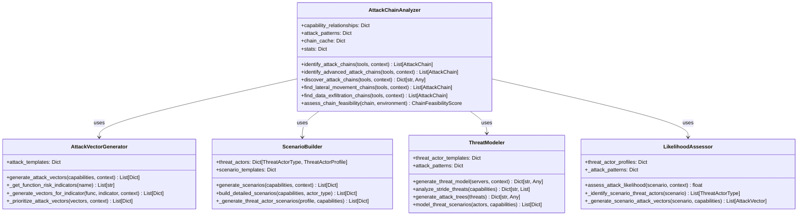
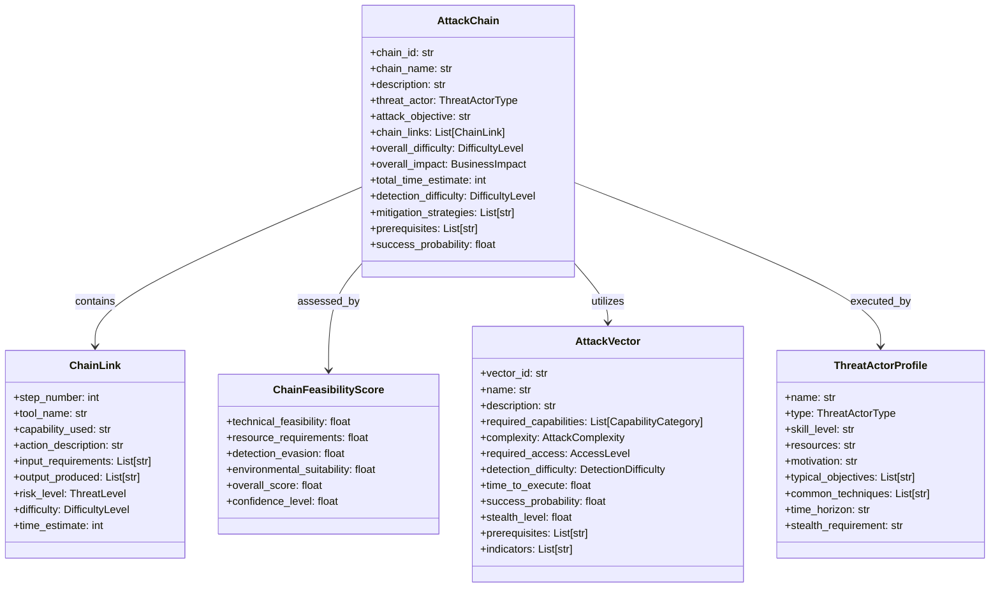
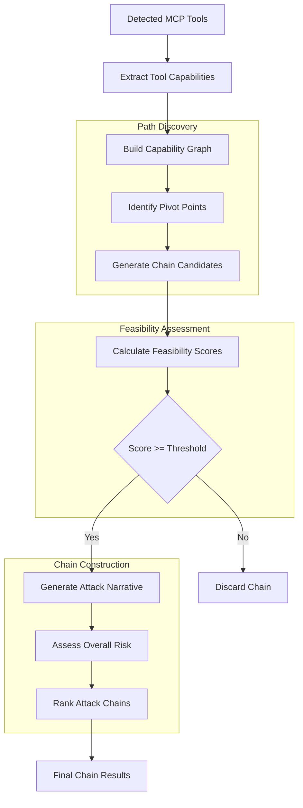

# Attack Chain Analysis - HawkEye AI Threat Analysis

## Overview

The HawkEye Attack Chain Analysis system provides sophisticated multi-step attack scenario modeling, identifying how individual MCP tools can be combined to create complex attack chains. The system models attack path discovery, lateral movement, privilege escalation, and multi-objective attack sequences to provide comprehensive threat intelligence.

## Architecture Components

### 1. Attack Chain Analysis Architecture



### 2. Attack Chain Data Models



### 3. Attack Path Discovery Algorithm



## Core Features

### 1. Multi-Step Attack Chain Discovery

#### Basic Chain Identification

```python
def identify_attack_chains(self, 
                         detected_tools: List[MCPServerInfo],
                         environment_context: EnvironmentContext,
                         max_chain_length: int = 5,
                         min_feasibility_score: float = 0.3) -> List[AttackChain]:
    """
    Identify potential attack chains through multi-tool combinations.
    
    Steps:
    1. Extract tool capabilities from detected servers
    2. Build capability dependency graph
    3. Find attack paths using depth-first search
    4. Convert paths to structured attack chains
    5. Assess feasibility and filter viable chains
    6. Rank chains by risk and complexity
    """
```

#### Advanced Chain Analysis

```python
def identify_advanced_attack_chains(self,
                                  detected_tools: List[MCPServerInfo],
                                  environment_context: EnvironmentContext,
                                  threat_actor_types: List[ThreatActorType] = None,
                                  include_time_based_chains: bool = True,
                                  include_conditional_chains: bool = True) -> List[AttackChain]:
    """
    Advanced attack chain analysis including:
    - Multi-objective attack paths
    - Time-based attack sequences  
    - Conditional attack paths
    - Threat actor-specific chains
    """
```

### 2. Attack Path Discovery

#### Capability Graph Construction

The system builds a directed graph representing how tool capabilities can be chained together:

```python
# Capability relationships example
capability_relationships = {
    "file_read": ["data_analysis", "credential_extraction", "configuration_discovery"],
    "network_access": ["service_enumeration", "lateral_movement", "data_exfiltration"],
    "code_execution": ["privilege_escalation", "persistence", "defense_evasion"],
    "authentication": ["credential_theft", "session_hijacking", "impersonation"]
}
```

#### Path Finding Algorithm

```python
def _dfs_find_paths(self, 
                   graph: Dict[str, List[str]], 
                   current: str, 
                   path: List[str], 
                   all_paths: List[List[str]], 
                   max_length: int) -> None:
    """
    Depth-first search to find all possible attack paths.
    
    - Explores all possible tool combinations
    - Avoids cycles to prevent infinite loops
    - Respects maximum chain length constraints
    - Identifies multi-tool attack sequences
    """
```

### 3. Lateral Movement Analysis

#### Lateral Movement Chain Detection

```python
def find_lateral_movement_chains(self,
                               detected_tools: List[MCPServerInfo],
                               environment_context: EnvironmentContext) -> List[AttackChain]:
    """
    Specialized analysis for lateral movement scenarios.
    
    Focus Areas:
    - Network access capabilities
    - System information gathering
    - File system access
    - Code execution opportunities
    """
```

#### Lateral Movement Patterns

```python
lateral_movement_categories = [
    CapabilityCategory.NETWORK_ACCESS,      # Network discovery and access
    CapabilityCategory.SYSTEM_INFORMATION,  # Host enumeration
    CapabilityCategory.FILE_SYSTEM,         # Credential hunting
    CapabilityCategory.CODE_EXECUTION       # Remote execution
]
```

### 4. Privilege Escalation Modeling

#### Privilege Escalation Attack Vectors

```python
privilege_escalation_vector = AttackVector(
    vector_id="priv_escalation",
    name="Privilege Escalation",
    description="Gaining higher-level system permissions",
    required_capabilities=[CapabilityCategory.CODE_EXECUTION],
    complexity=AttackComplexity.HIGH,
    required_access=AccessLevel.USER,
    detection_difficulty=DetectionDifficulty.HARD,
    time_to_execute=8.0,
    success_probability=0.6,
    stealth_level=0.7,
    prerequisites=["initial_access", "vulnerability_research"],
    indicators=["unusual_process_elevation", "permission_changes"]
)
```

#### Escalation Chain Construction

The system identifies tools that can be combined for privilege escalation:

1. **Initial Access**: Tools providing basic system access
2. **Information Gathering**: System enumeration capabilities
3. **Vulnerability Exploitation**: Code execution or configuration abuse
4. **Privilege Validation**: Verification of elevated access

### 5. Multi-Objective Attack Scenarios

#### Threat Actor Profiling

```python
threat_actor_profiles = {
    ThreatActorType.INSIDER_THREAT: ThreatActorProfile(
        name="Malicious Insider",
        skill_level="intermediate",
        resources="moderate",
        motivation="Financial gain, revenge, espionage",
        typical_objectives=["Data theft", "Sabotage", "Fraud"],
        common_techniques=["Privilege abuse", "Data exfiltration"],
        time_horizon="days",
        stealth_requirement="high"
    ),
    
    ThreatActorType.NATION_STATE: ThreatActorProfile(
        name="Advanced Persistent Threat",
        skill_level="expert",
        resources="unlimited",
        motivation="Espionage, disruption, intelligence gathering",
        typical_objectives=["Long-term access", "Data collection"],
        common_techniques=["Advanced techniques", "Zero-day exploits"],
        time_horizon="months",
        stealth_requirement="critical"
    )
}
```

#### Scenario Generation

```python
def generate_scenarios(self, 
                      tool_capabilities: ToolCapabilities,
                      environment_context: EnvironmentContext,
                      threat_actor_type: ThreatActorType = None,
                      max_scenarios: int = 5) -> List[Dict[str, Any]]:
    """
    Generate realistic attack scenarios based on:
    - Available tool capabilities
    - Environment characteristics
    - Threat actor motivations and skills
    - Business context and assets
    """
```

## Attack Pattern Categories

### 1. Reconnaissance and Discovery

**Pattern**: Information Gathering → Target Analysis → Attack Vector Selection

**Example Chain**:
1. **System Information Tool**: Gather host details, running processes
2. **Network Access Tool**: Discover network topology and services  
3. **File System Tool**: Search for configuration files and credentials
4. **Analysis Tool**: Process gathered information for attack planning

### 2. Initial Access and Persistence

**Pattern**: Initial Compromise → Persistence Establishment → Defense Evasion

**Example Chain**:
1. **Authentication Tool**: Exploit weak credentials or authentication bypass
2. **Code Execution Tool**: Execute initial payload or commands
3. **File System Tool**: Install backdoors or persistence mechanisms
4. **System Configuration Tool**: Modify system settings for stealth

### 3. Privilege Escalation and Lateral Movement

**Pattern**: Privilege Escalation → Credential Harvesting → Lateral Movement

**Example Chain**:
1. **Code Execution Tool**: Exploit local privilege escalation vulnerability
2. **System Information Tool**: Enumerate elevated privileges and access
3. **File System Tool**: Access credential stores and configuration files
4. **Network Access Tool**: Use credentials for lateral movement

### 4. Data Exfiltration and Impact

**Pattern**: Data Discovery → Collection → Exfiltration → Impact

**Example Chain**:
1. **File System Tool**: Search for and identify sensitive data
2. **Data Processing Tool**: Collect and package target data
3. **Network Access Tool**: Establish exfiltration channel
4. **Encryption Tool**: Encrypt or destroy data for impact

## Feasibility Assessment

### 1. Technical Feasibility Factors

```python
def _assess_technical_feasibility(self, chain: AttackChain, 
                                environment: EnvironmentContext) -> float:
    """
    Assess technical feasibility based on:
    - Tool compatibility and data flow
    - Required technical skills
    - System dependencies
    - Environmental constraints
    """
```

**Factors Considered**:
- **Tool Compatibility**: Can tools actually chain together?
- **Data Flow Validation**: Does output of Tool A work as input for Tool B?
- **Skill Requirements**: Does threat actor have required capabilities?
- **System Dependencies**: Are required system components available?

### 2. Environmental Suitability

```python
def _assess_environmental_suitability(self, chain: AttackChain,
                                    environment: EnvironmentContext) -> float:
    """
    Assess how well the chain fits the target environment:
    - Deployment type compatibility
    - Security posture alignment  
    - Network exposure considerations
    - Monitoring and detection capabilities
    """
```

**Assessment Criteria**:
- **Deployment Type**: Cloud vs on-premise compatibility
- **Security Posture**: Alignment with security controls
- **Network Exposure**: Internet-facing vs internal systems
- **Monitoring Coverage**: Detection system capabilities

### 3. Resource Requirements

```python
def _assess_resource_requirements(self, chain: AttackChain,
                                environment: EnvironmentContext) -> float:
    """
    Evaluate resource requirements:
    - Time investment needed
    - Technical skill levels required
    - Tool availability and setup
    - Infrastructure requirements
    """
```

## Advanced Chain Analysis

### 1. Time-Based Attack Sequences

```python
def _find_time_based_attack_sequences(self,
                                    capability_graph: Dict,
                                    tool_capabilities: Dict,
                                    environment_context: EnvironmentContext) -> List[Dict]:
    """
    Identify attack sequences that exploit timing dependencies:
    - Maintenance windows
    - Backup schedules  
    - User activity patterns
    - System update cycles
    """
```

### 2. Conditional Attack Paths

```python
def _find_conditional_attack_paths(self,
                                 capability_graph: Dict,
                                 tool_capabilities: Dict,
                                 environment_context: EnvironmentContext) -> List[Dict]:
    """
    Find attack paths with conditional branching:
    - Success/failure scenarios
    - Alternative attack methods
    - Adaptive attack strategies
    - Fallback mechanisms
    """
```

### 3. Multi-Objective Attacks

```python
def _find_multi_objective_paths(self,
                              capability_graph: Dict,
                              tool_capabilities: Dict,
                              environment_context: EnvironmentContext) -> List[Dict]:
    """
    Identify attack chains targeting multiple objectives:
    - Data theft + system disruption
    - Reconnaissance + persistence
    - Privilege escalation + lateral movement
    - Collection + exfiltration
    """
```

## Chain Narrative Generation

### 1. Attack Progression Narratives

```python
def _generate_attack_progression_narrative(self,
                                         chain: Dict,
                                         environment_context: EnvironmentContext) -> str:
    """
    Generate detailed narrative describing:
    - Step-by-step attack progression
    - Tool usage and outputs
    - Decision points and alternatives
    - Timeline and duration estimates
    - Detection opportunities
    """
```

### 2. Business Impact Stories

The system generates business-focused narratives explaining:
- **Initial Compromise**: How attackers gain access
- **Progression Timeline**: Step-by-step attack evolution
- **Business Consequences**: Impact on operations and data
- **Detection Points**: Where attacks might be caught
- **Mitigation Opportunities**: How to break the attack chain

## Performance Characteristics

### 1. Chain Discovery Performance

**Small Environments** (< 10 tools):
- Analysis time: 30-60 seconds
- Memory usage: 10-20MB
- Chains discovered: 5-15 viable chains

**Medium Environments** (10-50 tools):
- Analysis time: 2-5 minutes
- Memory usage: 50-100MB  
- Chains discovered: 15-50 viable chains

**Large Environments** (> 50 tools):
- Analysis time: 5-15 minutes
- Memory usage: 100-500MB
- Chains discovered: 50-200 viable chains

### 2. Optimization Strategies

**Graph Pruning**:
- Remove low-probability paths early
- Filter based on environmental constraints
- Limit chain depth for performance

**Caching**:
- Cache feasibility assessments
- Store capability relationship mappings
- Reuse threat actor profiles

**Parallel Processing**:
- Concurrent path exploration
- Parallel feasibility assessment
- Distributed chain generation

## Integration with Threat Analysis

### 1. Pipeline Integration

```python
# Attack chain analysis in threat analysis pipeline
chain_analyzer = AttackChainAnalyzer()
attack_chains = chain_analyzer.discover_attack_chains(
    detected_tools=mcp_servers,
    environment_context=environment,
    max_chain_depth=5,
    min_chain_score=0.4
)

# Generate narratives for each chain
for chain in attack_chains:
    narrative = chain_analyzer._generate_attack_progression_narrative(
        chain, environment
    )
    chain['detailed_narrative'] = narrative
```

### 2. Report Generation

Attack chain analysis integrates with report generation to provide:
- **Executive Summary**: High-level chain risks and priorities
- **Technical Details**: Step-by-step attack progression
- **Mitigation Guidance**: Specific countermeasures for each chain
- **Risk Assessment**: Quantitative risk scoring for chains

## Security Implications

### 1. Chain Complexity Assessment

The system evaluates attack chain complexity across multiple dimensions:
- **Technical Complexity**: Skill level required for execution
- **Operational Security**: Stealth and detection evasion requirements
- **Resource Requirements**: Time, tools, and infrastructure needed
- **Success Probability**: Likelihood of successful chain execution

### 2. Defense Strategy Generation

For each identified attack chain, the system generates:
- **Prevention Controls**: Security measures to prevent chain initiation
- **Detection Strategies**: Monitoring approaches to identify chain progression
- **Response Procedures**: Incident response actions to break attack chains
- **Recovery Plans**: Business continuity measures post-compromise

## Future Enhancements

### 1. Machine Learning Integration

**Planned Capabilities**:
- **Pattern Recognition**: ML-based attack pattern identification
- **Probability Modeling**: Statistical models for chain success rates
- **Adaptive Analysis**: Learning from historical attack data
- **Behavioral Analysis**: User and system behavior modeling

### 2. Enhanced Modeling

**Advanced Features**:
- **Quantum-Resistant Analysis**: Post-quantum cryptography considerations
- **IoT Chain Analysis**: Internet of Things device attack chains
- **Cloud-Native Patterns**: Container and serverless attack chains
- **Supply Chain Integration**: Third-party dependency attack chains

This comprehensive attack chain analysis system provides security teams with detailed understanding of how individual MCP tools can be combined into sophisticated multi-step attacks, enabling proactive defense strategy development and risk mitigation planning. 