# AI Threat Analysis Class Diagram

## Overview

The HawkEye AI threat analysis module implements a sophisticated architecture for AI-powered security threat analysis of MCP servers. The system uses multiple AI providers, advanced prompt engineering, capability analysis, and threat modeling to generate comprehensive security assessments. This document provides detailed class diagrams and architectural analysis of the AI threat analysis components.

## High-Level Architecture

The AI threat analysis module follows a layered architecture with clear separation between analysis orchestration, AI provider abstraction, data processing, and result generation:

1. **Orchestration Layer**: Main analyzer and coordinator components
2. **AI Provider Layer**: Abstract provider interface with multiple implementations
3. **Analysis Layer**: Specialized analyzers for capabilities, threats, and attack chains
4. **Data Layer**: Models, caches, and data structures
5. **Support Layer**: Utilities, monitoring, and optimization components

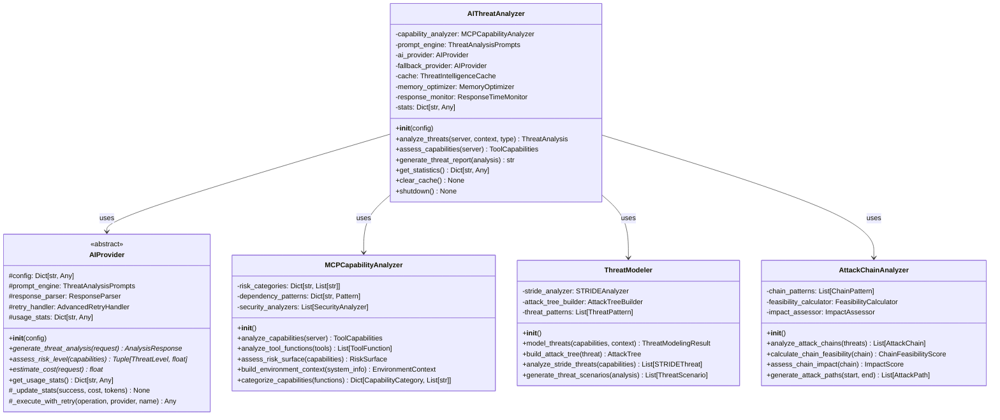

## AI Provider Hierarchy

### Abstract Provider Interface

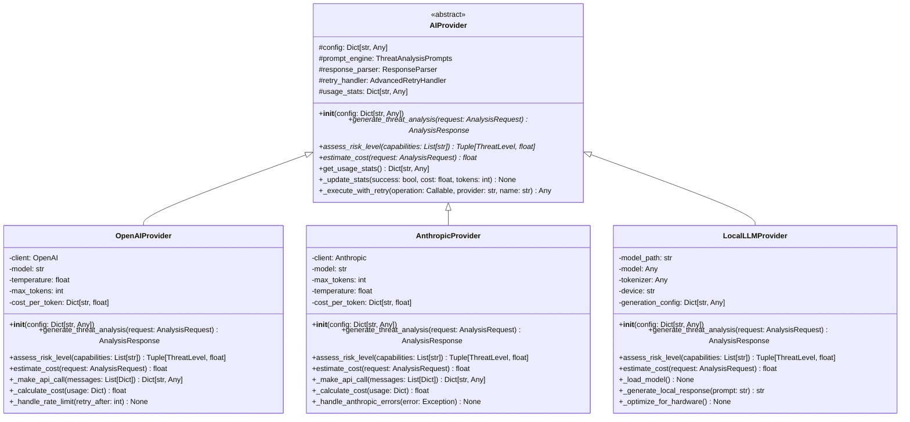

### Provider Support Components

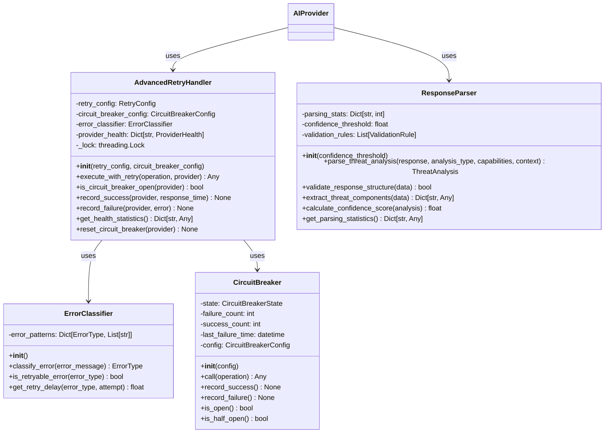

## Analysis Components

### Capability Analysis System

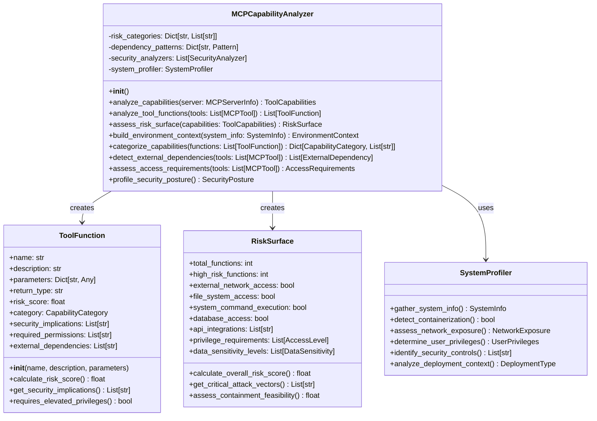

### Threat Modeling Engine

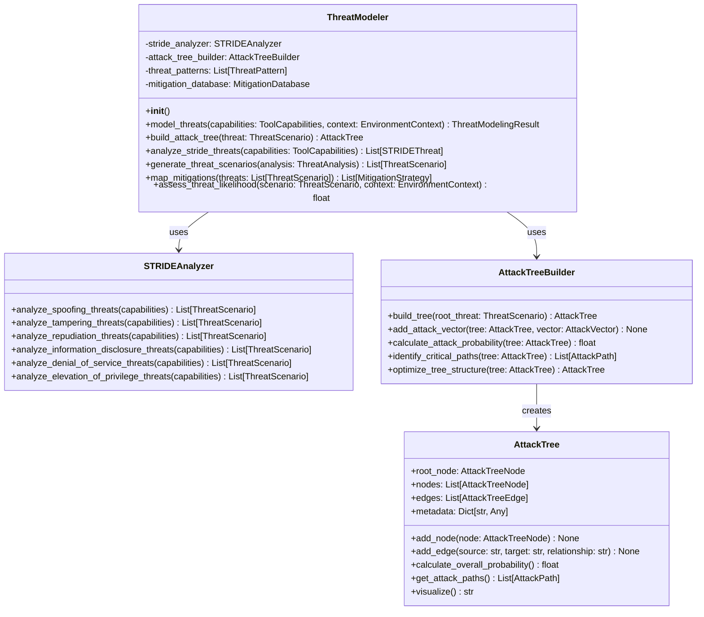

### Attack Chain Analysis System

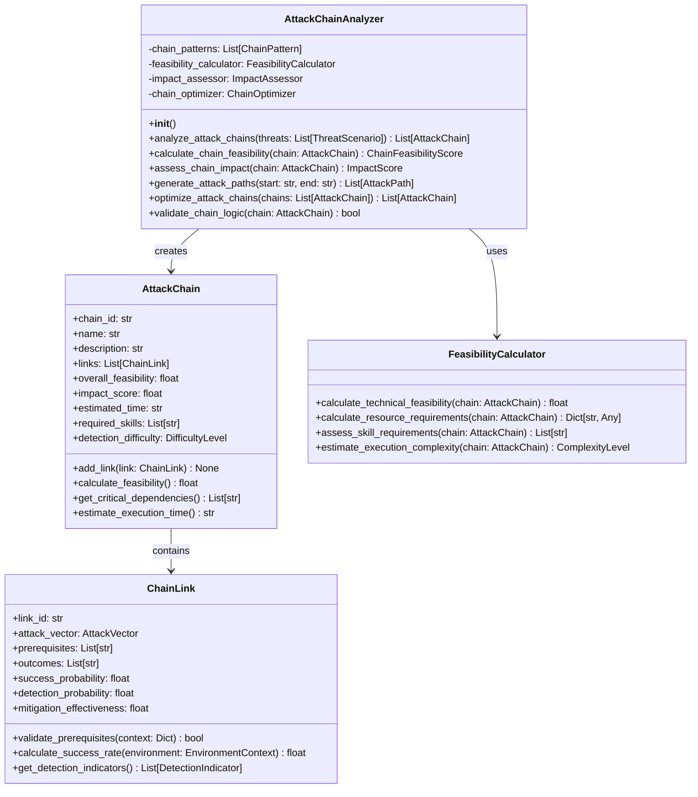

## Data Models and Structures

### Core Analysis Data Models

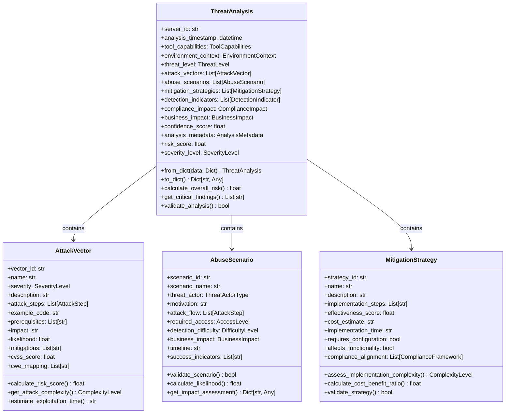

### Environment and Context Models

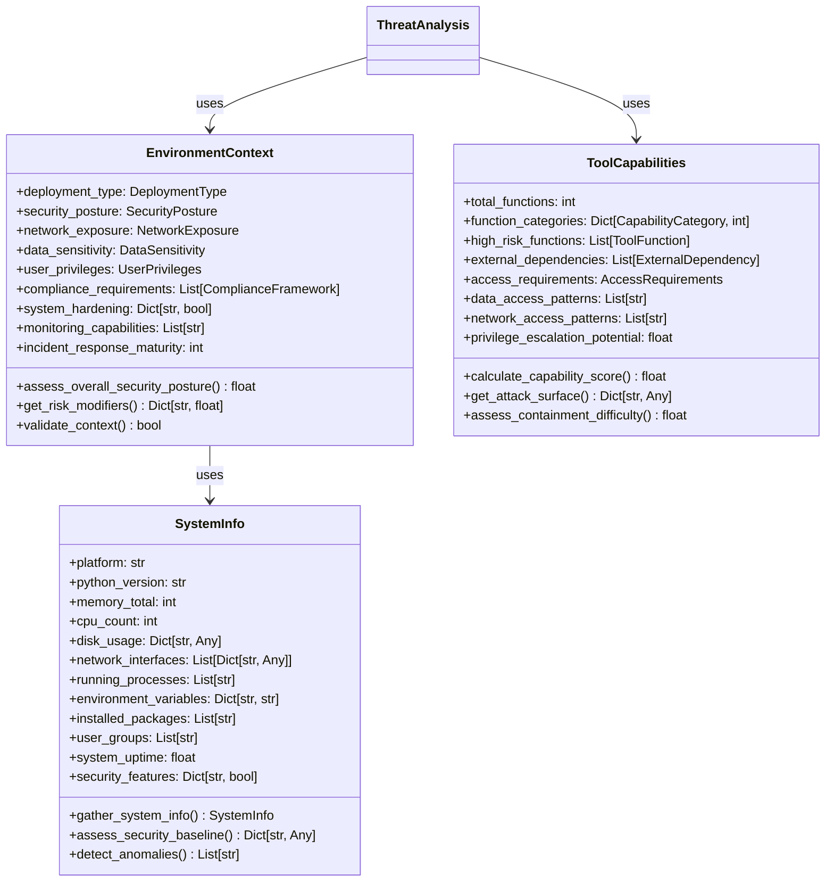

## Support and Utility Components

### Caching and Optimization

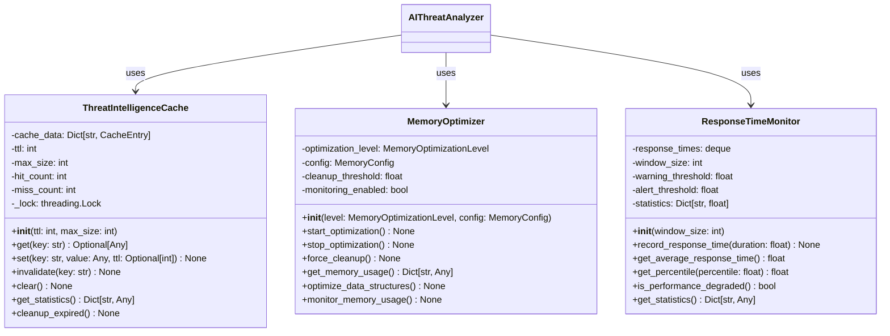

### Advanced Analysis Components

```mermaid
classDiagram
    class EnhancedProviderSelector {
        -selection_criteria: SelectionCriteria
        -provider_metrics: Dict[str, ProviderMetrics]
        -load_balancer: ProviderLoadBalancer
        
        +__init__(criteria: SelectionCriteria)
        +select_provider(request: AnalysisRequest) ProviderSelection
        +update_provider_metrics(provider: str, metrics: Dict) None
        +get_optimal_provider_mix() List[str]
        +assess_provider_health() Dict[str, bool]
    }
    
    class RiskPrioritizationAlgorithm {
        -technical_weight: float
        -business_weight: float
        -likelihood_weight: float
        -environmental_modifiers: EnvironmentalModifiers
        
        +__init__(weights: Dict[str, float])
        +prioritize_threats(threats: List[ThreatAnalysis]) List[PrioritizedThreat]
        +calculate_priority_score(threat: ThreatAnalysis) float
        +apply_environmental_modifiers(score: float, context: EnvironmentContext) float
        +generate_priority_matrix() PriorityMatrix
    }
    
    class ThreatIntelligenceDB {
        -threat_patterns: List[ThreatPattern]
        -similarity_engine: SimilarityEngine
        -learning_metrics: LearningMetrics
        -pattern_cache: Dict[str, Any]
        
        +__init__()
        +find_similar_threats(analysis: ThreatAnalysis) List[SimilarityMatch]
        +update_threat_patterns(new_pattern: ThreatPattern) None
        +learn_from_analysis(analysis: ThreatAnalysis) None
        +get_threat_statistics() Dict[str, Any]
    }
    
    class DynamicExampleGenerator {
        -example_templates: Dict[ExampleType, List[str]]
        -code_generators: Dict[ProgrammingLanguage, CodeGenerator]
        -context_analyzer: ContextAnalyzer
        
        +__init__()
        +generate_examples(threat: AttackVector, context: ExampleGenerationContext) List[GeneratedExample]
        +create_code_snippet(vector: AttackVector, language: ProgrammingLanguage) CodeSnippet
        +adapt_example_to_context(example: GeneratedExample, context: Dict) GeneratedExample
    }
    
    AIThreatAnalyzer --> EnhancedProviderSelector : uses
    AIThreatAnalyzer --> RiskPrioritizationAlgorithm : uses
    AIThreatAnalyzer --> ThreatIntelligenceDB : uses
    AIThreatAnalyzer --> DynamicExampleGenerator : uses
```

## Component Interaction Flow

### Threat Analysis Orchestration Flow

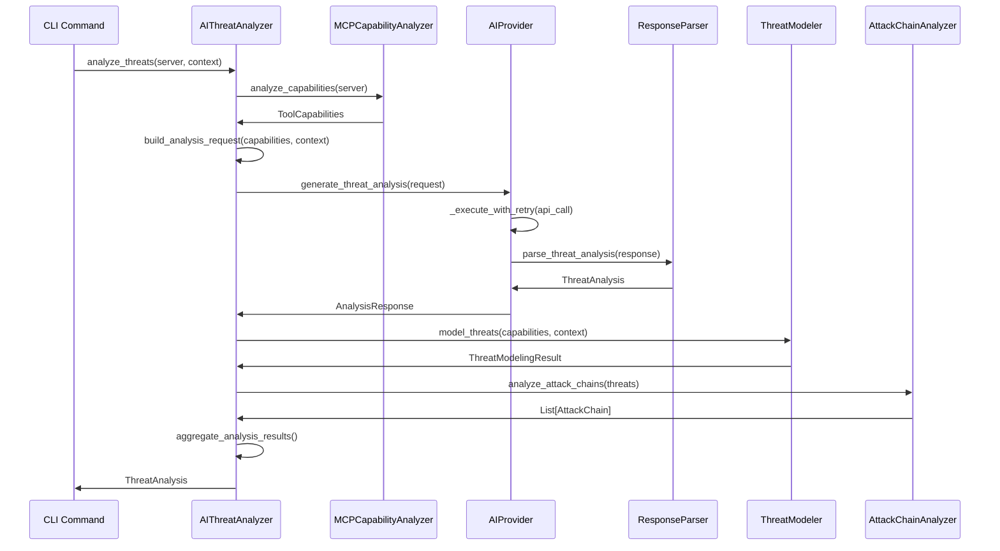

### Provider Selection and Failover

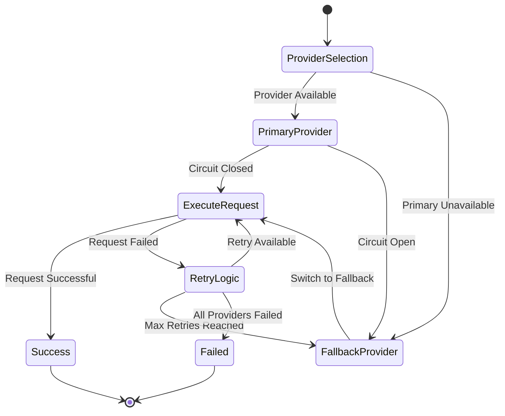

### Memory Optimization Lifecycle

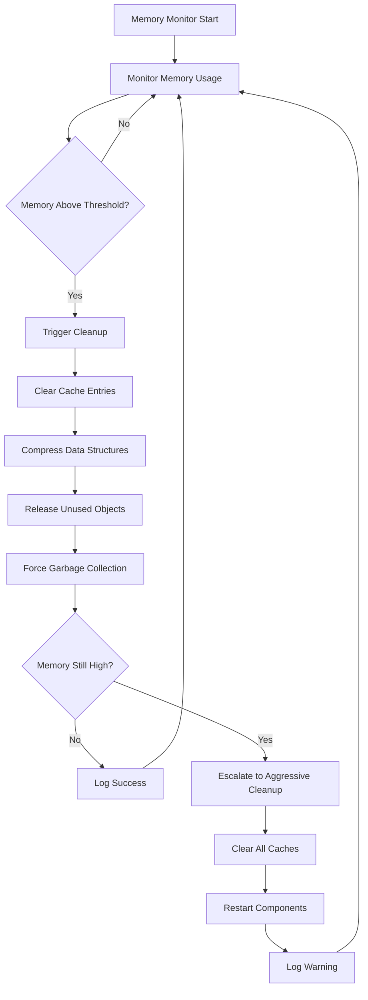

## Performance Characteristics

### Concurrent Processing Architecture

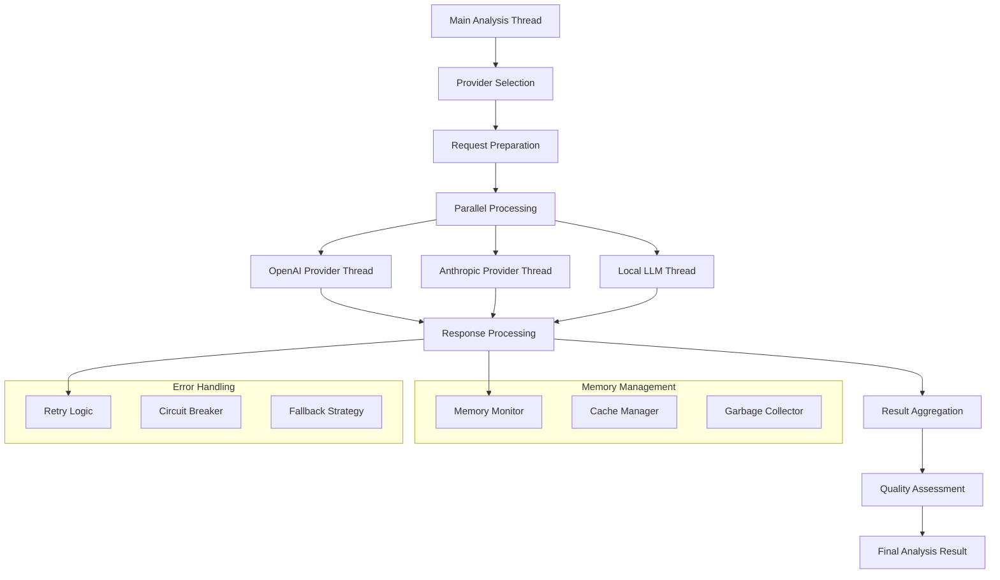

### Optimization Strategies

**Performance Optimizations**:
- **Provider Load Balancing**: Distribute requests across multiple AI providers
- **Response Caching**: Cache similar analysis requests to reduce API calls
- **Memory Management**: Proactive memory cleanup and optimization
- **Circuit Breakers**: Prevent cascading failures in provider chains
- **Parallel Processing**: Concurrent analysis of multiple components

**Cost Optimizations**:
- **Request Batching**: Combine related analysis requests
- **Smart Provider Selection**: Choose cost-effective providers based on request type
- **Token Optimization**: Minimize prompt length while maintaining quality
- **Caching Strategy**: Reduce redundant API calls through intelligent caching

### Configuration and Extensibility

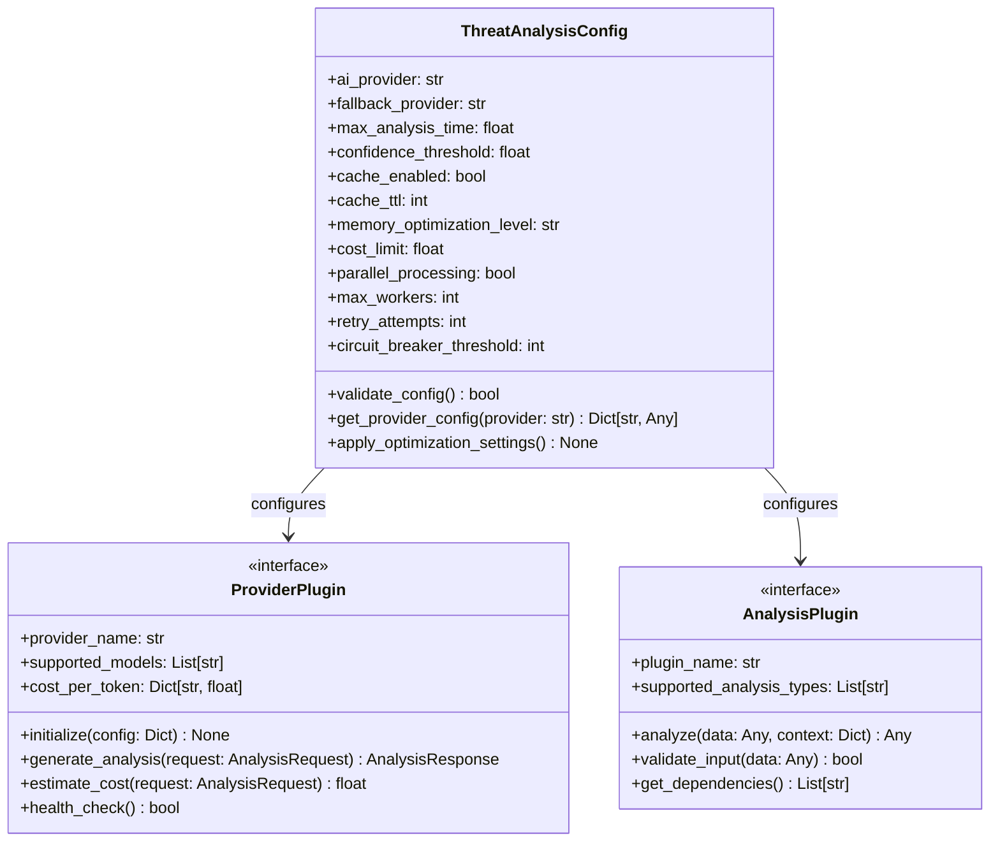

## Testing Architecture

### Unit Test Structure

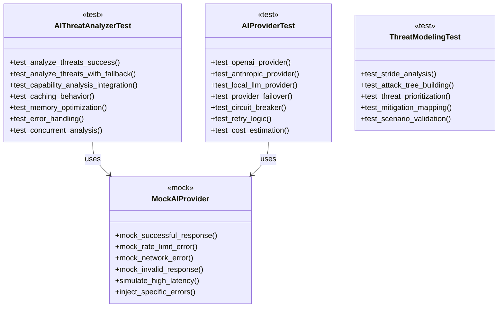

### Integration Testing Strategy

```python
class ThreatAnalysisIntegrationTest:
    """Integration tests for AI threat analysis system."""
    
    def test_end_to_end_analysis(self):
        """Test complete threat analysis workflow."""
        
        # Setup test MCP server
        test_server = MCPServerInfo(
            server_id="test-server",
            tools=[
                MCPTool(name="file_read", description="Read file contents"),
                MCPTool(name="execute_command", description="Execute system command"),
                MCPTool(name="network_request", description="Make HTTP requests")
            ],
            capabilities=["file_operations", "system_commands", "network_access"]
        )
        
        # Initialize analyzer with test configuration
        config = {
            "ai_provider": "mock",
            "enable_caching": True,
            "memory_optimization_level": "standard"
        }
        analyzer = AIThreatAnalyzer(config)
        
        # Execute analysis
        result = analyzer.analyze_threats(
            test_server,
            environment_context=EnvironmentContext(
                deployment_type=DeploymentType.CLOUD,
                security_posture=SecurityPosture.BASIC
            ),
            analysis_type="comprehensive"
        )
        
        # Validate results
        assert isinstance(result, ThreatAnalysis)
        assert result.threat_level in [ThreatLevel.LOW, ThreatLevel.MEDIUM, ThreatLevel.HIGH, ThreatLevel.CRITICAL]
        assert len(result.attack_vectors) > 0
        assert len(result.mitigation_strategies) > 0
        assert result.confidence_score >= 0.0 and result.confidence_score <= 1.0
        
        # Validate analysis components
        assert result.tool_capabilities.total_functions == 3
        assert CapabilityCategory.FILE_OPERATIONS in result.tool_capabilities.function_categories
        assert CapabilityCategory.SYSTEM_COMMANDS in result.tool_capabilities.function_categories
        
    def test_provider_failover_scenario(self):
        """Test AI provider failover behavior."""
        
        # Configure primary provider to fail
        config = {
            "ai_provider": "failing_provider",
            "fallback_provider": "mock_provider"
        }
        
        analyzer = AIThreatAnalyzer(config)
        
        # Simulate provider failure
        with patch.object(analyzer.ai_provider, 'generate_threat_analysis') as mock_primary:
            mock_primary.side_effect = Exception("Provider unavailable")
            
            # Analysis should succeed using fallback
            result = analyzer.analyze_threats(test_server)
            
            # Verify fallback was used
            assert result is not None
            assert analyzer.get_statistics()['fallback_usage_count'] > 0
    
    def test_concurrent_analysis_performance(self):
        """Test concurrent analysis performance and correctness."""
        
        servers = [create_test_server(f"server-{i}") for i in range(10)]
        analyzer = AIThreatAnalyzer({"parallel_processing": True, "max_workers": 3})
        
        start_time = time.time()
        results = []
        
        with concurrent.futures.ThreadPoolExecutor(max_workers=3) as executor:
            futures = [
                executor.submit(analyzer.analyze_threats, server)
                for server in servers
            ]
            
            for future in concurrent.futures.as_completed(futures):
                result = future.result()
                results.append(result)
        
        duration = time.time() - start_time
        
        # Validate results
        assert len(results) == 10
        assert all(isinstance(r, ThreatAnalysis) for r in results)
        
        # Check performance improvement from concurrency
        assert duration < 30.0  # Should complete within reasonable time
        
        # Validate resource usage
        stats = analyzer.get_statistics()
        assert stats['concurrent_analyses'] == 10
        assert stats['memory_peak_usage'] < 500 * 1024 * 1024  # < 500MB
```

## Conclusion

The HawkEye AI threat analysis architecture demonstrates a sophisticated, enterprise-grade approach to AI-powered security analysis with the following key strengths:

**Multi-Provider AI Architecture**:
- **Abstract Provider Interface**: Clean abstraction supporting OpenAI, Anthropic, and local LLM providers
- **Intelligent Provider Selection**: Automatic failover and load balancing across providers
- **Circuit Breaker Pattern**: Protection against cascading failures
- **Advanced Retry Logic**: Exponential backoff with jitter and error classification

**Comprehensive Analysis Framework**:
- **Capability Analysis**: Deep analysis of MCP tool capabilities and risk surfaces
- **Threat Modeling**: STRIDE-based threat analysis with attack tree generation
- **Attack Chain Analysis**: Multi-step attack scenario modeling with feasibility assessment
- **Risk Prioritization**: Business-context-aware threat prioritization

**Enterprise-Grade Features**:
- **Memory Optimization**: Proactive memory management with configurable optimization levels
- **Performance Monitoring**: Response time tracking and performance degradation detection
- **Intelligent Caching**: Multi-layer caching with TTL and intelligent invalidation
- **Cost Management**: API cost estimation and budget controls

**Extensibility and Integration**:
- **Plugin Architecture**: Support for custom AI providers and analysis components
- **Configuration Management**: Comprehensive configuration with validation
- **Testing Framework**: Comprehensive unit and integration testing support
- **Monitoring and Observability**: Detailed statistics and health monitoring

**Key Architectural Patterns**:
1. **Abstract Factory Pattern**: AI provider creation and management
2. **Strategy Pattern**: Pluggable analysis algorithms and provider selection
3. **Circuit Breaker Pattern**: Fault tolerance and provider protection
4. **Observer Pattern**: Performance monitoring and health tracking
5. **Template Method Pattern**: Analysis workflow with customization points

The architecture provides a robust foundation for AI-powered threat analysis while maintaining scalability, reliability, and extensibility for future enhancements in security analysis capabilities. 