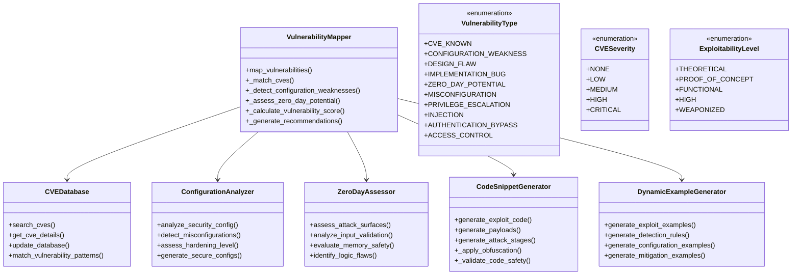
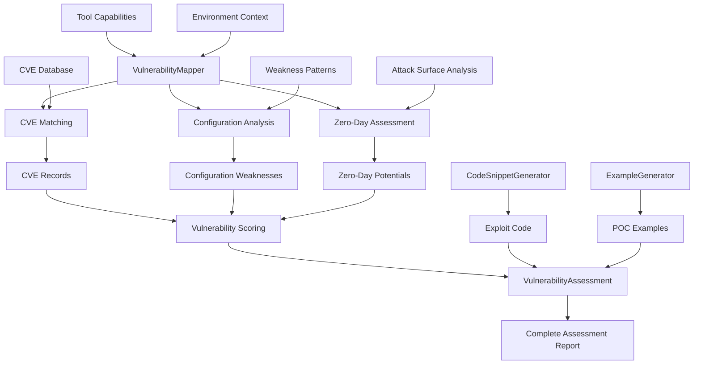
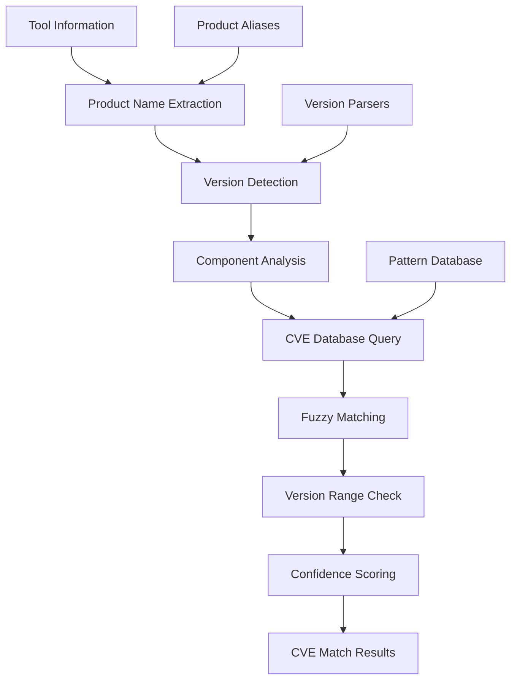
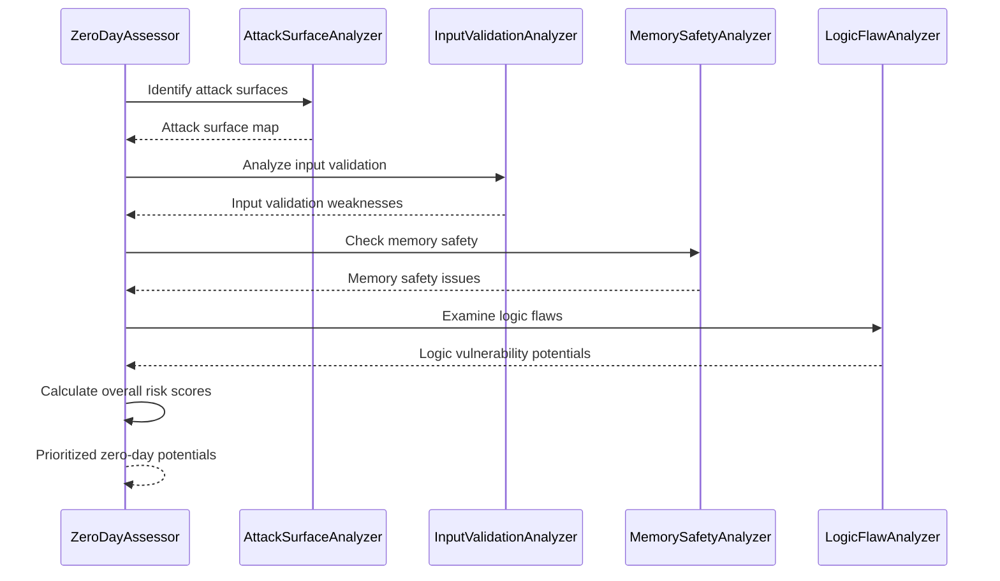

# Vulnerability Assessment System Documentation

## Overview

The Vulnerability Assessment System is a sophisticated component of the AI threat analysis framework that performs comprehensive vulnerability analysis of MCP tools and servers. This system combines CVE database integration, configuration weakness detection, zero-day potential assessment, and automated exploit proof-of-concept generation to provide complete vulnerability intelligence for security teams.

## Architecture

### Core Components



### Data Flow Architecture



## Vulnerability Mapping Engine

### Core Functionality

The `VulnerabilityMapper` class serves as the central engine for vulnerability assessment:

#### `map_vulnerabilities()` Method

```python
def map_vulnerabilities(
    self,
    tool_capabilities: ToolCapabilities,
    environment_context: EnvironmentContext
) -> VulnerabilityAssessment:
    """
    Perform comprehensive vulnerability mapping for MCP tool.
    
    Process:
    1. CVE matching against known vulnerabilities
    2. Configuration weakness detection
    3. Zero-day potential assessment
    4. Overall vulnerability scoring
    5. Recommendation generation
    6. Exploit proof-of-concept creation
    """
```

### Assessment Result Structure

```python
@dataclass
class VulnerabilityAssessment:
    """Complete vulnerability assessment result."""
    tool_name: str
    assessment_id: str
    cve_matches: List[CVERecord]
    configuration_weaknesses: List[ConfigurationWeakness]
    zero_day_potentials: List[ZeroDayPotential]
    overall_vulnerability_score: float  # 0.0-1.0
    highest_severity: CVESeverity
    exploitable_vulnerabilities: int
    critical_issues: List[str]
    recommended_actions: List[str]
    confidence_score: float
```

## CVE Database Integration

### CVE Record Management

The system maintains comprehensive CVE record information:

```python
@dataclass
class CVERecord:
    """Represents a CVE record with detailed information."""
    cve_id: str              # CVE-YYYY-NNNN format  
    description: str         # Vulnerability description
    severity: CVESeverity    # CVSS-based severity
    cvss_score: float        # CVSS v3.1 base score
    published_date: datetime # Publication date
    affected_products: List[str]
    attack_vector: str       # Network, adjacent, local, physical
    attack_complexity: str   # Low, high
    authentication_required: bool
    exploit_available: bool  # Public exploit existence
    exploitability_level: ExploitabilityLevel
    references: List[str]    # External references
    cwe_ids: List[str]      # Common Weakness Enumeration IDs
```

### CVE Matching Algorithm



#### CVE Database Structure

```python
cve_database = {
    "nodejs": [
        {
            "cve_id": "CVE-2023-44487",
            "description": "HTTP/2 Rapid Reset Attack",
            "severity": CVESeverity.HIGH,
            "cvss_score": 7.5,
            "affected_versions": ["< 18.18.2", "< 20.8.1"],
            "attack_vector": "network",
            "exploit_available": True
        }
    ],
    "mcp_server": [
        {
            "cve_id": "CVE-2024-EXAMPLE",
            "description": "MCP Protocol Validation Bypass",
            "severity": CVESeverity.CRITICAL,
            "cvss_score": 9.1,
            "affected_versions": ["< 1.0.4"],
            "attack_vector": "network",
            "exploit_available": False
        }
    ]
}
```

### Severity Classification

```python
class CVESeverity(Enum):
    """CVE severity levels based on CVSS v3.1."""
    NONE = "none"        # 0.0
    LOW = "low"          # 0.1-3.9
    MEDIUM = "medium"    # 4.0-6.9
    HIGH = "high"        # 7.0-8.9
    CRITICAL = "critical" # 9.0-10.0
```

## Configuration Weakness Detection

### Configuration Analysis Framework

The system analyzes security configurations across multiple dimensions:

#### Configuration Risk Categories

```python
class ConfigurationRisk(Enum):
    """Configuration risk levels."""
    SAFE = "safe"           # Secure configuration
    WEAK = "weak"           # Minor security issues
    DANGEROUS = "dangerous" # Significant risks
    CRITICAL = "critical"   # Immediate security threats
```

#### Configuration Weakness Structure

```python
@dataclass
class ConfigurationWeakness:
    """Represents a configuration security weakness."""
    weakness_id: str
    category: str           # auth, network, data, access
    description: str
    risk_level: ConfigurationRisk
    affected_component: str
    current_config: str     # Current configuration value
    recommended_config: str # Secure configuration
    remediation_steps: List[str]
    compliance_impact: List[str]  # Affected compliance frameworks
```

### Common Configuration Weaknesses

#### Authentication Weaknesses
- **Weak Password Policies**: Insufficient complexity requirements
- **Missing MFA**: No multi-factor authentication enforcement
- **Default Credentials**: Unchanged default usernames/passwords
- **Credential Exposure**: Hardcoded credentials in configurations

#### Network Security Weaknesses
- **Unencrypted Channels**: HTTP instead of HTTPS
- **Open Ports**: Unnecessary exposed network services
- **Missing Firewalls**: Inadequate network segmentation
- **Weak TLS**: Outdated TLS versions or weak cipher suites

#### Access Control Weaknesses
- **Overprivileged Access**: Excessive user permissions
- **Missing Authorization**: Inadequate access controls
- **Role Confusion**: Improper role-based access implementation
- **Privilege Escalation**: Paths to elevated privileges

### Configuration Analysis Algorithm

```python
def _detect_configuration_weaknesses(
    self,
    tool_capabilities: ToolCapabilities,
    environment_context: EnvironmentContext
) -> List[ConfigurationWeakness]:
    """
    Detect configuration-related security weaknesses.
    
    Process:
    1. Extract configuration parameters from tool capabilities
    2. Apply security configuration patterns
    3. Check against security best practices
    4. Assess compliance framework requirements
    5. Generate remediation recommendations
    """
```

## Zero-Day Potential Assessment

### Attack Surface Analysis

The system performs comprehensive attack surface analysis to identify potential zero-day vulnerabilities:

```python
@dataclass
class ZeroDayPotential:
    """Represents potential for zero-day vulnerabilities."""
    potential_id: str
    vulnerability_type: VulnerabilityType
    attack_surface: str     # Component/function at risk
    description: str
    likelihood: float       # 0.0-1.0
    potential_impact: str   # Description of possible impact
    exploitation_difficulty: DifficultyLevel
    detection_difficulty: DifficultyLevel
    overall_risk: float     # Combined risk score
    indicators: List[str]   # Risk indicators found
    mitigation_strategies: List[str]
```

### Zero-Day Assessment Categories

#### Input Validation Weaknesses
- **Injection Vulnerabilities**: SQL, command, code injection points
- **Buffer Overflows**: Memory safety issues in native components
- **Format String Bugs**: Unsafe string formatting operations
- **Path Traversal**: Directory traversal vulnerabilities

#### Logic Flaws
- **Race Conditions**: Timing-based vulnerabilities
- **State Management**: Improper state handling
- **Business Logic**: Flawed application logic
- **Authentication Bypass**: Logic errors in authentication

#### Memory Safety Issues
- **Use-After-Free**: Dangling pointer vulnerabilities
- **Double-Free**: Memory deallocation errors
- **Buffer Overruns**: Boundary check failures
- **Integer Overflows**: Arithmetic operation vulnerabilities

### Zero-Day Assessment Algorithm



## CVSS Scoring Integration

### CVSS v3.1 Implementation

The system implements full CVSS v3.1 scoring for vulnerability assessment:

#### Base Score Calculation

```python
def calculate_cvss_base_score(
    attack_vector: str,        # Network, Adjacent, Local, Physical
    attack_complexity: str,    # Low, High
    privileges_required: str,  # None, Low, High
    user_interaction: str,     # None, Required
    scope: str,               # Unchanged, Changed
    confidentiality: str,     # None, Low, High
    integrity: str,           # None, Low, High
    availability: str         # None, Low, High
) -> float:
    """Calculate CVSS v3.1 base score."""
```

#### Temporal Score Factors

- **Exploit Code Maturity**: Not Defined, Proof-of-Concept, Functional, High
- **Remediation Level**: Official Fix, Temporary Fix, Workaround, Unavailable
- **Report Confidence**: Unknown, Reasonable, Confirmed

#### Environmental Score Factors

- **Collateral Damage Potential**: None, Low, Low-Medium, Medium-High, High
- **Target Distribution**: None, Low, Medium, High
- **Security Requirements**: Low, Medium, High, Critical

## Exploit Development and POC Generation

### Code Snippet Generation

The `CodeSnippetGenerator` creates realistic exploit code and attack payloads:

#### Payload Types

```python
class PayloadType(Enum):
    """Types of attack payloads."""
    COMMAND_INJECTION = "command_injection"
    SQL_INJECTION = "sql_injection"
    XSS = "xss"
    PATH_TRAVERSAL = "path_traversal"
    REVERSE_SHELL = "reverse_shell"
    PRIVILEGE_ESCALATION = "privilege_escalation"
    DATA_EXFILTRATION = "data_exfiltration"
    RECONNAISSANCE = "reconnaissance"
    PERSISTENCE = "persistence"
    BUFFER_OVERFLOW = "buffer_overflow"
```

#### Exploit Code Structure

```python
@dataclass
class CodeSnippet:
    """Generated code snippet for threat analysis."""
    snippet_id: str
    payload_type: PayloadType
    language: ProgrammingLanguage
    complexity: PayloadComplexity
    title: str
    description: str
    code: str                    # The actual code
    prerequisites: List[str]     # Requirements for execution
    detection_signatures: List[str] # IOCs for detection
    mitigation_notes: List[str]  # Countermeasures
    risk_level: str             # low, medium, high, critical
    obfuscation_level: str      # none, basic, intermediate, advanced
```

### Example Generation Framework

The `DynamicExampleGenerator` creates comprehensive examples for different vulnerability types:

#### Example Types

```python
class ExampleType(Enum):
    """Types of examples that can be generated."""
    CODE_SNIPPET = "code_snippet"      # Attack code
    COMMAND_SEQUENCE = "command_sequence" # CLI commands
    PAYLOAD = "payload"                 # Attack payloads
    CONFIGURATION = "configuration"    # Config examples
    EXPLOIT_POC = "exploit_poc"        # Proof of concept
    DETECTION_RULE = "detection_rule"  # Detection signatures
```

#### Proof-of-Concept Generation

```python
def _generate_exploit_poc(
    self, 
    attack_vector: AttackVector, 
    context: ExampleGenerationContext
) -> Optional[GeneratedExample]:
    """Generate exploit proof of concept."""
    return GeneratedExample(
        example_type=ExampleType.EXPLOIT_POC,
        language=ExampleLanguage.PYTHON,
        title=f"Exploit POC: {attack_vector.vector_type}",
        description=f"Proof of concept exploit for {attack_vector.description}",
        code=generate_poc_code(attack_vector),
        complexity=ExampleComplexity.ADVANCED,
        risk_level=attack_vector.severity.value.lower(),
        notes=[
            "⚠️ Proof of concept only",
            "Requires proper authorization", 
            "Monitor for detection during testing"
        ]
    )
```

### Multi-Stage Attack Code

For complex vulnerabilities, the system generates multi-stage attack code:

```python
def _generate_attack_stage(self, vector: AttackVector, stage_num: int) -> str:
    """Generate code for a specific attack stage."""
    return f"""
# Stage {stage_num}: {vector.description}
# Severity: {vector.severity.value}
# Access Required: {vector.required_access.value}

def stage_{stage_num}_attack():
    \"\"\"Execute stage {stage_num} of the attack chain.\"\"\"
    
    print(f"[+] Starting stage {stage_num}: {vector.description}")
    
    try:
        # Stage-specific attack code
        result = execute_attack_vector("{vector.vector_type}")
        if result:
            print(f"[!] Stage {stage_num} successful")
            return True
        else:
            print(f"[x] Stage {stage_num} failed")
            return False
    except Exception as e:
        print(f"[x] Stage {stage_num} error: {{e}}")
        return False
"""
```

## Vulnerability Scoring Algorithm

### Composite Scoring Model

The system uses a weighted composite scoring model:

```python
def _calculate_vulnerability_score(
    self,
    cve_matches: List[CVERecord],
    config_weaknesses: List[ConfigurationWeakness],
    zero_day_potentials: List[ZeroDayPotential]
) -> float:
    """Calculate overall vulnerability score."""
    score = 0.0
    
    # CVE contribution (40% weight)
    if cve_matches:
        avg_cvss = sum(cve.cvss_score for cve in cve_matches) / len(cve_matches)
        score += (avg_cvss / 10.0) * 0.4
    
    # Configuration weakness contribution (35% weight)
    if config_weaknesses:
        risk_scores = {
            ConfigurationRisk.SAFE: 0.0,
            ConfigurationRisk.WEAK: 0.3,
            ConfigurationRisk.DANGEROUS: 0.7,
            ConfigurationRisk.CRITICAL: 1.0
        }
        avg_config_score = sum(risk_scores[w.risk_level] for w in config_weaknesses) / len(config_weaknesses)
        score += avg_config_score * 0.35
    
    # Zero-day potential contribution (25% weight)
    if zero_day_potentials:
        avg_zd_score = sum(zd.overall_risk for zd in zero_day_potentials) / len(zero_day_potentials)
        score += avg_zd_score * 0.25
    
    return min(score, 1.0)  # Cap at 1.0
```

### Exploitability Assessment

```python
class ExploitabilityLevel(Enum):
    """Levels of exploit availability and maturity."""
    THEORETICAL = "theoretical"    # Vulnerability exists but no exploit
    PROOF_OF_CONCEPT = "poc"      # Basic proof of concept available
    FUNCTIONAL = "functional"      # Working exploit code exists
    HIGH = "high"                 # Mature, reliable exploits
    WEAPONIZED = "weaponized"     # Automated exploitation tools
```

## Remediation Recommendation Engine

### Automated Recommendation Generation

The system generates prioritized remediation recommendations:

#### Recommendation Categories

1. **Immediate Actions**: Critical vulnerabilities requiring immediate attention
2. **Short-term Fixes**: High and medium priority issues 
3. **Long-term Improvements**: Architectural and process improvements
4. **Monitoring Enhancements**: Detection and monitoring improvements

#### Recommendation Structure

```python
@dataclass
class RemediationRecommendation:
    """Structured remediation recommendation."""
    recommendation_id: str
    category: str               # immediate, short_term, long_term, monitoring
    priority: int               # 1-10 scale
    title: str
    description: str
    effort_estimate: str        # Low, Medium, High
    cost_estimate: str          # Low, Medium, High
    business_impact: str        # Risk reduction benefit
    implementation_steps: List[str]
    success_criteria: List[str]
    related_vulnerabilities: List[str]
```

### Common Remediation Patterns

#### Patch Management
- **Update Dependencies**: Upgrade vulnerable components
- **Security Patches**: Apply vendor security updates
- **Version Pinning**: Lock secure versions

#### Configuration Hardening
- **Access Controls**: Implement least privilege access
- **Network Security**: Enable encryption, restrict ports
- **Authentication**: Strengthen authentication mechanisms
- **Monitoring**: Implement comprehensive logging

#### Compensating Controls
- **Web Application Firewall**: Filter malicious requests
- **Network Segmentation**: Isolate vulnerable components
- **Runtime Protection**: Deploy runtime security solutions
- **Monitoring**: Enhanced detection capabilities

## Integration with Detection Systems

### Detection Rule Generation

The system generates detection rules for identified vulnerabilities:

#### Rule Types

1. **Signature-based Rules**: Pattern matching for known exploits
2. **Behavioral Rules**: Anomaly detection for unusual activities
3. **Network Rules**: Traffic pattern analysis
4. **Log-based Rules**: Log event correlation

#### SIEM Integration

```python
def generate_siem_rules(vulnerability_assessment: VulnerabilityAssessment) -> List[SIEMRule]:
    """Generate SIEM rules for detected vulnerabilities."""
    rules = []
    
    for cve in vulnerability_assessment.cve_matches:
        if cve.exploit_available:
            rule = SIEMRule(
                rule_id=f"CVE_{cve.cve_id.replace('-', '_')}",
                title=f"Detection rule for {cve.cve_id}",
                description=cve.description,
                severity=map_cve_to_siem_severity(cve.severity),
                detection_logic=generate_detection_logic(cve),
                false_positive_rate="low",
                coverage="high"
            )
            rules.append(rule)
    
    return rules
```

## Performance and Scalability

### Caching Strategy

```python
class VulnerabilityCache:
    """Cache for vulnerability assessment results."""
    
    def __init__(self):
        self.cve_cache = {}          # CVE lookup results
        self.config_cache = {}       # Configuration analysis results
        self.assessment_cache = {}   # Complete assessments
        self.exploit_cache = {}      # Generated exploit code
```

### Parallel Processing

- **Concurrent CVE Matching**: Parallel database queries
- **Distributed Analysis**: Multi-threaded weakness detection
- **Async Code Generation**: Non-blocking exploit generation
- **Batch Processing**: Bulk vulnerability assessments

## Quality Assurance

### Validation Framework

1. **Code Safety Validation**: Ensure generated code is safe for testing
2. **Exploit Verification**: Validate exploit code functionality
3. **False Positive Reduction**: Minimize incorrect vulnerability reports
4. **Confidence Scoring**: Provide reliability metrics

### Testing Strategy

- **Unit Tests**: Individual component functionality
- **Integration Tests**: End-to-end vulnerability assessment
- **Exploit Validation**: Controlled exploit testing
- **Performance Tests**: Scalability and efficiency testing

## Security and Ethical Considerations

### Responsible Disclosure

- **Code Safety**: All generated code includes safety warnings
- **Authorization Requirements**: Clear usage guidelines
- **Ethical Guidelines**: Responsible vulnerability research practices
- **Legal Compliance**: Adherence to applicable laws and regulations

### Exploit Code Safety

```python
class ExploitSafetyValidator:
    """Validates exploit code for safety and ethics."""
    
    def validate_code_safety(self, code: str) -> bool:
        """Ensure code is safe for testing environments."""
        # Check for destructive operations
        # Validate against safety patterns
        # Ensure proper warnings are included
        pass
    
    def add_safety_warnings(self, code: str) -> str:
        """Add comprehensive safety warnings to code."""
        return f"""
#!/usr/bin/env python3
# ⚠️ SECURITY RESEARCH CODE - AUTHORIZED USE ONLY ⚠️
# This code is for security research and testing purposes only.
# Only use in authorized testing environments.
# Unauthorized use may violate laws and regulations.

{code}
"""
```

## Configuration and Customization

### Assessment Profiles

```python
vulnerability_profiles = {
    "comprehensive": {
        "cve_matching": True,
        "config_analysis": True,
        "zero_day_assessment": True,
        "exploit_generation": True,
        "max_poc_examples": 10
    },
    "focused": {
        "cve_matching": True,
        "config_analysis": True,
        "zero_day_assessment": False,
        "exploit_generation": False,
        "max_poc_examples": 3
    },
    "compliance": {
        "cve_matching": True,
        "config_analysis": True,
        "zero_day_assessment": False,
        "exploit_generation": False,
        "compliance_focused": True
    }
}
```

### Customization Options

- **Severity Thresholds**: Minimum severity levels for inclusion
- **Exploit Generation**: Enable/disable exploit code generation
- **Code Complexity**: Control complexity of generated examples
- **Compliance Focus**: Emphasize specific compliance frameworks
- **Language Preferences**: Preferred programming languages for examples

## Integration Points

### Input Dependencies

- **Tool Capabilities**: From MCP capability analysis
- **Environment Context**: From environment assessment
- **CVE Database**: External vulnerability databases
- **Configuration Data**: System and application configurations

### Output Consumers

- **Report Generator**: Vulnerability data for comprehensive reports
- **Risk Calculator**: Vulnerability scores for risk assessment
- **SIEM Systems**: Detection rules and IOCs
- **Security Dashboard**: Real-time vulnerability status

## Future Enhancements

### Planned Improvements

1. **Machine Learning Integration**: ML-based zero-day prediction
2. **Dynamic Exploit Testing**: Automated exploit validation
3. **Continuous Monitoring**: Real-time vulnerability tracking
4. **Threat Intelligence Integration**: External threat feed correlation
5. **Advanced Code Analysis**: Static and dynamic code analysis

### Research Areas

- **AI-Assisted Exploit Development**: ML-powered exploit generation
- **Quantum-Safe Vulnerability Assessment**: Post-quantum cryptography analysis
- **Cloud-Native Vulnerabilities**: Container and serverless assessments
- **Supply Chain Vulnerability Tracking**: Dependency risk analysis

## Conclusion

The Vulnerability Assessment System provides comprehensive, automated vulnerability analysis capabilities that transform MCP tool discoveries into actionable security intelligence. Through CVE integration, configuration analysis, zero-day assessment, and automated exploit generation, it delivers the detailed vulnerability information security teams need to understand, prioritize, and remediate security risks in their MCP infrastructure. 