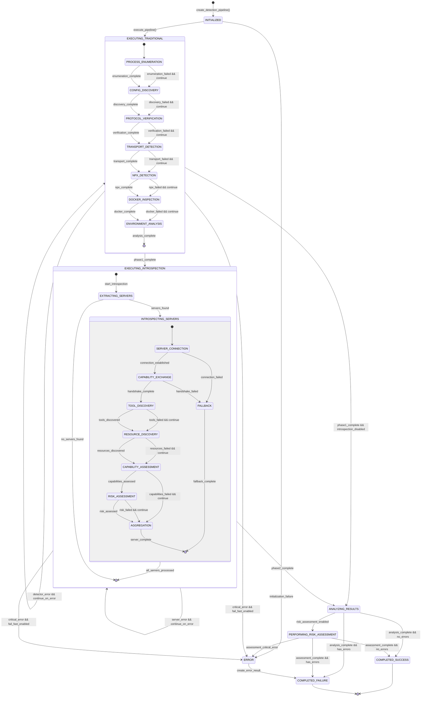
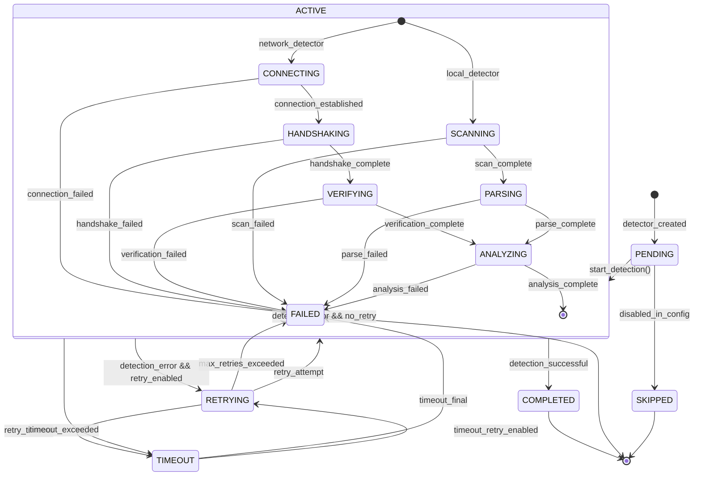
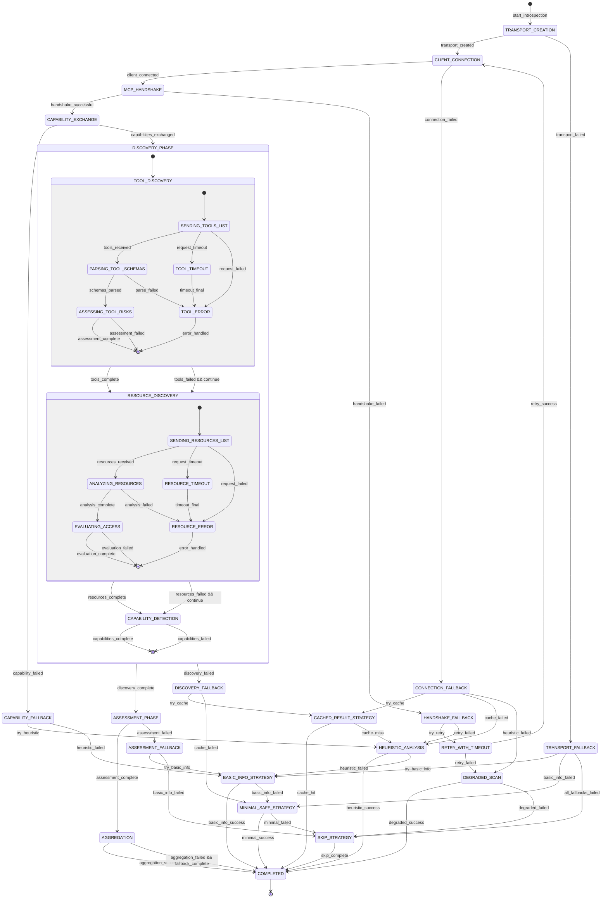
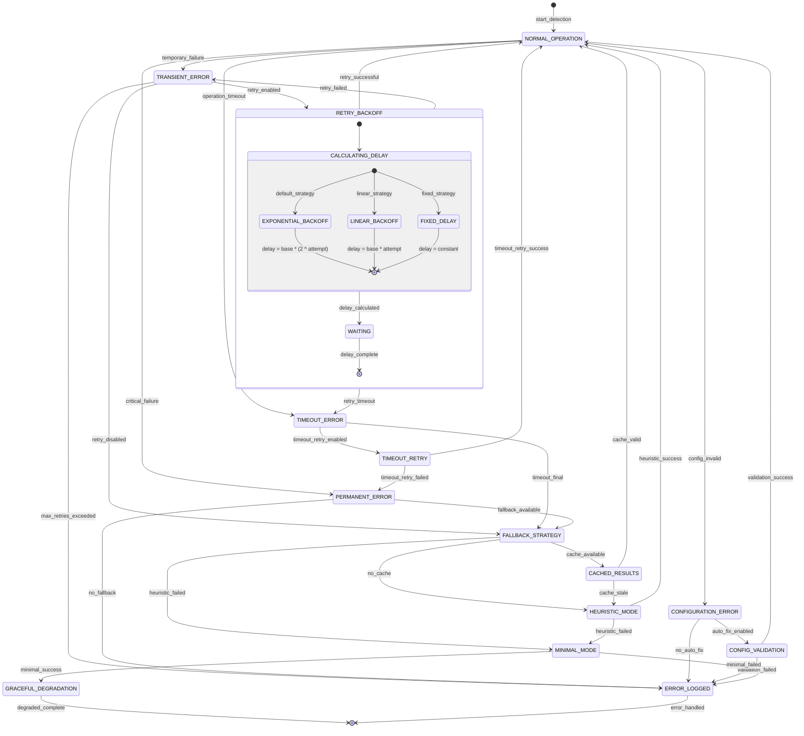
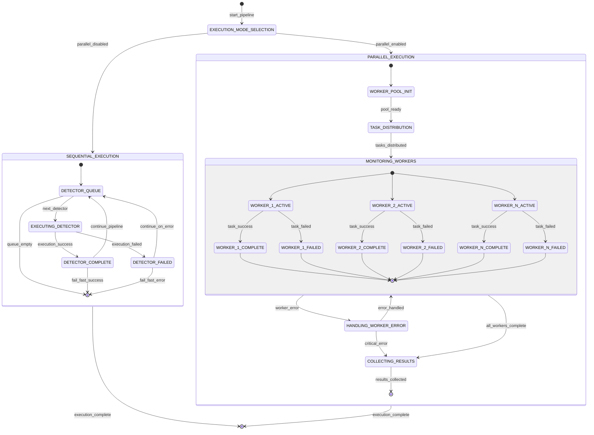

# Detection Pipeline State Diagram

## Overview

This document provides comprehensive state diagrams for the detection pipeline execution, showing states, transitions, error handling, retry logic, and fallback mechanisms. The detection system operates with multiple layers of state management for robustness and reliability.

## Main Pipeline State Machine

The following Mermaid state diagram illustrates the high-level pipeline execution states and transitions:

## Individual Detector State Machine

Each detection method (Process Enumeration, Config Discovery, etc.) follows this state pattern:

## MCP Introspection Detailed State Machine

The MCP introspection process has complex state management with fallback strategies:

## Error Handling and Recovery States

The system implements comprehensive error handling with multiple recovery strategies:

## Parallel vs Sequential Execution States

The pipeline supports both execution modes with different state management:

## Key State Characteristics

### Pipeline States

- **INITIALIZED**: Pipeline configured and ready for execution
- **EXECUTING_TRADITIONAL**: Running Phase 1 detection methods sequentially
- **EXECUTING_INTROSPECTION**: Running Phase 2 MCP introspection per discovered server
- **ANALYZING_RESULTS**: Computing statistics, finding best results, collecting errors
- **PERFORMING_RISK_ASSESSMENT**: Evaluating security risks and generating recommendations
- **COMPLETED_SUCCESS**: Pipeline finished successfully with results
- **COMPLETED_FAILURE**: Pipeline finished with errors but handled gracefully
- **ERROR**: Unrecoverable error requiring immediate termination

### Error Recovery Mechanisms

1. **Retry Logic**: Configurable retry attempts with exponential backoff
2. **Fallback Strategies**: Multiple degradation levels for continued operation
3. **Timeout Handling**: Graceful timeout management with retry options
4. **Fail-Fast vs Continue**: Configurable error propagation behavior
5. **Graceful Degradation**: Reduced functionality rather than complete failure

### Performance Considerations

- Sequential execution prevents resource conflicts but may be slower
- Parallel execution improves performance but requires careful coordination
- Timeout mechanisms prevent indefinite hanging
- Caching reduces redundant operations
- Connection pooling optimizes network resource usage

### State Persistence

- Pipeline statistics are maintained across executions
- Error states are logged for debugging and analysis
- Introspection results can be cached for performance
- Fallback usage is tracked for optimization 