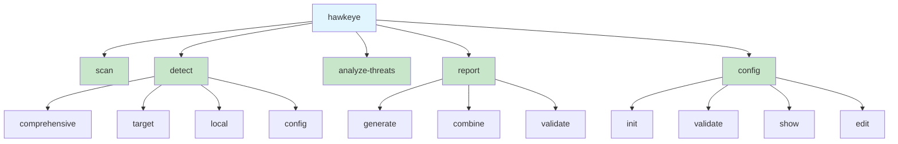
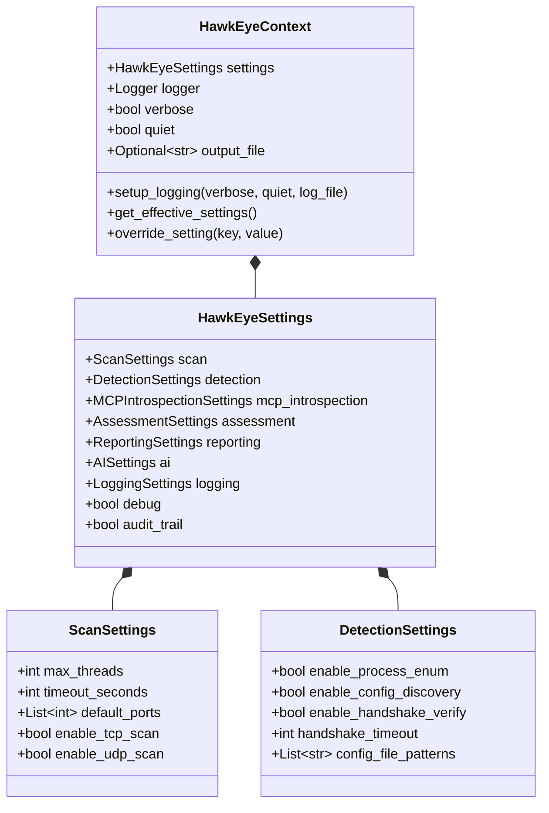
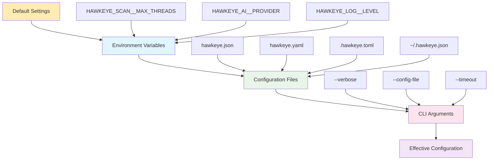
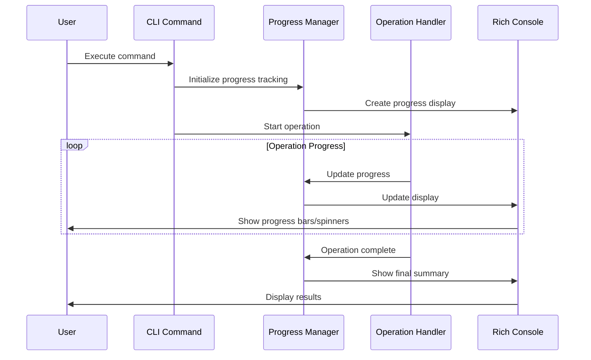
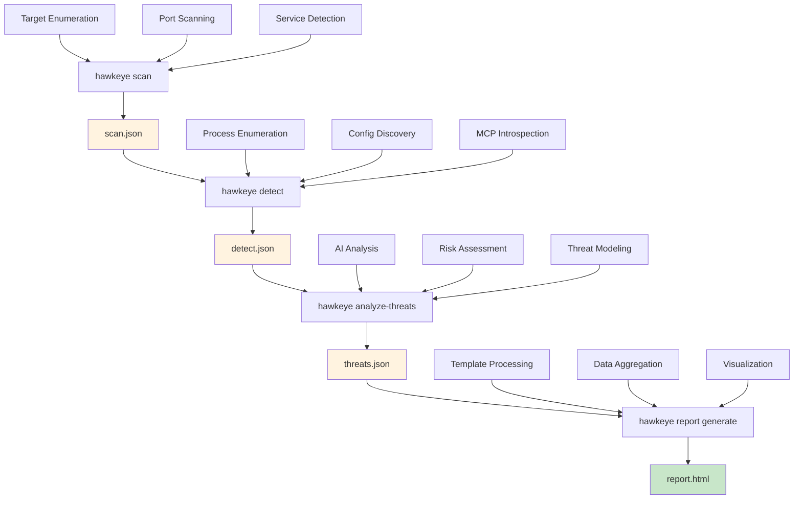

# CLI Integration Architecture

## Overview

This document provides a comprehensive analysis of the HawkEye command-line interface architecture. It documents the CLI design patterns, parameter flow management, configuration inheritance mechanisms, progress reporting systems, and user feedback infrastructure that coordinate the entire security assessment workflow.

## Command Hierarchy and Structure

### 1. CLI Command Architecture



### 2. Command Group Implementation

**Main CLI Application:**
```python
@click.group(cls=HawkEyeGroup, context_settings={"help_option_names": ["-h", "--help"]})
@click.option("--verbose", "-v", is_flag=True, help="Enable verbose output and debug logging")
@click.option("--quiet", "-q", is_flag=True, help="Suppress all output except errors")
@click.option("--log-file", type=click.Path(), help="Write logs to specified file")
@click.option("--config-file", type=click.Path(exists=True), help="Load configuration from file")
@click.version_option(version=__version__, prog_name="HawkEye")
@click.pass_context
def cli(ctx, verbose: bool, quiet: bool, log_file: Optional[str], config_file: Optional[str]):
    """🦅 HawkEye - MCP Security Reconnaissance Tool"""
    
    # Initialize context object
    ctx.ensure_object(HawkEyeContext)
    
    # Setup logging and configuration
    ctx.obj.setup_logging(verbose=verbose, quiet=quiet, log_file=log_file)
    
    # Load configuration file if specified
    if config_file:
        settings = load_config_from_file(config_file)
        ctx.obj.settings = settings
```

**Custom Command Group with Enhanced Error Handling:**
```python
class HawkEyeGroup(click.Group):
    """Custom Click group with enhanced error handling and help formatting."""
    
    def format_help(self, ctx, formatter):
        """Format help with HawkEye branding."""
        formatter.write_heading("🦅 HawkEye - MCP Security Reconnaissance Tool")
        formatter.write_paragraph()
        formatter.write("Hidden Application Weaknesses & Key Entry-point Yielding Evaluator")
        formatter.write_paragraph()
        super().format_help(ctx, formatter)
    
    def invoke(self, ctx):
        """Invoke command with comprehensive error handling."""
        try:
            return super().invoke(ctx)
        except HawkEyeError as e:
            console.print(f"[red]Error:[/red] {e.message}")
            if e.details and ctx.obj.verbose:
                console.print(f"[yellow]Details:[/yellow] {e.details}")
            sys.exit(1)
        except Exception as e:
            if ctx.obj.verbose:
                console.print_exception()
            else:
                console.print(f"[red]Unexpected error:[/red] {e}")
            sys.exit(1)
```

## Parameter Flow and Context Management

### 1. Context Object Architecture



### 2. Parameter Flow Implementation

**Context Initialization:**
```python
class HawkEyeContext:
    """Context object for sharing state between CLI commands."""
    
    def __init__(self):
        self.settings = get_settings()
        self.logger = None
        self.verbose = False
        self.quiet = False
        self.output_file = None
        
    def setup_logging(self, verbose: bool = False, quiet: bool = False, log_file: Optional[str] = None):
        """Setup logging based on CLI options."""
        self.verbose = verbose
        self.quiet = quiet
        
        # Override log settings based on CLI options
        if verbose:
            self.settings.logging.log_level = "DEBUG"
            self.settings.logging.console_log_level = "DEBUG"
        elif quiet:
            self.settings.logging.console_log_level = "ERROR"
        
        if log_file:
            self.settings.logging.log_file = Path(log_file)
        
        self.logger = configure_logging()
    
    def get_effective_settings(self) -> HawkEyeSettings:
        """Get settings with CLI overrides applied."""
        return self.settings
    
    def override_setting(self, key: str, value: Any):
        """Override a specific setting value."""
        # Support nested key paths like "scan.max_threads"
        keys = key.split('.')
        obj = self.settings
        for k in keys[:-1]:
            obj = getattr(obj, k)
        setattr(obj, keys[-1], value)
```

### 3. Parameter Inheritance Pattern

**Command Parameter Processing:**
```python
@detect.command()
@click.option("--target", "-t", required=True, help="Target specification")
@click.option("--introspection-timeout", type=int, default=180, help="Introspection timeout")
@click.option("--confidence-threshold", type=float, default=0.3, help="Confidence threshold")
@click.pass_context
def comprehensive(ctx, target: str, introspection_timeout: int, confidence_threshold: float):
    """Comprehensive MCP detection with enhanced introspection."""
    
    # Get base settings from context
    settings = ctx.obj.get_effective_settings()
    
    # Create command-specific configuration with inheritance
    pipeline_config = PipelineConfig(
        enable_mcp_introspection=True,
        introspection_timeout=float(introspection_timeout),  # CLI override
        min_confidence_threshold=confidence_threshold,        # CLI override
        # Inherit other settings from configuration
        enable_process_enumeration=settings.detection.enable_process_enum,
        enable_config_discovery=settings.detection.enable_config_discovery,
        max_concurrent_detections=settings.scan.max_threads
    )
    
    # Pass enhanced configuration to pipeline
    pipeline = create_detection_pipeline(pipeline_config, settings)
```

## Configuration Management System

### 1. Configuration Hierarchy



### 2. Configuration File Discovery

**Multi-Format Configuration Support:**
```python
class ConfigFileManager:
    """Manager for configuration file operations."""
    
    SUPPORTED_FORMATS = {
        '.json': 'json',
        '.yaml': 'yaml', 
        '.yml': 'yaml',
        '.toml': 'toml',
        '.ini': 'ini'
    }
    
    DEFAULT_CONFIG_NAMES = [
        'hawkeye.json',
        'hawkeye.yaml',
        'hawkeye.yml', 
        'hawkeye.toml',
        '.hawkeye.json',
        '.hawkeye.yaml',
        '.hawkeye.yml',
        '.hawkeye.toml'
    ]
    
    def find_config_file(self, start_path: Optional[Path] = None) -> Optional[Path]:
        """Find configuration file by searching up directory tree."""
        if start_path is None:
            start_path = Path.cwd()
        
        current_path = start_path.resolve()
        
        # Search up the directory tree
        while current_path != current_path.parent:
            for config_name in self.DEFAULT_CONFIG_NAMES:
                config_path = current_path / config_name
                if config_path.exists() and config_path.is_file():
                    return config_path
            current_path = current_path.parent
        
        # Check user home directory
        home_path = Path.home()
        for config_name in self.DEFAULT_CONFIG_NAMES:
            config_path = home_path / config_name
            if config_path.exists() and config_path.is_file():
                return config_path
        
        return None
```

### 3. Environment Variable Integration

**Pydantic Settings with Environment Support:**
```python
class HawkEyeSettings(BaseSettings):
    """Main configuration class with environment variable support."""
    
    # Component settings with nested environment support
    scan: ScanSettings = Field(default_factory=ScanSettings)
    detection: DetectionSettings = Field(default_factory=DetectionSettings)
    ai: AISettings = Field(default_factory=AISettings)
    
    class Config:
        env_prefix = "HAWKEYE_"
        case_sensitive = False
        env_nested_delimiter = "__"  # Allows HAWKEYE_SCAN__MAX_THREADS
        env_file = ".env"
        extra = "ignore"

# Example environment variables:
# HAWKEYE_SCAN__MAX_THREADS=100
# HAWKEYE_AI__PROVIDER=openai
# HAWKEYE_LOG__LEVEL=debug
```

### 4. Runtime Configuration Override

**Dynamic Setting Modification:**
```python
def apply_cli_overrides(settings: HawkEyeSettings, cli_options: Dict[str, Any]) -> HawkEyeSettings:
    """Apply CLI option overrides to settings."""
    
    # Direct CLI overrides
    if cli_options.get('timeout'):
        settings.scan.timeout_seconds = cli_options['timeout']
        settings.detection.handshake_timeout = min(cli_options['timeout'], 60)
    
    if cli_options.get('threads'):
        settings.scan.max_threads = cli_options['threads']
    
    if cli_options.get('verbose'):
        settings.logging.log_level = "DEBUG"
        settings.logging.console_log_level = "DEBUG"
    
    if cli_options.get('quiet'):
        settings.logging.console_log_level = "ERROR"
    
    # AI provider overrides
    if cli_options.get('ai_provider'):
        settings.ai.provider = cli_options['ai_provider']
    
    return settings
```

## Progress Reporting and User Feedback

### 1. Progress Display Architecture



### 2. Rich Progress Implementation

**Multi-Phase Progress Tracking:**
```python
class HawkEyeProgress:
    """Comprehensive progress tracking for HawkEye operations."""
    
    def __init__(self, console: Optional[Console] = None):
        self.console = console or Console()
        self.progress = None
        self.live = None
        self.tasks = {}
        self.stats = {}
        self.lock = Lock()
    
    def create_progress(self, show_speed: bool = True, show_eta: bool = True) -> Progress:
        """Create progress instance with HawkEye styling."""
        columns = [
            SpinnerColumn(spinner_style="blue"),
            TextColumn("[progress.description]{task.description}"),
            BarColumn(bar_width=40, style="blue", complete_style="green"),
            TaskProgressColumn(),
        ]
        
        if show_speed:
            columns.append(TextColumn("[progress.percentage]{task.speed} ops/s"))
        
        if show_eta:
            columns.extend([
                TimeElapsedColumn(),
                TimeRemainingColumn()
            ])
        
        return Progress(*columns, console=self.console)
    
    @contextmanager
    def scanning_progress(self, total_targets: int, total_ports: int):
        """Context manager for network scanning progress."""
        with self.create_progress() as progress:
            self.progress = progress
            
            # Create hierarchical tasks
            main_task = progress.add_task(
                f"🔍 Scanning {total_targets} targets...",
                total=total_targets
            )
            
            port_task = progress.add_task(
                f"📡 Port scanning...",
                total=total_targets * total_ports
            )
            
            # Statistics tracking
            self.stats = {
                'targets_scanned': 0,
                'ports_scanned': 0,
                'open_ports': 0,
                'services_identified': 0,
                'start_time': time.time()
            }
            
            try:
                yield ScanProgressTracker(progress, main_task, port_task, self.stats)
            finally:
                self.progress = None
```

### 3. Context-Aware Progress Updates

**Progress Tracker Implementation:**
```python
class ScanProgressTracker(ProgressTracker):
    """Progress tracker for network scanning operations."""
    
    def __init__(self, progress: Progress, main_task: int, port_task: int, stats: Dict):
        super().__init__(progress, main_task, stats)
        self.port_task = port_task
    
    def update_scan_result(self, target: str, port: int, is_open: bool, service: Optional[str] = None):
        """Update progress with scan result."""
        with self.lock:
            self.stats['ports_scanned'] += 1
            
            if is_open:
                self.stats['open_ports'] += 1
                
            if service:
                self.stats['services_identified'] += 1
            
            # Update port scanning progress
            description = (
                f"📡 Port scanning... "
                f"Open: {self.stats['open_ports']} | "
                f"Services: {self.stats['services_identified']}"
            )
            
            self.progress.update(self.port_task, description=description)
            self.progress.advance(self.port_task, 1)
    
    def complete_target(self, target: str):
        """Mark target scanning as complete."""
        with self.lock:
            self.stats['targets_scanned'] += 1
            
            # Update main task progress
            description = (
                f"🔍 Scanning... "
                f"Completed: {self.stats['targets_scanned']} | "
                f"Total Open Ports: {self.stats['open_ports']}"
            )
            
            self.progress.update(self.task_id, description=description)
            self.progress.advance(self.task_id, 1)
```

### 4. Output Control and Verbosity Management

**Verbosity Level System:**
```python
class VerbosityLevel(Enum):
    """Verbosity levels for output control."""
    QUIET = 0     # Errors only
    NORMAL = 1    # Standard output
    VERBOSE = 2   # Detailed output
    DEBUG = 3     # Debug information

class OutputController:
    """Centralized output control for HawkEye CLI."""
    
    def __init__(self, verbosity: VerbosityLevel = VerbosityLevel.NORMAL, 
                 quiet: bool = False, console: Optional[Console] = None):
        self.verbosity = verbosity
        self.quiet_mode = quiet
        self.debug_mode = verbosity == VerbosityLevel.DEBUG
        self.console = console or Console()
    
    def print_operation_start(self, operation: str, details: Optional[str] = None):
        """Print operation start message."""
        if self.quiet_mode:
            return
        
        message = f"🚀 Starting {operation}"
        if details:
            message += f": {details}"
        
        self.console.print(message, style="bold green")
    
    def print_progress_update(self, message: str, current: int, total: int):
        """Print progress update in verbose mode."""
        if self.verbosity.value >= VerbosityLevel.VERBOSE.value:
            percentage = (current / total) * 100 if total > 0 else 0
            self.console.print(f"📊 {message} ({current}/{total} - {percentage:.1f}%)", style="dim")
    
    def print_debug_info(self, category: str, data: Dict[str, Any]):
        """Print debug information."""
        if not self.debug_mode:
            return
        
        self.console.print(f"\n[bold yellow]DEBUG - {category}:[/bold yellow]")
        for key, value in data.items():
            self.console.print(f"  {key}: {value}", style="dim")
```

## Command Integration Patterns

### 1. Pipeline Command Coordination



### 2. Cross-Command Data Passing

**File-Based Data Exchange:**
```python
def save_scan_results(results: List[ScanResult], output_path: str, format: str):
    """Save scan results for use by detect command."""
    
    data = {
        'metadata': {
            'command': 'scan',
            'version': __version__,
            'timestamp': datetime.now().isoformat(),
            'format_version': '1.0'
        },
        'scan_results': [result.to_dict() for result in results],
        'summary': generate_scan_summary(results)
    }
    
    if format == 'json':
        with open(output_path, 'w') as f:
            json.dump(data, f, indent=2, default=str)

def load_scan_results(input_path: str) -> List[ScanResult]:
    """Load scan results for use in detect command."""
    
    with open(input_path, 'r') as f:
        data = json.load(f)
    
    # Validate format version
    if data.get('metadata', {}).get('format_version') != '1.0':
        logger.warning("Loading results from different format version")
    
    # Convert back to objects
    results = []
    for result_data in data.get('scan_results', []):
        result = ScanResult.from_dict(result_data)
        results.append(result)
    
    return results
```

### 3. Command Chaining and Workflow Automation

**Workflow Integration Helper:**
```python
class WorkflowManager:
    """Manages multi-command workflows and data passing."""
    
    def __init__(self, context: HawkEyeContext):
        self.context = context
        self.temp_files = []
        
    def execute_full_assessment(self, target: str, output_dir: Path) -> Dict[str, Path]:
        """Execute complete scan → detect → analyze → report workflow."""
        
        results = {}
        
        # Phase 1: Network Scan
        scan_output = output_dir / "scan_results.json"
        scan_result = self._execute_scan(target, scan_output)
        results['scan'] = scan_output
        
        # Phase 2: MCP Detection  
        detect_output = output_dir / "detection_results.json"
        detection_result = self._execute_detection(target, detect_output, scan_input=scan_output)
        results['detection'] = detect_output
        
        # Phase 3: Threat Analysis
        threats_output = output_dir / "threat_analysis.json"
        analysis_result = self._execute_threat_analysis(detect_output, threats_output)
        results['threats'] = threats_output
        
        # Phase 4: Report Generation
        report_output = output_dir / "security_report.html"
        report_result = self._generate_report(threats_output, report_output)
        results['report'] = report_output
        
        return results
    
    def _execute_scan(self, target: str, output: Path) -> bool:
        """Execute scan command programmatically."""
        try:
            from .scan_commands import execute_scan
            return execute_scan(target, str(output), self.context.settings)
        except Exception as e:
            logger.error(f"Scan phase failed: {e}")
            return False
```

## User Experience Features

### 1. Interactive CLI Features

**Input Validation and Suggestions:**
```python
class InteractiveCLI:
    """Interactive CLI features and user assistance."""
    
    def validate_target_interactive(self, target: str) -> str:
        """Validate target with interactive correction."""
        
        try:
            validate_target(target)
            return target
        except ValidationError as e:
            console.print(f"[red]Invalid target: {e.message}[/red]")
            
            # Provide suggestions
            suggestions = self._generate_target_suggestions(target)
            if suggestions:
                console.print("\n[yellow]Did you mean:[/yellow]")
                for i, suggestion in enumerate(suggestions, 1):
                    console.print(f"  {i}. {suggestion}")
                
                choice = click.prompt("Select suggestion (or press Enter to skip)", 
                                    type=int, default=0, show_default=False)
                
                if 1 <= choice <= len(suggestions):
                    return suggestions[choice - 1]
            
            # Allow manual correction
            return click.prompt("Enter corrected target", type=str)
    
    def _generate_target_suggestions(self, invalid_target: str) -> List[str]:
        """Generate target correction suggestions."""
        suggestions = []
        
        # Common CIDR notation fixes
        if '/' in invalid_target:
            ip_part, cidr_part = invalid_target.split('/', 1)
            
            # Fix common CIDR values
            cidr_fixes = {'8': '8', '16': '16', '24': '24', '32': '32'}
            if cidr_part in cidr_fixes:
                suggestions.append(f"{ip_part}/{cidr_fixes[cidr_part]}")
        
        # IP address format fixes
        if invalid_target.count('.') == 3:
            parts = invalid_target.split('.')
            if all(part.isdigit() for part in parts):
                # Check for out-of-range values
                fixed_parts = [min(255, max(0, int(part))) for part in parts]
                fixed_ip = '.'.join(map(str, fixed_parts))
                if fixed_ip != invalid_target:
                    suggestions.append(fixed_ip)
        
        return suggestions
```

### 2. Help System and Documentation

**Context-Aware Help:**
```python
def show_contextual_help(command: str, error_context: Optional[str] = None):
    """Show contextual help based on command and error."""
    
    help_content = {
        'scan': {
            'description': 'Network scanning for MCP server discovery',
            'examples': [
                'hawkeye scan -t 192.168.1.100',
                'hawkeye scan -t 192.168.1.0/24 -p 3000-3010',
                'hawkeye scan -t example.com --threads 100'
            ],
            'common_errors': {
                'invalid_target': 'Use IP address, CIDR notation, or hostname',
                'permission_denied': 'Try running with appropriate network privileges',
                'timeout': 'Increase timeout with --timeout option'
            }
        },
        'detect': {
            'description': 'MCP server detection and introspection',
            'examples': [
                'hawkeye detect comprehensive -t 192.168.1.100',
                'hawkeye detect local --include-docker',
                'hawkeye detect target -t example.com --verify-protocol'
            ],
            'common_errors': {
                'no_servers_found': 'Try increasing detection scope or lowering confidence threshold',
                'introspection_timeout': 'Increase --introspection-timeout value',
                'connection_failed': 'Check network connectivity and target availability'
            }
        }
    }
    
    if command in help_content:
        content = help_content[command]
        
        console.print(f"\n[bold blue]Help for '{command}' command:[/bold blue]")
        console.print(f"{content['description']}\n")
        
        console.print("[bold]Examples:[/bold]")
        for example in content['examples']:
            console.print(f"  {example}")
        
        if error_context and error_context in content['common_errors']:
            console.print(f"\n[bold yellow]For '{error_context}' errors:[/bold yellow]")
            console.print(f"  {content['common_errors'][error_context]}")
```

### 3. Error Recovery and User Guidance

**Intelligent Error Recovery:**
```python
class ErrorRecoverySystem:
    """Provides intelligent error recovery suggestions."""
    
    def handle_command_error(self, command: str, error: Exception, context: Dict[str, Any]):
        """Handle command errors with recovery suggestions."""
        
        recovery_strategies = {
            'NetworkError': self._handle_network_error,
            'ValidationError': self._handle_validation_error,
            'ConfigurationError': self._handle_config_error,
            'PermissionError': self._handle_permission_error
        }
        
        error_type = type(error).__name__
        
        if error_type in recovery_strategies:
            recovery_strategies[error_type](error, context)
        else:
            self._handle_generic_error(error, context)
    
    def _handle_network_error(self, error: Exception, context: Dict[str, Any]):
        """Handle network-related errors."""
        console.print(f"[red]Network Error:[/red] {error}")
        console.print("\n[bold]Recovery suggestions:[/bold]")
        console.print("  • Check network connectivity")
        console.print("  • Verify target is reachable")
        console.print("  • Try with reduced timeout: --timeout 30")
        console.print("  • Use fewer threads: --threads 10")
        
        if context.get('target'):
            console.print(f"  • Test connectivity: ping {context['target']}")
    
    def _handle_validation_error(self, error: Exception, context: Dict[str, Any]):
        """Handle input validation errors."""
        console.print(f"[red]Validation Error:[/red] {error}")
        console.print("\n[bold]Common fixes:[/bold]")
        console.print("  • Check target format (IP, CIDR, or hostname)")
        console.print("  • Verify port range syntax (e.g., 80-443)")
        console.print("  • Ensure file paths exist and are accessible")
```

## Performance and Scalability

### 1. Command Performance Optimization

**Lazy Loading and Resource Management:**
```python
class ResourceManager:
    """Manages CLI resources and performance optimization."""
    
    def __init__(self):
        self._cached_settings = None
        self._loaded_modules = {}
        
    @lru_cache(maxsize=1)
    def get_settings(self) -> HawkEyeSettings:
        """Get cached settings to avoid repeated parsing."""
        if self._cached_settings is None:
            self._cached_settings = HawkEyeSettings()
        return self._cached_settings
    
    def lazy_import(self, module_name: str) -> Any:
        """Lazy import modules to improve CLI startup time."""
        if module_name not in self._loaded_modules:
            if module_name == 'scanner':
                from ..scanner import TCPScanner, UDPScanner
                self._loaded_modules[module_name] = {
                    'TCPScanner': TCPScanner,
                    'UDPScanner': UDPScanner
                }
            elif module_name == 'detection':
                from ..detection import DetectionPipeline, create_detection_pipeline
                self._loaded_modules[module_name] = {
                    'DetectionPipeline': DetectionPipeline,
                    'create_detection_pipeline': create_detection_pipeline
                }
        
        return self._loaded_modules[module_name]
```

### 2. Memory Management for Large Operations

**Streaming and Chunked Processing:**
```python
class StreamingOutputManager:
    """Manages streaming output for large datasets."""
    
    def stream_results(self, results_generator, output_file: Path, format: str):
        """Stream results to file to manage memory usage."""
        
        if format == 'json':
            self._stream_json_results(results_generator, output_file)
        elif format == 'csv':
            self._stream_csv_results(results_generator, output_file)
    
    def _stream_json_results(self, results_generator, output_file: Path):
        """Stream JSON results with incremental writing."""
        
        with open(output_file, 'w') as f:
            f.write('{"results": [')
            
            first_result = True
            for result in results_generator:
                if not first_result:
                    f.write(',')
                else:
                    first_result = False
                
                json.dump(result.to_dict(), f, default=str)
                f.flush()  # Ensure data is written
            
            f.write(']}')
```

This comprehensive CLI integration architecture ensures that HawkEye provides a robust, user-friendly, and scalable command-line interface that effectively coordinates all components of the security assessment workflow while maintaining excellent user experience and system performance. 