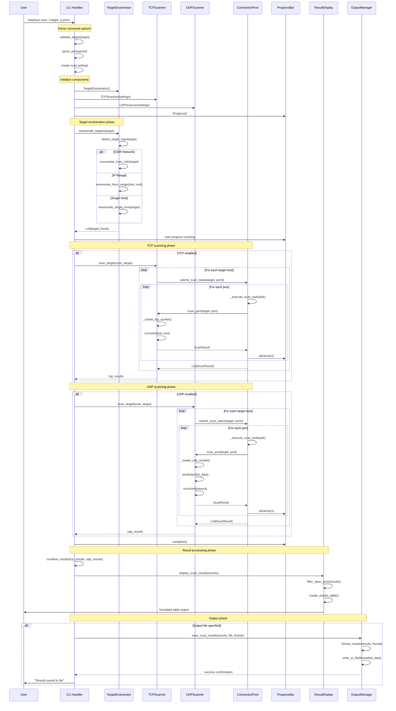
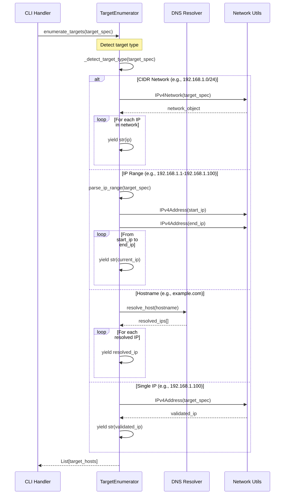
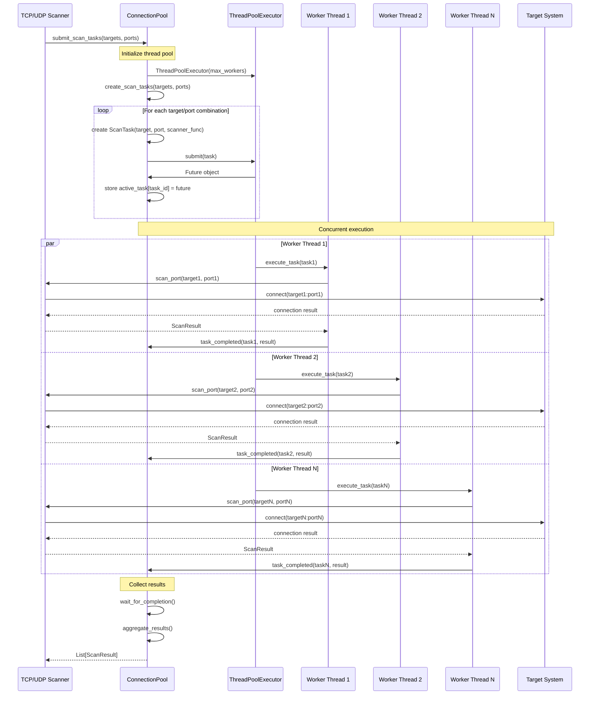
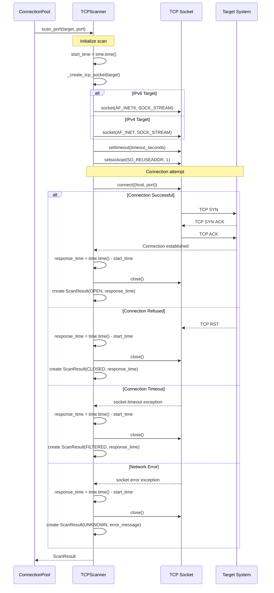
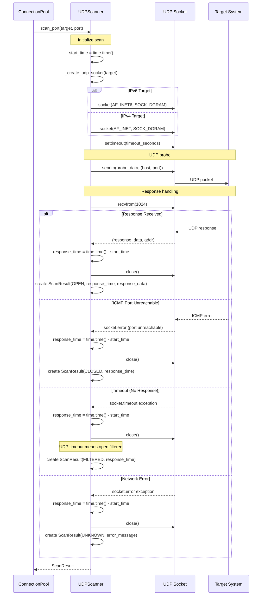
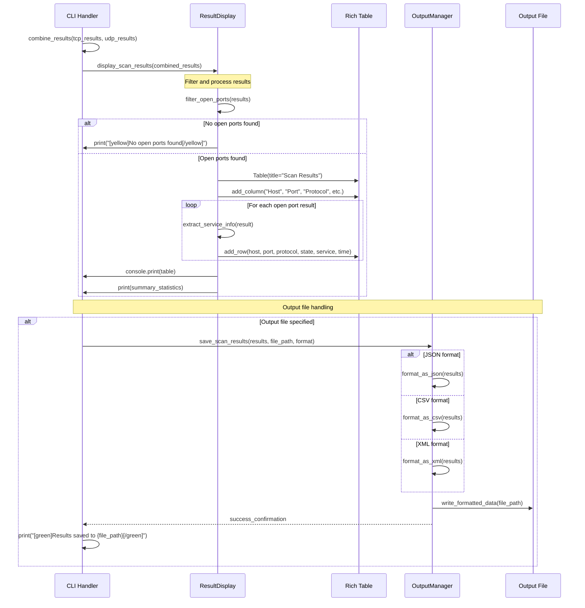
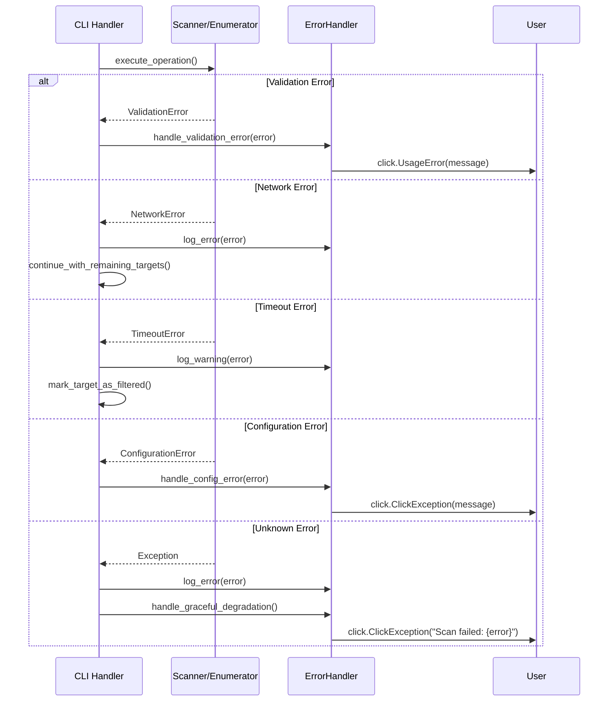

# Scan Command Sequence Diagram

## Overview

This document provides comprehensive sequence diagrams illustrating the HawkEye scan command workflow from CLI input to final results. The scanning process involves multiple components working together to enumerate targets, perform concurrent port scanning, and aggregate results for display and output.

## Main Components

### Core Components
- **CLI Command Handler** (`src/hawkeye/cli/scan_commands.py`)
- **Target Enumerator** (`src/hawkeye/scanner/target_enum.py`)
- **TCP Scanner** (`src/hawkeye/scanner/tcp_scanner.py`)
- **UDP Scanner** (`src/hawkeye/scanner/udp_scanner.py`)
- **Connection Pool** (`src/hawkeye/scanner/connection_pool.py`)
- **Result Aggregator** (`src/hawkeye/cli/scan_commands.py`)

### Supporting Components
- **Base Scanner** (`src/hawkeye/scanner/base.py`)
- **Scan Target** (`src/hawkeye/scanner/base.py`)
- **Scan Result** (`src/hawkeye/scanner/base.py`)
- **Progress Display** (Rich library integration)
- **Output Manager** (JSON/CSV/XML formatting)

## Sequence Diagrams

### 1. Main Scan Command Flow



### 2. Target Enumeration Sequence



### 3. Concurrent Port Scanning Sequence



### 4. TCP Port Scanning Detail



### 5. UDP Port Scanning Detail



### 6. Result Aggregation and Display



### 7. Error Handling and Recovery



## Key Workflow Patterns

### 1. Command Initialization Pattern
```
CLI Input → Parameter Validation → Component Initialization → Settings Configuration
```

### 2. Target Enumeration Pattern
```
Target Specification → Type Detection → Enumeration Strategy → Host List Generation
```

### 3. Concurrent Scanning Pattern
```
Task Creation → Thread Pool Submission → Parallel Execution → Result Aggregation
```

### 4. Progressive Disclosure Pattern
```
Basic Scan → Service Detection → Protocol Verification → Detailed Analysis
```

### 5. Result Processing Pattern
```
Raw Results → Filtering → Formatting → Display/Output
```

## Performance Characteristics

### Threading Model
- **Thread Pool Size**: Configurable (default: 50 threads)
- **Task Distribution**: Round-robin assignment to available workers
- **Load Balancing**: Automatic based on thread availability
- **Resource Management**: Context manager pattern for cleanup

### Memory Management
- **Result Streaming**: Results processed as they arrive
- **Memory Pool**: Reusable result objects
- **Garbage Collection**: Explicit cleanup of large result sets
- **Memory Monitoring**: Optional memory profiling for large scans

### Network Optimization
- **Connection Reuse**: Socket pooling for repeated scans
- **Timeout Management**: Adaptive timeouts based on network conditions
- **Rate Limiting**: Configurable request rate limits
- **Retry Logic**: Exponential backoff for transient failures

## Error Recovery Strategies

### 1. Graceful Degradation
- Individual target failures don't stop the entire scan
- Timeout errors result in "filtered" state rather than failure
- Network errors are logged but don't terminate scanning

### 2. Partial Results
- Successfully scanned targets are displayed even if others fail
- Progress tracking continues despite individual failures
- Summary statistics include both successful and failed attempts

### 3. Resource Cleanup
- Automatic socket cleanup on errors
- Thread pool shutdown on interruption
- Memory cleanup for large result sets

## Integration Points

### 1. Configuration System
- Settings loaded from configuration files
- Environment variable overrides
- Command-line parameter precedence

### 2. Logging System
- Structured logging with correlation IDs
- Configurable log levels per component
- Performance metrics collection

### 3. Output System
- Multiple format support (JSON, CSV, XML)
- Streaming output for large results
- Template-based formatting

## Usage Examples

### 1. Single Host Scan
```bash
hawkeye scan -t 192.168.1.100
```

**Sequence**: CLI → Target Enumeration (single IP) → TCP Scan → Result Display

### 2. Network Range Scan
```bash
hawkeye scan -t 192.168.1.0/24 -p 80,443,3000-3010
```

**Sequence**: CLI → CIDR Enumeration → Port List Generation → Concurrent Scanning → Aggregated Results

### 3. Mixed Protocol Scan
```bash
hawkeye scan -t example.com --tcp --udp --threads 100
```

**Sequence**: CLI → DNS Resolution → TCP + UDP Scanning → Combined Results → Display

### 4. Output to File
```bash
hawkeye scan -t targets.txt -o results.json -f json
```

**Sequence**: CLI → File-based Target Enumeration → Scanning → JSON Formatting → File Output

## Conclusion

The HawkEye scan command implements a sophisticated workflow that efficiently handles target enumeration, concurrent port scanning, and result aggregation. The sequence diagrams above illustrate the complex interactions between components while maintaining clear separation of concerns and robust error handling.

Key architectural strengths:
- **Scalability**: Thread pool-based concurrent execution
- **Flexibility**: Multiple target specification formats
- **Reliability**: Comprehensive error handling and recovery
- **Usability**: Rich progress indication and formatted output
- **Extensibility**: Pluggable scanner and output format architecture 