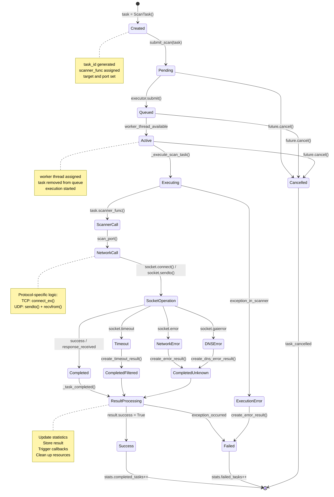
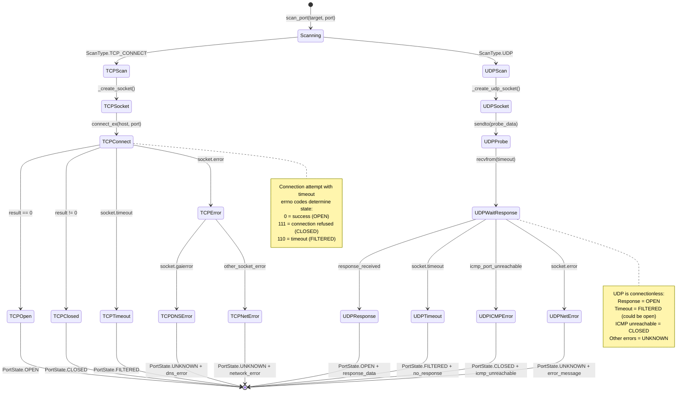
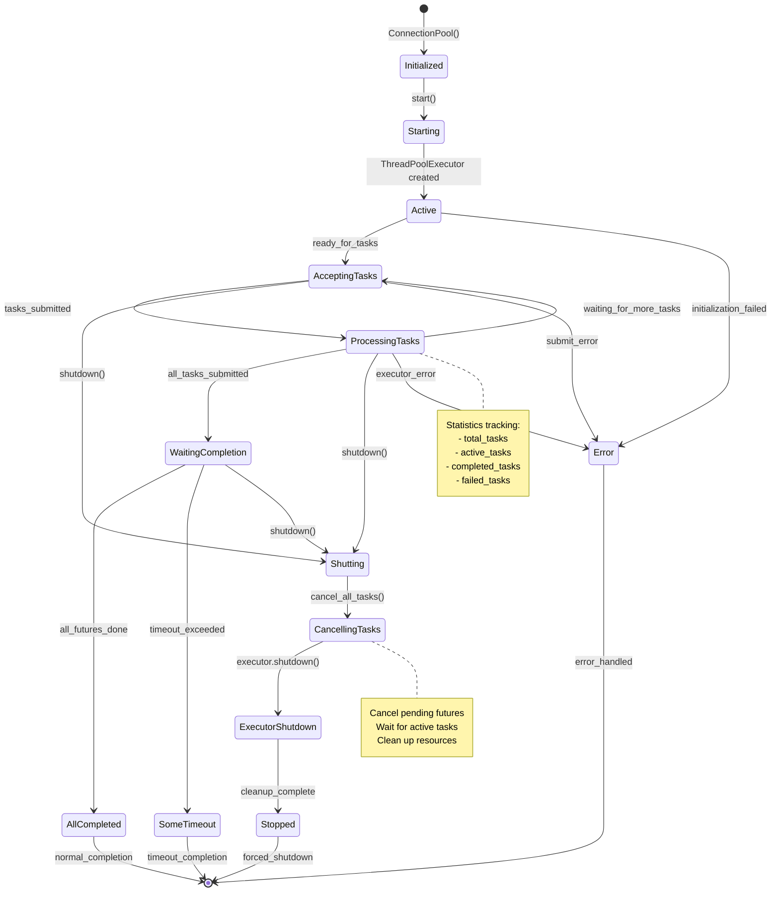
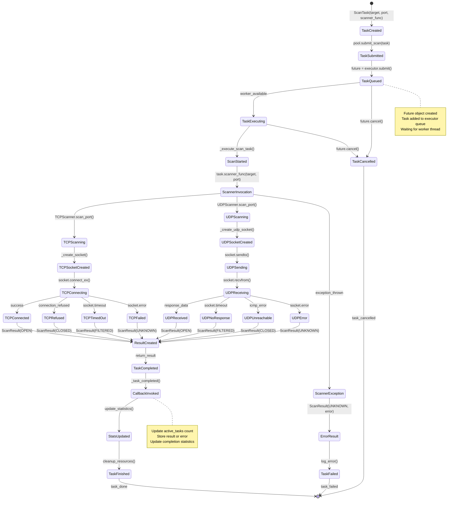
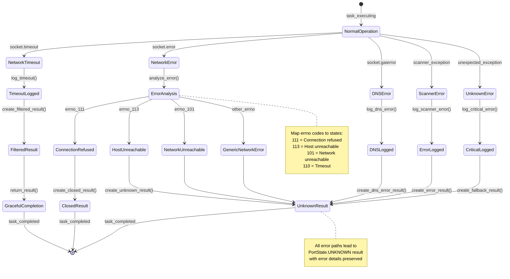
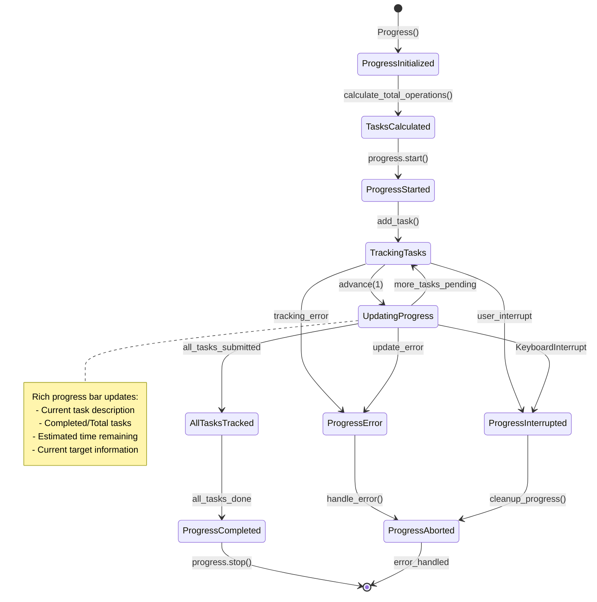

# Scan Command State Diagram

## Overview

This document provides comprehensive state diagrams illustrating the HawkEye scan task lifecycle, from task creation to final completion or failure. The scanning system operates at multiple levels with different state machines managing different aspects of the scanning process.

## State Machine Hierarchy

The HawkEye scan system implements a hierarchical state machine structure:

1. **Task Execution States** - High-level task lifecycle in the ConnectionPool
2. **Port Scan States** - Individual port scanning results and states
3. **Connection States** - Low-level network connection states
4. **Pool Management States** - Connection pool operational states

## State Diagrams

### 1. Task Execution State Machine



### 2. Port Scan Result State Machine



### 3. Connection Pool State Machine



### 4. Individual Task State Transitions



### 5. Error Handling State Machine



### 6. Progress Tracking State Machine



## State Transition Triggers

### 1. Task Submission Triggers
- **Task Creation**: `ScanTask(target, port, scanner_func)`
- **Task Submission**: `pool.submit_scan(task)`
- **Worker Assignment**: Thread pool executor assigns available worker
- **Task Execution**: Worker thread calls `_execute_scan_task()`

### 2. Network Operation Triggers
- **Connection Success**: `socket.connect_ex()` returns 0
- **Connection Refused**: `socket.connect_ex()` returns errno 111
- **Connection Timeout**: `socket.timeout` exception raised
- **DNS Resolution Failure**: `socket.gaierror` exception raised
- **Network Error**: `socket.error` exception raised

### 3. UDP Specific Triggers
- **UDP Response**: `socket.recvfrom()` returns data
- **UDP Timeout**: `socket.timeout` on `recvfrom()`
- **ICMP Unreachable**: Socket error with "port unreachable" message
- **UDP Network Error**: Other socket errors during UDP operations

### 4. Completion Triggers
- **Result Creation**: Scanner returns `ScanResult` object
- **Task Completion**: `_task_completed()` callback invoked
- **Statistics Update**: Completion counters incremented
- **Resource Cleanup**: Socket closed, memory freed

### 5. Error Recovery Triggers
- **Timeout Recovery**: Create `FILTERED` result, continue processing
- **Network Error Recovery**: Create `UNKNOWN` result, log error
- **Exception Recovery**: Create error result, don't crash scanner
- **Graceful Degradation**: Continue with other tasks despite failures

## State Persistence and Recovery

### 1. Task State Tracking
```python
# Connection pool maintains task state
active_tasks: Dict[str, Future] = {}
completed_tasks: List[ScanResult] = []
failed_tasks: List[tuple] = []

# Statistics tracking
stats = {
    'total_tasks': 0,
    'completed_tasks': 0,
    'failed_tasks': 0,
    'active_tasks': 0,
}
```

### 2. Result State Management
```python
# Scan results maintain state information
@dataclass
class ScanResult:
    target: ScanTarget
    port: int
    state: PortState  # OPEN, CLOSED, FILTERED, UNKNOWN
    scan_type: ScanType
    response_time: Optional[float]
    error: Optional[str]
    raw_data: Dict[str, Any]
```

### 3. Error State Preservation
```python
# Error information preserved in results
error_states = {
    'timeout': PortState.FILTERED,
    'connection_refused': PortState.CLOSED,
    'dns_error': PortState.UNKNOWN,
    'network_error': PortState.UNKNOWN,
    'unknown_error': PortState.UNKNOWN,
}
```

## Performance Characteristics by State

### 1. State Transition Times
- **Task Creation → Submission**: < 1ms
- **Submission → Execution**: Depends on thread pool queue (0-100ms)
- **Execution → Network Call**: < 1ms
- **Network Call → Result**: Depends on network (1ms - 30s timeout)
- **Result → Completion**: < 1ms

### 2. Resource Usage by State
- **Pending/Queued**: Minimal memory (task object only)
- **Active/Executing**: Thread + socket resources
- **Network Operations**: Socket + network buffers
- **Completed**: Result object + statistics update

### 3. Concurrency Considerations
- **Multiple Tasks**: Up to `max_threads` tasks in Active state simultaneously
- **Thread Safety**: State transitions synchronized with locks
- **Resource Limits**: Thread pool and socket limits prevent resource exhaustion

## Error Recovery Strategies

### 1. Timeout Handling
- **Short Timeouts**: Mark as FILTERED, continue scanning
- **DNS Timeouts**: Mark as UNKNOWN, log DNS issues
- **Long Delays**: Progress indication, allow user interruption

### 2. Network Error Recovery
- **Transient Errors**: Retry with exponential backoff (future enhancement)
- **Permanent Errors**: Mark as appropriate state, continue with other targets
- **Critical Errors**: Log error, graceful degradation

### 3. Resource Exhaustion
- **Thread Pool Full**: Queue tasks, block if necessary
- **Memory Limits**: Process results in batches, clean up completed tasks
- **Socket Limits**: Reuse sockets where possible, proper cleanup

## State Machine Integration

### 1. Hierarchical State Management
The scan system uses multiple coordinated state machines:
- **Pool-level states** manage overall scanning lifecycle
- **Task-level states** track individual scan operations
- **Result-level states** represent final port states
- **Progress-level states** manage user interface updates

### 2. State Synchronization
State transitions are synchronized across levels:
- Task completion updates pool statistics
- Result creation triggers progress updates
- Error states propagate up the hierarchy
- Cancellation cascades down to active tasks

### 3. State Persistence
Critical state information is preserved:
- Task results stored for later retrieval
- Error information maintained for debugging
- Statistics tracked for performance analysis
- Progress state maintained for user experience

## Conclusion

The HawkEye scan command implements a sophisticated multi-level state machine that efficiently handles the complex lifecycle of network scanning operations. The state diagrams above illustrate how tasks flow through the system from creation to completion, with comprehensive error handling and recovery mechanisms.

Key architectural benefits:
- **Robust Error Handling**: All error conditions mapped to appropriate states
- **Resource Management**: Proper state transitions ensure resource cleanup
- **Concurrent Execution**: State synchronization enables safe parallel processing
- **Progress Tracking**: State changes drive user interface updates
- **Extensibility**: Well-defined states support future enhancements

The state machine design ensures reliable scanning operations while providing clear visibility into the scanning process and robust handling of network conditions and errors. 