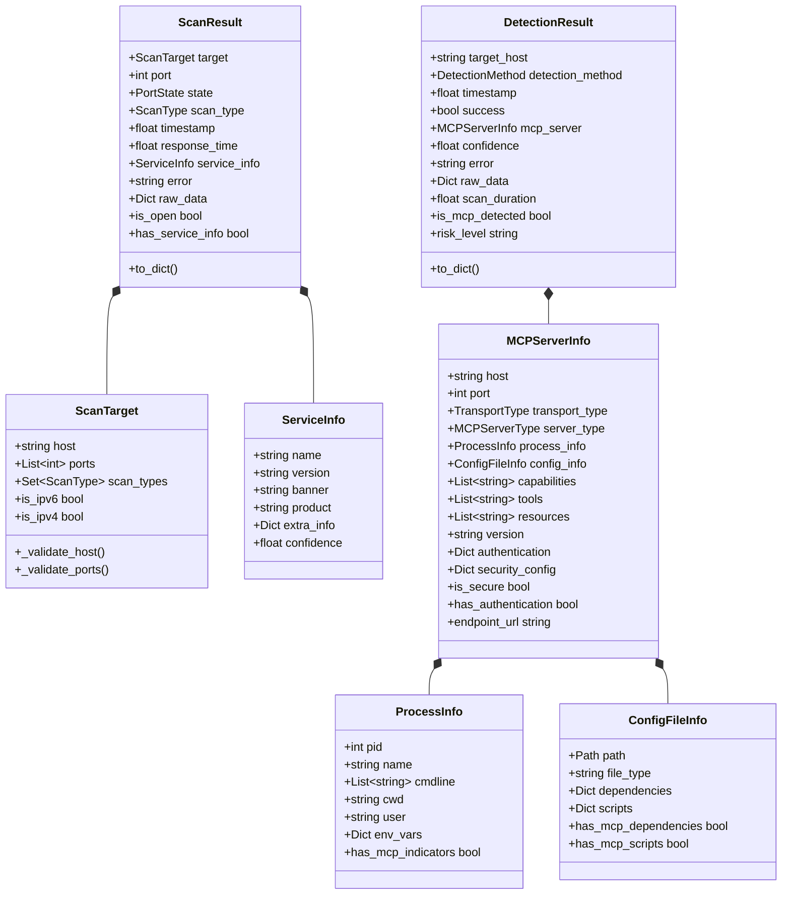
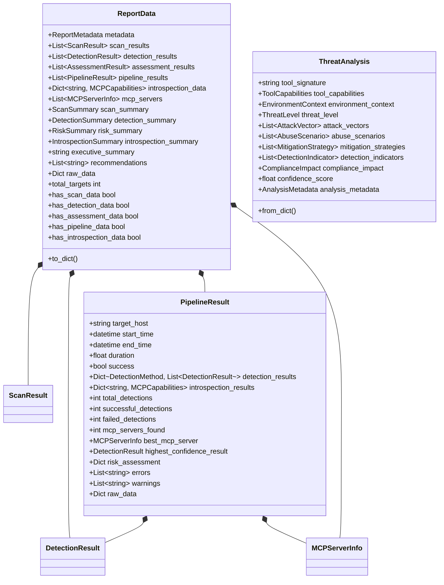
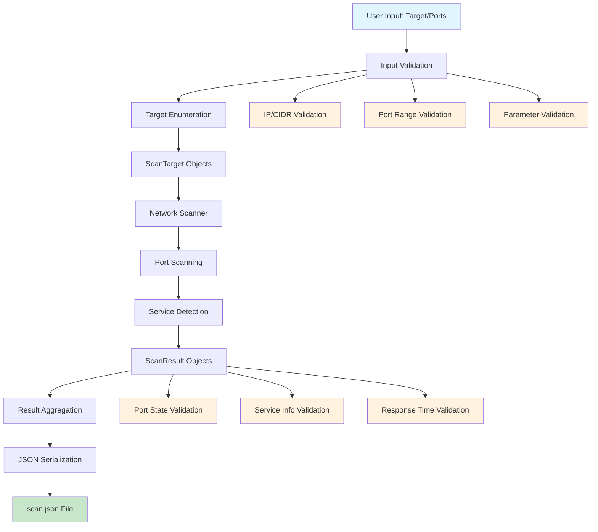
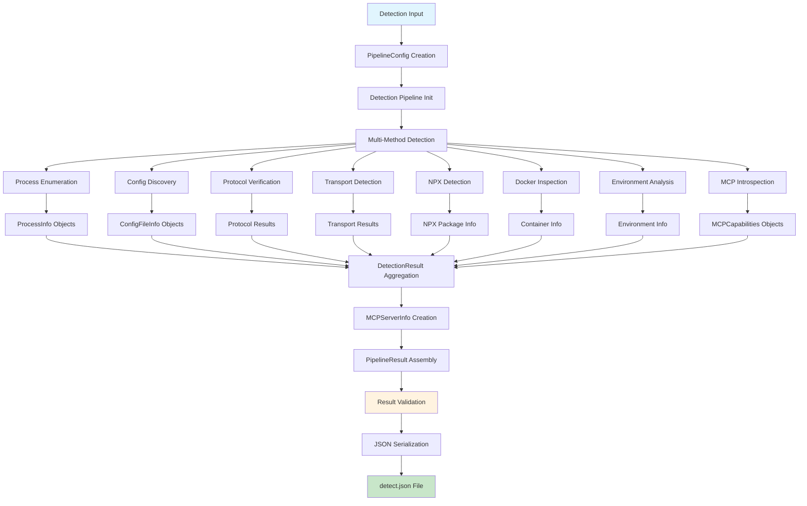
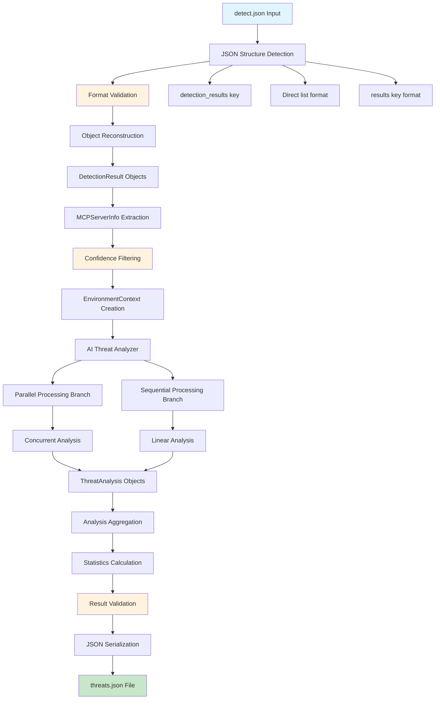
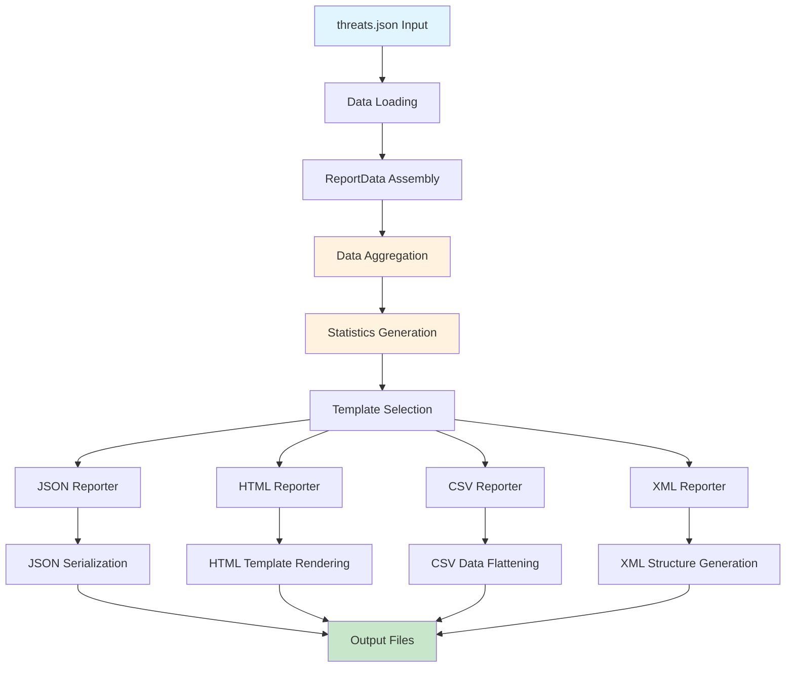

# Data Flow Architecture

## Overview

This document provides a comprehensive analysis of the data flow architecture throughout the HawkEye security assessment workflow. It documents data structures, transformation pipelines, serialization/deserialization points, validation mechanisms, and consistency checks across all phases of the scan → detect → analyze-threats → report pipeline.

## Core Data Structure Hierarchy

### Foundation Data Structures



### Pipeline and Reporting Data Structures



## Data Flow Pipeline

### 1. Scan Phase Data Flow



**Data Transformations:**
1. **Input Processing**: String targets → ScanTarget objects with validation
2. **CIDR Expansion**: Network ranges → Individual IP addresses
3. **Port Scanning**: Network sockets → Port state information
4. **Service Detection**: Network banners → ServiceInfo objects
5. **Result Serialization**: ScanResult objects → JSON format

### 2. Detection Phase Data Flow



**Data Transformations:**
1. **Multi-Method Detection**: Various inputs → DetectionResult objects
2. **Server Info Assembly**: Detection results → MCPServerInfo objects
3. **Introspection Enhancement**: Basic server info → Rich MCPCapabilities data
4. **Pipeline Aggregation**: Individual results → PipelineResult object
5. **Result Serialization**: Complex objects → JSON format

### 3. Analysis Phase Data Flow



**Data Transformations:**
1. **JSON Deserialization**: JSON format → Dictionary structures
2. **Object Reconstruction**: Dictionaries → DetectionResult/MCPServerInfo objects
3. **Context Creation**: Detection data → EnvironmentContext for AI analysis
4. **AI Analysis**: Server info → ThreatAnalysis objects with rich security data
5. **Result Serialization**: ThreatAnalysis objects → JSON format

### 4. Reporting Phase Data Flow



**Data Transformations:**
1. **Data Assembly**: Multiple data sources → ReportData object
2. **Aggregation**: Raw data → Statistical summaries and insights
3. **Template Processing**: Structured data → Format-specific representations
4. **Output Generation**: Templates + data → Final reports in various formats

## Serialization and Deserialization Points

### 1. JSON Serialization Strategy

**Core Serialization Method:**
```python
def to_dict(self) -> Dict[str, Any]:
    """Convert object to dictionary for JSON serialization."""
    return {
        'field_name': self.field_value,
        'enum_field': self.enum_field.value,  # Convert enums to strings
        'nested_object': self.nested_object.to_dict() if self.nested_object else None,
        'object_list': [obj.to_dict() for obj in self.object_list],
        'timestamp': self.timestamp,  # Preserve as float for JSON compatibility
    }
```

**Custom JSON Encoder:**
```python
def json_serializer(obj):
    """Custom JSON serializer for complex objects."""
    if hasattr(obj, 'to_dict'):
        return obj.to_dict()
    elif isinstance(obj, Enum):
        return obj.value
    elif isinstance(obj, datetime):
        return obj.isoformat()
    elif isinstance(obj, Path):
        return str(obj)
    elif isinstance(obj, set):
        return list(obj)
    else:
        return str(obj)
```

### 2. Deserialization and Object Reconstruction

**Detection Result Reconstruction:**
```python
def reconstruct_detection_result(data: Dict[str, Any]) -> DetectionResult:
    """Reconstruct DetectionResult from JSON data."""
    # Map string detection method to enum
    method_mapping = {
        'process_enumeration': DetectionMethod.PROCESS_ENUMERATION,
        'config_discovery': DetectionMethod.CONFIG_FILE_DISCOVERY,
        'protocol_verification': DetectionMethod.PROTOCOL_HANDSHAKE,
        # ... additional mappings
    }
    
    detection_method = method_mapping.get(
        data.get('detection_method', 'unknown'), 
        DetectionMethod.PROCESS_ENUMERATION
    )
    
    # Reconstruct nested MCPServerInfo if present
    mcp_server = None
    if 'mcp_server' in data and data['mcp_server']:
        mcp_server = reconstruct_mcp_server_info(data['mcp_server'])
    
    return DetectionResult(
        target_host=data['target_host'],
        detection_method=detection_method,
        timestamp=data.get('timestamp', time.time()),
        success=data.get('success', False),
        mcp_server=mcp_server,
        confidence=data.get('confidence', 0.0),
        error=data.get('error'),
        raw_data=data.get('raw_data', {}),
        scan_duration=data.get('scan_duration')
    )
```

### 3. Multi-Format JSON Structure Support

**Flexible JSON Input Handling:**
```python
def extract_detection_results(data: Dict[str, Any]) -> List[Dict[str, Any]]:
    """Extract detection results from various JSON structures."""
    if 'detection_results' in data:
        # Standard format from comprehensive/target commands
        return data['detection_results']
    elif isinstance(data, list):
        # Direct list format
        return data
    elif 'results' in data:
        # Alternative structure
        return data['results']
    else:
        raise ValueError("Invalid JSON format: could not find detection results")
```

## Data Validation and Consistency Checks

### 1. Input Validation Framework

**Target Validation:**
```python
def validate_scan_target(target: str) -> bool:
    """Validate scan target format and reachability."""
    validators = [
        _validate_ip_address,
        _validate_cidr_notation,
        _validate_hostname,
        _validate_port_accessibility
    ]
    
    for validator in validators:
        try:
            if validator(target):
                return True
        except ValidationError:
            continue
    
    raise ValidationError(f"Invalid target format: {target}")
```

**Data Structure Validation:**
```python
def validate_detection_result(result: DetectionResult) -> List[ValidationError]:
    """Validate detection result data consistency."""
    errors = []
    
    # Confidence score validation
    if not 0.0 <= result.confidence <= 1.0:
        errors.append(ValidationError("Confidence must be between 0.0 and 1.0"))
    
    # Success/MCP server consistency
    if result.success and not result.mcp_server:
        errors.append(ValidationError("Successful detection must have MCP server info"))
    
    # Timestamp validation
    if result.timestamp > time.time():
        errors.append(ValidationError("Timestamp cannot be in the future"))
    
    # Host consistency
    if result.mcp_server and result.mcp_server.host != result.target_host:
        errors.append(ValidationError("Target host mismatch"))
    
    return errors
```

### 2. Cross-Phase Data Consistency

**Pipeline Result Validation:**
```python
def validate_pipeline_consistency(result: PipelineResult) -> List[ValidationError]:
    """Validate consistency across pipeline phases."""
    errors = []
    
    # Detection count consistency
    total_detections = sum(len(results) for results in result.detection_results.values())
    if total_detections != result.total_detections:
        errors.append(ValidationError("Detection count mismatch"))
    
    # Success/failure count consistency
    successful = sum(1 for results in result.detection_results.values() 
                    for r in results if r.success)
    if successful != result.successful_detections:
        errors.append(ValidationError("Success count mismatch"))
    
    # Best server selection validation
    if result.best_mcp_server:
        server_found = any(r.mcp_server and r.mcp_server.host == result.best_mcp_server.host
                          for results in result.detection_results.values()
                          for r in results)
        if not server_found:
            errors.append(ValidationError("Best server not found in detection results"))
    
    return errors
```

### 3. Schema Validation

**JSON Schema Validation:**
```python
DETECTION_RESULT_SCHEMA = {
    "type": "object",
    "required": ["target_host", "detection_method", "timestamp", "success"],
    "properties": {
        "target_host": {"type": "string", "minLength": 1},
        "detection_method": {"type": "string", "enum": [m.value for m in DetectionMethod]},
        "timestamp": {"type": "number", "minimum": 0},
        "success": {"type": "boolean"},
        "confidence": {"type": "number", "minimum": 0.0, "maximum": 1.0},
        "mcp_server": {"type": ["object", "null"]},
        "error": {"type": ["string", "null"]},
        "raw_data": {"type": "object"}
    }
}

def validate_json_schema(data: Dict[str, Any], schema: Dict[str, Any]) -> bool:
    """Validate data against JSON schema."""
    try:
        jsonschema.validate(data, schema)
        return True
    except jsonschema.ValidationError as e:
        logger.error(f"Schema validation failed: {e}")
        return False
```

## Data Consistency Mechanisms

### 1. Referential Integrity

**Server Reference Validation:**
```python
def validate_server_references(pipeline_result: PipelineResult) -> List[ValidationError]:
    """Validate that all server references are consistent."""
    errors = []
    server_ids = set()
    
    # Collect all server IDs from detection results
    for results in pipeline_result.detection_results.values():
        for result in results:
            if result.mcp_server:
                server_ids.add(result.mcp_server.host)
    
    # Validate introspection results reference known servers
    for server_id in pipeline_result.introspection_results.keys():
        host = server_id.split('_')[0]  # Extract host from server_id
        if host not in server_ids:
            errors.append(ValidationError(f"Introspection result for unknown server: {server_id}"))
    
    return errors
```

### 2. Temporal Consistency

**Timestamp Validation:**
```python
def validate_temporal_consistency(results: List[DetectionResult]) -> List[ValidationError]:
    """Validate temporal consistency across results."""
    errors = []
    
    if not results:
        return errors
    
    # Sort by timestamp
    sorted_results = sorted(results, key=lambda r: r.timestamp)
    
    # Check for reasonable time gaps
    for i in range(1, len(sorted_results)):
        time_diff = sorted_results[i].timestamp - sorted_results[i-1].timestamp
        if time_diff > 3600:  # More than 1 hour gap
            errors.append(ValidationError(f"Large time gap detected: {time_diff} seconds"))
    
    return errors
```

### 3. Data Completeness Validation

**Completeness Checks:**
```python
def validate_data_completeness(report_data: ReportData) -> List[ValidationError]:
    """Validate data completeness across all phases."""
    errors = []
    
    # Check for minimum required data
    if not report_data.has_detection_data and not report_data.has_scan_data:
        errors.append(ValidationError("Report must contain scan or detection data"))
    
    # Validate metadata completeness
    if not report_data.metadata.title:
        errors.append(ValidationError("Report title is required"))
    
    # Check for orphaned data
    if report_data.introspection_data and not report_data.mcp_servers:
        errors.append(ValidationError("Introspection data present but no MCP servers"))
    
    # Validate summary consistency
    if report_data.detection_summary:
        expected_servers = len(report_data.mcp_servers)
        actual_servers = report_data.detection_summary.servers_detected
        if expected_servers != actual_servers:
            errors.append(ValidationError("Server count mismatch in summary"))
    
    return errors
```

## Error Handling and Data Recovery

### 1. Partial Data Recovery

**Recovery Strategies:**
```python
def recover_partial_data(corrupted_data: Dict[str, Any]) -> Dict[str, Any]:
    """Attempt to recover usable data from corrupted input."""
    recovered_data = {
        'scan_results': [],
        'detection_results': [],
        'assessment_results': [],
        'errors': []
    }
    
    # Attempt to recover scan results
    if 'scan_results' in corrupted_data:
        for item in corrupted_data['scan_results']:
            try:
                # Validate and reconstruct scan result
                scan_result = reconstruct_scan_result(item)
                recovered_data['scan_results'].append(scan_result)
            except Exception as e:
                recovered_data['errors'].append(f"Failed to recover scan result: {e}")
    
    # Attempt to recover detection results
    if 'detection_results' in corrupted_data:
        for item in corrupted_data['detection_results']:
            try:
                detection_result = reconstruct_detection_result(item)
                recovered_data['detection_results'].append(detection_result)
            except Exception as e:
                recovered_data['errors'].append(f"Failed to recover detection result: {e}")
    
    return recovered_data
```

### 2. Data Sanitization

**Input Sanitization:**
```python
def sanitize_input_data(raw_data: Dict[str, Any]) -> Dict[str, Any]:
    """Sanitize input data to prevent processing errors."""
    sanitized = {}
    
    for key, value in raw_data.items():
        if isinstance(value, str):
            # Remove potential injection characters
            sanitized[key] = re.sub(r'[<>"\']', '', value)[:1000]  # Limit length
        elif isinstance(value, (int, float)):
            # Validate numeric ranges
            sanitized[key] = max(0, min(value, 1000000))  # Reasonable bounds
        elif isinstance(value, list):
            # Sanitize list contents
            sanitized[key] = [sanitize_input_data(item) if isinstance(item, dict) else item 
                             for item in value[:1000]]  # Limit list size
        elif isinstance(value, dict):
            # Recursively sanitize nested dictionaries
            sanitized[key] = sanitize_input_data(value)
        else:
            sanitized[key] = value
    
    return sanitized
```

## Performance Optimization

### 1. Data Streaming

**Large Dataset Handling:**
```python
def process_large_dataset(file_path: str, chunk_size: int = 1000):
    """Process large datasets in chunks to manage memory usage."""
    with open(file_path, 'r') as file:
        data = json.load(file)
        
        if 'detection_results' in data and len(data['detection_results']) > chunk_size:
            # Process in chunks
            results = data['detection_results']
            for i in range(0, len(results), chunk_size):
                chunk = results[i:i + chunk_size]
                yield process_detection_chunk(chunk)
        else:
            # Process normally for small datasets
            yield process_detection_results(data.get('detection_results', []))
```

### 2. Caching Strategy

**Data Caching:**
```python
class DataCache:
    """Cache for frequently accessed data transformations."""
    
    def __init__(self, max_size: int = 1000):
        self.cache = {}
        self.max_size = max_size
        self.access_times = {}
    
    def get_cached_transformation(self, key: str, data: Dict[str, Any]) -> Optional[Any]:
        """Get cached transformation result."""
        cache_key = self._generate_cache_key(key, data)
        if cache_key in self.cache:
            self.access_times[cache_key] = time.time()
            return self.cache[cache_key]
        return None
    
    def cache_transformation(self, key: str, data: Dict[str, Any], result: Any):
        """Cache transformation result."""
        cache_key = self._generate_cache_key(key, data)
        
        # Implement LRU eviction if cache is full
        if len(self.cache) >= self.max_size:
            oldest_key = min(self.access_times.keys(), key=self.access_times.get)
            del self.cache[oldest_key]
            del self.access_times[oldest_key]
        
        self.cache[cache_key] = result
        self.access_times[cache_key] = time.time()
```

## Quality Assurance

### 1. Data Integrity Tests

**Automated Testing:**
```python
def test_data_integrity(report_data: ReportData) -> bool:
    """Run comprehensive data integrity tests."""
    test_results = []
    
    # Run all validation tests
    test_results.extend(validate_data_completeness(report_data))
    test_results.extend(validate_cross_references(report_data))
    test_results.extend(validate_temporal_consistency(report_data.detection_results))
    test_results.extend(validate_statistical_consistency(report_data))
    
    # Log any validation errors
    for error in test_results:
        logger.error(f"Data integrity issue: {error}")
    
    return len(test_results) == 0
```

### 2. Data Quality Metrics

**Quality Scoring:**
```python
def calculate_data_quality_score(report_data: ReportData) -> float:
    """Calculate overall data quality score (0.0 to 1.0)."""
    scores = []
    
    # Completeness score
    completeness = calculate_completeness_score(report_data)
    scores.append(completeness * 0.3)
    
    # Consistency score
    consistency = calculate_consistency_score(report_data)
    scores.append(consistency * 0.3)
    
    # Accuracy score (based on confidence levels)
    accuracy = calculate_accuracy_score(report_data)
    scores.append(accuracy * 0.2)
    
    # Timeliness score (based on data freshness)
    timeliness = calculate_timeliness_score(report_data)
    scores.append(timeliness * 0.2)
    
    return sum(scores)
```

This comprehensive data flow architecture ensures robust, reliable, and consistent data processing throughout the entire HawkEye security assessment workflow, with built-in validation, error handling, and quality assurance mechanisms. 