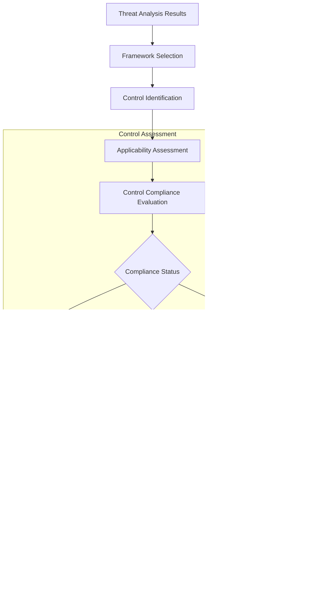

# Compliance Mapping System - HawkEye AI Threat Analysis

## Overview

The HawkEye Compliance Mapping System provides comprehensive regulatory framework compliance assessment capabilities, mapping identified security threats and vulnerabilities to specific compliance controls. The system supports multiple frameworks, performs gap analysis, and generates automated compliance reports essential for meeting regulatory requirements and audit preparations.

## Architecture Components

### 1. Compliance Mapping Architecture


### 2. Compliance Framework Data Models


### 3. Compliance Assessment Pipeline



## Supported Compliance Frameworks

### 1. SOC 2 Type II

**Framework Definition**:
```python
'SOC2': {
    'name': 'SOC 2 Type II',
    'description': 'Service Organization Control 2 - Security, Availability, Processing Integrity, Confidentiality, Privacy',
    'categories': ['Common Criteria', 'Additional Criteria'],
    'controls': {
        'CC6.1': ComplianceControl(
            id='CC6.1',
            framework='SOC2',
            category=ControlCategory.ACCESS_CONTROL,
            title='Logical and Physical Access Controls',
            description='The entity implements logical access security measures to protect against threats from sources outside its system boundaries',
            requirements=[
                'Implement user access management processes',
                'Establish authentication mechanisms',
                'Configure authorization controls',
                'Monitor access activities'
            ],
            evidence_requirements=[
                'Access control policies and procedures',
                'User access reviews and certifications',
                'Authentication system configuration',
                'Access monitoring logs and reports'
            ],
            testing_procedures=[
                'Review access control policies',
                'Test user provisioning and deprovisioning',
                'Validate authentication mechanisms',
                'Examine access monitoring capabilities'
            ],
            severity='high',
            applies_to_environment=True
        )
    }
}
```

**Key Control Areas**:
- **CC6.x**: Logical and Physical Access Controls
- **CC7.x**: System Operations, including monitoring and incident response
- **CC8.x**: Change Management
- **A1.x**: Availability controls
- **C1.x**: Confidentiality controls

### 2. NIST Cybersecurity Framework

**Framework Coverage**:
- **Identify**: Asset management, governance, risk assessment
- **Protect**: Access control, data security, protective technology
- **Detect**: Anomalies and events, continuous monitoring
- **Respond**: Response planning, communications, analysis
- **Recover**: Recovery planning, improvements, communications

### 3. PCI DSS (Payment Card Industry Data Security Standard)

**Requirements Coverage**:
- **Requirement 1**: Install and maintain a firewall configuration
- **Requirement 2**: Do not use vendor-supplied defaults for system passwords
- **Requirement 3**: Protect stored cardholder data
- **Requirement 4**: Encrypt transmission of cardholder data
- **Requirements 5-12**: Additional security controls

### 4. GDPR (General Data Protection Regulation)

**Key Articles Mapped**:
- **Article 25**: Data Protection by Design and by Default
- **Article 32**: Security of Processing
- **Article 33**: Notification of Data Breach
- **Article 35**: Data Protection Impact Assessment

### 5. HIPAA Security Rule

**Safeguard Categories**:
- **Administrative**: Security management, access management
- **Physical**: Facility access controls, workstation security
- **Technical**: Access control, audit controls, integrity, transmission security

### 6. ISO 27001

**Control Domains**:
- **A.5**: Information Security Policies
- **A.6**: Organization of Information Security
- **A.8**: Asset Management
- **A.9**: Access Control
- **A.10**: Cryptography

## Core Features

### 1. Threat-to-Control Mapping

#### Mapping Algorithm

```python
def map_threats_to_controls(self,
                          threat_analysis: Dict[str, Any],
                          frameworks: List[str]) -> Dict[str, Dict[str, List[str]]]:
    """
    Map identified threats to specific compliance controls.
    
    Process:
    1. Extract threat categories from analysis
    2. Identify relevant controls for each threat
    3. Map controls to specific framework requirements
    4. Generate comprehensive mapping dictionary
    """
```

#### Threat Category Mappings

```python
threat_control_mappings = {
    'SOC2': {
        'authentication_bypass': ['CC6.1', 'CC6.2', 'CC6.3'],
        'unauthorized_file_access': ['CC6.1', 'CC6.7', 'C1.1'],
        'data_exfiltration': ['CC6.7', 'C1.1', 'C1.2'],
        'privilege_escalation': ['CC6.2', 'CC6.3', 'CC6.8'],
        'network_reconnaissance': ['CC6.1', 'CC7.1', 'CC7.2'],
        'system_compromise': ['CC6.1', 'CC6.8', 'CC7.1', 'CC8.1']
    },
    'NIST_CSF': {
        'authentication_bypass': ['PR.AC-1', 'PR.AC-6', 'PR.AC-7'],
        'unauthorized_file_access': ['PR.AC-4', 'PR.DS-1', 'PR.DS-5'],
        'data_exfiltration': ['PR.DS-5', 'DE.CM-1', 'DE.CM-3'],
        'privilege_escalation': ['PR.AC-6', 'PR.PT-1', 'DE.CM-7'],
        'network_reconnaissance': ['DE.CM-1', 'DE.CM-7', 'PR.PT-4'],
        'system_compromise': ['DE.CM-1', 'DE.CM-4', 'RS.RP-1']
    }
}
```

### 2. Control Applicability Assessment

#### Environmental Context Evaluation

```python
def _identify_applicable_controls(self,
                                controls: Dict[str, ComplianceControl],
                                environment_context: EnvironmentContext,
                                threat_analysis: Dict[str, Any]) -> Dict[str, ComplianceControl]:
    """
    Identify which controls apply to the specific environment.
    
    Factors Considered:
    - Deployment type (cloud vs on-premise)
    - Data sensitivity levels
    - Network exposure
    - Compliance requirements
    - Detected threat patterns
    """
```

#### Applicability Criteria

**Deployment Type Filters**:
- **Cloud Environments**: Focus on shared responsibility model controls
- **On-Premise**: Emphasize physical and infrastructure controls
- **Hybrid**: Apply both cloud and on-premise relevant controls

**Data Sensitivity Mapping**:
- **Public Data**: Basic security controls
- **Internal Data**: Standard protection controls
- **Confidential**: Enhanced security controls
- **Restricted**: Maximum security controls

### 3. Compliance Gap Analysis

#### Gap Detection Algorithm

```python
def _assess_control_compliance(self,
                             control: ComplianceControl,
                             threat_analysis: Dict[str, Any],
                             current_controls: Optional[Dict[str, Any]]) -> ComplianceStatus:
    """
    Assess compliance status for a specific control.
    
    Assessment Logic:
    1. Check for relevant threats addressed by control
    2. Evaluate current control implementation
    3. Compare against control requirements
    4. Determine compliance status
    """
```

#### Gap Classification

```python
def _create_compliance_gap(self,
                         control: ComplianceControl,
                         compliance_status: ComplianceStatus,
                         threat_analysis: Dict[str, Any]) -> ComplianceGap:
    """
    Create detailed compliance gap record.
    
    Gap Analysis Includes:
    - Root cause identification
    - Risk level assessment
    - Remediation recommendations
    - Implementation effort estimates
    - Business impact analysis
    """
```

### 4. Automated Compliance Reporting

#### Report Generation Pipeline

```python
def generate_compliance_assessment(self,
                                 threat_analysis: Dict[str, Any],
                                 environment_context: EnvironmentContext,
                                 target_frameworks: List[str],
                                 current_controls: Optional[Dict[str, Any]] = None) -> List[ComplianceAssessment]:
    """
    Generate comprehensive compliance assessments.
    
    Process:
    1. Assess each target framework
    2. Calculate compliance percentages
    3. Identify and categorize gaps
    4. Generate remediation recommendations
    5. Create executive summaries
    """
```

#### Report Components

**Executive Summary Generation**:
```python
def _create_compliance_executive_summary(self,
                                       framework: str,
                                       overall_status: ComplianceStatus,
                                       compliance_percentage: float,
                                       gap_count: int) -> str:
    """
    Generate executive-level compliance summary.
    
    Includes:
    - Overall compliance status
    - Key compliance metrics
    - Critical gaps requiring attention
    - Business risk implications
    """
```

## Advanced Features

### 1. Multi-Framework Assessment

#### Cross-Framework Analysis

The system can assess multiple frameworks simultaneously and identify:
- **Control Overlaps**: Where single implementations satisfy multiple frameworks
- **Gap Convergence**: Common gaps across multiple frameworks
- **Prioritization Matrix**: Risk-based prioritization across all frameworks

#### Framework Harmonization

```python
def harmonize_framework_requirements(self,
                                   frameworks: List[str],
                                   threat_analysis: Dict[str, Any]) -> Dict[str, Any]:
    """
    Harmonize requirements across multiple frameworks.
    
    Benefits:
    - Reduced implementation overhead
    - Consistent control implementation
    - Optimized resource allocation
    - Streamlined audit preparation
    """
```

### 2. Dynamic Control Mapping

#### Threat-Driven Control Selection

The system dynamically selects relevant controls based on:
- **Identified Threat Patterns**: Controls mapped to specific threats
- **Risk Severity**: Higher priority for critical threat controls
- **Environmental Context**: Environment-specific control applicability
- **Business Impact**: Controls aligned with business risk tolerance

#### Adaptive Assessment

```python
def _adaptive_control_assessment(self,
                               threat_patterns: List[str],
                               environment_context: EnvironmentContext,
                               framework: str) -> List[ComplianceControl]:
    """
    Adaptively select controls based on threat landscape.
    
    Adaptation Factors:
    - Current threat environment
    - Historical attack patterns
    - Industry-specific threats
    - Regulatory focus areas
    """
```

### 3. Remediation Planning

#### Gap Remediation Generation

```python
def _generate_compliance_recommendations(self,
                                       gaps: List[ComplianceGap],
                                       framework: str,
                                       environment_context: EnvironmentContext) -> List[str]:
    """
    Generate actionable remediation recommendations.
    
    Recommendation Categories:
    - Immediate actions for critical gaps
    - Short-term implementation plans
    - Long-term strategic improvements
    - Continuous monitoring requirements
    """
```

#### Implementation Prioritization

**Priority Matrix**:
- **P0 (Critical)**: Regulatory violations, critical security gaps
- **P1 (High)**: High-risk gaps with compliance impact
- **P2 (Medium)**: Standard compliance requirements
- **P3 (Low)**: Best practice improvements

## Integration Points

### 1. Threat Analysis Integration

```python
# Compliance mapping in threat analysis pipeline
compliance_mapper = ComplianceMapper()
compliance_assessments = compliance_mapper.generate_compliance_assessment(
    threat_analysis=ai_threat_results,
    environment_context=environment,
    target_frameworks=['SOC2', 'NIST_CSF', 'ISO_27001']
)

# Generate threat-to-control mappings
control_mappings = compliance_mapper.map_threats_to_controls(
    threat_analysis=ai_threat_results,
    frameworks=['SOC2', 'NIST_CSF']
)
```

### 2. Assessment Pipeline Integration

```python
# Compliance checking in assessment pipeline
compliance_checker = ComplianceChecker()
compliance_result = compliance_checker.assess(
    detection_result=mcp_detection_result,
    frameworks=[ComplianceFramework.SOC2, ComplianceFramework.NIST_CSF],
    findings=security_findings
)
```

### 3. Report Generation Integration

```python
# Compliance reporting integration
compliance_template = ComplianceReportTemplate()
compliance_report = compliance_template.render(
    compliance_data=compliance_assessments,
    environment_context=environment,
    include_gap_analysis=True,
    include_remediation_plan=True
)
```

## Compliance Control Categories

### 1. Access Control

**Control Examples**:
- User authentication and authorization
- Privileged access management
- Role-based access control (RBAC)
- Multi-factor authentication (MFA)

**MCP-Specific Considerations**:
- API access controls for MCP servers
- Tool-specific permission models
- Session management for AI tools
- Cross-tool authorization policies

### 2. Data Protection

**Control Examples**:
- Data encryption at rest and in transit
- Data loss prevention (DLP)
- Data classification and handling
- Privacy controls for personal data

**MCP-Specific Considerations**:
- AI model data protection
- Prompt injection prevention
- Output sanitization
- Data residency compliance

### 3. Monitoring and Logging

**Control Examples**:
- Security event monitoring
- Audit log collection and analysis
- Incident detection and response
- Real-time alerting systems

**MCP-Specific Considerations**:
- AI tool usage monitoring
- Anomalous behavior detection
- Tool interaction logging
- Performance and availability monitoring

### 4. Configuration Management

**Control Examples**:
- Secure configuration baselines
- Change management processes
- Configuration drift detection
- Vulnerability management

**MCP-Specific Considerations**:
- MCP server configuration security
- Tool deployment standards
- Version control for AI models
- Security patch management

## Performance Characteristics

### 1. Assessment Performance

**Framework Assessment Times**:
- **Single Framework**: 5-15 seconds for 50 controls
- **Multiple Frameworks**: 30-60 seconds for 200+ controls
- **Large Enterprise**: 2-5 minutes for 500+ controls

**Memory Usage**:
- **Small Assessment**: 20-50MB
- **Medium Assessment**: 50-150MB
- **Large Assessment**: 150-500MB

### 2. Optimization Strategies

**Control Caching**:
- Pre-compiled control definitions
- Cached threat-to-control mappings
- Reusable assessment templates

**Parallel Processing**:
- Concurrent framework assessments
- Parallel control evaluations
- Distributed gap analysis

**Incremental Assessment**:
- Delta-based reassessments
- Change-triggered evaluations
- Continuous compliance monitoring

## Report Formats and Outputs

### 1. Executive Dashboard

**Key Metrics**:
- Overall compliance percentages
- Critical gap counts
- Risk trend analysis
- Compliance improvement tracking

### 2. Technical Assessment Report

**Detailed Sections**:
- Control-by-control assessment
- Gap analysis with root causes
- Technical remediation guidance
- Implementation roadmaps

### 3. Audit-Ready Documentation

**Compliance Evidence**:
- Control testing results
- Implementation documentation
- Gap remediation tracking
- Continuous monitoring reports

## Security and Privacy Considerations

### 1. Data Protection

**Sensitive Data Handling**:
- Encryption of compliance data
- Access controls for assessment results
- Audit trails for compliance activities
- Data retention policy compliance

### 2. Regulatory Alignment

**Framework Currency**:
- Regular updates to control definitions
- Regulatory change monitoring
- Framework version management
- Industry best practice integration

## Future Enhancements

### 1. AI-Enhanced Assessment

**Planned Capabilities**:
- **Machine Learning Models**: Predictive compliance risk assessment
- **Natural Language Processing**: Automated control interpretation
- **Pattern Recognition**: Intelligent gap correlation
- **Behavioral Analysis**: Continuous compliance monitoring

### 2. Integration Expansions

**Additional Frameworks**:
- **FedRAMP**: Federal cloud security requirements
- **COBIT**: IT governance and management
- **CIS Controls**: Center for Internet Security
- **Cloud Security Alliance**: Cloud-specific controls

### 3. Automation Features

**Automated Remediation**:
- Self-healing compliance controls
- Automated evidence collection
- Real-time compliance monitoring
- Predictive compliance analytics

This comprehensive compliance mapping system provides organizations with sophisticated regulatory framework assessment capabilities, enabling proactive compliance management and automated audit preparation for MCP security environments. 