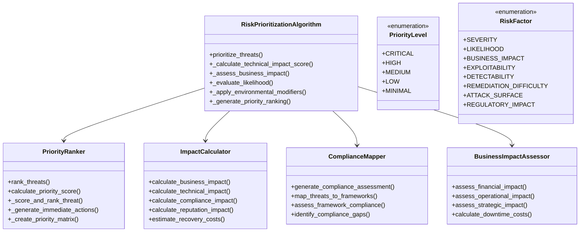
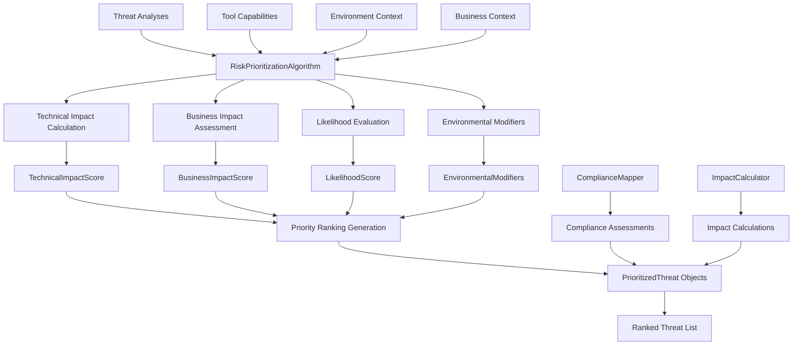
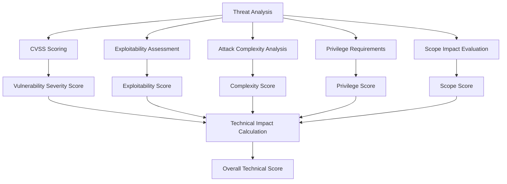
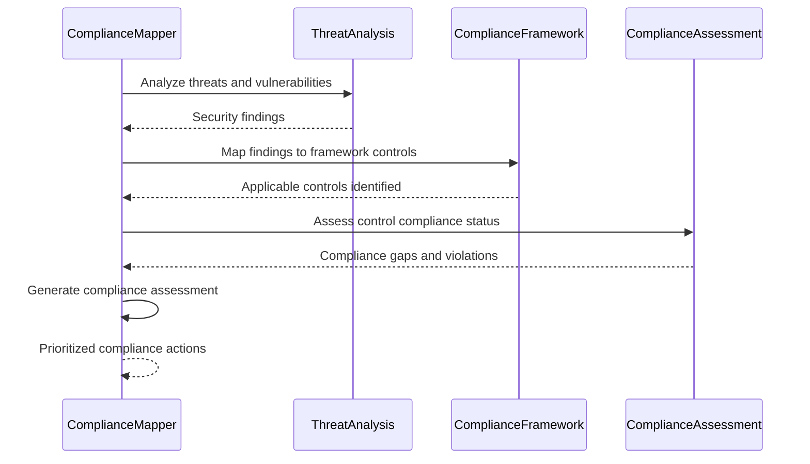

# Risk Prioritization Engine Documentation

## Overview

The Risk Prioritization Engine is a sophisticated component of the AI threat analysis system that implements comprehensive risk assessment and prioritization algorithms. This engine transforms identified threats and vulnerabilities into actionable priorities by combining technical impact analysis, business impact assessment, likelihood evaluation, and environmental modifiers to help security teams focus on the most critical risks first.

## Architecture

### Core Components



### Data Flow Architecture



## Risk Prioritization Algorithm

### Five-Step Process

The core `RiskPrioritizationAlgorithm` implements a structured five-step process:

1. **Technical Impact Score Calculation**
2. **Business Impact Assessment**
3. **Likelihood Evaluation**
4. **Environmental Modifiers Application**
5. **Final Priority Ranking Generation**

#### Algorithm Implementation

```python
def prioritize_threats(
    self,
    threat_analyses: List[ThreatAnalysis],
    tool_capabilities: List[ToolCapabilities],
    environment_context: EnvironmentContext,
    business_context: Optional[Dict[str, Any]] = None
) -> List[PrioritizedThreat]:
    """
    Prioritize threats using the Risk Prioritization Algorithm.
    
    Process:
    1. Calculate technical impact score
    2. Assess business impact based on context
    3. Evaluate likelihood based on threat actor capabilities
    4. Apply environmental modifiers
    5. Generate final priority ranking
    """
```

### Scoring Weights Configuration

The algorithm uses configurable weights for different risk components:

```python
scoring_weights = {
    'technical_impact': 0.25,      # 25% - Technical severity and exploitability
    'business_impact': 0.35,       # 35% - Business consequences and costs
    'likelihood': 0.25,            # 25% - Probability of successful attack
    'environmental_factors': 0.15  # 15% - Environment-specific modifiers
}
```

### Priority Thresholds

Risk scores are mapped to priority levels using configurable thresholds:

```python
priority_thresholds = {
    PriorityLevel.CRITICAL: 0.85,  # 85-100% - Immediate action required
    PriorityLevel.HIGH: 0.70,      # 70-84% - High priority remediation
    PriorityLevel.MEDIUM: 0.50,    # 50-69% - Scheduled remediation
    PriorityLevel.LOW: 0.30        # 30-49% - Monitor and plan
    # Below 30% - Minimal priority
}
```

## Technical Impact Assessment

### Technical Impact Scoring Model

```python
@dataclass
class TechnicalImpactScore:
    """Technical impact assessment result."""
    vulnerability_severity: float      # 0.0-1.0
    exploitability_score: float       # 0.0-1.0
    attack_complexity: float          # 0.0-1.0 (inverted)
    privilege_requirements: float     # 0.0-1.0 (inverted)
    user_interaction: float           # 0.0-1.0 (inverted)
    scope_impact: float               # 0.0-1.0
    confidentiality_impact: float     # 0.0-1.0
    integrity_impact: float           # 0.0-1.0
    availability_impact: float        # 0.0-1.0
    overall_score: float              # Weighted combination
    scoring_rationale: str            # Human-readable explanation
```

### Technical Impact Calculation Process



### Key Technical Factors

#### Vulnerability Severity
- **CVSS Base Score**: Uses CVSS v3.1 base scoring
- **Exploit Availability**: Public exploits increase severity
- **Attack Vector**: Network attacks score higher than local
- **Attack Complexity**: Simple attacks score higher

#### Exploitability Assessment
- **Proof of Concept Available**: Increases exploitability score
- **Weaponized Exploits**: Maximum exploitability rating
- **Exploit Complexity**: Complex exploits reduce score
- **Success Rate**: Historical exploitation success rates

## Business Impact Assessment

### Business Impact Categories

The system assesses business impact across five key dimensions:

#### 1. Financial Impact (30% weight)
- **Direct Costs**: Incident response, recovery, legal fees
- **Revenue Loss**: Business disruption and lost opportunities
- **Regulatory Fines**: Compliance violation penalties
- **Insurance Claims**: Cyber insurance deductibles and coverage gaps

#### 2. Operational Impact (25% weight)
- **System Downtime**: Service unavailability duration and cost
- **Productivity Loss**: Employee productivity disruption
- **Process Disruption**: Business process interruption
- **Resource Diversion**: Security team resource allocation

#### 3. Reputational Impact (20% weight)
- **Customer Trust**: Brand reputation and customer confidence
- **Market Position**: Competitive advantage erosion
- **Media Coverage**: Negative publicity impact
- **Stakeholder Confidence**: Investor and partner trust

#### 4. Compliance Impact (15% weight)
- **Regulatory Violations**: Framework non-compliance
- **Audit Findings**: Compliance audit implications
- **Certification Risk**: Security certification threats
- **Legal Liability**: Litigation and legal exposure

#### 5. Strategic Impact (10% weight)
- **Strategic Objectives**: Mission-critical goal impact
- **Innovation Disruption**: R&D and innovation delays
- **Competitive Advantage**: Market position threats
- **Long-term Planning**: Strategic plan disruption

### Business Impact Calculation

```python
@dataclass
class BusinessImpactScore:
    """Business impact assessment result."""
    financial_impact: float          # 0.0-1.0
    operational_impact: float        # 0.0-1.0
    reputational_impact: float       # 0.0-1.0
    compliance_impact: float         # 0.0-1.0
    strategic_impact: float          # 0.0-1.0
    overall_score: float             # Weighted combination
    cost_estimate: float             # Estimated financial cost
    recovery_time_estimate: str      # Expected recovery duration
    business_context_factors: List[str]  # Contributing factors
```

### Cost Multipliers

The system uses industry-standard cost multipliers:

```python
cost_multipliers = {
    'data_breach': 150.0,      # Cost per record (USD)
    'downtime': 5000.0,        # Cost per hour (USD)
    'regulatory_fine': 100000.0, # Base fine amount (USD)
    'reputation_damage': 50000.0 # Estimated reputation cost (USD)
}
```

## Likelihood Evaluation

### Threat Actor Capability Assessment

The system models different threat actor types with capability scores:

```python
threat_actor_capabilities = {
    'script_kiddie': 0.3,              # 30% capability
    'cybercriminal': 0.6,              # 60% capability
    'insider_threat': 0.7,             # 70% capability
    'nation_state': 0.9,               # 90% capability
    'advanced_persistent_threat': 0.95 # 95% capability
}
```

### Likelihood Factors

#### Attack Complexity Factors
- **Technical Difficulty**: Skill level required for exploitation
- **Resource Requirements**: Tools and infrastructure needed
- **Time Investment**: Duration required for successful attack
- **Success Probability**: Historical attack success rates

#### Environmental Factors
- **Attack Surface**: Exposed interfaces and services
- **Security Controls**: Defensive measures in place
- **Monitoring Capabilities**: Detection and response readiness
- **Target Attractiveness**: Value proposition for attackers

### Likelihood Scoring Model

```python
@dataclass
class LikelihoodScore:
    """Likelihood assessment result."""
    threat_actor_capability: float    # 0.0-1.0
    attack_complexity: float          # 0.0-1.0 (inverted)
    environmental_factors: float      # 0.0-1.0
    historical_frequency: float       # 0.0-1.0
    target_attractiveness: float      # 0.0-1.0
    overall_score: float              # Weighted combination
    confidence_level: str             # low, medium, high
    likelihood_rationale: str         # Explanation of assessment
```

## Environmental Modifiers

### Environmental Context Factors

The system applies environmental modifiers based on deployment context:

#### Deployment Environment Modifiers
- **Production Systems**: Higher impact multiplier (1.2-1.5x)
- **Development/Test**: Lower impact multiplier (0.5-0.8x)
- **Cloud Deployment**: Network exposure considerations
- **On-Premises**: Physical security factors

#### Security Posture Modifiers
- **Hardened Systems**: Risk reduction (0.7-0.9x multiplier)
- **Default Configurations**: Risk increase (1.1-1.3x multiplier)
- **Security Monitoring**: Detection capability bonus
- **Incident Response**: Response readiness bonus

### Environmental Modifier Calculation

```python
@dataclass
class EnvironmentalModifiers:
    """Environmental risk modifiers."""
    deployment_factor: float           # Deployment environment impact
    security_posture_factor: float     # Security hardening level
    network_exposure_factor: float     # Internet exposure risk
    data_sensitivity_factor: float     # Data classification impact
    monitoring_capability_factor: float # Detection capability
    incident_response_factor: float    # Response readiness
    overall_modifier: float            # Combined modifier (0.5-2.0)
    modifier_explanation: str          # Rationale for modifiers
```

## Priority Ranking System

### Multi-Factor Priority Scoring

The `PriorityRanker` implements comprehensive multi-factor scoring:

#### Risk Factors Evaluated

1. **Severity Factor**: Vulnerability severity and impact
2. **Likelihood Factor**: Probability of successful exploitation
3. **Business Impact Factor**: Business consequences and costs
4. **Exploitability Factor**: Ease of exploitation
5. **Detectability Factor**: Detection difficulty (inverted)
6. **Remediation Factor**: Remediation complexity (inverted)
7. **Attack Surface Factor**: Exposure and accessibility
8. **Regulatory Factor**: Compliance and legal implications

### Priority Score Calculation

```python
def calculate_priority_score(
    self,
    threat_data: Dict[str, Any],
    tool_capabilities: ToolCapabilities,
    environment_context: EnvironmentContext
) -> PriorityScore:
    """Calculate comprehensive priority score for a single threat."""
    
    # Calculate individual scoring factors
    score_factors = [
        self._calculate_severity_factor(threat_data),
        self._calculate_likelihood_factor(threat_data),
        self._calculate_business_impact_factor(threat_data, environment_context),
        self._calculate_exploitability_factor(threat_data, tool_capabilities),
        self._calculate_detectability_factor(threat_data),
        self._calculate_remediation_difficulty_factor(threat_data),
        self._calculate_attack_surface_factor(threat_data, tool_capabilities),
        self._calculate_regulatory_impact_factor(threat_data, environment_context)
    ]
    
    # Calculate weighted overall score
    overall_score = sum(factor.weighted_score for factor in score_factors)
    
    # Determine priority level
    priority_level = self._determine_priority_level(overall_score)
    
    return PriorityScore(
        overall_score=overall_score,
        priority_level=priority_level,
        scoring_factors=score_factors,
        confidence_level=self._calculate_confidence_level(score_factors)
    )
```

### Priority Matrix Generation

```python
@dataclass
class PriorityMatrix:
    """Complete priority ranking matrix."""
    ranked_items: List[PriorityItem]          # All items ranked by priority
    critical_items: List[PriorityItem]        # Critical priority items
    high_priority_items: List[PriorityItem]   # High priority items
    immediate_actions: List[str]              # Immediate action recommendations
    matrix_metadata: Dict[str, Any]           # Ranking metadata and statistics
    generation_timestamp: str                 # When matrix was generated
```

## Compliance Framework Integration

### Supported Compliance Frameworks

The system integrates with major compliance frameworks:

#### Regulatory Frameworks
- **GDPR**: General Data Protection Regulation
- **HIPAA**: Health Insurance Portability and Accountability Act
- **PCI-DSS**: Payment Card Industry Data Security Standard
- **SOC 2**: Service Organization Control 2
- **ISO 27001**: Information Security Management Systems

#### Security Frameworks
- **NIST CSF**: NIST Cybersecurity Framework
- **OWASP Top 10**: Web Application Security Risks
- **CIS Controls**: Center for Internet Security Controls
- **COBIT**: Control Objectives for Information and Related Technologies

### Compliance Assessment Process



### Compliance Impact Scoring

```python
def _calculate_compliance_impact(
    self,
    threat_analysis: ThreatAnalysis,
    environment_context: EnvironmentContext,
    business_context: Optional[Dict[str, Any]]
) -> float:
    """Calculate compliance impact of a threat."""
    
    impact = 0.2  # Base compliance impact
    
    # Data sensitivity affects compliance requirements
    if environment_context.data_sensitivity == DataSensitivity.RESTRICTED:
        impact += 0.5  # High compliance requirements
    elif environment_context.data_sensitivity == DataSensitivity.CONFIDENTIAL:
        impact += 0.3
    
    # Industry context affects compliance obligations
    if business_context:
        industry = business_context.get('industry', '')
        if industry.lower() in ['finance', 'healthcare', 'government']:
            impact += 0.2  # Heavily regulated industries
    
    return min(1.0, impact)
```

### Compliance Gap Analysis

```python
@dataclass
class ComplianceGap:
    """Represents a compliance gap or violation."""
    gap_id: str
    framework: str                    # Which compliance framework
    control_id: str                   # Specific control reference
    control_description: str          # What the control requires
    current_status: ComplianceStatus  # Current compliance state
    gap_description: str              # Description of the gap
    risk_level: str                   # Risk level of the gap
    remediation_actions: List[str]    # Required remediation steps
    target_completion_date: str       # When gap should be closed
    responsible_team: str             # Who should address the gap
```

## Performance Optimization

### Caching Strategy

The risk prioritization engine implements intelligent caching:

```python
class RiskPrioritizationCache:
    """Cache for risk prioritization results."""
    
    def __init__(self):
        self.score_cache = {}           # Individual risk scores
        self.priority_cache = {}        # Priority rankings
        self.impact_cache = {}          # Business impact calculations
        self.compliance_cache = {}      # Compliance assessments
        self.environmental_cache = {}   # Environmental modifier calculations
```

### Parallel Processing

- **Concurrent Scoring**: Parallel calculation of risk factors
- **Distributed Assessment**: Multi-threaded business impact analysis
- **Async Compliance Checks**: Non-blocking compliance framework integration
- **Batch Prioritization**: Bulk threat prioritization processing

## Quality Assurance

### Validation Mechanisms

1. **Score Validation**: Ensure scores fall within expected ranges
2. **Priority Consistency**: Verify priority rankings are logical
3. **Business Impact Verification**: Validate impact calculations
4. **Compliance Accuracy**: Ensure framework mappings are correct

### Confidence Scoring

The system provides confidence levels for risk assessments:

```python
def _calculate_confidence_level(
    self,
    technical_impact: TechnicalImpactScore,
    business_impact: BusinessImpactScore,
    likelihood: LikelihoodScore
) -> str:
    """Calculate confidence level for risk assessment."""
    
    # Factors that increase confidence
    confidence_factors = [
        technical_impact.vulnerability_severity,  # Clear technical evidence
        business_impact.financial_impact,         # Quantifiable business impact
        likelihood.historical_frequency           # Historical precedent
    ]
    
    avg_confidence = sum(confidence_factors) / len(confidence_factors)
    
    if avg_confidence >= 0.8:
        return "high"
    elif avg_confidence >= 0.6:
        return "medium"
    else:
        return "low"
```

## Prioritization Outputs

### Prioritized Threat Structure

```python
@dataclass
class PrioritizedThreat:
    """Complete prioritized threat assessment."""
    threat_id: str
    tool_name: str
    threat_summary: str
    priority_level: PriorityLevel
    overall_risk_score: float           # 0.0-1.0
    
    # Detailed scoring components
    technical_impact: TechnicalImpactScore
    business_impact: BusinessImpactScore
    likelihood_score: LikelihoodScore
    environmental_modifiers: EnvironmentalModifiers
    
    # Priority ranking information
    priority_rank: int                  # Rank among all threats
    priority_justification: str         # Why this priority was assigned
    
    # Action recommendations
    immediate_actions: List[str]        # Actions required now
    remediation_timeline: str           # Suggested timeline
    responsible_teams: List[str]        # Who should address this
    
    # Metadata
    confidence_level: str               # Assessment confidence
    prioritization_timestamp: str       # When prioritization occurred
```

### Action Recommendations

The system generates specific action recommendations based on priority:

#### Critical Priority Actions
- **Immediate Response**: Deploy emergency patches or mitigations
- **Escalation**: Notify executive leadership and stakeholders
- **Resource Allocation**: Assign dedicated resources
- **Monitoring Enhancement**: Implement enhanced monitoring

#### High Priority Actions
- **Rapid Remediation**: Schedule within 1-7 days
- **Risk Mitigation**: Deploy temporary mitigations
- **Stakeholder Notification**: Inform relevant teams
- **Progress Tracking**: Establish remediation tracking

#### Medium Priority Actions
- **Planned Remediation**: Schedule within 30 days
- **Risk Assessment**: Conduct detailed risk analysis
- **Control Enhancement**: Strengthen existing controls
- **Regular Review**: Include in regular security reviews

## Configuration and Customization

### Risk Assessment Profiles

```python
risk_assessment_profiles = {
    "enterprise": {
        "business_impact_weight": 0.4,      # Higher business focus
        "technical_impact_weight": 0.2,
        "likelihood_weight": 0.25,
        "environmental_weight": 0.15,
        "compliance_emphasis": True
    },
    "technical": {
        "business_impact_weight": 0.2,      # Higher technical focus
        "technical_impact_weight": 0.4,
        "likelihood_weight": 0.25,
        "environmental_weight": 0.15,
        "compliance_emphasis": False
    },
    "compliance_focused": {
        "business_impact_weight": 0.3,
        "technical_impact_weight": 0.2,
        "likelihood_weight": 0.2,
        "environmental_weight": 0.1,
        "compliance_weight": 0.2,          # Additional compliance weighting
        "compliance_emphasis": True
    }
}
```

### Customizable Parameters

- **Scoring Weights**: Adjust relative importance of risk factors
- **Priority Thresholds**: Customize priority level boundaries
- **Cost Multipliers**: Update cost estimates for different impact types
- **Threat Actor Models**: Modify threat actor capability assessments
- **Compliance Frameworks**: Add or modify compliance framework mappings

## Integration Points

### Input Dependencies

- **Threat Analyses**: From AI threat analysis components
- **Tool Capabilities**: From MCP capability analysis
- **Environment Context**: From environment assessment
- **Business Context**: From business impact analysis
- **Compliance Requirements**: From compliance framework integration

### Output Consumers

- **Report Generator**: Priority data for executive reports
- **Security Dashboard**: Real-time priority visualization
- **Incident Response**: Priority-based response procedures
- **Resource Planning**: Priority-based resource allocation
- **Compliance Reporting**: Compliance-focused priority reports

## Future Enhancements

### Planned Improvements

1. **Machine Learning Integration**: ML-based priority prediction
2. **Dynamic Risk Modeling**: Real-time risk score updates
3. **Predictive Analytics**: Future risk trend analysis
4. **Advanced Business Intelligence**: Enhanced business impact modeling
5. **Collaborative Prioritization**: Multi-stakeholder priority consensus

### Research Areas

- **Behavioral Risk Modeling**: Human factor integration
- **Supply Chain Risk Prioritization**: Third-party dependency risks
- **Threat Intelligence Integration**: External threat feed correlation
- **Quantum Risk Assessment**: Post-quantum cryptography priorities
- **AI/ML Risk Prioritization**: AI-specific risk assessment

## Conclusion

The Risk Prioritization Engine provides comprehensive, automated risk assessment and prioritization capabilities that transform threat analysis results into actionable security priorities. Through technical impact assessment, business impact analysis, likelihood evaluation, and environmental context integration, it delivers the prioritized risk intelligence security teams need to make informed decisions about resource allocation, remediation planning, and strategic security investments. 