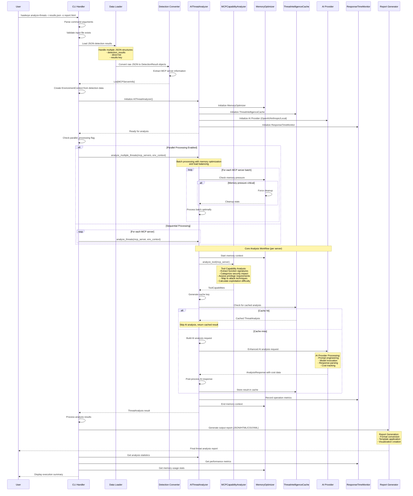
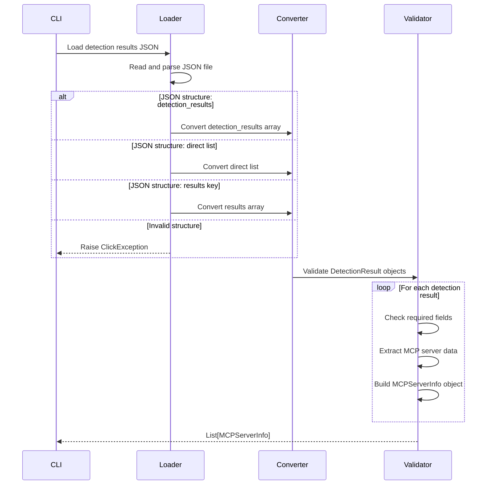
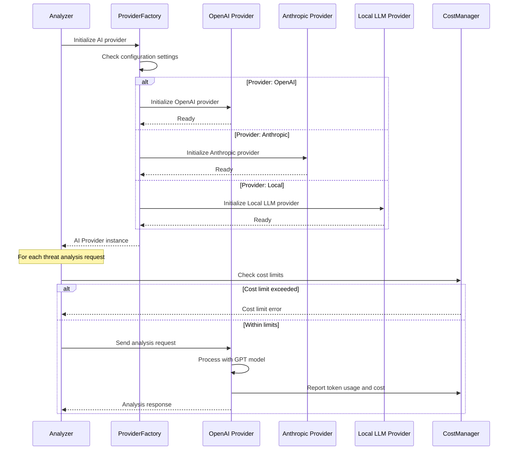
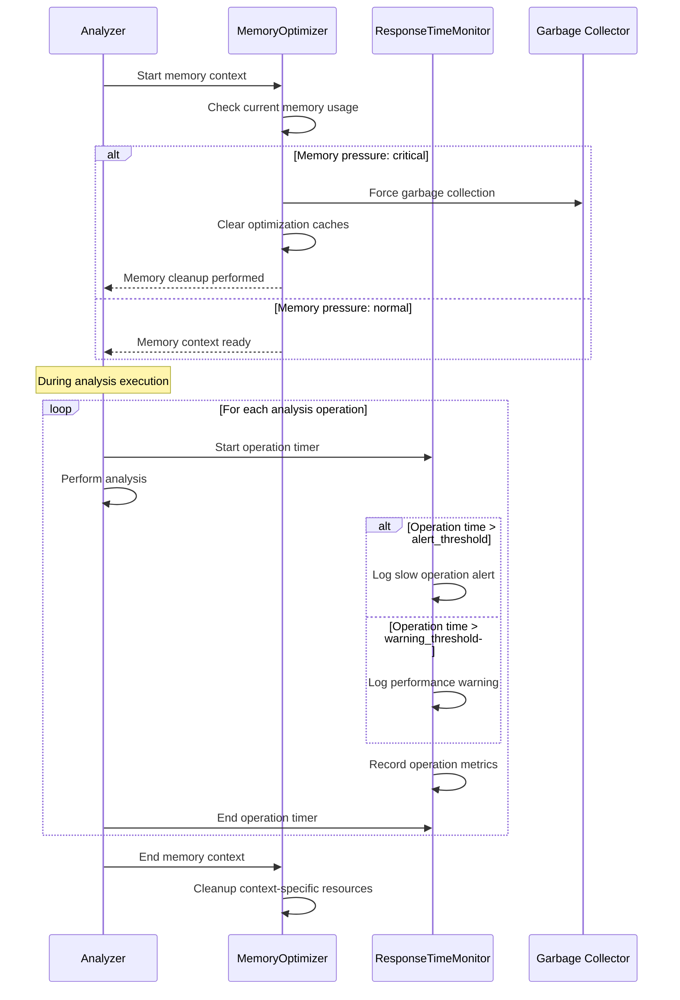
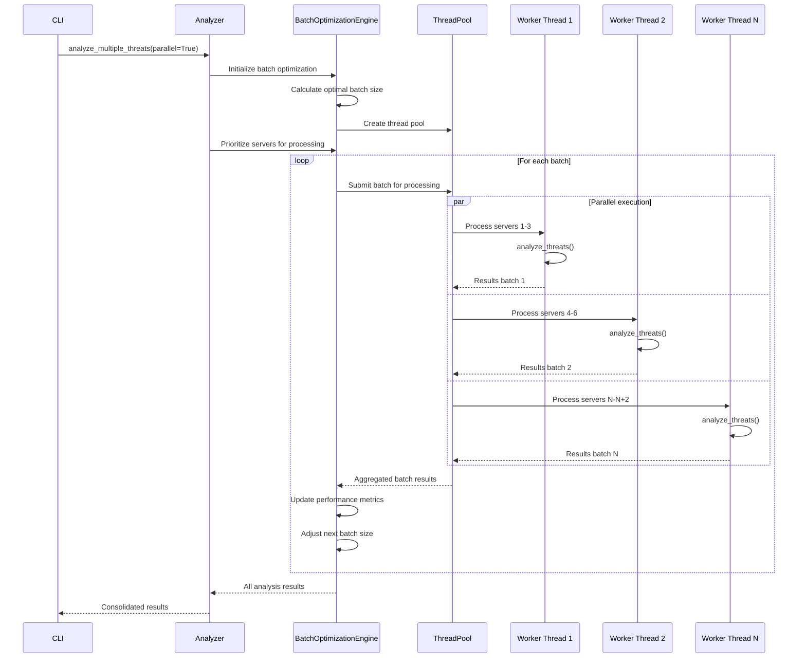
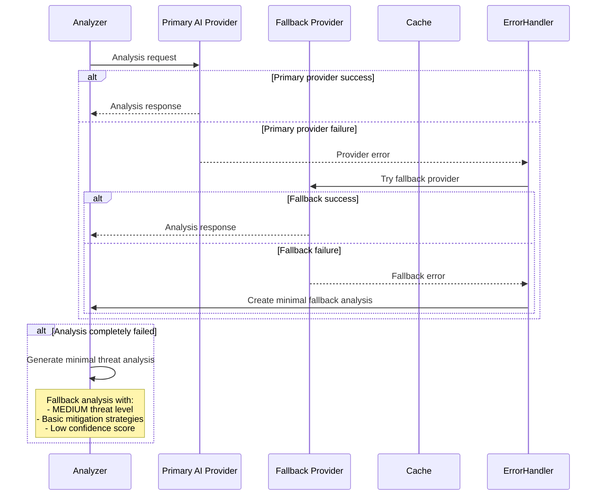

# AI Threat Analysis Sequence Diagram

## Overview

This document provides a comprehensive sequence diagram of the AI-powered threat analysis workflow, documenting how the `analyze-threats` command processes detection results through various stages including data ingestion, AI model invocation, result generation, parallel processing, and cost management.

## Main Sequence Diagram

## Detailed Component Interactions

### 1. Data Ingestion Flow

### 2. AI Provider Selection and Analysis

### 3. Memory Optimization and Performance Monitoring

### 4. Parallel Processing Workflow

## Key Performance Optimizations

### 1. Caching Strategy

- **Cache Key Generation**: Based on tool capabilities, environment context, and analysis type
- **TTL Management**: Configurable time-to-live for cached analyses
- **Memory Efficiency**: Automatic cache cleanup based on memory pressure

### 2. Memory Management

- **Context-based Cleanup**: Memory contexts for each analysis operation
- **Pressure Monitoring**: Real-time memory usage tracking
- **Automatic Optimization**: Forced cleanup when memory pressure is critical

### 3. Cost Management

- **Provider Selection**: Automatic fallback between AI providers
- **Usage Tracking**: Real-time cost monitoring and limits
- **Batch Optimization**: Intelligent batching to minimize API calls

### 4. Performance Monitoring

- **Response Time Tracking**: Detailed operation timing metrics
- **Slow Operation Detection**: Automatic alerts for performance issues
- **Statistical Analysis**: Performance trend analysis and optimization

## Error Handling and Fallback Mechanisms

## Analysis Types and Processing Variations

### 1. Quick Assessment
- **Purpose**: Fast risk evaluation
- **Processing**: Simplified prompts, cached results prioritized
- **Output**: Threat level and confidence score only

### 2. Comprehensive Analysis
- **Purpose**: Full threat modeling with detailed attack vectors
- **Processing**: Complete AI analysis pipeline
- **Output**: Full ThreatAnalysis object with all fields

### 3. Context-Aware Analysis
- **Purpose**: Environment-specific threat assessment
- **Processing**: Enhanced environment context integration
- **Output**: Tailored analysis based on deployment context

## Integration Points

1. **CLI Integration**: Command parsing and output formatting
2. **Detection Pipeline**: Input from detect commands via JSON
3. **Reporting System**: Output to multiple report formats
4. **Configuration Management**: Settings and API key management
5. **Logging System**: Comprehensive operation logging

## Summary

The AI threat analysis sequence represents a sophisticated pipeline that:

- **Efficiently processes** detection results through multiple optimization layers
- **Intelligently manages** AI provider interactions and costs
- **Optimizes performance** through caching, memory management, and parallel processing
- **Ensures reliability** through comprehensive error handling and fallback mechanisms
- **Provides flexibility** through multiple analysis types and output formats

This architecture enables scalable, cost-effective, and reliable AI-powered threat analysis for MCP security assessment workflows. 