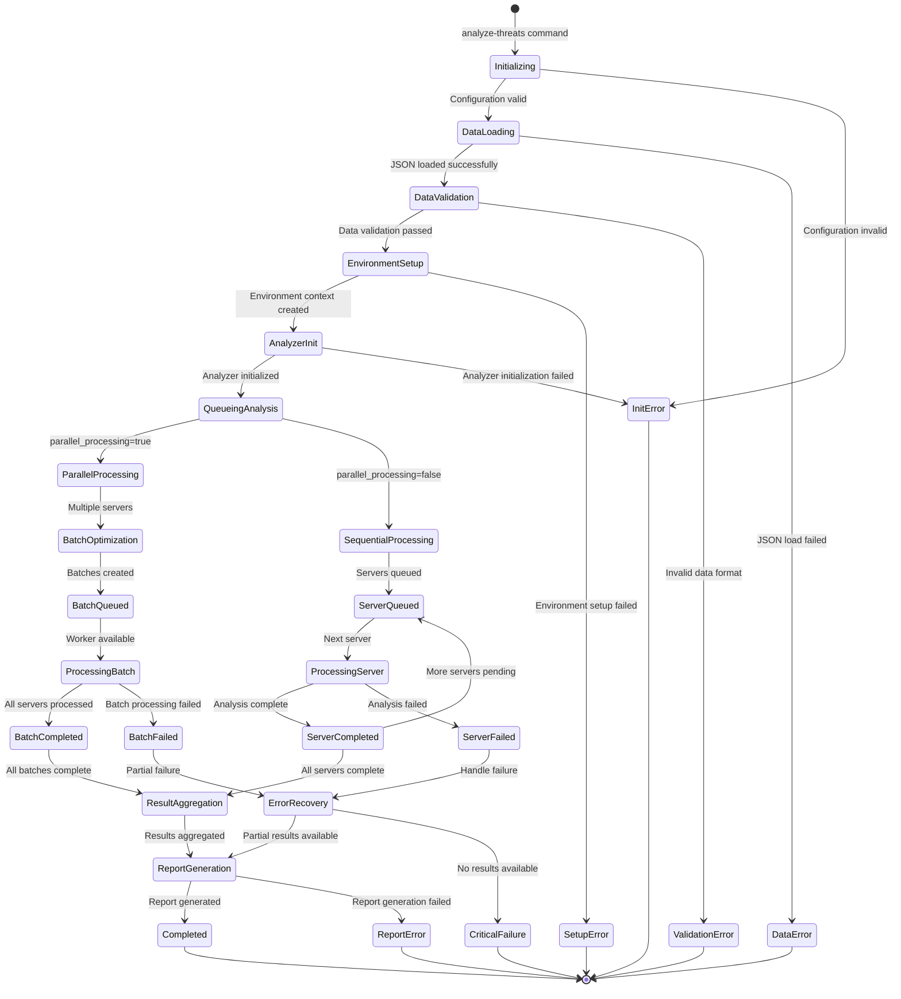
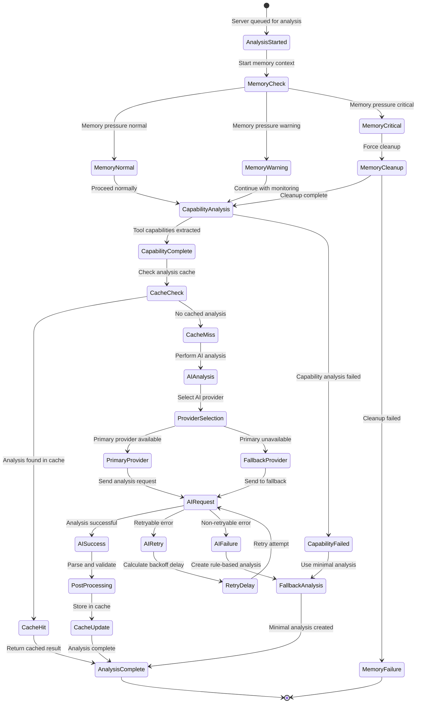
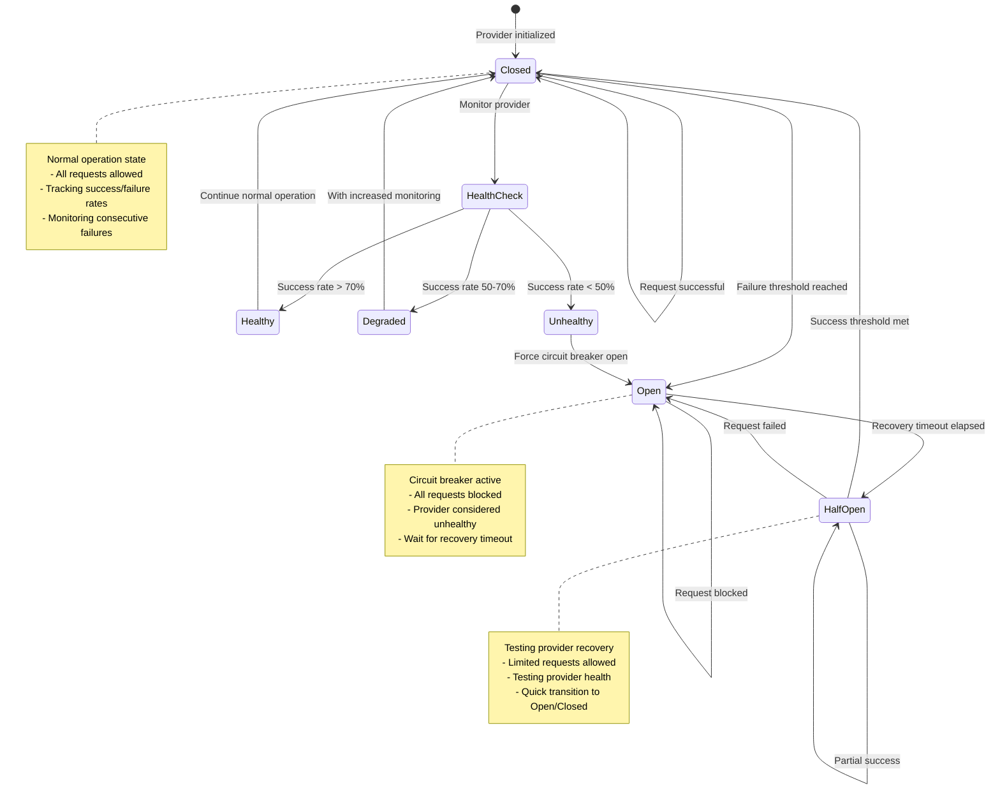
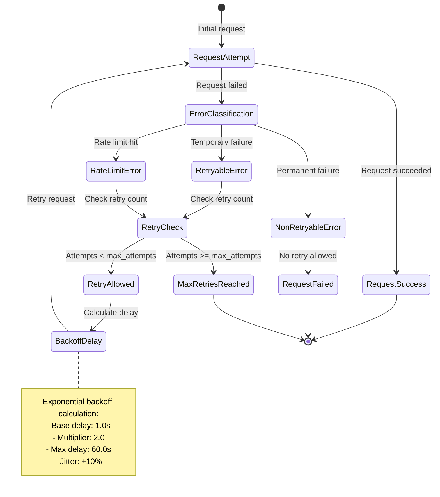
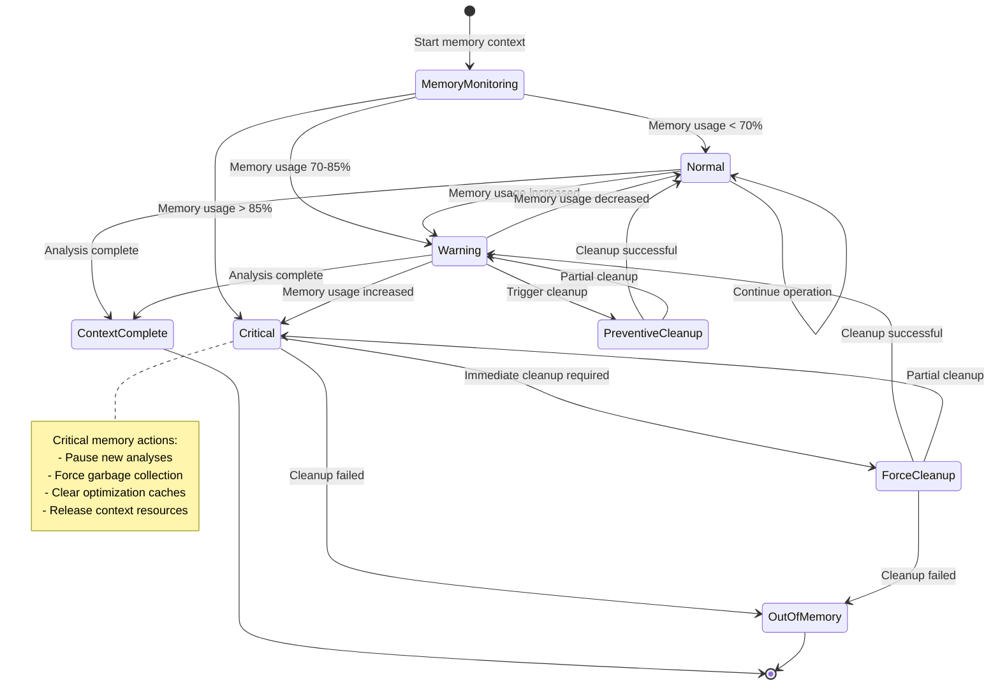
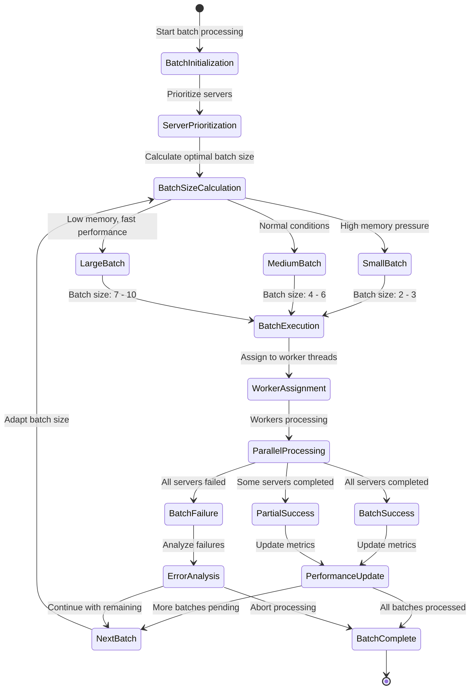
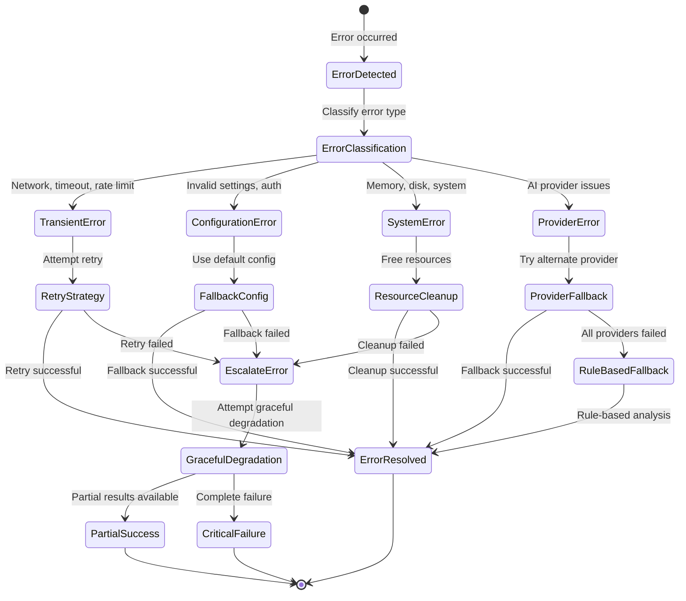

# AI Threat Analysis Pipeline State Diagram

## Overview

This document provides comprehensive state diagrams for the AI threat analysis pipeline, documenting the complete lifecycle of threat analysis tasks from initialization through completion or failure. The diagrams show all possible states, transitions, queuing mechanisms, error handling states, retry logic, and fallback mechanisms.

## Main Pipeline State Diagram

## Individual Server Analysis State Machine

## AI Provider Circuit Breaker State Machine

## Retry Logic State Machine

## Memory Management State Machine

## Batch Processing State Machine

## Error Recovery State Machine

## Pipeline Stage Transitions

### Stage 1: Initialization States
- **INITIALIZING** → **DATA_LOADING** → **DATA_VALIDATION** → **ENVIRONMENT_SETUP** → **ANALYZER_INIT**

### Stage 2: Analysis Queuing States  
- **QUEUING_ANALYSIS** → **PARALLEL_PROCESSING** | **SEQUENTIAL_PROCESSING**

### Stage 3: Processing States
- **PROCESSING_BATCH** | **PROCESSING_SERVER** → **CAPABILITY_ANALYSIS** → **AI_ANALYSIS** → **POST_PROCESSING**

### Stage 4: Completion States
- **RESULT_AGGREGATION** → **REPORT_GENERATION** → **COMPLETED**

## State Transition Triggers

### Normal Flow Triggers
1. **Command Execution**: User runs `hawkeye analyze-threats`
2. **Data Validation**: JSON structure validation passes
3. **Resource Availability**: Memory and compute resources available
4. **Provider Health**: AI provider responsive and healthy
5. **Cache State**: Cache hit/miss determination
6. **Batch Completion**: All servers in batch processed

### Error Triggers
1. **Validation Failure**: Invalid JSON structure or missing fields
2. **Resource Exhaustion**: Memory pressure critical or disk full
3. **Provider Failure**: AI provider timeout, rate limit, or error
4. **Network Issues**: Connection timeout or network unreachable
5. **Authentication Failure**: Invalid API keys or credentials
6. **Circuit Breaker**: Failure threshold reached for provider

### Recovery Triggers
1. **Retry Timer**: Exponential backoff delay completed
2. **Circuit Breaker Reset**: Recovery timeout elapsed
3. **Memory Cleanup**: Successful resource cleanup
4. **Provider Recovery**: Provider health check passed
5. **Fallback Success**: Alternative provider or method succeeded

## State Persistence and Recovery

### Checkpointing States
- **Analysis results cache**: Persisted between runs
- **Provider health metrics**: Maintained across sessions  
- **Memory optimization statistics**: Tracked for performance tuning
- **Retry attempt counters**: Reset on successful completion

### Recovery Points
- **After capability analysis**: Can resume from AI analysis
- **After AI provider selection**: Can switch to fallback provider
- **After partial batch completion**: Can continue with remaining servers
- **After result aggregation**: Can regenerate reports

## Performance State Monitoring

### Key Performance Indicators
- **Analysis throughput**: Servers analyzed per minute
- **Memory efficiency**: Memory usage per analysis
- **Provider response time**: Average AI provider latency
- **Success rate**: Percentage of successful analyses
- **Cache hit rate**: Percentage of cache utilization

### State-Based Optimizations
- **Adaptive batch sizing**: Based on memory pressure and performance history
- **Provider selection**: Based on health metrics and response times
- **Memory management**: Proactive cleanup based on usage patterns
- **Retry strategies**: Adjusted based on error patterns

## Summary

The AI threat analysis pipeline implements a sophisticated state machine that:

- **Ensures robust error handling** through comprehensive retry logic and fallback mechanisms
- **Optimizes performance** through adaptive batch sizing and intelligent resource management
- **Maintains reliability** through circuit breaker patterns and health monitoring
- **Provides transparency** through detailed state tracking and performance metrics
- **Enables recovery** through checkpointing and graceful degradation strategies

This state-driven architecture ensures that the threat analysis system can handle various failure modes gracefully while maintaining optimal performance under different operational conditions. 