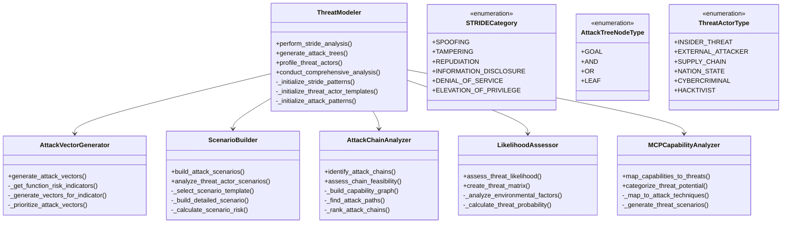

# Threat Modeling Engine Documentation

## Overview

The Threat Modeling Engine is a comprehensive component of the AI threat analysis system that implements advanced threat modeling methodologies including STRIDE analysis, attack tree generation, and threat actor profiling. This engine transforms discovered MCP tool capabilities into structured threat models that security teams can use to understand and defend against potential attacks.

## Architecture

### Core Components



### Data Flow Architecture


## STRIDE Analysis Implementation

### Algorithm Overview

The STRIDE analysis engine implements Microsoft's STRIDE methodology for systematic threat identification:

1. **Spoofing**: Identity impersonation attacks
2. **Tampering**: Data/system modification attacks  
3. **Repudiation**: Non-accountability attacks
4. **Information Disclosure**: Privacy violation attacks
5. **Denial of Service**: Availability attacks
6. **Elevation of Privilege**: Authorization bypass attacks

### Key Methods

#### `perform_stride_analysis()`

```python
def perform_stride_analysis(
    self,
    tool_capabilities: ToolCapabilities,
    environment_context: EnvironmentContext
) -> List[STRIDEThreat]:
    """
    Perform comprehensive STRIDE analysis on MCP tool capabilities.
    
    Process:
    1. Iterate through each STRIDE category
    2. Analyze tool capabilities against category patterns
    3. Generate specific threats for each applicable category
    4. Calculate severity and likelihood scores
    5. Prioritize threats by risk level
    """
```

#### STRIDE Pattern Matching

The engine uses pattern-based threat identification:

```python
stride_patterns = {
    STRIDECategory.SPOOFING: {
        "indicators": ["authentication", "identity", "credentials"],
        "threat_templates": [
            "Authentication bypass using {tool_name}",
            "Identity spoofing through {capability}",
            "Credential impersonation via {function}"
        ]
    },
    STRIDECategory.TAMPERING: {
        "indicators": ["write", "modify", "update", "delete"],
        "threat_templates": [
            "Data modification through {tool_name}",
            "System configuration tampering",
            "File system manipulation"
        ]
    }
    # ... additional categories
}
```

## Attack Tree Generation

### Tree Construction Algorithm

Attack trees provide hierarchical representations of attack paths:


### Key Components

#### `generate_attack_trees()`

```python
def generate_attack_trees(
    self,
    tool_capabilities: ToolCapabilities,
    environment_context: EnvironmentContext,
    target_goals: Optional[List[str]] = None
) -> List[AttackTree]:
    """
    Generate attack trees for identified attack goals.
    
    Process:
    1. Identify potential attack goals based on tool capabilities
    2. Build tree structure using AND/OR logic gates
    3. Calculate probability and cost for each node
    4. Identify critical attack paths
    5. Generate comprehensive attack tree objects
    """
```

#### Attack Tree Metrics

- **Probability Calculation**: Bottom-up propagation using Boolean logic
- **Cost Estimation**: Resource requirements for each attack step
- **Critical Path Analysis**: Most likely and cost-effective attack routes
- **Time to Compromise**: Estimated attack timeline

## Threat Actor Profiling

### Actor Categories

The system models six primary threat actor types:

1. **Insider Threat**: Employees, contractors with legitimate access
2. **External Attacker**: Outside attackers seeking unauthorized access
3. **Supply Chain**: Compromised dependencies or third-party tools
4. **Nation State**: Advanced persistent threat groups
5. **Cybercriminal**: Profit-motivated attackers
6. **Hacktivist**: Ideologically motivated groups

### Profile Attributes

```python
@dataclass
class ThreatActorProfile:
    """Comprehensive threat actor profile."""
    name: str
    type: ThreatActorType
    skill_level: str  # novice, intermediate, advanced, expert
    motivation: str
    resources: str  # limited, moderate, substantial, unlimited
    preferred_targets: List[str]
    typical_attack_vectors: List[str]
    sophistication_level: int  # 1-10 scale
    persistence_level: str  # opportunistic, determined, persistent
    stealth_capability: str  # low, medium, high, advanced
```

### Actor-Specific Scenarios

Each threat actor type generates tailored attack scenarios:

```python
scenario_templates = {
    ThreatActorType.INSIDER_THREAT: {
        "data_theft": {
            "description": "Insider abuses legitimate access to exfiltrate sensitive data",
            "techniques": ["T1005", "T1041", "T1048"],
            "detection_difficulty": "high"
        },
        "sabotage": {
            "description": "Disgruntled employee damages systems or data",
            "techniques": ["T1485", "T1490", "T1529"],
            "detection_difficulty": "medium"
        }
    }
    # ... additional actor types
}
```

## Attack Vector Generation

### Dynamic Vector Generation

The `AttackVectorGenerator` creates attack vectors dynamically based on tool capabilities:

#### Risk Indicator Analysis

```python
def _get_function_risk_indicators(self, function_name: str) -> List[str]:
    """
    Identify risk indicators from function names using pattern matching.
    
    Risk Categories:
    - File System Access: read_file, write_file, delete_file
    - Network Operations: http_request, download, upload
    - System Commands: execute, run, shell
    - Database Operations: query, insert, update
    - Authentication: login, authenticate, authorize
    """
```

#### Attack Template Mapping

```python
attack_templates = {
    "file_access": {
        "vectors": [
            {
                "name": "Unauthorized File Access",
                "severity": "high",
                "description": "Exploit file access functions to read sensitive data",
                "attack_steps": [
                    "Identify file access functions",
                    "Craft malicious file paths",
                    "Execute unauthorized file operations",
                    "Exfiltrate sensitive information"
                ]
            }
        ]
    }
}
```

## MITRE ATT&CK Framework Integration

### Technique Mapping

The system maps MCP tool capabilities to MITRE ATT&CK techniques:

```python
technique_mappings = {
    'command_execution': {
        'technique_id': 'T1059',
        'technique_name': 'Command and Scripting Interpreter',
        'description': 'Execute arbitrary commands through tool functions',
        'severity': 'critical'
    },
    'file_system_access': {
        'technique_id': 'T1083',
        'technique_name': 'File and Directory Discovery',
        'description': 'Access and manipulate file system through tool capabilities',
        'severity': 'high'
    },
    'network_access': {
        'technique_id': 'T1071',
        'technique_name': 'Application Layer Protocol',
        'description': 'Abuse network capabilities for command and control',
        'severity': 'high'
    }
}
```

### Tactic Classification

Techniques are organized by MITRE ATT&CK tactics:

- **Initial Access**: T1566 (Phishing), T1190 (Exploit Public-Facing Application)
- **Execution**: T1059 (Command and Scripting Interpreter)
- **Persistence**: T1505 (Server Software Component)
- **Privilege Escalation**: T1078 (Valid Accounts)
- **Defense Evasion**: T1027 (Obfuscated Files or Information)
- **Credential Access**: T1110 (Brute Force)
- **Discovery**: T1083 (File and Directory Discovery)
- **Collection**: T1005 (Data from Local System)
- **Exfiltration**: T1041 (Exfiltration Over C2 Channel)

## Attack Chain Analysis

### Multi-Tool Attack Scenarios

The `AttackChainAnalyzer` identifies sophisticated attack scenarios using multiple MCP tools:

#### Chain Construction Process


#### Chain Types

1. **Sequential Chains**: Tool A → Tool B → Tool C
2. **Parallel Chains**: Multiple tools used simultaneously
3. **Branching Chains**: One tool enables multiple attack paths
4. **Convergent Chains**: Multiple tools contribute to single goal

### Feasibility Assessment

```python
@dataclass
class ChainFeasibilityScore:
    """Feasibility assessment for attack chains."""
    technical_feasibility: float  # 0.0-1.0
    resource_requirements: float  # 0.0-1.0 (inverted - lower is better)
    detection_likelihood: float   # 0.0-1.0 (inverted - lower is better)
    overall_score: float         # Weighted combination
    confidence_level: str        # low, medium, high
    limiting_factors: List[str]  # Factors that reduce feasibility
```

## Scenario Building

### Realistic Attack Scenarios

The `ScenarioBuilder` creates detailed, realistic attack scenarios:

#### Scenario Components

1. **Threat Actor Profile**: Who is conducting the attack
2. **Attack Timeline**: Sequence of events with timestamps
3. **Attack Phases**: Reconnaissance, initial access, lateral movement, etc.
4. **Technical Details**: Specific commands, tools, and techniques used
5. **Business Impact**: Potential damage and consequences
6. **Detection Opportunities**: Points where the attack might be detected
7. **Mitigation Strategies**: How to prevent or respond to the attack

#### Example Scenario Structure

```python
scenario = {
    'id': 'external_attacker_data_exfiltration',
    'title': 'External Attacker: Corporate Data Theft',
    'threat_actor': {
        'name': 'Advanced Cybercriminal Group',
        'type': 'external_attacker',
        'skill_level': 'advanced',
        'motivation': 'financial_gain'
    },
    'attack_phases': [
        {
            'phase': 'reconnaissance',
            'duration': '2-3 days',
            'activities': ['Network scanning', 'Service enumeration', 'Vulnerability assessment']
        },
        {
            'phase': 'initial_access',
            'duration': '4-6 hours',
            'activities': ['Exploit MCP server vulnerability', 'Establish foothold']
        }
        # ... additional phases
    ]
}
```

## Likelihood Assessment

### Probability Modeling

The `LikelihoodAssessor` implements sophisticated probability models:

#### Assessment Factors

1. **Attack Complexity**: Technical difficulty of exploitation
2. **Environmental Factors**: Network topology, security controls
3. **Threat Actor Capabilities**: Skill level and resources
4. **Target Attractiveness**: Value and accessibility of assets
5. **Historical Patterns**: Similar attacks in the past

#### Threat Likelihood Matrix

```python
@dataclass
class ThreatLikelihoodMatrix:
    """Comprehensive threat likelihood assessment."""
    threat_id: str
    base_probability: float           # Inherent threat likelihood
    environmental_modifiers: Dict[str, float]  # Environment-specific adjustments
    actor_capability_score: float     # Threat actor capability assessment
    target_attractiveness: float      # Asset value and accessibility
    historical_frequency: float       # Historical attack frequency
    final_likelihood: float          # Final calculated likelihood
    confidence_interval: Tuple[float, float]  # Confidence range
    assessment_summary: str          # Human-readable summary
```

## Performance Optimization

### Caching Strategy

The threat modeling engine implements intelligent caching:

```python
class ThreatModelCache:
    """Cache for threat modeling results."""
    
    def __init__(self):
        self.stride_cache = {}      # STRIDE analysis results
        self.tree_cache = {}        # Attack tree structures
        self.scenario_cache = {}    # Generated scenarios
        self.chain_cache = {}       # Attack chain analysis
```

### Parallel Processing

- **Concurrent STRIDE Analysis**: Each category analyzed in parallel
- **Parallel Tree Generation**: Multiple attack trees built simultaneously  
- **Distributed Scenario Building**: Scenario generation across multiple threads
- **Asynchronous Chain Analysis**: Non-blocking attack chain discovery

## Quality Assurance

### Validation Mechanisms

1. **Threat Model Validation**: Ensure completeness and consistency
2. **MITRE ATT&CK Mapping Verification**: Validate technique mappings
3. **Scenario Realism Checks**: Verify attack scenario feasibility
4. **Cross-Reference Validation**: Check consistency across components

### Testing Strategy

- **Unit Tests**: Individual component functionality
- **Integration Tests**: Cross-component interaction
- **Scenario Validation**: Real-world attack scenario testing
- **Performance Benchmarks**: Scalability and efficiency testing

## Configuration and Customization

### Threat Model Profiles

```python
threat_model_profiles = {
    "comprehensive": {
        "stride_analysis": True,
        "attack_trees": True,
        "threat_actors": "all",
        "max_chain_length": 5,
        "scenario_count": 10
    },
    "focused": {
        "stride_analysis": True,
        "attack_trees": False,
        "threat_actors": ["external_attacker", "insider_threat"],
        "max_chain_length": 3,
        "scenario_count": 5
    }
}
```

### Customizable Parameters

- **Analysis Depth**: Surface-level vs. deep analysis
- **Threat Actor Focus**: Specific actor types to emphasize
- **Risk Threshold**: Minimum risk level for inclusion
- **Time Constraints**: Maximum analysis duration
- **Output Format**: Detailed vs. summary reporting

## Integration Points

### Input Dependencies

- **Tool Capabilities**: From `MCPCapabilityAnalyzer`
- **Environment Context**: From environment analysis components
- **Detection Results**: From MCP introspection and detection pipeline

### Output Consumers

- **Report Generator**: Consumes threat models for report creation  
- **Risk Assessor**: Uses threat analysis for risk scoring
- **Mitigation Planner**: Leverages threat models for countermeasure planning
- **Security Dashboard**: Displays threat modeling results

## Future Enhancements

### Planned Improvements

1. **Machine Learning Integration**: ML-based threat prediction
2. **Dynamic Threat Intelligence**: Real-time threat feed integration
3. **Automated Scenario Validation**: AI-powered scenario verification
4. **Advanced Visualization**: Interactive threat model displays
5. **Collaborative Threat Modeling**: Multi-user threat model development

### Research Areas

- **Quantum Threat Modeling**: Post-quantum cryptography threats
- **AI/ML Attack Modeling**: AI-specific attack vectors
- **Cloud-Native Threats**: Container and serverless attack models
- **Supply Chain Risk Modeling**: Third-party dependency threats

## Conclusion

The Threat Modeling Engine provides comprehensive, automated threat analysis capabilities that transform raw MCP tool discoveries into actionable security intelligence. Through STRIDE analysis, attack tree generation, threat actor profiling, and MITRE ATT&CK integration, it delivers the detailed threat models security teams need to understand, prioritize, and defend against potential attacks on their MCP infrastructure. 