# HawkEye System Architecture Overview

## Executive Summary

HawkEye is a comprehensive security reconnaissance tool designed with a modular, layered architecture that supports network scanning, MCP (Model Context Protocol) server detection and introspection, AI-powered threat analysis, and multi-format reporting. The system implements well-established design patterns and follows separation of concerns principles to ensure maintainability, extensibility, and testability.

## Architecture Principles

### 1. **Layered Architecture**
- Clear separation between presentation, business logic, and data layers
- Each layer depends only on layers below it
- Consistent interfaces between layers

### 2. **Modular Design**
- Self-contained modules with well-defined responsibilities
- Loose coupling between modules
- High cohesion within modules

### 3. **Design Pattern Implementation**
- **Abstract Base Class Pattern**: Common interfaces for scanners, detectors, assessors, and reporters
- **Strategy Pattern**: Pluggable algorithms for detection, assessment, and transport
- **Factory Pattern**: Dynamic object creation based on configuration
- **Command Pattern**: CLI command structure and execution

## System Architecture Layers

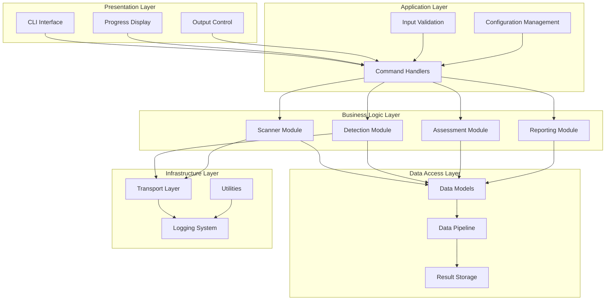
```mermaid
graph TB
    subgraph "Presentation Layer"
        CLI[CLI Interface]
        Progress[Progress Display]
        Output[Output Control]
    end
    
    subgraph "Application Layer"
        Commands[Command Handlers]
        Validation[Input Validation]
        Config[Configuration Management]
    end
    
    subgraph "Business Logic Layer"
        Scanner[Scanner Module]
        Detection[Detection Module]
        Assessment[Assessment Module]
        Reporting[Reporting Module]
    end
    
    subgraph "Data Access Layer"
        Models[Data Models]
        Pipeline[Data Pipeline]
        Storage[Result Storage]
    end
    
    subgraph "Infrastructure Layer"
        Transport[Transport Layer]
        Logging[Logging System]
        Utils[Utilities]
    end
    
    CLI --> Commands
    Progress --> Commands
    Output --> Commands
    
    Commands --> Scanner
    Commands --> Detection
    Commands --> Assessment
    Commands --> Reporting
    
    Validation --> Commands
    Config --> Commands
    
    Scanner --> Models
    Detection --> Models
    Assessment --> Models
    Reporting --> Models
    
    Models --> Pipeline
    Pipeline --> Storage
    
    Detection --> Transport
    Scanner --> Transport
    
    Transport --> Logging
    Utils --> Logging
```

## Module Architecture

### 1. CLI Module (`hawkeye.cli`)

**Purpose**: Provides command-line interface and user interaction management.

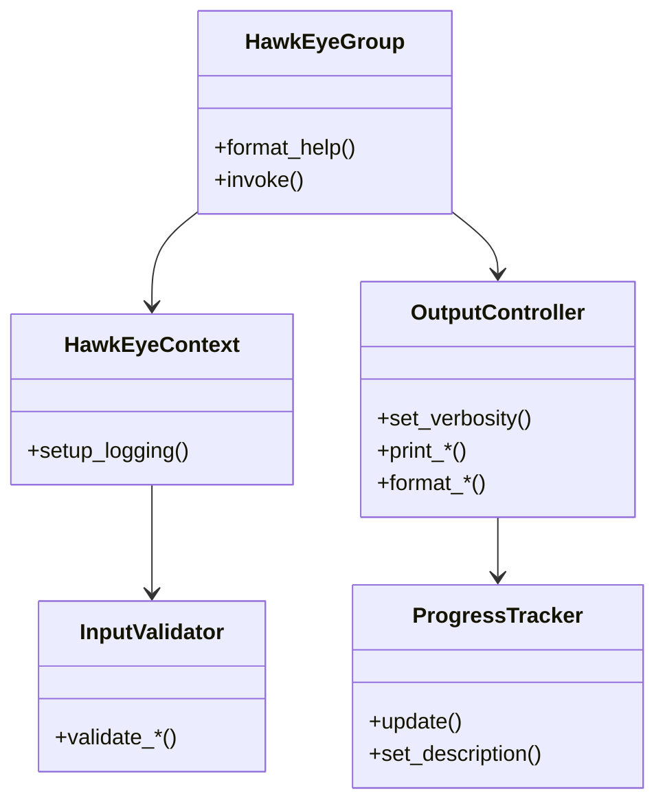
```mermaid
classDiagram
    class HawkEyeGroup {
        +format_help()
        +invoke()
    }
    
    class HawkEyeContext {
        +setup_logging()
    }
    
    class OutputController {
        +set_verbosity()
        +print_*()
        +format_*()
    }
    
    class InputValidator {
        +validate_*()
    }
    
    class ProgressTracker {
        +update()
        +set_description()
    }
    
    HawkEyeGroup --> HawkEyeContext
    HawkEyeGroup --> OutputController
    HawkEyeContext --> InputValidator
    OutputController --> ProgressTracker
```

**Key Components:**
- **Command Handlers**: `detect_commands.py`, `scan_commands.py`, `report_commands.py`
- **Progress Management**: `progress.py` - Real-time operation tracking
- **Output Control**: `output_control.py` - Verbosity and formatting management
- **Validation**: `validation.py` - Input validation and sanitization

**Dependencies:**
- Depends on: Business Logic Layer (Scanner, Detection, Assessment, Reporting)
- Used by: End users through command line

### 2. Detection Module (`hawkeye.detection`)

**Purpose**: Core detection capabilities for MCP servers and security analysis.

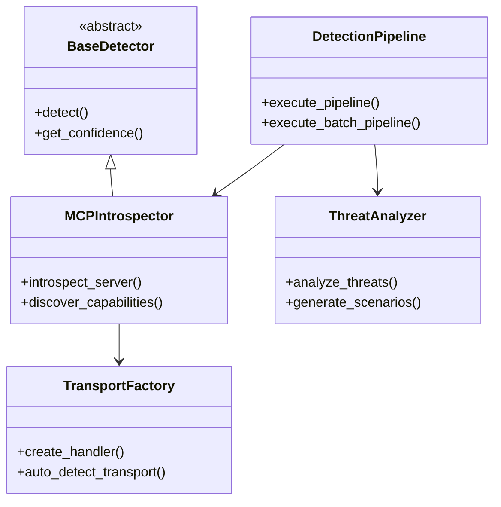
```mermaid
classDiagram
    class DetectionPipeline {
        +execute_pipeline()
        +execute_batch_pipeline()
    }
    
    class MCPIntrospector {
        +introspect_server()
        +discover_capabilities()
    }
    
    class ThreatAnalyzer {
        +analyze_threats()
        +generate_scenarios()
    }
    
    class TransportFactory {
        +create_handler()
        +auto_detect_transport()
    }
    
    class BaseDetector {
        <<abstract>>
        +detect()
        +get_confidence()
    }
    
    DetectionPipeline --> MCPIntrospector
    DetectionPipeline --> ThreatAnalyzer
    MCPIntrospector --> TransportFactory
    BaseDetector <|-- MCPIntrospector
```

**Sub-modules:**
- **MCP Introspection** (`mcp_introspection/`)
  - **Discovery**: Tool, resource, and capability discovery
  - **Transport**: Multi-protocol communication (HTTP, SSE, STDIO)
  - **Risk Analysis**: Security risk assessment
  - **Optimization**: Performance optimization and caching
- **AI Threat Analysis** (`ai_threat/`)
  - **Threat Modeling**: AI-powered threat scenario generation
  - **Risk Prioritization**: Intelligent risk ranking
  - **Provider Management**: Multi-AI provider support

**Key Patterns:**
- **Strategy Pattern**: Different detection strategies (process enumeration, config discovery, Docker inspection)
- **Factory Pattern**: Transport handler creation
- **Template Method Pattern**: Base detection workflow with customization points

### 3. MCP Introspection Sub-System

**Purpose**: Specialized system for MCP server discovery, introspection, and analysis.

```mermaid
graph TB
    subgraph "Discovery Layer"
        ToolDiscovery[Tool Discovery]
        ResourceDiscovery[Resource Discovery] 
        CapabilityDiscovery[Capability Discovery]
        DataAggregator[Data Aggregator]
    end
    
    subgraph "Transport Layer"
        HTTPTransport[HTTP Transport]
        SSETransport[SSE Transport]
        STDIOTransport[STDIO Transport]
        TransportFactory[Transport Factory]
    end
    
    subgraph "Risk Analysis Layer"
        RiskCategorizer[Risk Categorizer]
        ThreatModel[Threat Model]
        ToolAnalyzer[Tool Analyzer]
        RiskScorer[Risk Scorer]
    end
    
    subgraph "Optimization Layer"
        CachingSystem[Caching System]
        ConnectionPool[Connection Pool]
        MemoryManager[Memory Manager]
        ScalingManager[Scaling Manager]
    end
    
    DataAggregator --> ToolDiscovery
    DataAggregator --> ResourceDiscovery
    DataAggregator --> CapabilityDiscovery
    
    TransportFactory --> HTTPTransport
    TransportFactory --> SSETransport
    TransportFactory --> STDIOTransport
    
    RiskCategorizer --> ThreatModel
    ThreatModel --> ToolAnalyzer
    ToolAnalyzer --> RiskScorer
    
    CachingSystem --> ConnectionPool
    ConnectionPool --> MemoryManager
    MemoryManager --> ScalingManager
```

**Architecture Features:**
- **Multi-Transport Support**: Handles HTTP, Server-Sent Events, and STDIO protocols
- **Dynamic Discovery**: Real-time capability and resource enumeration
- **Risk Assessment**: Comprehensive security analysis with CVSS scoring
- **Performance Optimization**: Connection pooling, caching, and memory management

### 4. AI Threat Analysis Sub-System

**Purpose**: Advanced AI-powered threat modeling and security analysis.

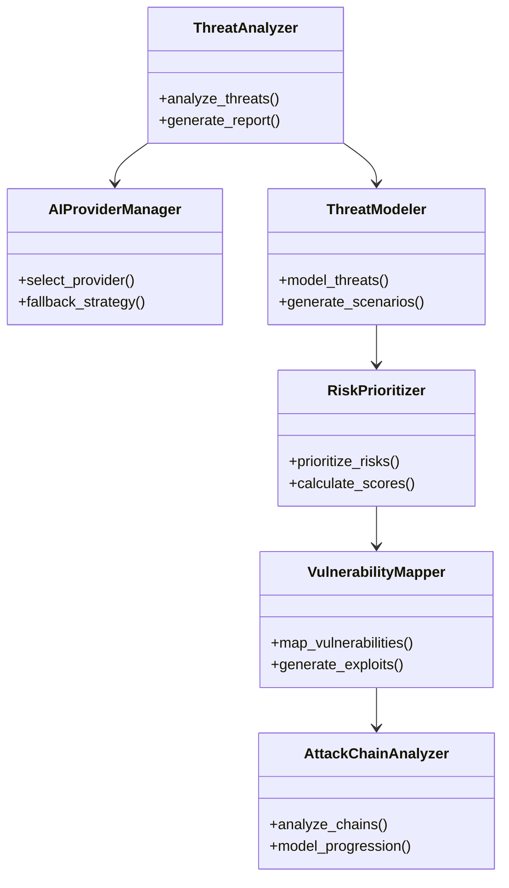
```mermaid
classDiagram
    class ThreatAnalyzer {
        +analyze_threats()
        +generate_report()
    }
    
    class AIProviderManager {
        +select_provider()
        +fallback_strategy()
    }
    
    class ThreatModeler {
        +model_threats()
        +generate_scenarios()
    }
    
    class RiskPrioritizer {
        +prioritize_risks()
        +calculate_scores()
    }
    
    class VulnerabilityMapper {
        +map_vulnerabilities()
        +generate_exploits()
    }
    
    class AttackChainAnalyzer {
        +analyze_chains()
        +model_progression()
    }
    
    ThreatAnalyzer --> AIProviderManager
    ThreatAnalyzer --> ThreatModeler
    ThreatModeler --> RiskPrioritizer
    RiskPrioritizer --> VulnerabilityMapper
    VulnerabilityMapper --> AttackChainAnalyzer
```

**Key Components:**
- **Multi-Provider AI Support**: OpenAI, Anthropic, and other AI providers
- **Threat Modeling**: Sophisticated threat scenario generation
- **Attack Chain Analysis**: Multi-step attack path modeling
- **Risk Prioritization**: Intelligent ranking and scoring

### 5. Scanner Module (`hawkeye.scanner`)

**Purpose**: Network scanning and service discovery capabilities.

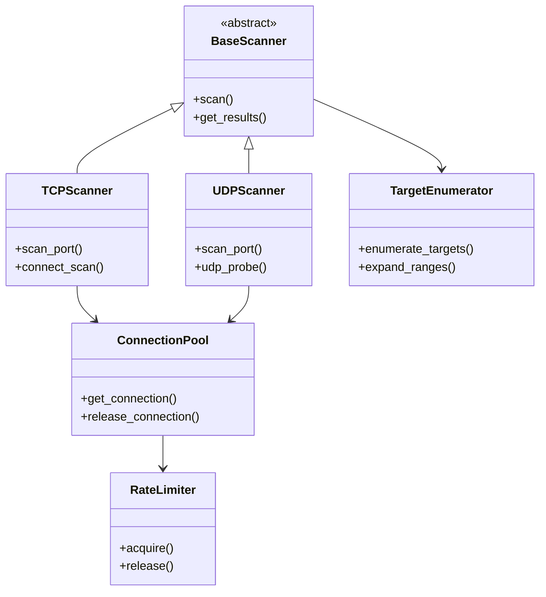
```mermaid
classDiagram
    class BaseScanner {
        <<abstract>>
        +scan()
        +get_results()
    }
    
    class TCPScanner {
        +scan_port()
        +connect_scan()
    }
    
    class UDPScanner {
        +scan_port()
        +udp_probe()
    }
    
    class ConnectionPool {
        +get_connection()
        +release_connection()
    }
    
    class RateLimiter {
        +acquire()
        +release()
    }
    
    class TargetEnumerator {
        +enumerate_targets()
        +expand_ranges()
    }
    
    BaseScanner <|-- TCPScanner
    BaseScanner <|-- UDPScanner
    TCPScanner --> ConnectionPool
    UDPScanner --> ConnectionPool
    ConnectionPool --> RateLimiter
    BaseScanner --> TargetEnumerator
```

**Features:**
- **Multi-Protocol Support**: TCP and UDP scanning
- **Connection Management**: Efficient connection pooling
- **Rate Limiting**: Configurable scan rate control
- **Target Enumeration**: CIDR expansion and hostname resolution

### 6. Assessment Module (`hawkeye.assessment`)

**Purpose**: Security risk assessment and vulnerability analysis.

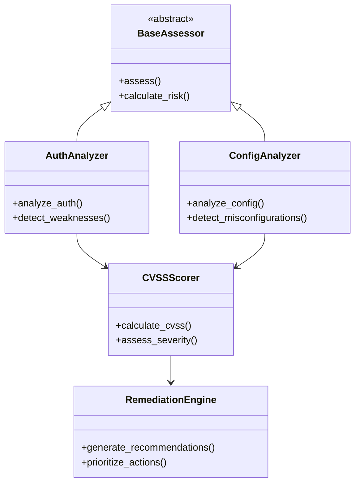
```mermaid
classDiagram
    class BaseAssessor {
        <<abstract>>
        +assess()
        +calculate_risk()
    }
    
    class AuthAnalyzer {
        +analyze_auth()
        +detect_weaknesses()
    }
    
    class ConfigAnalyzer {
        +analyze_config()
        +detect_misconfigurations()
    }
    
    class CVSSScorer {
        +calculate_cvss()
        +assess_severity()
    }
    
    class RemediationEngine {
        +generate_recommendations()
        +prioritize_actions()
    }
    
    BaseAssessor <|-- AuthAnalyzer
    BaseAssessor <|-- ConfigAnalyzer
    AuthAnalyzer --> CVSSScorer
    ConfigAnalyzer --> CVSSScorer
    CVSSScorer --> RemediationEngine
```

**Assessment Types:**
- **Authentication Analysis**: Credential and access control assessment
- **Configuration Analysis**: Security configuration evaluation
- **Transport Security**: Communication security analysis
- **CVSS Scoring**: Standardized vulnerability scoring

### 7. Reporting Module (`hawkeye.reporting`)

**Purpose**: Multi-format report generation and data presentation.

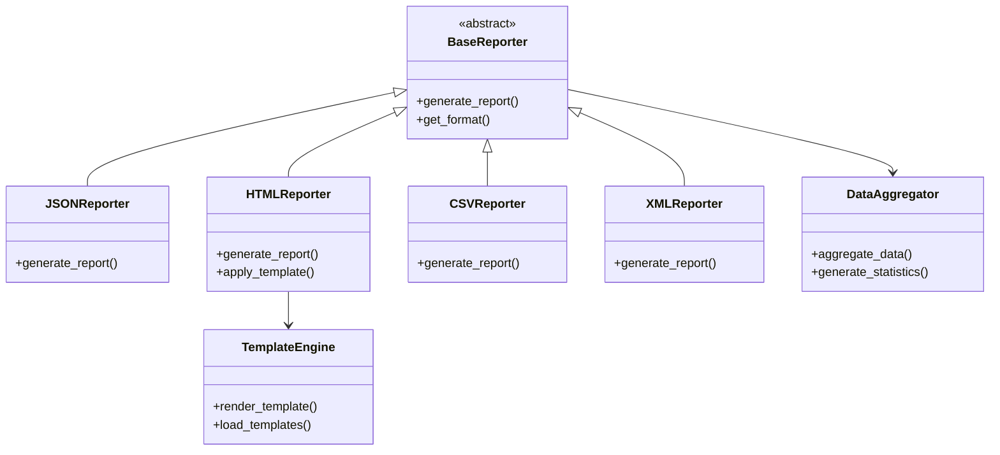
```mermaid
classDiagram
    class BaseReporter {
        <<abstract>>
        +generate_report()
        +get_format()
    }
    
    class JSONReporter {
        +generate_report()
    }
    
    class HTMLReporter {
        +generate_report()
        +apply_template()
    }
    
    class CSVReporter {
        +generate_report()
    }
    
    class XMLReporter {
        +generate_report()
    }
    
    class TemplateEngine {
        +render_template()
        +load_templates()
    }
    
    class DataAggregator {
        +aggregate_data()
        +generate_statistics()
    }
    
    BaseReporter <|-- JSONReporter
    BaseReporter <|-- HTMLReporter
    BaseReporter <|-- CSVReporter
    BaseReporter <|-- XMLReporter
    HTMLReporter --> TemplateEngine
    BaseReporter --> DataAggregator
```

**Supported Formats:**
- **JSON**: Structured data output for integration
- **HTML**: Rich visual reports with templates
- **CSV**: Tabular data for analysis
- **XML**: Structured markup format

### 8. Transport Layer (`hawkeye.detection.mcp_introspection.transport`)

**Purpose**: Protocol abstraction for MCP communication.

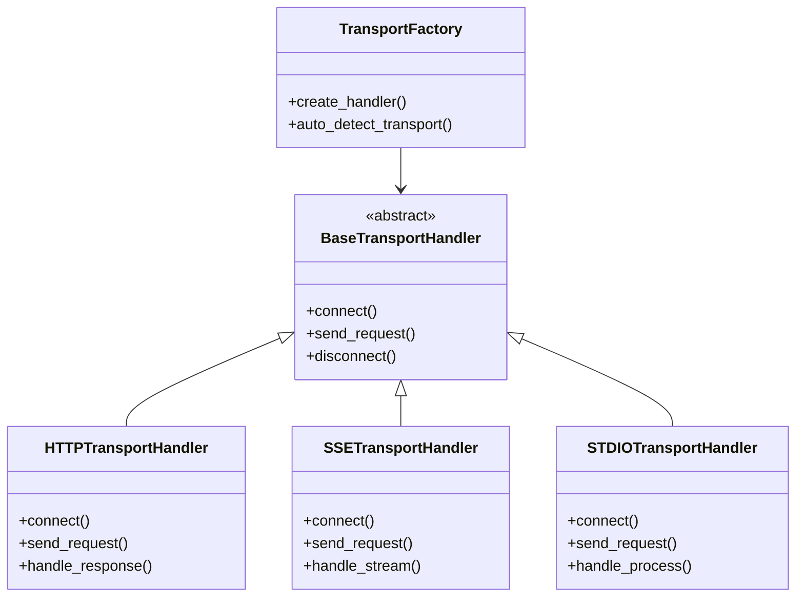
```mermaid
classDiagram
    class BaseTransportHandler {
        <<abstract>>
        +connect()
        +send_request()
        +disconnect()
    }
    
    class HTTPTransportHandler {
        +connect()
        +send_request()
        +handle_response()
    }
    
    class SSETransportHandler {
        +connect()
        +send_request()
        +handle_stream()
    }
    
    class STDIOTransportHandler {
        +connect()
        +send_request()
        +handle_process()
    }
    
    class TransportFactory {
        +create_handler()
        +auto_detect_transport()
    }
    
    BaseTransportHandler <|-- HTTPTransportHandler
    BaseTransportHandler <|-- SSETransportHandler
    BaseTransportHandler <|-- STDIOTransportHandler
    TransportFactory --> BaseTransportHandler
```

**Transport Protocols:**
- **HTTP**: RESTful API communication
- **Server-Sent Events (SSE)**: Real-time event streaming
- **STDIO**: Process-based communication

## Data Flow Architecture

### 1. Scan → Detect → Assess → Report Workflow

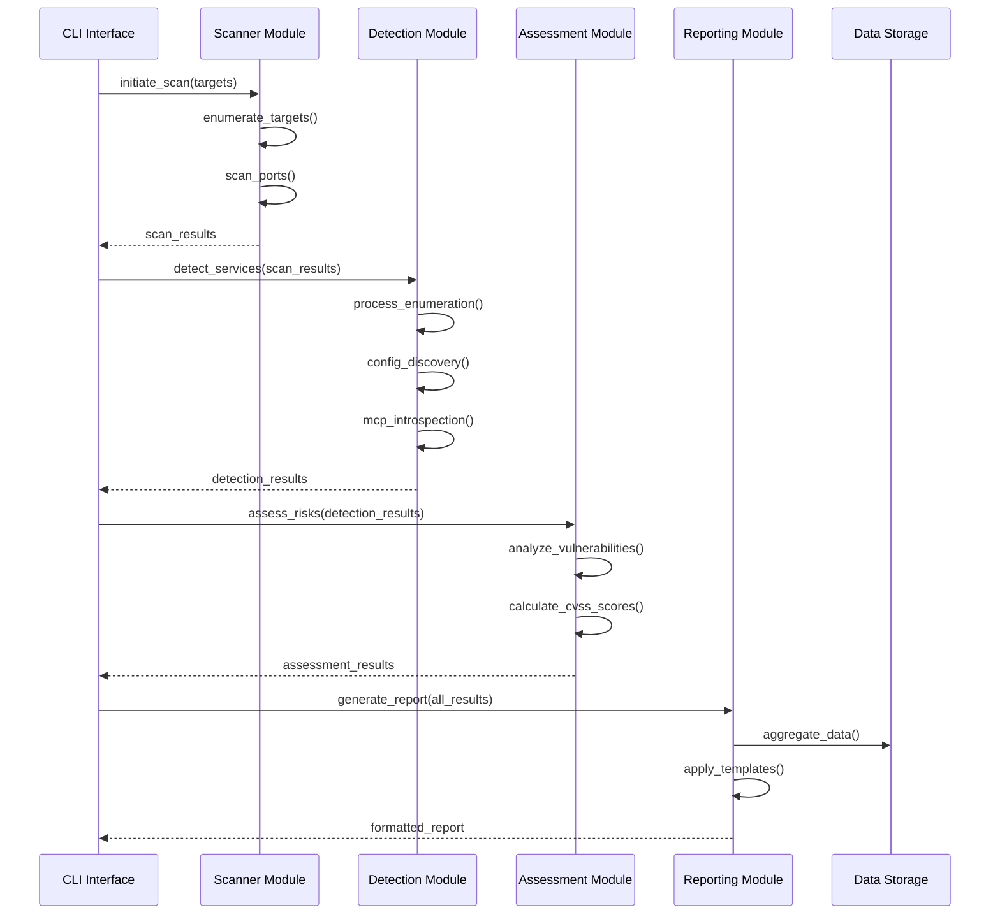
```mermaid
sequenceDiagram
    participant CLI as CLI Interface
    participant Scanner as Scanner Module
    participant Detector as Detection Module
    participant Assessor as Assessment Module
    participant Reporter as Reporting Module
    participant Storage as Data Storage
    
    CLI->>Scanner: initiate_scan(targets)
    Scanner->>Scanner: enumerate_targets()
    Scanner->>Scanner: scan_ports()
    Scanner-->>CLI: scan_results
    
    CLI->>Detector: detect_services(scan_results)
    Detector->>Detector: process_enumeration()
    Detector->>Detector: config_discovery()
    Detector->>Detector: mcp_introspection()
    Detector-->>CLI: detection_results
    
    CLI->>Assessor: assess_risks(detection_results)
    Assessor->>Assessor: analyze_vulnerabilities()
    Assessor->>Assessor: calculate_cvss_scores()
    Assessor-->>CLI: assessment_results
    
    CLI->>Reporter: generate_report(all_results)
    Reporter->>Storage: aggregate_data()
    Reporter->>Reporter: apply_templates()
    Reporter-->>CLI: formatted_report
```

### 2. MCP Introspection Data Flow

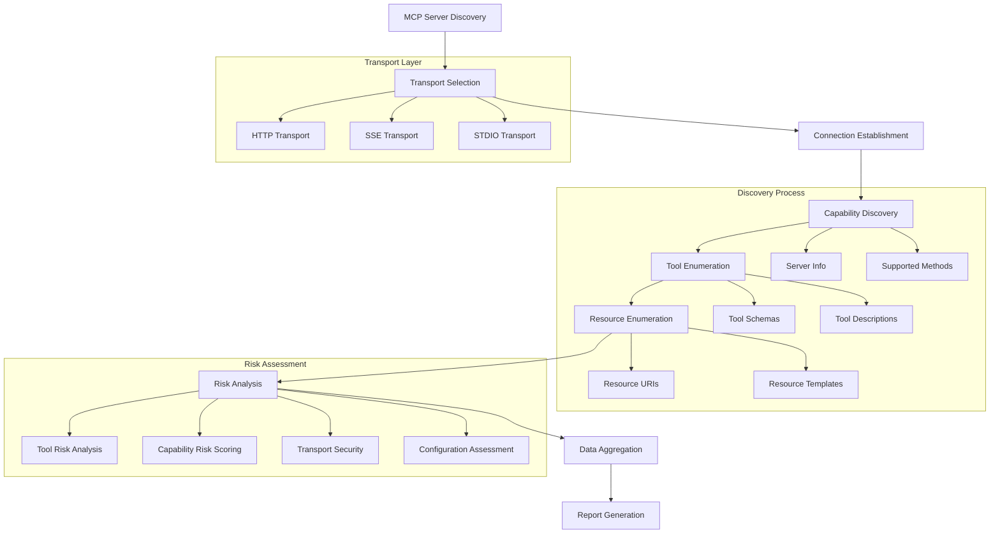
```mermaid
flowchart TD
    A[MCP Server Discovery] --> B[Transport Selection]
    B --> C[Connection Establishment]
    C --> D[Capability Discovery]
    D --> E[Tool Enumeration]
    E --> F[Resource Enumeration]
    F --> G[Risk Analysis]
    G --> H[Data Aggregation]
    H --> I[Report Generation]
    
    subgraph "Transport Layer"
        B1[HTTP Transport]
        B2[SSE Transport]
        B3[STDIO Transport]
        B --> B1
        B --> B2
        B --> B3
    end
    
    subgraph "Discovery Process"
        D --> D1[Server Info]
        D --> D2[Supported Methods]
        E --> E1[Tool Schemas]
        E --> E2[Tool Descriptions]
        F --> F1[Resource URIs]
        F --> F2[Resource Templates]
    end
    
    subgraph "Risk Assessment"
        G --> G1[Tool Risk Analysis]
        G --> G2[Capability Risk Scoring]
        G --> G3[Transport Security]
        G --> G4[Configuration Assessment]
    end
```

### 3. AI Threat Analysis Pipeline

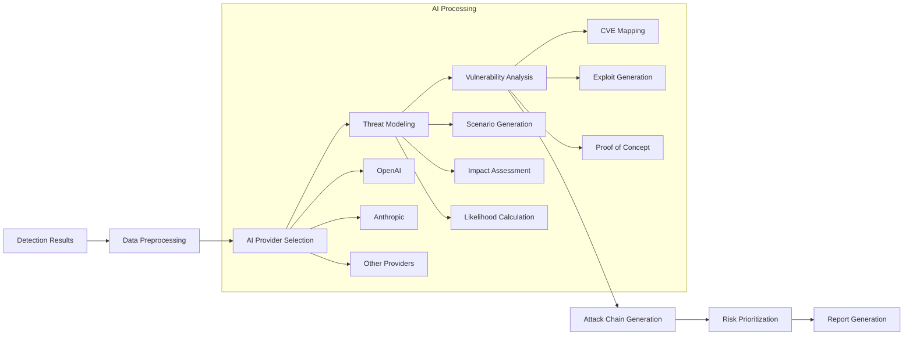
```mermaid
flowchart LR
    A[Detection Results] --> B[Data Preprocessing]
    B --> C[AI Provider Selection]
    C --> D[Threat Modeling]
    D --> E[Vulnerability Analysis]
    E --> F[Attack Chain Generation]
    F --> G[Risk Prioritization]
    G --> H[Report Generation]
    
    subgraph "AI Processing"
        C --> C1[OpenAI]
        C --> C2[Anthropic]
        C --> C3[Other Providers]
        
        D --> D1[Scenario Generation]
        D --> D2[Impact Assessment]
        D --> D3[Likelihood Calculation]
        
        E --> E1[CVE Mapping]
        E --> E2[Exploit Generation]
        E --> E3[Proof of Concept]
    end
```

## Inter-Module Dependencies

### Dependency Graph

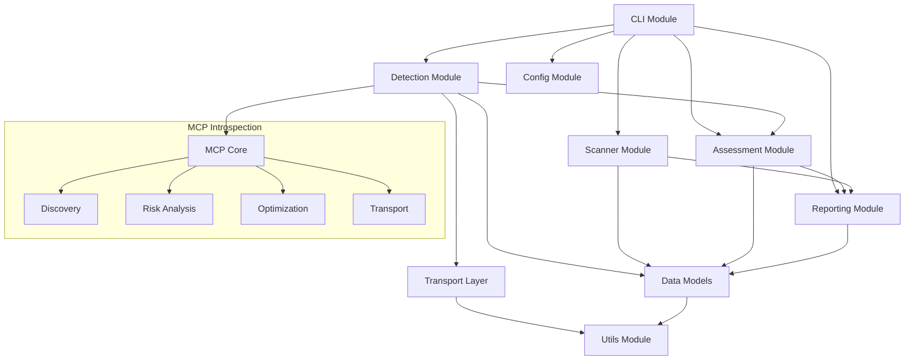
```mermaid
graph TD
    CLI[CLI Module] --> Scanner[Scanner Module]
    CLI --> Detection[Detection Module]
    CLI --> Assessment[Assessment Module]
    CLI --> Reporting[Reporting Module]
    CLI --> Config[Config Module]
    
    Detection --> Assessment
    Assessment --> Reporting
    Scanner --> Reporting
    
    Detection --> Transport[Transport Layer]
    Detection --> Models[Data Models]
    Scanner --> Models
    Assessment --> Models
    Reporting --> Models
    
    Transport --> Utils[Utils Module]
    Models --> Utils
    
    subgraph "MCP Introspection"
        MCPCore[MCP Core] --> MCPDiscovery[Discovery]
        MCPCore --> MCPRisk[Risk Analysis]
        MCPCore --> MCPOptimization[Optimization]
        MCPCore --> MCPTransport[Transport]
    end
    
    Detection --> MCPCore
```

### Module Coupling Analysis

**Low Coupling (Good):**
- CLI ↔ Business Logic Modules (through well-defined interfaces)
- Scanner ↔ Detection (through data models)
- Transport Layer ↔ Detection (through abstract interfaces)

**Medium Coupling (Acceptable):**
- Detection ↔ Assessment (shared risk models)
- Assessment ↔ Reporting (data transformation)

**High Coupling (Areas for Improvement):**
- MCP Introspection sub-modules (high cohesion within domain)
- AI Threat Analysis components (complex interdependencies)

## Design Pattern Implementation

### 1. Abstract Base Class Pattern

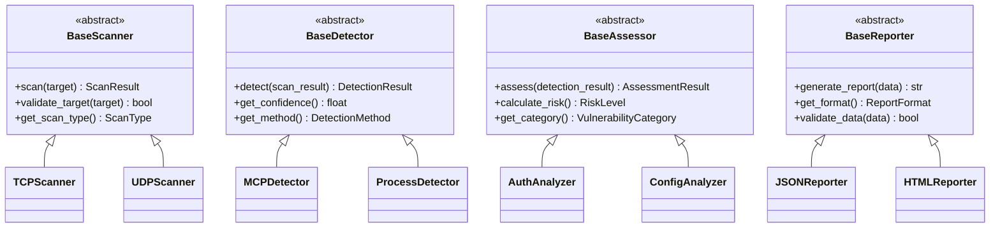
```mermaid
classDiagram
    class BaseScanner {
        <<abstract>>
        +scan(target) ScanResult
        +validate_target(target) bool
        +get_scan_type() ScanType
    }
    
    class BaseDetector {
        <<abstract>>
        +detect(scan_result) DetectionResult
        +get_confidence() float
        +get_method() DetectionMethod
    }
    
    class BaseAssessor {
        <<abstract>>
        +assess(detection_result) AssessmentResult
        +calculate_risk() RiskLevel
        +get_category() VulnerabilityCategory
    }
    
    class BaseReporter {
        <<abstract>>
        +generate_report(data) str
        +get_format() ReportFormat
        +validate_data(data) bool
    }
    
    BaseScanner <|-- TCPScanner
    BaseScanner <|-- UDPScanner
    BaseDetector <|-- MCPDetector
    BaseDetector <|-- ProcessDetector
    BaseAssessor <|-- AuthAnalyzer
    BaseAssessor <|-- ConfigAnalyzer
    BaseReporter <|-- JSONReporter
    BaseReporter <|-- HTMLReporter
```

### 2. Strategy Pattern Implementation

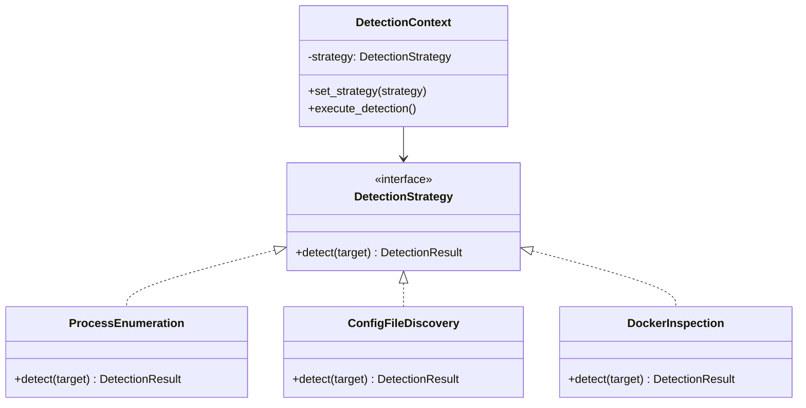
```mermaid
classDiagram
    class DetectionContext {
        -strategy: DetectionStrategy
        +set_strategy(strategy)
        +execute_detection()
    }
    
    class DetectionStrategy {
        <<interface>>
        +detect(target) DetectionResult
    }
    
    class ProcessEnumeration {
        +detect(target) DetectionResult
    }
    
    class ConfigFileDiscovery {
        +detect(target) DetectionResult
    }
    
    class DockerInspection {
        +detect(target) DetectionResult
    }
    
    DetectionContext --> DetectionStrategy
    DetectionStrategy <|.. ProcessEnumeration
    DetectionStrategy <|.. ConfigFileDiscovery
    DetectionStrategy <|.. DockerInspection
```

### 3. Factory Pattern Implementation

**Transport Factory:**
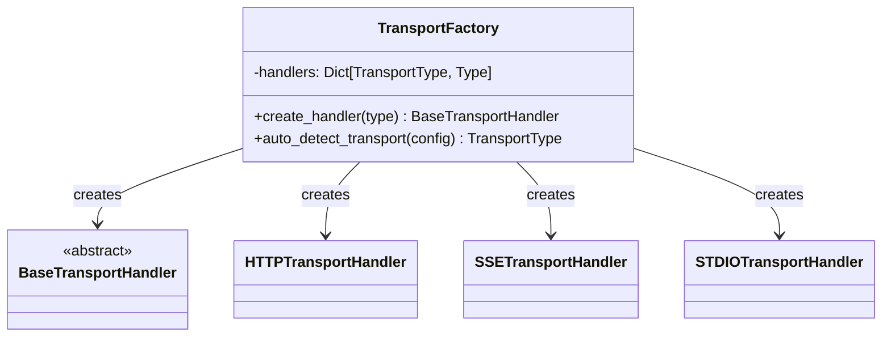
```mermaid
classDiagram
    class TransportFactory {
        -handlers: Dict[TransportType, Type]
        +create_handler(type) BaseTransportHandler
        +auto_detect_transport(config) TransportType
    }
    
    class BaseTransportHandler {
        <<abstract>>
    }
    
    TransportFactory --> BaseTransportHandler : creates
    TransportFactory --> HTTPTransportHandler : creates
    TransportFactory --> SSETransportHandler : creates
    TransportFactory --> STDIOTransportHandler : creates
```

## Performance Characteristics

### 1. **Scalability Patterns**
- **Connection Pooling**: Efficient resource reuse in scanner and transport layers
- **Asynchronous Processing**: Non-blocking I/O for network operations
- **Batch Processing**: Efficient handling of multiple targets
- **Caching**: Reduced redundant operations in MCP introspection

### 2. **Memory Management**
- **Object Pooling**: Reuse of expensive objects
- **Lazy Loading**: On-demand resource initialization
- **Memory Monitoring**: Built-in memory usage tracking
- **Garbage Collection Optimization**: Efficient object lifecycle management

### 3. **Performance Monitoring**
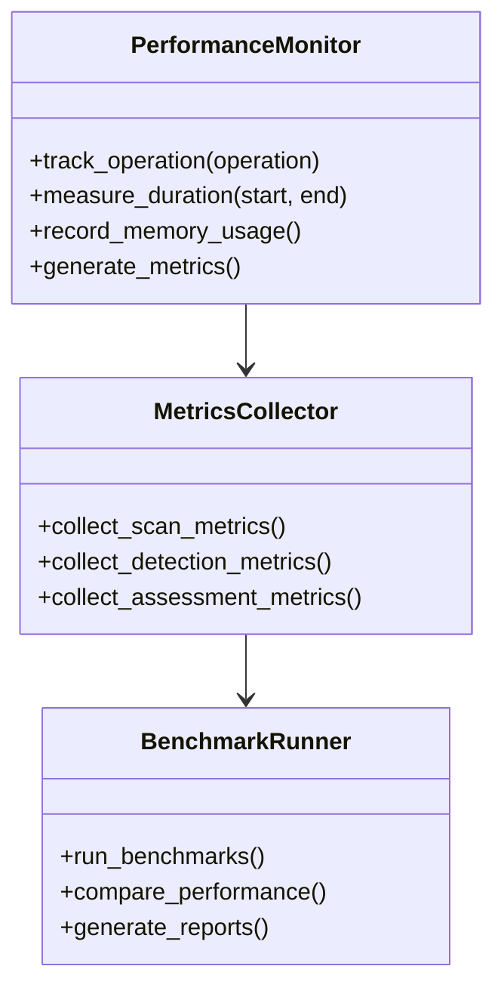
```mermaid
classDiagram
    class PerformanceMonitor {
        +track_operation(operation)
        +measure_duration(start, end)
        +record_memory_usage()
        +generate_metrics()
    }
    
    class MetricsCollector {
        +collect_scan_metrics()
        +collect_detection_metrics()
        +collect_assessment_metrics()
    }
    
    class BenchmarkRunner {
        +run_benchmarks()
        +compare_performance()
        +generate_reports()
    }
    
    PerformanceMonitor --> MetricsCollector
    MetricsCollector --> BenchmarkRunner
```

## Security Architecture

### 1. **Security Layers**
- **Input Validation**: Comprehensive input sanitization and validation
- **Authentication**: Secure credential management
- **Authorization**: Role-based access control
- **Transport Security**: TLS/SSL encryption for network communications
- **Data Protection**: Sensitive data encryption and secure storage

### 2. **Threat Model**
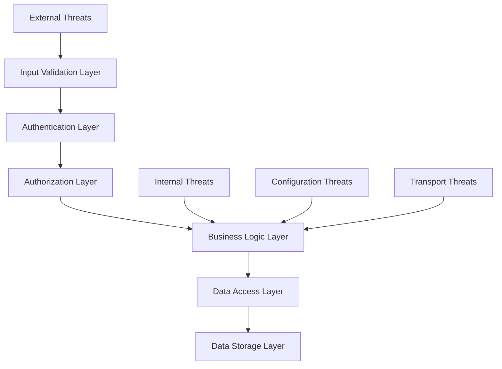
```mermaid
graph TD
    A[External Threats] --> B[Input Validation Layer]
    B --> C[Authentication Layer]
    C --> D[Authorization Layer]
    D --> E[Business Logic Layer]
    E --> F[Data Access Layer]
    F --> G[Data Storage Layer]
    
    H[Internal Threats] --> E
    I[Configuration Threats] --> E
    J[Transport Threats] --> E
```

### 3. **Security Controls**
- **Rate Limiting**: Protection against DoS attacks
- **Credential Management**: Secure API key and token handling
- **Audit Logging**: Comprehensive security event logging
- **Error Handling**: Secure error messages without information disclosure

## Extension Points

### 1. **Plugin Architecture**
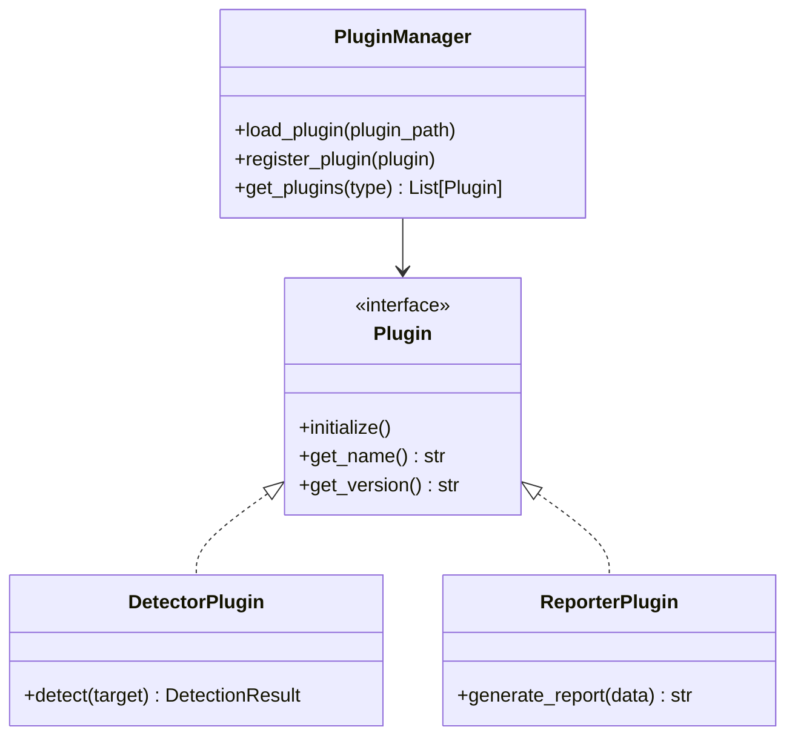
```mermaid
classDiagram
    class PluginManager {
        +load_plugin(plugin_path)
        +register_plugin(plugin)
        +get_plugins(type) List[Plugin]
    }
    
    class Plugin {
        <<interface>>
        +initialize()
        +get_name() str
        +get_version() str
    }
    
    class DetectorPlugin {
        +detect(target) DetectionResult
    }
    
    class ReporterPlugin {
        +generate_report(data) str
    }
    
    PluginManager --> Plugin
    Plugin <|.. DetectorPlugin
    Plugin <|.. ReporterPlugin
```

### 2. **Configuration Extension**
- **Custom Detectors**: Register new detection algorithms
- **Custom Assessors**: Add domain-specific risk assessment rules
- **Custom Reporters**: Implement new output formats
- **Custom Transports**: Add support for new communication protocols

### 3. **Integration Points**
- **API Endpoints**: RESTful API for external integration
- **Webhook Support**: Event-driven notifications
- **Database Connectors**: Integration with external databases
- **Message Queue Integration**: Asynchronous processing support

## Quality Attributes

### 1. **Maintainability**
- **Modular Design**: Clear separation of concerns
- **Consistent Interfaces**: Standardized API contracts
- **Comprehensive Documentation**: Detailed design and implementation docs
- **Test Coverage**: Extensive unit, integration, and e2e tests

### 2. **Reliability**
- **Error Handling**: Graceful degradation and recovery
- **Retry Mechanisms**: Automatic retry with exponential backoff
- **Circuit Breakers**: Protection against cascading failures
- **Health Checks**: System health monitoring and alerts

### 3. **Usability**
- **Progressive Disclosure**: Layered complexity for different user levels
- **Rich CLI Interface**: Comprehensive command-line options
- **Progress Tracking**: Real-time operation feedback
- **Comprehensive Help**: Built-in documentation and examples

### 4. **Testability**
- **Dependency Injection**: Easily mockable dependencies
- **Abstract Interfaces**: Testable component boundaries
- **Test Fixtures**: Reusable test data and configurations
- **Performance Testing**: Built-in benchmarking capabilities

## Technology Stack

### Core Technologies
- **Python 3.8+**: Primary programming language
- **Click**: Command-line interface framework
- **Rich**: Terminal output formatting and progress display
- **Pydantic**: Data validation and settings management
- **AsyncIO**: Asynchronous programming support

### Network and Communication
- **aiohttp**: Asynchronous HTTP client/server
- **websockets**: WebSocket communication
- **requests**: Synchronous HTTP requests
- **urllib3**: HTTP client utilities

### Data Processing
- **pandas**: Data analysis and manipulation
- **numpy**: Numerical computing
- **json**: JSON data processing
- **xml.etree**: XML processing

### Testing and Quality
- **pytest**: Testing framework
- **coverage**: Code coverage analysis
- **black**: Code formatting
- **flake8**: Code linting
- **mypy**: Static type checking

## Future Architecture Considerations

### 1. **Microservices Migration**
- **Service Decomposition**: Split monolith into focused services
- **API Gateway**: Centralized API management
- **Service Discovery**: Dynamic service registration and discovery
- **Event-Driven Architecture**: Asynchronous service communication

### 2. **Cloud-Native Patterns**
- **Containerization**: Docker-based deployment
- **Orchestration**: Kubernetes integration
- **Auto-Scaling**: Dynamic resource allocation
- **Health Monitoring**: Cloud-native observability

### 3. **AI/ML Integration**
- **Model Pipeline**: Automated model training and deployment
- **A/B Testing**: Comparative analysis of AI models
- **Feedback Loop**: Continuous learning from results
- **Explainable AI**: Transparent decision-making processes

## Conclusion

The HawkEye system architecture demonstrates a well-designed, modular approach to security reconnaissance and analysis. The layered architecture provides clear separation of concerns, while design patterns ensure extensibility and maintainability. The system's architecture supports both current requirements and future evolution, making it a robust foundation for comprehensive security analysis capabilities.

Key architectural strengths include:
- **Modularity**: Clear module boundaries and responsibilities
- **Extensibility**: Plugin architecture and factory patterns
- **Performance**: Optimized networking and caching strategies
- **Security**: Defense-in-depth security architecture
- **Maintainability**: Consistent patterns and comprehensive testing

The architecture provides a solid foundation for continued development and enhancement of HawkEye's security reconnaissance capabilities. 