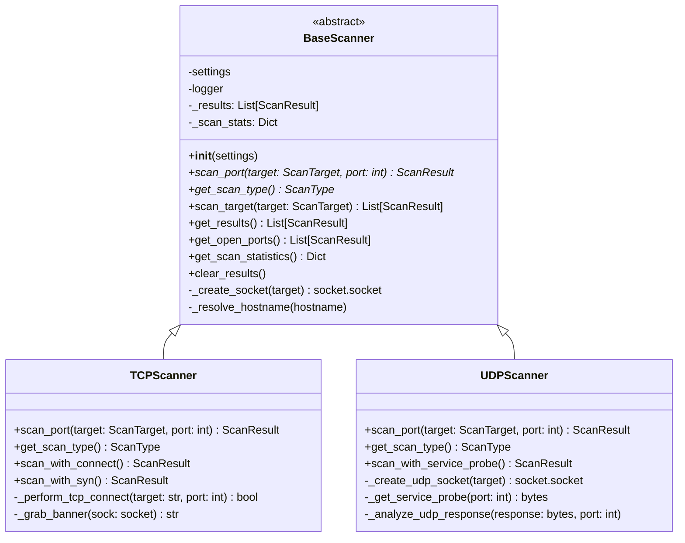
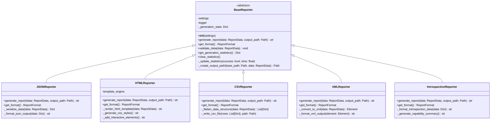

# Abstract Base Class (ABC) Pattern Documentation

## Overview

The Abstract Base Class (ABC) pattern is a fundamental design pattern extensively used throughout the HawkEye Security Reconnaissance Tool. This pattern defines a common interface and shared behavior for related classes while enforcing the implementation of specific methods in concrete subclasses.

## Pattern Definition

An Abstract Base Class serves as a blueprint that:
- Defines abstract methods that must be implemented by subclasses
- Provides concrete methods with shared functionality
- Establishes a common interface for polymorphic behavior
- Enforces a contract that all subclasses must follow

## Implementation in HawkEye

The HawkEye codebase leverages Python's `abc` module to implement this pattern across four main hierarchies:

1. **MCPDetector** - MCP detection operations
2. **BaseScanner** - Network scanning operations  
3. **RiskAssessor** - Security risk assessment operations
4. **BaseReporter** - Report generation operations

## UML Class Diagrams

### 1. MCPDetector Hierarchy

```mermaid
classDiagram
    class MCPDetector {
        <<abstract>>
        -settings
        -logger
        -_results: List[DetectionResult]
        -_detection_stats: Dict
        +__init__(settings)
        +detect(target_host: str, **kwargs)* DetectionResult
        +get_detection_method()* DetectionMethod
        +detect_multiple(targets: List[str]) List[DetectionResult]
        +get_results() List[DetectionResult]
        +get_detection_statistics() Dict
        +clear_results()
    }
    
    class ProcessEnumerator {
        -mcp_process_patterns: List[str]
        -known_mcp_executables: Set[str]
        +detect(target_host: str) DetectionResult
        +get_detection_method() DetectionMethod
        +find_nodejs_processes() List[ProcessInfo]
        +analyze_process_environment(pid: int) Dict
    }
    
    class ConfigFileDiscovery {
        -config_patterns: List[str]
        -search_locations: List[str]
        +detect(target_host: str) DetectionResult
        +get_detection_method() DetectionMethod
        +find_mcp_configs(search_path: str) List[ConfigFileInfo]
        +parse_config_file(file_path: Path) Dict
    }
    
    class NPXDetector {
        -mcp_package_patterns: List[str]
        -known_mcp_packages: Set[str]
        +detect(target_host: str) DetectionResult
        +get_detection_method() DetectionMethod
        +find_npx_packages() List[str]
        +analyze_package_json(path: Path) Dict
    }
    
    class EnvironmentAnalyzer {
        -mcp_env_patterns: List[str]
        -known_mcp_env_vars: Set[str]
        +detect(target_host: str) DetectionResult
        +get_detection_method() DetectionMethod
        +analyze_environment_variables() Dict
        +extract_mcp_config_from_env() Dict
    }
    
    class TransportDetector {
        -transport_patterns: Dict
        -known_transports: Set[TransportType]
        +detect(target_host: str) DetectionResult
        +get_detection_method() DetectionMethod
        +identify_transport_type() TransportType
        +probe_transport_endpoint() bool
    }
    
    class DockerInspector {
        -docker_client
        +detect(target_host: str) DetectionResult
        +get_detection_method() DetectionMethod
        +inspect_containers() List[Dict]
        +analyze_container_config() Dict
    }
    
    class ProtocolVerifier {
        -protocol_handlers: Dict
        +detect(target_host: str) DetectionResult
        +get_detection_method() DetectionMethod
        +verify_mcp_protocol() bool
        +simulate_handshake() bool
    }

    MCPDetector <|-- ProcessEnumerator
    MCPDetector <|-- ConfigFileDiscovery
    MCPDetector <|-- NPXDetector
    MCPDetector <|-- EnvironmentAnalyzer
    MCPDetector <|-- TransportDetector
    MCPDetector <|-- DockerInspector
    MCPDetector <|-- ProtocolVerifier
```



### 2. BaseScanner Hierarchy



### 3. RiskAssessor Hierarchy

```mermaid
classDiagram
    class RiskAssessor {
        <<abstract>>
        -settings
        -logger
        -_assessment_stats: Dict
        +__init__(settings)
        +assess(detection_result: DetectionResult)* AssessmentResult
        +get_assessment_type()* str
        +assess_multiple(results: List[DetectionResult]) RiskAssessment
        +get_assessment_statistics() Dict
        +clear_statistics()
    }
    
    class ConfigurationAnalyzer {
        -security_patterns: Dict
        -vulnerability_checks: List
        +assess(detection_result: DetectionResult) AssessmentResult
        +get_assessment_type() str
        +analyze_configuration(config: Dict) List[SecurityFinding]
        +check_default_passwords() bool
        +validate_ssl_config() SecurityFinding
    }
    
    class AuthenticationAnalyzer {
        -auth_patterns: Dict
        -weak_patterns: List[str]
        +assess(detection_result: DetectionResult) AssessmentResult
        +get_assessment_type() str
        +analyze_auth_mechanisms() List[SecurityFinding]
        +check_password_strength(password: str) float
        +validate_jwt_token(token: str) bool
    }
    
    class TransportSecurityAssessor {
        -transport_checks: Dict
        +assess(detection_result: DetectionResult) AssessmentResult
        +get_assessment_type() str
        +assess_transport_security() List[SecurityFinding]
        +check_tls_configuration() SecurityFinding
        +verify_certificate_chain() bool
    }
    
    class DefaultConfigurationDetector {
        -default_patterns: List[DefaultPattern]
        +assess(detection_result: DetectionResult) AssessmentResult
        +get_assessment_type() str
        +detect_default_configurations() List[SecurityFinding]
        +check_for_pattern(pattern: DefaultPattern) bool
    }
    
    class ComplianceChecker {
        -compliance_frameworks: Dict
        +assess(detection_result: DetectionResult) AssessmentResult
        +get_assessment_type() str
        +check_compliance(framework: ComplianceFramework) ComplianceReport
        +generate_compliance_report() ComplianceReport
    }

    RiskAssessor <|-- ConfigurationAnalyzer
    RiskAssessor <|-- AuthenticationAnalyzer
    RiskAssessor <|-- TransportSecurityAssessor
    RiskAssessor <|-- DefaultConfigurationDetector
    RiskAssessor <|-- ComplianceChecker
```



### 4. BaseReporter Hierarchy



## Implementation Examples

### 1. MCPDetector Implementation

**Abstract Base Class:**
```python
from abc import ABC, abstractmethod
from typing import List
from ..utils.logging import get_logger

class MCPDetector(ABC):
    """Abstract base class for MCP detection operations."""
    
    def __init__(self, settings=None):
        """Initialize the detector with configuration settings."""
        self.settings = settings or get_settings()
        self.logger = get_logger(self.__class__.__name__)
        self._results: List[DetectionResult] = []
        self._detection_stats = {
            'total_detections': 0,
            'successful_detections': 0,
            'failed_detections': 0,
            'mcp_servers_found': 0,
            'start_time': None,
            'end_time': None,
        }
    
    @abstractmethod
    def detect(self, target_host: str, **kwargs) -> DetectionResult:
        """Perform MCP detection on a target."""
        pass
    
    @abstractmethod
    def get_detection_method(self) -> DetectionMethod:
        """Get the detection method used by this detector."""
        pass
    
    def detect_multiple(self, targets: List[str], **kwargs) -> List[DetectionResult]:
        """Detect MCP servers on multiple targets."""
        results = []
        for target in targets:
            try:
                result = self.detect(target, **kwargs)
                results.append(result)
                self._results.append(result)
                self._detection_stats['successful_detections'] += 1
                if result.mcp_servers:
                    self._detection_stats['mcp_servers_found'] += len(result.mcp_servers)
            except Exception as e:
                self.logger.error(f"Detection failed for {target}: {e}")
                self._detection_stats['failed_detections'] += 1
            
            self._detection_stats['total_detections'] += 1
        
        return results
```

**Concrete Implementation:**
```python
class ProcessEnumerator(MCPDetector):
    """Detector for MCP servers through process enumeration."""
    
    def __init__(self, settings=None):
        super().__init__(settings)
        self.mcp_process_patterns = [
            r'.*mcp-server.*',
            r'.*@modelcontextprotocol.*',
            r'node.*mcp.*'
        ]
    
    def detect(self, target_host: str, **kwargs) -> DetectionResult:
        """Perform process-based MCP detection."""
        self.logger.info(f"Starting process enumeration on {target_host}")
        
        try:
            # Implementation specific logic
            processes = self._enumerate_processes()
            mcp_processes = self._filter_mcp_processes(processes)
            mcp_servers = self._analyze_mcp_processes(mcp_processes)
            
            return DetectionResult(
                target_host=target_host,
                success=True,
                detection_method=self.get_detection_method(),
                mcp_servers=mcp_servers,
                process_info=mcp_processes
            )
        except Exception as e:
            self.logger.error(f"Process enumeration failed: {e}")
            return DetectionResult(
                target_host=target_host,
                success=False,
                detection_method=self.get_detection_method(),
                error=str(e)
            )
    
    def get_detection_method(self) -> DetectionMethod:
        """Return the detection method identifier."""
        return DetectionMethod.PROCESS_ENUMERATION
```

### 2. BaseScanner Implementation

**Abstract Base Class:**
```python
class BaseScanner(ABC):
    """Abstract base class for network scanners."""
    
    def __init__(self, settings=None):
        """Initialize the scanner with configuration settings."""
        self.settings = settings or get_settings()
        self.logger = get_logger(self.__class__.__name__)
        self._results: List[ScanResult] = []
        self._scan_stats = {
            'total_scans': 0,
            'successful_scans': 0,
            'failed_scans': 0,
            'start_time': None,
            'end_time': None,
        }
    
    @abstractmethod
    def scan_port(self, target: ScanTarget, port: int) -> ScanResult:
        """Scan a single port on a target."""
        pass
    
    @abstractmethod
    def get_scan_type(self) -> ScanType:
        """Get the scan type implemented by this scanner."""
        pass
    
    def scan_target(self, target: ScanTarget) -> List[ScanResult]:
        """Scan all specified ports on a target."""
        self.logger.info(f"Starting scan of {target.host} on {len(target.ports)} ports")
        self._scan_stats['start_time'] = time.time()
        
        results = []
        for port in target.ports:
            try:
                result = self.scan_port(target, port)
                results.append(result)
                self._results.append(result)
                self._scan_stats['successful_scans'] += 1
                
                if result.is_open:
                    self.logger.info(f"Found open port: {target.host}:{port}")
                    
            except Exception as e:
                self.logger.error(f"Error scanning {target.host}:{port} - {e}")
                self._scan_stats['failed_scans'] += 1
            
            self._scan_stats['total_scans'] += 1
        
        self._scan_stats['end_time'] = time.time()
        return results
```

**Concrete Implementation:**
```python
class TCPScanner(BaseScanner):
    """TCP connect scanner implementation."""
    
    def scan_port(self, target: ScanTarget, port: int) -> ScanResult:
        """Scan a single TCP port."""
        start_time = time.time()
        
        try:
            sock = self._create_socket(target)
            sock.settimeout(self.settings.scan_timeout)
            
            result = sock.connect_ex((target.host, port))
            response_time = time.time() - start_time
            
            if result == 0:
                # Port is open, try to grab banner
                banner = self._grab_banner(sock)
                service_info = self._analyze_service(banner, port)
                
                return ScanResult(
                    target=target,
                    port=port,
                    state=PortState.OPEN,
                    scan_type=self.get_scan_type(),
                    response_time=response_time,
                    banner=banner,
                    service_info=service_info
                )
            else:
                return ScanResult(
                    target=target,
                    port=port,
                    state=PortState.CLOSED,
                    scan_type=self.get_scan_type(),
                    response_time=response_time
                )
                
        except socket.timeout:
            return ScanResult(
                target=target,
                port=port,
                state=PortState.FILTERED,
                scan_type=self.get_scan_type(),
                response_time=self.settings.scan_timeout
            )
        finally:
            if 'sock' in locals():
                sock.close()
    
    def get_scan_type(self) -> ScanType:
        """Return TCP scan type."""
        return ScanType.TCP_CONNECT
```

## Benefits of the ABC Pattern

### 1. **Interface Consistency**
- Enforces a uniform interface across all related classes
- Guarantees that essential methods are implemented
- Provides compile-time contract validation

### 2. **Code Reusability**
- Shared functionality in the base class reduces duplication
- Common initialization and utility methods are centralized
- Consistent logging, statistics, and error handling

### 3. **Polymorphism Support**
- Enables treating different implementations uniformly
- Supports dynamic method dispatch
- Facilitates plugin-like architectures

### 4. **Maintainability**
- Changes to common functionality only require base class updates
- Clear separation of concerns between abstract and concrete behavior
- Easier to extend with new implementations

### 5. **Design Clarity**
- Makes the intended class hierarchy explicit
- Documents the expected interface and behavior
- Improves code readability and understanding

## Drawbacks and Considerations

### 1. **Increased Complexity**
- Additional abstraction layer can make code harder to follow
- May lead to over-engineering for simple scenarios
- Requires understanding of inheritance concepts

### 2. **Inheritance Limitations**
- Python's single inheritance model can be restrictive
- Deep inheritance hierarchies can become unwieldy
- Tight coupling between base and derived classes

### 3. **Performance Overhead**
- Method resolution through inheritance has slight performance cost
- Virtual method calls are slower than direct calls
- Additional memory usage for class hierarchy metadata

### 4. **Rigidity**
- Changes to abstract interface affect all implementations
- Difficult to modify base class without breaking derived classes
- May force implementations into artificial patterns

## Best Practices

### 1. **Abstract Method Design**
```python
@abstractmethod
def process_data(self, data: InputType) -> OutputType:
    """
    Process the input data and return results.
    
    Args:
        data: Input data to process
        
    Returns:
        Processed results
        
    Raises:
        ProcessingError: If processing fails
    """
    pass
```

### 2. **Proper Base Class Initialization**
```python
def __init__(self, settings=None):
    """Initialize with proper error handling and logging setup."""
    self.settings = settings or get_settings()
    self.logger = get_logger(self.__class__.__name__)
    self._initialize_stats()
    self._validate_configuration()
```

### 3. **Template Method Pattern Integration**
```python
def execute_workflow(self, data):
    """Template method defining the overall workflow."""
    self._pre_process(data)
    result = self.process(data)  # Abstract method
    self._post_process(result)
    return result

@abstractmethod
def process(self, data):
    """Concrete classes must implement this."""
    pass
```

### 4. **Exception Handling Strategy**
```python
class DetectorError(Exception):
    """Base exception for detector errors."""
    pass

class MCPDetector(ABC):
    def safe_detect(self, target):
        """Wrapper with consistent error handling."""
        try:
            return self.detect(target)
        except DetectorError:
            raise  # Re-raise known errors
        except Exception as e:
            self.logger.error(f"Unexpected error: {e}")
            raise DetectorError(f"Detection failed: {e}") from e
```

### 5. **Configuration and Settings Management**
```python
class BaseProcessor(ABC):
    def __init__(self, settings=None):
        self.settings = settings or self._get_default_settings()
        self._validate_settings()
    
    def _get_default_settings(self):
        """Provide sensible defaults."""
        return ProcessorSettings(
            timeout=30,
            max_retries=3,
            enable_logging=True
        )
    
    def _validate_settings(self):
        """Validate configuration before use."""
        if self.settings.timeout <= 0:
            raise ValueError("Timeout must be positive")
```

## Usage Guidelines

### When to Use ABC Pattern

1. **Multiple Related Classes**: When you have several classes that share common behavior but implement it differently
2. **Interface Contracts**: When you need to enforce specific method signatures across implementations
3. **Plugin Architectures**: When building extensible systems that accept user-defined implementations
4. **Framework Development**: When creating libraries that others will extend

### When to Consider Alternatives

1. **Simple Hierarchies**: For single inheritance with minimal shared behavior, consider composition
2. **Duck Typing Scenarios**: When Python's dynamic nature is sufficient for polymorphism
3. **Mixin Requirements**: When multiple inheritance or behavior composition is needed
4. **Protocol-Based Design**: When using Python 3.8+ Protocols for structural subtyping

## Conclusion

The Abstract Base Class pattern is a cornerstone of the HawkEye architecture, providing consistent interfaces and shared functionality across the detection, scanning, assessment, and reporting modules. Its implementation ensures code quality, maintainability, and extensibility while supporting the tool's modular design philosophy.

The pattern's success in HawkEye demonstrates its value for building robust, scalable security tools that can accommodate diverse detection methods, scanning techniques, and reporting formats while maintaining a unified programming interface.