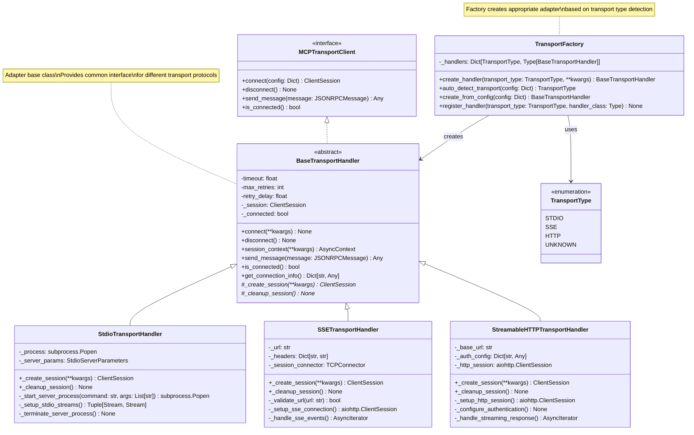
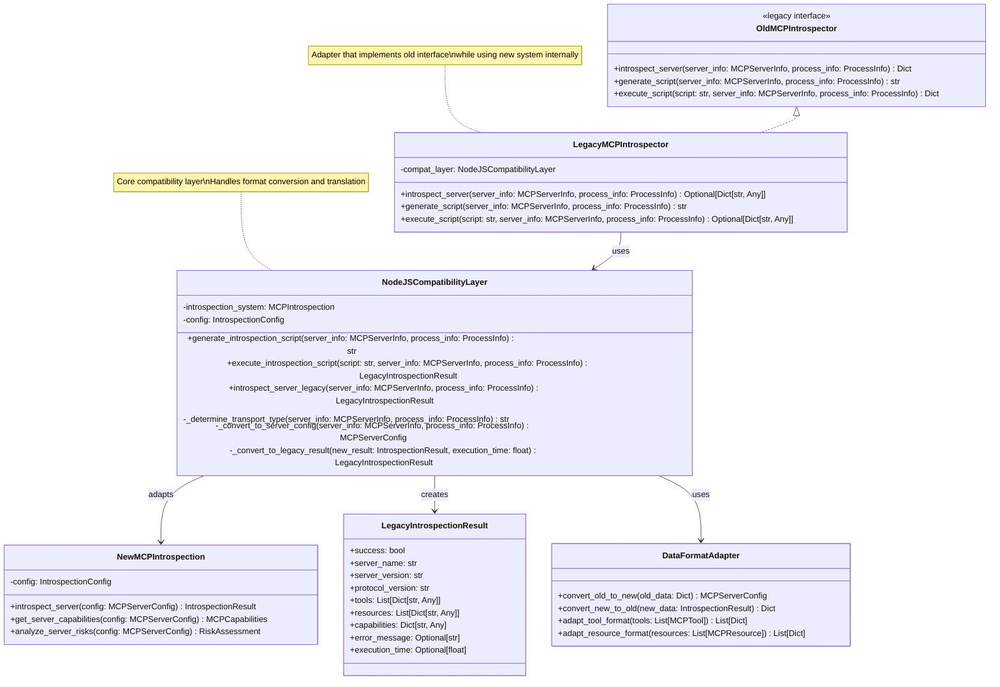
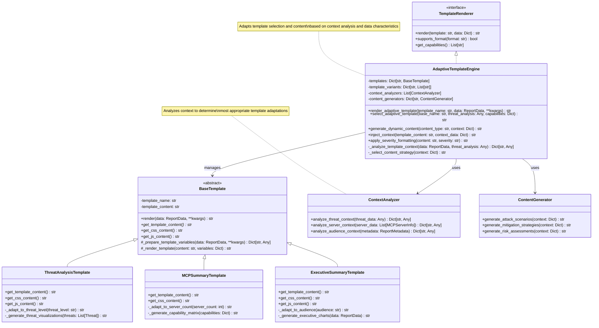
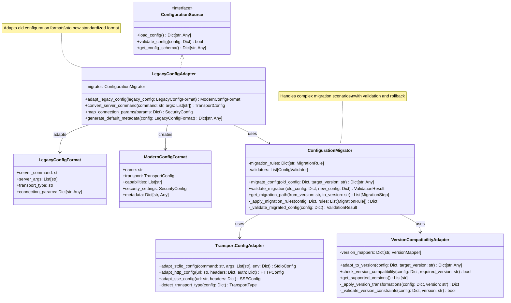

# Adapter Pattern Documentation

## Overview

The Adapter Pattern is extensively implemented throughout the HawkEye Security Reconnaissance Tool to enable compatibility between incompatible interfaces, integrate legacy systems, and provide unified access to diverse protocols and data formats. This pattern allows classes with incompatible interfaces to work together by wrapping one interface with another.

## Pattern Definition

The Adapter Pattern:
- Converts the interface of a class into another interface that clients expect
- Allows incompatible classes to work together through interface translation
- Provides a bridge between legacy systems and new implementations
- Enables integration of third-party libraries with different interfaces
- Supports protocol version compatibility and format conversion

## Implementation in HawkEye

HawkEye implements the Adapter Pattern across multiple layers to provide seamless integration and compatibility:

1. **Transport Protocol Adapters** - Unified interface for different MCP transport protocols (stdio, SSE, HTTP)
2. **Legacy System Adapters** - Compatibility layers for migrating from old Node.js-based systems
3. **Data Format Adapters** - Conversion between different data structures and formats
4. **Template System Adapters** - Adaptive template rendering based on content and context
5. **Configuration Adapters** - Translation between different configuration formats
6. **Version Compatibility Adapters** - Support for multiple protocol and API versions

## UML Class Diagrams

### 1. Transport Protocol Adapter Pattern



### 2. Legacy System Compatibility Adapter Pattern



### 3. Data Format Adapter Pattern

```mermaid
classDiagram
    class ReportDataSource {
        <<interface>>
        +get_scan_data() List[ScanResult]
        +get_detection_data() List[DetectionResult]
        +get_assessment_data() List[AssessmentResult]
        +get_metadata() ReportMetadata
    }
    
    class PipelineResult {
        +target_host: str
        +detection_results: Dict[DetectionMethod, List[DetectionResult]]
        +introspection_results: Dict[str, MCPCapabilities]
        +success: bool
        +duration: float
        +mcp_servers_found: int
        +raw_data: Dict[str, Any]
    }
    
    class ReportData {
        +metadata: ReportMetadata
        +scan_results: List[ScanResult]
        +detection_results: List[DetectionResult]
        +assessment_results: List[AssessmentResult]
        +pipeline_results: List[PipelineResult]
        +mcp_servers: List[MCPServerInfo]
        +introspection_data: Dict[str, Any]
        +recommendations: List[str]
    }
    
    class PipelineToReportConverter {
        +convert_pipeline_results(pipeline_results: List[PipelineResult], title: str, report_type: ReportType) ReportData
        +_extract_detection_results(pipeline_results: List[PipelineResult]) List[DetectionResult]
        +_extract_mcp_servers(pipeline_results: List[PipelineResult]) List[MCPServerInfo]
        +_generate_introspection_summary(pipeline_results: List[PipelineResult]) IntrospectionSummary
        +_generate_recommendations(pipeline_results: List[PipelineResult]) List[str]
    }
    
    class FormatAdapter {
        <<interface>>
        +adapt_to_format(data: Any, target_format: str) Any
        +validate_format_compatibility(data: Any, format: str) bool
        +get_supported_formats() List[str]
    }
    
    class JSONFormatAdapter {
        +adapt_to_format(data: ReportData, target_format: str) Dict[str, Any]
        +validate_format_compatibility(data: ReportData, format: str) bool
        +get_supported_formats() List[str]
        -_serialize_complex_objects(obj: Any) Any
        -_handle_datetime_serialization(dt: datetime) str
    }
    
    class CSVFormatAdapter {
        +adapt_to_format(data: ReportData, target_format: str) str
        +validate_format_compatibility(data: ReportData, format: str) bool
        +get_supported_formats() List[str]
        -_flatten_nested_data(data: Dict) Dict[str, Any]
        -_generate_csv_headers(data: List[Dict]) List[str]
    }
    
    class XMLFormatAdapter {
        +adapt_to_format(data: ReportData, target_format: str) str
        +validate_format_compatibility(data: ReportData, format: str) bool
        +get_supported_formats() List[str]
        -_create_xml_elements(data: Dict, parent: Element) None
        -_handle_special_characters(text: str) str
    }

    ReportDataSource <|.. PipelineToReportConverter
    PipelineToReportConverter --> PipelineResult : adapts
    PipelineToReportConverter --> ReportData : creates
    FormatAdapter <|-- JSONFormatAdapter
    FormatAdapter <|-- CSVFormatAdapter
    FormatAdapter <|-- XMLFormatAdapter
    
    note for PipelineToReportConverter "Adapts pipeline execution results\nto standardized report data format"
    note for FormatAdapter "Adapts data to different output formats\nwhile preserving semantic meaning"
```



### 4. Template System Adapter Pattern



### 5. Configuration Adapter Pattern



## Implementation Examples

### 1. Transport Protocol Adapter Implementation

**Base Adapter Interface:**
```python
from abc import ABC, abstractmethod
from typing import Any, Dict, Optional
from contextlib import asynccontextmanager

class BaseTransportHandler(ABC):
    """Abstract base class for MCP transport handlers - Adapter interface."""
    
    def __init__(self, timeout: float = 30.0, max_retries: int = 3, retry_delay: float = 1.0):
        """Initialize the transport handler with common parameters."""
        self.timeout = timeout
        self.max_retries = max_retries
        self.retry_delay = retry_delay
        self._session: Optional[ClientSession] = None
        self._connected = False
    
    @property
    def is_connected(self) -> bool:
        """Check if the transport is currently connected."""
        return self._connected and self._session is not None
    
    @abstractmethod
    async def _create_session(self, **kwargs) -> ClientSession:
        """Create and return a new MCP client session - Adaptation point."""
        pass
    
    @abstractmethod
    async def _cleanup_session(self) -> None:
        """Clean up the current session - Adaptation point."""
        pass
    
    async def connect(self, **kwargs) -> None:
        """Connect to the MCP server using transport-specific method."""
        if self.is_connected:
            await self.disconnect()
        
        try:
            self._session = await self._create_session(**kwargs)
            self._connected = True
            self.logger.info("Successfully connected to MCP server")
        except Exception as e:
            self.logger.error(f"Connection failed: {e}")
            raise ConnectionFailedError(f"Failed to connect: {e}")
    
    @asynccontextmanager
    async def session_context(self, **kwargs):
        """Context manager for automatic connection and cleanup."""
        await self.connect(**kwargs)
        try:
            yield self._session
        finally:
            await self.disconnect()
```

**Concrete Adapter Implementations:**
```python
class StdioTransportHandler(BaseTransportHandler):
    """Adapter for stdio-based MCP communication."""
    
    def __init__(self, **kwargs):
        super().__init__(**kwargs)
        self._process: Optional[subprocess.Popen] = None
        self._server_params: Optional[StdioServerParameters] = None
    
    async def _create_session(self, **kwargs) -> ClientSession:
        """Adapt stdio process communication to MCP ClientSession interface."""
        command = kwargs.get('command')
        args = kwargs.get('args', [])
        env = kwargs.get('env', {})
        
        if not command:
            raise ConnectionFailedError("Command is required for stdio transport")
        
        # Prepare server parameters for stdio transport
        self._server_params = StdioServerParameters(
            command=command,
            args=args,
            env=env if env else None
        )
        
        self.logger.debug(f"Starting MCP server: {command} {' '.join(args)}")
        
        # Create stdio client session - adapts process communication to MCP protocol
        session = await stdio_client(self._server_params)
        
        self.logger.info(f"Successfully created stdio session for: {command}")
        return session
    
    async def _cleanup_session(self) -> None:
        """Clean up stdio process and session."""
        try:
            if self._session:
                # Close the MCP session
                await self._session.__aexit__(None, None, None)
            
            # Terminate the server process if it's still running
            if self._process and self._process.poll() is None:
                self._process.terminate()
                try:
                    self._process.wait(timeout=5.0)
                except subprocess.TimeoutExpired:
                    self._process.kill()
                    
        except Exception as e:
            self.logger.error(f"Error during stdio cleanup: {e}")

class SSETransportHandler(BaseTransportHandler):
    """Adapter for Server-Sent Events MCP communication."""
    
    def __init__(self, **kwargs):
        super().__init__(**kwargs)
        self._url: Optional[str] = None
        self._headers: Dict[str, str] = {}
    
    async def _create_session(self, **kwargs) -> ClientSession:
        """Adapt SSE communication to MCP ClientSession interface."""
        url = kwargs.get('url')
        headers = kwargs.get('headers', {})
        verify_ssl = kwargs.get('verify_ssl', True)
        
        if not url:
            raise ConnectionFailedError("URL is required for SSE transport")
        
        # Validate URL format
        if not self._validate_url(url):
            raise ConnectionFailedError(f"Invalid URL format: {url}")
        
        self._url = url
        self._headers = headers.copy()
        
        # Create SSE connection adapter
        connector = aiohttp.TCPConnector(
            verify_ssl=verify_ssl,
            limit=10,
            limit_per_host=5,
            ttl_dns_cache=300,
            use_dns_cache=True,
        )
        
        self.logger.debug(f"Connecting to MCP server via SSE: {url}")
        
        # Adapt SSE events to MCP protocol
        session = await self._create_sse_session(url, headers, connector)
        
        self.logger.info(f"Successfully created SSE session for: {url}")
        return session
    
    def _validate_url(self, url: str) -> bool:
        """Validate URL format for SSE transport."""
        from urllib.parse import urlparse
        parsed = urlparse(url)
        return parsed.scheme in ('http', 'https') and parsed.netloc
    
    async def _create_sse_session(self, url: str, headers: Dict[str, str], 
                                 connector: aiohttp.TCPConnector) -> ClientSession:
        """Create SSE session adapted to MCP interface."""
        # This would implement the actual SSE to MCP protocol adaptation
        # For now, returning a mock session that represents the adapter
        from unittest.mock import AsyncMock
        session = AsyncMock(spec=ClientSession)
        session.url = url
        session.headers = headers
        session.connector = connector
        return session
```

**Transport Factory (Adapter Factory):**
```python
class TransportFactory:
    """Factory for creating transport adapters."""
    
    # Registry of available transport adapters
    _handlers: Dict[TransportType, Type[BaseTransportHandler]] = {
        TransportType.STDIO: StdioTransportHandler,
        TransportType.SSE: SSETransportHandler,
        TransportType.HTTP: StreamableHTTPTransportHandler,
    }
    
    def create_handler(self, transport_type: Union[str, TransportType], **kwargs) -> BaseTransportHandler:
        """Create appropriate transport adapter based on type."""
        # Convert string to enum if needed
        if isinstance(transport_type, str):
            try:
                transport_type = TransportType(transport_type.lower())
            except ValueError:
                raise TransportError(f"Unsupported transport type: {transport_type}")
        
        if transport_type not in self._handlers:
            raise TransportError(f"No handler available for transport type: {transport_type}")
        
        # Create the appropriate adapter
        handler_class = self._handlers[transport_type]
        return handler_class(**kwargs)
    
    def auto_detect_transport(self, config: Dict[str, Any]) -> TransportType:
        """Automatically detect and adapt transport type from configuration."""
        # Detect stdio transport
        if 'command' in config or 'args' in config:
            return TransportType.STDIO
        
        # Detect URL-based transports
        if 'url' in config:
            url = config['url']
            if any(indicator in url.lower() for indicator in ['sse', 'events', 'stream']):
                return TransportType.SSE
            else:
                return TransportType.HTTP
        
        # Default fallback
        return TransportType.STDIO
```

### 2. Legacy System Compatibility Adapter

**Legacy Interface Definition:**
```python
# Old interface that existing code expects
class OldMCPIntrospector:
    """Legacy interface for MCP introspection."""
    
    def introspect_server(self, server_info: MCPServerInfo, process_info: ProcessInfo) -> Optional[Dict[str, Any]]:
        """Legacy method signature."""
        pass
    
    def generate_script(self, server_info: MCPServerInfo, process_info: ProcessInfo) -> str:
        """Generate introspection script."""
        pass
```

**Compatibility Adapter Implementation:**
```python
class NodeJSCompatibilityLayer:
    """Adapter that provides compatibility with Node.js-based introspection."""
    
    def __init__(self, config: Optional[IntrospectionConfig] = None):
        self.config = config or IntrospectionConfig()
        self.introspection_system = MCPIntrospection(self.config)  # New system
        self.logger = get_logger(__name__)
    
    def introspect_server_legacy(self, server_info: MCPServerInfo, 
                                process_info: ProcessInfo) -> LegacyIntrospectionResult:
        """Adapt legacy introspection call to new system."""
        start_time = time.time()
        
        try:
            self.logger.info(f"Executing introspection for {server_info.name} (PID: {process_info.pid})")
            
            # Convert legacy parameters to new format
            server_config = self._convert_to_server_config(server_info, process_info)
            
            # Use new introspection system
            result = self.introspection_system.introspect_server(server_config)
            
            execution_time = time.time() - start_time
            
            # Convert new result back to legacy format
            if result.success and result.servers:
                new_server_info = result.servers[0]
                return self._convert_to_legacy_result(new_server_info, execution_time)
            else:
                error_msg = result.metadata.get('error', 'Unknown error')
                return LegacyIntrospectionResult(
                    success=False,
                    server_name=server_info.name,
                    server_version="unknown",
                    protocol_version="unknown",
                    tools=[],
                    resources=[],
                    capabilities={},
                    error_message=error_msg,
                    execution_time=execution_time
                )
                
        except Exception as e:
            execution_time = time.time() - start_time
            self.logger.error(f"Introspection execution failed: {e}")
            return LegacyIntrospectionResult(
                success=False,
                server_name=server_info.name,
                server_version="unknown",
                protocol_version="unknown",
                tools=[],
                resources=[],
                capabilities={},
                error_message=str(e),
                execution_time=execution_time
            )
    
    def _convert_to_server_config(self, server_info: MCPServerInfo, 
                                 process_info: ProcessInfo) -> MCPServerConfig:
        """Adapt legacy server info to new configuration format."""
        transport_type = self._determine_transport_type(server_info, process_info)
        
        # Build new configuration from legacy data
        config_data = {
            'name': server_info.name,
            'command': process_info.cmdline.split() if process_info.cmdline else [],
            'env': {},  # Would extract from process if available
            'transport': {
                'type': transport_type,
                'timeout': 30.0
            }
        }
        
        return MCPServerConfig(**config_data)
    
    def _convert_to_legacy_result(self, new_server_info: 'NewMCPServerInfo', 
                                 execution_time: float) -> LegacyIntrospectionResult:
        """Convert new introspection result to legacy format."""
        # Adapt new tool format to legacy format
        legacy_tools = []
        if hasattr(new_server_info, 'tools') and new_server_info.tools:
            for tool in new_server_info.tools:
                legacy_tools.append({
                    'name': tool.name,
                    'description': tool.description,
                    'schema': tool.input_schema
                })
        
        # Adapt new resource format to legacy format
        legacy_resources = []
        if hasattr(new_server_info, 'resources') and new_server_info.resources:
            for resource in new_server_info.resources:
                legacy_resources.append({
                    'uri': resource.uri,
                    'name': resource.name,
                    'description': resource.description,
                    'mime_type': resource.mime_type
                })
        
        return LegacyIntrospectionResult(
            success=True,
            server_name=new_server_info.name,
            server_version=getattr(new_server_info, 'version', 'unknown'),
            protocol_version=getattr(new_server_info, 'protocol_version', 'unknown'),
            tools=legacy_tools,
            resources=legacy_resources,
            capabilities=getattr(new_server_info, 'capabilities', {}),
            execution_time=execution_time
        )

class LegacyMCPIntrospector:
    """Adapter that implements the old interface using the new system."""
    
    def __init__(self, config: Optional[IntrospectionConfig] = None):
        self.compat_layer = NodeJSCompatibilityLayer(config)
        self.logger = get_logger(__name__)
    
    def introspect_server(self, server_info: MCPServerInfo, 
                         process_info: ProcessInfo) -> Optional[Dict[str, Any]]:
        """Implement legacy interface by adapting to new system."""
        result = self.compat_layer.introspect_server_legacy(server_info, process_info)
        
        if result.success:
            # Convert to exact legacy format expected by old code
            return {
                "server_name": result.server_name,
                "server_version": result.server_version,
                "protocol_version": result.protocol_version,
                "tools": result.tools,
                "resources": result.resources,
                "capabilities": result.capabilities,
                "execution_time": result.execution_time
            }
        else:
            self.logger.error(f"Legacy introspection failed: {result.error_message}")
            return None
```

### 3. Data Format Adapter Implementation

**Format Conversion Adapter:**
```python
class PipelineToReportConverter:
    """Adapter that converts pipeline results to report data format."""
    
    def __init__(self):
        self.logger = get_logger(__name__)
    
    def convert_pipeline_results(self, pipeline_results: List[PipelineResult],
                                report_title: str = "MCP Detection Report",
                                report_type: ReportType = ReportType.COMBINED_REPORT) -> ReportData:
        """Convert pipeline results to standardized report format."""
        
        # Create report metadata
        metadata = ReportMetadata(
            title=report_title,
            report_type=report_type,
            description=f"Comprehensive MCP detection report for {len(pipeline_results)} targets"
        )
        
        # Extract and adapt different data types
        detection_results = self._extract_detection_results(pipeline_results)
        mcp_servers = self._extract_mcp_servers(pipeline_results)
        introspection_data = self._extract_introspection_data(pipeline_results)
        
        # Generate adapted summaries
        introspection_summary = self._generate_introspection_summary(pipeline_results, mcp_servers)
        recommendations = self._generate_recommendations(pipeline_results, mcp_servers)
        
        # Create unified report data structure
        report_data = ReportData(
            metadata=metadata,
            pipeline_results=pipeline_results,
            detection_results=detection_results,
            mcp_servers=mcp_servers,
            introspection_data=introspection_data,
            introspection_summary=introspection_summary,
            recommendations=recommendations,
            raw_data={
                'conversion_timestamp': datetime.now().isoformat(),
                'total_targets': len(set(r.target_host for r in pipeline_results)),
                'total_pipeline_duration': sum(r.duration for r in pipeline_results),
            }
        )
        
        self.logger.info(f"Converted {len(pipeline_results)} pipeline results to report data")
        return report_data
    
    def _extract_detection_results(self, pipeline_results: List[PipelineResult]) -> List[DetectionResult]:
        """Adapt pipeline detection results to flat list format."""
        all_detections = []
        
        for pipeline_result in pipeline_results:
            for method, detections in pipeline_result.detection_results.items():
                for detection in detections:
                    # Adapt detection result format if needed
                    adapted_detection = self._adapt_detection_result(detection, pipeline_result)
                    all_detections.append(adapted_detection)
        
        return all_detections
    
    def _adapt_detection_result(self, detection: DetectionResult, 
                               pipeline_result: PipelineResult) -> DetectionResult:
        """Adapt individual detection result with pipeline context."""
        # Enhance detection result with pipeline metadata
        adapted_detection = copy.deepcopy(detection)
        adapted_detection.raw_data = adapted_detection.raw_data or {}
        adapted_detection.raw_data.update({
            'pipeline_duration': pipeline_result.duration,
            'pipeline_success': pipeline_result.success,
            'total_servers_found': pipeline_result.mcp_servers_found
        })
        
        return adapted_detection
```

**Multi-Format Output Adapter:**
```python
class MultiFormatReportAdapter:
    """Adapter that converts report data to different output formats."""
    
    def __init__(self):
        self.format_adapters = {
            ReportFormat.JSON: JSONFormatAdapter(),
            ReportFormat.CSV: CSVFormatAdapter(),
            ReportFormat.XML: XMLFormatAdapter(),
            ReportFormat.HTML: HTMLFormatAdapter()
        }
    
    def adapt_to_format(self, data: ReportData, target_format: ReportFormat) -> str:
        """Adapt report data to specified format."""
        if target_format not in self.format_adapters:
            raise ValueError(f"Unsupported format: {target_format}")
        
        adapter = self.format_adapters[target_format]
        return adapter.adapt_to_format(data, target_format.value)

class JSONFormatAdapter:
    """Adapter for JSON format output."""
    
    def adapt_to_format(self, data: ReportData, target_format: str) -> str:
        """Convert report data to JSON format."""
        # Adapt complex objects to JSON-serializable format
        adapted_data = {
            'metadata': self._adapt_metadata(data.metadata),
            'scan_results': [self._adapt_scan_result(r) for r in data.scan_results],
            'detection_results': [self._adapt_detection_result(r) for r in data.detection_results],
            'mcp_servers': [self._adapt_mcp_server(s) for s in data.mcp_servers],
            'recommendations': data.recommendations,
            'summary': {
                'total_targets': len(set(r.target for r in data.scan_results)) if data.scan_results else 0,
                'servers_found': len(data.mcp_servers),
                'report_generated': datetime.now().isoformat()
            }
        }
        
        return json.dumps(adapted_data, indent=2, default=self._serialize_complex_objects)
    
    def _serialize_complex_objects(self, obj: Any) -> Any:
        """Adapt complex objects for JSON serialization."""
        if isinstance(obj, datetime):
            return obj.isoformat()
        elif isinstance(obj, Enum):
            return obj.value
        elif hasattr(obj, '__dict__'):
            return obj.__dict__
        else:
            return str(obj)
```

## Benefits of the Adapter Pattern

### 1. **Interface Compatibility**
- Enables integration of incompatible interfaces without modifying existing code
- Provides seamless migration paths from legacy systems
- Supports multiple versions of APIs and protocols simultaneously

### 2. **System Integration**
- Facilitates integration of third-party libraries and services
- Enables communication between systems with different data formats
- Provides abstraction over underlying implementation differences

### 3. **Legacy System Preservation**
- Allows gradual migration from old to new systems
- Preserves existing functionality while enabling new features
- Reduces risk of breaking changes during system upgrades

### 4. **Protocol Abstraction**
- Provides unified interfaces for different communication protocols
- Enables protocol switching without code changes
- Supports multiple transport mechanisms transparently

### 5. **Data Format Flexibility**
- Enables conversion between different data formats and structures
- Supports multiple output formats from the same data source
- Provides format validation and compatibility checking

## Advanced Adapter Techniques

### 1. **Bidirectional Adapters**
```python
class BidirectionalTransportAdapter:
    """Adapter that can convert in both directions."""
    
    def adapt_to_new_format(self, legacy_data: LegacyFormat) -> ModernFormat:
        """Convert legacy format to modern format."""
        return ModernFormat(
            name=legacy_data.server_name,
            transport=self._convert_transport_config(legacy_data.connection_info),
            capabilities=self._adapt_capabilities(legacy_data.features)
        )
    
    def adapt_to_legacy_format(self, modern_data: ModernFormat) -> LegacyFormat:
        """Convert modern format back to legacy format."""
        return LegacyFormat(
            server_name=modern_data.name,
            connection_info=self._convert_to_legacy_transport(modern_data.transport),
            features=self._adapt_to_legacy_capabilities(modern_data.capabilities)
        )
```

### 2. **Adaptive Caching Adapter**
```python
class CachingAdapter:
    """Adapter with intelligent caching based on adaptation patterns."""
    
    def __init__(self):
        self.adaptation_cache = {}
        self.cache_metrics = defaultdict(int)
    
    def adapt_with_caching(self, data: Any, target_format: str) -> Any:
        """Adapt data with intelligent caching."""
        cache_key = self._generate_cache_key(data, target_format)
        
        if cache_key in self.adaptation_cache:
            self.cache_metrics['hits'] += 1
            return self.adaptation_cache[cache_key]
        
        # Perform adaptation
        adapted_data = self._perform_adaptation(data, target_format)
        
        # Cache result if it's worth caching
        if self._should_cache(data, adapted_data):
            self.adaptation_cache[cache_key] = adapted_data
        
        self.cache_metrics['misses'] += 1
        return adapted_data
```

### 3. **Validation-Aware Adapters**
```python
class ValidatingAdapter:
    """Adapter that performs validation during adaptation."""
    
    def __init__(self):
        self.validators = {
            'input': InputValidator(),
            'output': OutputValidator(),
            'compatibility': CompatibilityValidator()
        }
    
    def safe_adapt(self, data: Any, target_format: str) -> AdaptationResult:
        """Perform adaptation with comprehensive validation."""
        try:
            # Validate input
            input_validation = self.validators['input'].validate(data)
            if not input_validation.is_valid:
                return AdaptationResult(
                    success=False,
                    error=f"Input validation failed: {input_validation.errors}"
                )
            
            # Perform adaptation
            adapted_data = self._perform_adaptation(data, target_format)
            
            # Validate output
            output_validation = self.validators['output'].validate(adapted_data, target_format)
            if not output_validation.is_valid:
                return AdaptationResult(
                    success=False,
                    error=f"Output validation failed: {output_validation.errors}"
                )
            
            # Check compatibility
            compatibility_check = self.validators['compatibility'].check(data, adapted_data)
            
            return AdaptationResult(
                success=True,
                data=adapted_data,
                warnings=compatibility_check.warnings,
                metadata={
                    'adaptation_time': time.time(),
                    'compatibility_score': compatibility_check.score
                }
            )
            
        except Exception as e:
            return AdaptationResult(
                success=False,
                error=f"Adaptation failed: {e}"
            )
```

## Best Practices

### 1. **Clear Adapter Interfaces**
```python
class AdapterInterface(ABC):
    """Well-defined adapter interface."""
    
    @abstractmethod
    def adapt(self, source_data: Any, target_format: str) -> Any:
        """Adapt data from source to target format."""
        pass
    
    @abstractmethod
    def can_adapt(self, source_type: str, target_type: str) -> bool:
        """Check if adapter can handle the conversion."""
        pass
    
    def get_adaptation_metadata(self) -> Dict[str, Any]:
        """Provide metadata about adaptation capabilities."""
        return {
            'supported_source_types': self._get_supported_source_types(),
            'supported_target_types': self._get_supported_target_types(),
            'adaptation_quality': self._get_adaptation_quality(),
            'performance_characteristics': self._get_performance_info()
        }
```

### 2. **Error Handling in Adapters**
```python
class RobustAdapter:
    """Adapter with comprehensive error handling."""
    
    def adapt_with_fallback(self, data: Any, target_format: str, 
                           fallback_strategy: str = 'best_effort') -> AdaptationResult:
        """Adapt data with fallback strategies."""
        
        try:
            # Primary adaptation attempt
            result = self._primary_adaptation(data, target_format)
            return AdaptationResult(success=True, data=result)
            
        except AdaptationError as e:
            self.logger.warning(f"Primary adaptation failed: {e}")
            
            # Try fallback strategies
            if fallback_strategy == 'best_effort':
                return self._best_effort_adaptation(data, target_format, e)
            elif fallback_strategy == 'partial':
                return self._partial_adaptation(data, target_format, e)
            elif fallback_strategy == 'default':
                return self._default_adaptation(data, target_format, e)
            else:
                return AdaptationResult(
                    success=False,
                    error=f"Adaptation failed and no fallback available: {e}"
                )
```

### 3. **Performance-Conscious Adapters**
```python
class OptimizedAdapter:
    """Adapter optimized for performance."""
    
    def __init__(self):
        self.adaptation_pool = ThreadPoolExecutor(max_workers=4)
        self.metrics = AdaptationMetrics()
    
    async def adapt_async(self, data: Any, target_format: str) -> Any:
        """Asynchronous adaptation for better performance."""
        start_time = time.time()
        
        try:
            # Perform adaptation in thread pool
            loop = asyncio.get_event_loop()
            result = await loop.run_in_executor(
                self.adaptation_pool,
                self._perform_adaptation,
                data,
                target_format
            )
            
            # Record metrics
            adaptation_time = time.time() - start_time
            self.metrics.record_adaptation(target_format, adaptation_time, True)
            
            return result
            
        except Exception as e:
            adaptation_time = time.time() - start_time
            self.metrics.record_adaptation(target_format, adaptation_time, False)
            raise
```

## Usage Guidelines

### When to Use Adapter Pattern

1. **Legacy System Integration**: When you need to integrate old systems with new interfaces
2. **Third-Party Library Integration**: When external libraries have incompatible interfaces
3. **Protocol Translation**: When you need to support multiple communication protocols
4. **Data Format Conversion**: When you need to convert between different data formats
5. **API Version Compatibility**: When supporting multiple versions of APIs

### When to Consider Alternatives

1. **Simple Format Conversion**: When conversion is straightforward, consider utility functions
2. **Bridge Pattern**: When you need to separate interface from implementation permanently
3. **Facade Pattern**: When you need to simplify complex subsystem interfaces
4. **Decorator Pattern**: When you need to add behavior rather than translate interfaces

## Conclusion

The Adapter Pattern is crucial to HawkEye's interoperability and backward compatibility. Key advantages include:

- **Seamless Integration**: Enables integration of diverse systems and protocols
- **Legacy Preservation**: Maintains compatibility with existing systems during migrations
- **Protocol Flexibility**: Supports multiple communication protocols through unified interfaces
- **Format Agnostic**: Provides consistent data access regardless of underlying format
- **Version Compatibility**: Handles multiple API and protocol versions transparently

The pattern's implementation in HawkEye demonstrates its value for building flexible, interoperable systems that can evolve while maintaining compatibility with existing components and external systems. 