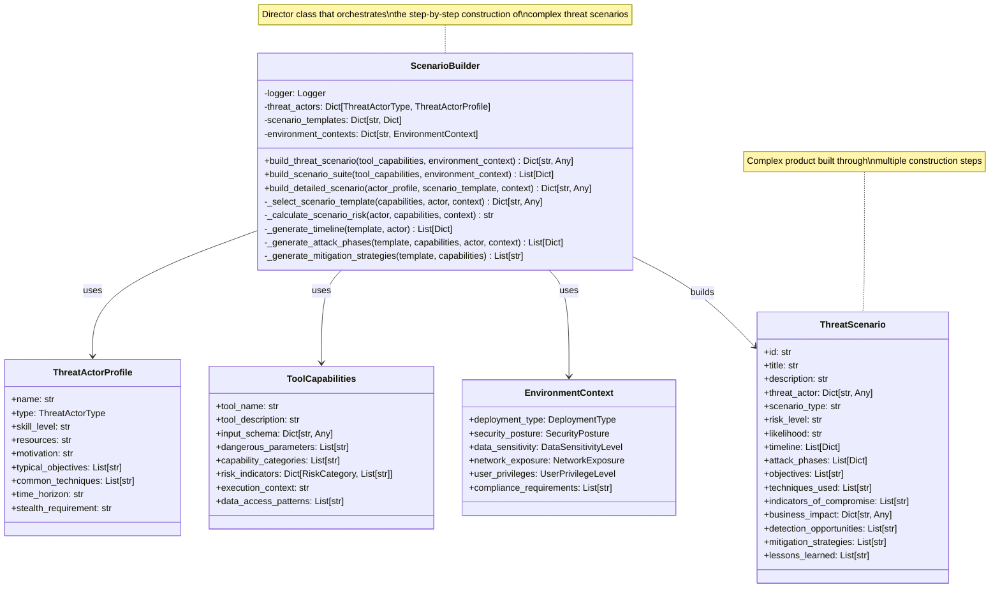
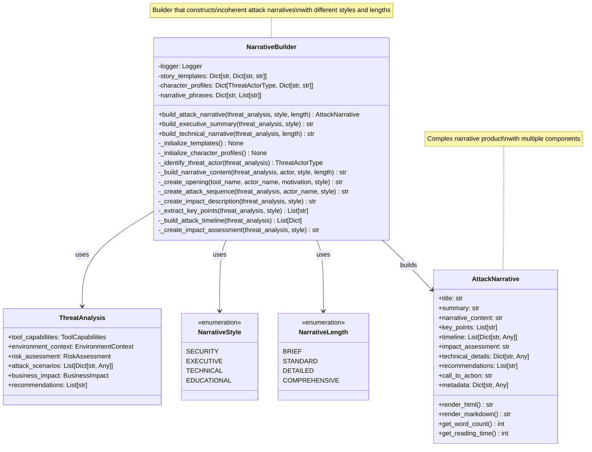
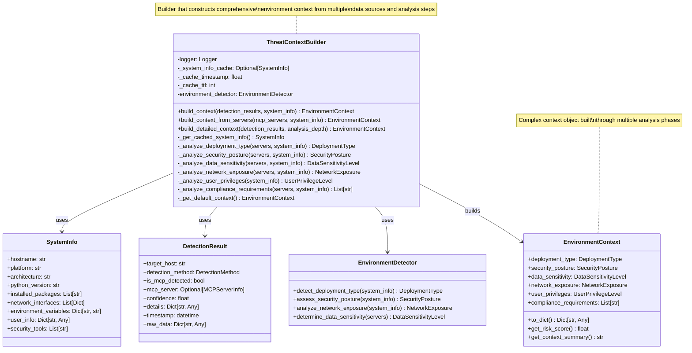
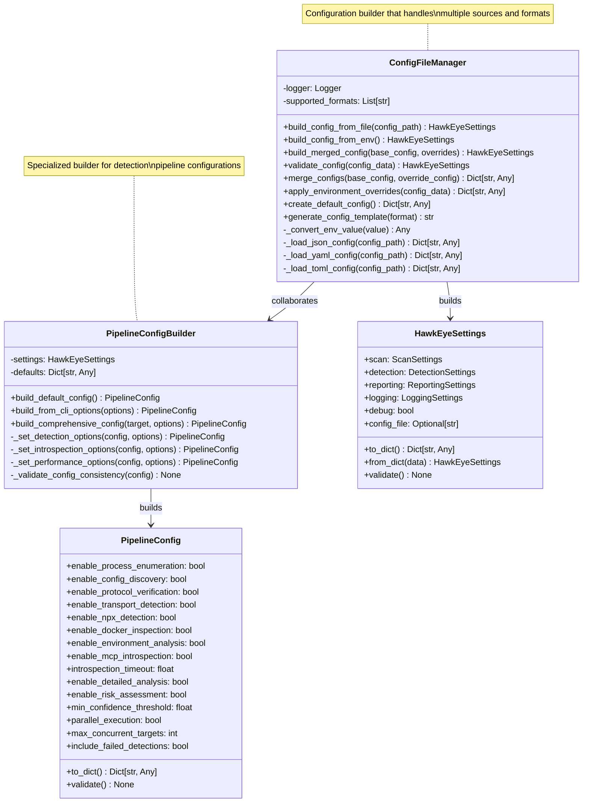

# Builder Pattern Documentation

## Overview

The Builder Pattern is implemented throughout the HawkEye Security Reconnaissance Tool to construct complex objects step by step, allowing for fine-grained control over the construction process and enabling the creation of different representations of the same object type. This pattern is particularly valuable for building complex threat scenarios, narratives, configurations, and analysis contexts.

## Pattern Definition

The Builder Pattern:
- Separates the construction of complex objects from their representation
- Allows step-by-step construction of objects with optional components
- Enables creation of different representations using the same construction process
- Provides fine-grained control over the construction process
- Supports fluent interfaces and method chaining for readable code

## Implementation in HawkEye

HawkEye implements the Builder Pattern across multiple domains to handle complex object construction:

1. **Threat Scenario Builder** - Constructs detailed attack scenarios with multiple phases and components
2. **Narrative Builder** - Builds coherent attack narratives with different styles and lengths
3. **Threat Context Builder** - Constructs comprehensive environment analysis contexts
4. **Configuration Builder** - Builds complex configuration objects with validation
5. **Pipeline Configuration Builder** - Constructs detection pipeline configurations
6. **Report Data Builder** - Assembles comprehensive report data structures

## UML Class Diagrams

### 1. Threat Scenario Builder Pattern



### 2. Narrative Builder Pattern



### 3. Threat Context Builder Pattern



### 4. Configuration Builder Pattern



## Implementation Examples

### 1. Threat Scenario Builder Implementation

**Core Builder Class:**
```python
class ScenarioBuilder:
    """Enhanced scenario builder for creating realistic abuse scenarios."""
    
    def __init__(self):
        """Initialize the scenario builder."""
        self.logger = logging.getLogger(__name__)
        self.threat_actors = self._initialize_threat_actors()
        self.scenario_templates = self._initialize_scenario_templates()
    
    def build_threat_scenario(self, 
                             tool_capabilities: ToolCapabilities,
                             environment_context: EnvironmentContext,
                             actor_type: Optional[ThreatActorType] = None) -> Dict[str, Any]:
        """Build a comprehensive threat scenario step by step."""
        
        # Step 1: Select appropriate threat actor
        if actor_type is None:
            actor_profile = self._select_threat_actor(tool_capabilities, environment_context)
        else:
            actor_profile = self.threat_actors[actor_type]
        
        # Step 2: Choose scenario template based on capabilities and context
        scenario_template = self._select_scenario_template(
            tool_capabilities, actor_profile, environment_context
        )
        
        if not scenario_template:
            return self._build_generic_scenario(tool_capabilities, actor_profile)
        
        # Step 3: Build detailed scenario components
        scenario = self._build_detailed_scenario(
            tool_capabilities, actor_profile, scenario_template, environment_context
        )
        
        return scenario
    
    def _build_detailed_scenario(self,
                               tool_capabilities: ToolCapabilities,
                               actor_profile: ThreatActorProfile,
                               scenario_template: Dict[str, Any],
                               environment_context: EnvironmentContext) -> Dict[str, Any]:
        """Build detailed scenario through multiple construction steps."""
        
        # Initialize scenario structure
        scenario = {
            'id': f"{actor_profile.type.value}_{scenario_template['name']}",
            'title': f"{actor_profile.name}: {scenario_template['title']}",
            'description': scenario_template['description'],
        }
        
        # Step 1: Build threat actor context
        scenario['threat_actor'] = self._build_threat_actor_context(actor_profile)
        
        # Step 2: Calculate risk and likelihood
        scenario['risk_level'] = self._calculate_scenario_risk(
            actor_profile, tool_capabilities, environment_context
        )
        scenario['likelihood'] = self._calculate_scenario_likelihood(
            actor_profile, environment_context
        )
        
        # Step 3: Generate timeline
        scenario['timeline'] = self._generate_timeline(scenario_template, actor_profile)
        
        # Step 4: Build attack phases
        scenario['attack_phases'] = self._generate_attack_phases(
            scenario_template, tool_capabilities, actor_profile, environment_context
        )
        
        # Step 5: Define objectives and techniques
        scenario['objectives'] = self._generate_objectives(actor_profile, tool_capabilities)
        scenario['techniques_used'] = self._map_techniques_to_capabilities(
            actor_profile, tool_capabilities
        )
        
        # Step 6: Build detection and mitigation components
        scenario['indicators_of_compromise'] = self._generate_iocs(
            scenario_template, tool_capabilities
        )
        scenario['detection_opportunities'] = self._identify_detection_opportunities(
            scenario_template, tool_capabilities
        )
        scenario['mitigation_strategies'] = self._generate_mitigation_strategies(
            scenario_template, tool_capabilities
        )
        
        # Step 7: Assess business impact
        scenario['business_impact'] = self._assess_business_impact(
            scenario_template, environment_context
        )
        
        # Step 8: Generate lessons learned
        scenario['lessons_learned'] = self._generate_lessons_learned(
            scenario_template, actor_profile
        )
        
        return scenario
    
    def _build_threat_actor_context(self, actor_profile: ThreatActorProfile) -> Dict[str, Any]:
        """Build comprehensive threat actor context."""
        return {
            'name': actor_profile.name,
            'type': actor_profile.type.value,
            'skill_level': actor_profile.skill_level,
            'motivation': actor_profile.motivation,
            'resources': actor_profile.resources,
            'typical_objectives': actor_profile.typical_objectives,
            'common_techniques': actor_profile.common_techniques,
            'time_horizon': actor_profile.time_horizon,
            'stealth_requirement': actor_profile.stealth_requirement
        }
```

**Building Attack Phases:**
```python
def _generate_attack_phases(self,
                          scenario_template: Dict[str, Any],
                          tool_capabilities: ToolCapabilities,
                          actor_profile: ThreatActorProfile,
                          environment_context: EnvironmentContext) -> List[Dict[str, Any]]:
    """Generate detailed attack phases step by step."""
    
    phases = []
    template_phases = scenario_template.get('phases', [])
    
    for phase_template in template_phases:
        phase = {
            'name': phase_template['name'],
            'description': phase_template['description'],
            'duration': self._estimate_phase_duration(phase_template, actor_profile),
            'techniques': [],
            'tools_used': [],
            'detection_difficulty': self._assess_detection_difficulty(
                phase_template, environment_context
            ),
            'success_indicators': [],
            'failure_modes': []
        }
        
        # Build techniques for this phase
        for technique_template in phase_template.get('techniques', []):
            if self._is_technique_applicable(technique_template, tool_capabilities):
                technique = self._build_technique_details(
                    technique_template, tool_capabilities, actor_profile
                )
                phase['techniques'].append(technique)
        
        # Map tools to phase
        phase['tools_used'] = self._map_tools_to_phase(
            phase_template, tool_capabilities
        )
        
        # Define success indicators
        phase['success_indicators'] = self._generate_success_indicators(
            phase_template, tool_capabilities
        )
        
        # Identify failure modes
        phase['failure_modes'] = self._identify_failure_modes(
            phase_template, environment_context
        )
        
        phases.append(phase)
    
    return phases
```

### 2. Narrative Builder Implementation

**Core Narrative Builder:**
```python
class NarrativeBuilder:
    """Builds coherent attack narratives from threat analysis data."""
    
    def __init__(self):
        """Initialize the narrative builder."""
        self.logger = logging.getLogger(__name__)
        self.story_templates = {}
        self.character_profiles = {}
        self.narrative_phrases = {}
        self._initialize_templates()
        self._initialize_character_profiles()
        self._initialize_phrases()
    
    def build_attack_narrative(self,
                             threat_analysis: ThreatAnalysis,
                             style: NarrativeStyle = NarrativeStyle.SECURITY,
                             length: NarrativeLength = NarrativeLength.STANDARD) -> AttackNarrative:
        """Build a complete attack narrative through multiple steps."""
        
        # Step 1: Identify primary threat actor
        threat_actor = self._identify_threat_actor(threat_analysis)
        
        # Step 2: Generate narrative title
        title = self._generate_narrative_title(threat_analysis, threat_actor)
        
        # Step 3: Create executive summary
        summary = self._create_executive_summary(threat_analysis, style)
        
        # Step 4: Build main narrative content
        narrative_content = self._build_narrative_content(
            threat_analysis, threat_actor, style, length
        )
        
        # Step 5: Extract key points
        key_points = self._extract_key_points(threat_analysis, style)
        
        # Step 6: Build attack timeline
        timeline = self._build_attack_timeline(threat_analysis)
        
        # Step 7: Create impact assessment
        impact_assessment = self._create_impact_assessment(threat_analysis, style)
        
        # Step 8: Extract technical details
        technical_details = self._extract_technical_details(threat_analysis)
        
        # Step 9: Generate recommendations
        recommendations = self._generate_recommendations(threat_analysis, style)
        
        # Step 10: Create call to action
        call_to_action = self._generate_call_to_action(threat_analysis, style)
        
        # Step 11: Build metadata
        metadata = self._build_narrative_metadata(threat_analysis, style, length)
        
        # Construct final narrative
        narrative = AttackNarrative(
            title=title,
            summary=summary,
            narrative_content=narrative_content,
            key_points=key_points,
            timeline=timeline,
            impact_assessment=impact_assessment,
            technical_details=technical_details,
            recommendations=recommendations,
            call_to_action=call_to_action,
            metadata=metadata
        )
        
        return narrative
    
    def _build_narrative_content(self,
                               threat_analysis: ThreatAnalysis,
                               threat_actor: ThreatActorType,
                               style: NarrativeStyle,
                               length: NarrativeLength) -> str:
        """Build main narrative content step by step."""
        
        # Get character profile for threat actor
        character = self.character_profiles.get(threat_actor, {})
        actor_name = character.get("name", "the attacker")
        actor_motivation = character.get("motivation", "malicious intent")
        
        tool_name = threat_analysis.tool_capabilities.tool_name
        
        # Step 1: Create opening
        opening = self._create_opening(tool_name, actor_name, actor_motivation, style)
        
        # Step 2: Build attack sequence
        attack_sequence = self._create_attack_sequence(
            threat_analysis, actor_name, style
        )
        
        # Step 3: Create impact description
        impact_description = self._create_impact_description(threat_analysis, style)
        
        # Step 4: Build content based on length
        if length == NarrativeLength.BRIEF:
            return f"{opening}\n\n{attack_sequence}"
        
        elif length == NarrativeLength.STANDARD:
            return f"{opening}\n\n{attack_sequence}\n\n{impact_description}"
        
        else:  # Detailed or Comprehensive
            # Step 5: Add detection evasion section
            detection_evasion = self._create_detection_evasion_section(
                threat_analysis, actor_name
            )
            
            # Step 6: Add business context
            business_context = self._create_business_context_section(
                threat_analysis, style
            )
            
            content = f"{opening}\n\n{attack_sequence}\n\n{impact_description}\n\n{detection_evasion}"
            
            if length == NarrativeLength.COMPREHENSIVE:
                content += f"\n\n{business_context}"
            
            return content
```

### 3. Threat Context Builder Implementation

**Context Builder with Step-by-Step Construction:**
```python
class ThreatContextBuilder:
    """Builds comprehensive environment context for AI threat analysis."""
    
    def __init__(self):
        """Initialize the threat context builder."""
        self.logger = logging.getLogger(__name__)
        self._system_info_cache = None
        self._cache_timestamp = 0
        self._cache_ttl = 300  # 5 minutes
        self.environment_detector = EnvironmentDetector()
    
    def build_context(self, 
                     detection_results: List[DetectionResult],
                     system_info: Optional[SystemInfo] = None) -> EnvironmentContext:
        """Build comprehensive environment context through multiple analysis steps."""
        
        try:
            self.logger.info(f"Building environment context from {len(detection_results)} detection results")
            
            # Step 1: Gather system information
            if system_info is None:
                system_info = self._get_cached_system_info()
            
            # Step 2: Extract MCP servers from detection results
            mcp_servers = []
            for result in detection_results:
                if result.is_mcp_detected and result.mcp_server:
                    mcp_servers.append(result.mcp_server)
            
            # Step 3: Analyze deployment type
            deployment_type = self._analyze_deployment_type(mcp_servers, system_info)
            
            # Step 4: Assess security posture
            security_posture = self._analyze_security_posture(mcp_servers, system_info)
            
            # Step 5: Determine data sensitivity
            data_sensitivity = self._analyze_data_sensitivity(mcp_servers, system_info)
            
            # Step 6: Analyze network exposure
            network_exposure = self._analyze_network_exposure(mcp_servers, system_info)
            
            # Step 7: Assess user privileges
            user_privileges = self._analyze_user_privileges(system_info)
            
            # Step 8: Identify compliance requirements
            compliance_requirements = self._analyze_compliance_requirements(
                mcp_servers, system_info
            )
            
            # Step 9: Construct final context
            context = EnvironmentContext(
                deployment_type=deployment_type,
                security_posture=security_posture,
                data_sensitivity=data_sensitivity,
                network_exposure=network_exposure,
                user_privileges=user_privileges,
                compliance_requirements=compliance_requirements
            )
            
            self.logger.info(f"Environment context built: {deployment_type.value}, {security_posture.value}")
            return context
            
        except Exception as e:
            self.logger.error(f"Failed to build environment context: {e}")
            return self._get_default_context()
    
    def build_detailed_context(self,
                              detection_results: List[DetectionResult],
                              analysis_depth: str = "standard") -> EnvironmentContext:
        """Build context with configurable analysis depth."""
        
        # Start with basic context
        context = self.build_context(detection_results)
        
        if analysis_depth in ["detailed", "comprehensive"]:
            # Add detailed analysis components
            context = self._enhance_with_detailed_analysis(context, detection_results)
        
        if analysis_depth == "comprehensive":
            # Add comprehensive analysis components
            context = self._enhance_with_comprehensive_analysis(context, detection_results)
        
        return context
```

### 4. Configuration Builder Implementation

**Fluent Configuration Builder:**
```python
class PipelineConfigBuilder:
    """Builder for creating pipeline configurations with fluent interface."""
    
    def __init__(self, settings: Optional[HawkEyeSettings] = None):
        """Initialize the pipeline configuration builder."""
        self.settings = settings or get_settings()
        self.config = PipelineConfig()
    
    def enable_all_detectors(self) -> 'PipelineConfigBuilder':
        """Enable all detection methods."""
        self.config.enable_process_enumeration = True
        self.config.enable_config_discovery = True
        self.config.enable_protocol_verification = True
        self.config.enable_transport_detection = True
        self.config.enable_npx_detection = True
        self.config.enable_docker_inspection = True
        self.config.enable_environment_analysis = True
        return self
    
    def enable_introspection(self, timeout: float = 180.0,
                           detailed_analysis: bool = True,
                           risk_assessment: bool = True) -> 'PipelineConfigBuilder':
        """Configure MCP introspection settings."""
        self.config.enable_mcp_introspection = True
        self.config.introspection_timeout = timeout
        self.config.enable_detailed_analysis = detailed_analysis
        self.config.enable_risk_assessment = risk_assessment
        return self
    
    def set_performance_options(self, 
                               parallel: bool = True,
                               max_concurrent: int = 10,
                               confidence_threshold: float = 0.3) -> 'PipelineConfigBuilder':
        """Configure performance and quality settings."""
        self.config.parallel_execution = parallel
        self.config.max_concurrent_targets = max_concurrent
        self.config.min_confidence_threshold = confidence_threshold
        return self
    
    def for_comprehensive_scan(self) -> 'PipelineConfigBuilder':
        """Configure for comprehensive scanning."""
        return (self
                .enable_all_detectors()
                .enable_introspection()
                .set_performance_options())
    
    def for_quick_scan(self) -> 'PipelineConfigBuilder':
        """Configure for quick scanning."""
        self.config.enable_process_enumeration = True
        self.config.enable_config_discovery = True
        self.config.enable_mcp_introspection = False
        self.config.parallel_execution = True
        self.config.max_concurrent_targets = 20
        return self
    
    def build(self) -> PipelineConfig:
        """Build and validate the final configuration."""
        self._validate_config_consistency()
        return self.config
    
    def _validate_config_consistency(self) -> None:
        """Validate configuration consistency."""
        if self.config.enable_mcp_introspection and self.config.introspection_timeout <= 0:
            raise ValueError("Introspection timeout must be positive when introspection is enabled")
        
        if self.config.max_concurrent_targets <= 0:
            raise ValueError("Max concurrent targets must be positive")
        
        if not (0.0 <= self.config.min_confidence_threshold <= 1.0):
            raise ValueError("Confidence threshold must be between 0.0 and 1.0")

# Usage examples:
def create_comprehensive_config() -> PipelineConfig:
    """Create comprehensive pipeline configuration."""
    return (PipelineConfigBuilder()
            .for_comprehensive_scan()
            .build())

def create_custom_config() -> PipelineConfig:
    """Create custom pipeline configuration."""
    return (PipelineConfigBuilder()
            .enable_all_detectors()
            .enable_introspection(timeout=300.0, detailed_analysis=True)
            .set_performance_options(parallel=True, max_concurrent=5)
            .build())
```

## Benefits of the Builder Pattern

### 1. **Step-by-Step Construction**
- Enables complex object construction through multiple phases
- Provides control over the construction process at each step
- Allows validation and error handling at each construction phase

### 2. **Flexible Object Creation**
- Supports different representations of the same object type
- Enables optional components and configurations
- Provides fluent interfaces for readable construction code

### 3. **Separation of Concerns**
- Isolates complex construction logic from object representation
- Enables reusable construction processes across different contexts
- Provides clear separation between director and builder responsibilities

### 4. **Configuration Management**
- Handles complex configuration scenarios with validation
- Supports configuration merging and overrides
- Enables environment-specific configuration building

### 5. **Code Readability**
- Provides expressive, self-documenting construction APIs
- Enables method chaining for fluent interfaces
- Makes complex object creation more intuitive and maintainable

## Advanced Builder Techniques

### 1. **Director Pattern Integration**
```python
class ThreatAnalysisDirector:
    """Director that orchestrates complex threat analysis construction."""
    
    def __init__(self, scenario_builder: ScenarioBuilder, 
                 narrative_builder: NarrativeBuilder,
                 context_builder: ThreatContextBuilder):
        self.scenario_builder = scenario_builder
        self.narrative_builder = narrative_builder
        self.context_builder = context_builder
    
    def build_comprehensive_analysis(self, 
                                   tool_capabilities: ToolCapabilities,
                                   detection_results: List[DetectionResult]) -> ThreatAnalysis:
        """Build comprehensive threat analysis using multiple builders."""
        
        # Step 1: Build environment context
        environment_context = self.context_builder.build_context(detection_results)
        
        # Step 2: Build threat scenarios
        scenarios = []
        for actor_type in ThreatActorType:
            scenario = self.scenario_builder.build_threat_scenario(
                tool_capabilities, environment_context, actor_type
            )
            scenarios.append(scenario)
        
        # Step 3: Build attack narrative
        threat_analysis_data = ThreatAnalysis(
            tool_capabilities=tool_capabilities,
            environment_context=environment_context,
            attack_scenarios=scenarios
        )
        
        narrative = self.narrative_builder.build_attack_narrative(
            threat_analysis_data, NarrativeStyle.SECURITY, NarrativeLength.COMPREHENSIVE
        )
        
        # Step 4: Assemble final analysis
        return ThreatAnalysis(
            tool_capabilities=tool_capabilities,
            environment_context=environment_context,
            attack_scenarios=scenarios,
            narrative=narrative,
            risk_assessment=self._assess_overall_risk(scenarios),
            recommendations=self._generate_comprehensive_recommendations(scenarios)
        )
```

### 2. **Cached Builder Pattern**
```python
class CachedScenarioBuilder(ScenarioBuilder):
    """Builder with intelligent caching for expensive operations."""
    
    def __init__(self):
        super().__init__()
        self._scenario_cache = {}
        self._cache_metrics = defaultdict(int)
    
    def build_threat_scenario(self, 
                             tool_capabilities: ToolCapabilities,
                             environment_context: EnvironmentContext,
                             actor_type: Optional[ThreatActorType] = None) -> Dict[str, Any]:
        """Build scenario with caching support."""
        
        # Generate cache key
        cache_key = self._generate_cache_key(tool_capabilities, environment_context, actor_type)
        
        if cache_key in self._scenario_cache:
            self._cache_metrics['hits'] += 1
            return self._scenario_cache[cache_key]
        
        # Build scenario if not cached
        scenario = super().build_threat_scenario(tool_capabilities, environment_context, actor_type)
        
        # Cache the result
        if self._should_cache_scenario(scenario):
            self._scenario_cache[cache_key] = scenario
        
        self._cache_metrics['misses'] += 1
        return scenario
```

### 3. **Validation-Aware Builder**
```python
class ValidatingConfigBuilder(PipelineConfigBuilder):
    """Configuration builder with comprehensive validation."""
    
    def __init__(self, settings: Optional[HawkEyeSettings] = None):
        super().__init__(settings)
        self.validation_errors = []
        self.validation_warnings = []
    
    def enable_introspection(self, timeout: float = 180.0,
                           detailed_analysis: bool = True,
                           risk_assessment: bool = True) -> 'ValidatingConfigBuilder':
        """Enable introspection with validation."""
        
        # Validate timeout
        if timeout <= 0:
            self.validation_errors.append("Introspection timeout must be positive")
        elif timeout > 3600:  # 1 hour
            self.validation_warnings.append("Introspection timeout is very high (>1 hour)")
        
        # Validate resource requirements
        if detailed_analysis and risk_assessment and timeout > 600:
            self.validation_warnings.append(
                "Comprehensive analysis may require significant resources"
            )
        
        return super().enable_introspection(timeout, detailed_analysis, risk_assessment)
    
    def build(self) -> PipelineConfig:
        """Build configuration with comprehensive validation."""
        
        # Check for validation errors
        if self.validation_errors:
            raise ConfigurationError(f"Configuration validation failed: {self.validation_errors}")
        
        # Log validation warnings
        if self.validation_warnings:
            self.logger.warning(f"Configuration warnings: {self.validation_warnings}")
        
        return super().build()
```

## Best Practices

### 1. **Clear Builder Interfaces**
```python
from abc import ABC, abstractmethod

class ThreatScenarioBuilder(ABC):
    """Abstract interface for threat scenario builders."""
    
    @abstractmethod
    def build_scenario(self, capabilities: ToolCapabilities, 
                      context: EnvironmentContext) -> Dict[str, Any]:
        """Build threat scenario from capabilities and context."""
        pass
    
    @abstractmethod
    def set_actor_type(self, actor_type: ThreatActorType) -> 'ThreatScenarioBuilder':
        """Set the threat actor type for scenario generation."""
        pass
    
    @abstractmethod
    def set_complexity_level(self, level: str) -> 'ThreatScenarioBuilder':
        """Set the complexity level for scenario generation."""
        pass
```

### 2. **Fluent Interface Design**
```python
class FluentReportBuilder:
    """Report builder with fluent interface design."""
    
    def __init__(self):
        self.report_data = ReportData()
        self.configuration = {}
    
    def with_title(self, title: str) -> 'FluentReportBuilder':
        """Set report title."""
        self.report_data.metadata.title = title
        return self
    
    def include_scan_results(self, results: List[ScanResult]) -> 'FluentReportBuilder':
        """Include scan results in report."""
        self.report_data.scan_results.extend(results)
        return self
    
    def include_threat_analysis(self, analysis: ThreatAnalysis) -> 'FluentReportBuilder':
        """Include threat analysis in report."""
        self.report_data.threat_analysis = analysis
        return self
    
    def with_format(self, format: ReportFormat) -> 'FluentReportBuilder':
        """Set report format."""
        self.report_data.metadata.format = format
        return self
    
    def for_executive_audience(self) -> 'FluentReportBuilder':
        """Configure report for executive audience."""
        self.configuration['audience'] = 'executive'
        self.configuration['detail_level'] = 'summary'
        self.configuration['include_technical_details'] = False
        return self
    
    def for_technical_audience(self) -> 'FluentReportBuilder':
        """Configure report for technical audience."""
        self.configuration['audience'] = 'technical'
        self.configuration['detail_level'] = 'comprehensive'
        self.configuration['include_technical_details'] = True
        return self
    
    def build(self) -> ReportData:
        """Build the final report data."""
        self._apply_configuration()
        self._validate_report_data()
        return self.report_data
```

### 3. **Error Handling in Builders**
```python
class RobustNarrativeBuilder(NarrativeBuilder):
    """Narrative builder with comprehensive error handling."""
    
    def build_attack_narrative(self,
                             threat_analysis: ThreatAnalysis,
                             style: NarrativeStyle = NarrativeStyle.SECURITY,
                             length: NarrativeLength = NarrativeLength.STANDARD) -> AttackNarrative:
        """Build narrative with error recovery."""
        
        try:
            return super().build_attack_narrative(threat_analysis, style, length)
        
        except Exception as e:
            self.logger.error(f"Narrative building failed: {e}")
            
            # Attempt to build minimal narrative
            try:
                return self._build_minimal_narrative(threat_analysis, style)
            except Exception as fallback_error:
                self.logger.error(f"Fallback narrative building failed: {fallback_error}")
                return self._build_default_narrative(threat_analysis)
    
    def _build_minimal_narrative(self, threat_analysis: ThreatAnalysis, 
                               style: NarrativeStyle) -> AttackNarrative:
        """Build minimal narrative with basic information."""
        return AttackNarrative(
            title=f"Threat Analysis: {threat_analysis.tool_capabilities.tool_name}",
            summary="Basic threat analysis available.",
            narrative_content="Detailed narrative generation encountered errors.",
            key_points=["Threat detected", "Further analysis recommended"],
            timeline=[],
            impact_assessment="Impact assessment unavailable",
            technical_details={},
            recommendations=["Review tool capabilities", "Implement monitoring"],
            call_to_action="Please review the technical details for more information.",
            metadata={'build_status': 'minimal', 'errors': ['narrative_generation_failed']}
        )
```

## Usage Guidelines

### When to Use Builder Pattern

1. **Complex Object Construction**: When objects require multiple steps or have many optional components
2. **Different Representations**: When you need to create different representations of the same object type
3. **Configuration Management**: When handling complex configuration scenarios with validation
4. **Step-by-Step Processes**: When construction involves multiple phases that can fail independently
5. **Fluent Interfaces**: When you want to provide readable, expressive construction APIs

### When to Consider Alternatives

1. **Simple Objects**: For objects with few properties, consider factory methods or constructors
2. **Immutable Objects**: Consider using dataclasses or named tuples for simple immutable objects
3. **Prototype Pattern**: When you need to clone and modify existing objects
4. **Abstract Factory**: When you need to create families of related objects

## Conclusion

The Builder Pattern implementation in HawkEye demonstrates its effectiveness for constructing complex objects through multiple steps. Key advantages include:

- **Flexible Construction**: Enables step-by-step building of complex threat scenarios, narratives, and configurations
- **Readable Code**: Provides fluent interfaces that make complex construction processes intuitive
- **Validation Integration**: Allows validation at each construction step, improving error handling
- **Reusable Components**: Enables reuse of construction logic across different contexts
- **Separation of Concerns**: Cleanly separates construction logic from object representation

The pattern's implementation across threat analysis, narrative generation, and configuration management showcases its versatility for handling complex construction scenarios in security analysis tools. 