# Command Pattern Documentation

## Overview

The Command Pattern is extensively implemented throughout the HawkEye CLI interface to encapsulate requests as objects, enabling parameterization of clients with different requests, queuing of requests, and support for undo operations. This pattern provides a clean separation between the code that invokes an operation and the code that performs the operation.

## Pattern Definition

The Command Pattern:
- Encapsulates a request as an object with all information needed to perform the action
- Decouples the object that invokes the operation from the object that performs it
- Allows parameterization of objects with different requests
- Supports queuing, logging, and undo operations
- Enables macro recording and batch processing

## Implementation in HawkEye

HawkEye implements the Command Pattern primarily through its CLI architecture built on the Click framework. The implementation includes:

1. **CLI Command Hierarchy** - Hierarchical command structure with groups and subcommands
2. **Context Management** - Shared state management across command invocations
3. **Parameter Processing** - Command-specific parameter handling and validation
4. **Error Handling** - Consistent error handling across all commands
5. **Command Composition** - Support for command chaining and pipeline operations

## UML Class Diagrams

### 1. CLI Command Hierarchy

```mermaid
classDiagram
    class HawkEyeCLI {
        <<click.Group>>
        +cli(ctx, verbose, quiet, log_file, config_file)
        +info(ctx)
        +quick_scan(ctx, target, ports, threads, timeout, output, format)
        +show_banner()
        +main()
    }
    
    class HawkEyeGroup {
        <<click.Group>>
        +format_help(ctx, formatter)
        +invoke(ctx)
    }
    
    class HawkEyeContext {
        +settings: Settings
        +logger: Logger
        +verbose: bool
        +quiet: bool
        +output_file: str
        +setup_logging(verbose, quiet, log_file)
    }
    
    class ScanCommand {
        <<click.Command>>
        +scan(ctx, target, ports, tcp, udp, threads, timeout, output, format)
        +validate_target(target) None
        +parse_ports(ports_str) List[int]
    }
    
    class DetectCommand {
        <<click.Group>>
        +detect()
        +mcp(ctx, target, enable_introspection, timeout, output, format)
        +local(ctx, process_names, config_paths, output, format)
    }
    
    class AnalyzeThreatCommand {
        <<click.Command>>
        +analyze_threats(ctx, input_file, output, model, provider, temperature)
        +_validate_input_file(file_path) bool
        +_select_ai_provider(provider_name) AIProvider
    }
    
    class ReportCommand {
        <<click.Group>>
        +report()
        +generate(ctx, input, output, format, title, author, organization)
        +summary(ctx, input, output, include_charts, include_recommendations)
    }
    
    class ConfigCommand {
        <<click.Group>>
        +config()
        +show(ctx, section)
        +set(ctx, key, value)
        +validate(ctx, config_file)
    }

    HawkEyeCLI --> HawkEyeGroup : uses
    HawkEyeCLI --> HawkEyeContext : manages
    HawkEyeCLI --> ScanCommand : contains
    HawkEyeCLI --> DetectCommand : contains
    HawkEyeCLI --> AnalyzeThreatCommand : contains
    HawkEyeCLI --> ReportCommand : contains
    HawkEyeCLI --> ConfigCommand : contains
```



### 2. Command Processing Pattern


### 3. Parameter Processing and Validation


### 4. Error Handling Command Pattern


## Implementation Examples

### 1. CLI Command Structure

**Main CLI Group:**
```python
@click.group(cls=HawkEyeGroup, context_settings={"help_option_names": ["-h", "--help"]})
@click.option("--verbose", "-v", is_flag=True, help="Enable verbose output")
@click.option("--quiet", "-q", is_flag=True, help="Suppress all output except errors")
@click.option("--log-file", type=click.Path(), help="Write logs to specified file")
@click.option("--config-file", type=click.Path(exists=True), help="Load configuration from file")
@click.version_option(version=__version__, prog_name="HawkEye")
@click.pass_context
def cli(ctx, verbose: bool, quiet: bool, log_file: Optional[str], config_file: Optional[str]):
    """
    🦅 HawkEye - MCP Security Reconnaissance Tool
    
    Identify and assess Model Context Protocol (MCP) server deployments
    within network infrastructure for security vulnerabilities.
    """
    # Initialize context object
    ctx.ensure_object(HawkEyeContext)
    
    # Setup logging and configuration
    ctx.obj.setup_logging(verbose=verbose, quiet=quiet, log_file=log_file)
    
    # Load configuration if specified
    if config_file:
        settings = load_config_from_file(config_file)
        ctx.obj.settings = settings
```

**Command Group Implementation:**
```python
@click.group()
def detect():
    """MCP-specific detection and analysis operations."""
    pass

@detect.command()
@click.option("--target", "-t", required=True, help="Target specification")
@click.option("--enable-introspection/--disable-introspection", default=True)
@click.option("--timeout", type=int, default=180, help="Timeout in seconds")
@click.option("--output", "-o", type=click.Path(), help="Output file path")
@click.option("--format", "-f", type=click.Choice(["json", "csv", "xml", "html"]), default="json")
@click.pass_context
def mcp(ctx, target: str, enable_introspection: bool, timeout: int, 
        output: Optional[str], format: str):
    """Detect MCP servers on specified targets."""
    
    logger = ctx.obj.logger
    settings = ctx.obj.settings
    
    # Command implementation
    try:
        # Create and configure detection pipeline
        pipeline_config = PipelineConfig(
            enable_mcp_introspection=enable_introspection,
            introspection_timeout=timeout
        )
        
        pipeline = create_detection_pipeline(pipeline_config, settings)
        
        # Execute detection
        with console.status("Detecting MCP servers..."):
            results = pipeline.execute_pipeline(target)
        
        # Process and output results
        if output:
            save_results(results, output, format)
        else:
            display_results(results)
            
    except Exception as e:
        logger.error(f"Detection failed: {e}")
        raise click.ClickException(f"Detection failed: {e}")
```

### 2. Custom Command Group with Error Handling

**Enhanced Command Group:**
```python
class HawkEyeGroup(click.Group):
    """Custom Click group with enhanced error handling and help formatting."""
    
    def format_help(self, ctx, formatter):
        """Format help with HawkEye branding."""
        formatter.write_heading("🦅 HawkEye - MCP Security Reconnaissance Tool")
        formatter.write_paragraph()
        formatter.write("Hidden Application Weaknesses & Key Entry-point Yielding Evaluator")
        formatter.write_paragraph()
        super().format_help(ctx, formatter)
    
    def invoke(self, ctx):
        """Invoke command with comprehensive error handling."""
        try:
            return super().invoke(ctx)
        except HawkEyeError as e:
            console.print(f"[red]Error:[/red] {e.message}")
            if e.details and ctx.obj.verbose:
                console.print(f"[yellow]Details:[/yellow] {e.details}")
            sys.exit(1)
        except Exception as e:
            if ctx.obj.verbose:
                console.print_exception()
            else:
                console.print(f"[red]Unexpected error:[/red] {e}")
            sys.exit(1)
```

### 3. Parameter Validation and Processing

**Target Validation Command:**
```python
def validate_target(target: str) -> None:
    """Comprehensive target validation."""
    try:
        # Try parsing as IP address
        ipaddress.ip_address(target)
        return
    except ValueError:
        pass
    
    try:
        # Try parsing as CIDR network
        ipaddress.ip_network(target, strict=False)
        return
    except ValueError:
        pass
    
    # Check if it's a valid hostname
    if target and all(c.isalnum() or c in '.-_' for c in target):
        return
    
    raise click.BadParameter(f"Invalid target specification: {target}")

def parse_ports(ports_str: str) -> List[int]:
    """Parse port specification with validation."""
    if not ports_str:
        return []
    
    port_list = []
    for part in ports_str.split(','):
        part = part.strip()
        if '-' in part:
            # Handle port ranges
            try:
                start, end = part.split('-', 1)
                start_port = int(start.strip())
                end_port = int(end.strip())
                
                if start_port < 1 or end_port > 65535 or start_port > end_port:
                    raise ValueError("Invalid port range")
                    
                port_list.extend(range(start_port, end_port + 1))
            except ValueError:
                raise click.BadParameter(f"Invalid port range: {part}")
        else:
            # Handle single ports
            try:
                port = int(part)
                if port < 1 or port > 65535:
                    raise ValueError("Port out of range")
                port_list.append(port)
            except ValueError:
                raise click.BadParameter(f"Invalid port: {part}")
    
    return sorted(list(set(port_list)))

# Usage in command definition
@click.command()
@click.option(
    "--target", "-t",
    required=True,
    callback=lambda ctx, param, value: validate_target(value) or value,
    help="Target IP address, CIDR range, or hostname"
)
@click.option(
    "--ports", "-p",
    default="auto",
    help="Port range or comma-separated ports"
)
def scan(ctx, target: str, ports: str):
    """Network scanning command with validation."""
    
    # Process parameters
    if ports == "auto":
        port_list = ctx.obj.settings.scan.default_ports
    else:
        port_list = parse_ports(ports)
    
    # Execute scan command logic
    # ...
```

### 4. Context Management Pattern

**Command Context Implementation:**
```python
class HawkEyeContext:
    """Context object for sharing state between CLI commands."""
    
    def __init__(self):
        self.settings = get_settings()
        self.logger = None
        self.verbose = False
        self.quiet = False
        self.output_file = None
        
    def setup_logging(self, verbose: bool = False, quiet: bool = False, 
                     log_file: Optional[str] = None):
        """Setup logging configuration based on CLI options."""
        self.verbose = verbose
        self.quiet = quiet
        
        # Override settings based on CLI options
        if verbose:
            self.settings.logging.log_level = "DEBUG"
            self.settings.logging.console_log_level = "DEBUG"
        elif quiet:
            self.settings.logging.console_log_level = "ERROR"
        
        if log_file:
            self.settings.logging.log_file = Path(log_file)
        
        self.logger = configure_logging()
    
    def get_output_formatter(self, format_type: str):
        """Get appropriate output formatter for the specified format."""
        formatters = {
            "json": JSONFormatter(),
            "csv": CSVFormatter(),
            "html": HTMLFormatter(),
            "xml": XMLFormatter()
        }
        return formatters.get(format_type, JSONFormatter())
```

### 5. Command Registration and Execution

**Command Registration:**
```python
# Main CLI setup with command registration
cli.add_command(scan)
cli.add_command(detect)
cli.add_command(analyze_threats)
cli.add_command(report)
cli.add_command(config)

# Dynamic command loading example
def load_plugin_commands(cli_group):
    """Dynamically load plugin commands."""
    plugin_dir = Path("plugins/commands")
    
    if plugin_dir.exists():
        for plugin_file in plugin_dir.glob("*.py"):
            spec = importlib.util.spec_from_file_location(
                plugin_file.stem, plugin_file
            )
            module = importlib.util.module_from_spec(spec)
            spec.loader.exec_module(module)
            
            # Register commands from plugin
            if hasattr(module, 'plugin_commands'):
                for cmd_name, cmd_func in module.plugin_commands.items():
                    cli_group.add_command(cmd_func, name=cmd_name)
```

## Benefits of the Command Pattern

### 1. **Request Encapsulation**
- Commands encapsulate all information needed to perform an action
- Parameters, validation logic, and execution logic are bundled together
- Commands can be stored, queued, and executed later

### 2. **Decoupling**
- Separates the object that invokes the operation from the object that performs it
- CLI interface is decoupled from business logic implementation
- Enables flexible command composition and chaining

### 3. **Extensibility**
- New commands can be added without modifying existing code
- Plugin architecture supports third-party command extensions
- Command groups provide logical organization

### 4. **Undo/Redo Support**
- Commands can store state needed for undo operations
- Command history enables redo functionality
- Batch operations can be reversed as a unit

### 5. **Macro Recording**
- Command sequences can be recorded and replayed
- Complex workflows can be automated
- Configuration-driven command execution

## Advanced Features

### 1. **Command Chaining and Pipelines**
```python
@cli.command()
@click.option("--input-from-scan", help="Use scan results as input")
@click.pass_context
def detect_from_scan(ctx, input_from_scan: str):
    """Detect MCP services from previous scan results."""
    
    # Load scan results
    scan_data = load_scan_results(input_from_scan)
    
    # Extract open ports
    open_ports = [r for r in scan_data if r.state == "open"]
    
    # Execute detection on open ports
    detection_pipeline = create_detection_pipeline()
    
    for port_result in open_ports:
        target = f"{port_result.host}:{port_result.port}"
        detection_results = detection_pipeline.execute_pipeline(target)
        # Process results...
```

### 2. **Batch Command Processing**
```python
@cli.command()
@click.option("--command-file", type=click.Path(exists=True), 
              help="File containing batch commands")
@click.pass_context
def batch(ctx, command_file: str):
    """Execute commands from batch file."""
    
    with open(command_file, 'r') as f:
        commands = [line.strip() for line in f if line.strip() and not line.startswith('#')]
    
    for command_line in commands:
        try:
            # Parse and execute command
            args = shlex.split(command_line)
            ctx.invoke(cli, args)
        except Exception as e:
            console.print(f"[red]Batch command failed:[/red] {command_line}")
            console.print(f"[red]Error:[/red] {e}")
            if not ctx.obj.settings.batch_continue_on_error:
                break
```

### 3. **Command Configuration and Profiles**
```python
@cli.command()
@click.option("--profile", help="Configuration profile to use")
@click.option("--save-profile", help="Save current options as profile")
@click.pass_context
def profile_scan(ctx, profile: str, save_profile: str):
    """Execute scan with predefined profile."""
    
    if profile:
        # Load profile configuration
        profile_config = load_profile(profile)
        
        # Execute scan with profile settings
        ctx.invoke(scan, **profile_config)
    
    if save_profile:
        # Save current configuration as profile
        current_config = extract_current_config(ctx)
        save_profile_config(save_profile, current_config)
```

## Best Practices

### 1. **Command Design Principles**
```python
class WellDesignedCommand:
    """Example of well-designed command following best practices."""
    
    def __init__(self, name: str, description: str):
        self.name = name
        self.description = description
        self.parameters = {}
        self.validators = []
        self.preprocessors = []
        self.postprocessors = []
    
    def add_parameter(self, name: str, param_type: click.ParamType, 
                     required: bool = False, default=None, help_text: str = ""):
        """Add parameter with full specification."""
        self.parameters[name] = {
            'type': param_type,
            'required': required,
            'default': default,
            'help': help_text
        }
    
    def add_validator(self, validator: Callable):
        """Add parameter validator."""
        self.validators.append(validator)
    
    def execute(self, **kwargs):
        """Execute command with full lifecycle."""
        try:
            # Pre-processing
            for preprocessor in self.preprocessors:
                kwargs = preprocessor(kwargs)
            
            # Validation
            for validator in self.validators:
                validator(kwargs)
            
            # Main execution
            result = self._execute_impl(**kwargs)
            
            # Post-processing
            for postprocessor in self.postprocessors:
                result = postprocessor(result)
            
            return result
            
        except Exception as e:
            return self._handle_error(e, kwargs)
    
    def _execute_impl(self, **kwargs):
        """Actual command implementation."""
        raise NotImplementedError
    
    def _handle_error(self, error: Exception, context: Dict):
        """Standard error handling."""
        return CommandResult(
            success=False,
            error=str(error),
            context=context
        )
```

### 2. **Parameter Validation Strategy**
```python
def create_validation_chain(*validators):
    """Create a chain of validators for comprehensive parameter checking."""
    
    def validate(value):
        for validator in validators:
            if not validator(value):
                return False
        return True
    
    return validate

# Usage example
target_validator = create_validation_chain(
    lambda x: x is not None,
    lambda x: isinstance(x, str),
    lambda x: len(x) > 0,
    validate_target  # Custom target validation
)

@click.option("--target", callback=lambda ctx, param, value: target_validator(value) or value)
def command_with_validation(target):
    pass
```

### 3. **Error Recovery Mechanisms**
```python
class CommandErrorRecovery:
    """Implement error recovery strategies for commands."""
    
    def __init__(self):
        self.recovery_strategies = {
            ValidationError: self._handle_validation_error,
            NetworkError: self._handle_network_error,
            FileNotFoundError: self._handle_file_error,
        }
    
    def recover_from_error(self, error: Exception, context: Dict) -> Optional[Dict]:
        """Attempt to recover from command errors."""
        
        error_type = type(error)
        if error_type in self.recovery_strategies:
            return self.recovery_strategies[error_type](error, context)
        
        return None
    
    def _handle_validation_error(self, error: ValidationError, context: Dict):
        """Provide suggested corrections for validation errors."""
        suggestions = {
            'suggested_corrections': [],
            'retry_with_defaults': True,
            'alternative_parameters': {}
        }
        
        # Analyze error and provide specific suggestions
        if 'target' in str(error):
            suggestions['suggested_corrections'].append(
                "Check target format: IP, CIDR, or hostname"
            )
        
        return suggestions
```

## Usage Guidelines

### When to Use Command Pattern

1. **Complex CLI Applications**: When building sophisticated command-line tools with multiple operations
2. **Parameter-Heavy Operations**: When commands have complex parameter validation and processing needs
3. **Batch Processing**: When commands need to be queued, scheduled, or executed in batches
4. **Plugin Architecture**: When the application needs to support third-party command extensions
5. **Undo/Redo Requirements**: When operations need to be reversible

### When to Consider Alternatives

1. **Simple Scripts**: For straightforward scripts with minimal user interaction
2. **Library APIs**: When building programmatic APIs rather than user interfaces
3. **Real-time Systems**: When command overhead might impact performance
4. **Embedded Systems**: When memory constraints make command objects impractical

## Conclusion

The Command Pattern implementation in HawkEye's CLI provides a robust, extensible, and user-friendly interface for complex security operations. Key advantages include:

- **Modular Command Organization**: Clear separation of concerns with dedicated command modules
- **Comprehensive Parameter Handling**: Robust validation, transformation, and error recovery
- **Context Management**: Shared state management across command invocations
- **Error Handling**: Consistent, informative error reporting with recovery suggestions
- **Extensibility**: Plugin architecture supporting third-party command extensions

The pattern's success in HawkEye demonstrates its value for building professional-grade CLI applications that need to handle complex operations while maintaining usability and reliability. 