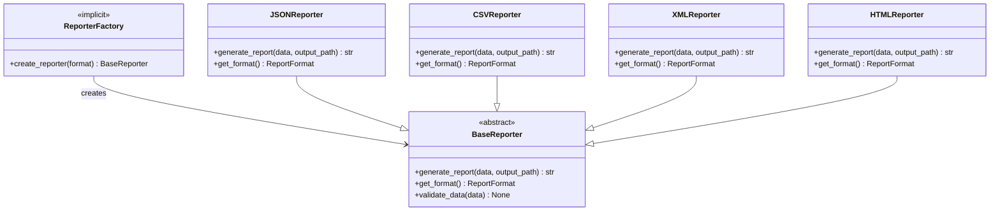

# Factory Pattern in HawkEye

## Overview

The Factory Pattern is extensively used throughout the HawkEye security reconnaissance tool to create objects dynamically based on configuration, runtime conditions, or user preferences. This pattern provides a clean separation between object creation logic and business logic, enabling flexible and extensible architecture.

## Pattern Implementation Analysis

HawkEye implements three primary factory patterns:

1. **Transport Factory Pattern** - Creates MCP transport handlers
2. **Pipeline Factory Pattern** - Creates detection pipeline instances  
3. **Reporter Factory Pattern** - Creates report generators (implicit factory)

## 1. Transport Factory Pattern

### Architecture

The `TransportFactory` class in `src/hawkeye/detection/mcp_introspection/transport/factory.py` implements a registry-based factory pattern that creates appropriate transport handlers for MCP (Model Context Protocol) communication.


### Implementation Details

#### Registry-Based Factory

```python
class TransportFactory:
    # Registry of available transport handlers
    _handlers: Dict[TransportType, Type[BaseTransportHandler]] = {
        TransportType.STDIO: StdioTransportHandler,
        TransportType.SSE: SSETransportHandler,
        TransportType.HTTP: StreamableHTTPTransportHandler,
    }
```

**Benefits:**
- **Extensibility**: New transport types can be registered without modifying existing code
- **Type Safety**: Enum-based transport type ensures only valid types are supported
- **Centralized Registration**: All transport handlers are registered in one location

#### Dynamic Creation Methods

**1. Explicit Type Creation**
```python
def create_handler(self, transport_type: Union[str, TransportType], **kwargs) -> BaseTransportHandler:
    # Convert string to enum if needed
    if isinstance(transport_type, str):
        transport_type = TransportType(transport_type.lower())
    
    handler_class = self._handlers[transport_type]
    return handler_class(**handler_kwargs)
```

**2. Auto-Detection Creation**
```python
def create_from_config(self, config: Dict[str, Any]) -> BaseTransportHandler:
    # Auto-detect transport type from configuration
    transport_type = self.auto_detect_transport(config)
    return self.create_handler(transport_type, **config)
```

#### Auto-Detection Algorithm

The factory implements intelligent transport type detection:

```python
def auto_detect_transport(self, config: Dict[str, Any]) -> TransportType:
    # SSE detection
    if 'url' in config and '/sse' in config['url']:
        return TransportType.SSE
    
    # HTTP detection  
    if 'base_url' in config or 'url' in config:
        return TransportType.HTTP
    
    # STDIO detection (default)
    if 'command' in config or 'args' in config:
        return TransportType.STDIO
```

### Configuration-Based Creation

The factory supports various configuration formats:

**STDIO Configuration:**
```python
{
    "command": "node",
    "args": ["server.js"],
    "env": {"NODE_ENV": "production"}
}
```

**SSE Configuration:**
```python
{
    "url": "https://api.example.com/mcp/sse",
    "headers": {"Authorization": "Bearer token"}
}
```

**HTTP Configuration:**
```python
{
    "base_url": "https://api.example.com/mcp",
    "auth": {"bearer_token": "token"}
}
```

## 2. Pipeline Factory Pattern

### Architecture

The `create_detection_pipeline` function in `src/hawkeye/detection/pipeline.py` implements a simple factory function pattern.


### Implementation

```python
def create_detection_pipeline(config: Optional[PipelineConfig] = None, settings=None) -> DetectionPipeline:
    """
    Factory function to create a detection pipeline instance.
    
    Args:
        config: Pipeline configuration
        settings: Application settings
        
    Returns:
        DetectionPipeline instance
    """
    return DetectionPipeline(config, settings)
```

**Benefits:**
- **Simplicity**: Straightforward function-based factory
- **Flexibility**: Accepts optional configuration and settings
- **Consistency**: Provides standard way to create pipeline instances

## 3. Reporter Factory Pattern (Implicit)

### Architecture

While not implemented as a formal factory class, the reporter creation pattern in `src/hawkeye/cli/report_commands.py` demonstrates factory-like behavior through conditional instantiation.



### Current Implementation

```python
# In CLI command handler
if format == "json":
    reporter = JSONReporter()
elif format == "csv":
    reporter = CSVReporter()
elif format == "xml":
    reporter = XMLReporter()
elif format == "html":
    reporter = HTMLReporter()
```

### Recommended Factory Implementation

To improve the reporter creation pattern, consider implementing a formal factory:

```python
class ReporterFactory:
    """Factory for creating report generators based on format."""
    
    _reporters = {
        ReportFormat.JSON: JSONReporter,
        ReportFormat.CSV: CSVReporter,
        ReportFormat.XML: XMLReporter,
        ReportFormat.HTML: HTMLReporter,
        ReportFormat.MARKDOWN: MarkdownReporter,  # Future extension
    }
    
    @classmethod
    def create_reporter(cls, format: Union[str, ReportFormat], **kwargs) -> BaseReporter:
        """Create reporter instance for specified format."""
        if isinstance(format, str):
            format = ReportFormat(format.lower())
        
        if format not in cls._reporters:
            raise ValueError(f"Unsupported report format: {format}")
        
        reporter_class = cls._reporters[format]
        return reporter_class(**kwargs)
```

## 4. Template Factory Pattern

### Architecture

The `TemplateEngine` in `src/hawkeye/reporting/templates/base.py` implements a factory pattern for template creation and management.


## Factory Pattern Benefits in HawkEye

### 1. **Flexibility and Extensibility**
- **New Transport Types**: Easy to add new MCP transport mechanisms
- **Additional Report Formats**: Simple to support new output formats
- **Custom Templates**: Dynamic template loading and selection

### 2. **Configuration-Driven Architecture**
- **Runtime Decisions**: Transport type determined from configuration
- **User Preferences**: Report format chosen by user input
- **Environment Adaptation**: Factory selects appropriate implementations

### 3. **Testability and Mocking**
- **Dependency Injection**: Factories can inject test implementations
- **Isolated Testing**: Each factory can be tested independently
- **Mock Objects**: Easy to substitute mock implementations

### 4. **Code Organization**
- **Separation of Concerns**: Object creation separated from business logic
- **Centralized Creation**: All creation logic in one place
- **Consistent Interfaces**: All created objects implement common interfaces

## Implementation Patterns

### 1. **Registry-Based Factory** (Transport Factory)
```python
class RegistryFactory:
    _registry = {}
    
    @classmethod
    def register(cls, key, implementation):
        cls._registry[key] = implementation
    
    @classmethod
    def create(cls, key, **kwargs):
        return cls._registry[key](**kwargs)
```

**Advantages:**
- Dynamic registration of implementations
- Type-safe creation through registry validation
- Easy extension without code modification

### 2. **Function-Based Factory** (Pipeline Factory)  
```python
def create_instance(config=None, **kwargs):
    return InstanceClass(config, **kwargs)
```

**Advantages:**
- Simple and straightforward
- Good for single-product factories
- Minimal overhead

### 3. **Conditional Factory** (Reporter Pattern)
```python
def create_by_type(type_key):
    if type_key == "type1":
        return Type1Implementation()
    elif type_key == "type2":
        return Type2Implementation()
```

**Advantages:**
- Clear and explicit
- Easy to understand
- Good for small, stable sets of types

## Usage Examples

### Transport Factory Usage

```python
# Create factory instance
factory = TransportFactory()

# Create specific transport type
stdio_handler = factory.create_handler(TransportType.STDIO, 
                                     command="node", 
                                     args=["server.js"])

# Auto-detect and create from config
config = {"url": "https://api.example.com/mcp/sse"}
handler = factory.create_from_config(config)

# Use convenience function
handler = create_transport_handler("http", base_url="https://api.example.com")
```

### Pipeline Factory Usage

```python
# Create with default configuration
pipeline = create_detection_pipeline()

# Create with custom configuration
config = PipelineConfig(enabled_detectors=["process", "config"])
pipeline = create_detection_pipeline(config, settings)
```

### Reporter Factory Usage (Recommended)

```python
# Current usage
reporter = ReporterFactory.create_reporter("json")
report_content = reporter.generate_report(data, output_path)

# With configuration
reporter = ReporterFactory.create_reporter(
    ReportFormat.HTML,
    template_path="custom_template.html"
)
```

## Testing Strategies

### 1. **Factory Testing**
```python
def test_transport_factory_creation():
    factory = TransportFactory()
    handler = factory.create_handler(TransportType.STDIO)
    assert isinstance(handler, StdioTransportHandler)

def test_factory_auto_detection():
    factory = TransportFactory()
    config = {"command": "node", "args": ["server.js"]}
    transport_type = factory.auto_detect_transport(config)
    assert transport_type == TransportType.STDIO
```

### 2. **Mock Factory Testing**
```python
class MockTransportFactory(TransportFactory):
    def create_handler(self, transport_type, **kwargs):
        return MockTransportHandler()

def test_with_mock_factory():
    factory = MockTransportFactory()
    handler = factory.create_handler(TransportType.STDIO)
    assert isinstance(handler, MockTransportHandler)
```

## Best Practices

### 1. **Design Principles**
- **Single Responsibility**: Each factory creates one family of objects
- **Open/Closed Principle**: Easy to extend with new implementations
- **Dependency Inversion**: Depend on abstractions, not concretions

### 2. **Error Handling**
```python
def create_handler(self, transport_type, **kwargs):
    try:
        if transport_type not in self._handlers:
            raise TransportError(f"Unsupported transport: {transport_type}")
        
        handler_class = self._handlers[transport_type]
        return handler_class(**kwargs)
    except Exception as e:
        self.logger.error(f"Failed to create handler: {e}")
        raise
```

### 3. **Configuration Validation**
```python
def validate_config(self, config: Dict[str, Any]) -> bool:
    """Validate configuration before object creation."""
    required_fields = self._get_required_fields(config)
    return all(field in config for field in required_fields)
```

### 4. **Logging and Monitoring**
```python
def create_handler(self, transport_type, **kwargs):
    self.logger.debug(f"Creating {transport_type} handler")
    start_time = time.time()
    
    handler = self._create_handler_internal(transport_type, **kwargs)
    
    creation_time = time.time() - start_time
    self.logger.info(f"Created {transport_type} handler in {creation_time:.2f}s")
    
    return handler
```

## Performance Considerations

### 1. **Object Caching**
```python
class CachedTransportFactory(TransportFactory):
    def __init__(self):
        super().__init__()
        self._cache = {}
    
    def create_handler(self, transport_type, **kwargs):
        cache_key = (transport_type, frozenset(kwargs.items()))
        if cache_key not in self._cache:
            self._cache[cache_key] = super().create_handler(transport_type, **kwargs)
        return self._cache[cache_key]
```

### 2. **Lazy Loading**
```python
class LazyTransportFactory(TransportFactory):
    def __init__(self):
        super().__init__()
        self._initialized = False
    
    def _ensure_initialized(self):
        if not self._initialized:
            self._load_handlers()
            self._initialized = True
    
    def create_handler(self, transport_type, **kwargs):
        self._ensure_initialized()
        return super().create_handler(transport_type, **kwargs)
```

## Conclusion

The Factory Pattern implementation in HawkEye demonstrates several factory variants:

1. **Registry-Based Factory** (Transport Factory) - Most sophisticated, suitable for extensible systems
2. **Function-Based Factory** (Pipeline Factory) - Simple and effective for straightforward creation
3. **Conditional Factory** (Reporter Pattern) - Clear but less extensible approach

The transport factory provides the best example of factory pattern implementation with features like auto-detection, configuration validation, and registry-based extensibility. The pattern enables HawkEye to support multiple transport protocols, report formats, and pipeline configurations while maintaining clean, testable, and extensible code architecture.

**Recommendations for Future Development:**
1. Implement formal ReporterFactory class to replace conditional creation
2. Add caching mechanisms for frequently created objects
3. Implement factory registries for dynamic plugin loading
4. Add comprehensive factory testing and validation frameworks 