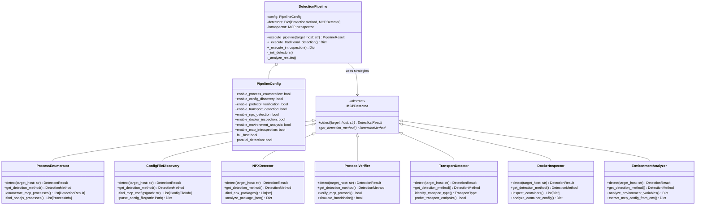
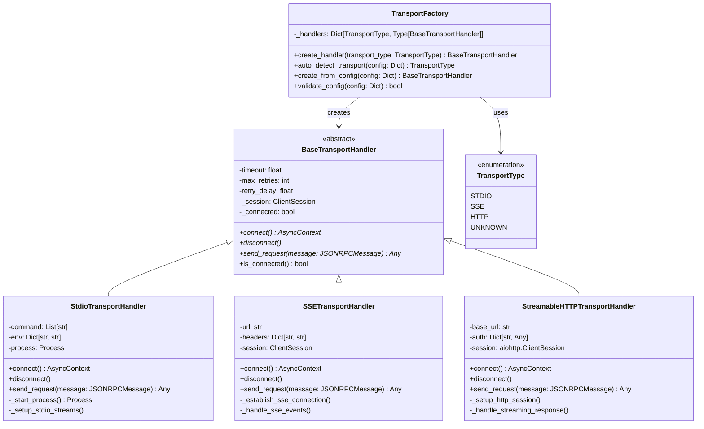
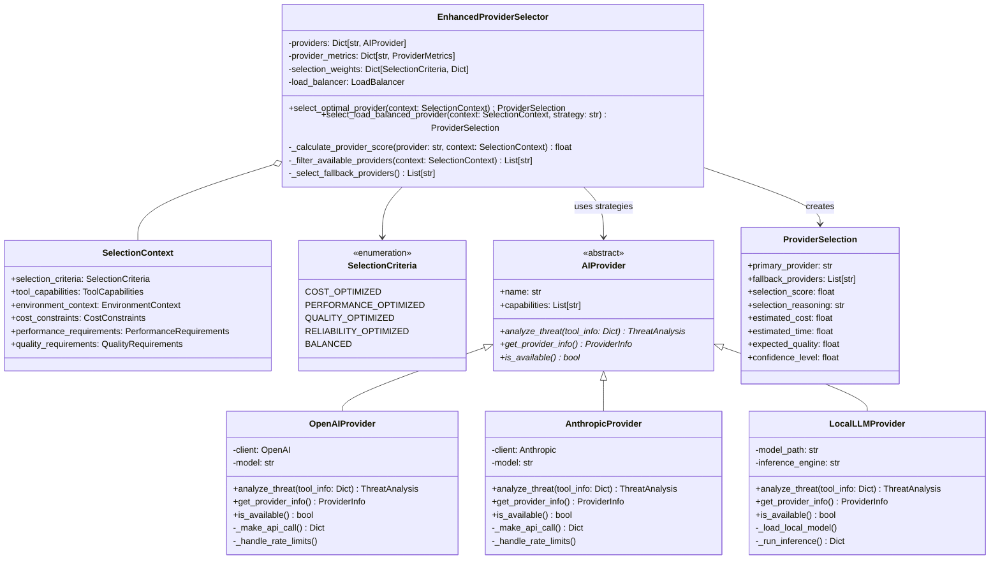
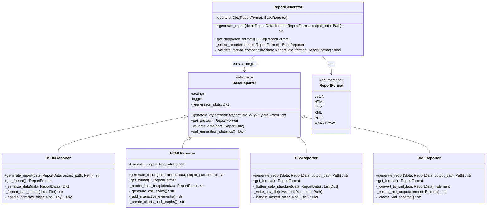

# Strategy Pattern Documentation

## Overview

The Strategy Pattern is extensively implemented throughout the HawkEye Security Reconnaissance Tool to enable runtime algorithm selection and provide flexible, interchangeable components. This pattern encapsulates algorithms in separate classes and makes them interchangeable, allowing the algorithm to vary independently from the clients that use it.

## Pattern Definition

The Strategy Pattern:
- Defines a family of algorithms and encapsulates each one
- Makes algorithms interchangeable at runtime
- Separates algorithm implementation from client code
- Supports the Open/Closed Principle (open for extension, closed for modification)

## Implementation in HawkEye

HawkEye implements the Strategy Pattern across five main contexts:

1. **Detection Pipeline Strategies** - Multiple detection methods
2. **Transport Strategy Selection** - Different MCP transport protocols
3. **AI Provider Selection Strategies** - Multiple AI service providers with different optimization criteria
4. **Fallback Management Strategies** - Various error handling approaches
5. **Report Generation Strategies** - Multiple output formats

## UML Class Diagrams

### 1. Detection Pipeline Strategy Pattern



### 2. Transport Strategy Pattern



### 3. AI Provider Selection Strategy Pattern



### 4. Fallback Management Strategy Pattern

```mermaid
classDiagram
    class FallbackManager {
        -fallback_config: FallbackConfig
        -strategy_registry: Dict[FallbackStrategy, callable]
        -statistics: FallbackStatistics
        +handle_failed_introspection(config: MCPServerConfig, error: Exception) FallbackResult
        -_try_strategy(strategy: FallbackStrategy, config: MCPServerConfig) FallbackResult
        -_select_fallback_strategy(error: Exception, context: Dict) FallbackStrategy
        +get_fallback_statistics() FallbackStatistics
    }
    
    class FallbackStrategy {
        <<enumeration>>
        SKIP
        BASIC_INFO
        CACHED_RESULT
        HEURISTIC_ANALYSIS
        MINIMAL_SAFE
        RETRY_WITH_TIMEOUT
        DEGRADED_SCAN
    }
    
    class FallbackResult {
        +success: bool
        +strategy_used: FallbackStrategy
        +server_info: Optional[MCPServerInfo]
        +confidence_score: float
        +fallback_reason: str
        +original_error: str
        +processing_time: float
    }
    
    class SkipStrategy {
        +execute(config: MCPServerConfig, error: Exception) FallbackResult
        +is_applicable(error: Exception) bool
        +get_confidence_score() float
    }
    
    class BasicInfoStrategy {
        +execute(config: MCPServerConfig, error: Exception) FallbackResult
        +is_applicable(error: Exception) bool
        +get_confidence_score() float
        -_extract_basic_info(config: MCPServerConfig) Dict
    }
    
    class CachedResultStrategy {
        -cache: ResultCache
        +execute(config: MCPServerConfig, error: Exception) FallbackResult
        +is_applicable(error: Exception) bool
        +get_confidence_score() float
        -_lookup_cached_result(config: MCPServerConfig) Optional[Dict]
    }
    
    class HeuristicAnalysisStrategy {
        -heuristics: List[Heuristic]
        +execute(config: MCPServerConfig, error: Exception) FallbackResult
        +is_applicable(error: Exception) bool
        +get_confidence_score() float
        -_apply_heuristics(config: MCPServerConfig) Dict
    }
    
    class RetryStrategy {
        -retry_config: RetryConfig
        +execute(config: MCPServerConfig, error: Exception) FallbackResult
        +is_applicable(error: Exception) bool
        +get_confidence_score() float
        -_execute_retry(config: MCPServerConfig) MCPServerInfo
    }

    FallbackManager --> FallbackStrategy : uses
    FallbackManager --> FallbackResult : creates
    FallbackManager --> SkipStrategy : strategy
    FallbackManager --> BasicInfoStrategy : strategy
    FallbackManager --> CachedResultStrategy : strategy
    FallbackManager --> HeuristicAnalysisStrategy : strategy
    FallbackManager --> RetryStrategy : strategy
```



### 5. Report Generation Strategy Pattern



## Implementation Examples

### 1. Detection Pipeline Strategy Context

**Context Class (Pipeline):**
```python
class DetectionPipeline:
    """Context that uses different detection strategies."""
    
    def __init__(self, config: Optional[PipelineConfig] = None, settings=None):
        self.config = config or PipelineConfig()
        self.settings = settings or get_settings()
        self.detectors = {}
        
        # Initialize detection strategies based on configuration
        self._init_detectors()
    
    def _init_detectors(self):
        """Initialize detection strategies based on configuration."""
        if self.config.enable_process_enumeration:
            self.detectors[DetectionMethod.PROCESS_ENUMERATION] = ProcessEnumerator(self.settings)
        
        if self.config.enable_config_discovery:
            self.detectors[DetectionMethod.CONFIG_FILE_DISCOVERY] = ConfigFileDiscovery(self.settings)
        
        if self.config.enable_protocol_verification:
            self.detectors[DetectionMethod.PROTOCOL_HANDSHAKE] = ProtocolVerifier(self.settings)
        
        if self.config.enable_transport_detection:
            self.detectors[DetectionMethod.TRANSPORT_DETECTION] = TransportDetector(self.settings)
    
    def execute_pipeline(self, target_host: str, **kwargs) -> PipelineResult:
        """Execute detection using selected strategies."""
        results = {}
        
        # Execute each enabled detection strategy
        for method, detector in self.detectors.items():
            try:
                self.logger.debug(f"Executing {method.value} detection")
                
                if method == DetectionMethod.PROCESS_ENUMERATION:
                    # Strategy-specific execution logic
                    detection_results = detector.enumerate_mcp_processes()
                else:
                    detection_result = detector.detect(target_host, **kwargs)
                    detection_results = [detection_result] if detection_result else []
                
                results[method] = detection_results
                
            except Exception as e:
                self.logger.warning(f"{method.value} detection failed: {e}")
                results[method] = []
        
        return self._aggregate_results(results)
```

**Strategy Interface:**
```python
class MCPDetector(ABC):
    """Strategy interface for detection methods."""
    
    @abstractmethod
    def detect(self, target_host: str, **kwargs) -> DetectionResult:
        """Perform detection using this strategy."""
        pass
    
    @abstractmethod
    def get_detection_method(self) -> DetectionMethod:
        """Get the detection method identifier."""
        pass
```

**Concrete Strategy:**
```python
class ProcessEnumerator(MCPDetector):
    """Concrete strategy for process-based detection."""
    
    def detect(self, target_host: str, **kwargs) -> DetectionResult:
        """Detect MCP servers through process enumeration."""
        try:
            # Strategy-specific implementation
            processes = self._enumerate_processes()
            mcp_processes = self._filter_mcp_processes(processes)
            servers = self._analyze_processes(mcp_processes)
            
            return DetectionResult(
                target_host=target_host,
                success=True,
                detection_method=self.get_detection_method(),
                mcp_servers=servers
            )
        except Exception as e:
            return DetectionResult(
                target_host=target_host,
                success=False,
                error=str(e)
            )
    
    def get_detection_method(self) -> DetectionMethod:
        return DetectionMethod.PROCESS_ENUMERATION
```

### 2. Transport Factory Strategy

**Factory Context:**
```python
class TransportFactory:
    """Factory that creates transport strategies."""
    
    _handlers: Dict[TransportType, Type[BaseTransportHandler]] = {
        TransportType.STDIO: StdioTransportHandler,
        TransportType.SSE: SSETransportHandler,
        TransportType.HTTP: StreamableHTTPTransportHandler,
    }
    
    def create_handler(
        self,
        transport_type: Union[str, TransportType],
        **kwargs
    ) -> BaseTransportHandler:
        """Create appropriate transport strategy."""
        
        # Convert string to enum if needed
        if isinstance(transport_type, str):
            transport_type = TransportType(transport_type.lower())
        
        if transport_type not in self._handlers:
            raise TransportError(f"No handler available for transport type: {transport_type}")
        
        handler_class = self._handlers[transport_type]
        return handler_class(**kwargs)
    
    def auto_detect_transport(self, config: Dict[str, Any]) -> TransportType:
        """Automatically select transport strategy based on configuration."""
        
        # Strategy selection logic
        if 'command' in config or 'args' in config:
            return TransportType.STDIO
        
        if 'url' in config:
            url = config['url']
            if any(indicator in url.lower() for indicator in ['sse', 'events', 'stream']):
                return TransportType.SSE
            else:
                return TransportType.HTTP
        
        if 'base_url' in config:
            return TransportType.HTTP
        
        # Default strategy
        return TransportType.STDIO
```

**Strategy Implementation:**
```python
class StdioTransportHandler(BaseTransportHandler):
    """Concrete transport strategy for stdio communication."""
    
    async def connect(self, command: List[str], env: Dict[str, str] = None):
        """Connect using stdio transport strategy."""
        try:
            # Strategy-specific connection logic
            self.process = await asyncio.create_subprocess_exec(
                *command,
                stdin=asyncio.subprocess.PIPE,
                stdout=asyncio.subprocess.PIPE,
                stderr=asyncio.subprocess.PIPE,
                env=env
            )
            
            # Create MCP session with stdio streams
            self._session = ClientSession(
                read_stream=self.process.stdout,
                write_stream=self.process.stdin
            )
            
            self._connected = True
            
        except Exception as e:
            raise ConnectionFailedError(f"Failed to start stdio process: {e}")
```

### 3. AI Provider Selection Strategy

**Strategy Context:**
```python
class EnhancedProviderSelector:
    """Context for AI provider selection strategies."""
    
    def __init__(self, providers: Dict[str, AIProvider]):
        self.providers = providers
        self.selection_weights = {
            SelectionCriteria.COST_OPTIMIZED: {
                "cost": 0.4, "performance": 0.2, "quality": 0.2, "reliability": 0.2
            },
            SelectionCriteria.PERFORMANCE_OPTIMIZED: {
                "cost": 0.1, "performance": 0.4, "quality": 0.3, "reliability": 0.2
            },
            SelectionCriteria.QUALITY_OPTIMIZED: {
                "cost": 0.1, "performance": 0.2, "quality": 0.5, "reliability": 0.2
            }
        }
    
    def select_optimal_provider(self, selection_context: SelectionContext) -> ProviderSelection:
        """Select provider using strategy-based approach."""
        
        # Get selection strategy weights
        weights = self.selection_weights[selection_context.selection_criteria]
        
        # Score each provider using the selected strategy
        provider_scores = {}
        for provider_name in self.providers:
            score = self._calculate_provider_score(provider_name, selection_context, weights)
            provider_scores[provider_name] = score
        
        # Select primary provider based on strategy
        primary_provider = max(provider_scores.keys(), key=lambda p: provider_scores[p])
        
        return self._create_selection_result(primary_provider, provider_scores, selection_context)
    
    def select_load_balanced_provider(
        self,
        selection_context: SelectionContext,
        load_balancing_strategy: str = "weighted_round_robin"
    ) -> ProviderSelection:
        """Select provider using load balancing strategies."""
        
        available_providers = self._filter_available_providers(selection_context)
        
        # Apply selected load balancing strategy
        if load_balancing_strategy == "round_robin":
            selected_provider = self._select_round_robin(available_providers)
        elif load_balancing_strategy == "weighted_round_robin":
            selected_provider = self._select_weighted_round_robin(available_providers, selection_context)
        elif load_balancing_strategy == "least_connections":
            selected_provider = self._select_least_connections(available_providers)
        elif load_balancing_strategy == "least_response_time":
            selected_provider = self._select_least_response_time(available_providers)
        else:
            # Fallback to optimal selection
            return self.select_optimal_provider(selection_context)
        
        return self._create_load_balanced_selection(selected_provider, available_providers)
```

### 4. Report Generation Strategy

**Context Implementation:**
```python
def generate_report(ctx, input: str, output: str, format: str, **kwargs):
    """Generate report using selected strategy."""
    
    # Strategy selection based on format
    reporter_strategies = {
        "json": JSONReporter,
        "csv": CSVReporter,
        "xml": XMLReporter,
        "html": HTMLReporter
    }
    
    if format not in reporter_strategies:
        raise click.BadParameter(f"Unsupported format: {format}")
    
    # Create strategy instance
    reporter_class = reporter_strategies[format]
    reporter = reporter_class()
    
    # Load input data
    report_data = load_report_data(input)
    
    # Execute strategy
    output_content = reporter.generate_report(report_data, Path(output))
    
    console.print(f"[green]✓[/green] Report generated: {output}")
```

**Strategy Interface:**
```python
class BaseReporter(ABC):
    """Strategy interface for report generation."""
    
    @abstractmethod
    def generate_report(self, data: ReportData, output_path: Optional[Path] = None) -> str:
        """Generate report using this strategy."""
        pass
    
    @abstractmethod
    def get_format(self) -> ReportFormat:
        """Get the format this strategy produces."""
        pass
```

**Concrete Strategy:**
```python
class HTMLReporter(BaseReporter):
    """Concrete strategy for HTML report generation."""
    
    def generate_report(self, data: ReportData, output_path: Optional[Path] = None) -> str:
        """Generate HTML report using template strategy."""
        try:
            # Strategy-specific implementation
            html_content = self._render_html_template(data)
            css_styles = self._generate_css_styles()
            interactive_elements = self._add_interactive_elements()
            
            # Combine all elements
            complete_html = self._combine_html_elements(html_content, css_styles, interactive_elements)
            
            if output_path:
                output_path.write_text(complete_html, encoding='utf-8')
                return str(output_path)
            
            return complete_html
            
        except Exception as e:
            raise ReportingError(f"HTML report generation failed: {e}")
    
    def get_format(self) -> ReportFormat:
        return ReportFormat.HTML
```

## Benefits of the Strategy Pattern

### 1. **Algorithm Flexibility**
- Enables runtime algorithm selection based on context
- Supports easy addition of new algorithms without modifying existing code
- Allows optimization for different scenarios (cost, performance, quality)

### 2. **Separation of Concerns**
- Isolates algorithm implementation from client code
- Makes algorithms independently testable and maintainable
- Reduces coupling between components

### 3. **Configuration-Driven Behavior**
- Strategies can be selected based on configuration files
- Supports feature flags and conditional algorithm activation
- Enables A/B testing of different approaches

### 4. **Extensibility**
- New strategies can be added without modifying existing code
- Supports plugin architectures and third-party extensions
- Follows Open/Closed Principle

### 5. **Context Awareness**
- Strategies can be selected based on environmental factors
- Supports adaptive behavior based on system conditions
- Enables intelligent fallback mechanisms

## Implementation Patterns in HawkEye

### 1. **Configuration-Based Selection**
```python
# Detection pipeline strategy selection
if self.config.enable_process_enumeration:
    self.detectors[DetectionMethod.PROCESS_ENUMERATION] = ProcessEnumerator(self.settings)

# Transport strategy auto-detection
def auto_detect_transport(self, config: Dict[str, Any]) -> TransportType:
    if 'command' in config:
        return TransportType.STDIO
    elif 'url' in config and 'sse' in config['url']:
        return TransportType.SSE
    else:
        return TransportType.HTTP
```

### 2. **Metric-Based Selection**
```python
# AI provider selection based on performance metrics
def select_optimal_provider(self, selection_context: SelectionContext) -> ProviderSelection:
    weights = self.selection_weights[selection_context.selection_criteria]
    
    for provider_name in self.providers:
        score = (
            weights["cost"] * self._get_cost_score(provider_name) +
            weights["performance"] * self._get_performance_score(provider_name) +
            weights["quality"] * self._get_quality_score(provider_name) +
            weights["reliability"] * self._get_reliability_score(provider_name)
        )
        provider_scores[provider_name] = score
```

### 3. **Fallback Strategy Chaining**
```python
# Fallback strategy selection with ordered preferences
def handle_failed_introspection(self, server_config, original_error):
    for strategy in self.config.fallback_order:
        try:
            result = self._try_strategy(strategy, server_config, original_error)
            if result.success:
                return result
        except Exception:
            continue
    
    # Final fallback
    return self._skip_strategy(server_config, original_error)
```

### 4. **Factory-Based Strategy Creation**
```python
# Transport handler factory with strategy registry
_handlers: Dict[TransportType, Type[BaseTransportHandler]] = {
    TransportType.STDIO: StdioTransportHandler,
    TransportType.SSE: SSETransportHandler,
    TransportType.HTTP: StreamableHTTPTransportHandler,
}

def create_handler(self, transport_type: TransportType) -> BaseTransportHandler:
    handler_class = self._handlers[transport_type]
    return handler_class(**kwargs)
```

## Best Practices

### 1. **Strategy Interface Design**
```python
class StrategyInterface(ABC):
    """Well-defined strategy interface."""
    
    @abstractmethod
    def execute(self, context: ContextData) -> Result:
        """Main strategy method with clear contract."""
        pass
    
    @abstractmethod
    def is_applicable(self, context: ContextData) -> bool:
        """Check if strategy can handle the context."""
        pass
    
    def get_metadata(self) -> StrategyMetadata:
        """Provide strategy metadata for selection."""
        return StrategyMetadata(
            name=self.__class__.__name__,
            capabilities=self._get_capabilities(),
            cost_estimate=self._get_cost_estimate()
        )
```

### 2. **Context Object Pattern**
```python
@dataclass
class SelectionContext:
    """Rich context object for strategy selection."""
    selection_criteria: SelectionCriteria
    performance_requirements: PerformanceRequirements
    cost_constraints: CostConstraints
    environmental_factors: Dict[str, Any]
    user_preferences: Dict[str, Any]
```

### 3. **Strategy Registry Pattern**
```python
class StrategyRegistry:
    """Central registry for strategy management."""
    
    def __init__(self):
        self._strategies: Dict[str, Type[Strategy]] = {}
    
    def register(self, name: str, strategy_class: Type[Strategy]):
        """Register a new strategy."""
        self._strategies[name] = strategy_class
    
    def create_strategy(self, name: str, **kwargs) -> Strategy:
        """Create strategy instance by name."""
        if name not in self._strategies:
            raise ValueError(f"Unknown strategy: {name}")
        return self._strategies[name](**kwargs)
    
    def get_available_strategies(self) -> List[str]:
        """Get list of registered strategies."""
        return list(self._strategies.keys())
```

### 4. **Performance Monitoring**
```python
class StrategyMonitor:
    """Monitor strategy performance for optimization."""
    
    def __init__(self):
        self.metrics = defaultdict(list)
    
    def record_execution(self, strategy_name: str, execution_time: float, success: bool):
        """Record strategy execution metrics."""
        self.metrics[strategy_name].append({
            'execution_time': execution_time,
            'success': success,
            'timestamp': datetime.now()
        })
    
    def get_best_strategy(self, context: ContextData) -> str:
        """Select best strategy based on historical performance."""
        scores = {}
        for strategy_name, executions in self.metrics.items():
            recent_executions = [e for e in executions if e['timestamp'] > datetime.now() - timedelta(hours=24)]
            if recent_executions:
                success_rate = sum(1 for e in recent_executions if e['success']) / len(recent_executions)
                avg_time = sum(e['execution_time'] for e in recent_executions) / len(recent_executions)
                scores[strategy_name] = success_rate / avg_time
        
        return max(scores.keys(), key=lambda k: scores[k]) if scores else None
```

## Usage Guidelines

### When to Use Strategy Pattern

1. **Multiple Algorithms**: When you have several ways to perform a task and want to choose at runtime
2. **Configuration-Driven Behavior**: When algorithm selection should be based on configuration or context
3. **Plugin Architectures**: When building extensible systems that accept third-party algorithms
4. **Performance Optimization**: When different algorithms have different performance characteristics

### When to Consider Alternatives

1. **Simple Conditional Logic**: When algorithm selection is straightforward, simple if/else might suffice
2. **State-Based Behavior**: When behavior changes based on internal state, consider State pattern
3. **Object Creation**: When the main concern is object creation, consider Factory patterns
4. **Request Processing**: When building processing chains, consider Chain of Responsibility

## Conclusion

The Strategy Pattern is fundamental to HawkEye's flexible and extensible architecture. It enables:

- **Adaptive Detection**: Multiple detection methods that can be selected based on target characteristics
- **Transport Flexibility**: Support for various MCP transport protocols with automatic selection
- **AI Provider Optimization**: Intelligent selection of AI services based on cost, performance, and quality criteria
- **Robust Error Handling**: Multiple fallback strategies for handling different types of failures
- **Flexible Reporting**: Multiple output formats with consistent interfaces

The pattern's implementation in HawkEye demonstrates how strategy selection can be driven by configuration, performance metrics, environmental factors, and user preferences, creating a highly adaptable security reconnaissance tool.