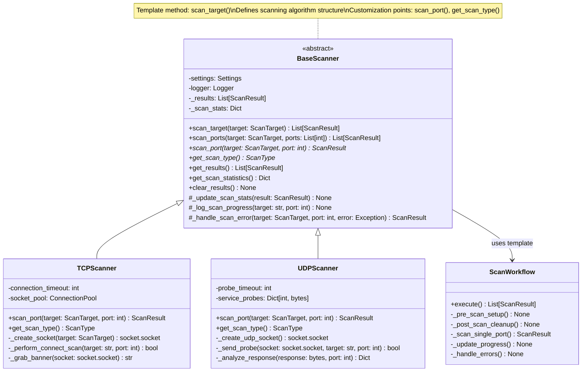
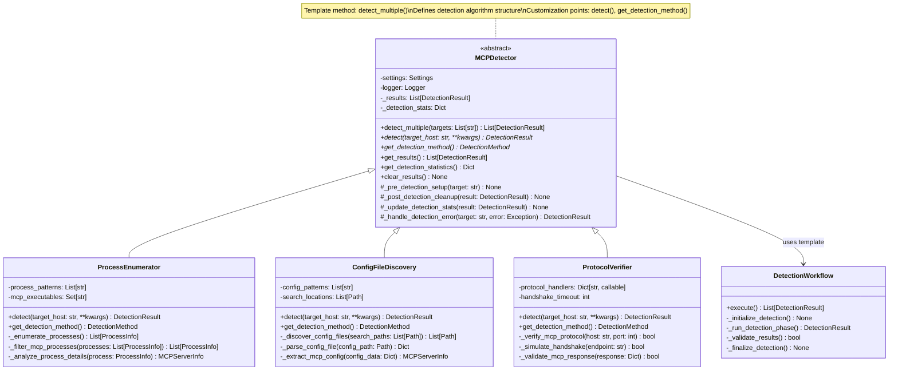
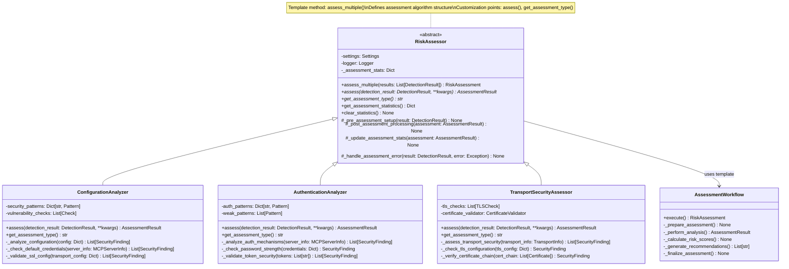
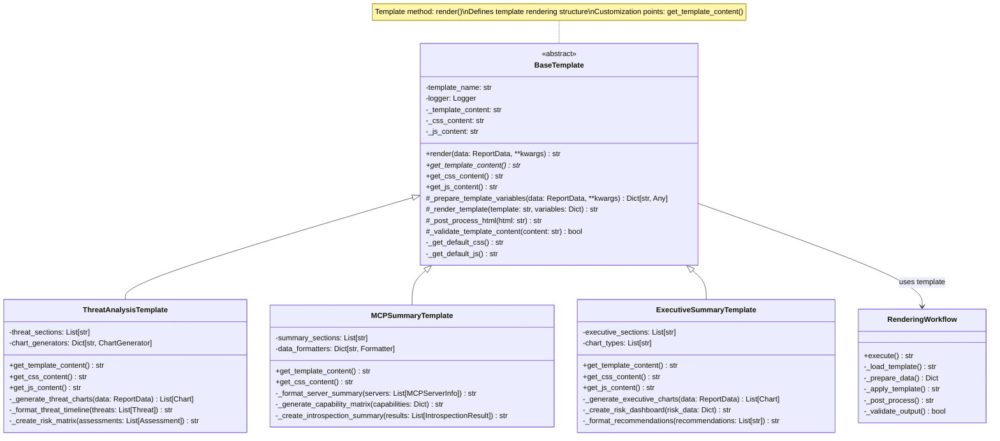
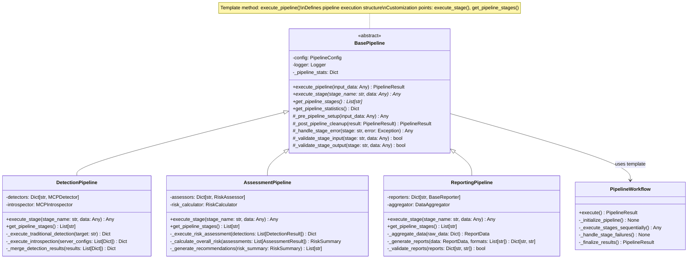

# Template Method Pattern Documentation

## Overview

The Template Method Pattern is extensively implemented throughout the HawkEye Security Reconnaissance Tool to define the skeleton of algorithms in base classes while allowing subclasses to override specific steps without changing the algorithm's structure. This pattern promotes code reuse and ensures consistent execution flows across different implementations.

## Pattern Definition

The Template Method Pattern:
- Defines the skeleton of an algorithm in a base class
- Allows subclasses to override specific steps without changing the algorithm structure
- Uses abstract methods to define customization points
- Provides hooks for optional customization
- Ensures consistent execution flow and error handling

## Implementation in HawkEye

HawkEye implements the Template Method Pattern across multiple hierarchies to provide consistent algorithm execution with customizable behavior:

1. **Scanning Operations** - BaseScanner defines scanning workflows with customizable port scanning methods
2. **Detection Operations** - MCPDetector defines detection workflows with customizable detection strategies
3. **Assessment Operations** - RiskAssessor defines assessment workflows with customizable analysis methods
4. **Report Generation** - BaseTemplate and BaseReporter define rendering and generation workflows
5. **Pipeline Operations** - Various pipeline classes define processing workflows with customizable stages

## UML Class Diagrams

### 1. BaseScanner Template Method Pattern



### 2. MCPDetector Template Method Pattern



### 3. RiskAssessor Template Method Pattern



### 4. BaseTemplate Template Method Pattern



### 5. Pipeline Template Method Pattern



## Implementation Examples

### 1. BaseScanner Template Method

**Template Method Implementation:**
```python
class BaseScanner(ABC):
    """Abstract base class implementing Template Method Pattern for scanning."""
    
    def scan_target(self, target: ScanTarget) -> List[ScanResult]:
        """
        Template method defining the scanning algorithm structure.
        
        This method defines the skeleton of the scanning process:
        1. Initialize scanning statistics
        2. Iterate through ports
        3. Call abstract scan_port method for each port
        4. Handle errors and update statistics
        5. Return aggregated results
        """
        self.logger.info(f"Starting scan of {target.host} on {len(target.ports)} ports")
        self._scan_stats['start_time'] = time.time()
        
        results = []
        for port in target.ports:
            try:
                # Call abstract method - customization point
                result = self.scan_port(target, port)
                results.append(result)
                self._results.append(result)
                self._scan_stats['successful_scans'] += 1
                
                if result.is_open:
                    self.logger.info(f"Found open port: {target.host}:{port}")
                
            except Exception as e:
                # Template method handles errors consistently
                self.logger.error(f"Error scanning {target.host}:{port} - {e}")
                error_result = self._handle_scan_error(target, port, e)
                results.append(error_result)
                self._results.append(error_result)
                self._scan_stats['failed_scans'] += 1
            
            self._scan_stats['total_scans'] += 1
        
        self._scan_stats['end_time'] = time.time()
        self.logger.info(f"Completed scan of {target.host}: {len(results)} results")
        
        return results
    
    @abstractmethod
    def scan_port(self, target: ScanTarget, port: int) -> ScanResult:
        """Abstract method - customization point for specific scan implementations."""
        pass
    
    @abstractmethod
    def get_scan_type(self) -> ScanType:
        """Abstract method - identifies the scan type."""
        pass
    
    def _handle_scan_error(self, target: ScanTarget, port: int, error: Exception) -> ScanResult:
        """Hook method for error handling - can be overridden."""
        return ScanResult(
            target=target,
            port=port,
            state=PortState.UNKNOWN,
            scan_type=self.get_scan_type(),
            error=str(error)
        )
```

**Concrete Implementation:**
```python
class TCPScanner(BaseScanner):
    """Concrete implementation using Template Method Pattern."""
    
    def scan_port(self, target: ScanTarget, port: int) -> ScanResult:
        """Implement the abstract method for TCP scanning."""
        start_time = time.time()
        
        try:
            sock = self._create_socket(target)
            sock.settimeout(self.settings.scan_timeout)
            
            result = sock.connect_ex((target.host, port))
            response_time = time.time() - start_time
            
            if result == 0:
                # Port is open
                banner = self._grab_banner(sock)
                service_info = self._analyze_service(banner, port)
                
                return ScanResult(
                    target=target,
                    port=port,
                    state=PortState.OPEN,
                    scan_type=self.get_scan_type(),
                    response_time=response_time,
                    banner=banner,
                    service_info=service_info
                )
            else:
                return ScanResult(
                    target=target,
                    port=port,
                    state=PortState.CLOSED,
                    scan_type=self.get_scan_type(),
                    response_time=response_time
                )
                
        except socket.timeout:
            return ScanResult(
                target=target,
                port=port,
                state=PortState.FILTERED,
                scan_type=self.get_scan_type(),
                response_time=self.settings.scan_timeout
            )
        finally:
            if 'sock' in locals():
                sock.close()
    
    def get_scan_type(self) -> ScanType:
        """Implement abstract method."""
        return ScanType.TCP_CONNECT
```

### 2. MCPDetector Template Method

**Template Method Implementation:**
```python
class MCPDetector(ABC):
    """Abstract base class implementing Template Method Pattern for detection."""
    
    def detect_multiple(self, targets: List[str], **kwargs) -> List[DetectionResult]:
        """
        Template method defining the detection algorithm structure.
        
        This method defines the skeleton of the detection process:
        1. Initialize detection statistics
        2. Iterate through targets
        3. Call abstract detect method for each target
        4. Handle errors and update statistics
        5. Return aggregated results
        """
        self._detection_stats['start_time'] = time.time()
        results = []
        
        for target in targets:
            try:
                # Call abstract method - customization point
                result = self.detect(target, **kwargs)
                results.append(result)
                self._results.append(result)
                
                # Template method updates statistics consistently
                self._detection_stats['total_detections'] += 1
                if result.success:
                    self._detection_stats['successful_detections'] += 1
                    if result.is_mcp_detected:
                        self._detection_stats['mcp_servers_found'] += 1
                else:
                    self._detection_stats['failed_detections'] += 1
                    
            except Exception as e:
                # Template method handles errors consistently
                self.logger.error(f"Detection failed for {target}: {e}")
                error_result = self._handle_detection_error(target, e)
                results.append(error_result)
                self._results.append(error_result)
                self._detection_stats['total_detections'] += 1
                self._detection_stats['failed_detections'] += 1
        
        self._detection_stats['end_time'] = time.time()
        return results
    
    @abstractmethod
    def detect(self, target_host: str, **kwargs) -> DetectionResult:
        """Abstract method - customization point for specific detection implementations."""
        pass
    
    @abstractmethod
    def get_detection_method(self) -> DetectionMethod:
        """Abstract method - identifies the detection method."""
        pass
    
    def _handle_detection_error(self, target: str, error: Exception) -> DetectionResult:
        """Hook method for error handling - can be overridden."""
        return DetectionResult(
            target_host=target,
            detection_method=self.get_detection_method(),
            success=False,
            error=str(error)
        )
```

### 3. BaseTemplate Template Method

**Template Method Implementation:**
```python
class BaseTemplate(ABC):
    """Abstract base class implementing Template Method Pattern for template rendering."""
    
    def render(self, data: ReportData, **kwargs) -> str:
        """
        Template method defining the rendering algorithm structure.
        
        This method defines the skeleton of the rendering process:
        1. Prepare template variables
        2. Get template content (abstract method)
        3. Render template with variables
        4. Post-process rendered content
        5. Return final HTML
        """
        try:
            # Step 1: Prepare template variables (hook method)
            template_vars = self._prepare_template_variables(data, **kwargs)
            
            # Step 2: Get template content (abstract method - customization point)
            template_content = self.get_template_content()
            
            # Step 3: Render template (hook method)
            rendered_html = self._render_template(template_content, template_vars)
            
            # Step 4: Post-process (hook method)
            final_html = self._post_process_html(rendered_html)
            
            return final_html
            
        except Exception as e:
            self.logger.error(f"Template rendering failed: {e}")
            raise TemplateError(f"Failed to render template {self.template_name}: {e}")
    
    @abstractmethod
    def get_template_content(self) -> str:
        """Abstract method - customization point for template content."""
        pass
    
    def get_css_content(self) -> str:
        """Hook method - can be overridden for custom CSS."""
        return self._get_default_css()
    
    def get_js_content(self) -> str:
        """Hook method - can be overridden for custom JavaScript."""
        return self._get_default_js()
    
    def _prepare_template_variables(self, data: ReportData, **kwargs) -> Dict[str, Any]:
        """Hook method for preparing template variables."""
        variables = {
            'report_data': data,
            'metadata': data.metadata,
            'scan_results': data.scan_results,
            'detection_results': data.detection_results,
            'assessment_results': data.assessment_results,
            'recommendations': data.recommendations,
            'template_name': self.template_name,
            'render_time': time.strftime("%Y-%m-%d %H:%M:%S UTC"),
            'css_content': self.get_css_content(),
            'js_content': self.get_js_content(),
        }
        
        variables.update(kwargs)
        return variables
    
    def _render_template(self, template_content: str, variables: Dict[str, Any]) -> str:
        """Hook method for template rendering - can be overridden."""
        # Simple string substitution - can be overridden for more sophisticated rendering
        rendered = template_content
        for key, value in variables.items():
            placeholder = f"{{{{{key}}}}}"
            rendered = rendered.replace(placeholder, str(value))
        return rendered
    
    def _post_process_html(self, html: str) -> str:
        """Hook method for post-processing - can be overridden."""
        # Default implementation does minimal processing
        return html.strip()
```

### 4. Pipeline Template Method

**Template Method Implementation:**
```python
class BasePipeline(ABC):
    """Abstract base class implementing Template Method Pattern for pipeline execution."""
    
    def execute_pipeline(self, input_data: Any) -> PipelineResult:
        """
        Template method defining the pipeline execution structure.
        
        This method defines the skeleton of the pipeline process:
        1. Pre-pipeline setup
        2. Execute each stage in sequence
        3. Handle stage errors
        4. Post-pipeline cleanup
        5. Return pipeline results
        """
        pipeline_start = time.time()
        
        try:
            # Step 1: Pre-pipeline setup (hook method)
            processed_input = self._pre_pipeline_setup(input_data)
            
            # Step 2: Execute pipeline stages
            current_data = processed_input
            stage_results = {}
            
            for stage_name in self.get_pipeline_stages():
                try:
                    stage_start = time.time()
                    
                    # Validate input
                    if not self._validate_stage_input(stage_name, current_data):
                        raise PipelineError(f"Invalid input for stage {stage_name}")
                    
                    # Execute stage (abstract method - customization point)
                    stage_result = self.execute_stage(stage_name, current_data)
                    
                    # Validate output
                    if not self._validate_stage_output(stage_name, stage_result):
                        raise PipelineError(f"Invalid output from stage {stage_name}")
                    
                    # Store results and prepare for next stage
                    stage_results[stage_name] = {
                        'result': stage_result,
                        'execution_time': time.time() - stage_start,
                        'success': True
                    }
                    
                    current_data = stage_result
                    
                except Exception as e:
                    # Handle stage error (hook method)
                    error_result = self._handle_stage_error(stage_name, e)
                    stage_results[stage_name] = {
                        'result': error_result,
                        'execution_time': time.time() - stage_start,
                        'success': False,
                        'error': str(e)
                    }
                    
                    if self.config.fail_fast:
                        break
                    
                    current_data = error_result
            
            # Step 3: Create pipeline result
            pipeline_result = PipelineResult(
                input_data=input_data,
                output_data=current_data,
                stage_results=stage_results,
                execution_time=time.time() - pipeline_start,
                success=all(stage['success'] for stage in stage_results.values())
            )
            
            # Step 4: Post-pipeline cleanup (hook method)
            final_result = self._post_pipeline_cleanup(pipeline_result)
            
            return final_result
            
        except Exception as e:
            self.logger.error(f"Pipeline execution failed: {e}")
            return PipelineResult(
                input_data=input_data,
                output_data=None,
                stage_results={},
                execution_time=time.time() - pipeline_start,
                success=False,
                error=str(e)
            )
    
    @abstractmethod
    def execute_stage(self, stage_name: str, data: Any) -> Any:
        """Abstract method - customization point for stage execution."""
        pass
    
    @abstractmethod
    def get_pipeline_stages(self) -> List[str]:
        """Abstract method - defines the stages in execution order."""
        pass
    
    def _pre_pipeline_setup(self, input_data: Any) -> Any:
        """Hook method for pre-pipeline setup."""
        return input_data
    
    def _post_pipeline_cleanup(self, result: PipelineResult) -> PipelineResult:
        """Hook method for post-pipeline cleanup."""
        return result
    
    def _handle_stage_error(self, stage: str, error: Exception) -> Any:
        """Hook method for stage error handling."""
        self.logger.error(f"Stage {stage} failed: {error}")
        return None
    
    def _validate_stage_input(self, stage: str, data: Any) -> bool:
        """Hook method for stage input validation."""
        return data is not None
    
    def _validate_stage_output(self, stage: str, data: Any) -> bool:
        """Hook method for stage output validation."""
        return True
```

## Benefits of the Template Method Pattern

### 1. **Code Reuse**
- Common algorithm structure is defined once in the base class
- Reduces duplication of control flow and error handling logic
- Shared functionality like logging, statistics, and validation

### 2. **Consistent Behavior**
- Ensures all implementations follow the same algorithm structure
- Standardizes error handling and logging patterns
- Provides consistent performance monitoring and statistics

### 3. **Flexibility with Control**
- Base class controls the overall algorithm flow
- Subclasses can only customize specific steps
- Prevents subclasses from breaking the intended algorithm structure

### 4. **Easy Extension**
- New implementations only need to implement abstract methods
- Hook methods provide optional customization points
- Template methods can be extended with additional steps

### 5. **Maintainability**
- Changes to common logic only require updates to the base class
- Bug fixes in the algorithm structure benefit all implementations
- Easier to add new features like monitoring or caching

## Advanced Template Method Techniques

### 1. **Hook Methods**
```python
class BaseProcessor(ABC):
    """Template method with multiple hook points."""
    
    def process(self, data: Any) -> Any:
        """Template method with hooks for customization."""
        
        # Hook: Optional pre-processing
        data = self.pre_process(data)
        
        # Required: Main processing (abstract method)
        result = self.do_process(data)
        
        # Hook: Optional post-processing
        result = self.post_process(result)
        
        # Hook: Optional result validation
        if not self.validate_result(result):
            raise ProcessingError("Result validation failed")
        
        return result
    
    @abstractmethod
    def do_process(self, data: Any) -> Any:
        """Abstract method - must be implemented."""
        pass
    
    def pre_process(self, data: Any) -> Any:
        """Hook method - optional override."""
        return data
    
    def post_process(self, result: Any) -> Any:
        """Hook method - optional override."""
        return result
    
    def validate_result(self, result: Any) -> bool:
        """Hook method - optional override."""
        return result is not None
```

### 2. **Parameterized Template Methods**
```python
class ConfigurableScanner(BaseScanner):
    """Template method with configurable behavior."""
    
    def __init__(self, config: ScanConfig):
        super().__init__()
        self.config = config
    
    def scan_target(self, target: ScanTarget) -> List[ScanResult]:
        """Template method with configurable steps."""
        
        if self.config.enable_pre_scan_ping:
            if not self._ping_target(target.host):
                return [self._create_unreachable_result(target)]
        
        if self.config.enable_parallel_scanning:
            return self._parallel_scan(target)
        else:
            return super().scan_target(target)
    
    def _parallel_scan(self, target: ScanTarget) -> List[ScanResult]:
        """Alternative algorithm for parallel scanning."""
        with ThreadPoolExecutor(max_workers=self.config.max_threads) as executor:
            futures = {
                executor.submit(self.scan_port, target, port): port 
                for port in target.ports
            }
            
            results = []
            for future in as_completed(futures):
                try:
                    result = future.result()
                    results.append(result)
                except Exception as e:
                    port = futures[future]
                    error_result = self._handle_scan_error(target, port, e)
                    results.append(error_result)
            
            return sorted(results, key=lambda r: r.port)
```

### 3. **Multi-Stage Template Methods**
```python
class MultiStageDetector(MCPDetector):
    """Template method with multiple detection stages."""
    
    def detect(self, target_host: str, **kwargs) -> DetectionResult:
        """Multi-stage template method."""
        
        # Stage 1: Quick detection
        quick_result = self._quick_detect(target_host, **kwargs)
        if not quick_result.success:
            return quick_result
        
        # Stage 2: Detailed analysis (if quick detection succeeded)
        if quick_result.confidence > 0.7:
            detailed_result = self._detailed_detect(target_host, quick_result, **kwargs)
            if detailed_result.success:
                return detailed_result
        
        # Stage 3: Fallback detection
        return self._fallback_detect(target_host, quick_result, **kwargs)
    
    def _quick_detect(self, target_host: str, **kwargs) -> DetectionResult:
        """First stage - quick detection."""
        # Implementation for quick detection
        pass
    
    def _detailed_detect(self, target_host: str, quick_result: DetectionResult, **kwargs) -> DetectionResult:
        """Second stage - detailed analysis."""
        # Implementation for detailed detection
        pass
    
    def _fallback_detect(self, target_host: str, previous_result: DetectionResult, **kwargs) -> DetectionResult:
        """Third stage - fallback detection."""
        # Implementation for fallback detection
        pass
```

## Best Practices

### 1. **Clear Template Method Documentation**
```python
def scan_target(self, target: ScanTarget) -> List[ScanResult]:
    """
    Template method for scanning all ports on a target.
    
    Algorithm Structure:
    1. Initialize scanning statistics
    2. For each port in target.ports:
       a. Call scan_port() - abstract method
       b. Update statistics
       c. Handle errors
    3. Log completion and return results
    
    Customization Points:
    - scan_port(): Implement specific scanning logic
    - get_scan_type(): Return the scanner type
    
    Hook Methods:
    - _handle_scan_error(): Customize error handling
    - _validate_target(): Custom target validation
    """
```

### 2. **Proper Abstract Method Design**
```python
@abstractmethod
def scan_port(self, target: ScanTarget, port: int) -> ScanResult:
    """
    Scan a single port on the target.
    
    This method must be implemented by concrete subclasses to provide
    the specific scanning logic (TCP, UDP, etc.).
    
    Args:
        target: The target to scan
        port: The port number to scan
        
    Returns:
        ScanResult: Result of the scan operation
        
    Raises:
        ScanError: If scanning fails
    """
    pass
```

### 3. **Hook Method Guidelines**
```python
def _handle_scan_error(self, target: ScanTarget, port: int, error: Exception) -> ScanResult:
    """
    Hook method for handling scan errors.
    
    Default implementation creates a UNKNOWN result with error message.
    Subclasses can override to provide custom error handling.
    
    Args:
        target: The scan target
        port: The port that failed
        error: The exception that occurred
        
    Returns:
        ScanResult: Error result to include in scan results
    """
    return ScanResult(
        target=target,
        port=port,
        state=PortState.UNKNOWN,
        scan_type=self.get_scan_type(),
        error=str(error)
    )
```

### 4. **Error Handling in Template Methods**
```python
def execute_workflow(self, data: Any) -> WorkflowResult:
    """Template method with comprehensive error handling."""
    
    try:
        # Pre-processing
        processed_data = self._pre_process(data)
        
        # Main processing (abstract method)
        result = self.process(processed_data)
        
        # Post-processing
        final_result = self._post_process(result)
        
        return WorkflowResult(success=True, data=final_result)
        
    except ValidationError as e:
        self.logger.error(f"Validation failed: {e}")
        return WorkflowResult(
            success=False, 
            error=f"Validation error: {e}",
            error_type="validation"
        )
    except ProcessingError as e:
        self.logger.error(f"Processing failed: {e}")
        return WorkflowResult(
            success=False,
            error=f"Processing error: {e}",
            error_type="processing"
        )
    except Exception as e:
        self.logger.error(f"Unexpected error: {e}")
        return WorkflowResult(
            success=False,
            error=f"Unexpected error: {e}",
            error_type="unknown"
        )
```

## Usage Guidelines

### When to Use Template Method Pattern

1. **Common Algorithm Structure**: When multiple classes share the same algorithm structure but differ in specific steps
2. **Code Duplication**: When you find similar control flow logic repeated across multiple classes
3. **Inheritance Hierarchies**: When building class hierarchies with shared behavior and specialized implementations
4. **Framework Development**: When creating frameworks that define process flows with customization points

### When to Consider Alternatives

1. **Strategy Pattern**: When the entire algorithm varies, not just specific steps
2. **Command Pattern**: When you need to parameterize objects with different operations
3. **Composition**: When the relationship is more "has-a" than "is-a"
4. **Decorator Pattern**: When you need to add behavior dynamically

## Conclusion

The Template Method Pattern is fundamental to HawkEye's architecture, providing consistent algorithm execution across the scanning, detection, assessment, and reporting modules. Key advantages include:

- **Consistent Workflows**: All operations follow standardized patterns for logging, error handling, and statistics
- **Code Reuse**: Common algorithm structures eliminate duplication while allowing customization
- **Maintainability**: Changes to common logic benefit all implementations automatically
- **Extensibility**: New implementations only need to focus on their specific logic

The pattern's success in HawkEye demonstrates its value for building robust, maintainable systems with consistent behavior patterns while allowing for specialized implementations. 