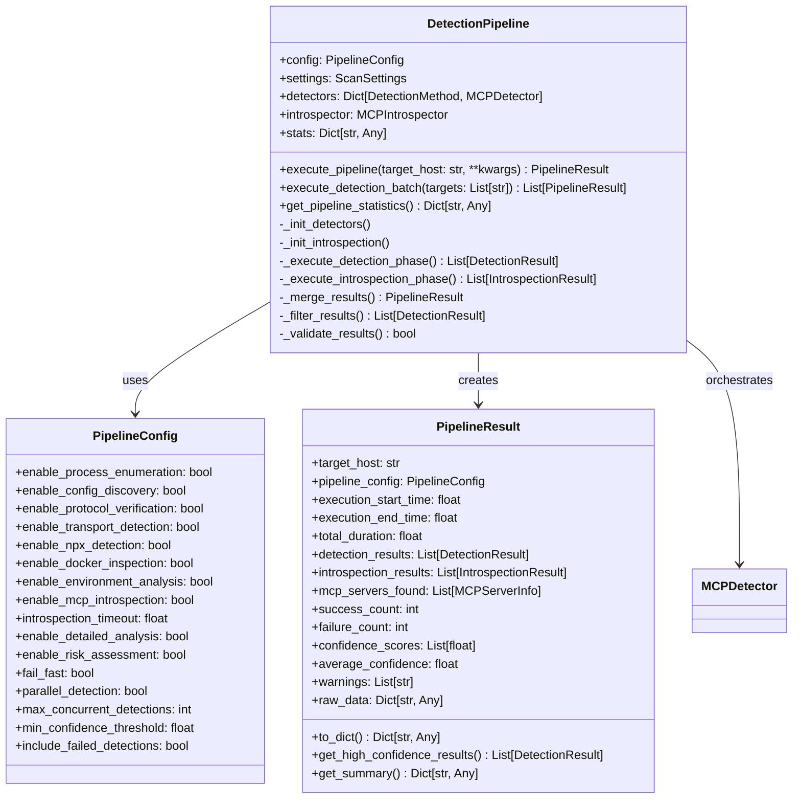
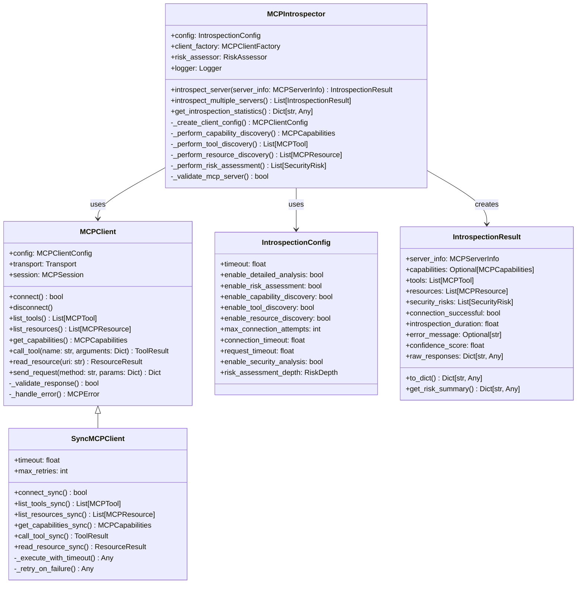
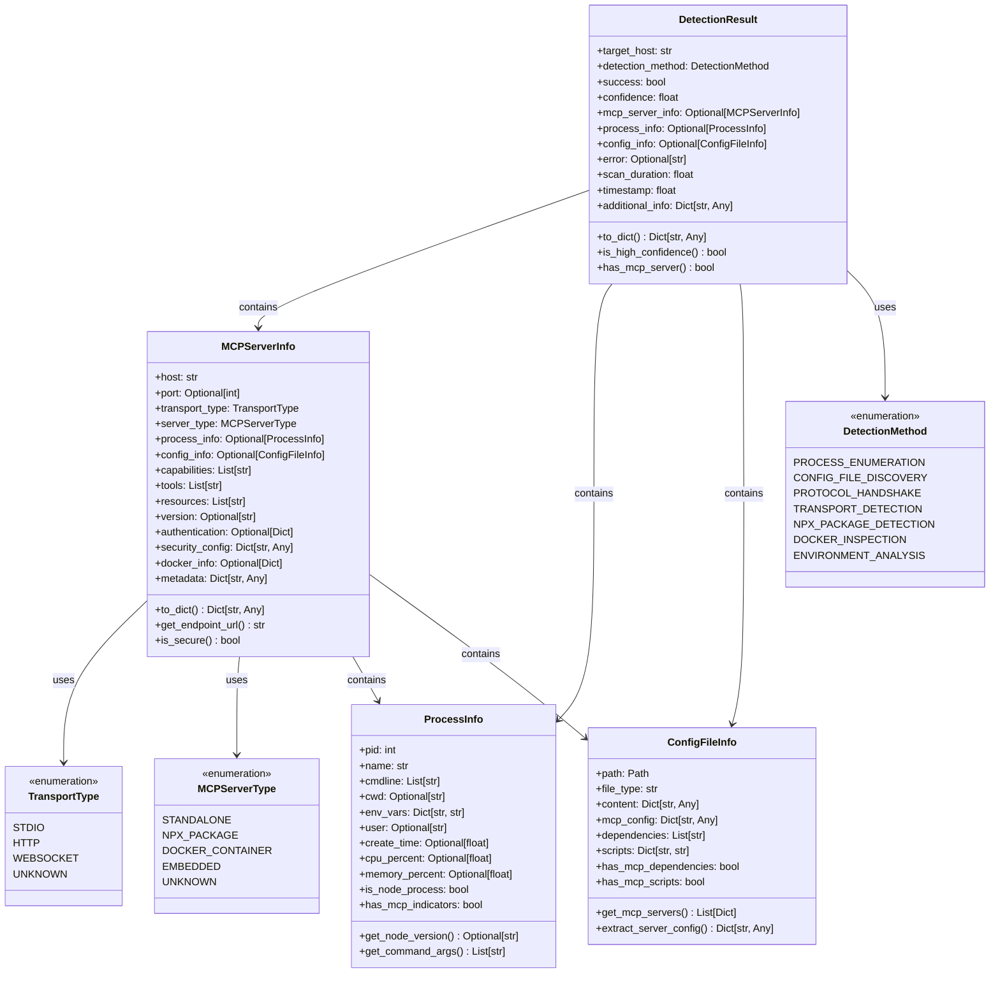
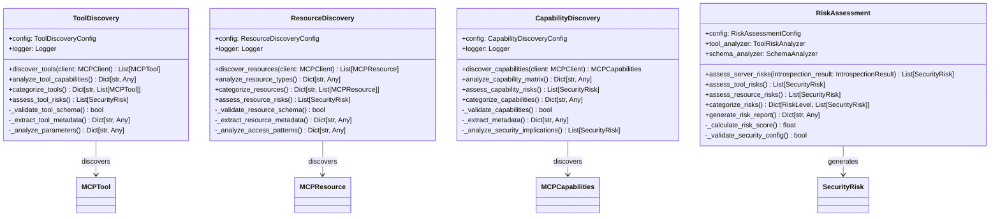
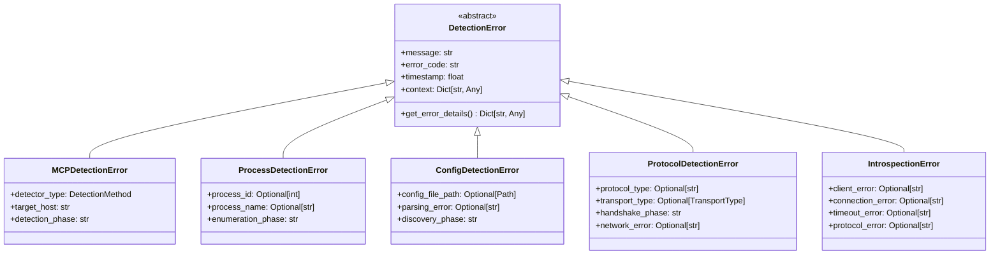
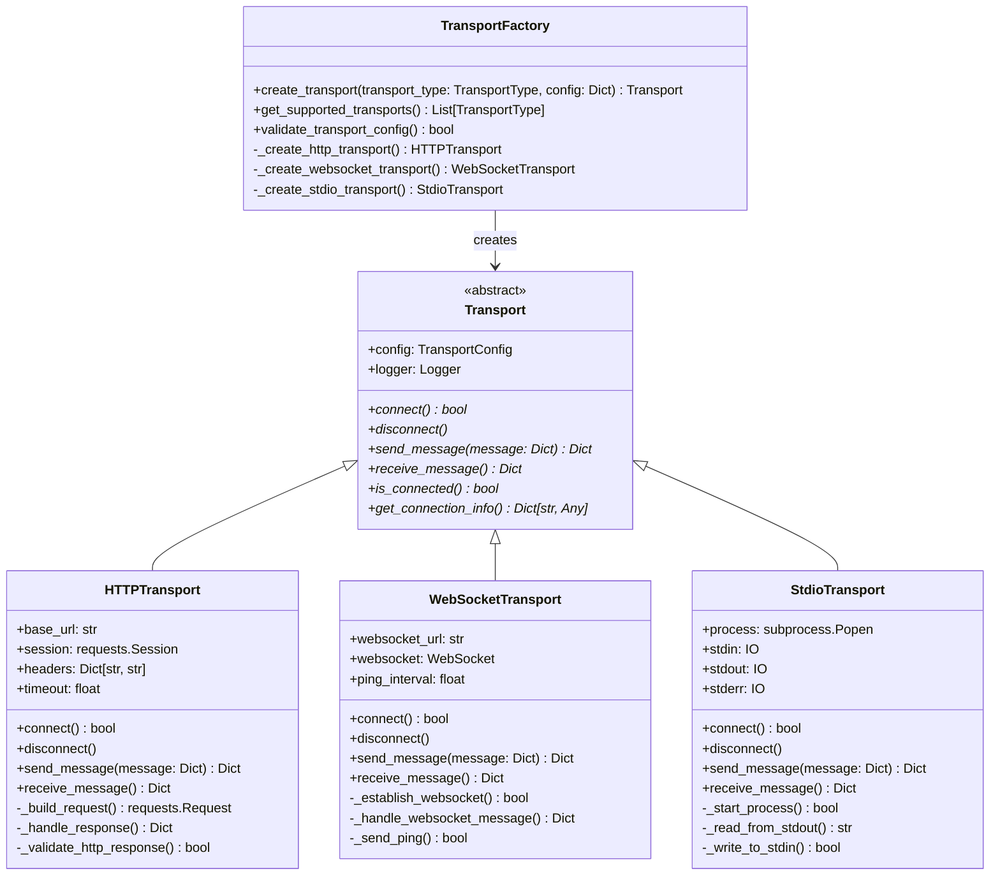
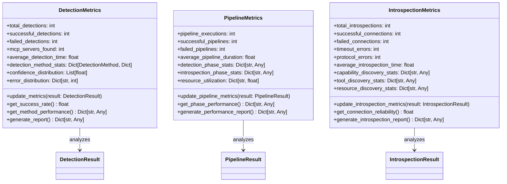

# Detect Command Class Diagram

## Overview

The Detection Module provides comprehensive MCP server discovery capabilities through multiple detection methods. It implements an abstract base class pattern with concrete detector implementations, orchestrated by a unified detection pipeline with enhanced MCP introspection capabilities.

## Core Architecture

```mermaid
classDiagram
    class MCPDetector {
        <<abstract>>
        +settings: ScanSettings
        +logger: Logger
        +_results: List[DetectionResult]
        +_detection_stats: Dict[str, Any]
        +detect(target_host: str, **kwargs) DetectionResult*
        +get_detection_method() DetectionMethod*
        +detect_multiple(targets: List[str]) List[DetectionResult]
        +get_results() List[DetectionResult]
        +get_statistics() Dict[str, Any]
        +clear_results()
        #_create_mcp_server_info() MCPServerInfo
        #_update_statistics()
    }

    class ProcessEnumerator {
        +mcp_keywords: List[str]
        +node_executables: List[str]
        +detect(target_host: str, **kwargs) DetectionResult
        +get_detection_method() DetectionMethod
        -_enumerate_processes() List[ProcessInfo]
        -_analyze_node_process() Optional[MCPServerInfo]
        -_extract_environment_vars() Dict[str, str]
        -_detect_mcp_indicators() bool
        -_analyze_command_line() Dict[str, Any]
    }

    class ConfigFileDiscovery {
        +config_patterns: List[str]
        +mcp_patterns: List[str]
        +detect(target_host: str, **kwargs) DetectionResult
        +get_detection_method() DetectionMethod
        -_discover_config_files() List[ConfigFileInfo]
        -_analyze_package_json() Dict[str, Any]
        -_analyze_mcp_config() Dict[str, Any]
        -_extract_dependencies() List[str]
        -_check_mcp_dependencies() bool
    }

    class ProtocolVerifier {
        +supported_transports: List[TransportType]
        +common_ports: List[int]
        +detect(target_host: str, **kwargs) DetectionResult
        +get_detection_method() DetectionMethod
        -_verify_http_mcp() Optional[MCPServerInfo]
        -_verify_websocket_mcp() Optional[MCPServerInfo]
        -_perform_mcp_handshake() bool
        -_test_mcp_protocol() Dict[str, Any]
        -_validate_mcp_response() bool
    }

    class TransportDetector {
        +transport_patterns: Dict[TransportType, List[str]]
        +detect(target_host: str, **kwargs) DetectionResult
        +get_detection_method() DetectionMethod
        -_detect_http_transport() Optional[TransportType]
        -_detect_websocket_transport() Optional[TransportType]
        -_detect_stdio_transport() Optional[TransportType]
        -_analyze_network_traffic() Dict[str, Any]
        -_check_port_services() List[int]
    }

    class NPXDetector {
        +npx_packages: List[str]
        +package_patterns: List[str]
        +detect(target_host: str, **kwargs) DetectionResult
        +get_detection_method() DetectionMethod
        -_discover_npx_packages() List[str]
        -_analyze_package_info() Dict[str, Any]
        -_check_mcp_package() bool
        -_extract_package_metadata() Dict[str, Any]
        -_validate_mcp_server() bool
    }

    class DockerInspector {
        +docker_patterns: List[str]
        +image_patterns: List[str]
        +detect(target_host: str, **kwargs) DetectionResult
        +get_detection_method() DetectionMethod
        -_inspect_containers() List[Dict[str, Any]]
        -_analyze_container_config() Dict[str, Any]
        -_check_mcp_indicators() bool
        -_extract_environment() Dict[str, str]
        -_analyze_dockerfile() Optional[Dict[str, Any]]
    }

    class EnvironmentAnalyzer {
        +env_patterns: List[str]
        +system_paths: List[str]
        +detect(target_host: str, **kwargs) DetectionResult
        +get_detection_method() DetectionMethod
        -_analyze_system_environment() Dict[str, Any]
        -_check_path_variables() List[str]
        -_scan_system_directories() List[str]
        -_detect_node_installations() List[str]
        -_analyze_runtime_environment() Dict[str, Any]
    }

    MCPDetector <|-- ProcessEnumerator
    MCPDetector <|-- ConfigFileDiscovery
    MCPDetector <|-- ProtocolVerifier
    MCPDetector <|-- TransportDetector
    MCPDetector <|-- NPXDetector
    MCPDetector <|-- DockerInspector
    MCPDetector <|-- EnvironmentAnalyzer
```

## Detection Pipeline Architecture

## MCP Introspection System

## Data Models and Enumerations

## Discovery and Analysis Components

## Error Handling Hierarchy

## Transport Layer Architecture

## Detection Statistics and Metrics

## Key Relationships

### Inheritance Relationships
- **MCPDetector** (Abstract Base Class)
  - **ProcessEnumerator**: Process-based detection
  - **ConfigFileDiscovery**: Configuration file analysis
  - **ProtocolVerifier**: Protocol-level verification
  - **TransportDetector**: Transport layer detection
  - **NPXDetector**: NPX package-based detection
  - **DockerInspector**: Container-based detection
  - **EnvironmentAnalyzer**: System environment analysis

### Composition Relationships
- **DetectionPipeline** orchestrates multiple **MCPDetector** instances
- **DetectionPipeline** integrates **MCPIntrospector** for enhanced analysis
- **MCPIntrospector** uses **MCPClient** for server communication
- **DetectionResult** contains **MCPServerInfo**, **ProcessInfo**, and **ConfigFileInfo**

### Aggregation Relationships
- **PipelineResult** aggregates multiple **DetectionResult** and **IntrospectionResult**
- **MCPServerInfo** aggregates **ProcessInfo** and **ConfigFileInfo**
- **IntrospectionResult** aggregates **MCPCapabilities**, **MCPTool**, and **MCPResource**

## Design Patterns Implemented

### 1. Abstract Base Class (ABC) Pattern
- **MCPDetector** defines the interface for all detection methods
- Ensures consistent behavior across different detection strategies
- Enables polymorphic treatment of detectors in the pipeline

### 2. Strategy Pattern
- Different detection methods implement various strategies
- **DetectionPipeline** can dynamically select and configure detectors
- Enables runtime switching of detection approaches

### 3. Factory Pattern
- **TransportFactory** creates appropriate transport implementations
- **DetectionPipeline** factory method `create_detection_pipeline()`
- Abstracts object creation complexity

### 4. Template Method Pattern
- **MCPDetector** provides template methods for common operations
- Subclasses implement specific detection logic
- Ensures consistent statistics tracking and error handling

### 5. Facade Pattern
- **DetectionPipeline** provides simplified interface to complex detection subsystem
- **MCPIntrospector** facades the introspection subsystem
- Hides complexity from clients

### 6. Observer Pattern (Implicit)
- Detection metrics collection observes detection results
- Pipeline statistics track execution phases
- Enables monitoring and analysis capabilities

## Component Responsibilities

### Detection Components
- **ProcessEnumerator**: Discovers Node.js processes with MCP indicators
- **ConfigFileDiscovery**: Locates and analyzes MCP configuration files
- **ProtocolVerifier**: Validates MCP protocol implementations
- **TransportDetector**: Identifies MCP transport mechanisms
- **NPXDetector**: Discovers NPX-based MCP server packages
- **DockerInspector**: Analyzes containerized MCP deployments
- **EnvironmentAnalyzer**: Examines system environment for MCP indicators

### Orchestration Components
- **DetectionPipeline**: Coordinates multiple detection methods
- **PipelineConfig**: Configures pipeline behavior and detector settings
- **PipelineResult**: Aggregates and presents detection results

### Enhanced Capabilities
- **MCPIntrospector**: Performs deep MCP server analysis
- **MCPClient**: Handles MCP protocol communication
- **ToolDiscovery**: Discovers and analyzes MCP tools
- **ResourceDiscovery**: Discovers and analyzes MCP resources
- **RiskAssessment**: Evaluates security risks and vulnerabilities

### Data Models
- **DetectionResult**: Encapsulates single detection outcome
- **MCPServerInfo**: Comprehensive MCP server information
- **ProcessInfo**: Process-specific information
- **ConfigFileInfo**: Configuration file details
- **IntrospectionResult**: Enhanced introspection findings

This architecture provides a comprehensive, extensible, and maintainable foundation for MCP server detection with both traditional discovery methods and advanced introspection capabilities. 