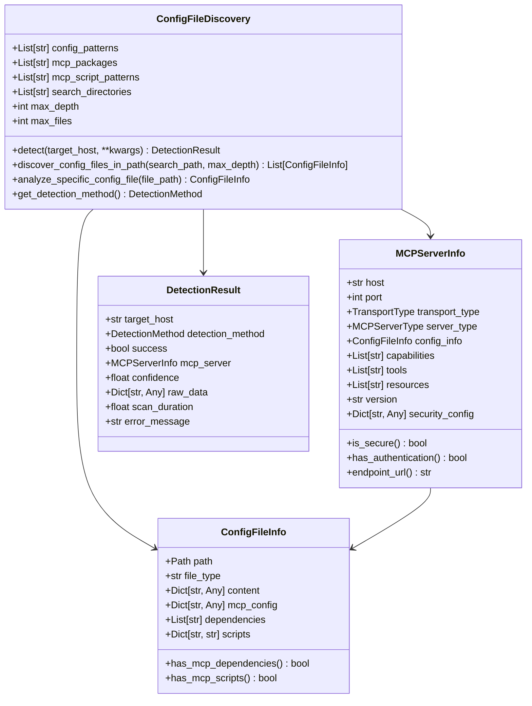
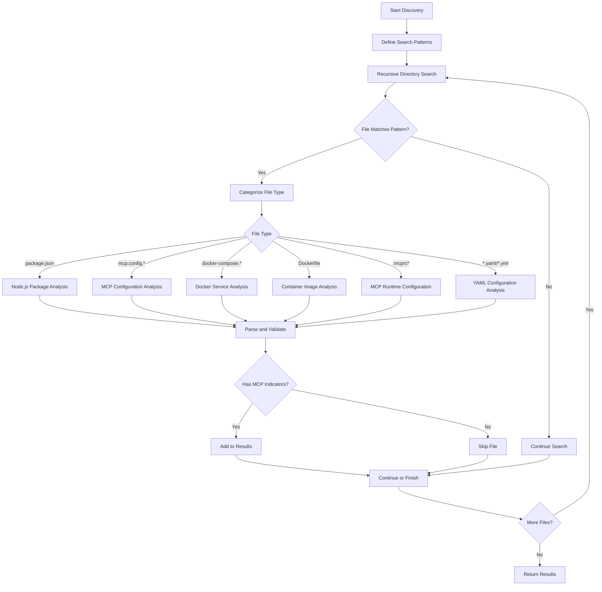
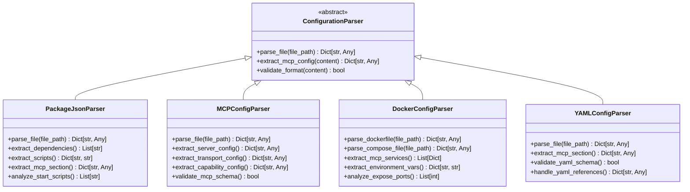
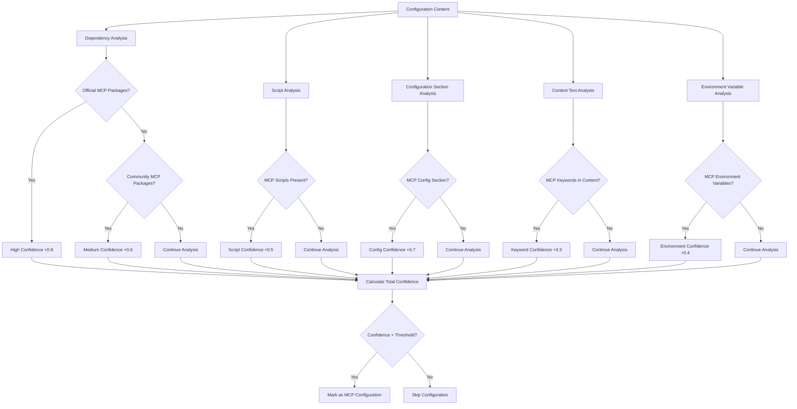
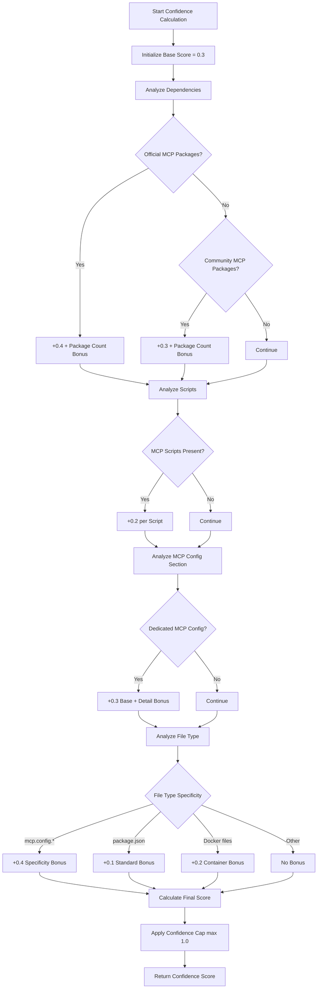
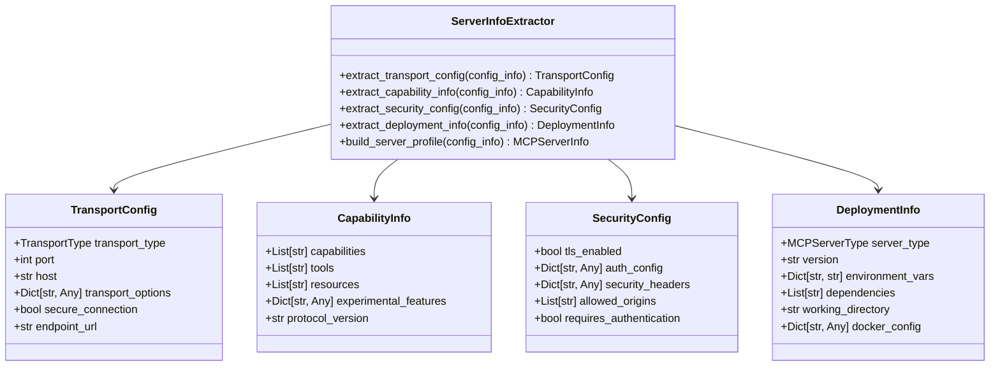
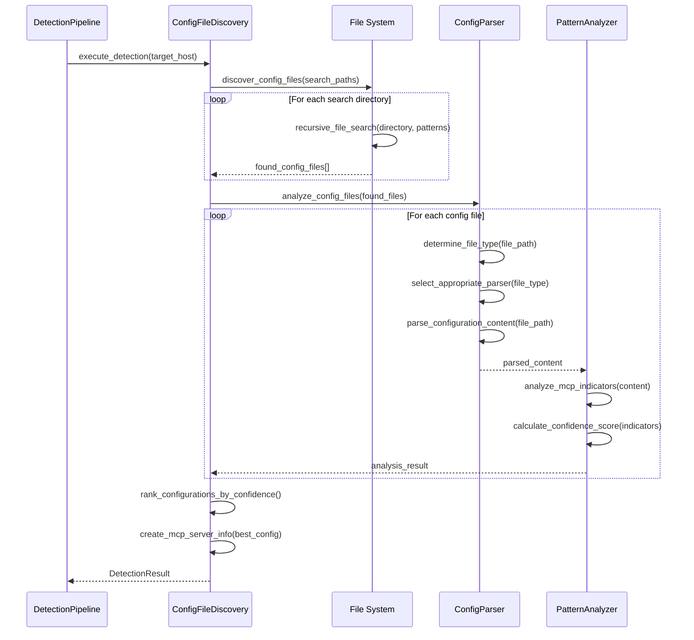

# Configuration Discovery System Documentation

## Overview

The Configuration Discovery System is a sophisticated component of the MCP detection pipeline that identifies MCP servers through comprehensive analysis of configuration files. This system specializes in discovering and parsing various configuration file formats including package.json, MCP-specific configuration files, Docker configurations, and environment files to detect MCP server deployments and extract detailed server information.

## System Architecture

### Core Components

The configuration discovery system consists of five main architectural layers:

1. **File Discovery Engine** - Recursive file system search and pattern matching
2. **Configuration Parser** - Multi-format file parsing and content extraction
3. **Pattern Analysis Engine** - MCP-specific indicator detection and validation
4. **Confidence Assessment** - Scoring and ranking of configuration matches
5. **Server Information Extraction** - Construction of comprehensive MCP server profiles

### High-Level Architecture



## File Discovery Architecture

### Multi-Format Configuration Detection

The system implements comprehensive file discovery across multiple configuration formats commonly used in MCP deployments:



### Configuration File Pattern Registry

```python
# Primary configuration file patterns
config_patterns = [
    'package.json',           # Node.js package configuration
    'mcp.config.js',         # JavaScript MCP configuration
    'mcp.config.json',       # JSON MCP configuration  
    'mcp-server.json',       # MCP server-specific configuration
    '.mcprc',                # MCP runtime configuration
    '.mcprc.json',           # JSON MCP runtime configuration
    'mcp.yaml',              # YAML MCP configuration
    'mcp.yml',               # YAML MCP configuration (alt)
    'docker-compose.yml',    # Docker Compose services
    'docker-compose.yaml',   # Docker Compose services (alt)
    'Dockerfile',            # Docker container definitions
]

# MCP-related package identifiers
mcp_packages = [
    '@modelcontextprotocol/sdk',     # Official MCP SDK
    '@modelcontextprotocol/server',  # Official MCP server
    '@modelcontextprotocol/client',  # Official MCP client
    'mcp-server',                    # Generic MCP server packages
    'mcp-client',                    # Generic MCP client packages
    '@mcp/',                         # MCP scoped packages
]

# MCP script pattern matching
mcp_script_patterns = [
    r'mcp[_-]?server',                    # MCP server scripts
    r'mcp[_-]?client',                    # MCP client scripts  
    r'model[_-]?context[_-]?protocol',    # Full protocol name
    r'@modelcontextprotocol',             # Official package references
]
```

## Configuration Parsing Engine

### Multi-Format Parser Architecture

The system implements specialized parsers for different configuration file formats:



### Package.json Analysis Implementation

```python
def _parse_package_json(self, file_path: Path) -> Dict[str, Any]:
    """Parse and analyze package.json for MCP indicators."""
    with open(file_path, 'r', encoding='utf-8') as f:
        package_data = json.load(f)
    
    # Extract all dependency types
    all_dependencies = []
    dependency_types = [
        'dependencies', 'devDependencies', 
        'peerDependencies', 'optionalDependencies'
    ]
    
    for dep_type in dependency_types:
        deps = package_data.get(dep_type, {})
        all_dependencies.extend(deps.keys())
    
    # Extract and analyze scripts
    scripts = package_data.get('scripts', {})
    mcp_scripts = {}
    
    for script_name, script_command in scripts.items():
        if self._is_mcp_script(script_command):
            mcp_scripts[script_name] = script_command
    
    # Extract MCP-specific configuration section
    mcp_config = package_data.get('mcp', {})
    
    return {
        'package_data': package_data,
        'dependencies': all_dependencies,
        'scripts': scripts,
        'mcp_scripts': mcp_scripts,
        'mcp_config': mcp_config,
        'has_mcp_deps': self._has_mcp_dependencies(all_dependencies),
        'has_mcp_scripts': bool(mcp_scripts)
    }

def _is_mcp_script(self, script_command: str) -> bool:
    """Check if a script command indicates MCP usage."""
    for pattern in self.mcp_script_patterns:
        if re.search(pattern, script_command, re.IGNORECASE):
            return True
    return False
```

### Docker Configuration Analysis

```python
def _parse_dockerfile(self, file_path: Path) -> Dict[str, Any]:
    """Parse Dockerfile for MCP-related content."""
    dockerfile_content = {
        'type': 'dockerfile',
        'instructions': [],
        'mcp_indicators': [],
        'exposed_ports': [],
        'environment_vars': {},
        'run_commands': []
    }
    
    with open(file_path, 'r', encoding='utf-8') as f:
        for line_num, line in enumerate(f, 1):
            line = line.strip()
            if line and not line.startswith('#'):
                instruction = line.split(' ', 1)
                cmd = instruction[0].upper()
                args = instruction[1] if len(instruction) > 1 else ''
                
                dockerfile_content['instructions'].append({
                    'line': line_num,
                    'command': cmd,
                    'arguments': args,
                    'full_instruction': line
                })
                
                # Analyze for MCP indicators
                if cmd == 'RUN' and self._contains_mcp_patterns(args):
                    dockerfile_content['mcp_indicators'].append({
                        'type': 'run_command',
                        'line': line_num,
                        'content': args
                    })
                elif cmd == 'EXPOSE':
                    try:
                        port = int(args.split()[0])
                        dockerfile_content['exposed_ports'].append(port)
                    except (ValueError, IndexError):
                        pass
                elif cmd == 'ENV' and 'mcp' in args.lower():
                    env_parts = args.split('=', 1)
                    if len(env_parts) == 2:
                        dockerfile_content['environment_vars'][env_parts[0].strip()] = env_parts[1].strip()
                        dockerfile_content['mcp_indicators'].append({
                            'type': 'environment_variable',
                            'line': line_num,
                            'variable': env_parts[0].strip(),
                            'value': env_parts[1].strip()
                        })
    
    return dockerfile_content

def _parse_docker_compose(self, file_path: Path) -> Dict[str, Any]:
    """Parse docker-compose file for MCP services."""
    try:
        import yaml
        with open(file_path, 'r', encoding='utf-8') as f:
            compose_data = yaml.safe_load(f) or {}
        
        # Analyze services for MCP indicators
        services = compose_data.get('services', {})
        mcp_services = {}
        
        for service_name, service_config in services.items():
            if self._is_mcp_service(service_config):
                mcp_services[service_name] = {
                    'config': service_config,
                    'mcp_indicators': self._extract_service_mcp_indicators(service_config),
                    'transport_hints': self._analyze_service_transport(service_config),
                    'port_mappings': service_config.get('ports', []),
                    'environment': service_config.get('environment', {}),
                    'command': service_config.get('command', ''),
                    'image': service_config.get('image', '')
                }
        
        return {
            'compose_data': compose_data,
            'all_services': services,
            'mcp_services': mcp_services,
            'has_mcp_services': bool(mcp_services)
        }
        
    except ImportError:
        self.logger.debug("PyYAML not available for docker-compose parsing")
        return {}
    except Exception as e:
        self.logger.debug(f"Failed to parse docker-compose file: {e}")
        return {}
```

## Pattern Analysis Engine

### MCP Indicator Detection System

The system implements sophisticated pattern analysis to identify MCP-related indicators across different configuration contexts:



### Advanced Pattern Matching Algorithms

#### 1. Dependency Analysis
```python
def _analyze_dependencies(self, dependencies: List[str]) -> Dict[str, Any]:
    """Analyze dependencies for MCP indicators."""
    analysis = {
        'official_mcp_packages': [],
        'community_mcp_packages': [],
        'potential_mcp_packages': [],
        'total_mcp_related': 0,
        'confidence_boost': 0.0
    }
    
    for dep in dependencies:
        if dep.startswith('@modelcontextprotocol/'):
            analysis['official_mcp_packages'].append(dep)
            analysis['confidence_boost'] += 0.2
        elif any(pattern in dep.lower() for pattern in ['mcp-server', 'mcp-client']):
            analysis['community_mcp_packages'].append(dep)
            analysis['confidence_boost'] += 0.15
        elif 'mcp' in dep.lower():
            analysis['potential_mcp_packages'].append(dep)
            analysis['confidence_boost'] += 0.1
    
    analysis['total_mcp_related'] = (
        len(analysis['official_mcp_packages']) +
        len(analysis['community_mcp_packages']) +
        len(analysis['potential_mcp_packages'])
    )
    
    # Cap confidence boost to prevent over-weighting
    analysis['confidence_boost'] = min(analysis['confidence_boost'], 0.6)
    
    return analysis
```

#### 2. Script Pattern Analysis
```python
def _analyze_scripts(self, scripts: Dict[str, str]) -> Dict[str, Any]:
    """Analyze package.json scripts for MCP patterns."""
    script_analysis = {
        'mcp_scripts': {},
        'server_scripts': {},
        'client_scripts': {},
        'dev_scripts': {},
        'patterns_found': [],
        'confidence_boost': 0.0
    }
    
    for script_name, script_command in scripts.items():
        script_lower = script_command.lower()
        
        # Check for direct MCP patterns
        for pattern in self.mcp_script_patterns:
            if re.search(pattern, script_command, re.IGNORECASE):
                script_analysis['mcp_scripts'][script_name] = script_command
                script_analysis['patterns_found'].append({
                    'script': script_name,
                    'pattern': pattern,
                    'command': script_command
                })
                script_analysis['confidence_boost'] += 0.1
        
        # Categorize by script type
        if 'server' in script_lower or 'serve' in script_lower:
            script_analysis['server_scripts'][script_name] = script_command
            if 'mcp' in script_lower:
                script_analysis['confidence_boost'] += 0.15
        elif 'client' in script_lower:
            script_analysis['client_scripts'][script_name] = script_command
            if 'mcp' in script_lower:
                script_analysis['confidence_boost'] += 0.1
        elif script_name in ['dev', 'develop', 'development']:
            script_analysis['dev_scripts'][script_name] = script_command
    
    # Cap confidence boost
    script_analysis['confidence_boost'] = min(script_analysis['confidence_boost'], 0.4)
    
    return script_analysis
```

#### 3. Configuration Section Analysis
```python
def _analyze_mcp_config_section(self, mcp_config: Dict[str, Any]) -> Dict[str, Any]:
    """Analyze dedicated MCP configuration section."""
    config_analysis = {
        'has_transport_config': False,
        'has_capability_config': False,
        'has_tool_config': False,
        'has_resource_config': False,
        'has_security_config': False,
        'transport_type': None,
        'port': None,
        'capabilities': [],
        'tools': [],
        'resources': [],
        'confidence_boost': 0.0
    }
    
    if not mcp_config:
        return config_analysis
    
    # Base boost for having MCP config section
    config_analysis['confidence_boost'] = 0.3
    
    # Analyze transport configuration
    if 'transport' in mcp_config or 'port' in mcp_config:
        config_analysis['has_transport_config'] = True
        config_analysis['confidence_boost'] += 0.2
        
        transport = mcp_config.get('transport', {})
        if isinstance(transport, dict):
            config_analysis['transport_type'] = transport.get('type')
        elif isinstance(transport, str):
            config_analysis['transport_type'] = transport
        
        config_analysis['port'] = mcp_config.get('port')
    
    # Analyze capabilities
    if 'capabilities' in mcp_config:
        config_analysis['has_capability_config'] = True
        config_analysis['confidence_boost'] += 0.15
        
        caps = mcp_config['capabilities']
        if isinstance(caps, list):
            config_analysis['capabilities'] = caps
        elif isinstance(caps, dict):
            config_analysis['capabilities'] = list(caps.keys())
    
    # Analyze tools
    if 'tools' in mcp_config:
        config_analysis['has_tool_config'] = True
        config_analysis['confidence_boost'] += 0.1
        
        tools = mcp_config['tools']
        if isinstance(tools, list):
            config_analysis['tools'] = tools
        elif isinstance(tools, dict):
            config_analysis['tools'] = list(tools.keys())
    
    # Analyze resources
    if 'resources' in mcp_config:
        config_analysis['has_resource_config'] = True
        config_analysis['confidence_boost'] += 0.1
        
        resources = mcp_config['resources']
        if isinstance(resources, list):
            config_analysis['resources'] = resources
        elif isinstance(resources, dict):
            config_analysis['resources'] = list(resources.keys())
    
    # Analyze security configuration
    if 'security' in mcp_config or 'auth' in mcp_config:
        config_analysis['has_security_config'] = True
        config_analysis['confidence_boost'] += 0.1
    
    # Cap confidence boost
    config_analysis['confidence_boost'] = min(config_analysis['confidence_boost'], 0.8)
    
    return config_analysis
```

## Confidence Scoring System

### Multi-Factor Confidence Algorithm

The system implements a sophisticated confidence scoring algorithm that considers multiple factors:



### Confidence Calculation Implementation

```python
def _calculate_config_confidence(self, config_info: ConfigFileInfo) -> float:
    """Calculate comprehensive confidence score for MCP detection."""
    confidence = 0.0
    
    # Base confidence for having any MCP indicators
    confidence += 0.3
    
    # Dependency-based confidence boost
    if config_info.has_mcp_dependencies:
        confidence += 0.4
        
        # Bonus for official MCP packages
        official_packages = [
            pkg for pkg in config_info.dependencies 
            if pkg.startswith('@modelcontextprotocol/')
        ]
        confidence += min(len(official_packages) * 0.1, 0.2)
        
        # Bonus for multiple MCP-related packages
        mcp_related_count = sum(
            1 for pkg in config_info.dependencies
            if any(pattern in pkg.lower() for pattern in ['mcp', 'model-context-protocol'])
        )
        confidence += min(mcp_related_count * 0.05, 0.15)
    
    # Script-based confidence boost
    if config_info.has_mcp_scripts:
        confidence += 0.2
        
        # Additional boost for multiple MCP scripts
        mcp_script_count = sum(
            1 for script in config_info.scripts.values()
            if any(pattern in script.lower() for pattern in ['mcp', 'model-context-protocol'])
        )
        confidence += min(mcp_script_count * 0.05, 0.1)
    
    # MCP configuration section boost
    if config_info.mcp_config:
        confidence += 0.3
        
        # Additional boost for detailed MCP configuration
        if isinstance(config_info.mcp_config, dict):
            config_detail_score = len(config_info.mcp_config) * 0.02
            confidence += min(config_detail_score, 0.1)
            
            # Specific boosts for important config sections
            important_sections = ['transport', 'capabilities', 'tools', 'resources', 'security']
            section_count = sum(1 for section in important_sections if section in config_info.mcp_config)
            confidence += min(section_count * 0.03, 0.15)
    
    # File type specificity boost
    file_type_boosts = {
        'mcp.config.js': 0.4,
        'mcp.config.json': 0.4,
        'mcp-server.json': 0.4,
        '.mcprc': 0.35,
        '.mcprc.json': 0.35,
        'mcp.yaml': 0.3,
        'mcp.yml': 0.3,
        'package.json': 0.1,
        'docker-compose.yml': 0.2,
        'docker-compose.yaml': 0.2,
        'dockerfile': 0.15
    }
    
    confidence += file_type_boosts.get(config_info.file_type.lower(), 0.0)
    
    # Context-based adjustments
    content_str = json.dumps(config_info.content).lower()
    
    # Boost for explicit MCP references in content
    explicit_mcp_count = content_str.count('model-context-protocol') + content_str.count('@modelcontextprotocol')
    confidence += min(explicit_mcp_count * 0.05, 0.1)
    
    # Boost for transport-related configuration
    transport_keywords = ['http', 'websocket', 'stdio', 'sse', 'port']
    transport_indicators = sum(1 for keyword in transport_keywords if keyword in content_str)
    if transport_indicators >= 2:
        confidence += 0.05
    
    # Apply confidence cap
    return min(confidence, 1.0)
```

## Server Information Extraction

### Comprehensive Server Profile Construction

The system extracts detailed server information from configuration files:



### Server Information Extraction Implementation

```python
def _create_mcp_server_from_config(self, config_info: ConfigFileInfo, host: str) -> MCPServerInfo:
    """Create comprehensive MCP server information from configuration."""
    
    # Extract core server properties
    port = self._extract_port_from_config(config_info)
    transport_type = self._determine_transport_type(config_info)
    server_type = self._determine_server_type(config_info)
    
    # Extract capability information
    capabilities = self._extract_capabilities(config_info)
    tools = self._extract_tools(config_info)
    resources = self._extract_resources(config_info)
    
    # Extract deployment information
    version = self._extract_version(config_info)
    security_config = self._extract_security_config(config_info)
    environment_info = self._extract_environment_info(config_info)
    
    # Build comprehensive server profile
    server_info = MCPServerInfo(
        host=host,
        port=port,
        transport_type=transport_type,
        server_type=server_type,
        config_info=config_info,
        capabilities=capabilities,
        tools=tools,
        resources=resources,
        version=version,
        security_config=security_config,
        environment_info=environment_info
    )
    
    return server_info

def _extract_port_from_config(self, config_info: ConfigFileInfo) -> Optional[int]:
    """Extract port number from various configuration sources."""
    
    # Priority 1: Direct MCP configuration
    if config_info.mcp_config:
        port = config_info.mcp_config.get('port')
        if port:
            return int(port)
        
        # Check transport configuration
        transport = config_info.mcp_config.get('transport', {})
        if isinstance(transport, dict):
            port = transport.get('port')
            if port:
                return int(port)
    
    # Priority 2: Script arguments
    for script_name, script_command in config_info.scripts.items():
        # Check for --port=XXXX or -p=XXXX patterns
        port_patterns = [
            r'--port[=\s]+(\d+)',
            r'-p[=\s]+(\d+)',
            r'port[=\s]+(\d+)'
        ]
        
        for pattern in port_patterns:
            match = re.search(pattern, script_command, re.IGNORECASE)
            if match:
                return int(match.group(1))
    
    # Priority 3: General content analysis
    content_str = json.dumps(config_info.content)
    
    # Look for port definitions in JSON
    port_patterns = [
        r'"port":\s*(\d+)',
        r'"PORT":\s*(\d+)',
        r'"server_port":\s*(\d+)',
        r'"listen_port":\s*(\d+)'
    ]
    
    for pattern in port_patterns:
        match = re.search(pattern, content_str)
        if match:
            return int(match.group(1))
    
    # Priority 4: Docker-specific port extraction
    if config_info.file_type.startswith('docker'):
        docker_ports = self._extract_docker_ports(config_info.content)
        if docker_ports:
            return docker_ports[0]  # Return first port found
    
    return None

def _determine_transport_type(self, config_info: ConfigFileInfo) -> TransportType:
    """Determine transport type from configuration analysis."""
    content_str = json.dumps(config_info.content).lower()
    
    # Priority 1: Explicit transport configuration
    if config_info.mcp_config:
        transport = config_info.mcp_config.get('transport')
        if transport:
            if isinstance(transport, dict):
                transport_type = transport.get('type', '').lower()
            else:
                transport_type = str(transport).lower()
            
            transport_mapping = {
                'http': TransportType.HTTP,
                'https': TransportType.HTTP,
                'websocket': TransportType.WEBSOCKET,
                'ws': TransportType.WEBSOCKET,
                'wss': TransportType.WEBSOCKET,
                'stdio': TransportType.STDIO,
                'sse': TransportType.SSE
            }
            
            return transport_mapping.get(transport_type, TransportType.UNKNOWN)
    
    # Priority 2: URL-based detection
    if any(protocol in content_str for protocol in ['http://', 'https://']):
        if 'websocket' in content_str or 'ws://' in content_str or 'wss://' in content_str:
            return TransportType.WEBSOCKET
        elif 'sse' in content_str or 'server-sent-events' in content_str:
            return TransportType.SSE
        else:
            return TransportType.HTTP
    
    # Priority 3: Script-based detection
    for script in config_info.scripts.values():
        script_lower = script.lower()
        if 'websocket' in script_lower or '--ws' in script_lower:
            return TransportType.WEBSOCKET
        elif '--http' in script_lower or 'http-server' in script_lower:
            return TransportType.HTTP
        elif '--stdio' in script_lower or 'stdio' in script_lower:
            return TransportType.STDIO
    
    # Priority 4: Port-based inference
    port = self._extract_port_from_config(config_info)
    if port:
        if port in [80, 443, 8080, 8443, 3000, 5000]:
            return TransportType.HTTP
        elif port in [8081, 8082, 9001, 9002]:
            return TransportType.WEBSOCKET
        else:
            return TransportType.HTTP  # Default for network ports
    
    # Priority 5: Content pattern analysis
    if 'stdio' in content_str:
        return TransportType.STDIO
    elif 'websocket' in content_str:
        return TransportType.WEBSOCKET
    elif any(indicator in content_str for indicator in ['http', 'express', 'fastify']):
        return TransportType.HTTP
    
    return TransportType.UNKNOWN
```

## Docker Configuration Analysis

### Container and Compose File Processing

The system provides specialized analysis for Docker-based MCP deployments:

```python
def _analyze_docker_configuration(self, config_info: ConfigFileInfo) -> Dict[str, Any]:
    """Comprehensive Docker configuration analysis."""
    docker_analysis = {
        'container_type': None,
        'mcp_services': [],
        'port_mappings': [],
        'environment_variables': {},
        'volume_mounts': [],
        'network_config': {},
        'security_context': {},
        'mcp_indicators': []
    }
    
    if config_info.file_type.lower() == 'dockerfile':
        docker_analysis.update(self._analyze_dockerfile(config_info.content))
    elif config_info.file_type.lower().startswith('docker-compose'):
        docker_analysis.update(self._analyze_compose_file(config_info.content))
    
    return docker_analysis

def _analyze_dockerfile(self, dockerfile_content: Dict[str, Any]) -> Dict[str, Any]:
    """Analyze Dockerfile for MCP-specific configuration."""
    analysis = {
        'base_image': None,
        'exposed_ports': [],
        'environment_vars': {},
        'run_commands': [],
        'mcp_install_commands': [],
        'working_directory': None,
        'entry_point': None,
        'cmd': None
    }
    
    for instruction in dockerfile_content.get('instructions', []):
        cmd = instruction['command']
        args = instruction['arguments']
        
        if cmd == 'FROM':
            analysis['base_image'] = args.strip()
        elif cmd == 'EXPOSE':
            try:
                port = int(args.split()[0])
                analysis['exposed_ports'].append(port)
            except (ValueError, IndexError):
                pass
        elif cmd == 'ENV':
            env_parts = args.split('=', 1)
            if len(env_parts) == 2:
                analysis['environment_vars'][env_parts[0].strip()] = env_parts[1].strip()
        elif cmd == 'RUN':
            analysis['run_commands'].append(args)
            if self._is_mcp_install_command(args):
                analysis['mcp_install_commands'].append(args)
        elif cmd == 'WORKDIR':
            analysis['working_directory'] = args.strip()
        elif cmd == 'ENTRYPOINT':
            analysis['entry_point'] = args.strip()
        elif cmd == 'CMD':
            analysis['cmd'] = args.strip()
    
    return analysis

def _is_mcp_install_command(self, command: str) -> bool:
    """Check if RUN command installs MCP-related packages."""
    command_lower = command.lower()
    
    # NPM/Yarn package installation
    if any(pkg_manager in command_lower for pkg_manager in ['npm install', 'yarn add', 'pnpm add']):
        return any(mcp_pkg in command_lower for mcp_pkg in [
            '@modelcontextprotocol',
            'mcp-server',
            'mcp-client',
            'model-context-protocol'
        ])
    
    # Python package installation
    if 'pip install' in command_lower:
        return any(mcp_pkg in command_lower for mcp_pkg in [
            'mcp-server',
            'mcp-client',
            'model-context-protocol'
        ])
    
    # Direct git cloning of MCP repositories
    if 'git clone' in command_lower:
        return any(repo_indicator in command_lower for repo_indicator in [
            'mcp-server',
            'model-context-protocol',
            'modelcontextprotocol'
        ])
    
    return False
```

## Error Handling and Validation

### Robust Configuration Processing

```python
def _safe_config_parsing(self, file_path: Path) -> Optional[Dict[str, Any]]:
    """Safely parse configuration files with comprehensive error handling."""
    try:
        file_extension = file_path.suffix.lower()
        file_name = file_path.name.lower()
        
        # Determine parser based on file characteristics
        if file_name == 'package.json':
            return self._parse_with_validation(file_path, self._parse_package_json)
        elif file_extension in ['.json', '.mcprc']:
            return self._parse_with_validation(file_path, self._parse_json_file)
        elif file_extension in ['.yml', '.yaml']:
            return self._parse_with_validation(file_path, self._parse_yaml_file)
        elif file_name.startswith('dockerfile'):
            return self._parse_with_validation(file_path, self._parse_dockerfile)
        elif file_name.startswith('docker-compose'):
            return self._parse_with_validation(file_path, self._parse_docker_compose)
        else:
            # Attempt text-based parsing for unknown file types
            return self._parse_with_validation(file_path, self._parse_text_file)
            
    except Exception as e:
        self.logger.debug(f"Failed to determine parser for {file_path}: {e}")
        return None

def _parse_with_validation(self, file_path: Path, parser_func) -> Optional[Dict[str, Any]]:
    """Parse file with validation and error recovery."""
    try:
        # Attempt primary parsing
        result = parser_func(file_path)
        
        # Validate result structure
        if not isinstance(result, dict):
            self.logger.debug(f"Parser returned non-dict result for {file_path}")
            return None
        
        return result
        
    except json.JSONDecodeError as e:
        self.logger.debug(f"JSON parsing error in {file_path}: {e}")
        return self._attempt_json_recovery(file_path)
    except UnicodeDecodeError as e:
        self.logger.debug(f"Encoding error in {file_path}: {e}")
        return self._attempt_encoding_recovery(file_path, parser_func)
    except Exception as e:
        self.logger.debug(f"Unexpected parsing error in {file_path}: {e}")
        return None

def _attempt_json_recovery(self, file_path: Path) -> Optional[Dict[str, Any]]:
    """Attempt to recover from JSON parsing errors."""
    try:
        # Try reading with different encodings
        for encoding in ['utf-8', 'utf-8-sig', 'latin-1', 'cp1252']:
            try:
                with open(file_path, 'r', encoding=encoding) as f:
                    content = f.read()
                
                # Attempt to fix common JSON issues
                content = self._fix_common_json_issues(content)
                
                return json.loads(content)
                
            except (UnicodeDecodeError, json.JSONDecodeError):
                continue
        
        return None
        
    except Exception as e:
        self.logger.debug(f"JSON recovery failed for {file_path}: {e}")
        return None

def _fix_common_json_issues(self, content: str) -> str:
    """Fix common JSON formatting issues."""
    # Remove trailing commas
    content = re.sub(r',(\s*[}\]])', r'\1', content)
    
    # Fix single quotes to double quotes
    content = re.sub(r"'([^']*)':", r'"\1":', content)
    
    # Remove comments (though not standard JSON)
    content = re.sub(r'//.*$', '', content, flags=re.MULTILINE)
    content = re.sub(r'/\*.*?\*/', '', content, flags=re.DOTALL)
    
    return content
```

## Integration with Detection Pipeline

### Pipeline Integration Architecture



## Usage Examples

### Basic Configuration Discovery

```python
from hawkeye.detection.config_discovery import ConfigFileDiscovery

# Initialize the configuration discovery system
config_discovery = ConfigFileDiscovery()

# Perform detection in current directory
result = config_discovery.detect(
    target_host="localhost",
    search_paths=["."],
    max_depth=3,
    include_docker=True
)

if result.success:
    server = result.mcp_server
    config = server.config_info
    
    print(f"Found MCP server configuration:")
    print(f"  Config file: {config.path}")
    print(f"  File type: {config.file_type}")
    print(f"  Transport: {server.transport_type}")
    print(f"  Port: {server.port}")
    print(f"  Capabilities: {server.capabilities}")
    print(f"  Confidence: {result.confidence:.2f}")
else:
    print(f"No MCP configurations found: {result.error_message}")
```

### Specific Directory Analysis

```python
# Analyze specific directory for MCP configurations
config_files = config_discovery.discover_config_files_in_path(
    search_path="./src/mcp-servers",
    max_depth=2
)

for config in config_files:
    print(f"Configuration: {config.path}")
    print(f"  Type: {config.file_type}")
    print(f"  Has MCP dependencies: {config.has_mcp_dependencies}")
    print(f"  Has MCP scripts: {config.has_mcp_scripts}")
    print(f"  MCP config section: {bool(config.mcp_config)}")
    
    confidence = config_discovery._calculate_config_confidence(config)
    print(f"  Confidence: {confidence:.2f}")
    print()
```

### Specific File Analysis

```python
# Analyze a specific configuration file
try:
    config_info = config_discovery.analyze_specific_config_file("./package.json")
    
    if config_info:
        print(f"File: {config_info.path}")
        print(f"Dependencies with MCP: {[dep for dep in config_info.dependencies if 'mcp' in dep.lower()]}")
        print(f"MCP scripts: {[name for name, script in config_info.scripts.items() if 'mcp' in script.lower()]}")
        
        if config_info.mcp_config:
            print(f"MCP configuration: {config_info.mcp_config}")
    else:
        print("No MCP indicators found in the configuration file")
        
except Exception as e:
    print(f"Error analyzing configuration file: {e}")
```

## Future Enhancements

### Planned Improvements

1. **Schema Validation**: JSON Schema validation for MCP configuration files
2. **Cloud Configuration Support**: Analysis of cloud deployment configurations (AWS, GCP, Azure)
3. **Kubernetes Manifest Analysis**: Support for Kubernetes deployment manifests
4. **Configuration Template Detection**: Recognition of common MCP configuration templates
5. **Dependency Graph Analysis**: Understanding of dependency relationships in complex configurations

### Advanced Features Roadmap

1. **Configuration Synthesis**: Generation of optimized MCP configurations based on detected patterns
2. **Migration Assistant**: Automated migration between different MCP configuration formats
3. **Security Configuration Analysis**: Advanced security assessment of MCP configurations
4. **Performance Configuration Optimization**: Analysis and recommendations for performance tuning
5. **Multi-Environment Configuration Management**: Support for environment-specific configuration analysis 