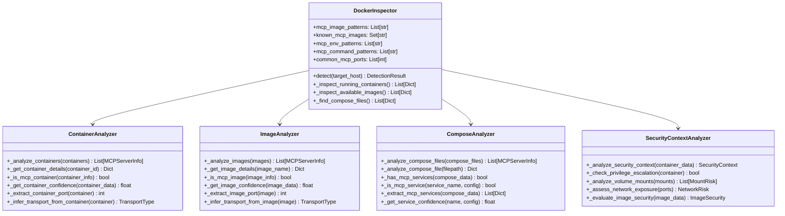
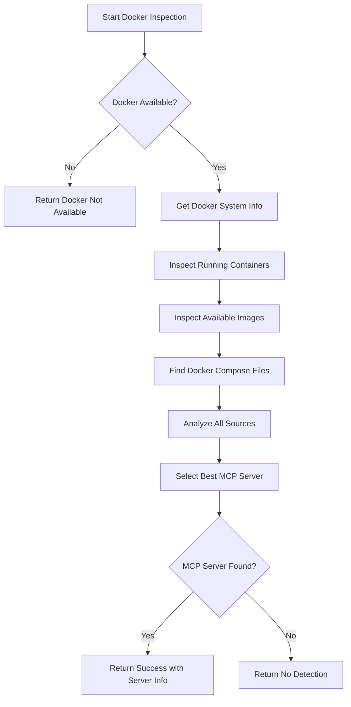
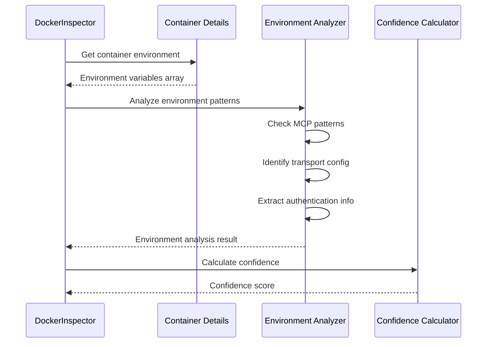
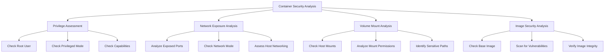
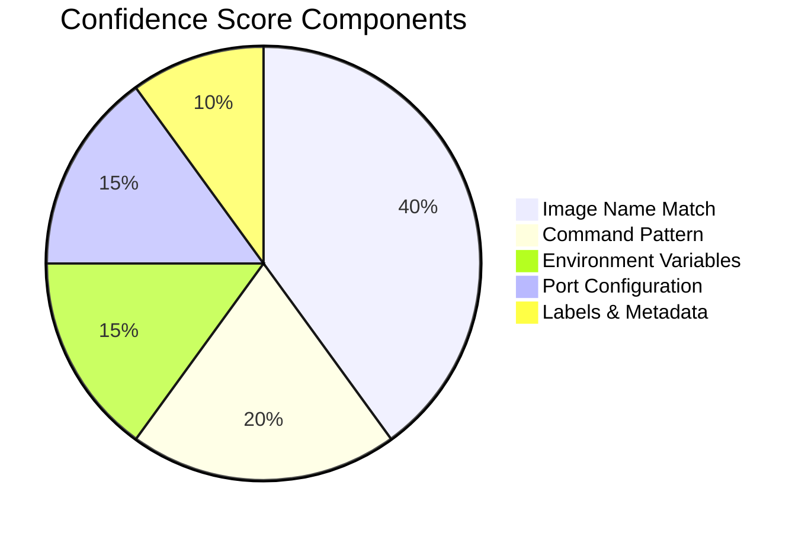

# Docker Container Inspection

## Overview

The Docker Container Inspection system provides comprehensive detection and analysis of MCP servers running in containerized environments. This sophisticated system examines running containers, available images, and docker-compose configurations to identify MCP server deployments, extract configuration details, and assess security contexts.

## Architecture

### Core Components



## Container Analysis

### Detection Process Flow



### Running Container Detection

The system identifies MCP servers in running containers through multiple indicators:

```python
def _inspect_running_containers(self) -> List[Dict[str, Any]]:
    """Inspect running Docker containers for MCP indicators."""
    containers = []
    
    # Get list of running containers
    result = subprocess.run(
        ['docker', 'ps', '--format', '{{json .}}'],
        capture_output=True, text=True, timeout=30
    )
    
    if result.returncode == 0:
        for line in result.stdout.strip().split('\n'):
            if line:
                container_info = json.loads(line)
                container_id = container_info.get('ID')
                
                if container_id and self._is_mcp_container(container_info):
                    # Get detailed container information
                    detailed_info = self._get_container_details(container_id)
                    if detailed_info:
                        containers.append(detailed_info)
    
    return containers
```

### Container Identification Criteria

#### Image Name Patterns
```python
mcp_image_patterns = [
    r'.*mcp.*',
    r'.*model-context-protocol.*',
    r'.*@modelcontextprotocol.*',
    r'node.*mcp.*',
    r'.*mcp-server.*',
]

known_mcp_images = {
    'modelcontextprotocol/server',
    'mcp/server',
    'mcp-server',
    'node:mcp-server',
}
```

#### Command Pattern Recognition
```python
mcp_command_patterns = [
    r'.*npx.*@modelcontextprotocol.*',
    r'.*node.*mcp.*',
    r'.*mcp-server.*',
    r'.*model-context-protocol.*',
]
```

#### Environment Variable Detection
```python
mcp_env_patterns = [
    r'MCP_.*',
    r'.*_MCP_.*',
    r'MODEL_CONTEXT_PROTOCOL_.*',
    r'.*MCP.*SERVER.*',
]
```

### Container Analysis Algorithm

```python
def _is_mcp_container(self, container_info: Dict[str, Any]) -> bool:
    """Check if a container appears to be running an MCP server."""
    
    # Check image name
    image = container_info.get('Image', '').lower()
    if self._is_mcp_image_name(image):
        return True
    
    # Check command
    command = container_info.get('Command', '').lower()
    for pattern in self.mcp_command_patterns:
        if re.search(pattern, command, re.IGNORECASE):
            return True
    
    # Check ports
    ports = container_info.get('Ports', '')
    for port in self.common_mcp_ports:
        if str(port) in ports:
            return True
    
    return False
```

## Environment Detection

### Environment Variable Analysis

The system performs comprehensive environment variable analysis to detect MCP-related configurations:



### Environment Variable Processing

```python
def _analyze_environment_variables(self, env_vars: List[str]) -> Dict[str, Any]:
    """Analyze environment variables for MCP indicators."""
    analysis = {
        'mcp_variables': [],
        'transport_config': {},
        'authentication_config': {},
        'server_config': {}
    }
    
    for env_var in env_vars:
        # Parse variable
        if '=' in env_var:
            key, value = env_var.split('=', 1)
        else:
            key, value = env_var, ''
        
        # Check for MCP patterns
        for pattern in self.mcp_env_patterns:
            if re.search(pattern, key, re.IGNORECASE):
                analysis['mcp_variables'].append({
                    'key': key,
                    'value': value,
                    'pattern_matched': pattern
                })
                
                # Extract specific configurations
                if 'port' in key.lower():
                    analysis['transport_config']['port'] = value
                elif 'host' in key.lower():
                    analysis['transport_config']['host'] = value
                elif 'auth' in key.lower() or 'token' in key.lower():
                    analysis['authentication_config'][key] = value
                elif 'server' in key.lower():
                    analysis['server_config'][key] = value
                break
    
    return analysis
```

### Command Analysis

```python
def _analyze_container_command(self, command: List[str]) -> Dict[str, Any]:
    """Analyze container command for MCP indicators."""
    analysis = {
        'is_mcp_command': False,
        'transport_type': TransportType.UNKNOWN,
        'server_arguments': [],
        'confidence_factors': []
    }
    
    command_str = ' '.join(command).lower()
    
    # Check for MCP command patterns
    for pattern in self.mcp_command_patterns:
        if re.search(pattern, command_str, re.IGNORECASE):
            analysis['is_mcp_command'] = True
            analysis['confidence_factors'].append(f'Matched pattern: {pattern}')
            break
    
    # Identify transport type from arguments
    if '--websocket' in command_str or '--ws' in command_str:
        analysis['transport_type'] = TransportType.WEBSOCKET
    elif '--http' in command_str:
        analysis['transport_type'] = TransportType.HTTP
    elif '--stdio' in command_str:
        analysis['transport_type'] = TransportType.STDIO
    
    # Extract server-specific arguments
    for arg in command:
        if arg.startswith('--'):
            analysis['server_arguments'].append(arg)
    
    return analysis
```

## Image Inspection

### Available Image Analysis

The system inspects available Docker images to identify potential MCP servers:

```python
def _inspect_available_images(self) -> List[Dict[str, Any]]:
    """Inspect available Docker images for MCP indicators."""
    images = []
    
    try:
        # Get list of images
        result = subprocess.run(
            ['docker', 'images', '--format', '{{json .}}'],
            capture_output=True, text=True, timeout=30
        )
        
        if result.returncode == 0:
            for line in result.stdout.strip().split('\n'):
                if line:
                    image_info = json.loads(line)
                    if self._is_mcp_image(image_info):
                        # Get detailed image information
                        image_name = f"{image_info.get('Repository')}:{image_info.get('Tag')}"
                        detailed_info = self._get_image_details(image_name)
                        if detailed_info:
                            images.append(detailed_info)
    
    except (subprocess.TimeoutExpired, subprocess.CalledProcessError) as e:
        self.logger.warning(f"Failed to inspect available images: {e}")
    
    return images
```

### Image Configuration Extraction

```python
def _get_image_details(self, image_name: str) -> Optional[Dict[str, Any]]:
    """Get detailed information about an image."""
    try:
        result = subprocess.run(
            ['docker', 'inspect', image_name],
            capture_output=True, text=True, timeout=30
        )
        
        if result.returncode == 0:
            image_data = json.loads(result.stdout)[0]
            
            return {
                'name': image_name,
                'id': image_data.get('Id', ''),
                'tags': image_data.get('RepoTags', []),
                'command': image_data.get('Config', {}).get('Cmd', []),
                'env_vars': image_data.get('Config', {}).get('Env', []),
                'exposed_ports': image_data.get('Config', {}).get('ExposedPorts', {}),
                'labels': image_data.get('Config', {}).get('Labels', {}),
                'created': image_data.get('Created', ''),
                'confidence': self._get_image_confidence(image_data)
            }
    
    except (subprocess.TimeoutExpired, subprocess.CalledProcessError, json.JSONDecodeError) as e:
        self.logger.debug(f"Failed to get image details for {image_name}: {e}")
    
    return None
```

### Image Security Analysis

```python
def _analyze_image_security(self, image_data: Dict[str, Any]) -> Dict[str, Any]:
    """Analyze image security characteristics."""
    security_analysis = {
        'runs_as_root': False,
        'has_privileged_access': False,
        'exposed_ports': [],
        'security_labels': {},
        'base_image_info': {},
        'vulnerability_scan_needed': False
    }
    
    config = image_data.get('Config', {})
    
    # Check if runs as root
    user = config.get('User', '')
    if not user or user == '0' or user == 'root':
        security_analysis['runs_as_root'] = True
    
    # Analyze exposed ports
    exposed_ports = config.get('ExposedPorts', {})
    for port_key in exposed_ports.keys():
        port_num = int(port_key.split('/')[0]) if '/' in port_key else 0
        security_analysis['exposed_ports'].append({
            'port': port_num,
            'protocol': port_key.split('/')[1] if '/' in port_key else 'tcp',
            'is_mcp_port': port_num in self.common_mcp_ports
        })
    
    # Extract security-related labels
    labels = config.get('Labels', {}) or {}
    for key, value in labels.items():
        if any(sec_key in key.lower() for sec_key in ['security', 'vulnerability', 'scan', 'cve']):
            security_analysis['security_labels'][key] = value
    
    # Determine if vulnerability scan is needed
    security_analysis['vulnerability_scan_needed'] = (
        security_analysis['runs_as_root'] or 
        len(security_analysis['exposed_ports']) > 0
    )
    
    return security_analysis
```

## Configuration Extraction

### Port Configuration

The system extracts port configuration from containers, images, and compose files:

```python
def _extract_container_port(self, container: Dict[str, Any]) -> Optional[int]:
    """Extract port number from container information."""
    ports = container.get('ports', {})
    
    # First, look for known MCP ports
    for port_key, port_bindings in ports.items():
        if port_bindings:
            port_num = int(port_key.split('/')[0]) if '/' in port_key else 0
            if port_num in self.common_mcp_ports:
                return port_num
    
    # Return first exposed port if no MCP port found
    for port_key in ports.keys():
        if ports[port_key]:
            return int(port_key.split('/')[0]) if '/' in port_key else None
    
    return None
```

### Transport Type Inference

```python
def _infer_transport_from_container(self, container: Dict[str, Any]) -> TransportType:
    """Infer transport type from container information."""
    command = ' '.join(container.get('command', [])).lower()
    
    # Check command line arguments for transport hints
    if '--websocket' in command or '--ws' in command:
        return TransportType.WEBSOCKET
    elif '--http' in command or container.get('ports'):
        return TransportType.HTTP
    elif '--stdio' in command:
        return TransportType.STDIO
    else:
        return TransportType.HTTP  # Default for containers
```

### Configuration Validation

```python
def _validate_container_configuration(self, container_data: Dict[str, Any]) -> Dict[str, Any]:
    """Validate container configuration for MCP deployment."""
    validation = {
        'is_valid': False,
        'issues': [],
        'recommendations': [],
        'security_concerns': []
    }
    
    config = container_data.get('Config', {})
    
    # Check for required configurations
    if not config.get('Cmd') and not config.get('Entrypoint'):
        validation['issues'].append("No command or entrypoint defined")
    
    # Check port configuration
    ports = container_data.get('NetworkSettings', {}).get('Ports', {})
    if not ports:
        validation['issues'].append("No ports exposed")
        validation['recommendations'].append("Expose MCP server port")
    
    # Security checks
    if config.get('User') == 'root' or not config.get('User'):
        validation['security_concerns'].append("Container runs as root")
        validation['recommendations'].append("Use non-root user")
    
    # Check for privileged mode
    host_config = container_data.get('HostConfig', {})
    if host_config.get('Privileged'):
        validation['security_concerns'].append("Container runs in privileged mode")
    
    # Check volume mounts
    mounts = container_data.get('Mounts', [])
    for mount in mounts:
        if mount.get('Type') == 'bind' and mount.get('Source', '').startswith('/'):
            validation['security_concerns'].append(f"Host path mounted: {mount.get('Source')}")
    
    validation['is_valid'] = len(validation['issues']) == 0
    
    return validation
```

## Docker Compose Analysis

### Compose File Detection

```python
def _find_compose_files(self) -> List[Dict[str, Any]]:
    """Find and analyze docker-compose files."""
    compose_files = []
    
    # Common compose file names
    compose_filenames = [
        'docker-compose.yml',
        'docker-compose.yaml',
        'compose.yml',
        'compose.yaml'
    ]
    
    # Search in common locations
    search_paths = ['.', './docker', './compose', '../']
    
    for search_path in search_paths:
        for filename in compose_filenames:
            filepath = os.path.join(search_path, filename)
            if os.path.exists(filepath):
                try:
                    compose_data = self._analyze_compose_file(filepath)
                    if compose_data and self._has_mcp_services(compose_data):
                        compose_files.append({
                            'path': filepath,
                            'data': compose_data,
                            'mcp_services': self._extract_mcp_services(compose_data)
                        })
                except Exception as e:
                    self.logger.debug(f"Failed to analyze compose file {filepath}: {e}")
    
    return compose_files
```

### Service Analysis

```python
def _is_mcp_service(self, service_name: str, service_config: Dict[str, Any]) -> bool:
    """Check if a service appears to be an MCP server."""
    
    # Check service name
    if 'mcp' in service_name.lower():
        return True
    
    # Check image
    image = service_config.get('image', '').lower()
    if self._is_mcp_image_name(image):
        return True
    
    # Check command
    command = service_config.get('command', '')
    if isinstance(command, list):
        command = ' '.join(command)
    
    for pattern in self.mcp_command_patterns:
        if re.search(pattern, str(command), re.IGNORECASE):
            return True
    
    # Check environment variables
    environment = service_config.get('environment', [])
    if isinstance(environment, dict):
        environment = [f"{k}={v}" for k, v in environment.items()]
    
    for env_var in environment:
        for pattern in self.mcp_env_patterns:
            if re.search(pattern, str(env_var), re.IGNORECASE):
                return True
    
    # Check ports
    ports = service_config.get('ports', [])
    for port_mapping in ports:
        port_str = str(port_mapping)
        for port in self.common_mcp_ports:
            if str(port) in port_str:
                return True
    
    return False
```

### Service Configuration Extraction

```python
def _extract_service_configuration(self, service_config: Dict[str, Any]) -> Dict[str, Any]:
    """Extract configuration details from compose service."""
    config = {
        'image': service_config.get('image'),
        'command': service_config.get('command'),
        'environment': service_config.get('environment', {}),
        'ports': service_config.get('ports', []),
        'volumes': service_config.get('volumes', []),
        'networks': service_config.get('networks', {}),
        'depends_on': service_config.get('depends_on', []),
        'restart_policy': service_config.get('restart', 'no'),
        'resource_limits': {
            'memory': service_config.get('mem_limit'),
            'cpu': service_config.get('cpus')
        },
        'security_context': {
            'user': service_config.get('user'),
            'privileged': service_config.get('privileged', False),
            'cap_add': service_config.get('cap_add', []),
            'cap_drop': service_config.get('cap_drop', [])
        }
    }
    
    return {k: v for k, v in config.items() if v is not None}
```

## Security Context Analysis

### Container Security Assessment



### Privilege Escalation Detection

```python
def _analyze_privilege_escalation_risks(self, container_data: Dict[str, Any]) -> Dict[str, Any]:
    """Analyze container for privilege escalation risks."""
    risks = {
        'high_risk_factors': [],
        'medium_risk_factors': [],
        'low_risk_factors': [],
        'overall_risk_level': 'LOW'
    }
    
    config = container_data.get('Config', {})
    host_config = container_data.get('HostConfig', {})
    
    # Check for root user
    user = config.get('User', '')
    if not user or user == '0' or user == 'root':
        risks['high_risk_factors'].append('Runs as root user')
    
    # Check for privileged mode
    if host_config.get('Privileged'):
        risks['high_risk_factors'].append('Runs in privileged mode')
    
    # Check for dangerous capabilities
    cap_add = host_config.get('CapAdd', []) or []
    dangerous_caps = ['SYS_ADMIN', 'DAC_OVERRIDE', 'SYS_PTRACE', 'SYS_MODULE']
    for cap in cap_add:
        if cap in dangerous_caps:
            risks['high_risk_factors'].append(f'Dangerous capability: {cap}')
    
    # Check for host network mode
    network_mode = host_config.get('NetworkMode', '')
    if network_mode == 'host':
        risks['medium_risk_factors'].append('Uses host network mode')
    
    # Check for host PID mode
    if host_config.get('PidMode') == 'host':
        risks['high_risk_factors'].append('Uses host PID namespace')
    
    # Determine overall risk level
    if risks['high_risk_factors']:
        risks['overall_risk_level'] = 'HIGH'
    elif risks['medium_risk_factors']:
        risks['overall_risk_level'] = 'MEDIUM'
    elif risks['low_risk_factors']:
        risks['overall_risk_level'] = 'LOW'
    
    return risks
```

### Volume Mount Security Analysis

```python
def _analyze_volume_security(self, mounts: List[Dict[str, Any]]) -> Dict[str, Any]:
    """Analyze volume mounts for security implications."""
    analysis = {
        'risky_mounts': [],
        'sensitive_paths': [],
        'recommendations': [],
        'security_score': 10.0  # Start with perfect score
    }
    
    sensitive_host_paths = [
        '/var/run/docker.sock',  # Docker socket
        '/proc',                 # Process information
        '/sys',                  # System information
        '/etc/passwd',           # User accounts
        '/etc/shadow',           # Password hashes
        '/root',                 # Root home directory
        '/home',                 # User home directories
    ]
    
    for mount in mounts:
        mount_type = mount.get('Type', '')
        source = mount.get('Source', '')
        destination = mount.get('Destination', '')
        rw = mount.get('RW', True)
        
        # Check for sensitive host path mounts
        for sensitive_path in sensitive_host_paths:
            if source.startswith(sensitive_path):
                risk_level = 'CRITICAL' if sensitive_path in ['/var/run/docker.sock', '/proc', '/sys'] else 'HIGH'
                analysis['risky_mounts'].append({
                    'source': source,
                    'destination': destination,
                    'risk_level': risk_level,
                    'reason': f'Mounts sensitive host path: {sensitive_path}',
                    'writable': rw
                })
                analysis['security_score'] -= 3.0 if risk_level == 'CRITICAL' else 2.0
        
        # Check for writable system directories
        if rw and destination.startswith(('/etc', '/usr', '/bin', '/sbin')):
            analysis['risky_mounts'].append({
                'source': source,
                'destination': destination,
                'risk_level': 'MEDIUM',
                'reason': 'Writable mount to system directory',
                'writable': True
            })
            analysis['security_score'] -= 1.0
    
    # Generate recommendations
    if analysis['risky_mounts']:
        analysis['recommendations'].extend([
            'Review necessity of sensitive path mounts',
            'Use read-only mounts where possible',
            'Consider using named volumes instead of bind mounts',
            'Implement proper access controls on mounted paths'
        ])
    
    analysis['security_score'] = max(0.0, analysis['security_score'])
    
    return analysis
```

### Network Security Assessment

```python
def _analyze_network_security(self, container_data: Dict[str, Any]) -> Dict[str, Any]:
    """Analyze container network security configuration."""
    analysis = {
        'exposed_ports': [],
        'network_risks': [],
        'firewall_recommendations': [],
        'network_isolation_score': 10.0
    }
    
    network_settings = container_data.get('NetworkSettings', {})
    host_config = container_data.get('HostConfig', {})
    
    # Analyze port exposures
    ports = network_settings.get('Ports', {})
    for port_key, port_bindings in ports.items():
        if port_bindings:
            port_num = int(port_key.split('/')[0]) if '/' in port_key else 0
            protocol = port_key.split('/')[1] if '/' in port_key else 'tcp'
            
            for binding in port_bindings:
                host_ip = binding.get('HostIp', '0.0.0.0')
                host_port = binding.get('HostPort', '')
                
                risk_level = 'LOW'
                if host_ip == '0.0.0.0':
                    risk_level = 'MEDIUM'
                    analysis['network_risks'].append('Port exposed on all interfaces')
                
                analysis['exposed_ports'].append({
                    'container_port': port_num,
                    'host_port': int(host_port) if host_port.isdigit() else port_num,
                    'protocol': protocol,
                    'host_ip': host_ip,
                    'risk_level': risk_level,
                    'is_mcp_port': port_num in self.common_mcp_ports
                })
    
    # Check network mode
    network_mode = host_config.get('NetworkMode', 'default')
    if network_mode == 'host':
        analysis['network_risks'].append('Uses host networking (high risk)')
        analysis['network_isolation_score'] -= 5.0
    elif network_mode == 'none':
        analysis['network_isolation_score'] += 2.0
    
    # Generate firewall recommendations
    if analysis['exposed_ports']:
        analysis['firewall_recommendations'].extend([
            'Implement firewall rules to restrict access',
            'Use specific IP binding instead of 0.0.0.0',
            'Consider using reverse proxy for web services',
            'Enable network segmentation'
        ])
    
    analysis['network_isolation_score'] = max(0.0, analysis['network_isolation_score'])
    
    return analysis
```

## Confidence Scoring

### Multi-Factor Confidence Calculation

```python
def _get_container_confidence(self, container_data: Dict[str, Any]) -> float:
    """Calculate confidence score for a container being an MCP server."""
    confidence = 0.0
    
    # Check image name (highest weight)
    image = container_data.get('Config', {}).get('Image', '').lower()
    if image in self.known_mcp_images:
        confidence += 0.4
    elif any(re.search(pattern, image, re.IGNORECASE) for pattern in self.mcp_image_patterns):
        confidence += 0.3
    
    # Check command (second highest weight)
    command = ' '.join(container_data.get('Config', {}).get('Cmd', [])).lower()
    for pattern in self.mcp_command_patterns:
        if re.search(pattern, command, re.IGNORECASE):
            confidence += 0.2
            break
    
    # Check environment variables
    env_vars = container_data.get('Config', {}).get('Env', [])
    for env_var in env_vars:
        for pattern in self.mcp_env_patterns:
            if re.search(pattern, env_var, re.IGNORECASE):
                confidence += 0.1
                break
    
    # Check ports
    ports = container_data.get('NetworkSettings', {}).get('Ports', {})
    for port_key in ports.keys():
        port_num = int(port_key.split('/')[0]) if '/' in port_key else 0
        if port_num in self.common_mcp_ports:
            confidence += 0.1
            break
    
    return min(confidence, 1.0)
```

### Confidence Factors Analysis



## Integration Points

### Detection Pipeline Integration

```python
class DockerDetectionPipeline:
    def __init__(self):
        self.docker_inspector = DockerInspector()
        self.security_analyzer = SecurityContextAnalyzer()
        self.config_extractor = ConfigurationExtractor()
    
    def detect_mcp_servers(self, target_host: str) -> DetectionResult:
        """Perform comprehensive Docker-based MCP detection."""
        
        # Primary detection
        detection_result = self.docker_inspector.detect(target_host)
        
        if detection_result.success and detection_result.mcp_server:
            # Enhanced security analysis
            security_context = self.security_analyzer.analyze_security_context(
                detection_result.mcp_server.docker_info
            )
            
            # Configuration extraction
            config_details = self.config_extractor.extract_configuration(
                detection_result.mcp_server.docker_info
            )
            
            # Enhance server info
            detection_result.mcp_server.security_config.update(security_context)
            detection_result.mcp_server.config_info = config_details
        
        return detection_result
```

### Cross-Platform Compatibility

```python
def _ensure_docker_compatibility(self) -> Dict[str, Any]:
    """Ensure Docker compatibility across different platforms."""
    compatibility = {
        'docker_available': False,
        'docker_version': None,
        'compose_available': False,
        'platform_specific_notes': []
    }
    
    try:
        # Check Docker version
        result = subprocess.run(['docker', '--version'], capture_output=True, text=True)
        if result.returncode == 0:
            compatibility['docker_available'] = True
            compatibility['docker_version'] = result.stdout.strip()
        
        # Check Docker Compose
        compose_result = subprocess.run(['docker-compose', '--version'], capture_output=True, text=True)
        if compose_result.returncode == 0:
            compatibility['compose_available'] = True
        
        # Platform-specific adjustments
        import platform
        system = platform.system().lower()
        
        if system == 'windows':
            compatibility['platform_specific_notes'].append('Windows Docker Desktop environment detected')
        elif system == 'darwin':
            compatibility['platform_specific_notes'].append('macOS Docker Desktop environment detected')
        elif system == 'linux':
            compatibility['platform_specific_notes'].append('Linux Docker environment detected')
    
    except Exception as e:
        self.logger.debug(f"Docker compatibility check failed: {e}")
    
    return compatibility
```

## Performance Optimizations

### Caching Strategy

```python
class DockerInspectionCache:
    def __init__(self, cache_ttl: int = 300):  # 5 minutes default
        self._container_cache = {}
        self._image_cache = {}
        self._cache_ttl = cache_ttl
    
    def get_cached_container_info(self, container_id: str) -> Optional[Dict[str, Any]]:
        """Get cached container information if still valid."""
        if container_id in self._container_cache:
            cached_data, timestamp = self._container_cache[container_id]
            if time.time() - timestamp < self._cache_ttl:
                return cached_data
            else:
                del self._container_cache[container_id]
        return None
    
    def cache_container_info(self, container_id: str, data: Dict[str, Any]) -> None:
        """Cache container information with timestamp."""
        self._container_cache[container_id] = (data, time.time())
```

### Parallel Processing

```python
async def _inspect_containers_parallel(self, container_ids: List[str]) -> List[Dict[str, Any]]:
    """Inspect multiple containers in parallel for better performance."""
    async def inspect_single_container(container_id: str) -> Optional[Dict[str, Any]]:
        try:
            return await asyncio.to_thread(self._get_container_details, container_id)
        except Exception as e:
            self.logger.debug(f"Failed to inspect container {container_id}: {e}")
            return None
    
    # Create tasks for parallel execution
    tasks = [inspect_single_container(cid) for cid in container_ids]
    
    # Wait for all inspections to complete
    results = await asyncio.gather(*tasks, return_exceptions=True)
    
    # Filter successful results
    successful_results = [
        result for result in results 
        if isinstance(result, dict) and result is not None
    ]
    
    return successful_results
```

## Usage Examples

### Basic Docker Detection

```python
# Initialize Docker inspector
inspector = DockerInspector()

# Detect MCP servers in Docker containers
result = inspector.detect("localhost")

if result.success:
    server = result.mcp_server
    print(f"MCP Server found in container: {server.docker_info.get('name')}")
    print(f"Image: {server.docker_info.get('image')}")
    print(f"Port: {server.port}")
    print(f"Transport: {server.transport_type}")
else:
    print("No MCP servers detected in Docker containers")
```

### Comprehensive Analysis

```python
# Perform detailed analysis
inspector = DockerInspector()
result = inspector.detect(
    "localhost",
    check_running=True,
    check_images=True,
    check_compose=True
)

if result.success:
    # Analyze security context
    docker_info = result.mcp_server.docker_info
    security_analysis = inspector._analyze_privilege_escalation_risks(docker_info)
    
    print(f"Security Risk Level: {security_analysis['overall_risk_level']}")
    for risk in security_analysis['high_risk_factors']:
        print(f"High Risk: {risk}")
```

### Docker Compose Analysis

```python
# Analyze Docker Compose configurations
compose_files = inspector._find_compose_files()

for compose_file in compose_files:
    print(f"Compose File: {compose_file['path']}")
    for service in compose_file['mcp_services']:
        print(f"  MCP Service: {service['name']}")
        print(f"  Confidence: {service['confidence']:.2f}")
```

## Future Enhancements

### Planned Improvements

1. **Container Runtime Support**: Support for Podman, containerd, and other runtimes
2. **Kubernetes Integration**: Detection of MCP servers in Kubernetes pods
3. **Registry Scanning**: Analysis of images in container registries
4. **Vulnerability Integration**: Integration with container vulnerability scanners
5. **Runtime Monitoring**: Real-time monitoring of container behavior

### Extension Points

- **Custom Registry Support**: Plugin architecture for private registries
- **Security Scanners**: Integration with Trivy, Clair, and other scanners
- **Orchestration Platforms**: Support for Docker Swarm, Kubernetes, OpenShift
- **Compliance Frameworks**: Container security compliance checking
- **Performance Monitoring**: Container resource usage and performance metrics 