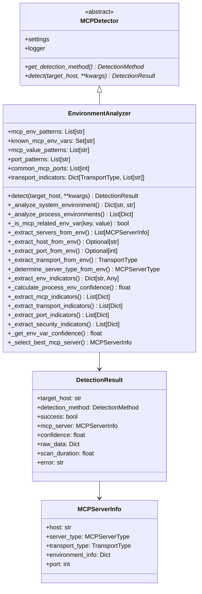
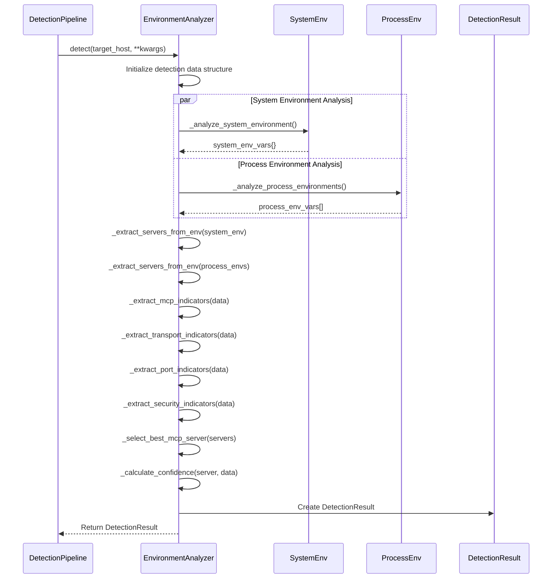
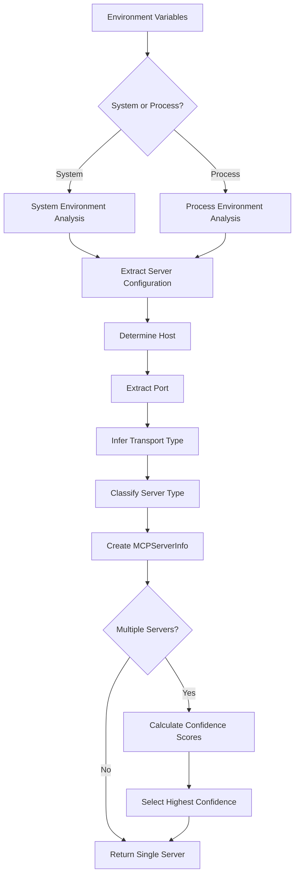

# Environment Analysis Engine

## Overview

The Environment Analysis Engine (`EnvironmentAnalyzer`) is a sophisticated detection component that identifies MCP (Model Context Protocol) servers through comprehensive analysis of environment variables in both system-wide and process-specific contexts. This detection method is crucial for discovering MCP servers that rely on environment-based configuration, which is a common deployment pattern in containerized and cloud-native environments.

## Architecture

### Class Hierarchy



### Detection Method Integration

The EnvironmentAnalyzer integrates with the detection pipeline as follows:



## Detection Strategies

### 1. System Environment Analysis

**Purpose**: Analyze system-wide environment variables for MCP server indicators.

**Algorithm**:
1. Iterate through all system environment variables (`os.environ`)
2. Apply MCP identification patterns to each key-value pair
3. Collect variables that match MCP patterns
4. Extract server configuration from matching variables

**Key Components**:
- **Pattern Matching**: Applies regex patterns to identify MCP-related variables
- **Configuration Extraction**: Extracts host, port, transport, and other configuration details
- **Security Analysis**: Identifies authentication and security-related configurations

**Example Detection Flow**:
```python
# Analyze system environment
for key, value in os.environ.items():
    if self._is_mcp_related_env_var(key, value):
        env_vars[key] = value

# Extract server information
servers = self._extract_servers_from_env(env_vars, 'system')
```

### 2. Process Environment Analysis

**Purpose**: Analyze environment variables of individual running processes for MCP indicators.

**Algorithm**:
1. Use psutil to enumerate all running processes
2. Extract environment variables for each process
3. Filter processes with MCP-related environment variables
4. Analyze process-specific MCP configurations
5. Calculate confidence scores for each process

**Process Filtering**:
- Skip system processes (PID < 100)
- Handle access permission errors gracefully
- Only include processes with MCP-related environment variables

**Example Detection Flow**:
```python
# Iterate through all processes
for proc in psutil.process_iter(['pid', 'name', 'cmdline']):
    try:
        env_dict = proc.environ()
        
        # Filter for MCP-related variables
        mcp_env_vars = {}
        for key, value in env_dict.items():
            if self._is_mcp_related_env_var(key, value):
                mcp_env_vars[key] = value
        
        # Analyze if MCP-related variables found
        if mcp_env_vars:
            # Process and analyze
    except psutil.AccessDenied:
        continue  # Skip inaccessible processes
```

**Exception Handling**:
- **psutil.AccessDenied**: Insufficient permissions to access process environment
- **psutil.NoSuchProcess**: Process terminated during enumeration
- **psutil.ZombieProcess**: Process in zombie state
- **ImportError**: psutil module not available

## Environment Variable Pattern System

### MCP Environment Variable Patterns

The system uses comprehensive regex patterns to identify MCP-related variables:

```python
mcp_env_patterns = [
    # Direct MCP patterns
    r'MCP_.*',                    # Standard MCP_ prefix
    r'.*_MCP_.*',                 # MCP in middle of variable name
    r'MODEL_CONTEXT_PROTOCOL_.*', # Full protocol name
    r'.*MCP.*SERVER.*',           # MCP server combinations
    r'.*MCP.*PORT.*',             # MCP port variables
    r'.*MCP.*HOST.*',             # MCP host variables
    r'.*MCP.*CONFIG.*',           # MCP configuration variables
    
    # Transport-specific patterns
    r'.*MCP.*HTTP.*',             # HTTP transport
    r'.*MCP.*WEBSOCKET.*',        # WebSocket transport
    r'.*MCP.*WS.*',               # WebSocket shorthand
    r'.*MCP.*STDIO.*',            # STDIO transport
    
    # Tool and capability patterns
    r'.*MCP.*TOOL.*',             # Tool-related variables
    r'.*MCP.*CAPABILITY.*',       # Capability configurations
    r'.*MCP.*RESOURCE.*',         # Resource configurations
    r'.*MCP.*PROMPT.*',           # Prompt-related variables
    
    # Authentication patterns
    r'.*MCP.*AUTH.*',             # Authentication variables
    r'.*MCP.*TOKEN.*',            # Token-based auth
    r'.*MCP.*KEY.*',              # API key variables
    r'.*MCP.*SECRET.*',           # Secret variables
]
```

### Known MCP Environment Variables

Maintains a curated list of standard MCP environment variables:

```python
known_mcp_env_vars = {
    'MCP_SERVER_PORT',           # Server port configuration
    'MCP_SERVER_HOST',           # Server host configuration
    'MCP_SERVER_CONFIG',         # Server configuration file
    'MCP_TRANSPORT_TYPE',        # Transport type specification
    'MCP_WEBSOCKET_PORT',        # WebSocket-specific port
    'MCP_HTTP_PORT',             # HTTP-specific port
    'MCP_STDIO_MODE',            # STDIO mode configuration
    'MCP_AUTH_TOKEN',            # Authentication token
    'MCP_API_KEY',               # API key for authentication
    'MCP_SERVER_NAME',           # Server identification
    'MCP_CAPABILITIES',          # Enabled capabilities
    'MCP_TOOLS_CONFIG',          # Tools configuration
    'MCP_RESOURCES_PATH',        # Resources directory path
    'MCP_PROMPTS_PATH',          # Prompts directory path
    'MCP_LOG_LEVEL',             # Logging level
    'MCP_DEBUG',                 # Debug mode flag
    'MODEL_CONTEXT_PROTOCOL_PORT', # Alternative port variable
    'MODEL_CONTEXT_PROTOCOL_HOST', # Alternative host variable
}
```

### MCP Value Patterns

Identifies MCP-related content in environment variable values:

```python
mcp_value_patterns = [
    r'.*@modelcontextprotocol.*',     # Official npm packages
    r'.*mcp-server.*',                # MCP server executables
    r'.*model-context-protocol.*',    # Protocol references
    r'.*mcp\..*',                     # MCP domains/configs
    r'.*://.*mcp.*',                  # MCP URLs
    r'.*mcp://.*',                    # MCP protocol URLs
]
```

## Configuration Extraction Algorithms

### Host Extraction

**Algorithm**: Hierarchical search for host configuration

```python
def _extract_host_from_env(self, env_vars: Dict[str, str]) -> Optional[str]:
    # Priority order for host variables
    host_vars = ['MCP_SERVER_HOST', 'MCP_HOST', 'HOST', 'SERVER_HOST']
    
    # Check explicit host variables first
    for var in host_vars:
        if var in env_vars:
            return env_vars[var]
    
    # Check for host in other variables
    for key, value in env_vars.items():
        if 'host' in key.lower() and value:
            return value
    
    return None  # Default to None if no host found
```

**Extraction Priority**:
1. **MCP_SERVER_HOST**: Primary MCP host variable
2. **MCP_HOST**: Alternative MCP host variable
3. **HOST**: Generic host variable
4. **SERVER_HOST**: Server-specific host variable
5. **Pattern Match**: Any variable containing "host" in the name

### Port Extraction

**Algorithm**: Multi-pattern port extraction with validation

```python
def _extract_port_from_env(self, env_vars: Dict[str, str]) -> Optional[int]:
    # Check explicit port variables
    port_vars = ['MCP_SERVER_PORT', 'MCP_PORT', 'PORT', 'SERVER_PORT']
    
    for var in port_vars:
        if var in env_vars:
            try:
                return int(env_vars[var])
            except ValueError:
                continue
    
    # Check for port patterns in values
    for key, value in env_vars.items():
        for pattern in self.port_patterns:
            match = re.search(pattern, value, re.IGNORECASE)
            if match:
                try:
                    port = int(match.group(1))
                    if 1 <= port <= 65535:  # Valid port range
                        return port
                except (ValueError, IndexError):
                    continue
    
    return None
```

**Port Patterns**:
```python
port_patterns = [
    r'PORT[=:](\d+)',           # PORT=3000 or PORT:3000
    r'.*_PORT[=:](\d+)',        # ANY_PORT=3000
    r'.*PORT.*[=:](\d+)',       # Any port variable
    r'://[^:]+:(\d+)',          # URL format: http://host:port
    r':(\d+)/',                 # Port in URL path: :3000/
    r':(\d+)$',                 # Port at end: :3000
    r'(\d+)',                   # Fallback numeric values
]
```

**Common MCP Ports**: `[3000, 8000, 8080, 9000, 3001, 8001]`

### Transport Type Inference

**Algorithm**: Multi-level transport type detection

```python
def _extract_transport_from_env(self, env_vars: Dict[str, str]) -> TransportType:
    # Check explicit transport variables
    transport_vars = ['MCP_TRANSPORT_TYPE', 'MCP_TRANSPORT', 'TRANSPORT_TYPE']
    
    for var in transport_vars:
        if var in env_vars:
            transport_value = env_vars[var].lower()
            if 'websocket' in transport_value or 'ws' in transport_value:
                return TransportType.WEBSOCKET
            elif 'http' in transport_value:
                return TransportType.HTTP
            elif 'stdio' in transport_value:
                return TransportType.STDIO
    
    # Infer from all environment variable values
    all_values = ' '.join(env_vars.values()).lower()
    
    for transport_type, indicators in self.transport_indicators.items():
        for indicator in indicators:
            if indicator in all_values:
                return transport_type
    
    # Default based on port presence
    if self._extract_port_from_env(env_vars):
        return TransportType.HTTP  # Port suggests network transport
    else:
        return TransportType.STDIO  # Default to STDIO
```

**Transport Indicators**:
```python
transport_indicators = {
    TransportType.HTTP: [
        'http', 'https', 'rest', 'api', 'web'
    ],
    TransportType.WEBSOCKET: [
        'websocket', 'ws', 'wss', 'socket'
    ],
    TransportType.STDIO: [
        'stdio', 'stdin', 'stdout', 'pipe', 'cli'
    ]
}
```

### Server Type Determination

**Algorithm**: Context-based server type classification

```python
def _determine_server_type_from_env(self, env_vars: Dict[str, str], source: str) -> MCPServerType:
    all_values = ' '.join(env_vars.values()).lower()
    
    if 'docker' in source or 'container' in all_values:
        return MCPServerType.DOCKER_CONTAINER
    elif 'npx' in all_values or '@modelcontextprotocol' in all_values:
        return MCPServerType.NPX_PACKAGE
    elif 'node' in all_values or 'npm' in all_values:
        return MCPServerType.STANDALONE  # Node.js applications
    else:
        return MCPServerType.STANDALONE  # Default type
```

**Classification Logic**:
1. **Docker Container**: Docker-related indicators in source or values
2. **NPX Package**: NPX or official npm package indicators
3. **Standalone**: Node.js indicators or default classification

## Indicator Extraction System

### Environment Variable Categorization

**Algorithm**: Multi-category indicator extraction

```python
def _extract_env_indicators(self, env_vars: Dict[str, str]) -> Dict[str, Any]:
    indicators = {
        'mcp_vars': [],        # MCP-specific variables
        'transport_vars': [],  # Transport configuration variables
        'port_vars': [],       # Port configuration variables
        'auth_vars': [],       # Authentication variables
        'config_vars': [],     # Configuration variables
        'tool_vars': [],       # Tool and capability variables
    }
    
    for key, value in env_vars.items():
        key_lower = key.lower()
        
        # Categorize based on key patterns
        if any(pattern in key_lower for pattern in ['mcp', 'model_context_protocol']):
            indicators['mcp_vars'].append({'key': key, 'value': value})
        
        if any(pattern in key_lower for pattern in ['transport', 'http', 'websocket', 'stdio']):
            indicators['transport_vars'].append({'key': key, 'value': value})
        
        # ... additional categorization logic
    
    return indicators
```

**Indicator Categories**:
- **MCP Variables**: Core MCP protocol variables
- **Transport Variables**: Communication protocol configurations
- **Port Variables**: Network port configurations
- **Authentication Variables**: Security and authentication settings
- **Configuration Variables**: General configuration settings
- **Tool Variables**: Tool and capability configurations

### MCP Indicators

**Purpose**: Extract and classify MCP-specific environment variables

```python
def _extract_mcp_indicators(self, detection_data: Dict[str, Any]) -> List[Dict[str, Any]]:
    indicators = []
    
    # System environment indicators
    for key, value in detection_data.get('system_env_vars', {}).items():
        indicators.append({
            'source': 'system',
            'type': 'environment_variable',
            'key': key,
            'value': value,
            'confidence': self._get_env_var_confidence(key, value)
        })
    
    # Process environment indicators
    for proc_env in detection_data.get('process_env_vars', []):
        for key, value in proc_env.get('env_vars', {}).items():
            indicators.append({
                'source': f"process_{proc_env['pid']}",
                'type': 'environment_variable',
                'key': key,
                'value': value,
                'process_name': proc_env['name'],
                'confidence': self._get_env_var_confidence(key, value)
            })
    
    return indicators
```

### Transport Indicators

**Purpose**: Identify transport-related configuration across all environment variables

```python
def _extract_transport_indicators(self, detection_data: Dict[str, Any]) -> List[Dict[str, Any]]:
    indicators = []
    
    # Aggregate all environment variables
    all_env_vars = {}
    all_env_vars.update(detection_data.get('system_env_vars', {}))
    
    for proc_env in detection_data.get('process_env_vars', []):
        all_env_vars.update(proc_env.get('env_vars', {}))
    
    # Check for transport indicators
    for key, value in all_env_vars.items():
        for transport_type, transport_indicators in self.transport_indicators.items():
            for indicator in transport_indicators:
                if indicator in key.lower() or indicator in value.lower():
                    indicators.append({
                        'transport_type': transport_type.value,
                        'indicator': indicator,
                        'env_var': key,
                        'value': value
                    })
    
    return indicators
```

### Port Indicators

**Purpose**: Extract and validate port configurations from environment variables

```python
def _extract_port_indicators(self, detection_data: Dict[str, Any]) -> List[Dict[str, Any]]:
    indicators = []
    
    # Check all environment variables for port patterns
    for key, value in all_env_vars.items():
        if 'port' in key.lower():
            for pattern in self.port_patterns:
                match = re.search(pattern, value, re.IGNORECASE)
                if match:
                    try:
                        port = int(match.group(1))
                        if 1 <= port <= 65535:  # Valid port range
                            indicators.append({
                                'port': port,
                                'env_var': key,
                                'value': value,
                                'is_common_mcp_port': port in self.common_mcp_ports
                            })
                    except (ValueError, IndexError):
                        continue
    
    return indicators
```

### Security Indicators

**Purpose**: Identify security and authentication-related configurations

```python
def _extract_security_indicators(self, detection_data: Dict[str, Any]) -> List[Dict[str, Any]]:
    indicators = []
    
    security_patterns = [
        ('auth', 'authentication'),         # Authentication patterns
        ('token', 'token_authentication'),  # Token-based auth
        ('key', 'api_key'),                 # API key authentication
        ('secret', 'secret_key'),           # Secret key patterns
        ('password', 'password'),           # Password authentication
        ('ssl', 'ssl_tls'),                 # SSL/TLS security
        ('tls', 'ssl_tls'),                 # TLS security
        ('https', 'https_transport'),       # HTTPS transport
        ('wss', 'websocket_secure'),        # Secure WebSocket
    ]
    
    for key, value in all_env_vars.items():
        key_lower = key.lower()
        value_lower = value.lower()
        
        for pattern, security_type in security_patterns:
            if pattern in key_lower or pattern in value_lower:
                indicators.append({
                    'security_type': security_type,
                    'env_var': key,
                    'value': value,
                    'has_value': bool(value.strip())  # Check if value is present
                })
    
    return indicators
```

## Confidence Scoring Algorithms

### Environment Variable Confidence

**Algorithm**: Hierarchical confidence scoring for individual environment variables

```python
def _get_env_var_confidence(self, key: str, value: str) -> float:
    confidence = 0.0
    
    # High confidence for known MCP variables
    if key.upper() in self.known_mcp_env_vars:
        confidence += 0.6
    
    # Medium confidence for MCP patterns in key
    for pattern in self.mcp_env_patterns:
        if re.search(pattern, key, re.IGNORECASE):
            confidence += 0.4
            break
    
    # Low confidence for MCP patterns in value
    for pattern in self.mcp_value_patterns:
        if re.search(pattern, value, re.IGNORECASE):
            confidence += 0.2
            break
    
    # Bonus for having a meaningful value
    if confidence > 0 and value and value.strip():
        confidence += 0.1
    
    return min(confidence, 1.0)
```

**Confidence Levels**:
- **0.6**: Known official MCP environment variables
- **0.4**: Pattern matches in variable names
- **0.2**: Pattern matches in variable values
- **0.1**: Bonus for non-empty values

### Process Environment Confidence

**Algorithm**: Composite confidence scoring for process-level analysis

```python
def _calculate_process_env_confidence(self, env_vars: Dict[str, str], cmdline: List[str]) -> float:
    confidence = 0.0
    
    # Base confidence for having MCP environment variables
    confidence += 0.3
    
    # Bonus for known MCP environment variables
    known_vars = sum(1 for key in env_vars.keys() if key.upper() in self.known_mcp_env_vars)
    confidence += min(known_vars * 0.1, 0.3)  # Max 0.3 bonus
    
    # Bonus for MCP-related command line
    cmdline_str = ' '.join(cmdline).lower()
    mcp_patterns = ['mcp', 'model-context-protocol', '@modelcontextprotocol']
    if any(pattern in cmdline_str for pattern in mcp_patterns):
        confidence += 0.2
    
    # Bonus for transport configuration
    if any('transport' in key.lower() for key in env_vars.keys()):
        confidence += 0.1
    
    # Bonus for port configuration
    if any('port' in key.lower() for key in env_vars.keys()):
        confidence += 0.1
    
    return min(confidence, 1.0)
```

**Scoring Components**:
- **0.3**: Base confidence for MCP environment variables
- **0.1 per known variable**: Up to 0.3 total for known MCP variables
- **0.2**: MCP indicators in command line
- **0.1**: Transport configuration present
- **0.1**: Port configuration present

### Overall Detection Confidence

**Algorithm**: Weighted confidence calculation combining multiple evidence sources

```python
def _calculate_confidence(self, server: MCPServerInfo, detection_data: Dict[str, Any]) -> float:
    confidence = 0.0
    
    # Base confidence from having a server
    confidence += 0.2
    
    # Confidence from MCP indicators
    mcp_indicators = detection_data.get('mcp_indicators', [])
    if mcp_indicators:
        avg_indicator_confidence = sum(
            indicator.get('confidence', 0) 
            for indicator in mcp_indicators
        ) / len(mcp_indicators)
        confidence += avg_indicator_confidence * 0.4
    
    # Bonus for transport indicators
    if detection_data.get('transport_indicators'):
        confidence += 0.1
    
    # Bonus for port indicators
    port_indicators = detection_data.get('port_indicators', [])
    if port_indicators:
        confidence += 0.1
        # Extra bonus for common MCP ports
        if any(indicator.get('is_common_mcp_port') for indicator in port_indicators):
            confidence += 0.1
    
    # Bonus for security indicators
    if detection_data.get('security_indicators'):
        confidence += 0.1
    
    return min(confidence, 1.0)
```

## Server Selection Logic

### Best Server Selection

**Algorithm**: Confidence-based server selection with weighted scoring

```python
def _select_best_mcp_server(self, servers: List[MCPServerInfo]) -> Optional[MCPServerInfo]:
    if not servers:
        return None
    
    # Calculate confidence for each server
    servers_with_confidence = []
    for server in servers:
        env_info = server.environment_info or {}
        env_vars = env_info.get('env_vars', {})
        
        # Average confidence of all environment variables
        confidence = sum(
            self._get_env_var_confidence(k, v) 
            for k, v in env_vars.items()
        ) / max(len(env_vars), 1)
        
        servers_with_confidence.append((server, confidence))
    
    # Sort by confidence (highest first) and return best
    servers_with_confidence.sort(key=lambda x: x[1], reverse=True)
    return servers_with_confidence[0][0]
```

**Selection Criteria**:
1. **Confidence Score**: Average confidence of all environment variables
2. **Variable Count**: More environment variables indicate higher likelihood
3. **Variable Quality**: Known MCP variables weighted higher than pattern matches

### Server Analysis Pipeline



## Security Context Analysis

### Authentication Detection

**Purpose**: Identify authentication mechanisms in environment variables

**Authentication Patterns**:
- **Token-based**: `*TOKEN*`, `*AUTH*` patterns
- **API Key**: `*KEY*`, `*SECRET*` patterns  
- **Password**: `*PASSWORD*`, `*PASS*` patterns
- **Certificate**: `*CERT*`, `*SSL*`, `*TLS*` patterns

**Security Risk Assessment**:
```python
def _assess_security_risks(self, env_vars: Dict[str, str]) -> List[Dict[str, Any]]:
    risks = []
    
    for key, value in env_vars.items():
        key_lower = key.lower()
        
        # Check for exposed secrets
        if any(pattern in key_lower for pattern in ['secret', 'password', 'key']):
            if value and len(value) > 0:
                risks.append({
                    'type': 'exposed_secret',
                    'variable': key,
                    'severity': 'high',
                    'description': 'Potentially sensitive information in environment variable'
                })
        
        # Check for insecure protocols
        if 'http://' in value.lower() and not 'https://' in value.lower():
            risks.append({
                'type': 'insecure_transport',
                'variable': key,
                'severity': 'medium',
                'description': 'Insecure HTTP transport detected'
            })
    
    return risks
```

### Configuration Security

**Secure Configuration Indicators**:
- **HTTPS Transport**: `https://` URLs in values
- **Secure WebSocket**: `wss://` URLs in values
- **TLS Configuration**: SSL/TLS certificate paths
- **Authentication Tokens**: Presence of auth tokens (without values)

## Error Handling and Resilience

### Exception Categories

**System Environment Errors**:
- **PermissionError**: Insufficient permissions to read environment
- **OSError**: System-level errors accessing environment

**Process Environment Errors**:
- **ImportError**: psutil module not available
- **psutil.AccessDenied**: Insufficient permissions to access process
- **psutil.NoSuchProcess**: Process terminated during enumeration
- **psutil.ZombieProcess**: Process in zombie state

**Analysis Errors**:
- **ValueError**: Invalid port numbers or configuration values
- **KeyError**: Missing expected environment variable structure
- **AttributeError**: Malformed server information objects

### Graceful Degradation

```python
# Example error handling pattern
def _analyze_process_environments(self, include_inherited: bool = False) -> List[Dict[str, Any]]:
    process_envs = []
    
    try:
        import psutil
        
        for proc in psutil.process_iter(['pid', 'name', 'cmdline']):
            try:
                # Attempt to get process environment
                env_dict = proc.environ()
                # Process environment variables...
            except (psutil.AccessDenied, psutil.NoSuchProcess, psutil.ZombieProcess):
                continue  # Skip inaccessible processes
    
    except ImportError:
        self.logger.warning("psutil not available for process environment analysis")
        return []  # Return empty list if psutil unavailable
    except Exception as e:
        self.logger.warning(f"Failed to analyze process environments: {e}")
        return []
    
    return process_envs
```

## Performance Characteristics

### Time Complexity

**System Environment Analysis**: O(n) where n = number of system environment variables
**Process Environment Analysis**: O(p × m) where p = number of processes, m = average environment variables per process
**Pattern Matching**: O(k × v) where k = number of patterns, v = number of variable names/values

### Resource Usage

**Memory**: Moderate - stores environment variable snapshots and analysis results
**CPU**: Medium - regex pattern matching and process enumeration
**I/O**: Low - primarily in-memory operations with some system calls
**Permissions**: Variable - depends on process access permissions

### Optimization Features

**Early Termination**: Stops processing when high-confidence servers found
**Pattern Compilation**: Regex patterns compiled once during initialization
**Process Filtering**: Skip system processes and inaccessible processes
**Selective Analysis**: Configurable system vs. process analysis

## Integration with Detection Pipeline

### Pipeline Configuration

```python
# Enable environment analysis in pipeline
config = PipelineConfig(
    enable_environment_analysis=True,
    # Environment-specific options
    analyze_system=True,
    analyze_processes=True,
    include_inherited=False,
)

# Pipeline initializes EnvironmentAnalyzer
if config.enable_environment_analysis:
    detectors[DetectionMethod.ENVIRONMENT_ANALYSIS] = EnvironmentAnalyzer(settings)
```

### Detection Orchestration

The pipeline coordinates environment analysis with other methods:

1. **Parallel Execution**: Environment analysis runs alongside other detection methods
2. **Result Correlation**: Environment data correlated with process and configuration findings
3. **Confidence Integration**: Environment confidence scores integrated into overall assessment
4. **Context Enhancement**: Environment data provides additional context for other detections

### Result Integration

```python
# Environment analysis contributes to pipeline results
pipeline_result = PipelineResult(
    target_host=target_host,
    detection_results=[
        # ... other detection results
        environment_detection_result,  # EnvironmentAnalyzer result
    ],
    best_server=selected_server,
    aggregated_confidence=weighted_confidence,
    environment_context=environment_indicators
)
```

## Security Considerations

### Information Disclosure Prevention

**Risk**: Exposure of sensitive environment variable values in logs or results
**Mitigation**:
- Log only variable names, not values, for sensitive variables
- Implement value masking for authentication tokens and secrets
- Provide configurable logging levels for sensitive information

**Example Implementation**:
```python
def _log_safe_env_var(self, key: str, value: str) -> str:
    """Log environment variable safely, masking sensitive values."""
    sensitive_patterns = ['secret', 'password', 'token', 'key']
    
    if any(pattern in key.lower() for pattern in sensitive_patterns):
        return f"{key}=<MASKED>"
    else:
        return f"{key}={value}"
```

### Access Control

**Risk**: Unauthorized access to process environment variables
**Mitigation**:
- Graceful handling of permission denied errors
- Skip processes that cannot be accessed
- Log security-related access failures for monitoring

### Data Retention

**Risk**: Long-term storage of sensitive environment data
**Mitigation**:
- Minimal data retention in detection results
- Automatic cleanup of environment variable snapshots
- Configurable data retention policies

## Testing Strategy

### Unit Test Coverage

**Pattern Matching Tests**:
- Known environment variable identification
- Regex pattern validation
- Value pattern matching accuracy

**Configuration Extraction Tests**:
- Host extraction from various formats
- Port parsing and validation
- Transport type inference accuracy

**Confidence Scoring Tests**:
- Individual variable confidence calculation
- Process confidence aggregation
- Overall detection confidence computation

### Integration Tests

**System Environment Mocking**:
- Mock `os.environ` for system environment testing
- Test various environment variable combinations
- Validate error handling for missing variables

**Process Environment Mocking**:
- Mock psutil process enumeration
- Simulate various process environment configurations
- Test permission error handling

**Pipeline Integration Tests**:
- Environment analysis integration with detection pipeline
- Result correlation with other detection methods
- Confidence score integration testing

### Performance Tests

**Scalability Testing**:
- Large environment variable set handling
- Multiple process environment analysis
- Pattern matching performance with many variables

**Resource Usage Testing**:
- Memory consumption monitoring
- CPU utilization measurement
- Process enumeration efficiency

## Future Enhancements

### Advanced Pattern Recognition

**Machine Learning**: Pattern recognition for unknown MCP environment patterns
**Dynamic Patterns**: Runtime pattern learning from successful detections
**Context-Aware Patterns**: Environment-specific pattern adaptation

### Enhanced Security Analysis

**Vulnerability Detection**: Identify insecure configurations automatically
**Compliance Checking**: Check environment configurations against security standards
**Risk Scoring**: Quantitative security risk assessment

### Performance Optimizations

**Caching**: Cache process environment snapshots for repeated analysis
**Incremental Analysis**: Detect environment changes and analyze only differences
**Parallel Processing**: Concurrent process environment analysis

### Integration Features

**Configuration Management**: Integration with configuration management systems
**Container Orchestration**: Enhanced Docker and Kubernetes environment analysis
**Cloud Platform Integration**: Cloud-specific environment analysis patterns

## Conclusion

The Environment Analysis Engine provides comprehensive coverage of environment-based MCP server deployments through sophisticated pattern matching, multi-level confidence scoring, and robust error handling. Its dual approach of system-wide and process-specific analysis ensures thorough detection while maintaining security and performance standards. The engine's integration with the broader detection pipeline enhances overall detection accuracy and provides valuable context for MCP server identification and analysis. 