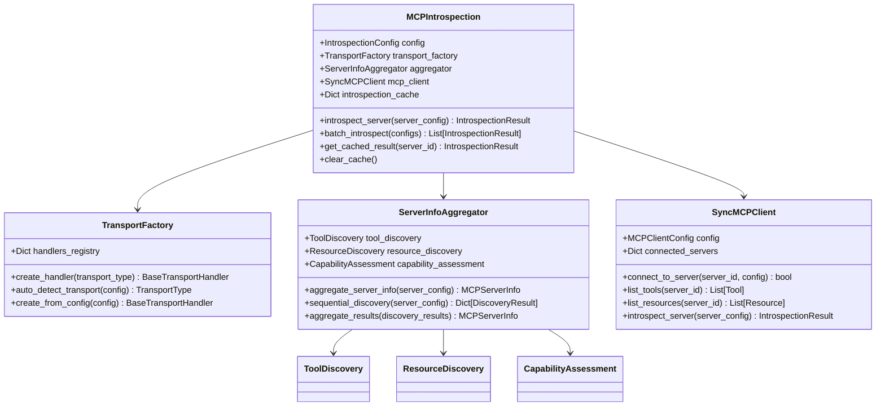
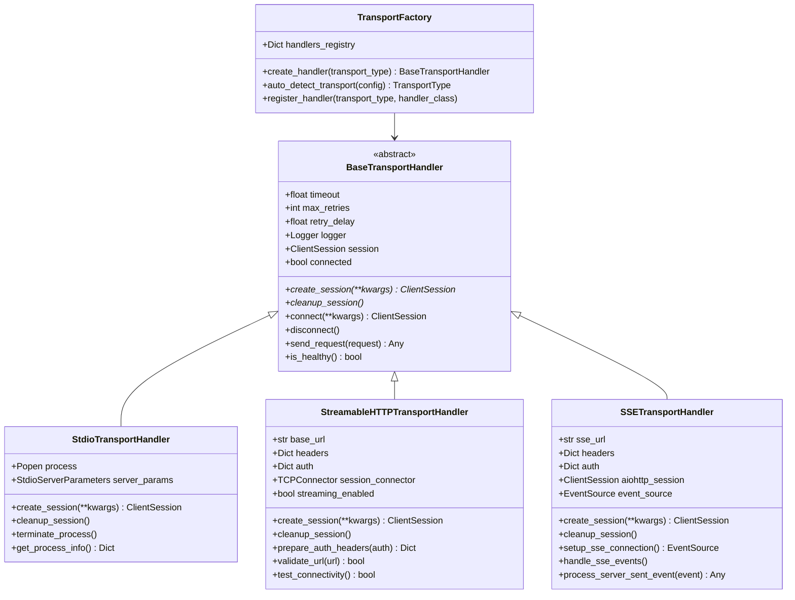
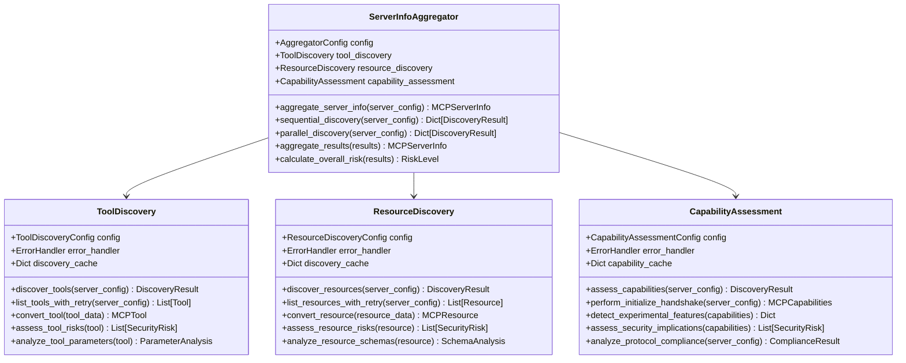
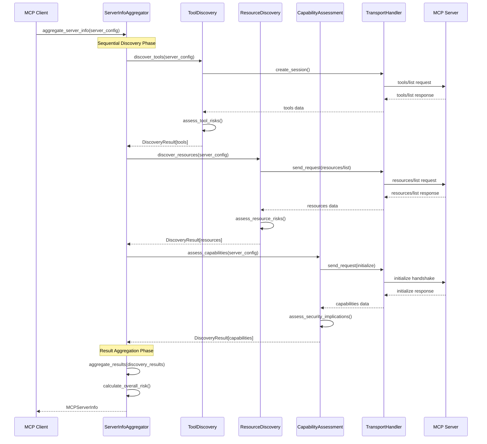
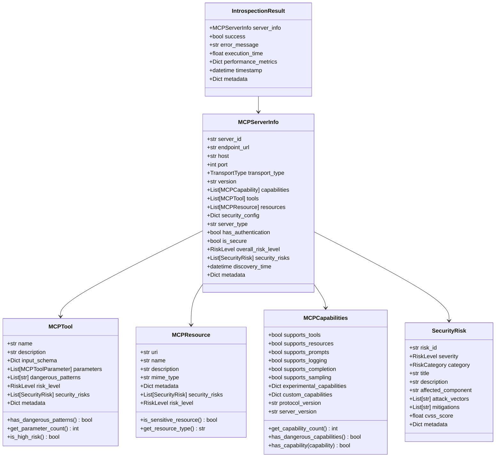
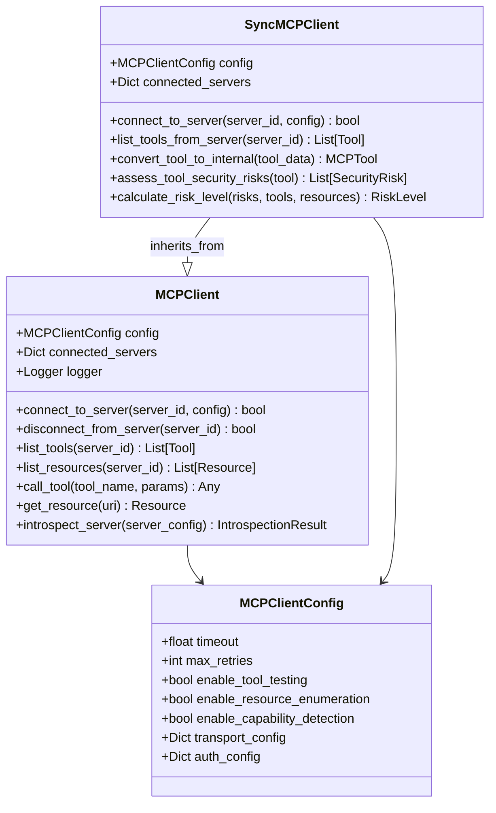
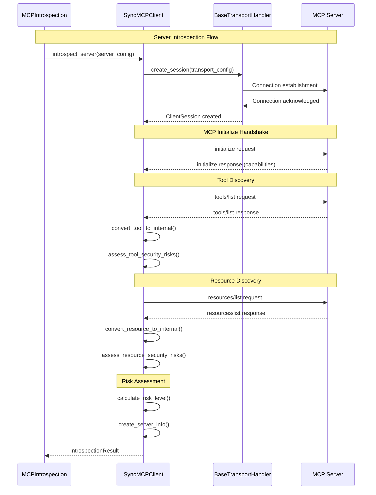
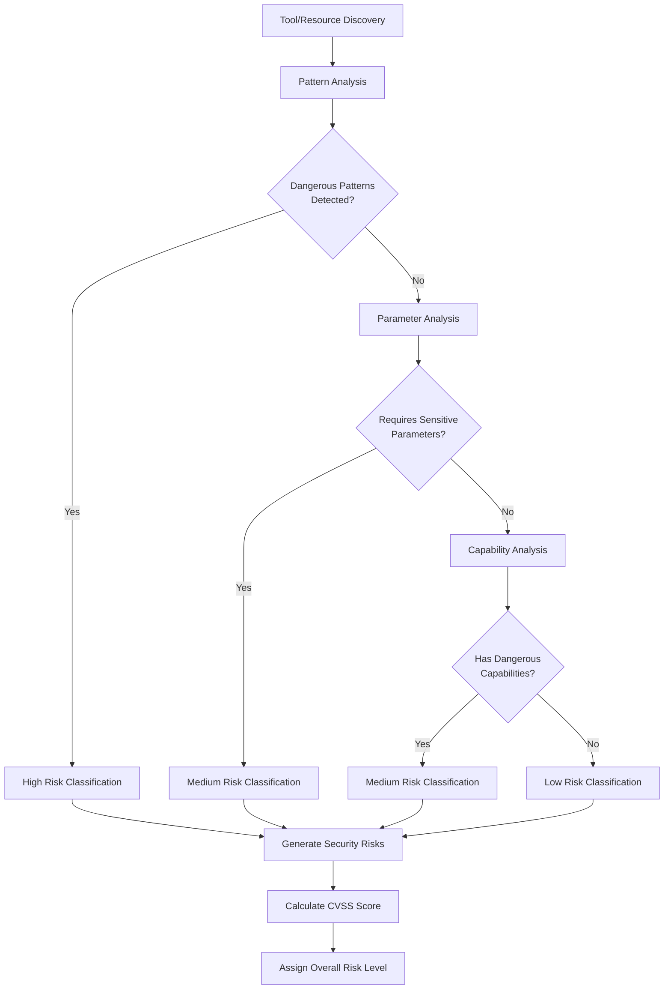
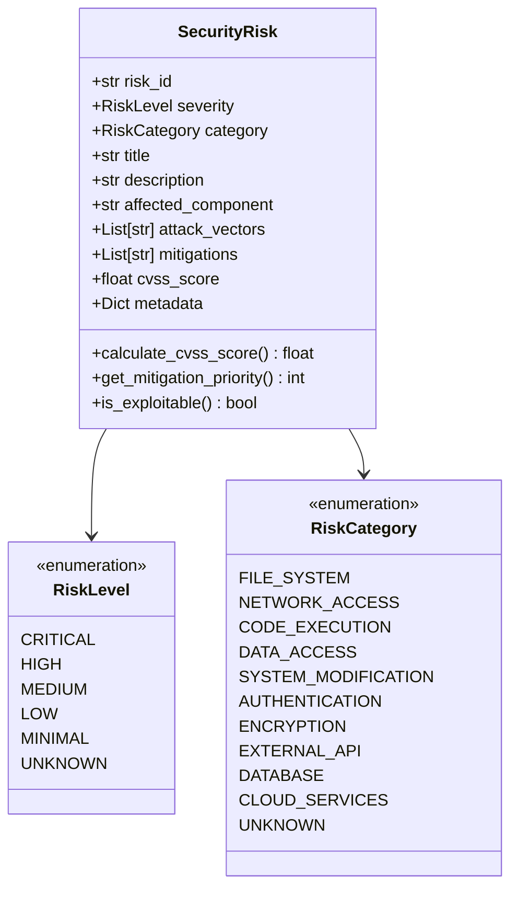
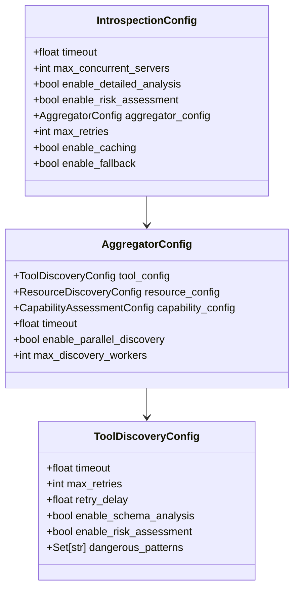

# MCP Introspection System Documentation

## Overview

The MCP Introspection System provides comprehensive analysis and discovery capabilities for Model Context Protocol (MCP) servers. This system enables dynamic discovery, capability assessment, and security analysis of MCP servers through direct protocol communication, replacing the previous Node.js script-based approach with native Python implementation.

## System Architecture

### Core Components

The MCP introspection system consists of five main architectural layers:

1. **Introspection Orchestrator** - Central coordination and caching
2. **Transport Layer** - Protocol-agnostic communication abstraction
3. **Discovery Engine** - Multi-faceted server analysis
4. **MCP Client** - Direct MCP protocol implementation
5. **Data Models** - Comprehensive information representation

### High-Level Architecture



## Transport Layer Architecture

### Transport Abstraction

The transport layer provides a unified interface for communicating with MCP servers across different protocols while handling connection management, retry logic, and error recovery.



### Transport-Specific Implementations

#### Stdio Transport
- **Purpose**: Communication with local MCP servers via standard input/output
- **Use Case**: Development, testing, and local server introspection
- **Key Features**:
  - Process management and lifecycle control
  - Command-line argument and environment variable handling
  - Graceful process termination with signal handling
  - Process health monitoring and restart capabilities

#### HTTP Transport
- **Purpose**: Production server communication via RESTful HTTP APIs
- **Use Case**: Production deployments and cloud-hosted MCP servers
- **Key Features**:
  - Connection pooling and keep-alive management
  - Authentication header management (Bearer, API Key)
  - SSL/TLS verification and proxy support
  - Request/response streaming for large payloads

#### SSE Transport
- **Purpose**: Real-time communication via Server-Sent Events
- **Use Case**: Streaming updates and real-time server monitoring
- **Key Features**:
  - Persistent event stream management
  - Automatic reconnection with exponential backoff
  - Event filtering and message routing
  - Connection health monitoring

## Discovery Engine Architecture

### Multi-Faceted Discovery System

The discovery engine employs a modular approach to comprehensively analyze MCP servers across multiple dimensions.



### Discovery Process Flow



## Data Models and Information Architecture

### Core Data Structures

The introspection system uses comprehensive data models to represent all aspects of MCP server information and analysis results.



## Protocol Implementation

### MCP Client Architecture

The system includes both asynchronous and synchronous MCP client implementations to handle different use cases and integration requirements.



### Protocol Communication Flow



## Security and Risk Assessment

### Security Analysis Framework

The introspection system includes comprehensive security analysis capabilities to identify potential risks and vulnerabilities in MCP servers.

#### Risk Categories
- **File System Access**: Tools that can read, write, or execute files
- **Network Access**: Tools that can make external network requests
- **Code Execution**: Tools that can execute arbitrary code or commands
- **Data Access**: Tools that can access sensitive data or databases
- **System Modification**: Tools that can modify system configuration
- **Authentication**: Tools that handle authentication or credentials
- **External APIs**: Tools that interact with external services

#### Risk Assessment Process



### Security Risk Data Model



## Performance and Optimization

### Caching Strategy

The introspection system implements multi-layer caching to optimize performance and reduce redundant operations:

1. **Result Caching**: Complete introspection results with TTL
2. **Discovery Caching**: Individual discovery results (tools, resources, capabilities)
3. **Transport Caching**: Connection sessions and authentication tokens

### Optimization Features

- **Connection Pooling**: Reuse transport connections across multiple operations
- **Batch Processing**: Support for introspecting multiple servers simultaneously
- **Retry Logic**: Exponential backoff with circuit breaker patterns
- **Memory Management**: Automatic cache cleanup and memory optimization
- **Performance Metrics**: Detailed timing and resource usage tracking

## Configuration and Extensibility

### Configuration Hierarchy



## Error Handling and Resilience

### Error Handling Strategy

The system implements comprehensive error handling at multiple levels:

1. **Transport Level**: Connection failures, timeouts, protocol errors
2. **Discovery Level**: Malformed responses, missing data, analysis failures
3. **Client Level**: Authentication failures, permission errors, server unavailability
4. **System Level**: Resource exhaustion, configuration errors, unexpected exceptions

### Fallback Mechanisms

- **Transport Fallback**: Automatic transport type detection and switching
- **Discovery Fallback**: Graceful degradation when specific discovery types fail
- **Analysis Fallback**: Default risk assessments when detailed analysis fails
- **Configuration Fallback**: Default configurations when custom configs are invalid

## Integration Points

### Integration with Detection Pipeline

The MCP introspection system integrates seamlessly with the broader detection pipeline:

1. **MCPDetector Integration**: Provides detailed server analysis for detected servers
2. **Risk Assessment Integration**: Feeds into overall security risk calculations
3. **Reporting Integration**: Comprehensive introspection data in reports
4. **Caching Integration**: Shared caching infrastructure with other detection components

### Extension Points

The system provides several extension points for customization:

1. **Custom Transport Handlers**: Support for new transport protocols
2. **Custom Discovery Modules**: Additional server analysis capabilities
3. **Custom Risk Assessment**: Specialized security analysis rules
4. **Custom Data Models**: Extended server information representation

## Usage Examples

### Basic Server Introspection

```python
from hawkeye.detection.mcp_introspection import MCPIntrospection
from hawkeye.detection.mcp_introspection.models import MCPServerConfig, TransportType

# Configure introspection
config = IntrospectionConfig(
    timeout=60.0,
    enable_detailed_analysis=True,
    enable_risk_assessment=True
)

# Initialize introspection system
introspector = MCPIntrospection(config)

# Configure server
server_config = MCPServerConfig(
    server_id="example_server",
    transport_type=TransportType.STDIO,
    command="node",
    args=["server.js"]
)

# Perform introspection
result = introspector.introspect_server(server_config)

# Access results
if result.success:
    server_info = result.server_info
    print(f"Server: {server_info.server_id}")
    print(f"Tools: {len(server_info.tools)}")
    print(f"Risk Level: {server_info.overall_risk_level}")
```

### Batch Server Analysis

```python
# Configure multiple servers
servers = [
    MCPServerConfig(server_id="server1", transport_type=TransportType.STDIO, command="node", args=["server1.js"]),
    MCPServerConfig(server_id="server2", transport_type=TransportType.HTTP, base_url="http://localhost:3000"),
    MCPServerConfig(server_id="server3", transport_type=TransportType.SSE, sse_url="http://localhost:3001/events")
]

# Perform batch introspection
results = introspector.batch_introspect(servers)

# Analyze results
for result in results:
    if result.success:
        print(f"Server {result.server_info.server_id}: {result.server_info.overall_risk_level}")
    else:
        print(f"Failed to analyze server: {result.error_message}")
```

## Future Enhancements

### Planned Improvements

1. **Real-time Monitoring**: Continuous server health and capability monitoring
2. **Advanced Analytics**: Machine learning-based risk prediction and anomaly detection
3. **Distributed Introspection**: Support for introspecting server clusters and load-balanced deployments
4. **Compliance Frameworks**: Integration with security compliance standards (SOC2, ISO27001)
5. **Performance Profiling**: Detailed performance analysis of MCP server implementations

### Extension Roadmap

1. **WebSocket Transport**: Support for WebSocket-based MCP communication
2. **gRPC Transport**: Support for gRPC-based MCP implementations
3. **Cloud Provider Integration**: Native support for cloud-hosted MCP services
4. **Container Runtime Integration**: Direct integration with container orchestration platforms
5. **API Gateway Integration**: Support for API gateway-mediated MCP services 