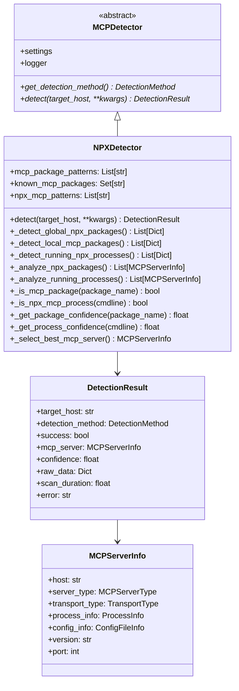
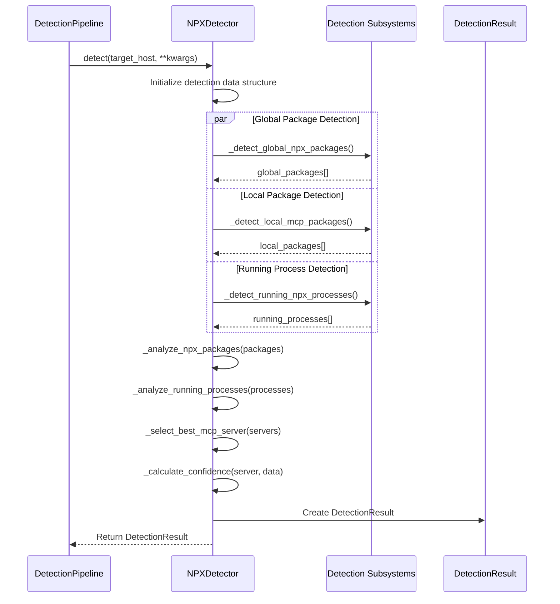
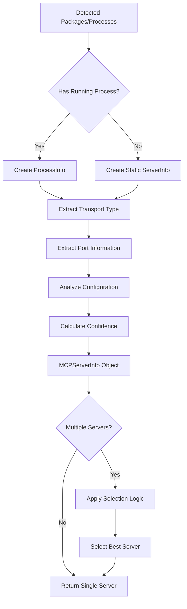

# NPX Package Detection System

## Overview

The NPX Package Detection system (`NPXDetector`) is a specialized detection component that identifies MCP (Model Context Protocol) servers deployed as NPX (Node Package eXecute) packages. This detection method is essential for discovering MCP servers in Node.js environments where they are commonly distributed through npm packages and executed via NPX commands.

## Architecture

### Class Hierarchy



### Detection Method Integration

The NPXDetector integrates with the detection pipeline as follows:



## Detection Strategies

### 1. Global NPX Package Detection

**Purpose**: Detect globally installed NPX packages that are MCP servers.

**Algorithm**:
1. Execute `npm list -g --depth=0 --json` to get global packages
2. Parse JSON output to extract package information
3. Filter packages using MCP identification patterns
4. Calculate confidence scores for each match

**Key Components**:
- **Command Execution**: Uses subprocess to run npm commands with 30-second timeout
- **JSON Parsing**: Extracts package names, versions, and paths
- **Pattern Matching**: Applies regex patterns to identify MCP packages
- **Error Handling**: Gracefully handles npm command failures and JSON parsing errors

**Example Detection Flow**:
```python
# Execute npm list command
result = subprocess.run(['npm', 'list', '-g', '--depth=0', '--json'])

# Parse output and filter MCP packages
npm_data = json.loads(result.stdout)
for package_name, package_info in npm_data.get('dependencies', {}).items():
    if self._is_mcp_package(package_name):
        # Create package record with confidence score
```

### 2. Local Package Discovery

**Purpose**: Discover MCP packages in local node_modules dependencies.

**Algorithm**:
1. Search for package.json files in common locations
2. Parse each package.json for dependencies
3. Check all dependency types (dependencies, devDependencies, peerDependencies)
4. Identify MCP packages using pattern matching
5. Record package location and configuration details

**Search Locations**:
- Current working directory (`Path.cwd()`)
- User home directory (`Path.home()`)
- Common installation paths (`/opt`, `/usr/local`, `/var/www`)

**Configuration Analysis**:
```python
# Extract all dependency types
all_deps = {}
all_deps.update(package_data.get('dependencies', {}))
all_deps.update(package_data.get('devDependencies', {}))
all_deps.update(package_data.get('peerDependencies', {}))

# Check each dependency for MCP indicators
for dep_name, dep_version in all_deps.items():
    if self._is_mcp_package(dep_name):
        # Record package information
```

### 3. Running Process Detection

**Purpose**: Identify currently running NPX processes that are MCP servers.

**Algorithm**:
1. Use psutil to enumerate all running processes
2. Extract command line arguments for each process
3. Apply NPX MCP patterns to identify relevant processes
4. Extract package names and configuration from command lines
5. Calculate process confidence scores

**Process Analysis**:
```python
# Iterate through all processes
for proc in psutil.process_iter(['pid', 'name', 'cmdline', 'cwd', 'create_time']):
    cmdline_str = ' '.join(proc.info.get('cmdline', []))
    
    # Check for NPX MCP patterns
    if self._is_npx_mcp_process(cmdline_str):
        # Extract package information and transport details
```

**Exception Handling**:
- **psutil.NoSuchProcess**: Process terminated during enumeration
- **psutil.AccessDenied**: Insufficient permissions to access process
- **psutil.ZombieProcess**: Process in zombie state
- **ImportError**: psutil not available

## Package Identification System

### MCP Package Patterns

The system uses comprehensive regex patterns to identify MCP packages:

```python
mcp_package_patterns = [
    r'@modelcontextprotocol/.*',    # Official MCP packages
    r'mcp-server-.*',               # Standard server prefix
    r'.*-mcp-server',               # Standard server suffix
    r'mcp-.*',                      # MCP prefix packages
    r'.*-mcp',                      # MCP suffix packages
]
```

### Known MCP Packages

Maintains a curated list of verified MCP packages:

```python
known_mcp_packages = {
    '@modelcontextprotocol/server-filesystem',
    '@modelcontextprotocol/server-git',
    '@modelcontextprotocol/server-github',
    '@modelcontextprotocol/server-postgres',
    '@modelcontextprotocol/server-sqlite',
    '@modelcontextprotocol/server-brave-search',
    '@modelcontextprotocol/server-memory',
    'mcp-server-anthropic',
    'mcp-server-openai',
    'mcp-server-claude',
}
```

### NPX Command Patterns

Identifies NPX commands that indicate MCP usage:

```python
npx_mcp_patterns = [
    r'npx\s+@modelcontextprotocol/',
    r'npx\s+mcp-server-',
    r'npx\s+.*-mcp-server',
    r'npx\s+.*mcp.*',
]
```

## Confidence Scoring Algorithms

### Package Confidence Calculation

**Algorithm**: Hierarchical scoring based on package identification method

```python
def _get_package_confidence(self, package_name: str) -> float:
    if package_name in self.known_mcp_packages:
        return 0.95  # Known official packages
    
    # Pattern-based scoring
    if '@modelcontextprotocol' in package_name:
        return 0.9   # Official namespace
    elif 'mcp-server' in package_name:
        return 0.8   # Standard naming convention
    elif 'mcp' in package_name:
        return 0.6   # General MCP indicator
    
    return 0.3       # Fallback low confidence
```

**Confidence Levels**:
- **0.95**: Known official MCP packages
- **0.9**: Official @modelcontextprotocol namespace
- **0.8**: Standard mcp-server naming convention
- **0.6**: General MCP indicators
- **0.3**: Pattern match fallback

### Process Confidence Calculation

**Algorithm**: Additive scoring based on command line indicators

```python
def _get_process_confidence(self, cmdline: str) -> float:
    confidence = 0.0
    
    if '@modelcontextprotocol' in cmdline.lower():
        confidence += 0.4  # Official namespace
    if 'mcp-server' in cmdline.lower():
        confidence += 0.3  # Server indicator
    if 'mcp' in cmdline.lower():
        confidence += 0.2  # General MCP
    if transport_args in cmdline:
        confidence += 0.1  # Transport configuration
    
    return min(confidence, 1.0)
```

**Scoring Components**:
- **0.4**: Official @modelcontextprotocol namespace
- **0.3**: MCP server naming patterns
- **0.2**: General MCP indicators
- **0.1**: Transport configuration arguments (--stdio, --http, --websocket)

### Overall Detection Confidence

**Algorithm**: Composite scoring based on detection evidence

```python
def _calculate_confidence(self, server: MCPServerInfo, detection_data: Dict) -> float:
    confidence = 0.3  # Base confidence for having a server
    
    if server.process_info:      # Running process
        confidence += 0.4
    if server.config_info:       # Configuration file
        confidence += 0.2
    if server.transport_type != TransportType.UNKNOWN:
        confidence += 0.1        # Known transport type
    
    return min(confidence, 1.0)
```

## Transport Type Inference

### Package-Based Inference

Analyzes package names for transport indicators:

```python
def _infer_transport_type(self, package: Dict[str, Any]) -> TransportType:
    package_name = package.get('name', '').lower()
    
    if 'websocket' in package_name or 'ws' in package_name:
        return TransportType.WEBSOCKET
    elif 'http' in package_name or 'web' in package_name:
        return TransportType.HTTP
    else:
        return TransportType.STDIO  # Default for NPX packages
```

### Command Line Inference

Extracts transport configuration from process arguments:

```python
def _infer_transport_from_cmdline(self, cmdline: List[str]) -> TransportType:
    cmdline_str = ' '.join(cmdline).lower()
    
    if '--websocket' in cmdline_str or '--ws' in cmdline_str:
        return TransportType.WEBSOCKET
    elif '--http' in cmdline_str:
        return TransportType.HTTP
    elif '--stdio' in cmdline_str:
        return TransportType.STDIO
    elif '--port' in cmdline_str:
        return TransportType.HTTP  # Port usually indicates HTTP
    else:
        return TransportType.STDIO  # Default
```

### Port Extraction

Parses command line arguments for port numbers:

```python
def _extract_port_from_cmdline(self, cmdline: List[str]) -> Optional[int]:
    cmdline_str = ' '.join(cmdline)
    
    # Look for --port argument
    port_match = re.search(r'--port[=\s]+(\d+)', cmdline_str)
    if port_match:
        return int(port_match.group(1))
    
    # Look for -p argument
    p_match = re.search(r'-p[=\s]+(\d+)', cmdline_str)
    if p_match:
        return int(p_match.group(1))
    
    return None
```

## Server Selection Logic

### Best Server Selection

**Algorithm**: Prioritized selection based on detection evidence

```python
def _select_best_mcp_server(self, servers: List[MCPServerInfo]) -> Optional[MCPServerInfo]:
    if not servers:
        return None
    
    # Prefer running processes over installed packages
    running_servers = [s for s in servers if s.process_info is not None]
    if running_servers:
        return running_servers[0]
    
    # Otherwise return the first detected server
    return servers[0]
```

**Selection Priority**:
1. **Running Processes**: Active NPX processes take highest priority
2. **Installed Packages**: Static package installations as fallback
3. **First Match**: Deterministic selection when multiple equal candidates

### Server Analysis Pipeline



## Error Handling and Resilience

### Exception Categories

**subprocess Errors**:
- **TimeoutExpired**: NPM command timeouts (30-second limit)
- **CalledProcessError**: NPM command execution failures
- **FileNotFoundError**: NPM/Node.js not installed

**File System Errors**:
- **PermissionError**: Insufficient permissions for directory access
- **FileNotFoundError**: Missing package.json files
- **JSONDecodeError**: Malformed package.json content

**Process Enumeration Errors**:
- **ImportError**: psutil module not available
- **psutil.NoSuchProcess**: Process terminated during enumeration
- **psutil.AccessDenied**: Insufficient process access permissions

### Graceful Degradation

```python
# Example error handling pattern
try:
    result = subprocess.run(['npm', 'list', '-g'], timeout=30)
    # Process successful result
except subprocess.TimeoutExpired:
    self.logger.warning("NPM command timed out")
    return []
except subprocess.CalledProcessError:
    self.logger.warning("NPM command failed")
    return []
except Exception as e:
    self.logger.error(f"Unexpected error: {e}")
    return []
```

## Configuration Analysis

### Package.json Analysis

**Purpose**: Extract MCP-relevant configuration from package.json files

**Analysis Components**:
- **Dependencies**: All dependency types (dependencies, devDependencies, peerDependencies)
- **Scripts**: NPM scripts that might contain MCP commands
- **Metadata**: Package name, version, description

**ConfigFileInfo Creation**:
```python
def _analyze_package_config(self, package_json_path: str) -> Optional[ConfigFileInfo]:
    config_data = json.load(open(package_json_path))
    
    # Extract dependencies
    dependencies = []
    for dep_type in ['dependencies', 'devDependencies', 'peerDependencies']:
        dependencies.extend(config_data.get(dep_type, {}).keys())
    
    # Extract scripts
    scripts = config_data.get('scripts', {})
    
    return ConfigFileInfo(
        path=Path(package_json_path),
        file_type='package.json',
        content=config_data,
        dependencies=dependencies,
        scripts=scripts
    )
```

## Performance Characteristics

### Time Complexity

**Global Package Detection**: O(n) where n = number of global packages
**Local Package Detection**: O(m × p) where m = search paths, p = package.json files
**Process Detection**: O(k) where k = number of running processes

### Resource Usage

**Memory**: Minimal - processes data in streaming fashion
**CPU**: Low - primarily I/O bound operations
**Network**: None - all operations are local
**Disk**: Read-only operations on configuration files

### Optimization Features

**Early Termination**: Stops processing when sufficient evidence found
**Pattern Caching**: Regex patterns compiled once during initialization
**Selective Detection**: Configurable detection method enabling/disabling
**Timeout Management**: Prevents hanging on unresponsive operations

## Integration with Detection Pipeline

### Pipeline Configuration

```python
# Enable NPX detection in pipeline
config = PipelineConfig(
    enable_npx_detection=True,
    # Other detection methods...
)

# Pipeline initializes NPXDetector
if config.enable_npx_detection:
    detectors[DetectionMethod.NPX_PACKAGE_DETECTION] = NPXDetector(settings)
```

### Detection Orchestration

The pipeline coordinates NPX detection with other methods:

1. **Parallel Execution**: NPX detection runs alongside other detection methods
2. **Result Aggregation**: NPX results merged with pipeline results
3. **Confidence Weighting**: NPX confidence scores integrated into overall assessment
4. **Fallback Behavior**: NPX detection serves as additional evidence source

### Result Integration

```python
# NPX detection contributes to pipeline results
pipeline_result = PipelineResult(
    target_host=target_host,
    detection_results=[
        # ... other detection results
        npx_detection_result,  # NPXDetector result
    ],
    best_server=selected_server,
    aggregated_confidence=weighted_confidence
)
```

## Security Considerations

### Command Injection Prevention

**Risk**: Malicious package names or process arguments
**Mitigation**: 
- Use subprocess with list arguments (not shell=True)
- Validate and sanitize all extracted strings
- Apply strict regex patterns for validation

### Privilege Escalation

**Risk**: Detection running with elevated privileges
**Mitigation**:
- Graceful handling of permission errors
- No requirement for root/administrator access
- Read-only operations on system resources

### Information Disclosure

**Risk**: Exposure of sensitive configuration data
**Mitigation**:
- Log filtering for sensitive information
- Controlled access to configuration content
- Minimal data retention in detection results

## Testing Strategy

### Unit Test Coverage

**Pattern Matching Tests**:
- Known package identification
- Regex pattern validation
- Edge case handling

**Confidence Scoring Tests**:
- Score calculation accuracy
- Boundary condition testing
- Scoring consistency

**Transport Inference Tests**:
- Command line parsing
- Package name analysis
- Port extraction accuracy

### Integration Tests

**subprocess Mocking**:
- NPM command simulation
- Error condition testing
- Timeout handling

**File System Mocking**:
- package.json parsing
- Directory traversal
- Permission error simulation

**Process Mocking**:
- psutil process simulation
- Process enumeration testing
- Access permission testing

### Performance Tests

**Load Testing**:
- Large package list handling
- Multiple process enumeration
- Concurrent detection execution

**Resource Usage**:
- Memory consumption monitoring
- CPU utilization measurement
- I/O operation efficiency

## Future Enhancements

### Advanced Package Analysis

**Package Metadata**: Extract additional npm package information
**Dependency Tree**: Analyze dependency relationships
**Version Compatibility**: Check MCP version compatibility

### Enhanced Process Detection

**Parent-Child Relationships**: Track process hierarchies
**Resource Monitoring**: Monitor process resource usage
**Lifecycle Tracking**: Track process start/stop events

### Intelligence Features

**Machine Learning**: Pattern recognition for unknown MCP packages
**Behavioral Analysis**: Runtime behavior pattern detection
**Anomaly Detection**: Identify unusual NPX usage patterns

### Performance Optimizations

**Caching**: Cache npm list results and package.json data
**Parallel Processing**: Concurrent detection across multiple paths
**Incremental Updates**: Delta detection for changed packages

## Conclusion

The NPX Package Detection system provides comprehensive coverage of Node.js-based MCP server deployments through multiple detection strategies, robust confidence scoring, and seamless integration with the broader detection pipeline. Its multi-layered approach ensures reliable identification while maintaining performance and security standards. 