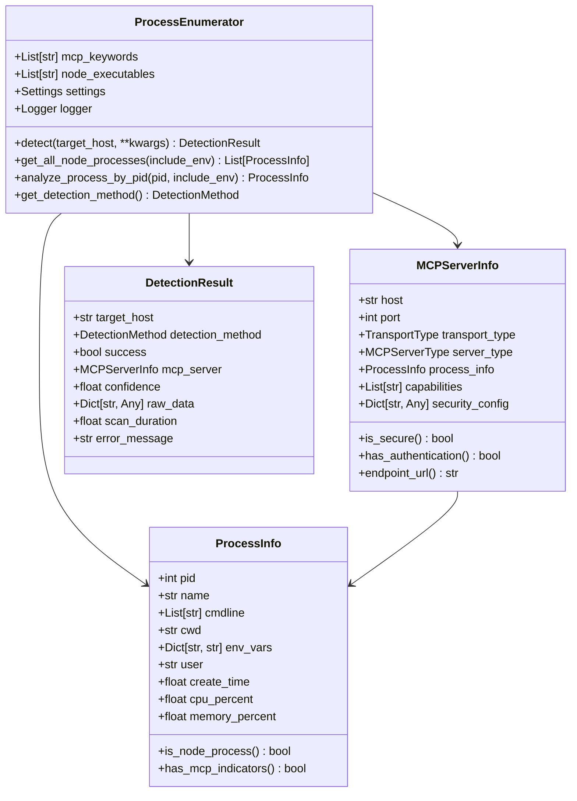
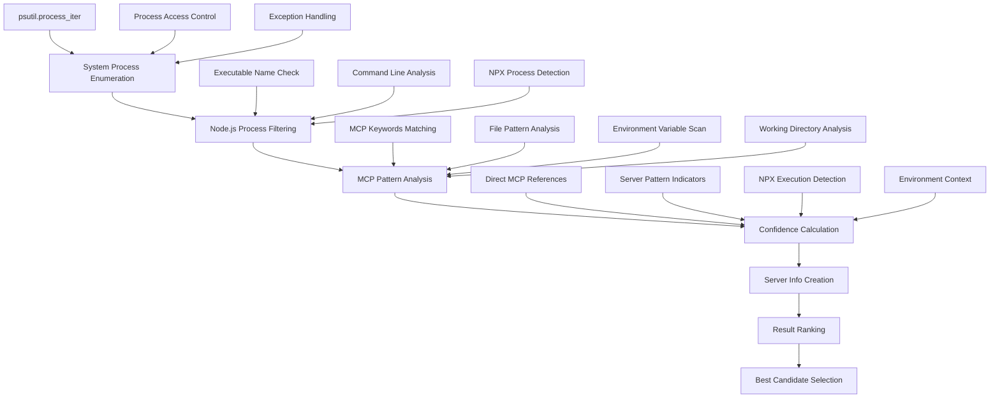
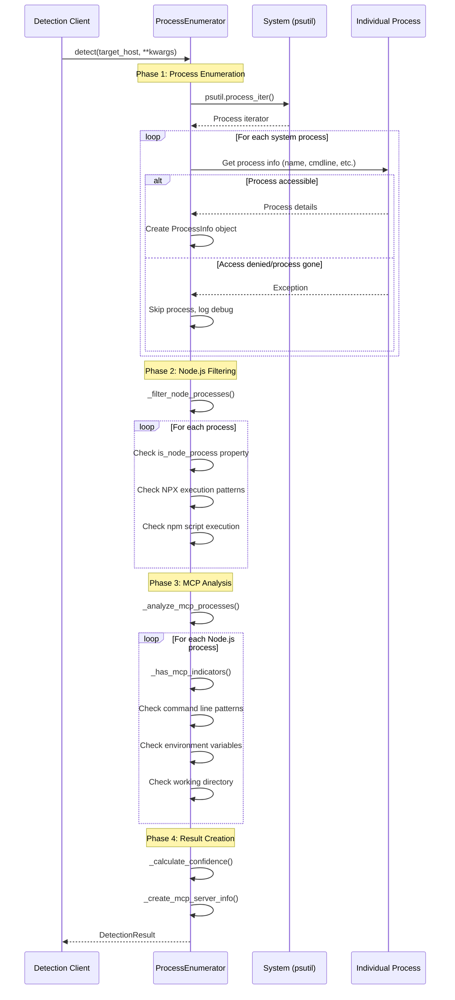
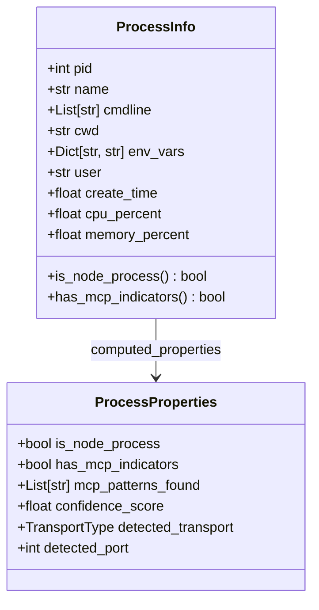
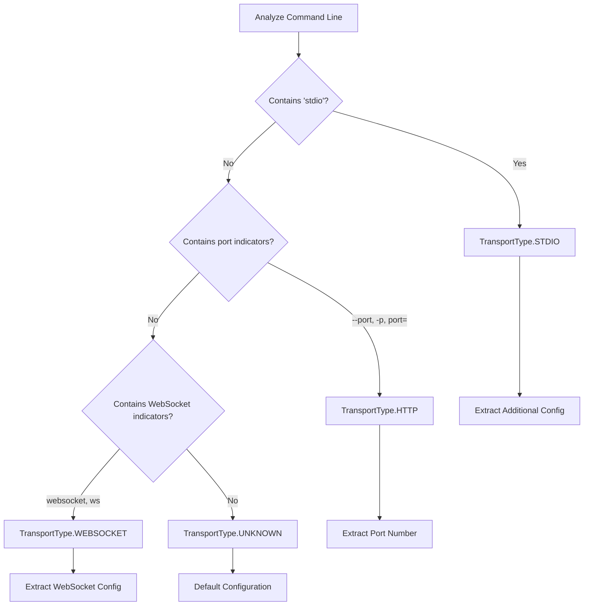
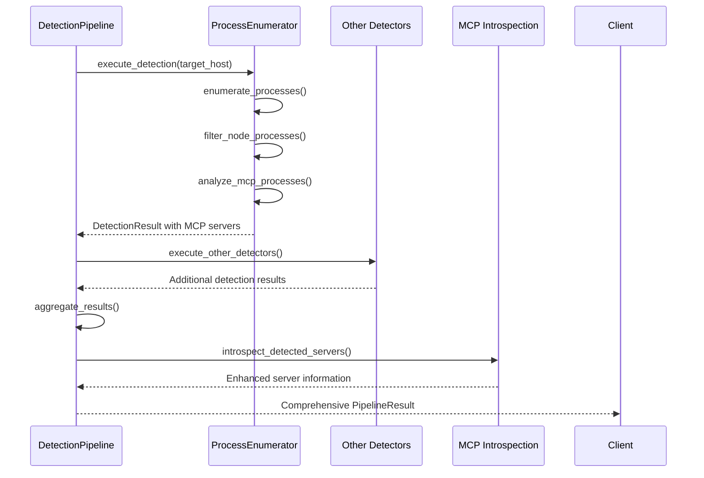

# Process Enumeration Engine Documentation

## Overview

The Process Enumeration Engine is a core component of the MCP detection system that discovers running MCP servers by analyzing system processes. This engine specializes in identifying Node.js processes that may be hosting MCP servers, analyzing their command-line arguments, environment variables, and execution context to determine MCP server presence with high confidence.

## System Architecture

### Core Components

The process enumeration system consists of four main architectural components:

1. **Process Discovery** - System-wide process enumeration using psutil
2. **Node.js Process Filtering** - Identification of Node.js runtime processes
3. **MCP Pattern Analysis** - Detection of MCP-specific indicators
4. **Confidence Assessment** - Scoring and ranking of potential MCP servers

### High-Level Architecture



## Process Discovery Architecture

### Multi-Stage Detection Pipeline

The process enumeration engine implements a sophisticated multi-stage pipeline for identifying MCP servers:



### Process Discovery Implementation



## Detection Algorithms

### Node.js Process Identification

The engine uses multiple strategies to identify Node.js processes:

#### 1. Executable Name Detection
```python
# Primary Node.js executables
node_executables = [
    'node',      # Standard Node.js runtime
    'nodejs',    # Alternative naming
    'npm',       # Node Package Manager
    'npx',       # Node Package eXecute
]
```

#### 2. Command Line Analysis
```python
# Detection patterns for Node.js processes
def is_node_process(process_info):
    # Direct executable name check
    if 'node' in process_info.name.lower():
        return True
    
    # Command line argument analysis
    for arg in process_info.cmdline:
        if 'node' in arg.lower():
            return True
    
    return False
```

#### 3. NPX Process Detection
```python
# NPX-specific detection patterns
def detect_npx_processes(processes):
    npx_processes = []
    for process in processes:
        cmdline_str = ' '.join(process.cmdline).lower()
        
        # Direct NPX execution
        if any('npx' in arg.lower() for arg in process.cmdline):
            npx_processes.append(process)
        
        # npm scripts that might run NPX
        if 'npm' in cmdline_str and ('start' in cmdline_str or 'run' in cmdline_str):
            npx_processes.append(process)
    
    return npx_processes
```

### MCP Pattern Analysis

The engine implements sophisticated pattern matching to identify MCP servers:

#### 1. MCP Keywords Detection
```python
mcp_keywords = [
    'mcp',                        # Basic MCP identifier
    'model-context-protocol',     # Full protocol name
    '@modelcontextprotocol',      # Official NPM scope
    'mcp-server',                 # Server implementations
    'mcp-client',                 # Client implementations
]
```

#### 2. File Pattern Analysis
```python
mcp_file_patterns = [
    'server.js',     # Common MCP server entry point
    'mcp.js',        # Explicit MCP files
    'index.js',      # Generic entry point (requires additional validation)
]

def validate_generic_patterns(process, pattern):
    """Validate generic patterns with additional context."""
    if pattern == 'index.js':
        # Only consider if in MCP-related directory
        if process.cwd:
            cwd_lower = process.cwd.lower()
            return any(keyword in cwd_lower for keyword in ['mcp', 'server', 'tool'])
    return True
```

#### 3. Environment Variable Analysis
```python
def analyze_environment_variables(process):
    """Analyze environment variables for MCP indicators."""
    mcp_indicators = []
    
    for var_name, var_value in process.env_vars.items():
        # Check variable names
        if any(keyword in var_name.lower() for keyword in mcp_keywords):
            mcp_indicators.append(f"Variable name: {var_name}")
        
        # Check variable values
        if any(keyword in var_value.lower() for keyword in mcp_keywords):
            mcp_indicators.append(f"Variable value: {var_name}={var_value}")
    
    return mcp_indicators
```

#### 4. Working Directory Analysis
```python
def analyze_working_directory(process):
    """Analyze working directory for MCP context."""
    if not process.cwd:
        return False
    
    cwd_lower = process.cwd.lower()
    return any(keyword in cwd_lower for keyword in mcp_keywords)
```

## Confidence Scoring System

The engine implements a sophisticated confidence scoring algorithm to rank potential MCP servers:

### Confidence Calculation Algorithm

```mermaid
flowchart TD
    A[Start Confidence Calculation] --> B[Initialize confidence = 0.0]
    B --> C{Direct MCP Package Reference}
    C -->|@modelcontextprotocol| D[+0.8 confidence]
    C -->|mcp-server/mcp-client| E[+0.7 confidence]
    C -->|Contains 'mcp'| F[+0.5 confidence]
    C -->|None| G[Continue]
    
    D --> H{Server Pattern?}
    E --> H
    F --> H
    G --> H
    
    H -->|server.js/server.ts| I[+0.3 confidence]
    H -->|None| J[Continue]
    
    I --> K{NPX Execution}
    J --> K
    
    K -->|Yes| L[+0.2 confidence]
    K -->|No| M[Continue]
    
    L --> N{MCP Environment Variables}
    M --> N
    
    N -->|Yes| O[+0.2 confidence]
    N -->|No| P[Continue]
    
    O --> Q{MCP Working Directory}
    P --> Q
    
    Q -->|Yes| R[+0.1 confidence]
    Q -->|No| S[Finalize]
    
    R --> T[min(confidence, 1.0)]
    S --> T
    T --> U[Return Confidence Score]
```

### Confidence Scoring Implementation

```python
def _calculate_confidence(self, process: ProcessInfo) -> float:
    """Calculate confidence score for MCP detection."""
    confidence = 0.0
    cmdline_str = ' '.join(process.cmdline).lower()
    
    # Direct MCP package references (high confidence)
    if '@modelcontextprotocol' in cmdline_str:
        confidence += 0.8
    elif 'mcp-server' in cmdline_str or 'mcp-client' in cmdline_str:
        confidence += 0.7
    elif 'mcp' in cmdline_str:
        confidence += 0.5
    
    # Server-like patterns
    if 'server.js' in cmdline_str or 'server.ts' in cmdline_str:
        confidence += 0.3
    
    # NPX execution (common for MCP tools)
    if any('npx' in arg for arg in process.cmdline):
        confidence += 0.2
    
    # Environment variables
    for var_name, var_value in process.env_vars.items():
        if 'mcp' in var_name.lower() or 'mcp' in var_value.lower():
            confidence += 0.2
            break
    
    # Working directory indicators
    if process.cwd and 'mcp' in process.cwd.lower():
        confidence += 0.1
    
    return min(confidence, 1.0)
```

## Process Information Data Model

### ProcessInfo Structure

The ProcessInfo class encapsulates all relevant information about a system process:



### Process Information Collection

```python
def _collect_process_info(self, proc: psutil.Process, include_env: bool) -> ProcessInfo:
    """Collect comprehensive process information."""
    env_vars = {}
    if include_env:
        try:
            env_vars = proc.environ()
        except (psutil.AccessDenied, psutil.NoSuchProcess):
            # Use partial environment if available
            env_vars = {}
    
    return ProcessInfo(
        pid=proc.pid,
        name=proc.name(),
        cmdline=proc.cmdline(),
        cwd=proc.cwd() if hasattr(proc, 'cwd') else None,
        env_vars=env_vars,
        user=proc.username() if hasattr(proc, 'username') else None,
        create_time=proc.create_time(),
        cpu_percent=proc.cpu_percent(),
        memory_percent=proc.memory_percent(),
    )
```

## Transport Type Detection

The engine implements transport type detection based on command-line analysis:

### Transport Detection Algorithm



### Port Extraction Logic

```python
def _extract_port_from_cmdline(self, cmdline: List[str]) -> Optional[int]:
    """Extract port number from command line arguments."""
    for i, arg in enumerate(cmdline):
        # Check for --port=XXXX or -p=XXXX
        if '=' in arg and any(prefix in arg.lower() for prefix in ['--port=', '-p=']):
            try:
                port_str = arg.split('=')[1]
                return int(port_str)
            except (ValueError, IndexError):
                continue
        
        # Check for --port XXXX or -p XXXX
        if arg.lower() in ['--port', '-p'] and i + 1 < len(cmdline):
            try:
                return int(cmdline[i + 1])
            except ValueError:
                continue
    
    return None
```

## Node.js Specific Detection Patterns

### NPX Package Detection

The engine includes specialized detection for NPX-based MCP servers:

```python
def detect_npx_mcp_patterns(self, process: ProcessInfo) -> Dict[str, Any]:
    """Detect NPX-specific MCP patterns."""
    npx_info = {
        'is_npx_process': False,
        'package_name': None,
        'execution_args': [],
        'mcp_package_type': None
    }
    
    cmdline_str = ' '.join(process.cmdline).lower()
    
    if 'npx' in cmdline_str:
        npx_info['is_npx_process'] = True
        
        # Extract NPX package name
        npx_index = None
        for i, arg in enumerate(process.cmdline):
            if arg.lower() == 'npx':
                npx_index = i
                break
        
        if npx_index is not None and npx_index + 1 < len(process.cmdline):
            package_name = process.cmdline[npx_index + 1]
            npx_info['package_name'] = package_name
            npx_info['execution_args'] = process.cmdline[npx_index + 2:]
            
            # Classify MCP package type
            if '@modelcontextprotocol' in package_name:
                npx_info['mcp_package_type'] = 'official'
            elif 'mcp-server' in package_name or 'mcp-client' in package_name:
                npx_info['mcp_package_type'] = 'community'
            elif 'mcp' in package_name:
                npx_info['mcp_package_type'] = 'possible'
    
    return npx_info
```

### Node.js Environment Analysis

```python
def analyze_node_environment(self, process: ProcessInfo) -> Dict[str, Any]:
    """Analyze Node.js specific environment context."""
    node_context = {
        'node_version': None,
        'npm_version': None,
        'working_directory_type': None,
        'package_manager': None,
        'execution_context': None
    }
    
    # Check for Node.js version in environment
    if 'NODE_VERSION' in process.env_vars:
        node_context['node_version'] = process.env_vars['NODE_VERSION']
    
    # Check for NPM configuration
    npm_vars = [var for var in process.env_vars.keys() if var.startswith('npm_')]
    if npm_vars:
        node_context['package_manager'] = 'npm'
    
    # Analyze working directory structure
    if process.cwd:
        if os.path.exists(os.path.join(process.cwd, 'package.json')):
            node_context['working_directory_type'] = 'npm_project'
        elif os.path.exists(os.path.join(process.cwd, 'node_modules')):
            node_context['working_directory_type'] = 'node_project'
    
    # Determine execution context
    if any('npx' in arg for arg in process.cmdline):
        node_context['execution_context'] = 'npx'
    elif any('npm' in arg for arg in process.cmdline):
        node_context['execution_context'] = 'npm_script'
    elif process.name.lower() in ['node', 'nodejs']:
        node_context['execution_context'] = 'direct_node'
    
    return node_context
```

## Error Handling and Edge Cases

### Process Access Control

The engine implements robust error handling for process access limitations:

```python
def _safe_process_access(self, proc: psutil.Process, include_env: bool) -> Optional[ProcessInfo]:
    """Safely access process information with error handling."""
    try:
        # Basic process information (usually accessible)
        basic_info = {
            'pid': proc.pid,
            'name': proc.name(),
        }
        
        # Command line (may be restricted)
        try:
            basic_info['cmdline'] = proc.cmdline()
        except (psutil.AccessDenied, psutil.NoSuchProcess, psutil.ZombieProcess):
            basic_info['cmdline'] = []
        
        # Working directory (may be restricted)
        try:
            basic_info['cwd'] = proc.cwd()
        except (psutil.AccessDenied, psutil.NoSuchProcess):
            basic_info['cwd'] = None
        
        # Environment variables (often restricted)
        env_vars = {}
        if include_env:
            try:
                env_vars = proc.environ()
            except (psutil.AccessDenied, psutil.NoSuchProcess):
                # Fallback to partial environment if available
                env_vars = {}
        
        basic_info['env_vars'] = env_vars
        
        return ProcessInfo(**basic_info)
        
    except (psutil.NoSuchProcess, psutil.ZombieProcess):
        # Process disappeared or is zombie
        return None
    except Exception as e:
        self.logger.debug(f"Unexpected error accessing process {proc.pid}: {e}")
        return None
```

### Cross-Platform Compatibility

```python
def _get_process_user_safely(self, proc: psutil.Process) -> Optional[str]:
    """Get process user with cross-platform compatibility."""
    try:
        if hasattr(proc, 'username'):
            return proc.username()
        elif hasattr(proc, 'uids'):
            # Unix-like systems
            return str(proc.uids().real)
        else:
            return None
    except (psutil.AccessDenied, psutil.NoSuchProcess):
        return None
    except Exception:
        return None
```

## Performance Optimization

### Process Enumeration Optimization

```python
def _optimized_process_enumeration(self, include_env: bool) -> List[ProcessInfo]:
    """Optimized process enumeration for large systems."""
    processes = []
    
    # Use process iterator with minimal attributes first
    basic_attrs = ['pid', 'name', 'cmdline']
    
    for proc_info in psutil.process_iter(attrs=basic_attrs):
        try:
            # Quick filter for Node.js processes
            name = proc_info.info.get('name', '').lower()
            cmdline = proc_info.info.get('cmdline', [])
            
            if not self._is_likely_node_process(name, cmdline):
                continue
            
            # Get detailed info only for likely Node.js processes
            detailed_info = self._get_detailed_process_info(
                proc_info.info['pid'], include_env
            )
            
            if detailed_info:
                processes.append(detailed_info)
                
        except (psutil.NoSuchProcess, psutil.ZombieProcess):
            continue
    
    return processes

def _is_likely_node_process(self, name: str, cmdline: List[str]) -> bool:
    """Quick check if process is likely Node.js-related."""
    # Check executable name
    if any(node_exec in name for node_exec in self.node_executables):
        return True
    
    # Check command line for Node.js indicators
    cmdline_str = ' '.join(cmdline).lower() if cmdline else ''
    return any(node_exec in cmdline_str for node_exec in self.node_executables)
```

### Caching and Memoization

```python
def _cached_process_analysis(self, process: ProcessInfo) -> Dict[str, Any]:
    """Cache expensive process analysis operations."""
    cache_key = f"{process.pid}_{hash(tuple(process.cmdline))}"
    
    if hasattr(self, '_analysis_cache') and cache_key in self._analysis_cache:
        return self._analysis_cache[cache_key]
    
    analysis_result = {
        'confidence': self._calculate_confidence(process),
        'mcp_indicators': self._has_mcp_indicators(process),
        'transport_type': self._detect_transport_type(process),
        'port': self._extract_port_from_cmdline(process.cmdline),
    }
    
    # Cache results
    if not hasattr(self, '_analysis_cache'):
        self._analysis_cache = {}
    
    self._analysis_cache[cache_key] = analysis_result
    return analysis_result
```

## Integration with Detection Pipeline

### Pipeline Integration



### Result Aggregation

```python
def aggregate_with_other_detectors(self, 
                                 process_results: List[ProcessInfo],
                                 other_results: Dict[DetectionMethod, List[DetectionResult]]) -> List[MCPServerInfo]:
    """Aggregate process enumeration results with other detection methods."""
    
    consolidated_servers = []
    
    # Start with process enumeration results
    for process in process_results:
        server_info = self._create_mcp_server_info(process, "localhost")
        consolidated_servers.append({
            'server': server_info,
            'source': 'process_enumeration',
            'confidence': self._calculate_confidence(process)
        })
    
    # Cross-reference with config file discovery
    if DetectionMethod.CONFIG_FILE_DISCOVERY in other_results:
        for config_result in other_results[DetectionMethod.CONFIG_FILE_DISCOVERY]:
            if config_result.success and config_result.mcp_server:
                # Try to match with process results
                matched_process = self._match_config_to_process(
                    config_result.mcp_server, process_results
                )
                
                if matched_process:
                    # Enhance existing server info with config data
                    self._enhance_server_with_config(
                        matched_process, config_result.mcp_server.config_info
                    )
                else:
                    # Add as new server
                    consolidated_servers.append({
                        'server': config_result.mcp_server,
                        'source': 'config_discovery',
                        'confidence': config_result.confidence
                    })
    
    return [item['server'] for item in consolidated_servers]
```

## Usage Examples

### Basic Process Enumeration

```python
from hawkeye.detection.process_enum import ProcessEnumerator

# Initialize the process enumerator
enumerator = ProcessEnumerator()

# Perform detection
result = enumerator.detect(
    target_host="localhost",
    include_env=True,
    detailed_analysis=True
)

if result.success:
    server = result.mcp_server
    print(f"Found MCP server:")
    print(f"  PID: {server.process_info.pid}")
    print(f"  Command: {' '.join(server.process_info.cmdline)}")
    print(f"  Transport: {server.transport_type}")
    print(f"  Confidence: {result.confidence:.2f}")
else:
    print(f"No MCP servers detected: {result.error_message}")
```

### Detailed Process Analysis

```python
# Get all Node.js processes for manual analysis
node_processes = enumerator.get_all_node_processes(include_env=True)

for process in node_processes:
    print(f"PID {process.pid}: {process.name}")
    print(f"  Command: {' '.join(process.cmdline)}")
    print(f"  Working Dir: {process.cwd}")
    print(f"  Is Node.js: {process.is_node_process}")
    print(f"  Has MCP indicators: {process.has_mcp_indicators}")
    
    if process.has_mcp_indicators:
        confidence = enumerator._calculate_confidence(process)
        print(f"  MCP Confidence: {confidence:.2f}")
```

### Specific Process Analysis

```python
# Analyze a specific process by PID
specific_process = enumerator.analyze_process_by_pid(1234, include_env=True)

if specific_process:
    print(f"Process {specific_process.pid} analysis:")
    print(f"  Name: {specific_process.name}")
    print(f"  Command: {' '.join(specific_process.cmdline)}")
    
    # Check for MCP indicators
    if specific_process.has_mcp_indicators:
        server_info = enumerator._create_mcp_server_info(specific_process, "localhost")
        print(f"  Detected as MCP server: {server_info.server_type}")
        print(f"  Transport type: {server_info.transport_type}")
        print(f"  Port: {server_info.port}")
```

## Future Enhancements

### Planned Improvements

1. **Machine Learning Integration**: Use ML models to improve MCP server detection accuracy
2. **Process Behavior Analysis**: Monitor process behavior patterns over time
3. **Network Connection Analysis**: Correlate process network connections with MCP protocols
4. **Container Process Detection**: Enhanced detection for containerized MCP servers
5. **Cross-Platform Optimization**: Platform-specific optimization for Windows, macOS, and Linux

### Advanced Features Roadmap

1. **Real-time Process Monitoring**: Continuous monitoring for new MCP server processes
2. **Process Relationship Mapping**: Understand parent-child process relationships
3. **Resource Usage Analysis**: Monitor CPU, memory, and I/O patterns of MCP servers
4. **Security Context Analysis**: Analyze process security contexts and permissions
5. **Performance Impact Assessment**: Measure detection performance impact on system resources 