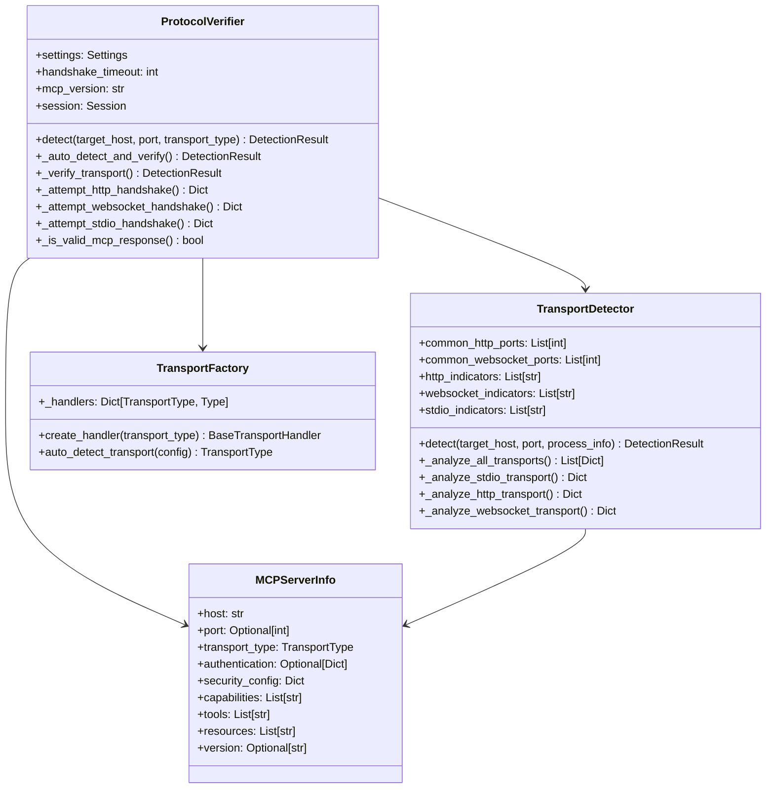
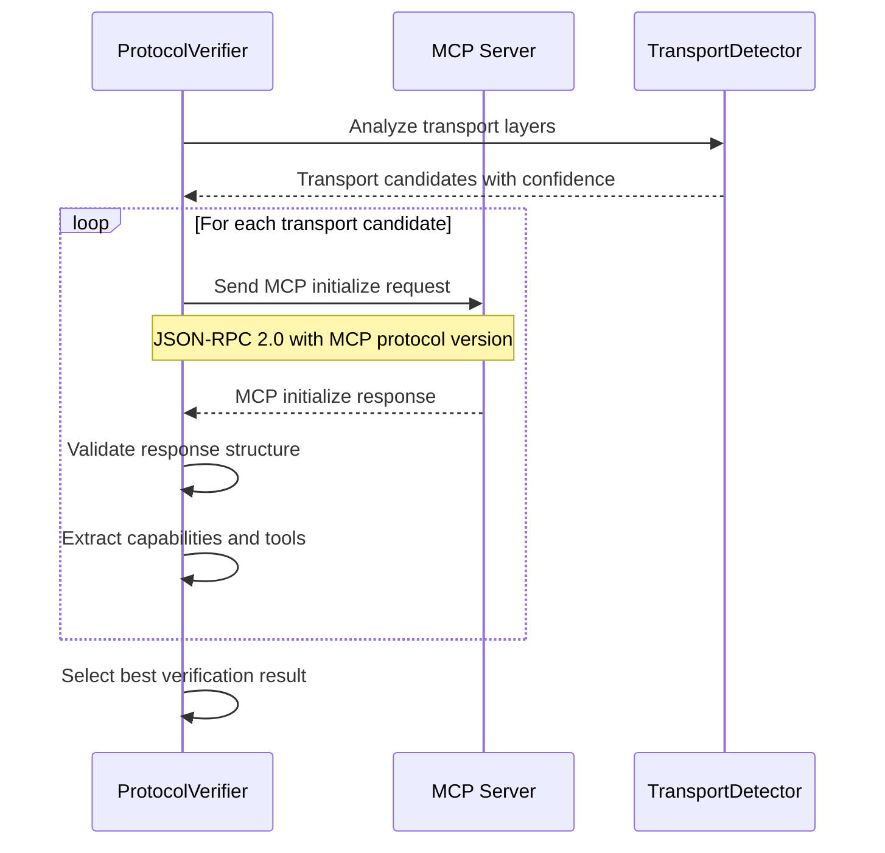
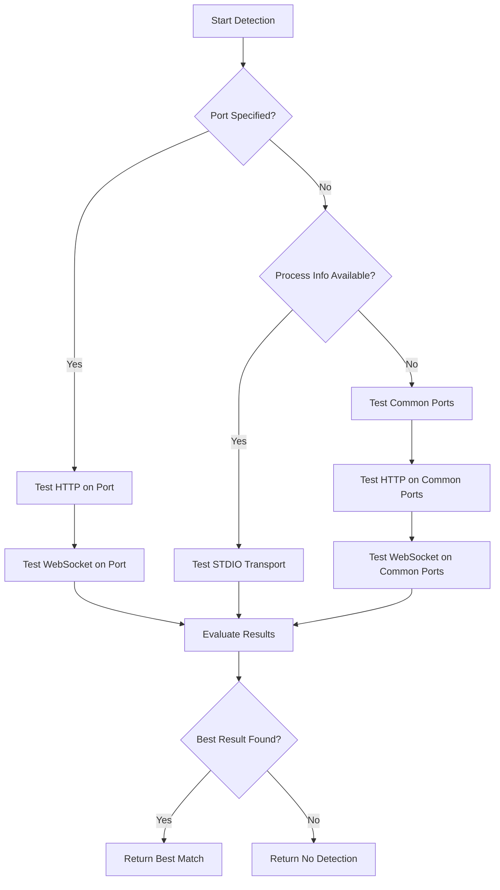
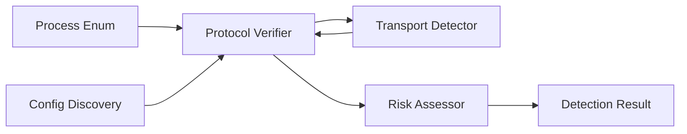

# Protocol Verification Engine

## Overview

The Protocol Verification Engine is a critical component of the HawkEye detection system that validates MCP (Model Context Protocol) servers through direct protocol handshake simulation. This engine performs actual MCP protocol communication to confirm server implementation and extract detailed capability information.

## Architecture

### Core Components



## MCP Handshake Simulation

### Protocol Communication Flow

The protocol verification engine implements the complete MCP handshake protocol:



### Initialize Request Structure

The engine sends standardized MCP initialize requests:

```json
{
    "jsonrpc": "2.0",
    "id": 1,
    "method": "initialize",
    "params": {
        "protocolVersion": "2024-11-05",
        "capabilities": {
            "roots": {"listChanged": true},
            "sampling": {}
        },
        "clientInfo": {
            "name": "HawkEye-Scanner",
            "version": "1.0.0"
        }
    }
}
```

### Response Validation Criteria

Valid MCP responses must contain:

1. **JSON-RPC 2.0 Structure**: `jsonrpc: "2.0"`
2. **Response Content**: Either `result` or `error` field
3. **MCP-Specific Fields**: At least one of:
   - `protocolVersion`
   - `capabilities`
   - `serverInfo`

## Transport Layer Identification

### Transport Detection Algorithms

The system identifies MCP transport layers through multiple detection methods:

#### 1. Command Line Analysis

```python
# Transport indicators in command line arguments
http_indicators = [
    'http://', 'https://', '--port', '-p', 'express', 'fastify', 'koa'
]
websocket_indicators = [
    'ws://', 'wss://', 'websocket', 'socket.io', 'ws'
]
stdio_indicators = [
    'stdio', 'stdin', 'stdout', 'pipe', 'npx'
]
```

#### 2. Port-Based Detection

The system tests common MCP ports for each transport type:

- **HTTP/HTTPS**: 3000-3010, 4000, 5000, 8000-8081, 8888, 9000-9002
- **WebSocket**: Same as HTTP ports
- **Secure Ports**: 443, 8443, 9443

#### 3. Configuration Analysis

Transport detection analyzes:

- **Package.json**: Script definitions and dependencies
- **Docker files**: Port exposures and command configurations
- **Environment variables**: Transport-specific settings

### Transport Priority Algorithm



## Authentication Mechanism Detection

### Environment Variable Analysis

The system detects authentication through environment variable patterns:

```python
# Authentication-related environment patterns
auth_patterns = [
    r'.*MCP.*AUTH.*',
    r'.*MCP.*TOKEN.*',
    r'.*MCP.*KEY.*',
    r'.*MCP.*SECRET.*'
]

# Known authentication variables
known_auth_vars = {
    'MCP_AUTH_TOKEN',
    'MCP_API_KEY',
    'MCP_SECRET_KEY',
    'MCP_ACCESS_TOKEN'
}
```

### Authentication Configuration Detection

The engine identifies authentication mechanisms through:

1. **Environment Variables**: API keys, tokens, secrets
2. **Configuration Files**: Authentication sections in configs
3. **Process Arguments**: Authentication flags and parameters
4. **Response Headers**: Authentication challenges and requirements

### Security Configuration Assessment

```python
def assess_security_config(self, mcp_server: MCPServerInfo) -> Dict[str, Any]:
    security_config = {}
    
    # Transport security
    if mcp_server.transport_type == TransportType.HTTP:
        security_config['secure'] = mcp_server.port == 443
        security_config['tls'] = mcp_server.security_config.get('tls', False)
    elif mcp_server.transport_type == TransportType.WEBSOCKET:
        security_config['secure'] = mcp_server.security_config.get('secure', False)
    elif mcp_server.transport_type == TransportType.STDIO:
        security_config['secure'] = True  # Inherently secure
    
    # Authentication assessment
    security_config['has_auth'] = mcp_server.has_authentication
    security_config['auth_type'] = self._determine_auth_type(mcp_server)
    
    return security_config
```

## Transport-Specific Verification

### HTTP Transport Verification

The HTTP verification process:

1. **Port Accessibility Check**: Socket-level port availability
2. **HTTP Request**: POST with MCP initialize payload
3. **Response Analysis**: Status code and content validation
4. **MCP Response Parsing**: JSON-RPC structure validation
5. **Capability Extraction**: Tools and resources enumeration

```python
def _attempt_http_handshake(self, url: str) -> Dict[str, Any]:
    # Send MCP initialize request via HTTP POST
    response = self.session.post(
        url,
        json=initialize_request,
        timeout=self.handshake_timeout,
        headers={
            'Content-Type': 'application/json',
            'User-Agent': 'HawkEye-MCP-Scanner/1.0'
        }
    )
    
    # Validate response and extract MCP data
    if response.status_code == 200:
        response_data = response.json()
        if self._is_valid_mcp_response(response_data):
            return {
                'success': True,
                'confidence': 0.9,
                'capabilities': response_data.get('result', {}).get('capabilities', {}),
                'version': response_data.get('result', {}).get('protocolVersion')
            }
```

### WebSocket Transport Verification

WebSocket verification uses async communication:

1. **WebSocket Connection**: Establish connection to target
2. **MCP Handshake**: Send initialize message
3. **Response Handling**: Process async response
4. **Connection Cleanup**: Proper connection termination

### STDIO Transport Verification

STDIO verification is more complex due to process isolation:

1. **Process Analysis**: Examine running process characteristics
2. **Heuristic Assessment**: Analyze command line and environment
3. **NPX Command Testing**: Attempt to execute NPX commands
4. **Pattern Matching**: Look for MCP-specific patterns

## Verification Confidence Scoring

### Confidence Calculation Algorithm

```python
def calculate_confidence(self, verification_result: Dict[str, Any]) -> float:
    base_confidence = 0.0
    
    # Direct MCP response (highest confidence)
    if verification_result.get('valid_mcp_response'):
        base_confidence = 0.9
    
    # MCP-like indicators in response
    elif verification_result.get('mcp_indicators'):
        base_confidence = 0.6
    
    # Heuristic indicators
    elif verification_result.get('heuristic_match'):
        base_confidence = 0.4
    
    # Bonus factors
    if verification_result.get('official_mcp_package'):
        base_confidence += 0.1
    
    if verification_result.get('capabilities_detected'):
        base_confidence += 0.1
    
    return min(base_confidence, 1.0)
```

### Confidence Levels

- **0.9-1.0**: Valid MCP JSON-RPC response with protocol version
- **0.7-0.8**: Strong MCP indicators in response content
- **0.5-0.6**: Moderate MCP patterns in response or configuration
- **0.3-0.4**: Weak heuristic matches
- **0.0-0.2**: No clear MCP indicators

## Error Handling and Resilience

### Exception Management

The protocol verifier implements comprehensive error handling:

```python
# Network-level errors (timeouts, connection refused)
except requests.exceptions.RequestException:
    # Silent handling - expected during scanning
    pass

# Protocol-level errors (invalid JSON, malformed responses)
except json.JSONDecodeError:
    # Log and continue with heuristic analysis
    self.logger.debug("Invalid JSON response")

# System-level errors (permissions, resource limits)
except Exception as e:
    # Log error and return failure result
    self.logger.error(f"Verification failed: {e}")
```

### Retry and Fallback Mechanisms

1. **HTTP Session Retry Strategy**: Automatic retries on transient failures
2. **Transport Fallback**: Try alternative transports if primary fails
3. **Timeout Management**: Configurable timeouts per transport type
4. **Graceful Degradation**: Return partial results when full verification fails

## Performance Considerations

### Optimization Strategies

1. **Connection Pooling**: Reuse HTTP connections across requests
2. **Parallel Detection**: Concurrent transport testing when possible
3. **Early Termination**: Stop on high-confidence matches
4. **Timeout Management**: Aggressive timeouts to prevent hanging
5. **Resource Cleanup**: Proper cleanup of network resources

### Resource Management

```python
# HTTP session with connection pooling
self.session = requests.Session()
retry_strategy = Retry(
    total=2,
    backoff_factor=0.5,
    status_forcelist=[429, 500, 502, 503, 504]
)
adapter = HTTPAdapter(max_retries=retry_strategy)
self.session.mount("http://", adapter)
self.session.mount("https://", adapter)
```

## Integration Points

### Pipeline Integration

The Protocol Verification Engine integrates with:

1. **Process Enumerator**: Receives process information for STDIO verification
2. **Configuration Discovery**: Uses config data for transport hints
3. **Transport Detection**: Coordinates with transport layer analysis
4. **Risk Assessment**: Provides verified capability data for risk analysis

### Data Flow



## Usage Examples

### Basic Protocol Verification

```python
verifier = ProtocolVerifier(settings)
result = verifier.detect(
    target_host="localhost",
    port=3000,
    transport_type=TransportType.HTTP
)

if result.success:
    print(f"MCP server verified: {result.mcp_server.capabilities}")
```

### Auto-Detection with Process Info

```python
result = verifier.detect(
    target_host="localhost",
    process_info=process_info,
    config_info=config_info
)
```

## Future Enhancements

### Planned Improvements

1. **Authentication Testing**: Active authentication mechanism testing
2. **Advanced Protocol Support**: Support for newer MCP protocol versions
3. **Custom Headers**: Configurable HTTP headers for verification
4. **Certificate Validation**: TLS certificate analysis for HTTPS
5. **Streaming Support**: Real-time streaming protocol verification

### Extension Points

- **Custom Transport Handlers**: Plugin architecture for new transport types
- **Authentication Providers**: Extensible authentication detection
- **Response Analyzers**: Custom response analysis plugins
- **Verification Strategies**: Pluggable verification algorithms 