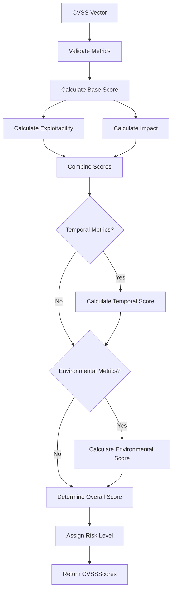
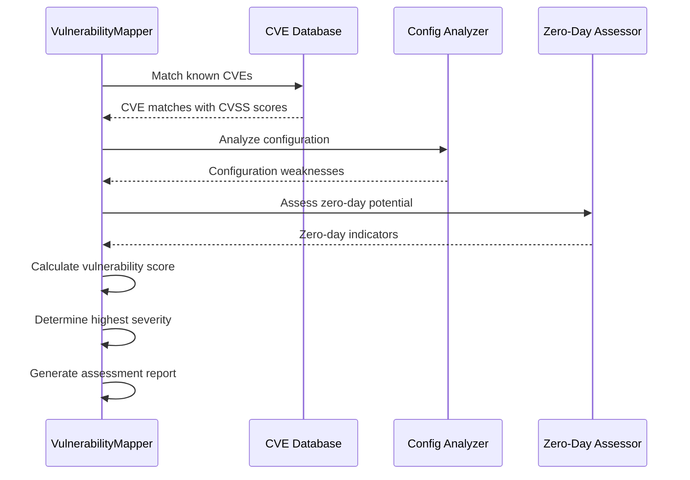
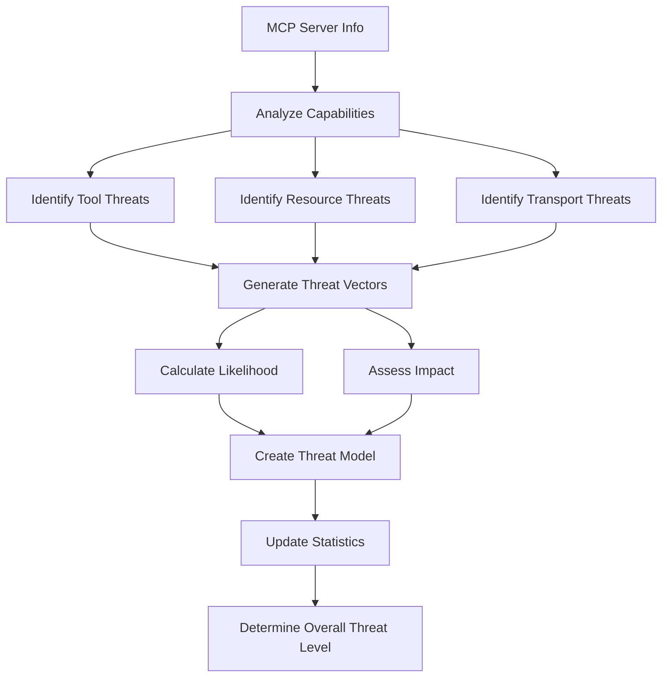
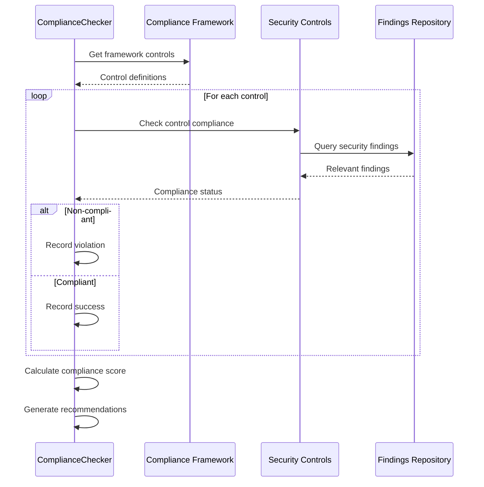
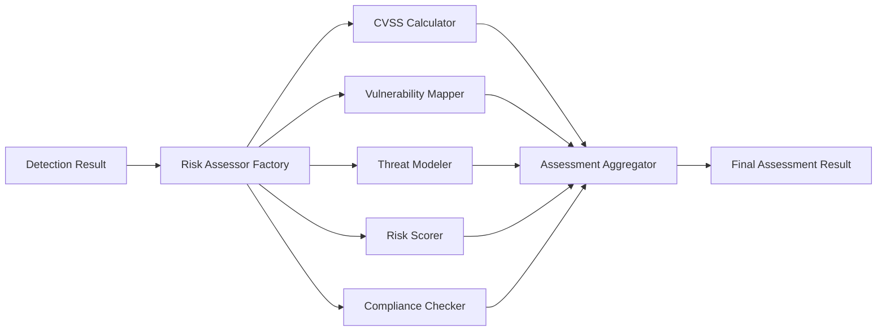

# Risk Assessment Integration

## Overview

The Risk Assessment Integration system provides comprehensive security risk analysis for MCP servers through vulnerability identification, CVSS scoring, threat modeling, and compliance framework mapping. This sophisticated system combines multiple assessment methodologies to generate accurate, actionable security insights for detected MCP deployments.

## Architecture

### Core Components

```mermaid
classDiagram
    class RiskAssessor {
        <<abstract>>
        +assess(detection_result) AssessmentResult
        +get_assessment_type() str
        +settings: Settings
    }
    
    class CVSSCalculator {
        +calculate_scores(cvss_vector) CVSSScores
        +_calculate_base_score() Tuple[float, float, float]
        +_calculate_temporal_score() Tuple[float, float]
        +_calculate_environmental_score() Tuple[float, float, float]
    }
    
    class VulnerabilityMapper {
        +map_vulnerabilities(tool_capabilities, environment) VulnerabilityAssessment
        +_match_cves(capabilities) List[CVEMatch]
        +_detect_configuration_weaknesses() List[ConfigWeakness]
        +_assess_zero_day_potential() List[ZeroDayPotential]
    }
    
    class ThreatModelingEngine {
        +generate_threat_model(server_info) ThreatModel
        +_analyze_capability_threats() List[ThreatVector]
        +_analyze_tool_threats() List[ThreatVector]
        +_analyze_resource_threats() List[ThreatVector]
    }
    
    class RiskScorer {
        +calculate_server_score(server_info, threat_model) CompositeRiskScore
        +_calculate_severity_score() float
        +_calculate_likelihood_score() float
        +_calculate_impact_score() float
        +method: ScoreMethod
    }
    
    class ComplianceChecker {
        +assess(detection_result) AssessmentResult
        +_assess_framework_compliance() ComplianceReport
        +_check_control_compliance() List[ComplianceViolation]
        +compliance_controls: List[ComplianceControl]
    }
    
    RiskAssessor <|-- ComplianceChecker
    RiskAssessor <|-- ConfigurationAnalyzer
    RiskAssessor <|-- TransportSecurityAssessor
    CVSSCalculator --> CVSSScores
    VulnerabilityMapper --> VulnerabilityAssessment
    ThreatModelingEngine --> ThreatModel
    RiskScorer --> CompositeRiskScore
    ComplianceChecker --> ComplianceReport
```



## CVSS Integration

### CVSS v3.1 Implementation

The system implements comprehensive CVSS (Common Vulnerability Scoring System) v3.1 scoring:

```python
@dataclass
class CVSSVector:
    # Base Score Metrics
    attack_vector: str = "N"  # Network, Adjacent, Local, Physical
    attack_complexity: str = "L"  # Low, High
    privileges_required: str = "N"  # None, Low, High
    user_interaction: str = "N"  # None, Required
    scope: str = "U"  # Unchanged, Changed
    confidentiality: str = "N"  # None, Low, High
    integrity: str = "N"  # None, Low, High
    availability: str = "N"  # None, Low, High
    
    # Temporal Score Metrics (optional)
    exploit_code_maturity: Optional[str] = None
    remediation_level: Optional[str] = None
    report_confidence: Optional[str] = None
    
    # Environmental Score Metrics (optional)
    confidentiality_requirement: Optional[str] = None
    integrity_requirement: Optional[str] = None
    availability_requirement: Optional[str] = None
```

### Score Calculation Algorithm



### Score Components Calculation

#### Base Score Calculation
```python
def _calculate_base_score(self, vector: CVSSVector) -> Tuple[float, float, float]:
    # Get metric values
    av = CVSS_METRICS['AV'][vector.attack_vector]
    ac = CVSS_METRICS['AC'][vector.attack_complexity]
    ui = CVSS_METRICS['UI'][vector.user_interaction]
    
    # Privileges Required depends on Scope
    if vector.scope == 'C':  # Changed
        pr = CVSS_METRICS['PR_CHANGED'][vector.privileges_required]
    else:  # Unchanged
        pr = CVSS_METRICS['PR'][vector.privileges_required]
    
    # Calculate Exploitability Score
    exploitability = 8.22 * av * ac * pr * ui
    
    # Calculate Impact Score
    iss = 1 - ((1 - c) * (1 - i) * (1 - a))
    
    if vector.scope == 'U':  # Unchanged
        impact = 6.42 * iss
    else:  # Changed
        impact = 7.52 * (iss - 0.029) - 3.25 * pow(iss - 0.02, 15)
    
    # Calculate Base Score
    if impact <= 0:
        base_score = 0.0
    else:
        if vector.scope == 'U':  # Unchanged
            base_score = min(10.0, (impact + exploitability))
        else:  # Changed
            base_score = min(10.0, 1.08 * (impact + exploitability))
    
    return math.ceil(base_score * 10) / 10, exploitability, impact
```

#### Risk Level Assignment
```python
def calculate_risk_level(self) -> RiskLevel:
    if self.overall_score == 0.0:
        return RiskLevel.NONE
    elif self.overall_score < 4.0:
        return RiskLevel.LOW
    elif self.overall_score < 7.0:
        return RiskLevel.MEDIUM
    elif self.overall_score < 9.0:
        return RiskLevel.HIGH
    else:
        return RiskLevel.CRITICAL
```

## Vulnerability Identification and Classification

### Vulnerability Categories

The system classifies vulnerabilities across multiple categories:

```python
class VulnerabilityCategory(Enum):
    AUTHENTICATION = "authentication"
    AUTHORIZATION = "authorization"
    ENCRYPTION = "encryption"
    CONFIGURATION = "configuration"
    NETWORK = "network"
    INPUT_VALIDATION = "input_validation"
    SESSION_MANAGEMENT = "session_management"
    ERROR_HANDLING = "error_handling"
    LOGGING = "logging"
    COMPLIANCE = "compliance"
```

### Vulnerability Assessment Process



### CVE Matching Algorithm

```python
def _match_cves(self, tool_capabilities: ToolCapabilities) -> List[CVEMatch]:
    """Match tool capabilities against known CVE database."""
    matches = []
    
    # Extract identifying information
    tool_name = tool_capabilities.tool_name.lower()
    version = tool_capabilities.version
    dependencies = tool_capabilities.external_dependencies
    
    # Search CVE database
    for cve_id, cve_data in self._cve_database.items():
        # Check tool name matches
        if any(product in tool_name for product in cve_data.get('affected_products', [])):
            # Check version ranges
            if self._version_in_range(version, cve_data.get('version_ranges', [])):
                match = CVEMatch(
                    cve_id=cve_id,
                    cvss_score=cve_data.get('cvss_score', 0.0),
                    severity=cve_data.get('severity', CVESeverity.UNKNOWN),
                    description=cve_data.get('description', ''),
                    affected_component=tool_name,
                    confidence_score=self._calculate_match_confidence(cve_data, tool_capabilities)
                )
                matches.append(match)
    
    return matches
```

### Configuration Weakness Detection

```python
def _detect_configuration_weaknesses(
    self, 
    tool_capabilities: ToolCapabilities, 
    environment_context: EnvironmentContext
) -> List[ConfigWeakness]:
    """Detect configuration-based security weaknesses."""
    weaknesses = []
    
    # Check authentication configuration
    if not tool_capabilities.requires_authentication:
        weakness = ConfigWeakness(
            weakness_id="CW-001",
            title="No Authentication Required",
            description="Tool does not require authentication for access",
            severity=SeverityLevel.HIGH,
            category=VulnerabilityType.AUTHENTICATION_BYPASS,
            affected_capability=tool_capabilities.tool_name,
            remediation="Implement authentication mechanisms"
        )
        weaknesses.append(weakness)
    
    # Check encryption usage
    if not environment_context.uses_encryption:
        weakness = ConfigWeakness(
            weakness_id="CW-002",
            title="No Transport Encryption",
            description="Communications are not encrypted in transit",
            severity=SeverityLevel.MEDIUM,
            category=VulnerabilityType.CONFIGURATION_WEAKNESS,
            affected_capability="transport",
            remediation="Enable TLS/SSL encryption"
        )
        weaknesses.append(weakness)
    
    return weaknesses
```

### Zero-Day Potential Assessment

```python
def _assess_zero_day_potential(
    self,
    tool_capabilities: ToolCapabilities,
    environment_context: EnvironmentContext
) -> List[ZeroDayPotential]:
    """Assess potential for zero-day vulnerabilities."""
    potentials = []
    
    # Analyze high-risk capabilities
    high_risk_capabilities = [
        cap for cap in tool_capabilities.capability_categories
        if cap in [CapabilityCategory.FILE_SYSTEM, CapabilityCategory.NETWORK_ACCESS]
    ]
    
    for capability in high_risk_capabilities:
        potential = ZeroDayPotential(
            potential_id=f"ZD-{capability.value}",
            title=f"Zero-day potential in {capability.value}",
            description=f"Complex {capability.value} operations may contain undiscovered vulnerabilities",
            likelihood=self._calculate_zero_day_likelihood(capability, tool_capabilities),
            impact=self._assess_zero_day_impact(capability, environment_context),
            indicators=self._extract_zero_day_indicators(capability, tool_capabilities)
        )
        potentials.append(potential)
    
    return potentials
```

## Threat Modeling

### Threat Vector Analysis

The system implements capability-based threat modeling:

```python
class ThreatCategory(str, Enum):
    PRIVILEGE_ESCALATION = "privilege_escalation"
    DATA_EXFILTRATION = "data_exfiltration"
    LATERAL_MOVEMENT = "lateral_movement"
    DENIAL_OF_SERVICE = "denial_of_service"
    CODE_INJECTION = "code_injection"
    CONFIGURATION_TAMPERING = "configuration_tampering"
    CREDENTIAL_THEFT = "credential_theft"
    SUPPLY_CHAIN = "supply_chain"
    INFORMATION_DISCLOSURE = "information_disclosure"
    UNAUTHORIZED_ACCESS = "unauthorized_access"
```

### Attack Vector Identification

```python
class AttackVector(str, Enum):
    TOOL_ABUSE = "tool_abuse"
    RESOURCE_MANIPULATION = "resource_manipulation"
    PROTOCOL_EXPLOITATION = "protocol_exploitation"
    CONFIGURATION_WEAKNESS = "configuration_weakness"
    TRANSPORT_INTERCEPTION = "transport_interception"
    AUTHENTICATION_BYPASS = "authentication_bypass"
    INPUT_VALIDATION = "input_validation"
    DEPENDENCY_CONFUSION = "dependency_confusion"
```

### Threat Model Generation



### Threat Vector Creation

```python
def _analyze_capability_threats(self, server_info: MCPServerInfo) -> List[ThreatVector]:
    """Analyze threats based on server capabilities."""
    threats = []
    
    for tool in server_info.tools:
        # Check for file system access threats
        if 'file' in tool.name.lower() or 'fs' in tool.name.lower():
            threat = ThreatVector(
                vector_id=f"TV-{tool.name}-file-access",
                name="Unauthorized File Access",
                description="Tool may allow unauthorized access to file system",
                category=ThreatCategory.PRIVILEGE_ESCALATION,
                attack_vector=AttackVector.TOOL_ABUSE,
                likelihood=self._calculate_threat_likelihood(tool, server_info),
                impact=RiskLevel.HIGH,
                affected_assets=[tool.name, "file system"],
                prerequisites=["tool access", "file system permissions"],
                mitigations=["access controls", "sandboxing", "least privilege"]
            )
            threats.append(threat)
        
        # Check for network access threats  
        if any(keyword in tool.name.lower() for keyword in ['http', 'web', 'fetch', 'request']):
            threat = ThreatVector(
                vector_id=f"TV-{tool.name}-network-access",
                name="Unauthorized Network Access",
                description="Tool may allow unauthorized network communications",
                category=ThreatCategory.DATA_EXFILTRATION,
                attack_vector=AttackVector.TOOL_ABUSE,
                likelihood=self._calculate_threat_likelihood(tool, server_info),
                impact=RiskLevel.MEDIUM,
                affected_assets=[tool.name, "network"],
                prerequisites=["tool access", "network connectivity"],
                mitigations=["firewall rules", "network segmentation", "monitoring"]
            )
            threats.append(threat)
    
    return threats
```

## Composite Risk Scoring

### Scoring Methodologies

The system supports multiple risk scoring approaches:

```python
class ScoreMethod(str, Enum):
    CVSS_LIKE = "cvss_like"
    WEIGHTED_AVERAGE = "weighted_average"
    MULTIPLICATIVE = "multiplicative"
    MAXIMUM = "maximum"
    CUSTOM = "custom"
```

### Score Components

```python
class ScoreComponent(str, Enum):
    SEVERITY = "severity"
    LIKELIHOOD = "likelihood"
    IMPACT = "impact"
    EXPOSURE = "exposure"
    EXPLOITABILITY = "exploitability"
    BUSINESS_IMPACT = "business_impact"
    TECHNICAL_IMPACT = "technical_impact"
    COMPLIANCE_IMPACT = "compliance_impact"
```

### Composite Score Calculation

```python
def calculate_server_score(
    self, 
    server_info: MCPServerInfo,
    threat_model: Optional[ThreatModel] = None,
    risk_profiles: Optional[Dict[RiskCategory, RiskProfile]] = None
) -> CompositeRiskScore:
    """Calculate composite risk score for MCP server."""
    
    # Calculate component scores
    severity_score = self._calculate_severity_score(server_info.security_risks)
    likelihood_score = self._calculate_likelihood_score(server_info.security_risks, threat_model)
    impact_score = self._calculate_impact_score(server_info.security_risks, threat_model)
    exposure_score = self._calculate_exposure_score(server_info)
    exploitability_score = self._calculate_exploitability_score(server_info.security_risks)
    business_impact_score = self._calculate_business_impact_score(server_info, risk_profiles)
    technical_impact_score = self._calculate_technical_impact_score(server_info.security_risks)
    compliance_impact_score = self._calculate_compliance_impact_score(server_info.security_risks)
    
    # Apply scoring methodology
    if self.method == ScoreMethod.CVSS_LIKE:
        overall_score = self._calculate_cvss_like_score(
            severity_score, likelihood_score, impact_score
        )
    elif self.method == ScoreMethod.WEIGHTED_AVERAGE:
        overall_score = self._calculate_weighted_average_score([
            (severity_score, self._component_weights[ScoreComponent.SEVERITY]),
            (likelihood_score, self._component_weights[ScoreComponent.LIKELIHOOD]),
            (impact_score, self._component_weights[ScoreComponent.IMPACT]),
            # ... other components
        ])
    
    # Create score breakdown
    breakdown = ScoreBreakdown(
        total_score=overall_score,
        severity_score=severity_score,
        likelihood_score=likelihood_score,
        impact_score=impact_score,
        exposure_score=exposure_score,
        exploitability_score=exploitability_score,
        business_impact_score=business_impact_score,
        technical_impact_score=technical_impact_score,
        compliance_impact_score=compliance_impact_score,
        method=self.method,
        confidence=self._calculate_confidence(server_info)
    )
    
    return CompositeRiskScore(
        server_id=server_info.server_id,
        overall_score=overall_score,
        risk_level=self._score_to_risk_level(overall_score),
        score_breakdown=breakdown,
        contributing_risks=server_info.security_risks,
        threat_vectors=threat_model.threat_vectors if threat_model else [],
        recommendations=self._generate_recommendations(server_info, overall_score)
    )
```

## Compliance Framework Mapping

### Supported Frameworks

The system supports mapping to major compliance frameworks:

```python
class ComplianceFramework(Enum):
    OWASP_TOP_10 = "owasp_top_10"
    NIST_CSF = "nist_csf"
    ISO_27001 = "iso_27001"
    SOC2 = "soc2"
    PCI_DSS = "pci_dss"
    GDPR = "gdpr"
```

### Framework Control Mapping

```python
def _init_compliance_mappings(self) -> None:
    """Initialize compliance framework mappings."""
    self.compliance_mappings = {
        VulnerabilityCategory.AUTHENTICATION: [
            ComplianceFramework.OWASP_TOP_10,  # A07:2021 - Identification and Authentication Failures
            ComplianceFramework.NIST_CSF,      # PR.AC-1: Identities and credentials are issued
            ComplianceFramework.ISO_27001      # A.9.2: User access management
        ],
        VulnerabilityCategory.AUTHORIZATION: [
            ComplianceFramework.OWASP_TOP_10,  # A01:2021 - Broken Access Control
            ComplianceFramework.NIST_CSF,      # PR.AC-4: Access permissions are managed
            ComplianceFramework.SOC2           # CC6.1: Logical and physical access controls
        ],
        VulnerabilityCategory.ENCRYPTION: [
            ComplianceFramework.NIST_CSF,      # PR.DS-1: Data-at-rest is protected
            ComplianceFramework.ISO_27001,     # A.10.1: Cryptographic controls
            ComplianceFramework.PCI_DSS,       # Requirement 3: Protect stored cardholder data
            ComplianceFramework.GDPR           # Article 32: Security of processing
        ]
    }
```

### Compliance Assessment Process



### Control Compliance Checking

```python
def _check_control_compliance(
    self, 
    control: ComplianceControl, 
    findings: List[SecurityFinding]
) -> List[ComplianceViolation]:
    """Check compliance against a specific control."""
    violations = []
    
    # Find findings that relate to this control
    relevant_findings = [
        finding for finding in findings
        if finding.category in control.applicable_categories
        and finding.severity in control.severity_levels
    ]
    
    for finding in relevant_findings:
        # Check if finding violates control requirements
        if self._finding_violates_control(finding, control):
            violation = ComplianceViolation(
                control_id=control.control_id,
                control_name=control.name,
                framework=control.framework,
                violation_description=f"Finding '{finding.title}' violates control requirement",
                severity=finding.severity,
                finding_id=finding.id,
                remediation_effort=self._estimate_remediation_effort(finding, control),
                business_impact=self._assess_business_impact(finding, control)
            )
            violations.append(violation)
    
    return violations
```

### Compliance Scoring

```python
def _calculate_compliance_score(self, framework_controls: List[ComplianceControl], 
                               violations: List[ComplianceViolation]) -> float:
    """Calculate compliance score for a framework."""
    if not framework_controls:
        return 100.0
    
    # Weight violations by severity
    violation_weight = 0
    for violation in violations:
        weight = self.scoring_weights.get(violation.severity, 1)
        violation_weight += weight
    
    # Calculate maximum possible weight
    max_weight = len(framework_controls) * self.scoring_weights[RiskLevel.CRITICAL]
    
    # Calculate score (100 - weighted violations percentage)
    if max_weight == 0:
        return 100.0
    
    score = max(0, 100 - (violation_weight / max_weight * 100))
    return round(score, 2)
```

## Integration Architecture

### Assessment Pipeline Integration



### Data Flow Architecture

```python
class RiskAssessmentPipeline:
    def __init__(self):
        self.cvss_calculator = CVSSCalculator()
        self.vulnerability_mapper = VulnerabilityMapper()
        self.threat_modeler = ThreatModelingEngine()
        self.risk_scorer = RiskScorer()
        self.compliance_checker = ComplianceChecker()
    
    def assess_mcp_server(self, detection_result: DetectionResult) -> ComprehensiveAssessment:
        """Perform comprehensive risk assessment."""
        
        # Extract server capabilities
        capabilities = self._extract_capabilities(detection_result.mcp_server)
        environment = self._extract_environment_context(detection_result)
        
        # Vulnerability assessment
        vuln_assessment = self.vulnerability_mapper.map_vulnerabilities(capabilities, environment)
        
        # Threat modeling
        threat_model = self.threat_modeler.generate_threat_model(detection_result.mcp_server)
        
        # Risk scoring
        risk_score = self.risk_scorer.calculate_server_score(
            detection_result.mcp_server, threat_model
        )
        
        # CVSS scoring for identified vulnerabilities
        cvss_scores = []
        for vuln in vuln_assessment.vulnerabilities:
            if vuln.cvss_vector:
                scores = self.cvss_calculator.calculate_scores(vuln.cvss_vector)
                cvss_scores.append(scores)
        
        # Compliance assessment
        compliance_result = self.compliance_checker.assess(
            detection_result,
            findings=vuln_assessment.security_findings
        )
        
        return ComprehensiveAssessment(
            target_host=detection_result.target_host,
            vulnerability_assessment=vuln_assessment,
            threat_model=threat_model,
            risk_score=risk_score,
            cvss_scores=cvss_scores,
            compliance_assessment=compliance_result,
            overall_risk_level=risk_score.risk_level,
            recommendations=self._generate_consolidated_recommendations(
                vuln_assessment, threat_model, risk_score, compliance_result
            )
        )
```

## Security Finding Management

### Finding Structure

```python
@dataclass
class SecurityFinding:
    id: str
    title: str
    description: str
    category: VulnerabilityCategory
    severity: RiskLevel
    confidence: float  # 0.0 to 1.0
    affected_asset: str
    evidence: Dict[str, Any] = field(default_factory=dict)
    remediation: Optional[str] = None
    references: List[str] = field(default_factory=list)
    
    def calculate_priority_score(self) -> float:
        """Calculate priority score based on severity and confidence."""
        severity_weights = {
            RiskLevel.CRITICAL: 10.0,
            RiskLevel.HIGH: 7.5,
            RiskLevel.MEDIUM: 5.0,
            RiskLevel.LOW: 2.5,
            RiskLevel.NONE: 0.0
        }
        return severity_weights.get(self.severity, 0.0) * self.confidence
```

### Finding Aggregation and Deduplication

```python
def aggregate_findings(self, findings: List[SecurityFinding]) -> List[SecurityFinding]:
    """Aggregate and deduplicate security findings."""
    finding_groups = defaultdict(list)
    
    # Group similar findings
    for finding in findings:
        key = self._generate_finding_key(finding)
        finding_groups[key].append(finding)
    
    aggregated = []
    for group in finding_groups.values():
        if len(group) == 1:
            aggregated.append(group[0])
        else:
            # Merge similar findings
            merged = self._merge_findings(group)
            aggregated.append(merged)
    
    # Sort by priority score
    aggregated.sort(key=lambda f: f.calculate_priority_score(), reverse=True)
    return aggregated
```

## Performance Considerations

### Caching and Optimization

```python
class CachedRiskAssessment:
    def __init__(self):
        self._vulnerability_cache = {}
        self._threat_model_cache = {}
        self._compliance_cache = {}
    
    def assess_with_cache(self, detection_result: DetectionResult) -> AssessmentResult:
        """Perform assessment with intelligent caching."""
        cache_key = self._generate_cache_key(detection_result)
        
        # Check for cached results
        if cache_key in self._assessment_cache:
            cached_result = self._assessment_cache[cache_key]
            if self._is_cache_valid(cached_result):
                return cached_result
        
        # Perform fresh assessment
        result = self._perform_assessment(detection_result)
        
        # Cache result
        self._assessment_cache[cache_key] = result
        return result
```

### Parallel Processing

```python
async def assess_multiple_servers(self, detection_results: List[DetectionResult]) -> List[AssessmentResult]:
    """Assess multiple servers in parallel."""
    tasks = []
    
    for result in detection_results:
        task = asyncio.create_task(self._async_assess_server(result))
        tasks.append(task)
    
    # Wait for all assessments to complete
    assessments = await asyncio.gather(*tasks, return_exceptions=True)
    
    # Filter successful assessments
    successful_assessments = [
        assessment for assessment in assessments
        if isinstance(assessment, AssessmentResult)
    ]
    
    return successful_assessments
```

## Usage Examples

### Basic Risk Assessment

```python
# Initialize assessment pipeline
pipeline = RiskAssessmentPipeline()

# Perform comprehensive assessment
assessment = pipeline.assess_mcp_server(detection_result)

print(f"Overall Risk Level: {assessment.overall_risk_level}")
print(f"Risk Score: {assessment.risk_score.overall_score}")
print(f"Vulnerabilities Found: {len(assessment.vulnerability_assessment.vulnerabilities)}")
print(f"Compliance Score: {assessment.compliance_assessment.overall_score}")
```

### CVSS Scoring

```python
# Create CVSS vector
vector = CVSSVector(
    attack_vector="N",  # Network
    attack_complexity="L",  # Low
    privileges_required="N",  # None
    user_interaction="N",  # None
    scope="U",  # Unchanged
    confidentiality="H",  # High
    integrity="H",  # High
    availability="H"  # High
)

# Calculate scores
calculator = CVSSCalculator()
scores = calculator.calculate_scores(vector)

print(f"Base Score: {scores.base_score}")
print(f"Risk Level: {scores.risk_level}")
```

### Threat Modeling

```python
# Generate threat model
threat_engine = ThreatModelingEngine()
threat_model = threat_engine.generate_threat_model(mcp_server_info)

# Analyze threats
high_risk_threats = [
    threat for threat in threat_model.threat_vectors
    if threat.impact in [RiskLevel.HIGH, RiskLevel.CRITICAL]
]

print(f"Total Threats: {len(threat_model.threat_vectors)}")
print(f"High Risk Threats: {len(high_risk_threats)}")
print(f"Overall Threat Level: {threat_model.overall_threat_level}")
```

### Compliance Checking

```python
# Check specific framework compliance
compliance_checker = ComplianceChecker()
result = compliance_checker.assess(
    detection_result,
    frameworks=[ComplianceFramework.OWASP_TOP_10, ComplianceFramework.NIST_CSF],
    findings=security_findings
)

for report in result.compliance_reports:
    print(f"{report.framework}: {report.compliance_score}% compliant")
    print(f"Violations: {len(report.violations)}")
```

## Future Enhancements

### Planned Improvements

1. **Machine Learning Integration**: AI-powered vulnerability prediction and risk scoring
2. **Dynamic Threat Intelligence**: Real-time threat intelligence integration
3. **Behavioral Analysis**: Runtime behavior analysis for anomaly detection
4. **Custom Risk Models**: User-defined risk scoring models and weights
5. **Integration APIs**: RESTful APIs for external security tools

### Extension Points

- **Custom Vulnerability Scanners**: Plugin architecture for specialized scanners
- **Threat Intelligence Feeds**: Integration with external threat data sources
- **Risk Scoring Algorithms**: Custom scoring methodologies and weights
- **Compliance Frameworks**: Support for additional regulatory frameworks
- **Remediation Engines**: Automated remediation suggestion and implementation 