# Detect Command Sequence Diagram

## Overview

This document provides a comprehensive sequence diagram for the `detect` command workflow, showing the interaction between CLI components, detection pipeline, traditional detection methods, enhanced MCP introspection, and reporting systems.

## Main Detection Workflow

The following Mermaid sequence diagram illustrates the complete detection process from CLI command to final results:

```mermaid
sequenceDiagram
    participant User
    participant CLI as CLI Commands
    participant TE as TargetEnumerator
    participant DP as DetectionPipeline
    participant PE as ProcessEnumerator
    participant CD as ConfigDiscovery
    participant PV as ProtocolVerifier
    participant TD as TransportDetector
    participant NX as NPXDetector
    participant DI as DockerInspector
    participant EA as EnvironmentAnalyzer
    participant MI as MCPIntrospector
    participant TF as TransportFactory
    participant MC as MCPClient
    participant TD_DISC as ToolDiscovery
    participant RD as ResourceDiscovery
    participant CA as CapabilityAssessment
    participant AGG as ServerInfoAggregator
    participant RA as RiskAssessment
    participant REP as Reporter

    %% Phase 0: Command Initialization
    User->>CLI: hawkeye detect comprehensive -t 192.168.1.100
    CLI->>CLI: Parse parameters and validate options
    CLI->>CLI: Create PipelineConfig with settings
    
    %% Target Enumeration
    CLI->>TE: Check if target contains CIDR notation
    alt CIDR Range Detected
        TE->>TE: enumerate_targets(192.168.1.0/24)
        TE-->>CLI: List of individual IP addresses
    else Single Target
        CLI->>CLI: Use target as-is
    end
    
    %% Pipeline Creation and Execution
    CLI->>DP: create_detection_pipeline(config, settings)
    DP->>DP: Initialize detectors based on config
    DP->>DP: Initialize MCP introspection system
    
    loop For each target
        CLI->>DP: execute_pipeline(target_host)
        
        %% Phase 1: Traditional Detection Methods
        Note over DP,EA: Phase 1: Traditional Detection Methods
        DP->>DP: _execute_traditional_detection(target_host)
        
        %% Process Enumeration
        DP->>PE: enumerate_mcp_processes()
        PE->>PE: Scan running processes for MCP indicators
        PE->>PE: Analyze command lines, environment variables
        PE->>PE: Extract process metadata (PID, user, cwd)
        PE-->>DP: List[DetectionResult] with ProcessInfo
        
        %% Configuration Discovery
        DP->>CD: detect(target_host)
        CD->>CD: Search for package.json, .env, docker files
        CD->>CD: Parse configuration files for MCP patterns
        CD->>CD: Extract server configurations and dependencies
        CD-->>DP: DetectionResult with config metadata
        
        %% Protocol Verification
        DP->>PV: detect(target_host, port)
        PV->>PV: Attempt MCP handshake simulation
        PV->>PV: Verify MCP protocol compliance
        PV->>PV: Test initialization sequence
        PV-->>DP: DetectionResult with protocol info
        
        %% Transport Detection
        DP->>TD: detect(target_host, port)
        TD->>TD: Probe for HTTP/WebSocket/stdio transports
        TD->>TD: Analyze transport layer characteristics
        TD->>TD: Identify connection parameters
        TD-->>DP: DetectionResult with transport info
        
        %% NPX Package Detection
        DP->>NX: detect(target_host)
        NX->>NX: Search for NPX-based MCP servers
        NX->>NX: Analyze package.json for MCP dependencies
        NX->>NX: Check for global NPX installations
        NX-->>DP: DetectionResult with NPX package info
        
        %% Docker Inspection
        DP->>DI: detect(target_host)
        DI->>DI: Inspect Docker containers for MCP services
        DI->>DI: Analyze container configurations
        DI->>DI: Extract exposed ports and environment
        DI-->>DP: DetectionResult with Docker info
        
        %% Environment Analysis
        DP->>EA: detect(target_host)
        EA->>EA: Analyze system environment variables
        EA->>EA: Check for MCP-related configurations
        EA->>EA: Assess system context and security posture
        EA-->>DP: DetectionResult with environment info
        
        %% Phase 2: Enhanced MCP Introspection
        Note over DP,AGG: Phase 2: Enhanced MCP Introspection
        DP->>DP: _execute_introspection(target_host, results)
        DP->>DP: _extract_mcp_servers(detection_results)
        
        loop For each discovered MCP server
            DP->>MI: introspect_server(server_info, process_info)
            
            %% Transport Connection
            MI->>TF: create_transport(server_config)
            TF->>TF: Determine optimal transport (HTTP/stdio/SSE)
            TF-->>MI: Transport instance
            
            %% MCP Client Connection
            MI->>MC: connect_to_server(transport, config)
            MC->>MC: Establish connection using transport
            MC->>MC: Perform MCP initialization handshake
            MC->>MC: Exchange capabilities and metadata
            MC-->>MI: Connected client session
            
            %% Tool Discovery
            MI->>TD_DISC: discover_tools(server_config)
            TD_DISC->>MC: Send tools/list request
            MC-->>TD_DISC: List of available tools
            TD_DISC->>TD_DISC: Parse tool schemas and capabilities
            TD_DISC->>TD_DISC: Assess tool risk levels
            TD_DISC-->>MI: DiscoveryResult with tools
            
            %% Resource Discovery
            MI->>RD: discover_resources(server_config)
            RD->>MC: Send resources/list request
            MC-->>RD: List of available resources
            RD->>RD: Analyze resource types and access patterns
            RD->>RD: Evaluate resource security implications
            RD-->>MI: DiscoveryResult with resources
            
            %% Capability Assessment
            MI->>CA: assess_capabilities(server_config)
            CA->>CA: Analyze server capabilities from handshake
            CA->>CA: Evaluate experimental features
            CA->>CA: Map capabilities to security categories
            CA-->>MI: Capability assessment results
            
            %% Server Information Aggregation
            MI->>AGG: aggregate_server_info(discoveries)
            AGG->>AGG: Combine tool, resource, and capability data
            AGG->>AGG: Generate comprehensive server profile
            AGG->>AGG: Calculate overall risk metrics
            AGG-->>MI: Aggregated MCPCapabilities
            
            %% Risk Assessment
            alt Risk Assessment Enabled
                MI->>RA: assess_security_risks(capabilities)
                RA->>RA: Analyze tools for dangerous capabilities
                RA->>RA: Evaluate access control mechanisms
                RA->>RA: Generate risk scores and classifications
                RA-->>MI: Risk assessment results
            end
            
            MI-->>DP: MCPCapabilities for server
        end
        
        %% Phase 3: Result Analysis and Aggregation
        Note over DP,DP: Phase 3: Result Analysis and Aggregation
        DP->>DP: _analyze_results(result)
        DP->>DP: Calculate statistics and metrics
        DP->>DP: Identify best MCP server findings
        DP->>DP: Aggregate risk assessments
        DP->>DP: Generate warnings and errors
        
        DP-->>CLI: PipelineResult with comprehensive data
    end
    
    %% Results Display and Reporting
    CLI->>CLI: display_comprehensive_results(results)
    CLI->>CLI: Display detection summary tables
    CLI->>CLI: Show introspection findings
    CLI->>CLI: Present risk assessment data
    CLI->>CLI: Display pipeline statistics
    
    %% Optional Report Generation
    alt Output File Specified
        CLI->>REP: Select reporter based on format
        CLI->>REP: convert_pipeline_results_to_report(results)
        REP->>REP: Transform data to report format
        REP->>REP: Generate formatted output (JSON/CSV/XML/HTML)
        REP-->>CLI: Generated report content
        CLI->>CLI: Save report to file
    end
    
    %% Optional Introspection Report
    alt Introspection Report Requested
        CLI->>REP: Generate detailed introspection report
        REP->>REP: Create comprehensive analysis document
        REP->>REP: Include server details and risk assessments
        REP-->>CLI: Introspection report content
        CLI->>CLI: Save introspection report
    end
    
    CLI-->>User: Detection complete with results
```

## Key Workflow Phases

### Phase 1: Traditional Detection Methods

Traditional detection methods run sequentially and include:

1. **Process Enumeration**: Scans running processes for MCP-related indicators
2. **Configuration Discovery**: Searches for MCP configuration files and dependencies
3. **Protocol Verification**: Attempts MCP protocol handshakes on discovered services
4. **Transport Detection**: Probes for different transport layer implementations
5. **NPX Detection**: Identifies NPX-based MCP server packages
6. **Docker Inspection**: Analyzes Docker containers for MCP services
7. **Environment Analysis**: Examines system environment for MCP-related configurations

### Phase 2: Enhanced MCP Introspection

For each MCP server discovered in Phase 1:

1. **Transport Creation**: Establishes appropriate transport layer (HTTP/stdio/SSE)
2. **Client Connection**: Connects using MCP protocol and exchanges capabilities
3. **Tool Discovery**: Enumerates available tools and analyzes their schemas
4. **Resource Discovery**: Lists accessible resources and evaluates permissions
5. **Capability Assessment**: Maps server capabilities to security categories
6. **Information Aggregation**: Combines all discovery data into comprehensive profile
7. **Risk Assessment**: Evaluates security implications and generates risk scores

### Phase 3: Result Analysis and Aggregation

1. **Statistics Calculation**: Computes detection success rates and performance metrics
2. **Best Findings Identification**: Selects highest-confidence detection results
3. **Risk Aggregation**: Combines individual server risks into overall assessment
4. **Error and Warning Collection**: Gathers any issues encountered during detection

## Command Variants

The sequence diagram applies to all detect command variants with minor variations:

- **comprehensive**: Full pipeline with introspection (shown above)
- **target**: Traditional detection only on specific targets
- **local**: Traditional detection on localhost with local-specific detectors
- **process**: Focused analysis on specific process ID
- **config**: Configuration file discovery in specified paths

## Error Handling

The pipeline includes comprehensive error handling at each phase:

- Individual detector failures don't stop the pipeline
- Introspection failures are logged but don't prevent other servers
- Transport connection failures trigger fallback mechanisms
- All errors are collected and reported in final results

## Performance Considerations

- Traditional detection methods run sequentially to avoid resource conflicts
- MCP introspection is synchronous to avoid async complexity
- Connection pooling is used for transport efficiency
- Results are cached to avoid redundant introspection
- Timeout mechanisms prevent hanging operations 