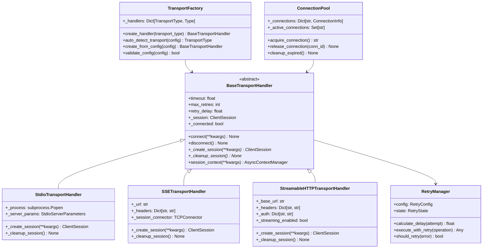
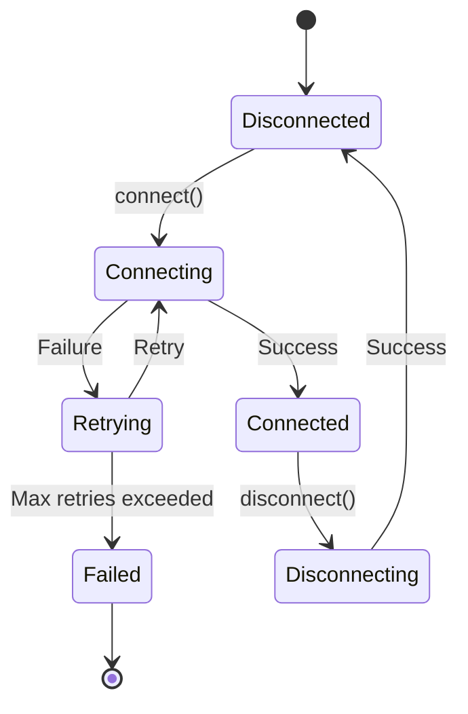
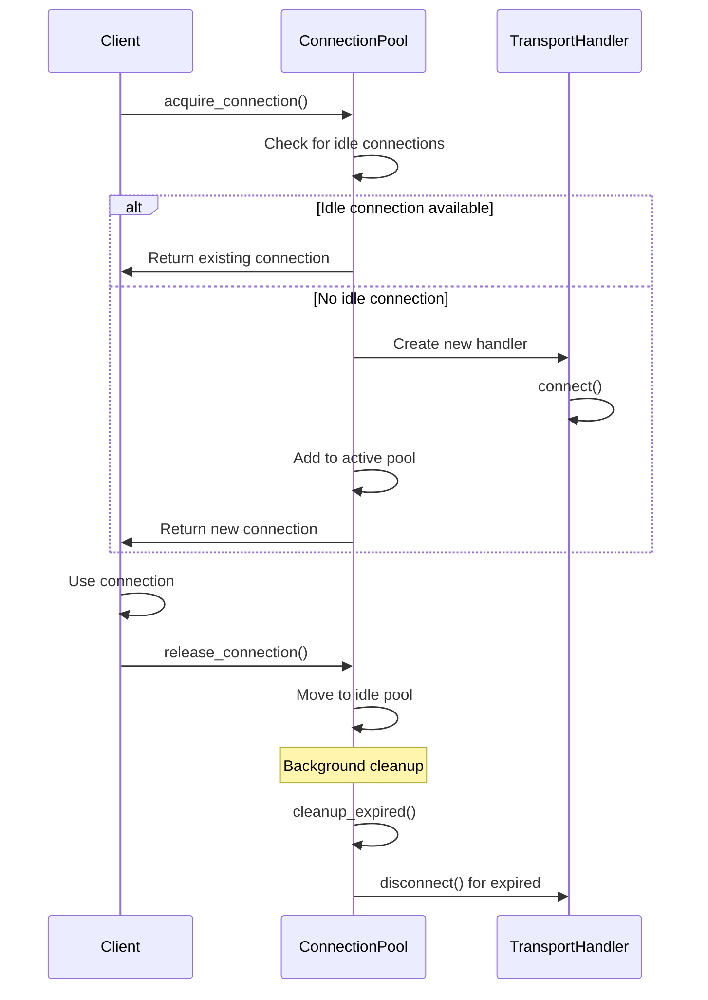
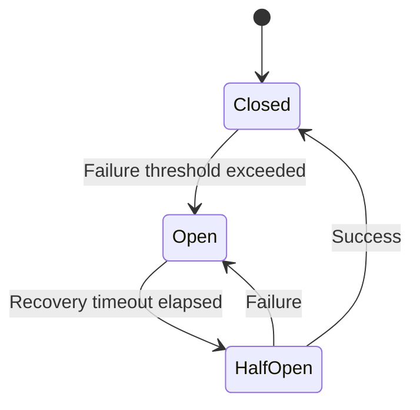

# Transport Detection and Abstraction

## Overview

The Transport Detection and Abstraction system provides a flexible, extensible architecture for detecting and communicating with MCP servers across different transport protocols. This system abstracts the complexity of multiple transport types behind a unified interface while providing robust connection management, retry strategies, and protocol switching capabilities.

## Architecture

### Core Components



## Transport Layer Architecture

### Abstract Base Handler

The `BaseTransportHandler` provides a common interface for all transport implementations:

```python
class BaseTransportHandler(ABC):
    def __init__(self, timeout=30.0, max_retries=3, retry_delay=1.0, logger=None):
        self.timeout = timeout
        self.max_retries = max_retries
        self.retry_delay = retry_delay
        self._session: Optional[ClientSession] = None
        self._connected = False
    
    @abstractmethod
    async def _create_session(self, **kwargs) -> ClientSession:
        """Create transport-specific MCP client session."""
        pass
    
    @abstractmethod
    async def _cleanup_session(self) -> None:
        """Clean up transport-specific resources."""
        pass
```

### Connection Lifecycle Management



## Transport Type Detection

### Auto-Detection Algorithm

The transport factory implements sophisticated auto-detection based on configuration analysis:

```python
def auto_detect_transport(self, config: Dict[str, Any]) -> TransportType:
    # 1. Explicit transport specification
    if 'transport' in config:
        return TransportType(config['transport'].lower())
    
    # 2. Command-based detection (STDIO)
    if 'command' in config or 'args' in config:
        return TransportType.STDIO
    
    # 3. URL-based detection
    if 'url' in config:
        url = config['url']
        parsed = urlparse(url)
        
        if parsed.scheme in ('http', 'https'):
            # SSE indicators
            if any(indicator in url.lower() for indicator in ['sse', 'events', 'stream']):
                return TransportType.SSE
            else:
                return TransportType.HTTP
    
    # 4. Base URL detection (HTTP)
    if 'base_url' in config:
        return TransportType.HTTP
    
    # 5. Default fallback
    return TransportType.STDIO
```

### Configuration Pattern Matching

The system recognizes various configuration patterns for each transport type:

#### STDIO Configuration Patterns
```json
{
    "command": "node",
    "args": ["server.js"],
    "env": {"NODE_ENV": "production"},
    "cwd": "/path/to/server"
}
```

#### SSE Configuration Patterns
```json
{
    "url": "https://api.example.com/mcp/sse",
    "headers": {"Authorization": "Bearer token"},
    "verify_ssl": true
}
```

#### HTTP Configuration Patterns
```json
{
    "base_url": "https://api.example.com/mcp",
    "auth": {"bearer_token": "token"},
    "streaming": true,
    "headers": {"User-Agent": "MCP-Client/1.0"}
}
```

## Concrete Transport Implementations

### STDIO Transport Handler

Manages local MCP server processes via standard input/output:

```python
class StdioTransportHandler(BaseTransportHandler):
    async def _create_session(self, **kwargs) -> ClientSession:
        command = kwargs.get('command')
        args = kwargs.get('args', [])
        env = kwargs.get('env', {})
        
        # Create server parameters
        self._server_params = StdioServerParameters(
            command=command,
            args=args,
            env=env if env else None
        )
        
        # Create stdio client session
        session = await stdio_client(self._server_params)
        return session
```

**Key Features:**
- Process lifecycle management
- Environment variable injection
- Working directory control
- Graceful process termination
- Signal handling for cleanup

### SSE Transport Handler

Handles Server-Sent Events communication:

```python
class SSETransportHandler(BaseTransportHandler):
    async def _create_session(self, **kwargs) -> ClientSession:
        url = kwargs.get('url')
        headers = kwargs.get('headers', {})
        verify_ssl = kwargs.get('verify_ssl', True)
        
        # Create connector with optimized settings
        connector = aiohttp.TCPConnector(
            verify_ssl=verify_ssl,
            limit=10,
            limit_per_host=5,
            ttl_dns_cache=300,
            use_dns_cache=True,
        )
        
        # Establish SSE connection
        session = await self._create_sse_session(url, headers, connector)
        return session
```

**Key Features:**
- Event stream handling
- Connection persistence
- Automatic reconnection
- Header customization
- SSL/TLS support

### HTTP Transport Handler

Provides production-grade HTTP communication with streaming support:

```python
class StreamableHTTPTransportHandler(BaseTransportHandler):
    async def _create_session(self, **kwargs) -> ClientSession:
        base_url = kwargs.get('base_url')
        auth = kwargs.get('auth', {})
        streaming = kwargs.get('streaming', False)
        
        # Prepare authentication
        auth_headers = self._prepare_auth_headers(auth)
        
        # Create high-performance connector
        connector = aiohttp.TCPConnector(
            verify_ssl=kwargs.get('verify_ssl', True),
            limit=20,  # Higher limit for HTTP
            limit_per_host=10,
            ttl_dns_cache=300,
            use_dns_cache=True,
        )
        
        session = await self._create_http_session(
            base_url, auth_headers, connector, streaming
        )
        return session
```

**Key Features:**
- Authentication support (Bearer, API Key, Basic)
- Streaming response handling
- Request/response logging
- Connection pooling
- Proxy support

## Connection Management

### Connection Pool Architecture

The connection pool provides efficient resource management for concurrent connections:

```python
class ConnectionPool:
    def __init__(self, max_connections=50, idle_timeout=300, cleanup_interval=60):
        self._connections: Dict[str, ConnectionInfo] = {}
        self._active_connections: Set[str] = set()
        self._idle_connections: Set[str] = set()
        self.max_connections = max_connections
        self.idle_timeout = idle_timeout
```

### Connection Lifecycle



### Resource Management

```python
async def cleanup_expired(self) -> None:
    """Clean up expired idle connections."""
    current_time = time.time()
    expired_connections = []
    
    for conn_id in self._idle_connections.copy():
        if conn_id in self._connections:
            conn_info = self._connections[conn_id]
            if current_time - conn_info.last_used > self.idle_timeout:
                expired_connections.append(conn_id)
    
    # Clean up expired connections
    for conn_id in expired_connections:
        await self._cleanup_connection(conn_id, "expired")
```

## Retry Strategies and Resilience

### Retry Configuration

```python
@dataclass
class RetryConfig:
    max_attempts: int = 3
    base_delay: float = 1.0
    max_delay: float = 60.0
    backoff_multiplier: float = 2.0
    strategy: RetryStrategy = RetryStrategy.EXPONENTIAL
    jitter: bool = True
    jitter_range: float = 0.1
    
    # Circuit breaker configuration
    failure_threshold: int = 5
    recovery_timeout: float = 60.0
    half_open_max_calls: int = 3
```

### Retry Strategies

The system supports multiple retry strategies:

#### 1. Exponential Backoff
```python
def calculate_exponential_delay(self, attempt: int) -> float:
    delay = self.config.base_delay * (self.config.backoff_multiplier ** attempt)
    return min(delay, self.config.max_delay)
```

#### 2. Linear Backoff
```python
def calculate_linear_delay(self, attempt: int) -> float:
    delay = self.config.base_delay * (attempt + 1)
    return min(delay, self.config.max_delay)
```

#### 3. Fibonacci Backoff
```python
def calculate_fibonacci_delay(self, attempt: int) -> float:
    delay = self.config.base_delay * self._fibonacci(attempt + 1)
    return min(delay, self.config.max_delay)
```

### Circuit Breaker Pattern



```python
def should_retry(self, error: Exception) -> bool:
    # Check circuit breaker state
    if self.state.circuit_state == CircuitState.OPEN:
        # Check if recovery timeout has passed
        if self.state.circuit_opened_at:
            time_since_open = datetime.now() - self.state.circuit_opened_at
            if time_since_open.total_seconds() < self.config.recovery_timeout:
                return False  # Circuit breaker prevents retry
            else:
                # Move to half-open state
                self.state.circuit_state = CircuitState.HALF_OPEN
                self.state.half_open_calls = 0
    
    # Check retry limits
    return self.state.attempt_count < self.config.max_attempts
```

## Protocol Switching

### Dynamic Transport Selection

The system can dynamically switch between transport protocols based on runtime conditions:

```python
class AdaptiveTransportManager:
    def __init__(self, transport_factory: TransportFactory):
        self.factory = transport_factory
        self.fallback_chain = [
            TransportType.HTTP,
            TransportType.SSE,
            TransportType.STDIO
        ]
    
    async def connect_with_fallback(self, config: Dict[str, Any]) -> BaseTransportHandler:
        primary_transport = self.factory.auto_detect_transport(config)
        
        # Try primary transport first
        for transport_type in [primary_transport] + self.fallback_chain:
            if transport_type == primary_transport:
                continue  # Skip if already tried
                
            try:
                handler = self.factory.create_handler(transport_type)
                await handler.connect(**config)
                return handler
            except ConnectionFailedError:
                continue  # Try next transport
        
        raise ConnectionFailedError("All transport types failed")
```

### Transport Capability Negotiation

```python
async def negotiate_capabilities(self, handler: BaseTransportHandler) -> Dict[str, Any]:
    """Negotiate transport-specific capabilities."""
    capabilities = {
        'streaming': False,
        'bidirectional': True,
        'authentication': False,
        'compression': False
    }
    
    if isinstance(handler, StreamableHTTPTransportHandler):
        capabilities.update({
            'streaming': handler._streaming_enabled,
            'authentication': bool(handler._auth),
            'compression': True
        })
    elif isinstance(handler, SSETransportHandler):
        capabilities.update({
            'streaming': True,
            'bidirectional': False  # SSE is unidirectional
        })
    elif isinstance(handler, StdioTransportHandler):
        capabilities.update({
            'local_only': True,
            'process_control': True
        })
    
    return capabilities
```

## Error Handling and Resilience

### Exception Hierarchy

```python
class TransportError(Exception):
    """Base exception for transport-related errors."""
    pass

class ConnectionTimeoutError(TransportError):
    """Connection timeout during establishment."""
    pass

class ConnectionFailedError(TransportError):
    """Connection failed to establish."""
    pass

class ConnectionError(TransportError):
    """General connection issues during operation."""
    pass

class ProtocolMismatchError(TransportError):
    """Protocol version or format mismatch."""
    pass
```

### Graceful Degradation

```python
async def connect_with_degradation(self, config: Dict[str, Any]) -> BaseTransportHandler:
    """Connect with graceful capability degradation."""
    
    # Try full-featured connection first
    try:
        return await self._connect_full_featured(config)
    except ConnectionFailedError:
        pass
    
    # Try reduced capability connection
    try:
        reduced_config = self._reduce_capabilities(config)
        return await self._connect_with_config(reduced_config)
    except ConnectionFailedError:
        pass
    
    # Try minimal connection
    minimal_config = self._minimal_config(config)
    return await self._connect_with_config(minimal_config)
```

## Performance Optimizations

### Connection Pooling

```python
class OptimizedConnectionPool(ConnectionPool):
    async def _optimize_pool_size(self) -> None:
        """Dynamic pool size optimization based on usage patterns."""
        usage_stats = self._calculate_usage_stats()
        
        if usage_stats.avg_utilization > 0.8:
            # High utilization - increase pool size
            new_size = min(self.max_connections * 1.2, self.absolute_max)
            self.max_connections = int(new_size)
        elif usage_stats.avg_utilization < 0.3:
            # Low utilization - decrease pool size
            new_size = max(self.max_connections * 0.8, self.min_connections)
            self.max_connections = int(new_size)
```

### Asynchronous Operations

All transport operations are fully asynchronous to prevent blocking:

```python
async def parallel_transport_test(self, configs: List[Dict[str, Any]]) -> List[BaseTransportHandler]:
    """Test multiple transports in parallel."""
    tasks = []
    
    for config in configs:
        task = asyncio.create_task(self._test_single_transport(config))
        tasks.append(task)
    
    # Wait for all tests to complete
    results = await asyncio.gather(*tasks, return_exceptions=True)
    
    # Filter successful connections
    successful_handlers = [
        result for result in results 
        if isinstance(result, BaseTransportHandler)
    ]
    
    return successful_handlers
```

## Integration Points

### Detection Pipeline Integration


### Configuration Integration

The transport system integrates with the configuration management system:

```python
def load_transport_config(self, detection_result: DetectionResult) -> Dict[str, Any]:
    """Load transport configuration from detection results."""
    config = {}
    
    # Extract from process information
    if detection_result.mcp_server.process_info:
        config.update(self._extract_process_config(detection_result.mcp_server.process_info))
    
    # Extract from configuration files
    if detection_result.mcp_server.config_info:
        config.update(self._extract_file_config(detection_result.mcp_server.config_info))
    
    # Extract from environment
    if detection_result.mcp_server.environment_info:
        config.update(self._extract_env_config(detection_result.mcp_server.environment_info))
    
    return config
```

## Usage Examples

### Basic Transport Creation

```python
# Create transport factory
factory = TransportFactory()

# Auto-detect and create transport
config = {
    "command": "npx",
    "args": ["@modelcontextprotocol/server-filesystem", "/tmp"]
}
handler = factory.create_from_config(config)

# Connect and use
async with handler.session_context(**config) as session:
    # Perform MCP operations
    result = await session.initialize()
```

### Advanced Connection Management

```python
# Create connection pool
pool = ConnectionPool(max_connections=20, idle_timeout=300)

# Acquire connection with retry
retry_manager = RetryManager(RetryConfig(max_attempts=5))

async def connect_with_retry():
    return await pool.acquire_connection(
        lambda: factory.create_handler(TransportType.HTTP),
        connection_key="mcp-server-1",
        base_url="https://api.example.com/mcp"
    )

connection_id = await retry_manager.execute_with_retry(
    connect_with_retry, 
    "connect_to_mcp_server"
)
```

### Multi-Transport Fallback

```python
transport_configs = [
    {"base_url": "https://mcp.example.com"},  # HTTP first
    {"url": "https://mcp.example.com/sse"},   # SSE fallback
    {"command": "node", "args": ["local-server.js"]}  # Local fallback
]

for config in transport_configs:
    try:
        handler = factory.create_from_config(config)
        await handler.connect(**config)
        break  # Success - use this transport
    except ConnectionFailedError:
        continue  # Try next transport

if not handler.is_connected:
    raise ConnectionFailedError("All transport methods failed")
```

## Future Enhancements

### Planned Improvements

1. **WebSocket Transport**: Native WebSocket support for real-time communication
2. **gRPC Transport**: High-performance RPC transport for production deployments
3. **Message Queue Integration**: AMQP/Redis transport for distributed architectures
4. **Load Balancing**: Automatic load balancing across multiple server instances
5. **Health Monitoring**: Continuous health checks and automatic failover

### Extension Points

- **Custom Transport Handlers**: Plugin architecture for new transport types
- **Authentication Providers**: Extensible authentication mechanism support
- **Connection Middleware**: Request/response transformation and monitoring
- **Transport Metrics**: Detailed performance and reliability metrics
- **Dynamic Configuration**: Runtime configuration updates without disconnection 