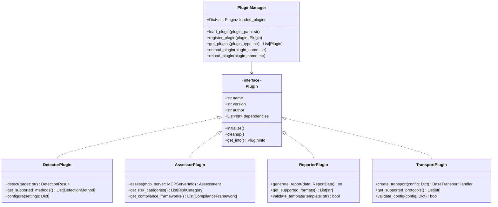

# Extension and Plugin Architecture

## 🔧 Executive Summary

HawkEye is designed with extensibility as a core principle, providing multiple extension points for custom detectors, assessors, reporters, and transport mechanisms. This document outlines the plugin architecture, extension interfaces, and development guidelines for creating custom components that integrate seamlessly with the HawkEye ecosystem.

## Plugin Architecture Overview

### 1. Core Extension Framework

**Plugin System Architecture**:


### 2. Extension Points

**Primary Extension Interfaces**:

| Extension Type | Base Class | Purpose | Examples |
|---------------|------------|---------|----------|
| **Detectors** | `MCPDetector` | Discover MCP servers | Process enumeration, network scanning |
| **Assessors** | `RiskAssessor` | Evaluate security risks | CVSS scoring, compliance checking |
| **Reporters** | `BaseReporter` | Generate output formats | HTML, PDF, SARIF, custom formats |
| **Transports** | `BaseTransportHandler` | Communication protocols | HTTP, WebSocket, gRPC, custom protocols |
| **AI Providers** | `AIProvider` | AI-powered analysis | Custom LLMs, specialized models |

## Detector Extension Development

### 1. MCPDetector Base Class

**Core Detector Interface**:
```python
from abc import ABC, abstractmethod
from typing import List, Optional, Dict, Any
from hawkeye.detection.base import MCPDetector, DetectionResult, DetectionMethod

class CustomDetector(MCPDetector):
    """Example custom detector implementation."""
    
    def __init__(self, settings=None):
        """Initialize the custom detector."""
        super().__init__(settings)
        
        # Detector-specific configuration
        self.detection_timeout = getattr(settings, 'custom_timeout', 30)
        self.custom_patterns = getattr(settings, 'custom_patterns', [])
        
        # Initialize any required resources
        self._init_detector_resources()
    
    @property
    def detection_method(self) -> DetectionMethod:
        """Return the detection method identifier."""
        return DetectionMethod.CUSTOM_DETECTION  # Define custom enum value
    
    @property
    def name(self) -> str:
        """Return the detector name."""
        return "Custom MCP Detector"
    
    @property
    def version(self) -> str:
        """Return the detector version."""
        return "1.0.0"
    
    def detect(self, target_host: str, **kwargs) -> DetectionResult:
        """
        Perform custom detection logic.
        
        Args:
            target_host: Target host to scan
            **kwargs: Additional detection parameters
            
        Returns:
            DetectionResult: Detection results with discovered servers
        """
        try:
            # Start detection process
            self.logger.info(f"Starting custom detection on {target_host}")
            
            # Custom detection logic
            servers = self._perform_custom_detection(target_host, **kwargs)
            
            # Create detection result
            result = DetectionResult(
                method=self.detection_method,
                target_host=target_host,
                success=len(servers) > 0,
                servers=servers,
                error_message=None,
                detection_time=time.time() - start_time,
                confidence=self._calculate_confidence(servers)
            )
            
            self.logger.info(f"Custom detection found {len(servers)} servers")
            return result
            
        except Exception as e:
            self.logger.error(f"Custom detection failed: {e}")
            return DetectionResult(
                method=self.detection_method,
                target_host=target_host,
                success=False,
                servers=[],
                error_message=str(e),
                detection_time=time.time() - start_time,
                confidence=0.0
            )
    
    def _perform_custom_detection(self, target_host: str, **kwargs) -> List[MCPServerInfo]:
        """Implement custom detection algorithm."""
        
        discovered_servers = []
        
        # Example: Custom service discovery
        for pattern in self.custom_patterns:
            servers = self._scan_for_pattern(target_host, pattern)
            discovered_servers.extend(servers)
        
        # Example: Protocol-specific detection
        protocol_servers = self._detect_custom_protocol(target_host)
        discovered_servers.extend(protocol_servers)
        
        return discovered_servers
    
    def _scan_for_pattern(self, target_host: str, pattern: str) -> List[MCPServerInfo]:
        """Scan for specific patterns indicating MCP servers."""
        
        # Implementation depends on detection method
        # Could be network scanning, file system analysis, etc.
        pass
    
    def _detect_custom_protocol(self, target_host: str) -> List[MCPServerInfo]:
        """Detect servers using custom protocol."""
        
        # Custom protocol detection logic
        pass
    
    def _calculate_confidence(self, servers: List[MCPServerInfo]) -> float:
        """Calculate confidence score for detection results."""
        
        if not servers:
            return 0.0
        
        # Custom confidence calculation based on detection criteria
        confidence_factors = []
        
        for server in servers:
            # Factor in detection method specificity
            method_confidence = 0.8  # Custom method confidence
            
            # Factor in response quality
            response_confidence = self._assess_response_quality(server)
            
            # Factor in additional validation
            validation_confidence = self._validate_server(server)
            
            server_confidence = (method_confidence + response_confidence + validation_confidence) / 3
            confidence_factors.append(server_confidence)
        
        return sum(confidence_factors) / len(confidence_factors)
```

### 2. Detector Registration and Integration

**Plugin Registration Process**:
```python
# detector_plugin.py
from hawkeye.detection.pipeline import DetectionPipeline
from hawkeye.detection.base import DetectionMethod

class CustomDetectorPlugin:
    """Plugin wrapper for custom detector."""
    
    def __init__(self):
        self.name = "Custom Detector Plugin"
        self.version = "1.0.0"
        self.author = "Security Team"
        self.dependencies = ["hawkeye>=1.0.0"]
    
    def initialize(self, plugin_manager):
        """Initialize the plugin and register components."""
        
        # Register new detection method
        DetectionMethod.CUSTOM_DETECTION = "custom_detection"
        
        # Register detector with pipeline
        plugin_manager.register_detector(
            method=DetectionMethod.CUSTOM_DETECTION,
            detector_class=CustomDetector,
            priority=5  # Execution priority
        )
        
        self.logger.info("Custom detector plugin initialized")
    
    def cleanup(self):
        """Clean up plugin resources."""
        # Cleanup logic
        pass

# Plugin discovery and loading
def load_detector_plugin(plugin_path: str):
    """Load and register a detector plugin."""
    
    import importlib.util
    
    spec = importlib.util.spec_from_file_location("plugin", plugin_path)
    plugin_module = importlib.util.module_from_spec(spec)
    spec.loader.exec_module(plugin_module)
    
    # Get plugin class
    plugin_class = getattr(plugin_module, 'CustomDetectorPlugin')
    plugin_instance = plugin_class()
    
    # Initialize plugin
    plugin_instance.initialize(plugin_manager=get_plugin_manager())
    
    return plugin_instance
```

## Risk Assessor Extension Development

### 1. RiskAssessor Base Class

**Custom Risk Assessment Implementation**:
```python
from hawkeye.assessment.base import RiskAssessor, Assessment, RiskLevel
from hawkeye.assessment.models import SecurityFinding, VulnerabilityCategory

class CustomRiskAssessor(RiskAssessor):
    """Custom risk assessment for specialized environments."""
    
    def __init__(self, settings=None):
        super().__init__(settings)
        
        # Custom risk assessment configuration
        self.industry_standards = getattr(settings, 'industry_standards', [])
        self.custom_risk_rules = self._load_custom_rules()
        self.severity_weights = self._init_severity_weights()
    
    @property
    def assessor_name(self) -> str:
        return "Custom Industry Risk Assessor"
    
    @property
    def version(self) -> str:
        return "1.0.0"
    
    def assess(self, mcp_server: MCPServerInfo, context: Dict[str, Any] = None) -> Assessment:
        """Perform custom risk assessment."""
        
        assessment = Assessment(
            target=f"{mcp_server.host}:{mcp_server.port}",
            assessor=self.assessor_name,
            assessment_time=datetime.utcnow(),
            findings=[],
            overall_risk=RiskLevel.UNKNOWN,
            recommendations=[]
        )
        
        try:
            # Custom industry-specific risk checks
            industry_findings = self._assess_industry_compliance(mcp_server)
            assessment.findings.extend(industry_findings)
            
            # Custom configuration risk assessment
            config_findings = self._assess_custom_configuration(mcp_server)
            assessment.findings.extend(config_findings)
            
            # Custom environmental risk factors
            env_findings = self._assess_environmental_risks(mcp_server, context)
            assessment.findings.extend(env_findings)
            
            # Calculate overall risk
            assessment.overall_risk = self._calculate_overall_risk(assessment.findings)
            
            # Generate custom recommendations
            assessment.recommendations = self._generate_custom_recommendations(assessment.findings)
            
        except Exception as e:
            self.logger.error(f"Custom risk assessment failed: {e}")
            assessment.error_message = str(e)
        
        return assessment
    
    def _assess_industry_compliance(self, mcp_server: MCPServerInfo) -> List[SecurityFinding]:
        """Assess compliance with industry-specific standards."""
        
        findings = []
        
        for standard in self.industry_standards:
            # Check standard-specific requirements
            violations = self._check_compliance_standard(mcp_server, standard)
            
            for violation in violations:
                finding = SecurityFinding(
                    id=f"industry_{standard}_{violation['rule_id']}",
                    title=f"Industry Standard Violation: {violation['title']}",
                    description=violation['description'],
                    category=VulnerabilityCategory.COMPLIANCE,
                    severity=violation['severity'],
                    confidence=violation['confidence'],
                    affected_asset=f"{mcp_server.host}:{mcp_server.port}",
                    evidence=violation['evidence'],
                    remediation=violation['remediation'],
                    compliance_violations=[standard]
                )
                findings.append(finding)
        
        return findings
    
    def _assess_custom_configuration(self, mcp_server: MCPServerInfo) -> List[SecurityFinding]:
        """Assess custom configuration risks."""
        
        findings = []
        
        # Custom rule evaluation
        for rule in self.custom_risk_rules:
            if self._evaluate_rule(mcp_server, rule):
                finding = SecurityFinding(
                    id=f"custom_config_{rule['id']}",
                    title=rule['title'],
                    description=rule['description'],
                    category=rule['category'],
                    severity=rule['severity'],
                    confidence=rule['confidence'],
                    affected_asset=f"{mcp_server.host}:{mcp_server.port}",
                    evidence=rule.get('evidence', {}),
                    remediation=rule['remediation']
                )
                findings.append(finding)
        
        return findings
```

## Reporter Extension Development

### 1. Custom Report Formats

**Custom Reporter Implementation**:
```python
from hawkeye.reporting.base import BaseReporter, ReportData
from jinja2 import Template
import json

class CustomFormatReporter(BaseReporter):
    """Custom report format generator."""
    
    def __init__(self, settings=None):
        super().__init__(settings)
        
        self.template_engine = self._init_template_engine()
        self.custom_formatters = self._load_custom_formatters()
    
    @property
    def format_name(self) -> str:
        return "custom-format"
    
    @property
    def file_extension(self) -> str:
        return ".custom"
    
    @property
    def content_type(self) -> str:
        return "application/vnd.hawkeye.custom+json"
    
    def generate_report(self, report_data: ReportData, output_path: str = None) -> str:
        """Generate custom format report."""
        
        try:
            # Transform data for custom format
            custom_data = self._transform_data(report_data)
            
            # Apply custom formatting
            formatted_report = self._format_report(custom_data)
            
            # Save to file if path provided
            if output_path:
                self._save_report(formatted_report, output_path)
            
            return formatted_report
            
        except Exception as e:
            self.logger.error(f"Custom report generation failed: {e}")
            raise ReportGenerationError(f"Failed to generate custom report: {e}")
    
    def _transform_data(self, report_data: ReportData) -> Dict[str, Any]:
        """Transform report data to custom format structure."""
        
        custom_structure = {
            "metadata": {
                "report_id": report_data.report_id,
                "generated_at": report_data.generated_at.isoformat(),
                "hawkeye_version": report_data.hawkeye_version,
                "custom_version": "1.0.0"
            },
            "executive_summary": self._create_executive_summary(report_data),
            "detailed_findings": self._create_detailed_findings(report_data),
            "risk_analysis": self._create_risk_analysis(report_data),
            "custom_metrics": self._calculate_custom_metrics(report_data)
        }
        
        return custom_structure
    
    def _format_report(self, data: Dict[str, Any]) -> str:
        """Apply custom formatting to report data."""
        
        # Custom formatting logic
        template = self.template_engine.get_template('custom_report.j2')
        
        return template.render(
            data=data,
            formatters=self.custom_formatters,
            timestamp=datetime.utcnow()
        )
```

## Transport Extension Development

### 1. Custom Transport Protocols

**Custom Transport Implementation**:
```python
from hawkeye.detection.mcp_introspection.transport.base import BaseTransportHandler
from hawkeye.detection.mcp_introspection.transport.errors import TransportError

class CustomProtocolTransport(BaseTransportHandler):
    """Custom protocol transport handler."""
    
    def __init__(self, config: Dict[str, Any]):
        super().__init__(config)
        
        self.protocol_version = config.get('protocol_version', '1.0')
        self.custom_headers = config.get('custom_headers', {})
        self.encryption_enabled = config.get('encryption', True)
        
        # Initialize custom protocol client
        self.client = self._init_protocol_client()
    
    @property
    def transport_type(self) -> str:
        return "custom-protocol"
    
    @property
    def supports_streaming(self) -> bool:
        return True
    
    def connect(self) -> bool:
        """Establish connection using custom protocol."""
        
        try:
            # Custom connection logic
            connection_params = {
                'endpoint': self.config['endpoint'],
                'protocol_version': self.protocol_version,
                'encryption': self.encryption_enabled,
                'headers': self.custom_headers
            }
            
            self.client.connect(**connection_params)
            self.connected = True
            
            self.logger.info(f"Connected to {self.config['endpoint']} via custom protocol")
            return True
            
        except Exception as e:
            self.logger.error(f"Custom protocol connection failed: {e}")
            self.connected = False
            return False
    
    def send_request(self, request: Dict[str, Any]) -> Dict[str, Any]:
        """Send request using custom protocol."""
        
        if not self.connected:
            raise TransportError("Not connected to custom protocol endpoint")
        
        try:
            # Custom request formatting
            formatted_request = self._format_request(request)
            
            # Send via custom protocol
            response = self.client.send(formatted_request)
            
            # Parse custom response format
            parsed_response = self._parse_response(response)
            
            return parsed_response
            
        except Exception as e:
            self.logger.error(f"Custom protocol request failed: {e}")
            raise TransportError(f"Request failed: {e}")
    
    def _format_request(self, request: Dict[str, Any]) -> bytes:
        """Format request for custom protocol."""
        
        # Custom protocol formatting logic
        protocol_message = {
            'version': self.protocol_version,
            'timestamp': time.time(),
            'payload': request
        }
        
        # Apply custom encoding/encryption
        if self.encryption_enabled:
            protocol_message = self._encrypt_message(protocol_message)
        
        return json.dumps(protocol_message).encode()
    
    def _parse_response(self, response: bytes) -> Dict[str, Any]:
        """Parse response from custom protocol."""
        
        try:
            # Decode response
            response_data = json.loads(response.decode())
            
            # Decrypt if needed
            if self.encryption_enabled:
                response_data = self._decrypt_message(response_data)
            
            # Extract payload
            return response_data.get('payload', {})
            
        except Exception as e:
            raise TransportError(f"Failed to parse custom protocol response: {e}")
```

## AI Provider Extension Development

### 1. Custom AI Provider Integration

**Custom AI Provider Implementation**:
```python
from hawkeye.detection.ai_threat.ai_providers import AIProvider
from hawkeye.detection.ai_threat.models import ThreatAnalysisRequest, ThreatAnalysisResponse

class CustomAIProvider(AIProvider):
    """Custom AI provider for specialized threat analysis."""
    
    def __init__(self, api_key: str = None, model: str = None, **kwargs):
        super().__init__(api_key, model, **kwargs)
        
        self.provider_name = "custom-ai"
        self.base_url = kwargs.get('base_url', 'https://api.custom-ai.com')
        self.model = model or 'custom-threat-analyzer-v1'
        self.custom_parameters = kwargs.get('custom_parameters', {})
    
    def analyze_threats(self, request: ThreatAnalysisRequest) -> ThreatAnalysisResponse:
        """Perform threat analysis using custom AI model."""
        
        try:
            # Prepare custom AI request
            ai_request = self._prepare_custom_request(request)
            
            # Call custom AI API
            ai_response = self._call_custom_api(ai_request)
            
            # Parse and format response
            threat_response = self._parse_custom_response(ai_response, request)
            
            return threat_response
            
        except Exception as e:
            self.logger.error(f"Custom AI threat analysis failed: {e}")
            raise AIProviderError(f"Custom AI analysis failed: {e}")
    
    def _prepare_custom_request(self, request: ThreatAnalysisRequest) -> Dict[str, Any]:
        """Prepare request for custom AI API."""
        
        custom_request = {
            'model': self.model,
            'analysis_type': 'threat_assessment',
            'parameters': {
                **self.custom_parameters,
                'detail_level': request.detail_level,
                'focus_areas': request.focus_areas
            },
            'context': {
                'mcp_server': self._serialize_mcp_server(request.mcp_server),
                'environment': request.environment_context,
                'previous_findings': request.previous_findings
            }
        }
        
        return custom_request
    
    def _call_custom_api(self, request: Dict[str, Any]) -> Dict[str, Any]:
        """Call custom AI API endpoint."""
        
        headers = {
            'Authorization': f'Bearer {self.api_key}',
            'Content-Type': 'application/json',
            'X-Custom-Version': '1.0'
        }
        
        response = requests.post(
            f"{self.base_url}/analyze/threats",
            json=request,
            headers=headers,
            timeout=self.timeout
        )
        
        response.raise_for_status()
        return response.json()
```

## Plugin Development Guidelines

### 1. Development Best Practices

**Plugin Development Checklist**:

- ✅ **Interface Compliance**: Implement all required abstract methods
- ✅ **Error Handling**: Robust exception handling with informative messages
- ✅ **Logging**: Comprehensive logging using HawkEye logging framework
- ✅ **Configuration**: Support for configuration parameters and settings
- ✅ **Documentation**: Clear docstrings and usage examples
- ✅ **Testing**: Unit tests and integration tests for plugin functionality
- ✅ **Performance**: Efficient implementation with resource management
- ✅ **Security**: Input validation and secure credential handling

### 2. Plugin Packaging and Distribution

**Plugin Package Structure**:
```
custom_plugin/
├── __init__.py                 # Plugin initialization
├── plugin.py                   # Main plugin implementation  
├── detectors/                  # Custom detector implementations
│   ├── __init__.py
│   └── custom_detector.py
├── assessors/                  # Custom risk assessors
│   ├── __init__.py
│   └── custom_assessor.py
├── reporters/                  # Custom report formats
│   ├── __init__.py
│   ├── custom_reporter.py
│   └── templates/              # Report templates
│       └── custom_template.j2
├── transports/                 # Custom transport protocols
│   ├── __init__.py
│   └── custom_transport.py
├── tests/                      # Plugin tests
│   ├── __init__.py
│   ├── test_detector.py
│   ├── test_assessor.py
│   └── test_reporter.py
├── config/                     # Configuration files
│   ├── default_settings.yaml
│   └── plugin_schema.json
├── docs/                       # Plugin documentation
│   ├── README.md
│   ├── usage.md
│   └── api_reference.md
├── requirements.txt            # Plugin dependencies
├── setup.py                    # Package setup
└── plugin_manifest.yaml       # Plugin metadata
```

**Plugin Manifest Example**:
```yaml
# plugin_manifest.yaml
name: "Custom Security Plugin"
version: "1.0.0"
author: "Security Team"
description: "Custom detection and assessment capabilities"
license: "MIT"
homepage: "https://github.com/company/hawkeye-custom-plugin"

compatibility:
  hawkeye_min_version: "1.0.0"
  hawkeye_max_version: "2.0.0"
  python_min_version: "3.8"

dependencies:
  - "requests>=2.25.0"
  - "cryptography>=3.4.0"
  - "custom-ai-sdk>=1.0.0"

components:
  detectors:
    - name: "CustomDetector"
      class: "custom_plugin.detectors.CustomDetector"
      methods: ["custom_detection"]
      priority: 5
  
  assessors:
    - name: "CustomRiskAssessor"
      class: "custom_plugin.assessors.CustomRiskAssessor"
      categories: ["industry_compliance", "custom_risks"]
  
  reporters:
    - name: "CustomFormatReporter"
      class: "custom_plugin.reporters.CustomFormatReporter"
      formats: ["custom-format"]
      extensions: [".custom"]
  
  transports:
    - name: "CustomProtocolTransport"
      class: "custom_plugin.transports.CustomProtocolTransport"
      protocols: ["custom-protocol"]

configuration:
  schema_file: "config/plugin_schema.json"
  default_settings: "config/default_settings.yaml"
  settings_prefix: "CUSTOM_PLUGIN"
```

## Plugin Integration and Management

### 1. Plugin Discovery and Loading

**Plugin Manager Implementation**:
```python
class PluginManager:
    """Manage plugin lifecycle and integration."""
    
    def __init__(self, plugin_directories: List[str] = None):
        self.plugin_directories = plugin_directories or ["plugins/", "~/.hawkeye/plugins/"]
        self.loaded_plugins = {}
        self.registered_components = {
            'detectors': {},
            'assessors': {},
            'reporters': {},
            'transports': {},
            'ai_providers': {}
        }
        self.logger = get_logger(__name__)
    
    def discover_plugins(self) -> List[str]:
        """Discover available plugins in configured directories."""
        
        plugins = []
        
        for directory in self.plugin_directories:
            plugin_dir = Path(directory).expanduser()
            
            if plugin_dir.exists():
                for item in plugin_dir.iterdir():
                    if item.is_dir():
                        manifest = item / "plugin_manifest.yaml"
                        if manifest.exists():
                            plugins.append(str(item))
        
        return plugins
    
    def load_plugin(self, plugin_path: str) -> bool:
        """Load and initialize a plugin."""
        
        try:
            # Load plugin manifest
            manifest = self._load_plugin_manifest(plugin_path)
            
            # Validate compatibility
            if not self._validate_compatibility(manifest):
                return False
            
            # Load plugin module
            plugin_module = self._load_plugin_module(plugin_path, manifest)
            
            # Initialize plugin
            plugin_instance = self._initialize_plugin(plugin_module, manifest)
            
            # Register plugin components
            self._register_plugin_components(plugin_instance, manifest)
            
            # Store loaded plugin
            self.loaded_plugins[manifest['name']] = {
                'instance': plugin_instance,
                'manifest': manifest,
                'path': plugin_path
            }
            
            self.logger.info(f"Successfully loaded plugin: {manifest['name']}")
            return True
            
        except Exception as e:
            self.logger.error(f"Failed to load plugin from {plugin_path}: {e}")
            return False
    
    def get_available_detectors(self) -> Dict[str, type]:
        """Get all available detector classes."""
        return self.registered_components['detectors']
    
    def get_available_assessors(self) -> Dict[str, type]:
        """Get all available assessor classes."""
        return self.registered_components['assessors']
    
    def get_available_reporters(self) -> Dict[str, type]:
        """Get all available reporter classes."""
        return self.registered_components['reporters']
```

### 2. Plugin Configuration Management

**Plugin Configuration Integration**:
```python
class PluginConfiguration:
    """Manage plugin-specific configuration."""
    
    def __init__(self, config_manager):
        self.config_manager = config_manager
        self.plugin_configs = {}
        self.logger = get_logger(__name__)
    
    def load_plugin_config(self, plugin_name: str, config_path: str) -> Dict[str, Any]:
        """Load configuration for a specific plugin."""
        
        try:
            config_file = Path(config_path)
            
            if config_file.suffix == '.yaml':
                with open(config_file) as f:
                    config = yaml.safe_load(f)
            elif config_file.suffix == '.json':
                with open(config_file) as f:
                    config = json.load(f)
            else:
                raise ConfigurationError(f"Unsupported config format: {config_file.suffix}")
            
            # Validate configuration against schema
            if 'schema_file' in config:
                self._validate_config_schema(config, config['schema_file'])
            
            # Store plugin configuration
            self.plugin_configs[plugin_name] = config
            
            return config
            
        except Exception as e:
            self.logger.error(f"Failed to load plugin config for {plugin_name}: {e}")
            return {}
    
    def get_plugin_setting(self, plugin_name: str, setting_name: str, default=None):
        """Get a specific setting for a plugin."""
        
        plugin_config = self.plugin_configs.get(plugin_name, {})
        return plugin_config.get(setting_name, default)
```

## Testing and Quality Assurance for Plugins

### 1. Plugin Test Framework

**Plugin Testing Infrastructure**:
```python
import unittest
from hawkeye.testing import HawkEyeTestCase, MockMCPServer
from custom_plugin.detectors import CustomDetector

class TestCustomDetector(HawkEyeTestCase):
    """Test suite for custom detector plugin."""
    
    def setUp(self):
        """Set up test environment."""
        super().setUp()
        
        self.detector = CustomDetector(settings=self.test_settings)
        
        # Create mock MCP server for testing
        self.mock_server = MockMCPServer(
            host="127.0.0.1",
            port=8080,
            server_type="CUSTOM_TEST"
        )
        
        self.mock_server.start()
    
    def tearDown(self):
        """Clean up test environment."""
        self.mock_server.stop()
        super().tearDown()
    
    def test_detector_initialization(self):
        """Test detector initializes correctly."""
        
        self.assertEqual(self.detector.name, "Custom MCP Detector")
        self.assertEqual(self.detector.version, "1.0.0")
        self.assertIsNotNone(self.detector.detection_method)
    
    def test_successful_detection(self):
        """Test detector finds MCP servers correctly."""
        
        result = self.detector.detect("127.0.0.1")
        
        self.assertTrue(result.success)
        self.assertGreater(len(result.servers), 0)
        self.assertGreater(result.confidence, 0.5)
    
    def test_detection_failure_handling(self):
        """Test detector handles failures gracefully."""
        
        result = self.detector.detect("invalid.host")
        
        self.assertFalse(result.success)
        self.assertEqual(len(result.servers), 0)
        self.assertIsNotNone(result.error_message)
    
    def test_custom_pattern_detection(self):
        """Test custom pattern detection logic."""
        
        # Configure custom patterns
        self.detector.custom_patterns = ["test_pattern_1", "test_pattern_2"]
        
        result = self.detector.detect("127.0.0.1")
        
        # Verify pattern-based detection
        self.assertTrue(result.success)
        
        # Check pattern-specific results
        for server in result.servers:
            self.assertIn('pattern_match', server.metadata)
```

### 2. Plugin Integration Testing

**Integration Test Framework**:
```python
class PluginIntegrationTests(HawkEyeTestCase):
    """Integration tests for plugin system."""
    
    def setUp(self):
        """Set up integration test environment."""
        super().setUp()
        
        self.plugin_manager = PluginManager(plugin_directories=["test_plugins/"])
        self.pipeline = DetectionPipeline()
    
    def test_plugin_discovery(self):
        """Test plugin discovery mechanism."""
        
        plugins = self.plugin_manager.discover_plugins()
        
        self.assertGreater(len(plugins), 0)
        self.assertIn("test_plugins/custom_detector", plugins)
    
    def test_plugin_loading(self):
        """Test plugin loading and initialization."""
        
        success = self.plugin_manager.load_plugin("test_plugins/custom_detector")
        
        self.assertTrue(success)
        self.assertIn("Custom Detector Plugin", self.plugin_manager.loaded_plugins)
    
    def test_plugin_pipeline_integration(self):
        """Test plugin integration with detection pipeline."""
        
        # Load plugin
        self.plugin_manager.load_plugin("test_plugins/custom_detector")
        
        # Configure pipeline with custom detector
        pipeline_config = PipelineConfig(enable_custom_detection=True)
        pipeline = DetectionPipeline(config=pipeline_config)
        
        # Execute pipeline with custom detector
        result = pipeline.execute_pipeline("127.0.0.1")
        
        self.assertTrue(result.success)
        self.assertIn("custom_detection", [r.method for r in result.detection_results])
```

## Documentation and Support

### 1. Plugin Development Documentation

**Documentation Requirements**:
- **API Reference**: Complete interface documentation
- **Usage Examples**: Code samples and tutorials
- **Configuration Guide**: Setup and configuration instructions
- **Testing Guide**: How to test plugin functionality
- **Troubleshooting**: Common issues and solutions

### 2. Plugin Marketplace and Distribution

**Plugin Marketplace Features**:
- Plugin discovery and browsing
- Version management and updates
- Security scanning and validation
- User ratings and reviews
- Installation and dependency management

## Conclusion

HawkEye's extension architecture provides comprehensive plugin capabilities that enable customization and specialization for diverse security environments. The well-defined interfaces, robust plugin management system, and comprehensive testing framework ensure that custom extensions integrate seamlessly while maintaining system stability and security.

This extensible design allows organizations to adapt HawkEye to their specific requirements while leveraging the core security reconnaissance capabilities, making it a flexible and powerful solution for evolving security needs. 