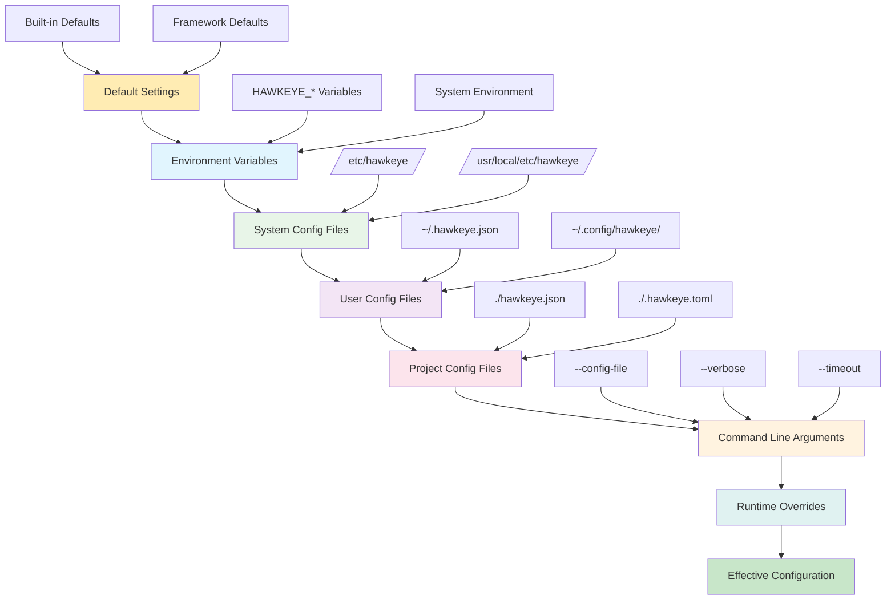
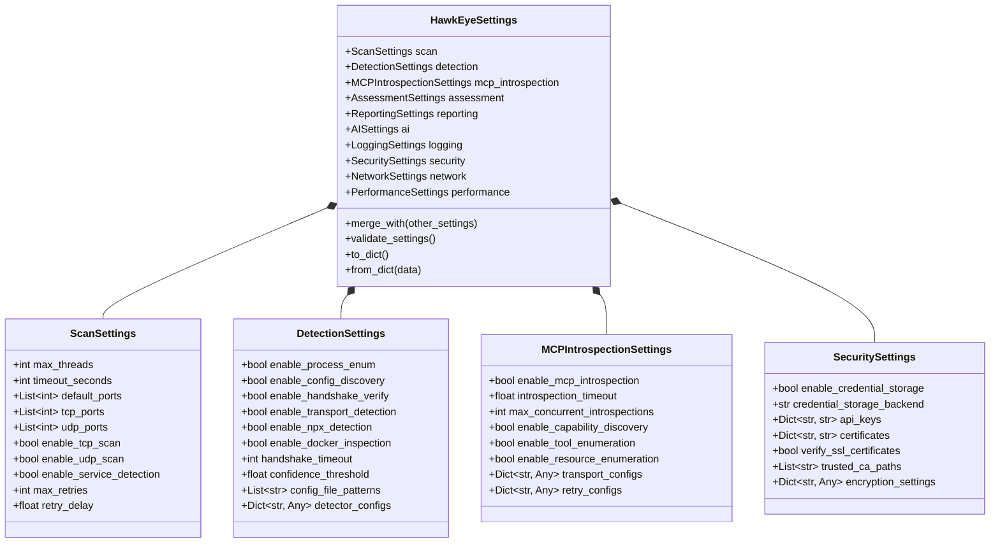
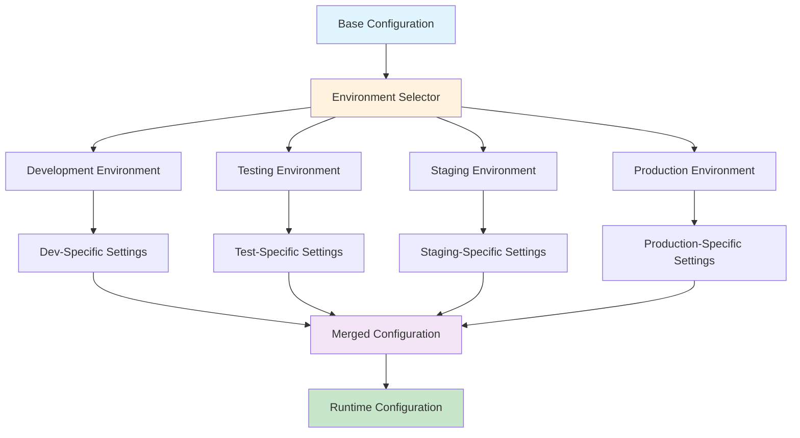
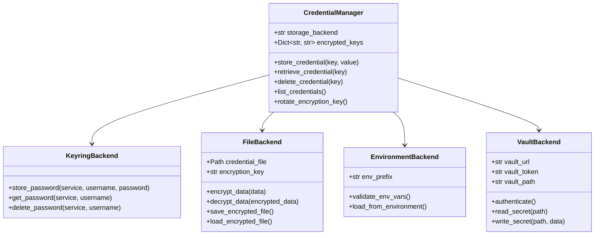

# Configuration Management

## Overview

This document provides a comprehensive analysis of the HawkEye configuration management system. It documents the settings hierarchy, configuration inheritance mechanisms, environment-specific configuration strategies, security considerations, and credential management approaches that enable flexible and secure operation across different deployment scenarios.

## Configuration Architecture

### 1. Configuration Hierarchy



### 2. Configuration Settings Structure



## Settings Hierarchy Implementation

### 1. Configuration Loader

**Hierarchical Configuration Loading:**
```python
class ConfigurationManager:
    """Manages hierarchical configuration loading and merging."""
    
    def __init__(self):
        self.config_sources = []
        self.loaded_configs = {}
        self.effective_config = None
        
    def load_configuration(self) -> HawkEyeSettings:
        """Load configuration from all sources in priority order."""
        
        # Define configuration sources in order of precedence (lowest to highest)
        config_sources = [
            DefaultConfigSource(),
            EnvironmentVariableSource(),
            SystemConfigFileSource(),
            UserConfigFileSource(),
            ProjectConfigFileSource(),
            CommandLineSource(),
            RuntimeOverrideSource()
        ]
        
        # Start with empty configuration
        merged_config = {}
        
        # Load and merge configurations
        for source in config_sources:
            try:
                source_config = source.load_config()
                if source_config:
                    merged_config = self._deep_merge_configs(merged_config, source_config)
                    self.loaded_configs[source.get_source_name()] = source_config
                    
            except Exception as e:
                logger.warning(f"Failed to load config from {source.get_source_name()}: {e}")
        
        # Create settings object from merged configuration
        self.effective_config = HawkEyeSettings.from_dict(merged_config)
        
        # Validate final configuration
        self._validate_configuration(self.effective_config)
        
        return self.effective_config
    
    def _deep_merge_configs(self, base: Dict[str, Any], override: Dict[str, Any]) -> Dict[str, Any]:
        """Deep merge configuration dictionaries."""
        
        merged = copy.deepcopy(base)
        
        for key, value in override.items():
            if key in merged and isinstance(merged[key], dict) and isinstance(value, dict):
                merged[key] = self._deep_merge_configs(merged[key], value)
            else:
                merged[key] = value
        
        return merged
    
    def get_config_source_info(self) -> Dict[str, Any]:
        """Get information about configuration sources and their contributions."""
        
        return {
            'sources_loaded': list(self.loaded_configs.keys()),
            'effective_config': self.effective_config.to_dict() if self.effective_config else None,
            'source_details': {
                name: config for name, config in self.loaded_configs.items()
            }
        }
```

### 2. Configuration Sources

**Environment Variable Configuration Source:**
```python
class EnvironmentVariableSource(ConfigSource):
    """Loads configuration from environment variables."""
    
    def __init__(self):
        self.prefix = "HAWKEYE_"
        self.delimiter = "__"
        
    def load_config(self) -> Dict[str, Any]:
        """Load configuration from environment variables."""
        
        config = {}
        
        for env_var, value in os.environ.items():
            if env_var.startswith(self.prefix):
                # Remove prefix and convert to lowercase
                config_key = env_var[len(self.prefix):].lower()
                
                # Handle nested configuration keys (e.g., HAWKEYE_SCAN__MAX_THREADS)
                if self.delimiter in config_key:
                    self._set_nested_value(config, config_key, value)
                else:
                    config[config_key] = self._convert_env_value(value)
        
        return config
    
    def _set_nested_value(self, config: Dict[str, Any], key_path: str, value: str):
        """Set nested configuration value from dotted key path."""
        
        keys = key_path.split(self.delimiter)
        current = config
        
        # Navigate to parent of target key
        for key in keys[:-1]:
            if key not in current:
                current[key] = {}
            current = current[key]
        
        # Set final value
        current[keys[-1]] = self._convert_env_value(value)
    
    def _convert_env_value(self, value: str) -> Any:
        """Convert environment variable string to appropriate type."""
        
        # Boolean values
        if value.lower() in ('true', 'false'):
            return value.lower() == 'true'
        
        # Integer values
        try:
            return int(value)
        except ValueError:
            pass
        
        # Float values
        try:
            return float(value)
        except ValueError:
            pass
        
        # JSON values (for complex configurations)
        if value.startswith('{') or value.startswith('['):
            try:
                return json.loads(value)
            except json.JSONDecodeError:
                pass
        
        # String values
        return value
```

**Project Configuration File Source:**
```python
class ProjectConfigFileSource(ConfigSource):
    """Loads configuration from project-level configuration files."""
    
    SUPPORTED_FORMATS = {
        '.json': 'json',
        '.yaml': 'yaml',
        '.yml': 'yaml',
        '.toml': 'toml'
    }
    
    CONFIG_FILENAMES = [
        'hawkeye.json',
        'hawkeye.yaml',
        'hawkeye.yml',
        'hawkeye.toml',
        '.hawkeye.json',
        '.hawkeye.yaml',
        '.hawkeye.yml',
        '.hawkeye.toml'
    ]
    
    def load_config(self) -> Dict[str, Any]:
        """Load configuration from project configuration files."""
        
        # Search for configuration files in project directory tree
        config_file = self._find_project_config_file()
        
        if not config_file:
            return {}
        
        # Load and parse configuration file
        return self._load_config_file(config_file)
    
    def _find_project_config_file(self) -> Optional[Path]:
        """Find project configuration file by searching up directory tree."""
        
        current_dir = Path.cwd()
        
        while current_dir != current_dir.parent:
            for filename in self.CONFIG_FILENAMES:
                config_path = current_dir / filename
                if config_path.exists() and config_path.is_file():
                    return config_path
            
            current_dir = current_dir.parent
        
        return None
    
    def _load_config_file(self, config_path: Path) -> Dict[str, Any]:
        """Load configuration from file based on format."""
        
        suffix = config_path.suffix.lower()
        format_type = self.SUPPORTED_FORMATS.get(suffix)
        
        if not format_type:
            raise ConfigurationError(f"Unsupported config file format: {suffix}")
        
        try:
            with open(config_path, 'r') as f:
                if format_type == 'json':
                    return json.load(f)
                elif format_type == 'yaml':
                    import yaml
                    return yaml.safe_load(f)
                elif format_type == 'toml':
                    import toml
                    return toml.load(f)
                
        except Exception as e:
            raise ConfigurationError(f"Failed to load config file {config_path}: {e}")
```

## Configuration Inheritance Patterns

### 1. Environment-Specific Configurations



### 2. Environment-Specific Configuration Manager

**Environment Configuration System:**
```python
class EnvironmentConfigManager:
    """Manages environment-specific configuration inheritance."""
    
    def __init__(self):
        self.environment = self._detect_environment()
        self.config_profiles = {}
        
    def _detect_environment(self) -> str:
        """Detect current execution environment."""
        
        # Check explicit environment variable
        env = os.environ.get('HAWKEYE_ENVIRONMENT')
        if env:
            return env.lower()
        
        # Check for common environment indicators
        if os.environ.get('CI'):
            return 'ci'
        elif os.environ.get('PYTEST_CURRENT_TEST'):
            return 'test'
        elif Path('/app').exists():  # Docker container indicator
            return 'container'
        elif os.environ.get('KUBERNETES_SERVICE_HOST'):
            return 'kubernetes'
        else:
            return 'development'
    
    def load_environment_config(self, base_config: Dict[str, Any]) -> Dict[str, Any]:
        """Load environment-specific configuration overrides."""
        
        # Define environment-specific configurations
        environment_configs = {
            'development': self._get_development_config(),
            'test': self._get_test_config(),
            'staging': self._get_staging_config(),
            'production': self._get_production_config(),
            'ci': self._get_ci_config(),
            'container': self._get_container_config(),
            'kubernetes': self._get_kubernetes_config()
        }
        
        # Get environment-specific overrides
        env_overrides = environment_configs.get(self.environment, {})
        
        # Merge with base configuration
        return self._deep_merge_configs(base_config, env_overrides)
    
    def _get_development_config(self) -> Dict[str, Any]:
        """Get development environment configuration."""
        return {
            'logging': {
                'log_level': 'DEBUG',
                'console_log_level': 'DEBUG',
                'enable_color_logging': True
            },
            'scan': {
                'max_threads': 10,
                'timeout_seconds': 30
            },
            'detection': {
                'handshake_timeout': 10,
                'confidence_threshold': 0.1
            },
            'security': {
                'verify_ssl_certificates': False
            },
            'performance': {
                'enable_caching': True,
                'cache_ttl': 300
            }
        }
    
    def _get_production_config(self) -> Dict[str, Any]:
        """Get production environment configuration."""
        return {
            'logging': {
                'log_level': 'INFO',
                'console_log_level': 'WARNING',
                'enable_color_logging': False,
                'enable_audit_logging': True
            },
            'scan': {
                'max_threads': 50,
                'timeout_seconds': 180
            },
            'detection': {
                'handshake_timeout': 60,
                'confidence_threshold': 0.5
            },
            'security': {
                'verify_ssl_certificates': True,
                'enable_credential_storage': True
            },
            'performance': {
                'enable_caching': True,
                'cache_ttl': 3600,
                'enable_rate_limiting': True
            }
        }
    
    def _get_test_config(self) -> Dict[str, Any]:
        """Get test environment configuration."""
        return {
            'logging': {
                'log_level': 'ERROR',
                'console_log_level': 'ERROR'
            },
            'scan': {
                'max_threads': 1,
                'timeout_seconds': 5
            },
            'detection': {
                'handshake_timeout': 5,
                'confidence_threshold': 0.0
            },
            'security': {
                'verify_ssl_certificates': False
            },
            'performance': {
                'enable_caching': False
            }
        }
```

## Security and Credential Management

### 1. Secure Credential Storage



### 2. Credential Management Implementation

**Secure Credential Manager:**
```python
class SecureCredentialManager:
    """Manages secure storage and retrieval of credentials."""
    
    def __init__(self, config: SecuritySettings):
        self.config = config
        self.backend = self._initialize_backend()
        self.encryption_key = self._get_or_create_encryption_key()
        
    def _initialize_backend(self) -> CredentialBackend:
        """Initialize credential storage backend."""
        
        backend_type = self.config.credential_storage_backend
        
        if backend_type == 'keyring':
            return KeyringCredentialBackend()
        elif backend_type == 'file':
            return FileCredentialBackend(self.config.credential_file_path)
        elif backend_type == 'environment':
            return EnvironmentCredentialBackend()
        elif backend_type == 'vault':
            return VaultCredentialBackend(self.config.vault_config)
        else:
            raise ConfigurationError(f"Unsupported credential backend: {backend_type}")
    
    def store_api_key(self, provider: str, api_key: str) -> None:
        """Store API key securely."""
        
        credential_key = f"api_key_{provider}"
        encrypted_key = self._encrypt_credential(api_key)
        
        self.backend.store_credential(credential_key, encrypted_key)
        
        # Update in-memory cache with masked value
        self.config.api_keys[provider] = self._mask_credential(api_key)
        
        logger.info(f"Stored API key for provider: {provider}")
    
    def retrieve_api_key(self, provider: str) -> Optional[str]:
        """Retrieve API key securely."""
        
        credential_key = f"api_key_{provider}"
        
        try:
            encrypted_key = self.backend.retrieve_credential(credential_key)
            if encrypted_key:
                return self._decrypt_credential(encrypted_key)
            
            # Fallback to configuration
            return self.config.api_keys.get(provider)
            
        except Exception as e:
            logger.error(f"Failed to retrieve API key for {provider}: {e}")
            return None
    
    def store_certificate(self, name: str, cert_data: str, private_key: Optional[str] = None) -> None:
        """Store SSL certificate and private key securely."""
        
        # Store certificate
        cert_key = f"certificate_{name}"
        self.backend.store_credential(cert_key, cert_data)
        
        # Store private key if provided
        if private_key:
            key_key = f"private_key_{name}"
            encrypted_key = self._encrypt_credential(private_key)
            self.backend.store_credential(key_key, encrypted_key)
        
        logger.info(f"Stored certificate: {name}")
    
    def _encrypt_credential(self, credential: str) -> str:
        """Encrypt credential using configured encryption."""
        
        from cryptography.fernet import Fernet
        
        cipher_suite = Fernet(self.encryption_key)
        encrypted_data = cipher_suite.encrypt(credential.encode())
        
        return base64.b64encode(encrypted_data).decode()
    
    def _decrypt_credential(self, encrypted_credential: str) -> str:
        """Decrypt credential using configured encryption."""
        
        from cryptography.fernet import Fernet
        
        cipher_suite = Fernet(self.encryption_key)
        encrypted_data = base64.b64decode(encrypted_credential.encode())
        
        return cipher_suite.decrypt(encrypted_data).decode()
    
    def _get_or_create_encryption_key(self) -> bytes:
        """Get or create encryption key for credential encryption."""
        
        key_file = Path.home() / '.hawkeye' / 'encryption.key'
        
        if key_file.exists():
            with open(key_file, 'rb') as f:
                return f.read()
        else:
            # Create new encryption key
            from cryptography.fernet import Fernet
            key = Fernet.generate_key()
            
            # Save key securely
            key_file.parent.mkdir(parents=True, exist_ok=True)
            with open(key_file, 'wb') as f:
                f.write(key)
            
            # Set restrictive permissions
            key_file.chmod(0o600)
            
            return key
```

### 3. Configuration Validation and Security

**Configuration Security Validator:**
```python
class ConfigurationSecurityValidator:
    """Validates configuration for security best practices."""
    
    def __init__(self):
        self.security_rules = self._load_security_rules()
        
    def validate_configuration(self, config: HawkEyeSettings) -> List[SecurityWarning]:
        """Validate configuration against security best practices."""
        
        warnings = []
        
        # Check for insecure credential storage
        warnings.extend(self._check_credential_security(config.security))
        
        # Check for insecure network settings
        warnings.extend(self._check_network_security(config.network))
        
        # Check for excessive permissions
        warnings.extend(self._check_permission_settings(config))
        
        # Check for logging security
        warnings.extend(self._check_logging_security(config.logging))
        
        return warnings
    
    def _check_credential_security(self, security_config: SecuritySettings) -> List[SecurityWarning]:
        """Check credential storage security."""
        
        warnings = []
        
        # Check if credentials are stored in plaintext
        if security_config.api_keys:
            for provider, key in security_config.api_keys.items():
                if not self._is_masked_credential(key):
                    warnings.append(SecurityWarning(
                        level='HIGH',
                        message=f"API key for {provider} appears to be stored in plaintext",
                        recommendation="Use secure credential storage backend"
                    ))
        
        # Check SSL certificate verification
        if not security_config.verify_ssl_certificates:
            warnings.append(SecurityWarning(
                level='MEDIUM',
                message="SSL certificate verification is disabled",
                recommendation="Enable SSL certificate verification for production use"
            ))
        
        return warnings
    
    def _check_network_security(self, network_config: NetworkSettings) -> List[SecurityWarning]:
        """Check network security settings."""
        
        warnings = []
        
        # Check for overly permissive timeouts
        if network_config.connection_timeout > 300:
            warnings.append(SecurityWarning(
                level='LOW',
                message="Connection timeout is very high",
                recommendation="Consider reducing timeout to prevent resource exhaustion"
            ))
        
        return warnings
    
    def _is_masked_credential(self, credential: str) -> bool:
        """Check if credential appears to be masked."""
        
        # Check for common masking patterns
        masking_patterns = ['*', 'x', '•']
        
        return any(pattern in credential for pattern in masking_patterns)
```

## Runtime Configuration Management

### 1. Dynamic Configuration Updates

**Runtime Configuration Manager:**
```python
class RuntimeConfigurationManager:
    """Manages runtime configuration updates and overrides."""
    
    def __init__(self, initial_config: HawkEyeSettings):
        self.base_config = initial_config
        self.runtime_overrides = {}
        self.config_change_listeners = []
    
    def override_setting(self, key_path: str, value: Any) -> None:
        """Override a configuration setting at runtime."""
        
        self.runtime_overrides[key_path] = value
        
        # Notify listeners of configuration change
        self._notify_config_change(key_path, value)
        
        logger.info(f"Runtime override applied: {key_path} = {value}")
    
    def get_effective_value(self, key_path: str) -> Any:
        """Get effective configuration value with runtime overrides."""
        
        # Check runtime overrides first
        if key_path in self.runtime_overrides:
            return self.runtime_overrides[key_path]
        
        # Get value from base configuration
        return self._get_nested_value(self.base_config, key_path)
    
    def clear_overrides(self) -> None:
        """Clear all runtime overrides."""
        
        cleared_keys = list(self.runtime_overrides.keys())
        self.runtime_overrides.clear()
        
        # Notify listeners
        for key in cleared_keys:
            self._notify_config_change(key, None)
        
        logger.info("All runtime overrides cleared")
    
    def register_change_listener(self, listener: Callable[[str, Any], None]) -> None:
        """Register listener for configuration changes."""
        
        self.config_change_listeners.append(listener)
    
    def _notify_config_change(self, key_path: str, new_value: Any) -> None:
        """Notify listeners of configuration changes."""
        
        for listener in self.config_change_listeners:
            try:
                listener(key_path, new_value)
            except Exception as e:
                logger.error(f"Configuration change listener failed: {e}")
    
    def create_scoped_config(self, scope_overrides: Dict[str, Any]) -> 'ScopedConfiguration':
        """Create scoped configuration for specific operations."""
        
        return ScopedConfiguration(self, scope_overrides)

class ScopedConfiguration:
    """Temporary configuration scope with automatic cleanup."""
    
    def __init__(self, manager: RuntimeConfigurationManager, overrides: Dict[str, Any]):
        self.manager = manager
        self.overrides = overrides
        self.original_values = {}
    
    def __enter__(self):
        """Apply scoped overrides."""
        
        for key_path, value in self.overrides.items():
            # Save original value
            self.original_values[key_path] = self.manager.runtime_overrides.get(key_path)
            
            # Apply override
            self.manager.override_setting(key_path, value)
        
        return self
    
    def __exit__(self, exc_type, exc_val, exc_tb):
        """Restore original configuration."""
        
        for key_path in self.overrides:
            original_value = self.original_values[key_path]
            
            if original_value is not None:
                self.manager.override_setting(key_path, original_value)
            else:
                # Remove override if there was no original value
                self.manager.runtime_overrides.pop(key_path, None)
```

## Configuration Monitoring and Auditing

### 1. Configuration Change Auditing

**Configuration Audit Logger:**
```python
class ConfigurationAuditLogger:
    """Logs configuration changes for security and compliance."""
    
    def __init__(self, audit_file: Path):
        self.audit_file = audit_file
        self.audit_logger = self._create_audit_logger()
        
    def _create_audit_logger(self) -> logging.Logger:
        """Create dedicated logger for configuration auditing."""
        
        logger_instance = logging.getLogger('hawkeye.config.audit')
        logger_instance.setLevel(logging.INFO)
        
        # File handler for audit log
        handler = logging.FileHandler(self.audit_file)
        formatter = logging.Formatter(
            '%(asctime)s - %(levelname)s - %(message)s',
            datefmt='%Y-%m-%d %H:%M:%S'
        )
        handler.setFormatter(formatter)
        logger_instance.addHandler(handler)
        
        return logger_instance
    
    def log_config_load(self, source: str, config_data: Dict[str, Any]) -> None:
        """Log configuration loading event."""
        
        self.audit_logger.info(
            f"Configuration loaded from {source}",
            extra={
                'event_type': 'config_load',
                'source': source,
                'config_keys': list(config_data.keys()),
                'config_size': len(str(config_data))
            }
        )
    
    def log_config_change(self, key_path: str, old_value: Any, new_value: Any, source: str) -> None:
        """Log configuration change event."""
        
        self.audit_logger.info(
            f"Configuration changed: {key_path}",
            extra={
                'event_type': 'config_change',
                'key_path': key_path,
                'old_value': self._sanitize_value(old_value),
                'new_value': self._sanitize_value(new_value),
                'source': source
            }
        )
    
    def log_credential_operation(self, operation: str, credential_type: str, success: bool) -> None:
        """Log credential management operations."""
        
        self.audit_logger.info(
            f"Credential {operation}: {credential_type}",
            extra={
                'event_type': 'credential_operation',
                'operation': operation,
                'credential_type': credential_type,
                'success': success
            }
        )
    
    def _sanitize_value(self, value: Any) -> str:
        """Sanitize value for logging (remove sensitive data)."""
        
        if isinstance(value, str):
            # Mask potential secrets
            if any(keyword in str(value).lower() for keyword in ['key', 'token', 'password', 'secret']):
                return '[REDACTED]'
        
        return str(value)[:100]  # Limit length
```

This comprehensive configuration management system ensures secure, flexible, and auditable configuration handling across all environments and deployment scenarios while maintaining strong security practices for credential management. 