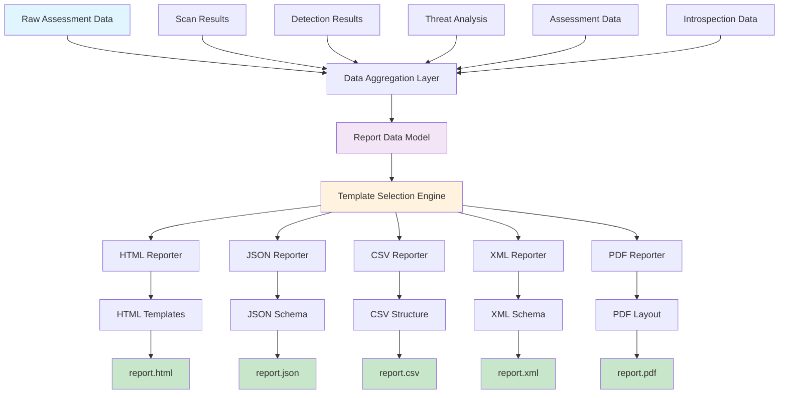
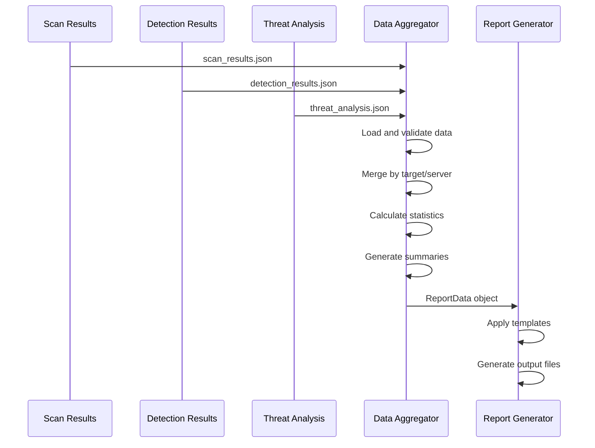
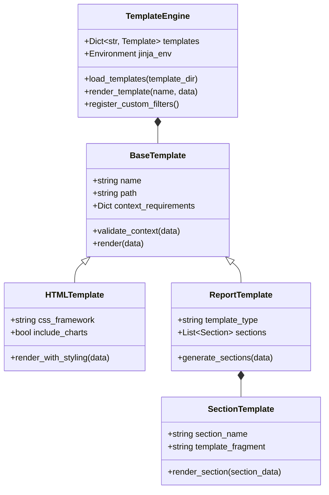
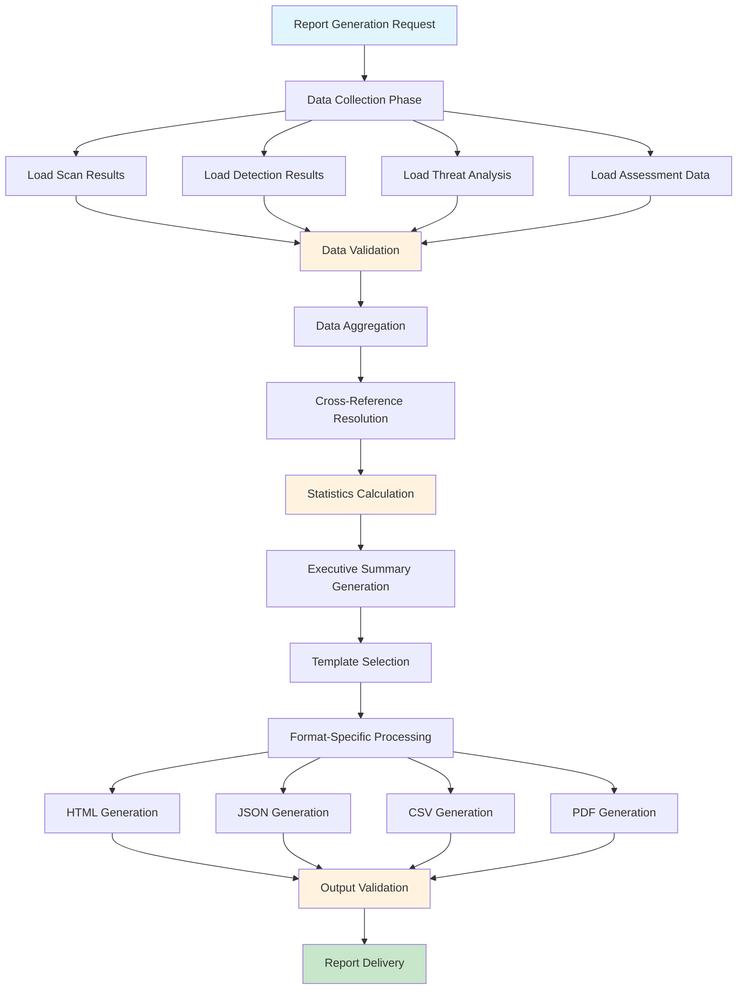

# Reporting System Integration

## Overview

This document provides a comprehensive analysis of the HawkEye reporting system integration architecture. It documents the multi-format reporting pipeline, report aggregation mechanisms, cross-command data merging strategies, template system design, and customization options that enable flexible and comprehensive security assessment reporting.

## Reporting System Architecture

### 1. Multi-Format Reporting Pipeline



### 2. Reporter Factory Pattern

**Reporter Factory Implementation:**
```python
class ReporterFactory:
    """Factory for creating format-specific reporters."""
    
    REPORTERS = {
        'html': HTMLReporter,
        'json': JSONReporter,
        'csv': CSVReporter,
        'xml': XMLReporter,
        'pdf': PDFReporter
    }
    
    @classmethod
    def create_reporter(cls, format_type: str, config: ReportConfig) -> BaseReporter:
        """Create reporter instance for specified format."""
        if format_type not in cls.REPORTERS:
            raise ValueError(f"Unsupported report format: {format_type}")
        
        reporter_class = cls.REPORTERS[format_type]
        return reporter_class(config)
    
    @classmethod
    def get_supported_formats(cls) -> List[str]:
        """Get list of supported report formats."""
        return list(cls.REPORTERS.keys())
    
    @classmethod
    def create_multi_format_report(
        cls, 
        report_data: ReportData, 
        formats: List[str], 
        output_base: str,
        config: ReportConfig
    ) -> Dict[str, Path]:
        """Generate reports in multiple formats simultaneously."""
        
        results = {}
        
        for format_type in formats:
            try:
                reporter = cls.create_reporter(format_type, config)
                output_path = Path(f"{output_base}.{format_type}")
                
                reporter.generate_report(report_data, output_path)
                results[format_type] = output_path
                
            except Exception as e:
                logger.error(f"Failed to generate {format_type} report: {e}")
                results[format_type] = None
        
        return results
```

## Data Aggregation and Merging

### 1. Cross-Command Data Integration



### 2. Data Aggregation Engine

**Report Data Aggregator:**
```python
class ReportDataAggregator:
    """Aggregates data from multiple HawkEye commands for comprehensive reporting."""
    
    def __init__(self):
        self.scan_data = None
        self.detection_data = None
        self.threat_data = None
        self.assessment_data = None
        
    def load_scan_results(self, scan_file: Path) -> None:
        """Load scan results from JSON file."""
        try:
            with open(scan_file, 'r') as f:
                data = json.load(f)
            
            self.scan_data = self._normalize_scan_data(data)
            logger.info(f"Loaded {len(self.scan_data.get('scan_results', []))} scan results")
            
        except Exception as e:
            logger.error(f"Failed to load scan results: {e}")
            raise ReportingError(f"Invalid scan results file: {e}")
    
    def load_detection_results(self, detection_file: Path) -> None:
        """Load detection results from JSON file."""
        try:
            with open(detection_file, 'r') as f:
                data = json.load(f)
            
            self.detection_data = self._normalize_detection_data(data)
            logger.info(f"Loaded {len(self.detection_data.get('detection_results', []))} detection results")
            
        except Exception as e:
            logger.error(f"Failed to load detection results: {e}")
            raise ReportingError(f"Invalid detection results file: {e}")
    
    def load_threat_analysis(self, threat_file: Path) -> None:
        """Load threat analysis from JSON file."""
        try:
            with open(threat_file, 'r') as f:
                data = json.load(f)
            
            self.threat_data = self._normalize_threat_data(data)
            logger.info(f"Loaded {len(self.threat_data.get('threat_analyses', []))} threat analyses")
            
        except Exception as e:
            logger.error(f"Failed to load threat analysis: {e}")
            raise ReportingError(f"Invalid threat analysis file: {e}")
    
    def aggregate_report_data(self) -> ReportData:
        """Aggregate all loaded data into comprehensive ReportData object."""
        
        # Merge data sources
        merged_targets = self._merge_by_target()
        merged_servers = self._merge_by_server()
        
        # Calculate comprehensive statistics
        statistics = self._calculate_comprehensive_statistics()
        
        # Generate executive summary
        executive_summary = self._generate_executive_summary(statistics)
        
        # Create aggregated report data
        report_data = ReportData(
            metadata=self._create_metadata(),
            scan_results=self._extract_scan_results(),
            detection_results=self._extract_detection_results(),
            threat_analyses=self._extract_threat_analyses(),
            mcp_servers=merged_servers,
            targets_summary=merged_targets,
            statistics=statistics,
            executive_summary=executive_summary,
            recommendations=self._generate_recommendations()
        )
        
        return report_data
```

### 3. Data Normalization and Validation

**Data Normalization Engine:**
```python
class DataNormalizer:
    """Normalizes data from different command outputs for consistent reporting."""
    
    def normalize_scan_data(self, raw_data: Dict[str, Any]) -> Dict[str, Any]:
        """Normalize scan data to standard format."""
        
        normalized = {
            'metadata': self._extract_metadata(raw_data, 'scan'),
            'scan_results': [],
            'summary': {}
        }
        
        # Handle different scan result formats
        if 'scan_results' in raw_data:
            for result in raw_data['scan_results']:
                normalized_result = self._normalize_scan_result(result)
                normalized['scan_results'].append(normalized_result)
        
        # Generate scan summary
        normalized['summary'] = self._generate_scan_summary(normalized['scan_results'])
        
        return normalized
    
    def normalize_detection_data(self, raw_data: Dict[str, Any]) -> Dict[str, Any]:
        """Normalize detection data to standard format."""
        
        normalized = {
            'metadata': self._extract_metadata(raw_data, 'detection'),
            'detection_results': [],
            'pipeline_results': [],
            'mcp_servers': [],
            'introspection_data': {}
        }
        
        # Handle multiple detection result formats
        detection_results = self._extract_detection_results_flexible(raw_data)
        
        for result in detection_results:
            normalized_result = self._normalize_detection_result(result)
            normalized['detection_results'].append(normalized_result)
            
            # Extract MCP server information
            if normalized_result.get('mcp_server'):
                server_info = self._normalize_mcp_server(normalized_result['mcp_server'])
                normalized['mcp_servers'].append(server_info)
        
        return normalized
    
    def _extract_detection_results_flexible(self, data: Dict[str, Any]) -> List[Dict[str, Any]]:
        """Flexibly extract detection results from various JSON structures."""
        
        # Try different JSON structure patterns
        if 'detection_results' in data:
            return data['detection_results']
        elif isinstance(data, list):
            return data
        elif 'results' in data:
            return data['results']
        elif 'pipeline_results' in data:
            # Extract from pipeline results
            results = []
            for pipeline_result in data['pipeline_results']:
                if 'detection_results' in pipeline_result:
                    results.extend(pipeline_result['detection_results'])
            return results
        else:
            logger.warning("Unknown detection results format")
            return []
```

## Template System Architecture

### 1. Template Engine Design



### 2. Template Engine Implementation

**Jinja2-Based Template System:**
```python
class HawkEyeTemplateEngine:
    """Advanced template engine for HawkEye reports."""
    
    def __init__(self, template_dir: Path):
        self.template_dir = template_dir
        self.jinja_env = self._create_jinja_environment()
        self.templates = {}
        self.custom_filters = {}
        
        # Load templates on initialization
        self.load_templates()
        self.register_default_filters()
    
    def _create_jinja_environment(self) -> Environment:
        """Create Jinja2 environment with custom configuration."""
        
        loader = FileSystemLoader(str(self.template_dir))
        
        env = Environment(
            loader=loader,
            autoescape=select_autoescape(['html', 'xml']),
            trim_blocks=True,
            lstrip_blocks=True,
            undefined=StrictUndefined
        )
        
        return env
    
    def load_templates(self) -> None:
        """Load all templates from template directory."""
        
        template_files = list(self.template_dir.rglob("*.html"))
        template_files.extend(self.template_dir.rglob("*.xml"))
        template_files.extend(self.template_dir.rglob("*.json"))
        
        for template_file in template_files:
            template_name = str(template_file.relative_to(self.template_dir))
            
            try:
                template = self.jinja_env.get_template(template_name)
                self.templates[template_name] = template
                logger.debug(f"Loaded template: {template_name}")
                
            except Exception as e:
                logger.error(f"Failed to load template {template_name}: {e}")
    
    def register_default_filters(self) -> None:
        """Register default custom filters for templates."""
        
        # Risk level formatting
        self.jinja_env.filters['risk_color'] = self._risk_color_filter
        self.jinja_env.filters['risk_icon'] = self._risk_icon_filter
        
        # Data formatting
        self.jinja_env.filters['format_timestamp'] = self._format_timestamp
        self.jinja_env.filters['format_duration'] = self._format_duration
        self.jinja_env.filters['format_confidence'] = self._format_confidence
        
        # Aggregation filters
        self.jinja_env.filters['group_by_risk'] = self._group_by_risk_filter
        self.jinja_env.filters['sort_by_severity'] = self._sort_by_severity_filter
        
        # Chart data filters
        self.jinja_env.filters['to_chart_data'] = self._to_chart_data_filter
        
    def render_template(self, template_name: str, context: Dict[str, Any]) -> str:
        """Render template with provided context."""
        
        if template_name not in self.templates:
            raise TemplateError(f"Template not found: {template_name}")
        
        template = self.templates[template_name]
        
        try:
            # Add global context variables
            enhanced_context = self._enhance_context(context)
            
            # Render template
            rendered = template.render(**enhanced_context)
            
            return rendered
            
        except Exception as e:
            logger.error(f"Template rendering failed for {template_name}: {e}")
            raise TemplateError(f"Template rendering error: {e}")
    
    def render_multi_section_report(
        self, 
        sections: List[str], 
        context: Dict[str, Any],
        layout_template: str = "base_layout.html"
    ) -> str:
        """Render multi-section report with unified layout."""
        
        rendered_sections = {}
        
        # Render each section individually
        for section_name in sections:
            section_template = f"sections/{section_name}.html"
            
            try:
                section_content = self.render_template(section_template, context)
                rendered_sections[section_name] = section_content
                
            except TemplateError as e:
                logger.warning(f"Failed to render section {section_name}: {e}")
                rendered_sections[section_name] = f"<p>Error rendering section: {e}</p>"
        
        # Combine sections in main layout
        layout_context = {
            **context,
            'sections': rendered_sections,
            'section_names': sections
        }
        
        return self.render_template(layout_template, layout_context)
```

### 3. Template Customization System

**Template Customization Framework:**
```python
class TemplateCustomizer:
    """Allows customization of report templates."""
    
    def __init__(self, template_engine: HawkEyeTemplateEngine):
        self.template_engine = template_engine
        self.customizations = {}
        
    def apply_theme(self, theme_name: str) -> None:
        """Apply predefined theme to templates."""
        
        themes = {
            'professional': {
                'primary_color': '#2c3e50',
                'secondary_color': '#3498db',
                'accent_color': '#e74c3c',
                'background_color': '#ffffff',
                'font_family': 'Arial, sans-serif'
            },
            'dark': {
                'primary_color': '#1a1a1a',
                'secondary_color': '#4a90e2',
                'accent_color': '#f39c12',
                'background_color': '#2c2c2c',
                'font_family': 'Consolas, monospace'
            },
            'minimal': {
                'primary_color': '#333333',
                'secondary_color': '#666666',
                'accent_color': '#999999',
                'background_color': '#f8f9fa',
                'font_family': 'Helvetica, sans-serif'
            }
        }
        
        if theme_name in themes:
            self.customizations.update(themes[theme_name])
            self._apply_customizations()
    
    def customize_section(self, section_name: str, customizations: Dict[str, Any]) -> None:
        """Apply customizations to specific report section."""
        
        section_key = f"section_{section_name}"
        if section_key not in self.customizations:
            self.customizations[section_key] = {}
        
        self.customizations[section_key].update(customizations)
        self._apply_section_customizations(section_name)
    
    def add_custom_css(self, css_content: str) -> None:
        """Add custom CSS to templates."""
        
        self.customizations['custom_css'] = css_content
        self._inject_custom_css()
    
    def create_custom_template(
        self, 
        template_name: str, 
        base_template: str, 
        modifications: Dict[str, Any]
    ) -> None:
        """Create custom template based on existing template."""
        
        # Load base template content
        base_template_obj = self.template_engine.templates.get(base_template)
        if not base_template_obj:
            raise TemplateError(f"Base template not found: {base_template}")
        
        # Apply modifications
        modified_content = self._apply_template_modifications(
            base_template_obj.source, 
            modifications
        )
        
        # Create new template file
        custom_template_path = self.template_engine.template_dir / template_name
        with open(custom_template_path, 'w') as f:
            f.write(modified_content)
        
        # Reload templates to include new custom template
        self.template_engine.load_templates()
```

## Report Generation Workflows

### 1. Comprehensive Report Generation



### 2. Report Generation Orchestrator

**Comprehensive Report Generator:**
```python
class ReportGenerationOrchestrator:
    """Orchestrates the complete report generation workflow."""
    
    def __init__(self, config: ReportConfig):
        self.config = config
        self.aggregator = ReportDataAggregator()
        self.template_engine = HawkEyeTemplateEngine(config.template_dir)
        self.customizer = TemplateCustomizer(self.template_engine)
        
    def generate_comprehensive_report(
        self,
        scan_file: Optional[Path] = None,
        detection_file: Optional[Path] = None,
        threat_file: Optional[Path] = None,
        output_base: str = "hawkeye_report",
        formats: List[str] = ['html', 'json'],
        custom_template: Optional[str] = None
    ) -> Dict[str, Path]:
        """Generate comprehensive report from multiple data sources."""
        
        try:
            # Phase 1: Data Collection and Validation
            self._collect_and_validate_data(scan_file, detection_file, threat_file)
            
            # Phase 2: Data Aggregation
            report_data = self.aggregator.aggregate_report_data()
            
            # Phase 3: Apply Customizations
            if self.config.theme:
                self.customizer.apply_theme(self.config.theme)
            
            # Phase 4: Generate Reports in Multiple Formats
            results = {}
            
            for format_type in formats:
                try:
                    output_path = self._generate_format_specific_report(
                        report_data, 
                        format_type, 
                        output_base,
                        custom_template
                    )
                    results[format_type] = output_path
                    
                except Exception as e:
                    logger.error(f"Failed to generate {format_type} report: {e}")
                    results[format_type] = None
            
            # Phase 5: Generate Report Index (if multiple formats)
            if len(formats) > 1:
                index_path = self._generate_report_index(results, output_base)
                results['index'] = index_path
            
            return results
            
        except Exception as e:
            logger.error(f"Report generation failed: {e}")
            raise ReportingError(f"Failed to generate comprehensive report: {e}")
    
    def _collect_and_validate_data(
        self, 
        scan_file: Optional[Path], 
        detection_file: Optional[Path], 
        threat_file: Optional[Path]
    ) -> None:
        """Collect and validate input data files."""
        
        if scan_file and scan_file.exists():
            self.aggregator.load_scan_results(scan_file)
        
        if detection_file and detection_file.exists():
            self.aggregator.load_detection_results(detection_file)
        
        if threat_file and threat_file.exists():
            self.aggregator.load_threat_analysis(threat_file)
        
        # Validate that we have at least some data
        if not any([scan_file, detection_file, threat_file]):
            raise ValueError("At least one data source must be provided")
    
    def _generate_format_specific_report(
        self,
        report_data: ReportData,
        format_type: str,
        output_base: str,
        custom_template: Optional[str] = None
    ) -> Path:
        """Generate report in specific format."""
        
        reporter = ReporterFactory.create_reporter(format_type, self.config)
        output_path = Path(f"{output_base}.{format_type}")
        
        # Use custom template if specified
        if custom_template and format_type == 'html':
            reporter.set_custom_template(custom_template)
        
        reporter.generate_report(report_data, output_path)
        
        # Validate generated report
        self._validate_generated_report(output_path, format_type)
        
        return output_path
```

## Customization and Extension Points

### 1. Plugin System for Custom Reporters

**Reporter Plugin Architecture:**
```python
class ReporterPlugin:
    """Base class for custom reporter plugins."""
    
    def __init__(self, config: ReportConfig):
        self.config = config
    
    @abstractmethod
    def get_format_name(self) -> str:
        """Return the format name handled by this plugin."""
        pass
    
    @abstractmethod
    def generate_report(self, report_data: ReportData, output_path: Path) -> None:
        """Generate report in the plugin's format."""
        pass
    
    def validate_report(self, output_path: Path) -> bool:
        """Validate generated report (optional)."""
        return output_path.exists() and output_path.stat().st_size > 0

class PluginManager:
    """Manages reporter plugins."""
    
    def __init__(self):
        self.plugins = {}
        self.load_plugins()
    
    def load_plugins(self) -> None:
        """Load reporter plugins from plugin directory."""
        
        plugin_dir = Path(__file__).parent.parent / "plugins" / "reporters"
        
        if not plugin_dir.exists():
            return
        
        for plugin_file in plugin_dir.glob("*.py"):
            if plugin_file.name.startswith("_"):
                continue
            
            try:
                spec = importlib.util.spec_from_file_location(
                    plugin_file.stem, 
                    plugin_file
                )
                module = importlib.util.module_from_spec(spec)
                spec.loader.exec_module(module)
                
                # Find reporter plugin classes
                for name in dir(module):
                    obj = getattr(module, name)
                    if (isinstance(obj, type) and 
                        issubclass(obj, ReporterPlugin) and 
                        obj != ReporterPlugin):
                        
                        plugin_instance = obj({})
                        format_name = plugin_instance.get_format_name()
                        self.plugins[format_name] = obj
                        
                        logger.info(f"Loaded reporter plugin: {format_name}")
                        
            except Exception as e:
                logger.error(f"Failed to load plugin {plugin_file}: {e}")
    
    def register_plugin(self, format_name: str, plugin_class: Type[ReporterPlugin]) -> None:
        """Register a reporter plugin."""
        self.plugins[format_name] = plugin_class
        
        # Add to reporter factory
        ReporterFactory.REPORTERS[format_name] = plugin_class
```

### 2. Custom Section Templates

**Section Template System:**
```python
class SectionTemplateManager:
    """Manages custom section templates."""
    
    def __init__(self, template_engine: HawkEyeTemplateEngine):
        self.template_engine = template_engine
        self.custom_sections = {}
    
    def register_custom_section(
        self, 
        section_name: str, 
        template_content: str,
        data_processor: Optional[Callable] = None
    ) -> None:
        """Register a custom section template."""
        
        # Create template file
        section_template_path = (
            self.template_engine.template_dir / 
            "sections" / 
            f"{section_name}.html"
        )
        
        section_template_path.parent.mkdir(parents=True, exist_ok=True)
        
        with open(section_template_path, 'w') as f:
            f.write(template_content)
        
        # Register data processor if provided
        if data_processor:
            self.custom_sections[section_name] = data_processor
        
        # Reload templates
        self.template_engine.load_templates()
    
    def create_section_from_data(
        self, 
        section_name: str, 
        report_data: ReportData
    ) -> str:
        """Create section content from report data."""
        
        # Process data if custom processor exists
        if section_name in self.custom_sections:
            processed_data = self.custom_sections[section_name](report_data)
        else:
            processed_data = report_data.to_dict()
        
        # Render section template
        return self.template_engine.render_template(
            f"sections/{section_name}.html",
            processed_data
        )
```

## Performance Optimization

### 1. Streaming and Incremental Processing

**Streaming Report Generator:**
```python
class StreamingReportGenerator:
    """Generates reports incrementally for large datasets."""
    
    def __init__(self, config: ReportConfig):
        self.config = config
        self.chunk_size = config.streaming_chunk_size or 1000
    
    def generate_streaming_report(
        self,
        data_generator: Generator[ReportData, None, None],
        output_path: Path,
        format_type: str = 'json'
    ) -> None:
        """Generate report from streaming data."""
        
        if format_type == 'json':
            self._generate_streaming_json(data_generator, output_path)
        elif format_type == 'csv':
            self._generate_streaming_csv(data_generator, output_path)
        else:
            raise ValueError(f"Streaming not supported for format: {format_type}")
    
    def _generate_streaming_json(
        self, 
        data_generator: Generator[ReportData, None, None], 
        output_path: Path
    ) -> None:
        """Generate JSON report from streaming data."""
        
        with open(output_path, 'w') as f:
            f.write('{"report_data": [')
            
            first_chunk = True
            for chunk_data in data_generator:
                if not first_chunk:
                    f.write(',')
                else:
                    first_chunk = False
                
                chunk_json = json.dumps(chunk_data.to_dict(), default=str)
                f.write(chunk_json)
                f.flush()
            
            f.write(']}')
```

This comprehensive reporting system integration architecture enables flexible, extensible, and high-performance report generation across multiple formats while supporting advanced customization and plugin systems for specialized reporting needs. 