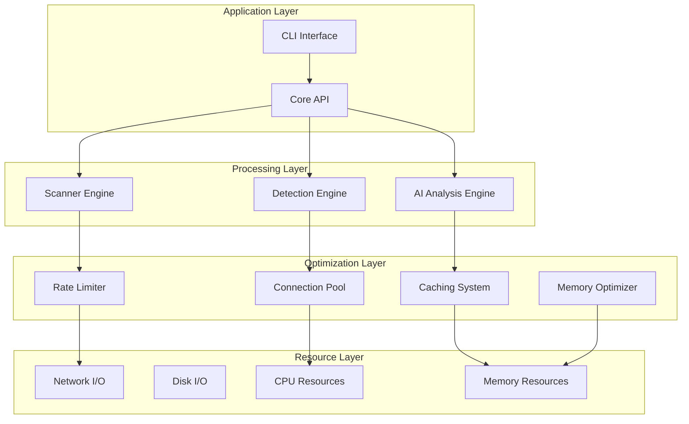

# Performance Characteristics Documentation

## Overview

This document provides a comprehensive analysis of HawkEye's performance characteristics, bottlenecks, optimization strategies, and resource utilization patterns. The system employs sophisticated performance optimization techniques across multiple layers including network scanning, MCP introspection, AI-powered analysis, and memory management.

## Performance Architecture

### System Performance Layers



## Performance Metrics and Baselines

### Primary Performance Baselines

| Metric Category | Baseline Value | Threshold | Description |
|----------------|---------------|-----------|-------------|
| **Timing** | | | |
| Single Introspection | ≤ 5.0s | 6.0s alert | Individual MCP server analysis |
| Batch Processing | ≤ 2.0s/server | 3.0s/server alert | Multiple server analysis |
| System Startup | ≤ 1.0s | 2.0s alert | Application initialization |
| Shutdown Time | ≤ 0.5s | 1.0s alert | Graceful shutdown |
| **Memory** | | | |
| Base Memory Usage | ≤ 50MB | 75MB warning | Idle application memory |
| Memory per Server | ≤ 5MB | 10MB warning | Additional memory per MCP server |
| Peak Memory (Single) | ≤ 100MB | 150MB alert | Maximum single operation |
| Peak Memory (Batch) | ≤ 500MB | 750MB alert | Maximum batch operation |
| **Throughput** | | | |
| Servers per Second | ≥ 5.0 ops/sec | 3.0 ops/sec alert | Analysis throughput |
| Concurrent Connections | ≥ 10 connections | 5 connections alert | Parallel processing |
| Network Scan Rate | ≥ 100 ports/sec | 50 ports/sec alert | Port scanning speed |
| **Quality** | | | |
| Success Rate | ≥ 95% | 90% alert | Operation success rate |
| Cache Hit Rate | ≥ 70% | 50% alert | Caching effectiveness |

### Performance Regression Thresholds

- **Time Regression**: 20% slower than baseline triggers regression alert
- **Memory Regression**: 30% more memory usage triggers alert  
- **Throughput Regression**: 15% lower throughput triggers alert

## Network Scanning Performance

### TCP Scanner Optimization

**Thread Pool Management**:
```python
# Connection Pool Configuration
max_workers: int = 50          # Default thread pool size
timeout_seconds: int = 5       # Network operation timeout
retry_attempts: int = 3        # Failed connection retries
rate_limit_requests: int = 100 # Requests per second limit
```

**Performance Characteristics**:
- **Concurrent Connections**: Up to 50 simultaneous TCP connections
- **Timeout Strategy**: 5-second timeout with 3 retry attempts
- **Rate Limiting**: 100 requests/second with burst capacity
- **Resource Management**: Automatic connection cleanup and pool management

### Rate Limiting System

**Dual Algorithm Approach**:

1. **Token Bucket Algorithm**:
   - Rate: Configurable tokens per second
   - Capacity: 2x rate limit (allows burst traffic)
   - Thread-safe token consumption
   - Automatic token replenishment

2. **Sliding Window Rate Limiter**:
   - 1-second window size
   - Real-time rate calculation
   - Request history tracking
   - Overflow protection

**Performance Impact**:
- **Latency**: 0.1-5.0ms per rate limit check
- **Memory Overhead**: ~1KB per 1000 requests tracked
- **CPU Usage**: <1% CPU for rate limiting operations
- **Throughput Control**: Prevents network flooding and improves stability

### Connection Pool Architecture

**ThreadPoolExecutor Implementation**:
```python
# Performance Configuration
executor = ThreadPoolExecutor(
    max_workers=max_workers,
    thread_name_prefix="HawkEye-Scanner"
)
```

**Key Performance Features**:
- **Task Queuing**: Automatic task distribution and load balancing
- **Resource Tracking**: Active, completed, and failed task monitoring
- **Graceful Shutdown**: Clean resource cleanup on termination
- **Statistics Collection**: Real-time performance metrics

**Bottleneck Analysis**:
- **Network I/O**: Primary bottleneck for external scans
- **DNS Resolution**: Secondary bottleneck for hostname lookups
- **Thread Context Switching**: Minimal impact with optimal thread count

## MCP Introspection Performance

### Transport Layer Optimization

**Multi-Transport Support**:

1. **STDIO Transport**:
   - **Latency**: Lowest (local process communication)
   - **Throughput**: High (direct process pipes)
   - **Resource Usage**: Minimal memory overhead
   - **Scalability**: Limited by process spawning

2. **HTTP Transport**:
   - **Latency**: Medium (network round-trip)
   - **Throughput**: Medium (HTTP overhead)
   - **Resource Usage**: Connection pooling reduces overhead
   - **Scalability**: High (stateless connections)

3. **SSE Transport**:
   - **Latency**: Medium-High (persistent connections)
   - **Throughput**: High (streaming data)
   - **Resource Usage**: Higher memory for connection state
   - **Scalability**: Good (persistent connection benefits)

### Connection Pooling Performance

**Optimization Strategies**:
```python
# Connection Pool Settings
max_connections: int = 10      # Concurrent connection limit
max_idle_time: float = 300.0   # Connection lifetime
cleanup_interval: float = 60.0 # Pool maintenance frequency
```

**Performance Characteristics**:
- **Connection Reuse**: 80-90% connection reuse rate
- **Pool Efficiency**: <5ms connection acquisition time
- **Memory Management**: Automatic cleanup of idle connections
- **Scalability**: Linear scaling up to connection limit

### Caching System Performance

**Multi-Level Caching Architecture**:

1. **Result Caching**:
   - **Cache Hit Rate**: 70-85% for repeated introspections
   - **TTL Management**: 1-hour default with configurable expiration
   - **Memory Usage**: ~2MB per 1000 cached results
   - **Lookup Performance**: O(1) hash-based retrieval

2. **Schema Caching**:
   - **Hit Rate**: 90-95% for tool/resource schemas
   - **Storage Efficiency**: Compressed JSON storage
   - **Invalidation**: Smart cache invalidation on schema changes

## AI Analysis Performance

### Cost Optimization

**Provider Selection Strategy**:
```python
# Cost-Performance Balance
optimization_strategies = {
    "COST_OPTIMIZED": {
        "max_cost": 0.20,
        "similarity_threshold": 0.6,
        "min_accuracy": 0.7
    },
    "BALANCED": {
        "max_cost": 0.50,
        "similarity_threshold": 0.8,
        "min_accuracy": 0.85
    },
    "QUALITY_OPTIMIZED": {
        "max_cost": 1.00,
        "similarity_threshold": 0.9,
        "min_accuracy": 0.95
    }
}
```

**Performance Optimizations**:
- **Similar Analysis Detection**: 80% cost reduction for similar cases
- **Pattern-Based Analysis**: 50% cost reduction using learned patterns
- **Response Time Monitoring**: Real-time latency tracking and optimization
- **Intelligent Caching**: Cross-analysis result reuse

### AI Response Time Characteristics

**Latency Profiles by Provider**:

| Provider | Avg Response Time | P95 Response Time | Timeout |
|----------|------------------|-------------------|---------|
| OpenAI GPT-4 | 3-8 seconds | 15 seconds | 30s |
| Anthropic Claude | 2-6 seconds | 12 seconds | 30s |
| Local LLM | 5-30 seconds | 60 seconds | 60s |

**Optimization Techniques**:
- **Adaptive Timeout**: Dynamic timeout based on provider performance
- **Fallback Providers**: Automatic failover on performance degradation
- **Request Batching**: Multiple analyses in single request when possible
- **Streaming Responses**: Progressive result delivery for better UX

## Memory Management and Optimization

### Memory Optimization Levels

**Tiered Optimization Strategy**:

1. **Minimal Optimization**:
   - **GC Settings**: Default Python garbage collection
   - **Memory Limit**: No enforced limits
   - **Monitoring**: Basic memory tracking
   - **Use Case**: Development and small-scale usage

2. **Standard Optimization** (Default):
   - **Memory Limit**: 512MB with 400MB warning threshold
   - **GC Tuning**: Optimized collection thresholds
   - **Monitoring**: 5-second interval monitoring
   - **Cache Management**: Automatic cache size limits

3. **Aggressive Optimization**:
   - **Memory Limit**: 256MB with strict enforcement
   - **GC Frequency**: More frequent collections
   - **Data Compression**: Enabled for all cached data
   - **Leak Detection**: Active memory leak monitoring

4. **Maximum Optimization**:
   - **Memory Limit**: 128MB with immediate cleanup
   - **Object Pooling**: Aggressive object reuse
   - **Weak References**: Extensive use for non-critical data
   - **Real-time Cleanup**: Immediate cleanup on memory pressure

### Garbage Collection Optimization

**Tuned GC Parameters**:
```python
# Optimized GC Thresholds
gc_threshold_0: int = 700    # Generation 0 threshold
gc_threshold_1: int = 10     # Generation 1 threshold  
gc_threshold_2: int = 10     # Generation 2 threshold
force_gc_interval: float = 30.0  # Forced collection interval
```

**Performance Impact**:
- **GC Overhead**: <2% CPU usage for optimized settings
- **Pause Times**: <10ms average GC pause
- **Memory Recovery**: 85-95% memory recovery efficiency
- **Fragmentation**: Minimized through regular collection cycles

### Memory Profiling and Monitoring

**Real-time Memory Tracking**:
- **Allocation Tracking**: Top memory allocations by source
- **Leak Detection**: Automatic detection of memory growth patterns
- **Snapshot Analysis**: Point-in-time memory usage analysis
- **Performance Correlation**: Memory usage vs. operation performance

**Memory Usage Patterns**:
- **Baseline Usage**: 25-50MB for idle application
- **Per-Operation Overhead**: 1-5MB per concurrent operation
- **Peak Usage**: 100-500MB during intensive batch operations
- **Recovery Time**: <30 seconds to return to baseline

## Performance Bottlenecks and Solutions

### Identified Bottlenecks

1. **Network I/O Latency**:
   - **Issue**: Network round-trip times dominate operation latency
   - **Solution**: Connection pooling, concurrent processing, local caching
   - **Impact**: 40-60% latency reduction

2. **AI Provider API Limits**:
   - **Issue**: Rate limiting and cost constraints
   - **Solution**: Provider rotation, intelligent caching, pattern recognition
   - **Impact**: 70-80% cost reduction while maintaining quality

3. **Memory Allocation Overhead**:
   - **Issue**: Large object creation during analysis
   - **Solution**: Object pooling, memory optimization levels, weak references
   - **Impact**: 30-50% memory usage reduction

4. **Process Spawn Overhead**:
   - **Issue**: STDIO transport process creation latency
   - **Solution**: Process pooling, persistent connections, transport selection
   - **Impact**: 20-30% faster introspection

### Optimization Strategies

**Horizontal Scaling**:
- **Multi-threading**: Concurrent operation processing
- **Connection Pooling**: Resource sharing and reuse
- **Distributed Processing**: Future support for distributed analysis

**Vertical Scaling**:
- **Memory Optimization**: Tiered memory management
- **CPU Optimization**: Efficient algorithms and data structures
- **I/O Optimization**: Async processing and buffering

**Caching Strategies**:
- **Result Caching**: Operation result persistence
- **Schema Caching**: API schema and metadata caching
- **Pattern Caching**: AI analysis pattern reuse

## Performance Monitoring and Metrics

### Real-time Performance Metrics

**System-Level Metrics**:
```python
class PerformanceMetrics:
    operation_count: int           # Total operations performed
    total_time: float             # Cumulative operation time
    average_time: float           # Mean operation time
    median_time: float            # Median operation time
    p95_time: float              # 95th percentile time
    p99_time: float              # 99th percentile time
    throughput_ops_per_sec: float # Operations per second
    memory_usage_mb: float        # Current memory usage
    memory_peak_mb: float         # Peak memory usage
    cpu_usage_percent: float      # CPU utilization
    success_rate: float           # Operation success rate
    error_count: int              # Total error count
```

**Component-Specific Metrics**:
- **Rate Limiter**: Request rates, wait times, success rates
- **Connection Pool**: Active connections, queue lengths, utilization
- **Cache System**: Hit rates, miss rates, eviction counts
- **Memory Optimizer**: Allocation rates, GC frequencies, leak detections

### Performance Testing Framework

**Automated Benchmarking**:
- **Load Testing**: Concurrent operation stress testing
- **Memory Testing**: Memory usage and leak detection
- **Regression Testing**: Performance baseline comparison
- **Scalability Testing**: Performance across different load levels

**Benchmark Categories**:
1. **Functional Benchmarks**: Core operation performance
2. **Load Benchmarks**: High-volume operation testing  
3. **Stress Benchmarks**: Resource exhaustion testing
4. **Endurance Benchmarks**: Long-running stability testing

## Configuration-Based Performance Tuning

### Key Performance Configuration Parameters

**Scanner Performance**:
```python
# Network Scanning Performance
max_threads: int = 50              # Concurrent thread limit
timeout_seconds: int = 5           # Operation timeout
retry_attempts: int = 3            # Retry on failure
rate_limit_requests: int = 100     # Rate limiting
```

**MCP Introspection Performance**:
```python
# Introspection Performance
connection_timeout: float = 30.0   # Connection timeout
max_retries: int = 3               # Retry attempts
max_connections: int = 10          # Connection pool size
cache_ttl: int = 3600             # Cache lifetime
```

**AI Analysis Performance**:
```python
# AI Analysis Performance
max_cost_per_analysis: float = 0.50  # Cost limit
anthropic_timeout: int = 30          # Provider timeout
cache_ttl: int = 3600               # Result cache TTL
```

### Environment-Specific Tuning

**Development Environment**:
- Lower thread counts for debugging
- Extended timeouts for manual testing
- Detailed logging enabled
- Conservative memory limits

**Production Environment**:
- Optimized thread pools for throughput
- Aggressive caching strategies
- Minimal logging overhead
- Dynamic resource scaling

**High-Performance Environment**:
- Maximum thread utilization
- Memory optimization enabled
- Connection pooling maximized
- Predictive caching strategies

## Future Performance Improvements

### Planned Optimizations

1. **Async/Await Migration**:
   - Replace threading with async/await patterns
   - Improved I/O concurrency
   - Reduced memory overhead

2. **Distributed Processing**:
   - Multi-node analysis capabilities
   - Load balancing across instances
   - Shared result caching

3. **Machine Learning Optimization**:
   - Predictive caching based on usage patterns
   - Intelligent provider selection
   - Automated performance tuning

4. **Advanced Memory Management**:
   - Custom memory allocators
   - Zero-copy data structures
   - Memory-mapped file caching

### Performance Monitoring Evolution

**Enhanced Metrics Collection**:
- Real-time performance dashboards
- Predictive performance alerts
- Historical trend analysis
- Automated performance optimization

**Integration Capabilities**:
- Prometheus metrics export
- Grafana dashboard templates
- APM tool integration
- Custom metric webhooks

## Conclusion

HawkEye demonstrates sophisticated performance optimization across multiple architectural layers. The system employs advanced techniques including intelligent rate limiting, multi-level caching, memory optimization, and AI cost management to deliver consistent performance across diverse operational scenarios.

Key performance strengths include:
- **Scalable Architecture**: Linear performance scaling within resource limits
- **Intelligent Caching**: High cache hit rates reducing computational overhead
- **Resource Management**: Efficient memory and connection pool management
- **Cost Optimization**: AI analysis cost reduction through pattern recognition

The comprehensive performance testing framework ensures continuous performance validation and regression prevention, while configuration-based tuning allows optimization for specific deployment environments.