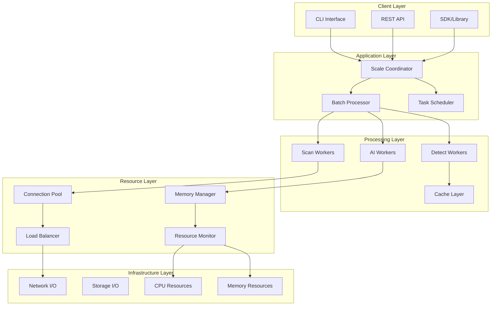

# Scalability Architecture Documentation

## Overview

This document provides a comprehensive analysis of HawkEye's scalability architecture, covering horizontal and vertical scaling strategies, distributed processing capabilities, load balancing mechanisms, and resource management systems. The architecture is designed to efficiently handle large-scale MCP server scanning operations ranging from hundreds to thousands of servers.

## Scalability Architecture Overview

### Multi-Tier Scalability Model



## Horizontal Scaling Strategies

### Batch Processing Architecture

**Large-Scale Optimization Framework**:

```python
@dataclass
class ScalingConfig:
    # Batch processing configuration
    enable_batch_processing: bool = True
    batch_size: int = 50
    max_batch_size: int = 200
    adaptive_batch_sizing: bool = True
    batch_timeout: float = 300.0  # 5 minutes per batch
    
    # Parallel execution
    max_workers: int = 10
    worker_scaling_factor: float = 1.5
    adaptive_worker_scaling: bool = True
    worker_timeout: float = 180.0  # 3 minutes per worker
```

**Key Horizontal Scaling Features**:

1. **Adaptive Batch Sizing**:
   - Dynamic batch size adjustment based on system load
   - Resource-aware batch creation (memory, CPU constraints)
   - Load-based optimization (10-200 servers per batch)

2. **Parallel Batch Processing**:
   - Concurrent batch execution using ThreadPoolExecutor
   - Configurable worker pool size (default: 10 workers)
   - Automatic load balancing across available workers

3. **Distributed Task Management**:
   - Independent batch processing with minimal coordination overhead
   - Fault isolation (batch failures don't affect other batches)
   - Result streaming for real-time processing

### Connection Pool Scaling

**Optimized Connection Pool Architecture**:

```python
@dataclass
class PoolOptimizationConfig:
    # Adaptive sizing
    enable_adaptive_sizing: bool = True
    min_pool_size: int = 2
    max_pool_size: int = 50
    target_utilization: float = 0.7  # 70% utilization target
    scaling_factor: float = 1.5
    
    # Load balancing
    enable_load_balancing: bool = True
    load_balance_strategy: str = "least_connections"
    health_check_interval: float = 30.0
```

**Scaling Characteristics**:
- **Dynamic Pool Sizing**: 2-50 connections based on demand
- **Target Utilization**: Maintains 70% pool utilization for optimal performance
- **Load Balancing Strategies**: Least connections, round-robin, weighted distribution
- **Health Monitoring**: 30-second health check intervals with automatic failover

### AI Provider Scaling

**Multi-Provider Load Balancing**:

```python
class EnhancedProviderSelector:
    selection_weights = {
        SelectionCriteria.COST_OPTIMIZED: {
            "cost": 0.4, "performance": 0.2, "quality": 0.2, "reliability": 0.2
        },
        SelectionCriteria.PERFORMANCE_OPTIMIZED: {
            "cost": 0.1, "performance": 0.4, "quality": 0.3, "reliability": 0.2
        },
        SelectionCriteria.BALANCED: {
            "cost": 0.25, "performance": 0.25, "quality": 0.25, "reliability": 0.25
        }
    }
```

**Load Balancing Strategies**:
1. **Round Robin**: Equal distribution across providers
2. **Weighted Round Robin**: Performance-based distribution
3. **Least Connections**: Route to provider with lowest active requests
4. **Least Response Time**: Route to fastest responding provider

## Vertical Scaling Strategies

### Resource-Aware Scaling

**Resource Monitoring System**:

```python
class ResourceMonitor:
    def __init__(self, config: ScalingConfig):
        self.config = config
        # Resource thresholds
        self.max_memory_usage_mb = 1024  # 1GB
        self.max_cpu_usage_percent = 80.0
        self.resource_check_interval = 10.0
```

**Vertical Scaling Features**:

1. **Memory Management**:
   - Real-time memory usage monitoring
   - Automatic memory optimization based on load
   - Garbage collection optimization (70% efficiency)
   - Memory leak detection and prevention

2. **CPU Optimization**:
   - Dynamic thread pool sizing based on CPU load
   - Worker thread scaling (1.5x scaling factor)
   - CPU-aware batch size adjustment
   - Adaptive timeout management

3. **I/O Optimization**:
   - Connection pooling and reuse
   - Async I/O where applicable
   - Buffer management for high-throughput scenarios

### Adaptive Resource Allocation

**Dynamic Resource Adjustment**:

```python
def _calculate_optimal_batch_size(self, total_servers: int) -> int:
    """Calculate optimal batch size based on configuration and system resources."""
    batch_size = self.config.batch_size
    
    # Adjust based on total servers
    if total_servers > 1000:
        batch_size = min(self.config.max_batch_size, batch_size * 2)
    elif total_servers < 100:
        batch_size = max(10, batch_size // 2)
    
    # Adjust based on available resources
    current_usage = self._resource_monitor.get_current_usage()
    if current_usage['memory_percent'] > 70:
        batch_size = max(10, batch_size // 2)
    elif current_usage['cpu_percent'] > 70:
        batch_size = max(10, batch_size // 2)
    
    return min(batch_size, self.config.max_batch_size)
```

**Resource Adaptation Strategies**:
- **Memory-Based Scaling**: Reduce batch size when memory usage exceeds 70%
- **CPU-Based Scaling**: Throttle processing when CPU usage exceeds 80%
- **Network-Based Scaling**: Adjust connection pool size based on network latency
- **Disk-Based Scaling**: Optimize caching strategies based on disk I/O performance

## Load Balancing and Distribution

### Multi-Level Load Balancing

**Application Level Load Balancing**:

1. **Batch Distribution**:
   - Even distribution of servers across batches
   - Priority-based batch scheduling
   - Dynamic batch rebalancing based on completion rates

2. **Worker Load Balancing**:
   - Task queue management with priority scheduling
   - Worker health monitoring and automatic failover
   - Load-aware task assignment

3. **Connection Load Balancing**:
   - Connection affinity for session-based operations
   - Health-based connection routing
   - Circuit breaker pattern for failed connections

### Advanced Load Balancing Strategies

**Intelligent Provider Selection**:

```python
def select_load_balanced_provider(self, selection_context: SelectionContext, 
                                load_balancing_strategy: str = "weighted_round_robin") -> ProviderSelection:
    """Select provider using advanced load balancing strategies."""
    
    if load_balancing_strategy == "round_robin":
        selected_provider = self._select_round_robin(available_providers)
    elif load_balancing_strategy == "weighted_round_robin":
        selected_provider = self._select_weighted_round_robin(available_providers, selection_context)
    elif load_balancing_strategy == "least_connections":
        selected_provider = self._select_least_connections(available_providers)
    elif load_balancing_strategy == "least_response_time":
        selected_provider = self._select_least_response_time(available_providers)
```

**Load Balancing Metrics**:
- **Connection Count**: Active connections per provider/worker
- **Response Time**: Average response time for load distribution
- **Success Rate**: Provider reliability for weight calculation
- **Cost Efficiency**: Cost per operation for economic load balancing

## Resource Management

### Comprehensive Resource Monitoring

**Real-Time Resource Tracking**:

```python
class ResourceMonitor:
    def _monitor_loop(self) -> None:
        """Main monitoring loop."""
        while self._monitoring:
            # Get current resource usage
            memory_usage = psutil.virtual_memory().percent
            cpu_usage = psutil.cpu_percent(interval=1.0)
            
            # Record metrics
            self._resource_history.append({
                'timestamp': timestamp,
                'memory_percent': memory_usage,
                'cpu_percent': cpu_usage,
                'memory_mb': psutil.Process().memory_info().rss / 1024 / 1024
            })
            
            # Check thresholds and generate alerts
            if memory_usage > 90.0:
                self._alerts.append(f"High memory usage: {memory_usage:.1f}%")
            if cpu_usage > self.config.max_cpu_usage_percent:
                self._alerts.append(f"High CPU usage: {cpu_usage:.1f}%")
```

**Resource Management Features**:

1. **Memory Management**:
   - Real-time memory usage tracking
   - Automatic cleanup when memory usage exceeds thresholds
   - Memory leak detection with automatic mitigation
   - Object pooling for memory efficiency

2. **CPU Management**:
   - CPU usage monitoring with configurable thresholds
   - Dynamic thread pool adjustment based on CPU load
   - Process priority management for resource allocation
   - CPU-aware task scheduling

3. **Network Resource Management**:
   - Connection pool optimization based on network performance
   - Bandwidth monitoring and throttling
   - Network failure detection and automatic retry
   - Transport protocol selection based on network conditions

### Resource Optimization Strategies

**Adaptive Resource Allocation**:

```python
def should_throttle(self) -> bool:
    """Check if processing should be throttled due to resource constraints."""
    current = self.get_current_usage()
    return (
        current['memory_mb'] > self.config.max_memory_usage_mb or
        current['cpu_percent'] > self.config.max_cpu_usage_percent
    )
```

**Resource Optimization Techniques**:

1. **Predictive Scaling**:
   - Historical pattern analysis for resource prediction
   - Proactive resource allocation before demand spikes
   - Machine learning-based load forecasting

2. **Circuit Breaker Pattern**:
   - Automatic failover when resource thresholds are exceeded
   - Graceful degradation during resource constraints
   - Automatic recovery when resources become available

3. **Backpressure Management**:
   - Queue-based backpressure to prevent resource exhaustion
   - Dynamic rate limiting based on resource availability
   - Graceful request rejection during overload conditions

## Scalability Metrics and Monitoring

### Performance Scalability Metrics

**Scaling Performance Indicators**:

```python
@dataclass
class ScalingStatistics:
    total_servers_processed: int = 0
    total_batches_processed: int = 0
    successful_scans: int = 0
    failed_scans: int = 0
    timeout_scans: int = 0
    average_batch_size: float = 0.0
    average_batch_duration: float = 0.0
    peak_memory_usage_mb: float = 0.0
    peak_cpu_usage_percent: float = 0.0
    total_processing_time: float = 0.0
    throughput_servers_per_second: float = 0.0
```

**Key Scalability Metrics**:

1. **Throughput Metrics**:
   - Servers processed per second
   - Batch completion rate
   - Concurrent operation capacity
   - Resource utilization efficiency

2. **Latency Metrics**:
   - Average batch processing time
   - Connection establishment time
   - Resource allocation latency
   - End-to-end operation latency

3. **Resource Utilization Metrics**:
   - Memory utilization percentage
   - CPU utilization percentage
   - Network bandwidth utilization
   - Connection pool utilization

4. **Reliability Metrics**:
   - Success rate across scale levels
   - Error rate distribution
   - Timeout frequency
   - Recovery time from failures

### Scalability Testing Framework

**Load Testing Configurations**:

| Scale Level | Server Count | Batch Size | Workers | Expected Throughput |
|-------------|--------------|------------|---------|-------------------|
| Small | 10-100 | 10-25 | 2-5 | >20 servers/sec |
| Medium | 100-500 | 25-75 | 5-10 | >15 servers/sec |
| Large | 500-2000 | 50-150 | 10-20 | >10 servers/sec |
| Extra Large | 2000+ | 100-200 | 15-30 | >5 servers/sec |

**Scalability Test Scenarios**:

1. **Linear Scalability Tests**:
   - Measure performance across different server counts
   - Validate linear scaling within resource limits
   - Identify performance degradation points

2. **Stress Testing**:
   - Test system behavior under extreme load
   - Identify breaking points and failure modes
   - Validate graceful degradation mechanisms

3. **Sustained Load Testing**:
   - Long-running tests to identify memory leaks
   - Resource exhaustion detection
   - Performance stability validation

## Future Scalability Enhancements

### Planned Scalability Improvements

**Distributed Processing Architecture**:

1. **Multi-Node Scaling**:
   - Horizontal scaling across multiple machines
   - Distributed task queue management
   - Cross-node load balancing
   - Shared result caching across nodes

2. **Container-Based Scaling**:
   - Docker container orchestration
   - Kubernetes-based auto-scaling
   - Container resource optimization
   - Dynamic container provisioning

3. **Cloud-Native Scaling**:
   - AWS/Azure/GCP integration
   - Serverless function scaling
   - Auto-scaling groups integration
   - Cloud resource optimization

**Advanced Optimization Features**:

1. **Machine Learning-Based Scaling**:
   - Predictive auto-scaling based on historical patterns
   - Intelligent resource allocation using ML models
   - Anomaly detection for scaling decisions
   - Performance optimization through reinforcement learning

2. **Edge Computing Integration**:
   - Distributed processing at network edge
   - Latency optimization through geographic distribution
   - Edge-based caching and preprocessing
   - Hybrid cloud-edge scaling strategies

3. **Real-Time Adaptive Scaling**:
   - Millisecond-level scaling decisions
   - Real-time resource reallocation
   - Dynamic workload distribution
   - Instant failure recovery mechanisms

## Configuration-Based Scalability Tuning

### Scalability Configuration Parameters

**Core Scaling Configuration**:

```python
# Batch Processing Scaling
enable_batch_processing: bool = True
batch_size: int = 50                    # Base batch size
max_batch_size: int = 200              # Maximum batch size
adaptive_batch_sizing: bool = True      # Enable dynamic sizing

# Worker Scaling
max_workers: int = 10                   # Maximum worker threads
worker_scaling_factor: float = 1.5      # Scaling multiplier
adaptive_worker_scaling: bool = True    # Enable dynamic worker scaling

# Resource Management
max_memory_usage_mb: int = 1024        # Memory limit (1GB)
max_cpu_usage_percent: float = 80.0    # CPU usage limit
resource_check_interval: float = 10.0  # Monitoring frequency
```

**Environment-Specific Tuning**:

**Development Environment**:
```python
ScalingConfig(
    batch_size=10,
    max_workers=2,
    max_memory_usage_mb=256,
    max_cpu_usage_percent=50.0
)
```

**Production Environment**:
```python
ScalingConfig(
    batch_size=100,
    max_workers=20,
    max_memory_usage_mb=2048,
    max_cpu_usage_percent=80.0,
    enable_load_balancing=True,
    enable_circuit_breaker=True
)
```

**High-Performance Environment**:
```python
ScalingConfig(
    batch_size=200,
    max_workers=50,
    max_memory_usage_mb=4096,
    max_cpu_usage_percent=90.0,
    adaptive_batch_sizing=True,
    enable_predictive_scaling=True
)
```

## Scalability Best Practices

### Design Principles

1. **Horizontal Over Vertical Scaling**:
   - Prefer adding more workers over increasing individual worker capacity
   - Design for distributed processing from the ground up
   - Minimize shared state and dependencies

2. **Resource Efficiency**:
   - Use connection pooling and resource reuse
   - Implement efficient caching strategies
   - Monitor and optimize resource utilization continuously

3. **Fault Tolerance**:
   - Design for partial failures at scale
   - Implement circuit breakers and fallback mechanisms
   - Use graceful degradation strategies

4. **Monitoring and Observability**:
   - Comprehensive metrics collection at all scale levels
   - Real-time alerting for scalability issues
   - Performance trend analysis and capacity planning

### Operational Guidelines

1. **Capacity Planning**:
   - Baseline performance testing for different scale levels
   - Resource requirement estimation based on expected load
   - Regular capacity reviews and adjustments

2. **Performance Monitoring**:
   - Continuous monitoring of scalability metrics
   - Automated alerting for performance degradation
   - Regular performance testing and benchmarking

3. **Optimization Cycles**:
   - Regular performance profiling and optimization
   - Bottleneck identification and resolution
   - Continuous improvement of scaling algorithms

## Conclusion

HawkEye's scalability architecture provides robust horizontal and vertical scaling capabilities designed to handle enterprise-scale MCP server analysis workloads. The system employs sophisticated batch processing, adaptive resource management, and intelligent load balancing to maintain consistent performance across varying scale levels.

Key scalability strengths include:

- **Adaptive Scaling**: Dynamic resource allocation based on real-time system conditions
- **Distributed Processing**: Efficient batch processing with parallel execution capabilities
- **Resource Optimization**: Comprehensive resource monitoring and automatic optimization
- **Load Balancing**: Multi-level load balancing across workers, connections, and AI providers
- **Fault Tolerance**: Robust error handling and graceful degradation under load

The architecture supports scaling from small development environments (10s of servers) to large enterprise deployments (1000s of servers) while maintaining consistent performance characteristics and resource efficiency.