# Scan Command Class Diagram

## Overview

The HawkEye scan command implements a sophisticated network scanning architecture with multiple scanner types, connection management, rate limiting, and service fingerprinting capabilities. This document provides detailed class diagrams and architectural analysis of the scanner module components.

## High-Level Architecture

The scanner module follows a layered architecture with clear separation of concerns:

1. **Scanner Layer**: Abstract base class and concrete scanner implementations
2. **Management Layer**: Connection pooling, rate limiting, and task management
3. **Service Layer**: Service fingerprinting and target enumeration
4. **Data Layer**: Scan results, targets, and configuration data structures

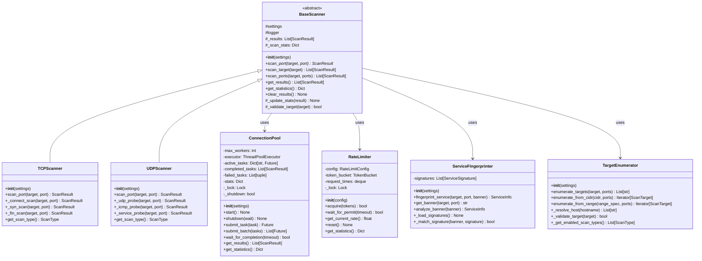

## Core Data Structures

### Scan Target and Result Models

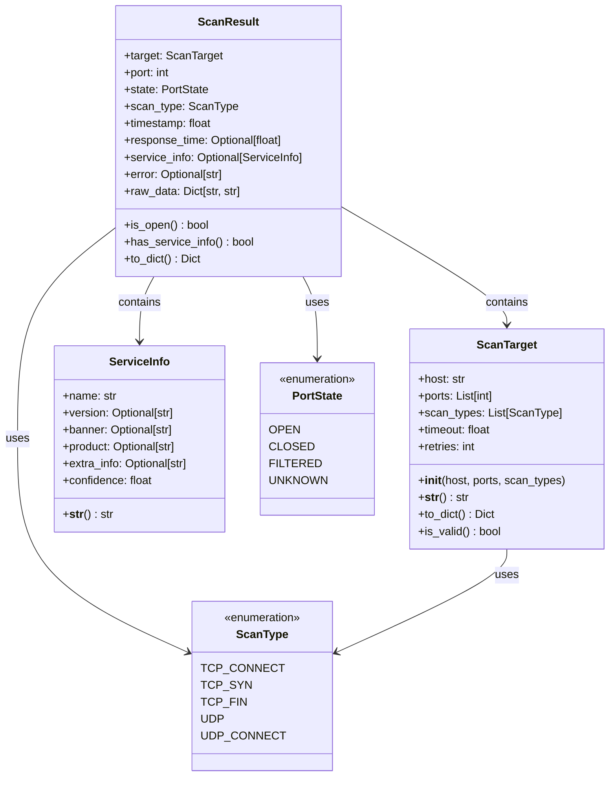

### Task Management Data Structures

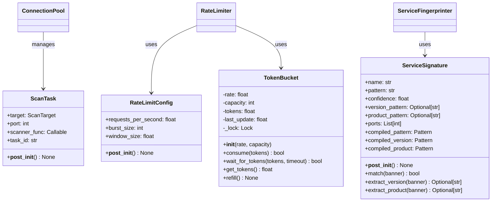

## Inheritance Hierarchy Analysis

### BaseScanner Abstract Base Class

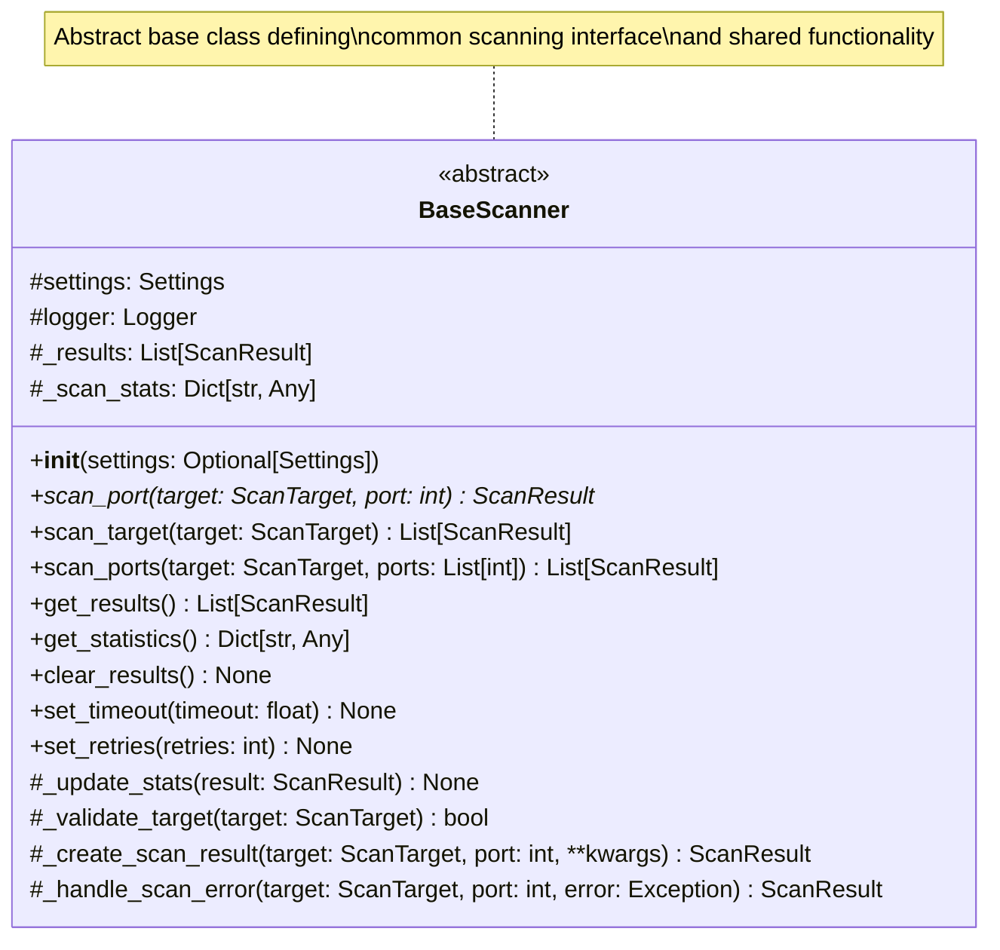

**Key Design Patterns**:
- **Template Method Pattern**: `scan_target()` and `scan_ports()` define the scanning algorithm structure
- **Strategy Pattern**: Different concrete scanners implement different scanning strategies
- **Factory Method Pattern**: `_create_scan_result()` creates appropriate result objects

### TCPScanner Implementation

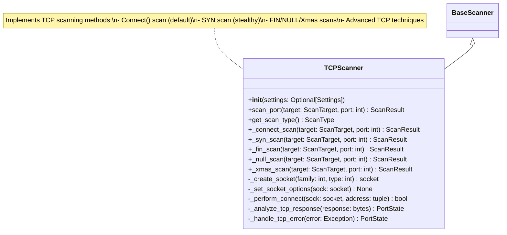

**TCP Scanning Methods**:
1. **Connect Scan**: Full TCP three-way handshake
2. **SYN Scan**: Half-open scanning (stealth)
3. **FIN Scan**: Uses FIN packets to probe ports
4. **NULL Scan**: Sends packets with no flags set
5. **Xmas Scan**: Sends packets with FIN, PSH, and URG flags

### UDPScanner Implementation

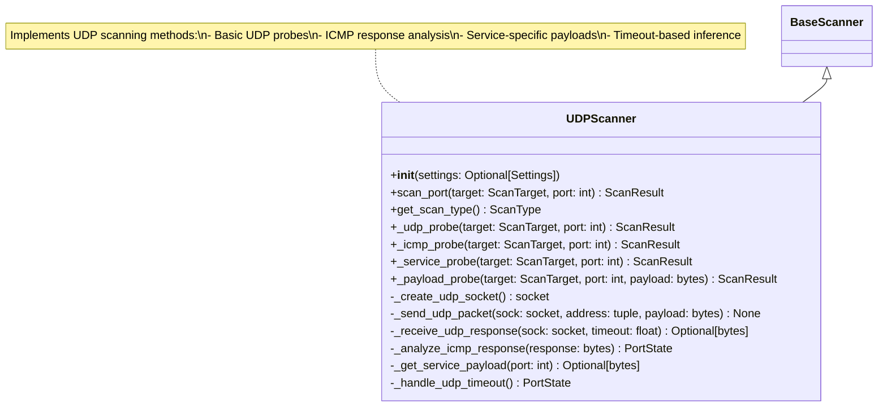

**UDP Scanning Challenges**:
- **Connectionless Protocol**: No reliable way to determine port state
- **ICMP Responses**: Must analyze ICMP port unreachable messages
- **Service-Specific Probes**: Use known payloads for common services
- **Timeout Inference**: Open ports often don't respond

## Composition Relationships

### Connection Pool Management

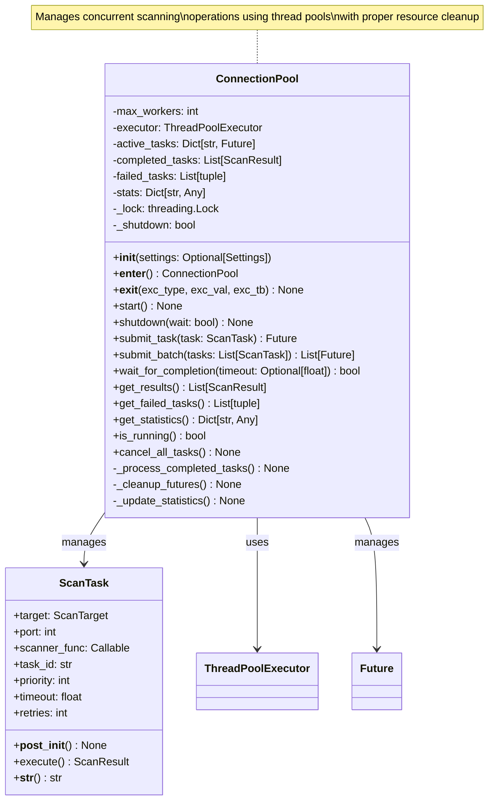

**Key Features**:
- **Thread Pool Management**: Configurable number of worker threads
- **Task Scheduling**: Priority-based task execution
- **Resource Management**: Proper startup/shutdown procedures
- **Statistics Tracking**: Performance metrics and monitoring
- **Error Handling**: Failed task tracking and recovery

### Rate Limiting System

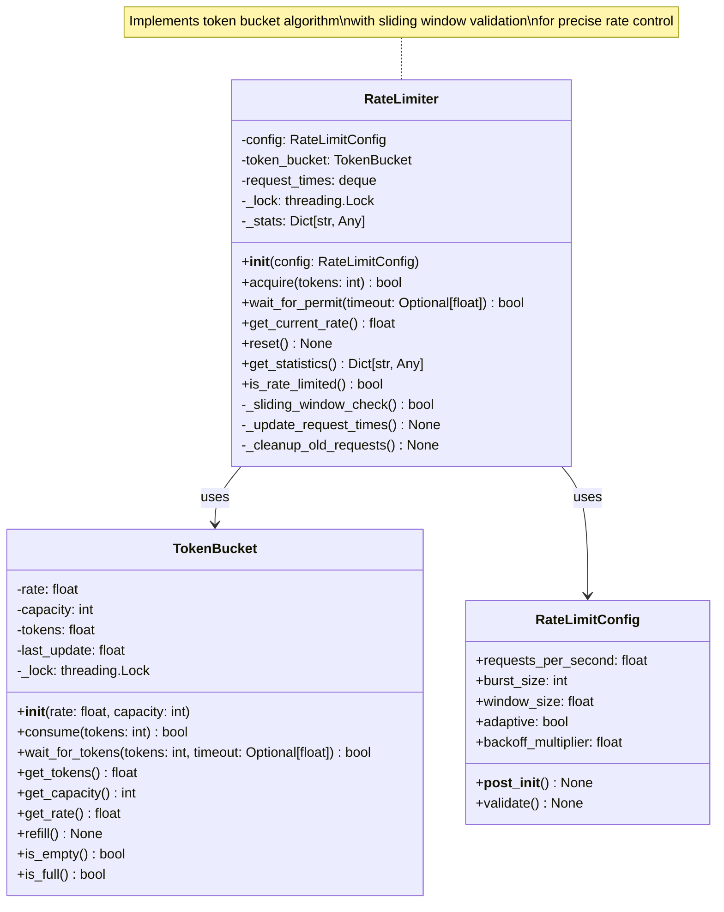

**Rate Limiting Algorithms**:
1. **Token Bucket**: Primary rate limiting mechanism
2. **Sliding Window**: Additional validation layer
3. **Adaptive Backoff**: Dynamic rate adjustment
4. **Burst Control**: Handles traffic spikes

### Service Fingerprinting Engine

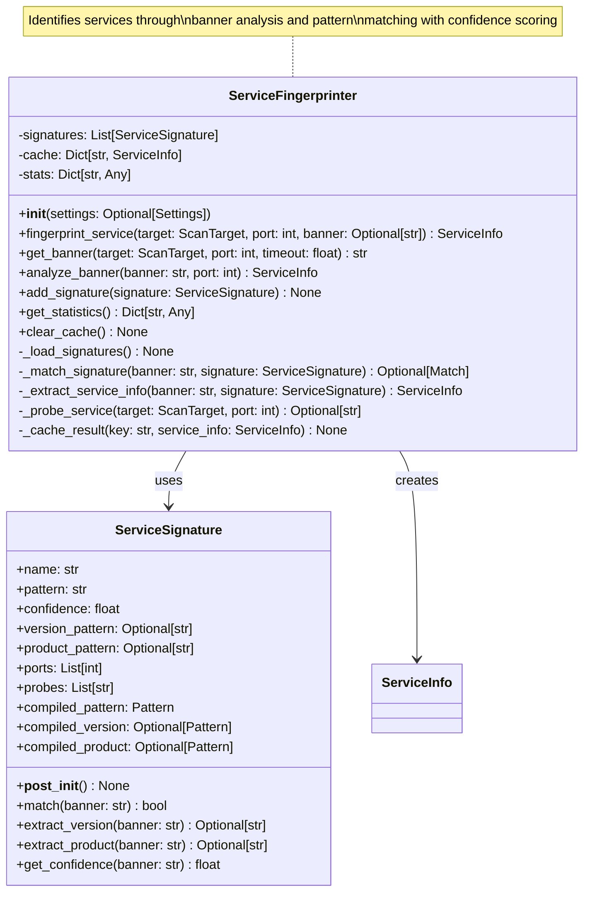

**Fingerprinting Process**:
1. **Banner Grabbing**: Connect and retrieve service banners
2. **Pattern Matching**: Apply regex patterns to identify services
3. **Version Extraction**: Parse version information from banners
4. **Confidence Scoring**: Rate identification accuracy
5. **Caching**: Store results for performance optimization

### Target Enumeration System

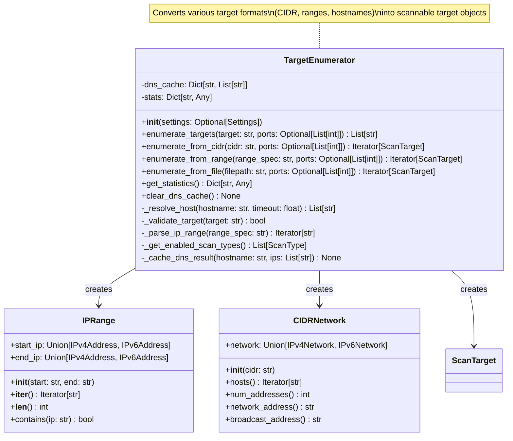

**Target Format Support**:
- **Single IPs**: `192.168.1.1`
- **CIDR Notation**: `192.168.1.0/24`
- **IP Ranges**: `192.168.1.1-192.168.1.100`
- **Hostnames**: `example.com`
- **File Lists**: Text files with target lists

## Component Interaction Flow

### Scan Execution Sequence

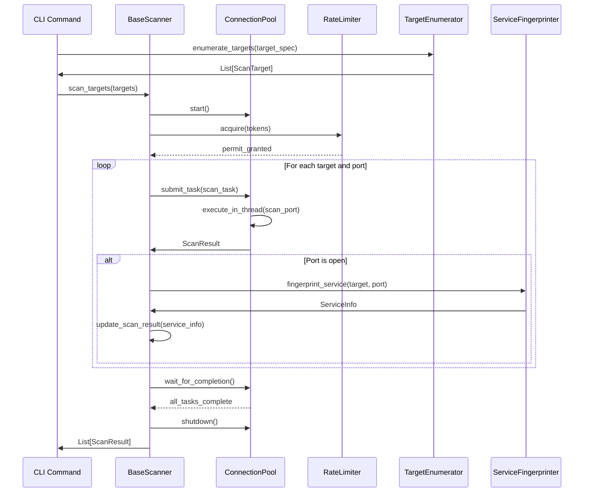

### Error Handling and Recovery

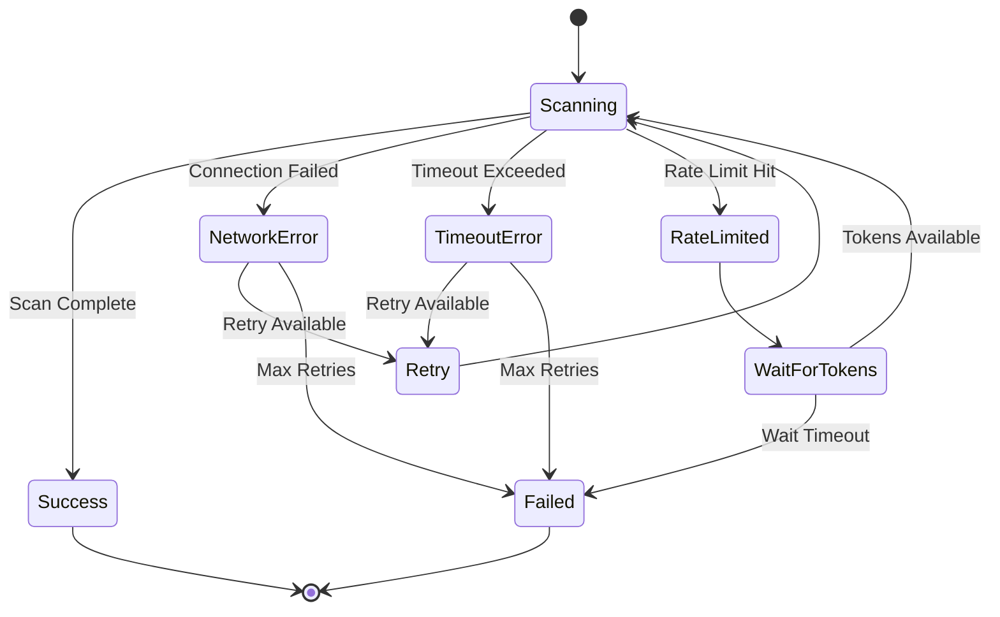

## Performance Characteristics

### Concurrency Model

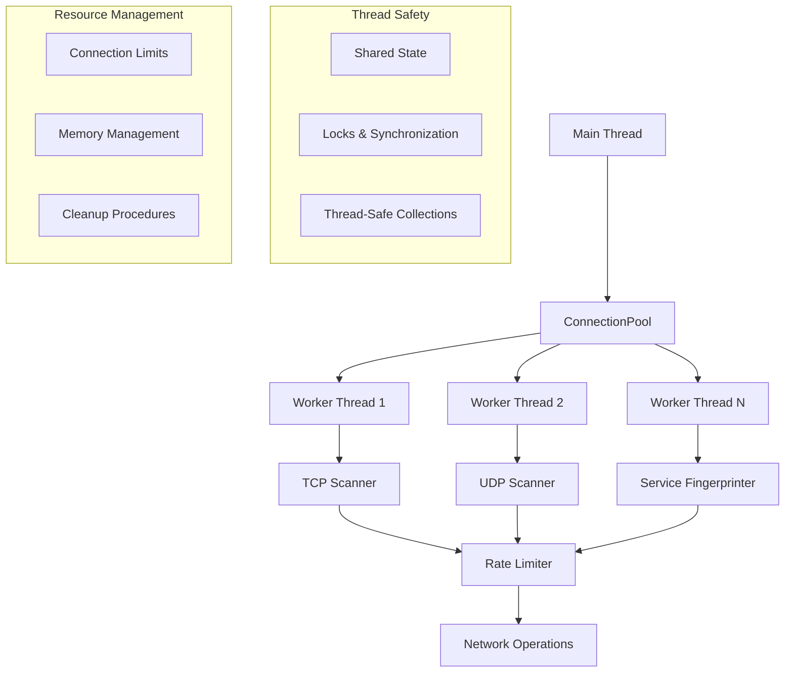

**Performance Optimizations**:
- **Thread Pool**: Configurable worker threads for concurrent scanning
- **Connection Reuse**: Socket pooling for TCP connections
- **Rate Limiting**: Prevents network congestion and detection
- **Caching**: DNS resolution and service fingerprint caching
- **Batch Processing**: Efficient handling of large target lists

### Memory Management

```python
class MemoryOptimizedScanner:
    """Memory-efficient scanner implementation."""
    
    def __init__(self, settings=None):
        self.settings = settings or get_settings()
        self._result_buffer_size = self.settings.scan.result_buffer_size
        self._result_buffer = deque(maxlen=self._result_buffer_size)
        self._memory_threshold = self.settings.scan.memory_threshold
    
    def scan_with_streaming(self, targets: Iterator[ScanTarget]) -> Iterator[ScanResult]:
        """Stream scan results to minimize memory usage."""
        
        for target in targets:
            # Check memory usage
            if self._get_memory_usage() > self._memory_threshold:
                self._flush_results()
            
            result = self.scan_target(target)
            yield result
    
    def _flush_results(self):
        """Flush buffered results to storage."""
        if self._result_buffer:
            self._save_results_to_disk(list(self._result_buffer))
            self._result_buffer.clear()
```

## Configuration and Extensibility

### Scanner Configuration

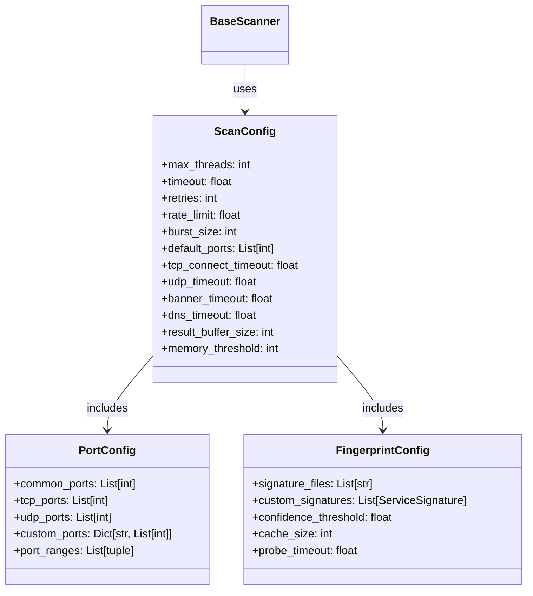

### Plugin Architecture

```python
from abc import ABC, abstractmethod

class ScannerPlugin(ABC):
    """Plugin interface for extending scanner functionality."""
    
    @abstractmethod
    def get_plugin_name(self) -> str:
        """Return plugin name."""
        pass
    
    @abstractmethod
    def initialize(self, scanner: BaseScanner) -> None:
        """Initialize plugin with scanner instance."""
        pass
    
    @abstractmethod
    def pre_scan_hook(self, target: ScanTarget) -> Optional[ScanTarget]:
        """Called before scanning a target."""
        pass
    
    @abstractmethod
    def post_scan_hook(self, result: ScanResult) -> Optional[ScanResult]:
        """Called after scanning completes."""
        pass

class PluginManager:
    """Manages scanner plugins."""
    
    def __init__(self):
        self.plugins: List[ScannerPlugin] = []
    
    def register_plugin(self, plugin: ScannerPlugin) -> None:
        """Register a new plugin."""
        self.plugins.append(plugin)
    
    def apply_pre_scan_hooks(self, target: ScanTarget) -> ScanTarget:
        """Apply all pre-scan hooks."""
        for plugin in self.plugins:
            target = plugin.pre_scan_hook(target) or target
        return target
    
    def apply_post_scan_hooks(self, result: ScanResult) -> ScanResult:
        """Apply all post-scan hooks."""
        for plugin in self.plugins:
            result = plugin.post_scan_hook(result) or result
        return result
```

## Testing Strategy

### Unit Test Architecture

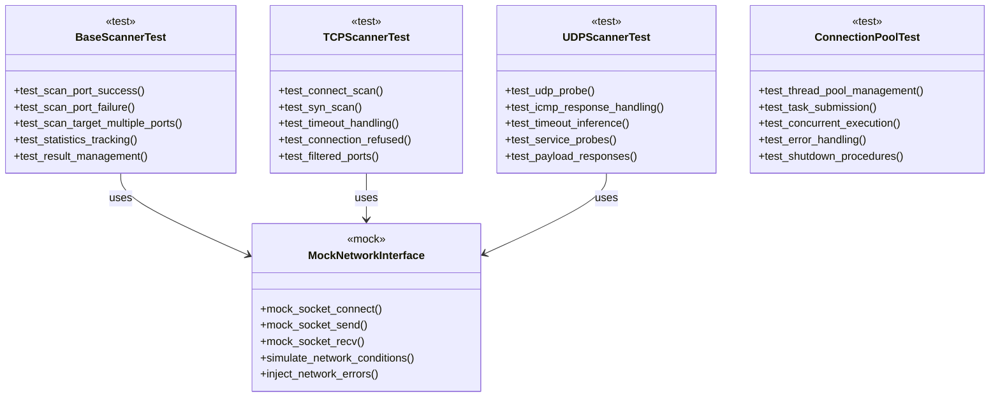

### Integration Testing

```python
class ScannerIntegrationTest:
    """Integration tests for scanner module."""
    
    def test_end_to_end_tcp_scan(self):
        """Test complete TCP scanning workflow."""
        
        # Setup test environment
        targets = ["127.0.0.1"]
        ports = [22, 80, 443, 8080]
        
        # Initialize scanner with test configuration
        scanner = TCPScanner(test_settings)
        
        # Execute scan
        results = []
        for target in targets:
            scan_target = ScanTarget(host=target, ports=ports)
            target_results = scanner.scan_target(scan_target)
            results.extend(target_results)
        
        # Validate results
        assert len(results) == len(targets) * len(ports)
        assert all(isinstance(r, ScanResult) for r in results)
        assert any(r.is_open for r in results)  # At least one port should be open
        
        # Check statistics
        stats = scanner.get_statistics()
        assert stats['total_scans'] == len(results)
        assert stats['successful_scans'] + stats['failed_scans'] == len(results)
    
    def test_concurrent_scanning_performance(self):
        """Test concurrent scanning performance and correctness."""
        
        # Large target list
        targets = [f"192.168.1.{i}" for i in range(1, 255)]
        ports = [22, 80, 443]
        
        # Test with different thread counts
        for thread_count in [1, 5, 10, 20]:
            settings = create_test_settings(max_threads=thread_count)
            scanner = TCPScanner(settings)
            
            start_time = time.time()
            results = scanner.scan_multiple_targets(targets, ports)
            duration = time.time() - start_time
            
            # Validate performance improvement with more threads
            assert len(results) == len(targets) * len(ports)
            self.performance_results[thread_count] = duration
        
        # Ensure parallelization improves performance
        assert self.performance_results[10] < self.performance_results[1]
```

## Conclusion

The HawkEye scan command architecture demonstrates a well-designed, modular approach to network scanning with the following key strengths:

**Design Patterns**:
- **Abstract Base Class Pattern**: Provides consistent interface across scanner types
- **Template Method Pattern**: Defines scanning workflow with customization points
- **Strategy Pattern**: Allows different scanning techniques
- **Composition Pattern**: Modular components for connection management, rate limiting, and service detection

**Architecture Benefits**:
- **Modularity**: Clear separation of concerns between scanning, management, and service detection
- **Extensibility**: Plugin architecture supports custom scanners and fingerprinting rules
- **Performance**: Concurrent execution with configurable thread pools and rate limiting
- **Reliability**: Comprehensive error handling and retry mechanisms
- **Maintainability**: Clean interfaces and well-defined component responsibilities

**Key Components**:
1. **Scanner Hierarchy**: BaseScanner → TCPScanner/UDPScanner with specialized scanning methods
2. **Connection Management**: ThreadPoolExecutor-based concurrent execution
3. **Rate Limiting**: Token bucket algorithm with sliding window validation
4. **Service Detection**: Pattern-based fingerprinting with confidence scoring
5. **Target Enumeration**: Flexible target specification with DNS resolution

The architecture provides a solid foundation for network reconnaissance while maintaining good performance characteristics and extensibility for future enhancements. 