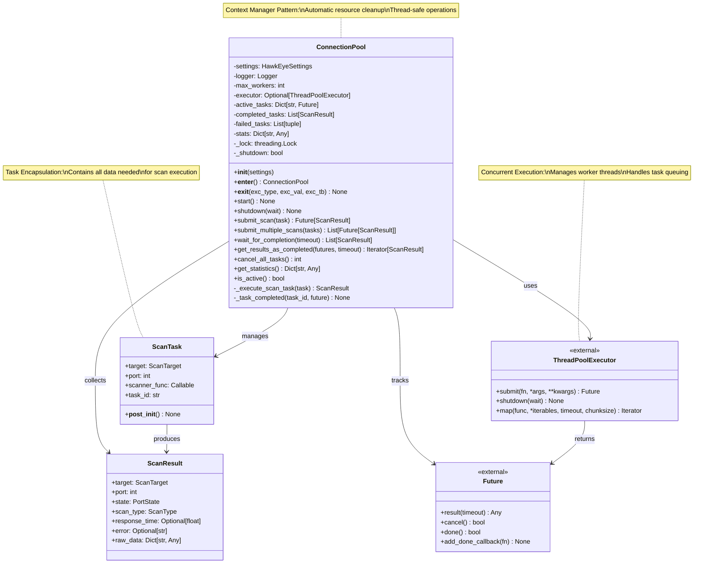
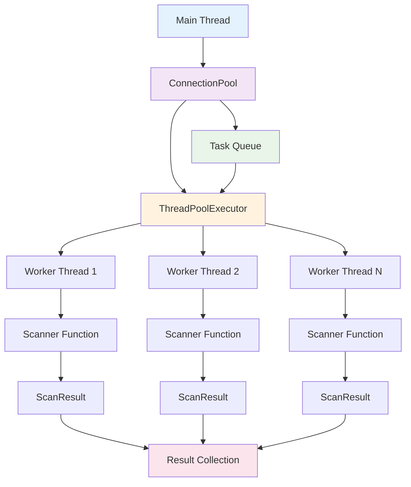

# Connection Pool Architecture

## Overview

This document provides comprehensive analysis of the HawkEye connection pool architecture, which manages thread pool execution, task scheduling, and resource management for concurrent network scanning operations. The connection pool implements sophisticated concurrency patterns to maximize scanning throughput while maintaining system stability and resource efficiency.

## Architecture Overview

### 1. Core Components



### 2. Threading Model

The connection pool implements a **Producer-Consumer** pattern with **ThreadPoolExecutor** as the core execution engine:



## Thread Pool Management

### 1. Thread Pool Configuration

The connection pool provides flexible thread pool configuration based on workload characteristics and system resources:

```python
class ConnectionPool:
    """Thread pool manager for concurrent scanning operations."""
    
    def __init__(self, settings=None):
        """Initialize with configurable thread pool settings."""
        self.settings = settings or get_settings()
        self.logger = get_logger(self.__class__.__name__)
        
        # Thread pool configuration
        self.max_workers = self.settings.scan.max_threads
        self.executor: Optional[ThreadPoolExecutor] = None
        
        # State management
        self.active_tasks: Dict[str, Future] = {}
        self.completed_tasks: List[ScanResult] = []
        self.failed_tasks: List[tuple] = []
        
        # Performance tracking
        self.stats = {
            'total_tasks': 0,
            'completed_tasks': 0,
            'failed_tasks': 0,
            'active_tasks': 0,
            'start_time': None,
            'end_time': None,
        }
        
        # Thread safety primitives
        self._lock = threading.Lock()
        self._shutdown = False
```

#### Thread Pool Sizing Strategy

```python
def calculate_optimal_thread_count(self) -> int:
    """Calculate optimal thread count based on workload characteristics."""
    
    # Base calculation factors
    cpu_cores = os.cpu_count() or 4
    io_bound_multiplier = 4  # Network I/O bound operations benefit from more threads
    
    # Workload-specific adjustments
    if self.settings.scan.enable_udp_scan:
        # UDP scans are more I/O bound
        base_threads = cpu_cores * io_bound_multiplier
    else:
        # TCP scans have more CPU overhead
        base_threads = cpu_cores * 2
    
    # Apply configuration limits
    configured_max = self.settings.scan.max_threads
    system_limit = min(1000, cpu_cores * 20)  # Conservative system limit
    
    optimal_threads = min(base_threads, configured_max, system_limit)
    
    self.logger.info(
        f"Calculated optimal thread count: {optimal_threads} "
        f"(CPU cores: {cpu_cores}, configured: {configured_max})"
    )
    
    return optimal_threads
```

### 2. Thread Pool Lifecycle Management

#### Startup Process

```python
def start(self) -> None:
    """Start the connection pool with thread pool initialization."""
    
    if self.executor is not None:
        self.logger.warning("Connection pool already started")
        return
    
    self.logger.info(f"Starting connection pool with {self.max_workers} workers")
    
    # Create ThreadPoolExecutor with optimized configuration
    self.executor = ThreadPoolExecutor(
        max_workers=self.max_workers,
        thread_name_prefix="HawkEye-Scanner",  # Identifiable thread names
    )
    
    # Initialize performance tracking
    self.stats['start_time'] = time.time()
    self._shutdown = False
    
    self.logger.info("Connection pool started successfully")
```

#### Shutdown Process

```python
def shutdown(self, wait: bool = True) -> None:
    """Graceful shutdown with task cancellation and cleanup."""
    
    if self.executor is None:
        return
    
    self.logger.info("Shutting down connection pool")
    self._shutdown = True
    
    # Phase 1: Cancel pending tasks
    cancelled_count = 0
    with self._lock:
        for task_id, future in self.active_tasks.items():
            if not future.done():
                if future.cancel():
                    cancelled_count += 1
                    self.logger.debug(f"Cancelled task: {task_id}")
    
    self.logger.info(f"Cancelled {cancelled_count} pending tasks")
    
    # Phase 2: Shutdown thread pool
    self.executor.shutdown(wait=wait)
    self.executor = None
    
    # Phase 3: Finalize statistics
    self.stats['end_time'] = time.time()
    
    final_stats = self.get_statistics()
    self.logger.info(f"Connection pool shutdown complete. Final stats: {final_stats}")
```

#### Context Manager Pattern

```python
def __enter__(self):
    """Context manager entry with automatic startup."""
    self.start()
    return self

def __exit__(self, exc_type, exc_val, exc_tb):
    """Context manager exit with automatic cleanup."""
    self.shutdown()

# Usage example
with ConnectionPool(settings) as pool:
    # Pool automatically starts
    futures = pool.submit_multiple_scans(scan_tasks)
    results = pool.wait_for_completion()
    # Pool automatically shuts down
```

## Task Scheduling and Management

### 1. Task Encapsulation

The `ScanTask` class encapsulates all information needed for scan execution:

```python
@dataclass
class ScanTask:
    """Represents a complete scanning task with metadata."""
    
    target: ScanTarget      # Target specification (host, ports, etc.)
    port: int              # Specific port to scan
    scanner_func: Callable # Scanner function to execute
    task_id: str = None    # Unique task identifier
    
    def __post_init__(self):
        """Generate task ID if not provided."""
        if self.task_id is None:
            self.task_id = f"{self.target.host}:{self.port}"
    
    def __str__(self) -> str:
        """Human-readable task representation."""
        return f"ScanTask({self.task_id})"
    
    def __repr__(self) -> str:
        """Developer-friendly task representation."""
        return f"ScanTask(target={self.target.host}, port={self.port}, id={self.task_id})"
```

#### Task Creation Patterns

```python
class TaskFactory:
    """Factory for creating optimized scan tasks."""
    
    @staticmethod
    def create_tcp_scan_task(target: ScanTarget, port: int, 
                           scanner: BaseScanner) -> ScanTask:
        """Create TCP scan task with bound scanner method."""
        return ScanTask(
            target=target,
            port=port,
            scanner_func=lambda t, p: scanner.scan_port(t, p),
            task_id=f"tcp:{target.host}:{port}"
        )
    
    @staticmethod
    def create_udp_scan_task(target: ScanTarget, port: int,
                           scanner: BaseScanner) -> ScanTask:
        """Create UDP scan task with bound scanner method."""
        return ScanTask(
            target=target,
            port=port,
            scanner_func=lambda t, p: scanner.scan_port(t, p),
            task_id=f"udp:{target.host}:{port}"
        )
    
    @staticmethod
    def create_batch_tasks(targets: List[ScanTarget], 
                          scanner: BaseScanner) -> List[ScanTask]:
        """Create batch of scan tasks for multiple targets."""
        tasks = []
        
        for target in targets:
            for port in target.ports:
                if ScanType.TCP_CONNECT in target.scan_types:
                    tasks.append(TaskFactory.create_tcp_scan_task(target, port, scanner))
                
                if ScanType.UDP in target.scan_types:
                    tasks.append(TaskFactory.create_udp_scan_task(target, port, scanner))
        
        return tasks
```

### 2. Task Submission Strategies

#### Single Task Submission

```python
def submit_scan(self, task: ScanTask) -> Future[ScanResult]:
    """Submit individual scan task with comprehensive error handling."""
    
    # Validate pool state
    if self.executor is None:
        raise RuntimeError("Connection pool not started")
    
    if self._shutdown:
        raise RuntimeError("Connection pool is shutting down")
    
    # Submit task to thread pool
    future = self.executor.submit(self._execute_scan_task, task)
    
    # Track task state
    with self._lock:
        self.active_tasks[task.task_id] = future
        self.stats['total_tasks'] += 1
        self.stats['active_tasks'] += 1
    
    # Register completion callback
    future.add_done_callback(lambda f: self._task_completed(task.task_id, f))
    
    self.logger.debug(f"Submitted scan task: {task.task_id}")
    return future
```

#### Batch Task Submission

```python
def submit_multiple_scans(self, tasks: List[ScanTask]) -> List[Future[ScanResult]]:
    """Submit multiple tasks with batch optimization."""
    
    futures = []
    submission_errors = []
    
    # Submit tasks in batch with error isolation
    for task in tasks:
        try:
            future = self.submit_scan(task)
            futures.append(future)
        except Exception as e:
            submission_errors.append((task.task_id, str(e)))
            self.logger.error(f"Failed to submit task {task.task_id}: {e}")
    
    # Log batch submission results
    self.logger.info(
        f"Batch submission complete: {len(futures)} submitted, "
        f"{len(submission_errors)} failed"
    )
    
    if submission_errors:
        self.logger.warning(f"Submission errors: {submission_errors}")
    
    return futures
```

#### Streaming Task Submission

```python
def submit_tasks_streaming(self, task_generator) -> Iterator[Future[ScanResult]]:
    """Submit tasks from generator with memory efficiency."""
    
    submitted_count = 0
    
    for task in task_generator:
        try:
            future = self.submit_scan(task)
            submitted_count += 1
            yield future
            
            # Yield control periodically for responsiveness
            if submitted_count % 100 == 0:
                time.sleep(0.001)  # Brief yield
                
        except Exception as e:
            self.logger.error(f"Streaming submission failed for {task.task_id}: {e}")
            continue
    
    self.logger.info(f"Streaming submission complete: {submitted_count} tasks")
```

### 3. Task Execution Framework

#### Core Execution Logic

```python
def _execute_scan_task(self, task: ScanTask) -> ScanResult:
    """Execute scan task with comprehensive error handling and monitoring."""
    
    execution_start = time.time()
    thread_name = threading.current_thread().name
    
    try:
        self.logger.debug(f"[{thread_name}] Executing scan task: {task.task_id}")
        
        # Execute the scanner function
        result = task.scanner_func(task.target, task.port)
        
        # Validate result
        if not isinstance(result, ScanResult):
            raise ValueError(f"Scanner function returned invalid result type: {type(result)}")
        
        # Enhance result with execution metadata
        if result.raw_data is None:
            result.raw_data = {}
        
        result.raw_data.update({
            'execution_thread': thread_name,
            'execution_time': time.time() - execution_start,
            'task_id': task.task_id
        })
        
        self.logger.debug(
            f"[{thread_name}] Completed scan task: {task.task_id} - "
            f"{result.state.value} ({time.time() - execution_start:.3f}s)"
        )
        
        return result
        
    except Exception as e:
        execution_time = time.time() - execution_start
        
        self.logger.error(
            f"[{thread_name}] Scan task failed {task.task_id}: {e} "
            f"(execution time: {execution_time:.3f}s)"
        )
        
        # Create error result with comprehensive metadata
        from .base import ScanResult, PortState, ScanType
        return ScanResult(
            target=task.target,
            port=task.port,
            state=PortState.UNKNOWN,
            scan_type=ScanType.TCP_CONNECT,  # Default fallback
            error=str(e),
            raw_data={
                'execution_thread': thread_name,
                'execution_time': execution_time,
                'task_id': task.task_id,
                'error_type': type(e).__name__,
                'error_context': 'task_execution'
            }
        )
```

#### Task Completion Handling

```python
def _task_completed(self, task_id: str, future: Future) -> None:
    """Handle task completion with statistics and cleanup."""
    
    completion_time = time.time()
    
    with self._lock:
        # Remove from active tasks tracking
        if task_id in self.active_tasks:
            del self.active_tasks[task_id]
        
        # Update active task count
        self.stats['active_tasks'] = len(self.active_tasks)
        
        try:
            # Get task result
            result = future.result()
            
            # Store successful result
            self.completed_tasks.append(result)
            self.stats['completed_tasks'] += 1
            
            # Log success
            self.logger.debug(f"Task {task_id} completed successfully")
            
        except Exception as e:
            # Store failed task information
            self.failed_tasks.append((task_id, str(e)))
            self.stats['failed_tasks'] += 1
            
            # Log failure
            self.logger.error(f"Task {task_id} failed: {e}")
    
    # Update completion timestamp (outside lock)
    self.stats['last_completion_time'] = completion_time
```

## Resource Management and Cleanup

### 1. Memory Management

#### Result Storage Optimization

```python
class OptimizedConnectionPool(ConnectionPool):
    """Connection pool with advanced memory management."""
    
    def __init__(self, settings=None, max_results_memory_mb: int = 100):
        super().__init__(settings)
        self.max_results_memory = max_results_memory_mb * 1024 * 1024
        self.result_memory_usage = 0
        self.result_overflow_file = None
        
    def _store_completed_result(self, result: ScanResult):
        """Store result with memory management."""
        
        result_size = self._estimate_result_size(result)
        
        # Check memory limits
        if self.result_memory_usage + result_size > self.max_results_memory:
            self._flush_results_to_disk()
        
        # Store in memory
        self.completed_tasks.append(result)
        self.result_memory_usage += result_size
    
    def _estimate_result_size(self, result: ScanResult) -> int:
        """Estimate memory usage of a scan result."""
        base_size = 200  # Base object overhead
        
        # String fields
        if result.error:
            base_size += len(result.error.encode('utf-8'))
        
        # Raw data dictionary
        if result.raw_data:
            base_size += len(str(result.raw_data).encode('utf-8'))
        
        return base_size
    
    def _flush_results_to_disk(self):
        """Flush older results to disk to free memory."""
        if not self.completed_tasks:
            return
        
        # Create overflow file if needed
        if self.result_overflow_file is None:
            self.result_overflow_file = tempfile.NamedTemporaryFile(
                mode='wb', delete=False, prefix='hawkeye_results_'
            )
        
        # Write half of results to disk
        flush_count = len(self.completed_tasks) // 2
        for _ in range(flush_count):
            result = self.completed_tasks.pop(0)
            pickle.dump(result, self.result_overflow_file)
        
        # Reset memory usage estimate
        self.result_memory_usage = sum(
            self._estimate_result_size(r) for r in self.completed_tasks
        )
        
        self.logger.info(f"Flushed {flush_count} results to disk")
```

#### Resource Cleanup Strategies

```python
def cleanup_resources(self):
    """Comprehensive resource cleanup."""
    
    cleanup_start = time.time()
    
    # Clear result collections
    results_cleared = len(self.completed_tasks)
    failures_cleared = len(self.failed_tasks)
    
    self.completed_tasks.clear()
    self.failed_tasks.clear()
    
    # Clear active task tracking
    with self._lock:
        active_cleared = len(self.active_tasks)
        self.active_tasks.clear()
    
    # Reset statistics (preserve timing data)
    start_time = self.stats.get('start_time')
    end_time = self.stats.get('end_time')
    
    self.stats = {
        'total_tasks': 0,
        'completed_tasks': 0,
        'failed_tasks': 0,
        'active_tasks': 0,
        'start_time': start_time,
        'end_time': end_time,
    }
    
    cleanup_time = time.time() - cleanup_start
    
    self.logger.info(
        f"Resource cleanup complete: {results_cleared} results, "
        f"{failures_cleared} failures, {active_cleared} active tasks cleared "
        f"(cleanup time: {cleanup_time:.3f}s)"
    )
```

### 2. Thread Safety and Synchronization

#### Lock Management Strategy

```python
class ThreadSafeConnectionPool(ConnectionPool):
    """Connection pool with enhanced thread safety."""
    
    def __init__(self, settings=None):
        super().__init__(settings)
        
        # Fine-grained locking
        self._stats_lock = threading.RLock()      # Statistics updates
        self._tasks_lock = threading.RLock()      # Task tracking
        self._results_lock = threading.RLock()    # Result storage
        
        # Reader-writer locks for high-concurrency scenarios
        self._reader_count = 0
        self._reader_count_lock = threading.Lock()
        self._writer_lock = threading.Lock()
    
    def _acquire_read_lock(self):
        """Acquire reader lock for statistics access."""
        with self._reader_count_lock:
            self._reader_count += 1
            if self._reader_count == 1:
                self._writer_lock.acquire()
    
    def _release_read_lock(self):
        """Release reader lock."""
        with self._reader_count_lock:
            self._reader_count -= 1
            if self._reader_count == 0:
                self._writer_lock.release()
    
    def _acquire_write_lock(self):
        """Acquire writer lock for exclusive access."""
        self._writer_lock.acquire()
    
    def _release_write_lock(self):
        """Release writer lock."""
        self._writer_lock.release()
    
    def get_statistics(self) -> Dict[str, Any]:
        """Thread-safe statistics retrieval."""
        try:
            self._acquire_read_lock()
            return super().get_statistics()
        finally:
            self._release_read_lock()
    
    def _task_completed(self, task_id: str, future: Future) -> None:
        """Thread-safe task completion handling."""
        try:
            self._acquire_write_lock()
            super()._task_completed(task_id, future)
        finally:
            self._release_write_lock()
```

#### Deadlock Prevention

```python
class DeadlockSafeConnectionPool(ConnectionPool):
    """Connection pool with deadlock prevention measures."""
    
    def __init__(self, settings=None):
        super().__init__(settings)
        self.lock_timeout = 5.0  # Maximum time to wait for locks
        self.lock_acquisition_stats = defaultdict(int)
    
    def _acquire_lock_with_timeout(self, lock: threading.Lock, 
                                  operation: str) -> bool:
        """Acquire lock with timeout and deadlock detection."""
        
        start_time = time.time()
        
        try:
            acquired = lock.acquire(timeout=self.lock_timeout)
            
            if acquired:
                acquisition_time = time.time() - start_time
                self.lock_acquisition_stats[operation] += 1
                
                if acquisition_time > 1.0:  # Log slow acquisitions
                    self.logger.warning(
                        f"Slow lock acquisition for {operation}: {acquisition_time:.3f}s"
                    )
                
                return True
            else:
                self.logger.error(
                    f"Lock acquisition timeout for {operation} after {self.lock_timeout}s"
                )
                return False
                
        except Exception as e:
            self.logger.error(f"Lock acquisition failed for {operation}: {e}")
            return False
    
    def _safe_operation(self, operation_name: str, operation_func: Callable):
        """Execute operation with safe lock handling."""
        
        if self._acquire_lock_with_timeout(self._lock, operation_name):
            try:
                return operation_func()
            finally:
                self._lock.release()
        else:
            raise RuntimeError(f"Failed to acquire lock for {operation_name}")
```

## Performance Considerations and Scaling

### 1. Throughput Optimization

#### Dynamic Thread Pool Scaling

```python
class AdaptiveConnectionPool(ConnectionPool):
    """Connection pool with dynamic thread count adjustment."""
    
    def __init__(self, settings=None):
        super().__init__(settings)
        self.min_workers = max(2, self.max_workers // 4)
        self.current_workers = self.max_workers
        self.scaling_interval = 30.0  # seconds
        self.last_scaling_check = time.time()
        self.performance_history = []
    
    def _check_scaling_conditions(self):
        """Check if thread pool should be scaled."""
        
        current_time = time.time()
        
        if current_time - self.last_scaling_check < self.scaling_interval:
            return
        
        # Gather performance metrics
        stats = self.get_statistics()
        throughput = stats.get('tasks_per_second', 0)
        utilization = len(self.active_tasks) / self.current_workers
        
        # Store performance history
        self.performance_history.append({
            'timestamp': current_time,
            'throughput': throughput,
            'utilization': utilization,
            'worker_count': self.current_workers
        })
        
        # Limit history size
        if len(self.performance_history) > 10:
            self.performance_history.pop(0)
        
        # Make scaling decision
        scaling_decision = self._calculate_scaling_decision(utilization, throughput)
        
        if scaling_decision != 0:
            self._scale_thread_pool(scaling_decision)
        
        self.last_scaling_check = current_time
    
    def _calculate_scaling_decision(self, utilization: float, throughput: float) -> int:
        """Calculate optimal thread pool scaling adjustment."""
        
        # Scale up conditions
        if utilization > 0.85 and len(self.performance_history) >= 3:
            # Check if throughput is increasing with high utilization
            recent_throughput = [h['throughput'] for h in self.performance_history[-3:]]
            if all(t1 <= t2 for t1, t2 in zip(recent_throughput, recent_throughput[1:])):
                return min(5, self.max_workers - self.current_workers)
        
        # Scale down conditions
        elif utilization < 0.30 and self.current_workers > self.min_workers:
            # Check if throughput is stable with low utilization
            if len(self.performance_history) >= 3:
                recent_throughput = [h['throughput'] for h in self.performance_history[-3:]]
                avg_throughput = sum(recent_throughput) / len(recent_throughput)
                if avg_throughput > 0 and all(abs(t - avg_throughput) / avg_throughput < 0.1 
                                            for t in recent_throughput):
                    return -min(3, self.current_workers - self.min_workers)
        
        return 0
    
    def _scale_thread_pool(self, adjustment: int):
        """Scale thread pool size dynamically."""
        
        old_workers = self.current_workers
        new_workers = max(self.min_workers, min(self.max_workers, old_workers + adjustment))
        
        if new_workers == old_workers:
            return
        
        self.logger.info(f"Scaling thread pool: {old_workers} -> {new_workers} workers")
        
        # Create new executor with adjusted size
        old_executor = self.executor
        
        self.executor = ThreadPoolExecutor(
            max_workers=new_workers,
            thread_name_prefix="HawkEye-Scanner"
        )
        
        self.current_workers = new_workers
        
        # Gracefully transition tasks (in production, this would be more complex)
        if old_executor:
            # Allow existing tasks to complete
            old_executor.shutdown(wait=False)
```

#### Task Batching Strategies

```python
class BatchOptimizedConnectionPool(ConnectionPool):
    """Connection pool optimized for batch task processing."""
    
    def __init__(self, settings=None, batch_size: int = 50):
        super().__init__(settings)
        self.batch_size = batch_size
        self.pending_batch = []
        self.batch_submit_timer = None
        self.batch_timeout = 0.1  # seconds
    
    def submit_scan_batched(self, task: ScanTask) -> Future[ScanResult]:
        """Submit task with automatic batching."""
        
        # Add to pending batch
        self.pending_batch.append(task)
        
        # Submit batch if full
        if len(self.pending_batch) >= self.batch_size:
            return self._submit_current_batch()
        
        # Set timer for partial batch submission
        if self.batch_submit_timer is None:
            self.batch_submit_timer = threading.Timer(
                self.batch_timeout, self._submit_current_batch
            )
            self.batch_submit_timer.start()
        
        # Return placeholder future (in practice, would need more sophisticated handling)
        return self.submit_scan(task)
    
    def _submit_current_batch(self) -> List[Future[ScanResult]]:
        """Submit current batch of tasks."""
        
        if not self.pending_batch:
            return []
        
        # Cancel timer if active
        if self.batch_submit_timer:
            self.batch_submit_timer.cancel()
            self.batch_submit_timer = None
        
        # Submit batch
        batch_to_submit = self.pending_batch.copy()
        self.pending_batch.clear()
        
        futures = self.submit_multiple_scans(batch_to_submit)
        
        self.logger.debug(f"Submitted batch of {len(batch_to_submit)} tasks")
        
        return futures
```

### 2. Memory and Resource Optimization

#### Connection Reuse Strategy

```python
class ConnectionReusePool(ConnectionPool):
    """Connection pool with socket connection reuse."""
    
    def __init__(self, settings=None):
        super().__init__(settings)
        self.connection_cache = {}
        self.cache_size_limit = 100
        self.connection_timeout = 30.0
    
    def get_reusable_connection(self, target: ScanTarget) -> Optional[socket.socket]:
        """Get reusable connection from cache."""
        
        cache_key = (target.host, target.is_ipv6)
        
        if cache_key in self.connection_cache:
            connection_info = self.connection_cache[cache_key]
            
            # Check if connection is still valid
            if (time.time() - connection_info['created']) < self.connection_timeout:
                sock = connection_info['socket']
                
                # Test connection viability
                if self._test_connection_viability(sock):
                    return sock
                else:
                    # Remove stale connection
                    del self.connection_cache[cache_key]
        
        return None
    
    def cache_connection(self, target: ScanTarget, sock: socket.socket):
        """Cache connection for reuse."""
        
        cache_key = (target.host, target.is_ipv6)
        
        # Enforce cache size limit
        if len(self.connection_cache) >= self.cache_size_limit:
            # Remove oldest connection
            oldest_key = min(self.connection_cache.keys(), 
                           key=lambda k: self.connection_cache[k]['created'])
            old_sock = self.connection_cache[oldest_key]['socket']
            old_sock.close()
            del self.connection_cache[oldest_key]
        
        # Cache new connection
        self.connection_cache[cache_key] = {
            'socket': sock,
            'created': time.time(),
            'uses': 0
        }
    
    def _test_connection_viability(self, sock: socket.socket) -> bool:
        """Test if cached connection is still viable."""
        try:
            # Send a minimal test packet
            sock.settimeout(0.1)
            sock.send(b'')
            return True
        except:
            return False
```

### 3. Performance Monitoring and Analytics

#### Comprehensive Performance Tracking

```python
def get_comprehensive_statistics(self) -> Dict[str, Any]:
    """Get detailed performance statistics."""
    
    base_stats = self.get_statistics()
    
    # Calculate additional metrics
    current_time = time.time()
    
    # Thread utilization metrics
    if self.executor:
        thread_count = self.executor._max_workers
        active_threads = len([f for f in self.active_tasks.values() if not f.done()])
        thread_utilization = active_threads / thread_count if thread_count > 0 else 0
    else:
        thread_count = 0
        active_threads = 0
        thread_utilization = 0
    
    # Throughput metrics
    duration = base_stats.get('duration', 0)
    if duration > 0:
        task_submit_rate = base_stats['total_tasks'] / duration
        task_completion_rate = base_stats['completed_tasks'] / duration
        task_failure_rate = base_stats['failed_tasks'] / duration
    else:
        task_submit_rate = task_completion_rate = task_failure_rate = 0
    
    # Success metrics
    total_finished = base_stats['completed_tasks'] + base_stats['failed_tasks']
    success_rate = (base_stats['completed_tasks'] / total_finished 
                   if total_finished > 0 else 0)
    
    # Queue metrics
    queue_depth = len(self.active_tasks)
    max_concurrent = thread_count
    queue_utilization = queue_depth / max_concurrent if max_concurrent > 0 else 0
    
    enhanced_stats = {
        **base_stats,
        
        # Thread pool metrics
        'thread_count': thread_count,
        'active_threads': active_threads,
        'thread_utilization': thread_utilization,
        
        # Rate metrics
        'task_submit_rate': task_submit_rate,
        'task_completion_rate': task_completion_rate,
        'task_failure_rate': task_failure_rate,
        
        # Quality metrics
        'success_rate': success_rate,
        'error_rate': 1 - success_rate,
        
        # Queue metrics
        'queue_depth': queue_depth,
        'queue_utilization': queue_utilization,
        'max_concurrent_tasks': max_concurrent,
        
        # Timing metrics
        'average_task_duration': self._calculate_average_task_duration(),
        'current_timestamp': current_time,
    }
    
    return enhanced_stats

def _calculate_average_task_duration(self) -> float:
    """Calculate average task execution duration."""
    
    durations = []
    
    for result in self.completed_tasks[-100:]:  # Last 100 results
        if result.raw_data and 'execution_time' in result.raw_data:
            durations.append(result.raw_data['execution_time'])
    
    return sum(durations) / len(durations) if durations else 0.0
```

## Result Collection and Processing

### 1. Result Streaming

#### As-Completed Processing

```python
def get_results_as_completed(self, futures: List[Future[ScanResult]], 
                           timeout: Optional[float] = None) -> Iterator[ScanResult]:
    """Stream results as they complete for real-time processing."""
    
    completed_count = 0
    error_count = 0
    
    try:
        for future in as_completed(futures, timeout=timeout):
            try:
                result = future.result()
                completed_count += 1
                yield result
                
            except Exception as e:
                error_count += 1
                self.logger.error(f"Task execution failed: {e}")
                
                # Optionally yield error results
                if self.settings.include_error_results:
                    yield self._create_error_result(e)
    
    except TimeoutError:
        remaining = len(futures) - completed_count - error_count
        self.logger.warning(
            f"Timeout in result collection. Processed: {completed_count}, "
            f"Errors: {error_count}, Remaining: {remaining}"
        )
    
    finally:
        self.logger.info(
            f"Result streaming complete: {completed_count} results, {error_count} errors"
        )
```

#### Batched Result Processing

```python
def collect_results_in_batches(self, futures: List[Future[ScanResult]], 
                             batch_size: int = 100) -> Iterator[List[ScanResult]]:
    """Collect results in batches for efficient processing."""
    
    batch = []
    
    for result in self.get_results_as_completed(futures):
        batch.append(result)
        
        if len(batch) >= batch_size:
            yield batch
            batch = []
    
    # Yield final partial batch
    if batch:
        yield batch
```

### 2. Result Aggregation

#### Statistics Aggregation

```python
def aggregate_scan_results(self, results: List[ScanResult]) -> Dict[str, Any]:
    """Aggregate scan results for summary statistics."""
    
    if not results:
        return {'error': 'No results to aggregate'}
    
    # Port state distribution
    state_counts = defaultdict(int)
    for result in results:
        state_counts[result.state.value] += 1
    
    # Response time statistics
    response_times = [r.response_time for r in results if r.response_time is not None]
    
    if response_times:
        avg_response_time = sum(response_times) / len(response_times)
        min_response_time = min(response_times)
        max_response_time = max(response_times)
        
        # Calculate percentiles
        sorted_times = sorted(response_times)
        p50 = sorted_times[len(sorted_times) // 2]
        p95 = sorted_times[int(len(sorted_times) * 0.95)]
        p99 = sorted_times[int(len(sorted_times) * 0.99)]
    else:
        avg_response_time = min_response_time = max_response_time = 0
        p50 = p95 = p99 = 0
    
    # Error analysis
    error_results = [r for r in results if r.error]
    error_types = defaultdict(int)
    
    for result in error_results:
        if result.raw_data and 'error_type' in result.raw_data:
            error_types[result.raw_data['error_type']] += 1
        else:
            error_types['unknown'] += 1
    
    # Host and port analysis
    unique_hosts = len(set(r.target.host for r in results))
    unique_ports = len(set(r.port for r in results))
    
    aggregated_stats = {
        'total_results': len(results),
        'unique_hosts': unique_hosts,
        'unique_ports': unique_ports,
        
        # State distribution
        'port_states': dict(state_counts),
        'open_ports': state_counts.get('open', 0),
        'closed_ports': state_counts.get('closed', 0),
        'filtered_ports': state_counts.get('filtered', 0),
        'unknown_ports': state_counts.get('unknown', 0),
        
        # Response time statistics
        'response_time_stats': {
            'count': len(response_times),
            'average': avg_response_time,
            'minimum': min_response_time,
            'maximum': max_response_time,
            'percentile_50': p50,
            'percentile_95': p95,
            'percentile_99': p99,
        },
        
        # Error analysis
        'error_stats': {
            'total_errors': len(error_results),
            'error_rate': len(error_results) / len(results),
            'error_types': dict(error_types),
        },
        
        # Success rate
        'success_rate': (len(results) - len(error_results)) / len(results),
    }
    
    return aggregated_stats
```

## Usage Examples and Best Practices

### 1. Basic Connection Pool Usage

```python
# Basic usage with context manager
with ConnectionPool() as pool:
    # Create scan tasks
    tasks = [
        ScanTask(target=ScanTarget("192.168.1.100", [80, 443]), port=80, 
                scanner_func=tcp_scanner.scan_port),
        ScanTask(target=ScanTarget("192.168.1.100", [80, 443]), port=443, 
                scanner_func=tcp_scanner.scan_port),
    ]
    
    # Submit tasks
    futures = pool.submit_multiple_scans(tasks)
    
    # Wait for completion
    results = pool.wait_for_completion(timeout=60.0)
    
    # Get statistics
    stats = pool.get_statistics()
    print(f"Completed {stats['completed_tasks']} tasks in {stats['duration']:.2f}s")
```

### 2. Advanced Usage with Streaming

```python
# Advanced usage with result streaming
def scan_large_network(targets: List[ScanTarget], scanner: BaseScanner):
    """Scan large network with memory-efficient streaming."""
    
    with ConnectionPool() as pool:
        # Create task generator for memory efficiency
        def task_generator():
            for target in targets:
                for port in target.ports:
                    yield ScanTask(
                        target=target, 
                        port=port,
                        scanner_func=scanner.scan_port
                    )
        
        # Submit tasks in streaming fashion
        futures = list(pool.submit_tasks_streaming(task_generator()))
        
        # Process results as they complete
        for batch in pool.collect_results_in_batches(futures, batch_size=50):
            # Process batch
            open_ports = [r for r in batch if r.state == PortState.OPEN]
            if open_ports:
                print(f"Found {len(open_ports)} open ports in batch")
                
                # Save results immediately to avoid memory buildup
                save_results_to_database(open_ports)
```

### 3. Custom Connection Pool Implementation

```python
class CustomConnectionPool(ConnectionPool):
    """Custom connection pool with domain-specific optimizations."""
    
    def __init__(self, settings=None):
        super().__init__(settings)
        self.priority_queue = queue.PriorityQueue()
        self.priority_enabled = True
    
    def submit_priority_scan(self, task: ScanTask, priority: int = 0) -> Future[ScanResult]:
        """Submit task with priority (lower number = higher priority)."""
        
        if self.priority_enabled:
            # Add to priority queue
            self.priority_queue.put((priority, time.time(), task))
            return self._process_priority_queue()
        else:
            return self.submit_scan(task)
    
    def _process_priority_queue(self) -> Future[ScanResult]:
        """Process priority queue and submit highest priority task."""
        
        if not self.priority_queue.empty():
            priority, timestamp, task = self.priority_queue.get()
            return self.submit_scan(task)
        
        return None
```

### 4. Performance Monitoring Integration

```python
class MonitoredConnectionPool(ConnectionPool):
    """Connection pool with integrated performance monitoring."""
    
    def __init__(self, settings=None, metrics_collector=None):
        super().__init__(settings)
        self.metrics_collector = metrics_collector or MetricsCollector()
        self.monitoring_interval = 5.0
        self.monitoring_thread = None
        self.monitoring_active = False
    
    def start(self):
        """Start pool with monitoring."""
        super().start()
        self._start_monitoring()
    
    def shutdown(self, wait: bool = True):
        """Shutdown pool with monitoring cleanup."""
        self._stop_monitoring()
        super().shutdown(wait)
    
    def _start_monitoring(self):
        """Start background monitoring thread."""
        self.monitoring_active = True
        self.monitoring_thread = threading.Thread(
            target=self._monitoring_loop,
            name="ConnectionPool-Monitor",
            daemon=True
        )
        self.monitoring_thread.start()
    
    def _monitoring_loop(self):
        """Background monitoring loop."""
        while self.monitoring_active:
            try:
                # Collect current statistics
                stats = self.get_comprehensive_statistics()
                
                # Send to metrics collector
                self.metrics_collector.record_pool_metrics(stats)
                
                # Check for performance issues
                self._check_performance_alerts(stats)
                
                time.sleep(self.monitoring_interval)
                
            except Exception as e:
                self.logger.error(f"Monitoring error: {e}")
                time.sleep(self.monitoring_interval)
    
    def _check_performance_alerts(self, stats: Dict[str, Any]):
        """Check for performance issues and alert."""
        
        # High thread utilization
        if stats.get('thread_utilization', 0) > 0.9:
            self.logger.warning(
                f"High thread utilization: {stats['thread_utilization']:.1%}"
            )
        
        # Low success rate
        if stats.get('success_rate', 1.0) < 0.8:
            self.logger.warning(
                f"Low success rate: {stats['success_rate']:.1%}"
            )
        
        # High queue depth
        if stats.get('queue_depth', 0) > self.max_workers * 2:
            self.logger.warning(
                f"High queue depth: {stats['queue_depth']} tasks"
            )
```

## Conclusion

The HawkEye connection pool architecture demonstrates sophisticated concurrent programming patterns that enable high-performance network scanning while maintaining system stability and resource efficiency. Key architectural strengths include:

### Concurrency Excellence
- **Thread Pool Management**: Efficient ThreadPoolExecutor usage with dynamic scaling
- **Task Scheduling**: Sophisticated task batching and priority management
- **Thread Safety**: Comprehensive synchronization with deadlock prevention
- **Resource Management**: Automatic cleanup and memory optimization

### Performance Optimization
- **Adaptive Scaling**: Dynamic thread pool adjustment based on workload
- **Connection Reuse**: Socket caching for improved efficiency
- **Batch Processing**: Optimized task submission and result collection
- **Memory Management**: Intelligent result storage with overflow handling

### Reliability Features
- **Error Isolation**: Individual task failures don't affect pool stability
- **Graceful Shutdown**: Proper task cancellation and resource cleanup
- **Monitoring Integration**: Comprehensive performance tracking and alerting
- **Recovery Mechanisms**: Robust error handling and state management

### Extensibility Design
- **Plugin Architecture**: Easy integration of custom task types and processing
- **Event System**: Comprehensive monitoring and metrics collection
- **Configuration Flexibility**: Adaptive configuration based on deployment environment
- **Scaling Patterns**: Support for horizontal and vertical scaling scenarios

The connection pool provides a robust foundation for high-scale network reconnaissance while maintaining the flexibility to adapt to diverse scanning requirements and operational constraints. 