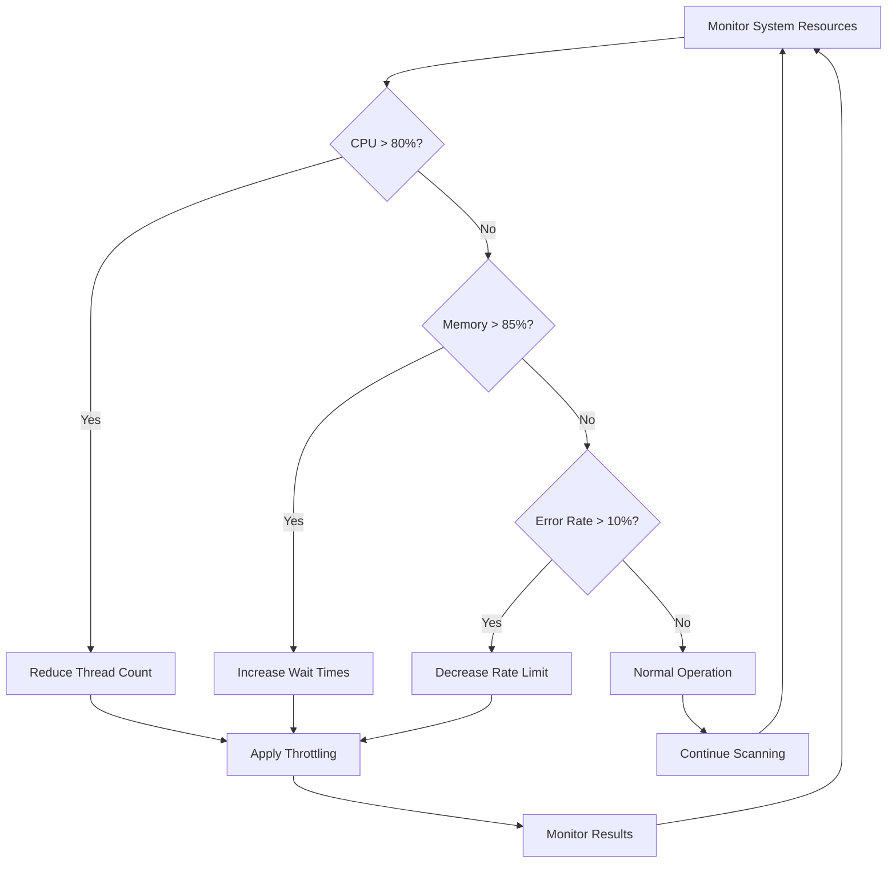

# Rate Limiting and Performance

## Overview

The Rate Limiting and Performance system controls the speed of network scanning operations to prevent overwhelming target networks and optimize scanning performance. It implements multiple rate limiting algorithms and provides performance monitoring capabilities.

### Key Components

- **RateLimiter**: Main rate limiting coordinator
- **TokenBucket**: Token bucket algorithm implementation
- **SlidingWindowRateLimiter**: Sliding window rate limiting
- **ConnectionPool**: Thread pool management and task distribution
- **Performance Monitoring**: Statistics collection and analysis

## Architecture

```mermaid
classDiagram
    class RateLimiter {
        +settings: ScanSettings
        +requests_per_second: float
        +token_bucket: TokenBucket
        +sliding_window: SlidingWindowRateLimiter
        +stats: Dict[str, Any]
        +acquire(timeout: float) bool
        +try_acquire() bool
        +get_statistics() Dict[str, Any]
        +update_rate(new_rate: float)
        +get_estimated_wait_time() float
    }

    class TokenBucket {
        +rate: float
        +capacity: int
        +tokens: float
        +last_update: float
        +consume(tokens: int) bool
        +wait_for_tokens(tokens: int, timeout: float) bool
        +get_available_tokens() float
    }

    class SlidingWindowRateLimiter {
        +rate: float
        +window_size: float
        +requests: deque
        +is_allowed() bool
        +wait_until_allowed(timeout: float) bool
        +get_current_rate() float
    }

    class ConnectionPool {
        +max_workers: int
        +executor: ThreadPoolExecutor
        +active_tasks: Dict[str, Future]
        +submit_scan_task(task: ScanTask) Future
        +submit_batch(tasks: List[ScanTask]) List[Future]
        +get_statistics() Dict[str, Any]
    }

    class ScanTask {
        +target: ScanTarget
        +port: int
        +scanner_func: Callable
        +task_id: str
    }

    RateLimiter --> TokenBucket : uses
    RateLimiter --> SlidingWindowRateLimiter : uses
    ConnectionPool --> ScanTask : manages
    ConnectionPool -.-> RateLimiter : integrates
```

## Rate Limiting Algorithms

### 1. Token Bucket Algorithm

The Token Bucket algorithm provides smooth rate limiting with burst capability:

```python
class TokenBucket:
    def __init__(self, rate: float, capacity: int):
        self.rate = rate          # Tokens per second
        self.capacity = capacity  # Maximum bucket size
        self.tokens = capacity    # Current token count
        self.last_update = time.time()
    
    def consume(self, tokens: int = 1) -> bool:
        now = time.time()
        
        # Refill tokens based on elapsed time
        elapsed = now - self.last_update
        self.tokens = min(self.capacity, self.tokens + elapsed * self.rate)
        self.last_update = now
        
        # Try to consume tokens
        if self.tokens >= tokens:
            self.tokens -= tokens
            return True
        
        return False
```

#### Token Bucket Characteristics

| Property | Description | Value |
|----------|-------------|-------|
| **Rate** | Token generation rate | requests/second |
| **Capacity** | Maximum burst size | 2x rate (capped at 100) |
| **Refill** | Continuous token refill | Based on elapsed time |
| **Burst** | Allow burst traffic | Up to capacity tokens |

### 2. Sliding Window Algorithm

The Sliding Window algorithm provides precise rate limiting over time windows:

```python
class SlidingWindowRateLimiter:
    def __init__(self, rate: float, window_size: float = 1.0):
        self.rate = rate           # Maximum requests per window
        self.window_size = window_size  # Window size in seconds
        self.requests = deque()    # Request timestamps
    
    def is_allowed(self) -> bool:
        now = time.time()
        
        # Remove old requests outside window
        cutoff_time = now - self.window_size
        while self.requests and self.requests[0] <= cutoff_time:
            self.requests.popleft()
        
        # Check if under rate limit
        if len(self.requests) < self.rate:
            self.requests.append(now)
            return True
        
        return False
```

#### Sliding Window Characteristics

| Property | Description | Value |
|----------|-------------|-------|
| **Window Size** | Time window duration | 1.0 second |
| **Precision** | Exact request counting | Per-request tracking |
| **Memory** | Request timestamp storage | O(rate) memory |
| **Accuracy** | High temporal accuracy | Sub-second precision |

### 3. Hybrid Rate Limiting

The main RateLimiter combines both algorithms for optimal performance:

```python
def acquire(self, timeout: Optional[float] = None) -> bool:
    # Primary: Token bucket (allows bursts)
    success = self.token_bucket.wait_for_tokens(1, timeout)
    
    if success:
        # Secondary: Sliding window (precise limiting)
        if not self.sliding_window.is_allowed():
            success = self.sliding_window.wait_until_allowed(remaining_timeout)
    
    return success
```

#### Hybrid Benefits

- **Burst Handling**: Token bucket allows controlled bursts
- **Precise Limiting**: Sliding window prevents sustained overuse
- **Graceful Degradation**: Fallback mechanisms for edge cases
- **Adaptive Timing**: Smart wait time calculations

## Performance Optimization Strategies

### 1. Connection Pool Management

```python
class ConnectionPool:
    def __init__(self, settings=None):
        self.max_workers = settings.scan.max_threads
        self.executor = ThreadPoolExecutor(
            max_workers=self.max_workers,
            thread_name_prefix="HawkEye-Scanner"
        )
```

#### Thread Pool Optimization

| Strategy | Implementation | Benefit |
|----------|----------------|---------|
| **Worker Sizing** | Based on CPU cores | Optimal CPU utilization |
| **Task Batching** | Group related tasks | Reduced overhead |
| **Load Distribution** | Even task distribution | Balanced resource usage |
| **Thread Reuse** | ThreadPoolExecutor | Reduced thread creation cost |

### 2. Adaptive Rate Control

```python
def update_rate(self, new_rate: float) -> None:
    """Dynamically adjust rate based on conditions."""
    self.requests_per_second = new_rate
    
    # Update both rate limiters
    self.token_bucket = TokenBucket(rate=new_rate, capacity=min(new_rate * 2, 100))
    self.sliding_window = SlidingWindowRateLimiter(rate=new_rate, window_size=1.0)
```

#### Adaptive Strategies

- **Load-based Adjustment**: Reduce rate under high load
- **Target Response**: Increase rate for responsive targets
- **Error Rate Monitoring**: Throttle on error spikes
- **Time-based Scaling**: Different rates for different times

### 3. Intelligent Wait Time Calculation

```python
def get_estimated_wait_time(self) -> float:
    # Token bucket wait time
    available_tokens = self.token_bucket.get_available_tokens()
    if available_tokens >= 1:
        token_wait = 0.0
    else:
        tokens_needed = 1 - available_tokens
        token_wait = tokens_needed / self.token_bucket.rate
    
    # Sliding window wait time
    current_rate = self.sliding_window.get_current_rate()
    if current_rate < self.requests_per_second:
        window_wait = 0.0
    else:
        # Calculate based on oldest request
        oldest_request = self.sliding_window.requests[0]
        window_wait = (oldest_request + self.sliding_window.window_size) - time.time()
    
    return max(token_wait, window_wait)
```

## Load Balancing and Throttling Mechanisms

### 1. Task Distribution

```python
def submit_batch(self, tasks: List[ScanTask]) -> List[Future]:
    """Submit multiple tasks with load balancing."""
    futures = []
    
    for task in tasks:
        # Check pool capacity
        if self.get_active_task_count() >= self.max_workers:
            # Wait for capacity or implement queueing
            time.sleep(0.01)
        
        # Submit task
        future = self.executor.submit(self._execute_scan_task, task)
        futures.append(future)
        
        # Track task
        with self._lock:
            self.active_tasks[task.task_id] = future
            self.stats['total_tasks'] += 1
    
    return futures
```

### 2. Resource-based Throttling

```python
def should_throttle(self) -> bool:
    """Check if scanning should be throttled."""
    # CPU utilization check
    if psutil.cpu_percent(interval=0.1) > 80:
        return True
    
    # Memory usage check
    if psutil.virtual_memory().percent > 85:
        return True
    
    # Network error rate check
    error_rate = self.stats['failed_tasks'] / self.stats['total_tasks']
    if error_rate > 0.1:  # 10% error rate threshold
        return True
    
    return False
```

### 3. Dynamic Throttling



## Integration with Scanning Workflow

### 1. Scanner Integration

```python
def scan_with_rate_limiting(self, targets: List[ScanTarget]) -> List[ScanResult]:
    """Perform scanning with integrated rate limiting."""
    results = []
    
    with self.rate_limiter:
        for target in targets:
            for port in target.ports:
                # Acquire rate limiting permission
                if self.rate_limiter.acquire(timeout=30):
                    # Perform scan
                    result = self.scanner.scan_port(target, port)
                    results.append(result)
                else:
                    # Rate limit timeout
                    self.logger.warning(f"Rate limit timeout for {target.host}:{port}")
    
    return results
```

### 2. Connection Pool Integration

```python
def execute_with_pool(self, scan_tasks: List[ScanTask]) -> List[ScanResult]:
    """Execute scan tasks using connection pool."""
    with ConnectionPool(self.settings) as pool:
        # Submit all tasks
        futures = pool.submit_batch(scan_tasks)
        
        # Collect results with timeout
        results = []
        for result in pool.wait_for_results(futures, timeout=300):
            results.append(result)
        
        # Get performance statistics
        stats = pool.get_statistics()
        self.logger.info(f"Pool stats: {stats}")
    
    return results
```

### 3. Pipeline Integration

```python
class ScanPipeline:
    def __init__(self):
        self.rate_limiter = RateLimiter()
        self.connection_pool = ConnectionPool()
        
    def execute_scan_phase(self, targets: List[ScanTarget]) -> List[ScanResult]:
        """Execute scanning phase with rate limiting and connection pooling."""
        # Create scan tasks
        tasks = []
        for target in targets:
            for port in target.ports:
                task = ScanTask(
                    target=target,
                    port=port,
                    scanner_func=self._rate_limited_scan
                )
                tasks.append(task)
        
        # Execute with connection pool
        return self.connection_pool.execute_batch(tasks)
    
    def _rate_limited_scan(self, target: ScanTarget, port: int) -> ScanResult:
        """Perform rate-limited scan."""
        # Acquire rate limiting permission
        if self.rate_limiter.acquire():
            return self.scanner.scan_port(target, port)
        else:
            return self._create_timeout_result(target, port)
```

## Configuration and Tuning

### Rate Limiting Settings

```python
class ScanSettings:
    rate_limit_requests: int = 100        # Requests per second
    max_threads: int = 50                 # Maximum concurrent threads
    timeout_seconds: int = 5              # Operation timeout
    retry_attempts: int = 3               # Retry failed operations
```

### Environment Variables

```bash
# Rate limiting configuration
export HAWKEYE_SCAN_RATE_LIMIT_REQUESTS=150
export HAWKEYE_SCAN_MAX_THREADS=75
export HAWKEYE_SCAN_TIMEOUT_SECONDS=10

# Performance tuning
export HAWKEYE_SCAN_RETRY_ATTEMPTS=5
```

### Tuning Guidelines

| Scenario | Rate Limit | Threads | Notes |
|----------|------------|---------|-------|
| **Local Network** | 500-1000 | 100-200 | High-speed internal scanning |
| **Internet Targets** | 50-100 | 20-50 | Respectful external scanning |
| **Stealth Mode** | 10-20 | 5-10 | Minimal detection footprint |
| **High-Volume** | 200-500 | 50-100 | Balanced performance/stability |

## Performance Monitoring

### Statistics Collection

```python
def get_comprehensive_statistics(self) -> Dict[str, Any]:
    """Get comprehensive performance statistics."""
    rate_limiter_stats = self.rate_limiter.get_statistics()
    pool_stats = self.connection_pool.get_statistics()
    
    return {
        'rate_limiting': {
            'requests_per_second': rate_limiter_stats['actual_request_rate'],
            'success_rate': rate_limiter_stats['success_rate'],
            'average_wait_time': rate_limiter_stats['average_wait_time'],
            'total_requests': rate_limiter_stats['total_requests'],
            'blocked_requests': rate_limiter_stats['blocked_requests'],
        },
        'connection_pool': {
            'active_tasks': pool_stats['active_tasks'],
            'completed_tasks': pool_stats['completed_tasks'],
            'failed_tasks': pool_stats['failed_tasks'],
            'tasks_per_second': pool_stats['tasks_per_second'],
            'duration': pool_stats['duration'],
        },
        'performance': {
            'effective_throughput': self._calculate_effective_throughput(),
            'resource_utilization': self._get_resource_utilization(),
            'bottleneck_analysis': self._identify_bottlenecks(),
        }
    }
```

### Real-time Monitoring

```python
class PerformanceMonitor:
    def __init__(self):
        self.metrics = {
            'requests_per_second': [],
            'response_times': [],
            'error_rates': [],
            'resource_usage': [],
        }
    
    def update_metrics(self, scan_result: ScanResult):
        """Update performance metrics with scan result."""
        now = time.time()
        
        # Update request rate
        self.metrics['requests_per_second'].append((now, 1))
        
        # Update response time
        if scan_result.response_time:
            self.metrics['response_times'].append((now, scan_result.response_time))
        
        # Update error rate
        has_error = scan_result.error is not None
        self.metrics['error_rates'].append((now, 1 if has_error else 0))
        
        # Cleanup old metrics (keep last hour)
        cutoff = now - 3600
        for metric_list in self.metrics.values():
            while metric_list and metric_list[0][0] < cutoff:
                metric_list.pop(0)
```

### Performance Metrics

| Metric | Description | Target Value |
|--------|-------------|--------------|
| **Effective Throughput** | Successful scans per second | 80-90% of rate limit |
| **Average Response Time** | Mean scan response time | < 2x timeout setting |
| **Error Rate** | Failed scans percentage | < 5% |
| **Resource Utilization** | CPU/Memory usage | < 80% |
| **Wait Time** | Average rate limit wait time | < 100ms |

## Error Handling and Resilience

### Rate Limiting Errors

```python
def handle_rate_limit_timeout(self, target: ScanTarget, port: int) -> ScanResult:
    """Handle rate limiting timeout scenarios."""
    return ScanResult(
        target=target,
        port=port,
        state=PortState.UNKNOWN,
        scan_type=ScanType.TCP_CONNECT,
        error="Rate limit timeout",
        raw_data={'reason': 'rate_limit_timeout'}
    )
```

### Connection Pool Errors

```python
def handle_pool_exhaustion(self, tasks: List[ScanTask]) -> List[ScanResult]:
    """Handle connection pool exhaustion."""
    results = []
    
    for task in tasks:
        try:
            # Try with timeout
            future = self.pool.submit_scan_task(task)
            result = future.result(timeout=30)
            results.append(result)
        except TimeoutError:
            # Create timeout result
            result = self._create_timeout_result(task)
            results.append(result)
        except Exception as e:
            # Create error result
            result = self._create_error_result(task, str(e))
            results.append(result)
    
    return results
```

### Graceful Degradation

```python
def adaptive_rate_adjustment(self):
    """Adjust rate based on error conditions."""
    stats = self.rate_limiter.get_statistics()
    
    # High error rate - reduce rate
    if stats['success_rate'] < 0.8:
        new_rate = self.rate_limiter.requests_per_second * 0.8
        self.rate_limiter.update_rate(new_rate)
        self.logger.info(f"Reduced rate to {new_rate} due to high error rate")
    
    # High success rate - potentially increase rate
    elif stats['success_rate'] > 0.95 and stats['average_wait_time'] < 0.01:
        new_rate = self.rate_limiter.requests_per_second * 1.1
        new_rate = min(new_rate, 1000)  # Cap at 1000 requests/second
        self.rate_limiter.update_rate(new_rate)
        self.logger.info(f"Increased rate to {new_rate} due to good performance")
```

## Testing and Validation

### Unit Tests

```python
def test_token_bucket_rate_limiting():
    """Test token bucket rate limiting behavior."""
    bucket = TokenBucket(rate=10, capacity=10)
    
    # Initial burst should work
    for _ in range(10):
        assert bucket.consume(1) == True
    
    # Next request should fail
    assert bucket.consume(1) == False
    
    # Wait and test refill
    time.sleep(0.5)
    assert bucket.consume(5) == True

def test_sliding_window_precision():
    """Test sliding window precision."""
    limiter = SlidingWindowRateLimiter(rate=5, window_size=1.0)
    
    # Allow 5 requests initially
    for _ in range(5):
        assert limiter.is_allowed() == True
    
    # 6th request should be blocked
    assert limiter.is_allowed() == False
    
    # After window passes, should allow again
    time.sleep(1.1)
    assert limiter.is_allowed() == True
```

### Performance Tests

```python
def test_rate_limiting_performance():
    """Test rate limiting performance characteristics."""
    rate_limiter = RateLimiter()
    start_time = time.time()
    
    # Make 100 requests
    for _ in range(100):
        rate_limiter.acquire()
    
    duration = time.time() - start_time
    actual_rate = 100 / duration
    
    # Should be close to configured rate
    assert abs(actual_rate - rate_limiter.requests_per_second) < 5
```

### Load Tests

```python
def test_connection_pool_under_load():
    """Test connection pool behavior under heavy load."""
    pool = ConnectionPool(max_workers=50)
    
    # Submit 1000 tasks
    tasks = [create_mock_task() for _ in range(1000)]
    futures = pool.submit_batch(tasks)
    
    # All tasks should complete
    results = list(pool.wait_for_results(futures, timeout=300))
    assert len(results) == 1000
    
    # Check performance metrics
    stats = pool.get_statistics()
    assert stats['tasks_per_second'] > 10
```

## Future Enhancements

### Planned Features

1. **Machine Learning Rate Adaptation**: ML-based rate optimization
2. **Geographic Rate Limiting**: Location-based rate adjustments
3. **Target-specific Throttling**: Per-target rate customization
4. **Predictive Load Balancing**: Forecast-based task distribution
5. **Circuit Breaker Pattern**: Automatic failure protection

### Optimization Opportunities

- **NUMA-aware Threading**: Optimize for multi-socket systems
- **Lock-free Algorithms**: Reduce synchronization overhead
- **Memory Pool Management**: Reduce allocation overhead
- **Network Buffer Optimization**: Optimize socket buffer sizes

## Usage Examples

### Basic Rate Limiting

```python
from hawkeye.scanner import RateLimiter

# Initialize rate limiter
rate_limiter = RateLimiter()

# Acquire permission for request
if rate_limiter.acquire(timeout=5):
    # Perform scanning operation
    result = scanner.scan_port(target, port)
else:
    print("Rate limit timeout")

# Check statistics
stats = rate_limiter.get_statistics()
print(f"Success rate: {stats['success_rate']:.2%}")
```

### Connection Pool Usage

```python
from hawkeye.scanner import ConnectionPool, ScanTask

# Create scan tasks
tasks = []
for target in targets:
    for port in target.ports:
        task = ScanTask(target=target, port=port, scanner_func=scan_function)
        tasks.append(task)

# Execute with connection pool
with ConnectionPool() as pool:
    futures = pool.submit_batch(tasks)
    results = list(pool.wait_for_results(futures))

print(f"Completed {len(results)} scans")
```

### Integrated Scanning

```python
def rate_limited_scan(targets: List[ScanTarget]) -> List[ScanResult]:
    """Perform rate-limited scanning with connection pooling."""
    rate_limiter = RateLimiter()
    results = []
    
    with ConnectionPool() as pool:
        for target in targets:
            for port in target.ports:
                # Rate limiting
                if rate_limiter.acquire():
                    # Submit scan task
                    task = ScanTask(target=target, port=port, scanner_func=tcp_scan)
                    future = pool.submit_scan_task(task)
                    
                    try:
                        result = future.result(timeout=10)
                        results.append(result)
                    except TimeoutError:
                        print(f"Scan timeout: {target.host}:{port}")
    
    return results
``` 