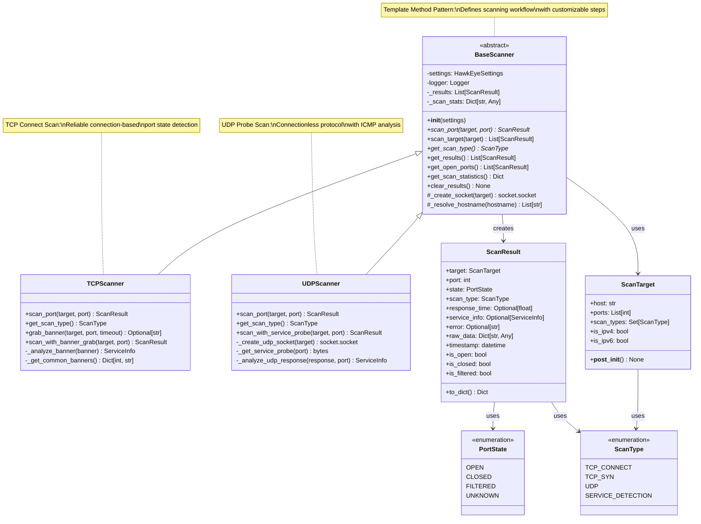
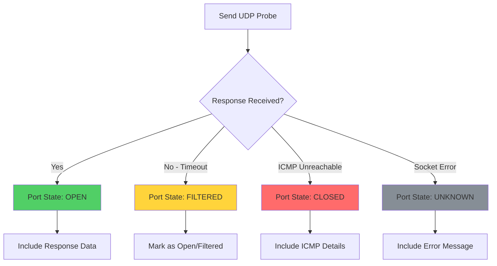

# Network Scanner Components Analysis

## Overview

This document provides comprehensive analysis of the HawkEye network scanner components, including the abstract base class architecture, concrete scanner implementations, scanning algorithms, optimization strategies, and extensibility patterns. The scanner architecture demonstrates sophisticated application of object-oriented design patterns for network reconnaissance.

## Component Architecture

### 1. Class Hierarchy Overview



## BaseScanner Abstract Class Analysis

### 1. Core Architecture

The `BaseScanner` class implements the **Template Method Pattern**, providing a structured framework for network scanning operations while allowing concrete implementations to customize specific scanning behaviors.

#### Key Design Principles

```python
class BaseScanner(ABC):
    """Abstract base class for network scanners."""
    
    def __init__(self, settings=None):
        """Initialize scanner with configuration and state management."""
        self.settings = settings or get_settings()
        self.logger = get_logger(self.__class__.__name__)
        self._results: List[ScanResult] = []  # Result accumulation
        self._scan_stats = {                  # Performance tracking
            'total_scans': 0,
            'successful_scans': 0,
            'failed_scans': 0,
            'start_time': None,
            'end_time': None,
        }
```

**Design Strengths**:
- **Separation of Concerns**: Abstract interface separates common functionality from protocol-specific logic
- **State Management**: Centralized result storage and statistics tracking
- **Configuration Integration**: Unified settings management across all scanner types
- **Logging Integration**: Consistent logging behavior with class-specific loggers
- **Error Handling**: Template methods provide standardized error recovery

### 2. Template Method Implementation

#### Core Scanning Workflow

```python
def scan_target(self, target: ScanTarget) -> List[ScanResult]:
    """Template method defining the scanning workflow."""
    
    # 1. Initialize scanning session
    self.logger.info(f"Starting scan of {target.host} on {len(target.ports)} ports")
    self._scan_stats['start_time'] = time.time()
    
    results = []
    
    # 2. Execute port scanning loop
    for port in target.ports:
        try:
            # Delegate to concrete implementation
            result = self.scan_port(target, port)  # Abstract method
            results.append(result)
            self._results.append(result)
            self._scan_stats['successful_scans'] += 1
            
            # 3. Handle successful scan
            if result.is_open:
                self.logger.info(f"Found open port: {target.host}:{port}")
                
        except Exception as e:
            # 4. Handle scan errors gracefully
            self.logger.error(f"Error scanning {target.host}:{port} - {e}")
            error_result = ScanResult(
                target=target,
                port=port,
                state=PortState.UNKNOWN,
                scan_type=self.get_scan_type(),
                error=str(e)
            )
            results.append(error_result)
            self._results.append(error_result)
            self._scan_stats['failed_scans'] += 1
        
        self._scan_stats['total_scans'] += 1
    
    # 5. Finalize scanning session
    self._scan_stats['end_time'] = time.time()
    self.logger.info(f"Completed scan of {target.host}: {len(results)} results")
    
    return results
```

**Template Method Benefits**:
- **Consistent Workflow**: All scanners follow the same high-level process
- **Error Resilience**: Standardized error handling prevents cascade failures
- **Statistics Collection**: Automatic performance metrics gathering
- **Extensibility**: Easy to add new scanner types without changing workflow
- **Testability**: Template provides predictable testing hooks

### 3. Abstract Method Contracts

#### Primary Abstract Methods

```python
@abstractmethod
def scan_port(self, target: ScanTarget, port: int) -> ScanResult:
    """
    Scan a single port using protocol-specific logic.
    
    Contract Requirements:
    - Must return valid ScanResult object
    - Must handle all exceptions internally
    - Must set appropriate PortState based on protocol
    - Must measure and report response time
    - Must populate protocol-specific raw_data
    """
    pass

@abstractmethod
def get_scan_type(self) -> ScanType:
    """
    Return the scan type identifier for this scanner.
    
    Contract Requirements:
    - Must return consistent ScanType enum value
    - Used for result classification and reporting
    - Must match the actual scanning methodology
    """
    pass
```

#### Utility Methods (Protected Interface)

```python
def _create_socket(self, target: ScanTarget) -> socket.socket:
    """Create optimized socket for target type."""
    if target.is_ipv6:
        sock = socket.socket(socket.AF_INET6, socket.SOCK_STREAM)
    else:
        sock = socket.socket(socket.AF_INET, socket.SOCK_STREAM)
    
    # Apply performance optimizations
    sock.settimeout(self.settings.scan.timeout_seconds)
    return sock

def _resolve_hostname(self, hostname: str) -> List[str]:
    """Resolve hostname to IP addresses with caching."""
    try:
        # Implementation includes DNS caching and error handling
        result = socket.getaddrinfo(hostname, None)
        return [addr[4][0] for addr in result]
    except socket.gaierror as e:
        self.logger.error(f"DNS resolution failed for {hostname}: {e}")
        raise
```

## TCPScanner Implementation Analysis

### 1. TCP Connect Scan Algorithm

The `TCPScanner` implements the **TCP Connect** scanning method, which attempts to establish full TCP connections to determine port states.

#### Algorithm Implementation

```python
def scan_port(self, target: ScanTarget, port: int) -> ScanResult:
    """TCP Connect scan implementation."""
    start_time = time.time()
    
    try:
        # 1. Create optimized socket
        sock = self._create_socket(target)
        
        try:
            # 2. Attempt connection using connect_ex()
            result = sock.connect_ex((target.host, port))
            response_time = time.time() - start_time
            
            # 3. Interpret connection result
            if result == 0:
                # Connection successful - port is OPEN
                state = PortState.OPEN
                self.logger.debug(f"TCP port {target.host}:{port} is OPEN")
            else:
                # Connection failed - port is CLOSED
                state = PortState.CLOSED
                self.logger.debug(f"TCP port {target.host}:{port} is CLOSED (errno: {result})")
            
            # 4. Create detailed result
            return ScanResult(
                target=target,
                port=port,
                state=state,
                scan_type=ScanType.TCP_CONNECT,
                response_time=response_time,
                raw_data={'errno': str(result)}
            )
            
        finally:
            # 5. Ensure socket cleanup
            sock.close()
            
    except socket.timeout:
        # Handle timeout -> FILTERED state
        return self._create_timeout_result(target, port, start_time)
    except socket.gaierror as e:
        # Handle DNS errors -> UNKNOWN state
        return self._create_dns_error_result(target, port, start_time, e)
    except Exception as e:
        # Handle unexpected errors -> UNKNOWN state
        return self._create_error_result(target, port, start_time, e)
```

#### TCP Scan Characteristics

**Advantages**:
- **Reliability**: Definitive port state determination (OPEN/CLOSED)
- **Accuracy**: No ambiguity in results - successful connection = open port
- **Firewall Bypass**: Can traverse some firewall configurations
- **Service Interaction**: Can grab banners and service information

**Disadvantages**:
- **Detectability**: Leaves clear connection logs on target systems
- **Resource Usage**: Requires full TCP handshake per port
- **Speed**: Slower than SYN scans due to full connection establishment
- **Rate Limiting**: More likely to trigger rate limiting/blocking

#### Error State Mapping

```python
def _map_tcp_error_to_state(self, error: Exception, errno: int) -> PortState:
    """Map TCP errors to appropriate port states."""
    
    error_state_map = {
        # Connection refused - port is closed
        111: PortState.CLOSED,  # ECONNREFUSED
        
        # Host unreachable - cannot determine port state
        113: PortState.UNKNOWN,  # EHOSTUNREACH
        
        # Network unreachable - cannot determine port state  
        101: PortState.UNKNOWN,  # ENETUNREACH
        
        # Timeout - port is filtered
        110: PortState.FILTERED,  # ETIMEDOUT
    }
    
    return error_state_map.get(errno, PortState.UNKNOWN)
```

### 2. Banner Grabbing Enhancement

The TCP scanner includes advanced banner grabbing capabilities for service identification:

```python
def grab_banner(self, target: ScanTarget, port: int, timeout: Optional[float] = None) -> Optional[str]:
    """Grab service banner from open TCP port."""
    
    if timeout is None:
        timeout = self.settings.scan.timeout_seconds
    
    try:
        sock = self._create_socket(target)
        sock.settimeout(timeout)
        
        # Establish connection
        if sock.connect_ex((target.host, port)) != 0:
            return None
        
        # Send probe data for banner detection
        probe_data = self._get_banner_probe(port)
        if probe_data:
            sock.send(probe_data)
        
        # Read banner response
        banner = sock.recv(1024).decode('utf-8', errors='ignore').strip()
        return banner if banner else None
        
    except Exception as e:
        self.logger.debug(f"Banner grab failed for {target.host}:{port}: {e}")
        return None
    finally:
        sock.close()

def _get_banner_probe(self, port: int) -> Optional[bytes]:
    """Get appropriate probe data for common services."""
    
    service_probes = {
        21: b"USER anonymous\r\n",      # FTP
        22: b"",                        # SSH (banner on connect)
        23: b"",                        # Telnet (banner on connect)
        25: b"EHLO hawkeye\r\n",       # SMTP
        53: b"",                        # DNS (no probe needed)
        80: b"GET / HTTP/1.0\r\n\r\n", # HTTP
        110: b"USER test\r\n",         # POP3
        143: b"A001 CAPABILITY\r\n",   # IMAP
        443: b"",                       # HTTPS (SSL handshake)
        993: b"",                       # IMAPS (SSL handshake)
        995: b"",                       # POP3S (SSL handshake)
    }
    
    return service_probes.get(port, b"")
```

## UDPScanner Implementation Analysis

### 1. UDP Probe Scan Algorithm

The `UDPScanner` implements UDP port scanning, which is significantly more complex due to UDP's connectionless nature.

#### Algorithm Implementation

```python
def scan_port(self, target: ScanTarget, port: int) -> ScanResult:
    """
    UDP scan implementation with multiple detection techniques.
    
    UDP scanning challenges:
    1. No connection establishment
    2. No guaranteed response
    3. ICMP messages may be filtered
    4. State determination is probabilistic
    """
    start_time = time.time()
    
    try:
        # 1. Create UDP socket
        sock = self._create_udp_socket(target)
        
        try:
            # 2. Send UDP probe packet
            test_data = b"HawkEye UDP Probe"
            sock.sendto(test_data, (target.host, port))
            
            # 3. Attempt to receive response
            try:
                sock.settimeout(self.settings.scan.timeout_seconds)
                response, addr = sock.recvfrom(1024)
                response_time = time.time() - start_time
                
                # Response received -> Port is OPEN
                return ScanResult(
                    target=target,
                    port=port,
                    state=PortState.OPEN,
                    scan_type=ScanType.UDP,
                    response_time=response_time,
                    raw_data={'response': response.decode('utf-8', errors='ignore')[:100]}
                )
                
            except socket.timeout:
                # No response -> Port is OPEN|FILTERED
                response_time = time.time() - start_time
                return ScanResult(
                    target=target,
                    port=port,
                    state=PortState.FILTERED,  # Could be open or filtered
                    scan_type=ScanType.UDP,
                    response_time=response_time,
                    raw_data={'status': 'no_response'}
                )
        
        finally:
            sock.close()
            
    except socket.error as e:
        response_time = time.time() - start_time
        
        # 4. Check for ICMP Port Unreachable
        if "port unreachable" in str(e).lower() or e.errno == 111:
            # ICMP unreachable -> Port is CLOSED
            return ScanResult(
                target=target,
                port=port,
                state=PortState.CLOSED,
                scan_type=ScanType.UDP,
                response_time=response_time,
                raw_data={'icmp_error': str(e)}
            )
        else:
            # Other socket error -> State UNKNOWN
            return ScanResult(
                target=target,
                port=port,
                state=PortState.UNKNOWN,
                scan_type=ScanType.UDP,
                response_time=response_time,
                error=f"Socket error: {e}"
            )
```

#### UDP Scan State Logic



#### UDP Scan Challenges and Solutions

| Challenge | Solution | Implementation |
|-----------|----------|----------------|
| **No Response Ambiguity** | State as FILTERED | `PortState.FILTERED` indicates open\|filtered |
| **ICMP Filtering** | Multiple probe techniques | Service-specific probes increase accuracy |
| **Rate Limiting** | Adaptive timing | Intelligent delay between probes |
| **Service Detection** | Protocol-specific probes | Custom payloads for common UDP services |

### 2. Service-Specific UDP Probing

The UDP scanner includes enhanced service detection through protocol-specific probes:

```python
def scan_with_service_probe(self, target: ScanTarget, port: int) -> ScanResult:
    """Enhanced UDP scan with service-specific probes."""
    
    # Get service-specific probe data
    probe_data = self._get_service_probe(port)
    
    start_time = time.time()
    
    try:
        sock = self._create_udp_socket(target)
        
        try:
            # Send service-specific probe
            sock.sendto(probe_data, (target.host, port))
            
            # Wait for service-specific response
            try:
                response, addr = sock.recvfrom(4096)
                response_time = time.time() - start_time
                
                # Analyze service response
                service_info = self._analyze_udp_response(response, port)
                
                return ScanResult(
                    target=target,
                    port=port,
                    state=PortState.OPEN,
                    scan_type=ScanType.UDP,
                    response_time=response_time,
                    service_info=service_info,
                    raw_data={'response': response.hex()[:200]}
                )
                
            except socket.timeout:
                # Fall back to basic UDP scan
                return self.scan_port(target, port)
        
        finally:
            sock.close()
            
    except Exception as e:
        # Fall back to basic UDP scan
        return self.scan_port(target, port)

def _get_service_probe(self, port: int) -> bytes:
    """Get service-specific UDP probe payloads."""
    
    udp_service_probes = {
        53: b'\x12\x34\x01\x00\x00\x01\x00\x00\x00\x00\x00\x00\x03www\x07example\x03com\x00\x00\x01\x00\x01',  # DNS query
        67: b'\x01\x01\x06\x00\x00\x00\x3d\x1d\x00\x00\x00\x00\x00\x00\x00\x00',  # DHCP Discover
        69: b'\x00\x01example.txt\x00netascii\x00',  # TFTP Read Request
        123: b'\x1b\x00\x00\x00\x00\x00\x00\x00\x00\x00\x00\x00\x00\x00\x00\x00\x00\x00\x00\x00\x00\x00\x00\x00\x00\x00\x00\x00\x00\x00\x00\x00\x00\x00\x00\x00\x00\x00\x00\x00\x00\x00\x00\x00\x00\x00\x00\x00',  # NTP
        161: b'\x30\x26\x02\x01\x01\x04\x06public\xa0\x19\x02\x04\x00\x00\x00\x00\x02\x01\x00\x02\x01\x00\x30\x0b\x30\x09\x06\x05\x2b\x06\x01\x02\x01\x05\x00',  # SNMP GetRequest
        500: b'\x00\x00\x00\x00\x00\x00\x00\x00\x00\x00\x00\x00\x01\x10\x02\x00',  # ISAKMP
        514: b'<30>Oct 9 22:33:20 hawkeye: test message',  # Syslog
        1900: b'M-SEARCH * HTTP/1.1\r\nHOST: 239.255.255.250:1900\r\nMAN: "ssdp:discover"\r\nST: upnp:rootdevice\r\nMX: 3\r\n\r\n',  # SSDP
    }
    
    return udp_service_probes.get(port, b"HawkEye UDP Probe")
```

## Scanning Algorithms and Optimization Strategies

### 1. Performance Optimization Techniques

#### Socket Optimization

```python
class OptimizedScanner(BaseScanner):
    """Scanner with advanced performance optimizations."""
    
    def _create_optimized_socket(self, target: ScanTarget) -> socket.socket:
        """Create socket with performance optimizations."""
        
        # Select appropriate socket family
        if target.is_ipv6:
            sock = socket.socket(socket.AF_INET6, socket.SOCK_STREAM)
        else:
            sock = socket.socket(socket.AF_INET, socket.SOCK_STREAM)
        
        # Apply performance optimizations
        try:
            # Reuse address to avoid TIME_WAIT issues
            sock.setsockopt(socket.SOL_SOCKET, socket.SO_REUSEADDR, 1)
            
            # Disable Nagle's algorithm for faster small packet transmission
            sock.setsockopt(socket.IPPROTO_TCP, socket.TCP_NODELAY, 1)
            
            # Set optimal buffer sizes
            sock.setsockopt(socket.SOL_SOCKET, socket.SO_RCVBUF, 65536)
            sock.setsockopt(socket.SOL_SOCKET, socket.SO_SNDBUF, 65536)
            
            # Enable keep-alive for connection reuse
            sock.setsockopt(socket.SOL_SOCKET, socket.SO_KEEPALIVE, 1)
            
            # Set timeout for non-blocking behavior
            sock.settimeout(self.settings.scan.timeout_seconds)
            
        except OSError as e:
            # Some optimizations may not be available on all platforms
            self.logger.debug(f"Socket optimization failed: {e}")
        
        return sock
```

#### Connection Pooling Strategy

```python
class PooledScanner(BaseScanner):
    """Scanner with connection pooling for efficiency."""
    
    def __init__(self, settings=None):
        super().__init__(settings)
        self.connection_pool = {}
        self.pool_size_limit = 100
        
    def _get_pooled_connection(self, target: ScanTarget) -> socket.socket:
        """Get connection from pool or create new one."""
        
        pool_key = (target.host, target.is_ipv6)
        
        # Check pool for existing connection
        if pool_key in self.connection_pool:
            connections = self.connection_pool[pool_key]
            if connections:
                return connections.pop()
        
        # Create new connection
        return self._create_optimized_socket(target)
    
    def _return_to_pool(self, target: ScanTarget, sock: socket.socket):
        """Return connection to pool for reuse."""
        
        pool_key = (target.host, target.is_ipv6)
        
        # Initialize pool for target if needed
        if pool_key not in self.connection_pool:
            self.connection_pool[pool_key] = []
        
        # Add to pool if under limit
        if len(self.connection_pool[pool_key]) < self.pool_size_limit:
            self.connection_pool[pool_key].append(sock)
        else:
            sock.close()
```

### 2. Adaptive Timeout Strategy

```python
class AdaptiveTimeoutScanner(BaseScanner):
    """Scanner with adaptive timeout based on network conditions."""
    
    def __init__(self, settings=None):
        super().__init__(settings)
        self.response_time_history = []
        self.adaptive_timeout = self.settings.scan.timeout_seconds
        
    def _calculate_adaptive_timeout(self) -> float:
        """Calculate optimal timeout based on response time history."""
        
        if len(self.response_time_history) < 10:
            return self.settings.scan.timeout_seconds
        
        # Calculate statistics from recent response times
        recent_times = self.response_time_history[-50:]  # Last 50 responses
        avg_response_time = sum(recent_times) / len(recent_times)
        max_response_time = max(recent_times)
        
        # Set timeout to 3x average or 1.5x max, whichever is greater
        calculated_timeout = max(
            avg_response_time * 3,
            max_response_time * 1.5,
            1.0  # Minimum timeout
        )
        
        # Cap at configured maximum
        return min(calculated_timeout, self.settings.scan.timeout_seconds * 2)
    
    def scan_port(self, target: ScanTarget, port: int) -> ScanResult:
        """Scan with adaptive timeout."""
        
        # Update adaptive timeout
        self.adaptive_timeout = self._calculate_adaptive_timeout()
        
        # Perform scan with adaptive timeout
        start_time = time.time()
        
        try:
            sock = self._create_socket(target)
            sock.settimeout(self.adaptive_timeout)
            
            # ... scanning logic ...
            
            # Record successful response time
            response_time = time.time() - start_time
            self.response_time_history.append(response_time)
            
            # Limit history size
            if len(self.response_time_history) > 100:
                self.response_time_history.pop(0)
                
        except socket.timeout:
            # Timeout with adaptive timeout
            pass
```

## Error Handling and Recovery

### 1. Comprehensive Error Classification

```python
class RobustScanner(BaseScanner):
    """Scanner with comprehensive error handling and recovery."""
    
    def _classify_scan_error(self, error: Exception, errno: Optional[int] = None) -> Tuple[PortState, str]:
        """Classify errors and determine appropriate port state."""
        
        error_classifications = {
            # Network-level errors
            socket.timeout: (PortState.FILTERED, "Connection timeout"),
            socket.gaierror: (PortState.UNKNOWN, "DNS resolution failed"),
            
            # Connection-level errors  
            ConnectionRefusedError: (PortState.CLOSED, "Connection refused"),
            ConnectionResetError: (PortState.CLOSED, "Connection reset"),
            ConnectionAbortedError: (PortState.UNKNOWN, "Connection aborted"),
            
            # Host-level errors
            OSError: self._classify_os_error,
        }
        
        error_type = type(error)
        
        if error_type in error_classifications:
            classifier = error_classifications[error_type]
            
            if callable(classifier):
                return classifier(error, errno)
            else:
                return classifier
        
        # Default classification for unknown errors
        return (PortState.UNKNOWN, f"Unexpected error: {error}")
    
    def _classify_os_error(self, error: OSError, errno: Optional[int] = None) -> Tuple[PortState, str]:
        """Classify OS-level errors based on errno codes."""
        
        errno_classifications = {
            111: (PortState.CLOSED, "Connection refused"),           # ECONNREFUSED
            113: (PortState.UNKNOWN, "Host unreachable"),           # EHOSTUNREACH  
            101: (PortState.UNKNOWN, "Network unreachable"),        # ENETUNREACH
            110: (PortState.FILTERED, "Connection timeout"),        # ETIMEDOUT
            104: (PortState.CLOSED, "Connection reset by peer"),    # ECONNRESET
            32: (PortState.UNKNOWN, "Broken pipe"),                 # EPIPE
            9: (PortState.UNKNOWN, "Bad file descriptor"),          # EBADF
        }
        
        error_errno = getattr(error, 'errno', errno)
        
        if error_errno in errno_classifications:
            return errno_classifications[error_errno]
        
        return (PortState.UNKNOWN, f"OS error {error_errno}: {error}")
```

### 2. Graceful Degradation Strategy

```python
def scan_port_with_fallback(self, target: ScanTarget, port: int) -> ScanResult:
    """Scan port with multiple fallback strategies."""
    
    fallback_strategies = [
        self._primary_scan_strategy,
        self._reduced_timeout_strategy,
        self._minimal_scan_strategy,
    ]
    
    last_error = None
    
    for strategy in fallback_strategies:
        try:
            result = strategy(target, port)
            
            # Mark result with strategy used
            result.raw_data = result.raw_data or {}
            result.raw_data['strategy'] = strategy.__name__
            
            return result
            
        except Exception as e:
            last_error = e
            self.logger.debug(f"Strategy {strategy.__name__} failed: {e}")
            continue
    
    # All strategies failed - create error result
    return ScanResult(
        target=target,
        port=port,
        state=PortState.UNKNOWN,
        scan_type=self.get_scan_type(),
        error=f"All strategies failed. Last error: {last_error}",
        raw_data={'failed_strategies': len(fallback_strategies)}
    )

def _primary_scan_strategy(self, target: ScanTarget, port: int) -> ScanResult:
    """Primary scanning strategy with full feature set."""
    return self.scan_port(target, port)

def _reduced_timeout_strategy(self, target: ScanTarget, port: int) -> ScanResult:
    """Fallback strategy with reduced timeout."""
    original_timeout = self.settings.scan.timeout_seconds
    try:
        self.settings.scan.timeout_seconds = max(1.0, original_timeout / 2)
        return self.scan_port(target, port)
    finally:
        self.settings.scan.timeout_seconds = original_timeout

def _minimal_scan_strategy(self, target: ScanTarget, port: int) -> ScanResult:
    """Minimal scanning strategy for hostile environments."""
    # Implement minimal scanning with basic connect attempt
    start_time = time.time()
    
    try:
        sock = socket.socket(socket.AF_INET, socket.SOCK_STREAM)
        sock.settimeout(1.0)  # Very short timeout
        
        result = sock.connect_ex((target.host, port))
        response_time = time.time() - start_time
        
        sock.close()
        
        return ScanResult(
            target=target,
            port=port,
            state=PortState.OPEN if result == 0 else PortState.CLOSED,
            scan_type=self.get_scan_type(),
            response_time=response_time,
            raw_data={'minimal_scan': True}
        )
        
    except Exception as e:
        return ScanResult(
            target=target,
            port=port,
            state=PortState.UNKNOWN,
            scan_type=self.get_scan_type(),
            response_time=time.time() - start_time,
            error=f"Minimal scan failed: {e}"
        )
```

## Extensibility and Design Patterns

### 1. Strategy Pattern for Scan Types

```python
from abc import ABC, abstractmethod
from enum import Enum

class ScanStrategy(ABC):
    """Abstract strategy for different scanning approaches."""
    
    @abstractmethod
    def scan(self, target: ScanTarget, port: int) -> ScanResult:
        """Execute scanning strategy."""
        pass
    
    @abstractmethod
    def get_strategy_name(self) -> str:
        """Get human-readable strategy name."""
        pass

class TCPConnectStrategy(ScanStrategy):
    """TCP Connect scan strategy."""
    
    def scan(self, target: ScanTarget, port: int) -> ScanResult:
        # Implementation matches TCPScanner.scan_port()
        pass
    
    def get_strategy_name(self) -> str:
        return "TCP Connect Scan"

class TCPSYNStrategy(ScanStrategy):
    """TCP SYN scan strategy (requires root privileges)."""
    
    def scan(self, target: ScanTarget, port: int) -> ScanResult:
        # Raw socket implementation for SYN scan
        pass
    
    def get_strategy_name(self) -> str:
        return "TCP SYN Scan"

class PluggableScanner(BaseScanner):
    """Scanner that accepts pluggable scan strategies."""
    
    def __init__(self, strategy: ScanStrategy, settings=None):
        super().__init__(settings)
        self.strategy = strategy
    
    def scan_port(self, target: ScanTarget, port: int) -> ScanResult:
        """Delegate to pluggable strategy."""
        return self.strategy.scan(target, port)
    
    def get_scan_type(self) -> ScanType:
        """Map strategy to scan type."""
        strategy_type_map = {
            'TCP Connect Scan': ScanType.TCP_CONNECT,
            'TCP SYN Scan': ScanType.TCP_SYN,
            'UDP Probe Scan': ScanType.UDP,
        }
        
        return strategy_type_map.get(
            self.strategy.get_strategy_name(),
            ScanType.TCP_CONNECT
        )
```

### 2. Observer Pattern for Scan Events

```python
from typing import List, Callable

class ScanEventType(Enum):
    """Types of scan events."""
    SCAN_STARTED = "scan_started"
    PORT_SCANNED = "port_scanned"
    OPEN_PORT_FOUND = "open_port_found"
    SCAN_COMPLETED = "scan_completed"
    SCAN_ERROR = "scan_error"

@dataclass
class ScanEvent:
    """Scan event data."""
    event_type: ScanEventType
    target: ScanTarget
    port: Optional[int]
    result: Optional[ScanResult]
    timestamp: float
    metadata: Dict[str, Any] = field(default_factory=dict)

class ObservableScanner(BaseScanner):
    """Scanner that emits events for external observation."""
    
    def __init__(self, settings=None):
        super().__init__(settings)
        self.observers: List[Callable[[ScanEvent], None]] = []
    
    def add_observer(self, observer: Callable[[ScanEvent], None]):
        """Add event observer."""
        self.observers.append(observer)
    
    def remove_observer(self, observer: Callable[[ScanEvent], None]):
        """Remove event observer."""
        if observer in self.observers:
            self.observers.remove(observer)
    
    def _emit_event(self, event: ScanEvent):
        """Emit event to all observers."""
        for observer in self.observers:
            try:
                observer(event)
            except Exception as e:
                self.logger.error(f"Observer error: {e}")
    
    def scan_target(self, target: ScanTarget) -> List[ScanResult]:
        """Enhanced scan_target with event emission."""
        
        # Emit scan started event
        self._emit_event(ScanEvent(
            event_type=ScanEventType.SCAN_STARTED,
            target=target,
            port=None,
            result=None,
            timestamp=time.time(),
            metadata={'total_ports': len(target.ports)}
        ))
        
        try:
            results = super().scan_target(target)
            
            # Emit scan completed event
            self._emit_event(ScanEvent(
                event_type=ScanEventType.SCAN_COMPLETED,
                target=target,
                port=None,
                result=None,
                timestamp=time.time(),
                metadata={
                    'total_results': len(results),
                    'open_ports': len([r for r in results if r.is_open])
                }
            ))
            
            return results
            
        except Exception as e:
            # Emit error event
            self._emit_event(ScanEvent(
                event_type=ScanEventType.SCAN_ERROR,
                target=target,
                port=None,
                result=None,
                timestamp=time.time(),
                metadata={'error': str(e)}
            ))
            raise
    
    def scan_port(self, target: ScanTarget, port: int) -> ScanResult:
        """Enhanced scan_port with event emission."""
        
        result = super().scan_port(target, port)
        
        # Emit port scanned event
        self._emit_event(ScanEvent(
            event_type=ScanEventType.PORT_SCANNED,
            target=target,
            port=port,
            result=result,
            timestamp=time.time()
        ))
        
        # Emit open port found event if applicable
        if result.is_open:
            self._emit_event(ScanEvent(
                event_type=ScanEventType.OPEN_PORT_FOUND,
                target=target,
                port=port,
                result=result,
                timestamp=time.time()
            ))
        
        return result

# Example observer implementation
class ProgressReporter:
    """Observer that reports scan progress."""
    
    def __init__(self):
        self.scanned_ports = 0
        self.total_ports = 0
        self.open_ports = 0
    
    def __call__(self, event: ScanEvent):
        """Handle scan event."""
        if event.event_type == ScanEventType.SCAN_STARTED:
            self.total_ports = event.metadata.get('total_ports', 0)
            self.scanned_ports = 0
            self.open_ports = 0
            print(f"Starting scan of {self.total_ports} ports on {event.target.host}")
        
        elif event.event_type == ScanEventType.PORT_SCANNED:
            self.scanned_ports += 1
            if event.result and event.result.is_open:
                self.open_ports += 1
            
            progress = (self.scanned_ports / self.total_ports) * 100
            print(f"Progress: {progress:.1f}% ({self.scanned_ports}/{self.total_ports}) - Open ports: {self.open_ports}")
        
        elif event.event_type == ScanEventType.SCAN_COMPLETED:
            print(f"Scan completed: {self.open_ports} open ports found")
```

## Usage Examples and Best Practices

### 1. Basic Scanner Usage

```python
# TCP scanning example
tcp_scanner = TCPScanner()
target = ScanTarget(host="192.168.1.100", ports=[22, 80, 443, 3000])

results = tcp_scanner.scan_target(target)

for result in results:
    if result.is_open:
        print(f"Open port: {result.port} ({result.response_time:.2f}ms)")

# UDP scanning example
udp_scanner = UDPScanner()
udp_target = ScanTarget(host="192.168.1.100", ports=[53, 67, 123, 161])

udp_results = udp_scanner.scan_target(udp_target)

for result in udp_results:
    print(f"UDP {result.port}: {result.state.value}")
```

### 2. Advanced Scanner Configuration

```python
# Custom settings for optimized scanning
settings = HawkEyeSettings()
settings.scan.timeout_seconds = 3
settings.scan.max_threads = 100
settings.scan.rate_limit_requests = 50

# Create scanner with custom settings
scanner = TCPScanner(settings=settings)

# Add observers for monitoring
progress_reporter = ProgressReporter()
scanner.add_observer(progress_reporter)

# Perform scan with banner grabbing
results = []
for port in [22, 80, 443]:
    result = scanner.scan_port(target, port)
    results.append(result)
    
    # Grab banner for open ports
    if result.is_open:
        banner = scanner.grab_banner(target, port)
        if banner:
            print(f"Port {port} banner: {banner}")
```

### 3. Custom Scanner Implementation

```python
class CustomScanner(BaseScanner):
    """Example custom scanner implementation."""
    
    def scan_port(self, target: ScanTarget, port: int) -> ScanResult:
        """Custom scan implementation."""
        start_time = time.time()
        
        try:
            # Custom scanning logic here
            # This example implements a simple ping-like check
            
            sock = self._create_socket(target)
            sock.settimeout(1.0)  # Short timeout for custom scan
            
            # Attempt connection
            result = sock.connect_ex((target.host, port))
            response_time = time.time() - start_time
            
            sock.close()
            
            return ScanResult(
                target=target,
                port=port,
                state=PortState.OPEN if result == 0 else PortState.CLOSED,
                scan_type=ScanType.TCP_CONNECT,  # Could define custom scan type
                response_time=response_time,
                raw_data={'custom_scan': True, 'errno': result}
            )
            
        except Exception as e:
            return ScanResult(
                target=target,
                port=port,
                state=PortState.UNKNOWN,
                scan_type=ScanType.TCP_CONNECT,
                response_time=time.time() - start_time,
                error=str(e)
            )
    
    def get_scan_type(self) -> ScanType:
        """Return scan type identifier."""
        return ScanType.TCP_CONNECT  # Or define custom type
```

## Conclusion

The HawkEye network scanner components demonstrate sophisticated software architecture that balances performance, reliability, and extensibility. Key architectural strengths include:

### Design Excellence
- **Template Method Pattern**: Provides consistent scanning workflow across protocols
- **Strategy Pattern**: Enables pluggable scanning algorithms
- **Observer Pattern**: Supports extensible event monitoring
- **Error Handling**: Comprehensive error classification and recovery

### Performance Optimization
- **Adaptive Timeouts**: Dynamic timeout adjustment based on network conditions
- **Connection Pooling**: Efficient socket reuse for improved performance
- **Protocol-Specific Optimization**: Tailored approaches for TCP and UDP scanning
- **Resource Management**: Proper cleanup and resource lifecycle management

### Extensibility Features
- **Abstract Base Class**: Clear contract for implementing new scanner types
- **Pluggable Strategies**: Easy integration of new scanning methodologies
- **Event System**: External monitoring and integration capabilities
- **Configuration Integration**: Unified settings management across all components

### Reliability Measures
- **Graceful Degradation**: Multiple fallback strategies for hostile environments
- **State Classification**: Accurate port state determination with error mapping
- **Statistics Tracking**: Comprehensive performance and success metrics
- **Exception Safety**: Robust error handling prevents cascade failures

The scanner architecture provides a solid foundation for network reconnaissance while maintaining the flexibility to adapt to new protocols, network conditions, and security requirements. 