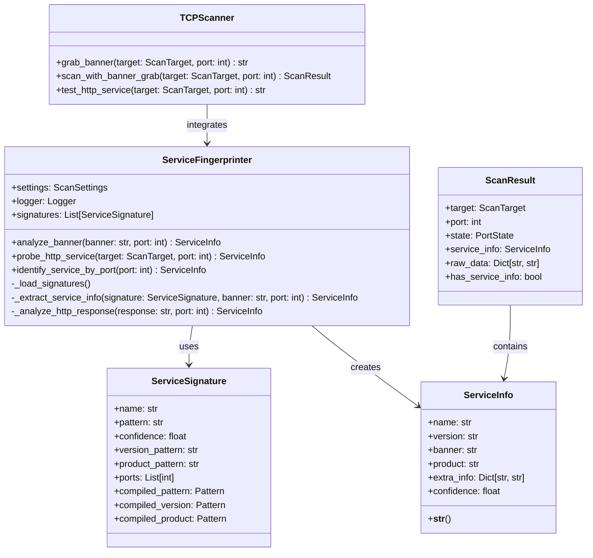
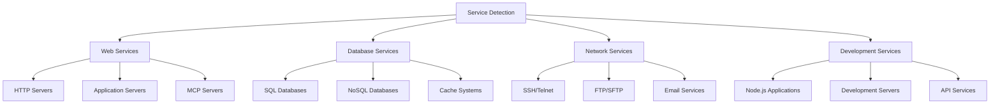

# Service Fingerprinting Engine

## Overview

The Service Fingerprinting Engine is responsible for identifying services running on open ports through banner analysis, protocol detection, and service-specific probes. It uses a signature-based matching system combined with active probing to accurately classify detected services.

### Key Components

- **ServiceFingerprinter**: Main fingerprinting engine with signature matching
- **ServiceSignature**: Individual service identification signatures
- **Banner Grabbing**: Passive service banner collection
- **HTTP Probing**: Active HTTP service analysis  
- **Port-based Identification**: Fallback identification using well-known ports

## Architecture



## Service Detection Algorithms

### 1. Signature-Based Matching

The core detection algorithm uses compiled regular expressions to match service banners against known patterns:

```python
def analyze_banner(self, banner: str, port: int) -> Optional[ServiceInfo]:
    best_match = None
    best_confidence = 0.0
    
    for signature in self.signatures:
        # Port filtering
        if signature.ports and port not in signature.ports:
            continue
        
        # Pattern matching
        match = signature.compiled_pattern.search(banner)
        if match:
            confidence = signature.confidence
            
            # Port-based confidence boost
            if signature.ports and port in signature.ports:
                confidence += 0.1
            
            if confidence > best_confidence:
                best_confidence = confidence
                best_match = signature
    
    return self._extract_service_info(best_match, banner, port)
```

### 2. Multi-Stage Detection Process

1. **Banner Collection**: Grab service banners from open ports
2. **Signature Matching**: Compare banners against signature database
3. **Active Probing**: Send protocol-specific probes for additional information
4. **Port-based Fallback**: Use well-known port assignments for identification
5. **Confidence Scoring**: Calculate confidence based on multiple factors

### 3. Confidence Calculation

| Factor | Confidence Boost | Notes |
|--------|------------------|-------|
| **Pattern Match** | Base confidence (0.7-0.98) | Signature-specific confidence |
| **Port Match** | +0.1 | Port matches expected ports |
| **Version Detection** | +0.05 | Version information extracted |
| **Product Detection** | +0.05 | Product information extracted |
| **HTTP Indicators** | +0.1 | HTTP-specific markers found |

## Signature Matching System

### Signature Structure

```python
@dataclass
class ServiceSignature:
    name: str                    # Service name (e.g., "nginx", "ssh")
    pattern: str                 # Main identification regex
    confidence: float           # Base confidence (0.0-1.0)
    version_pattern: str        # Optional version extraction regex
    product_pattern: str        # Optional product extraction regex
    ports: List[int]           # Expected ports for this service
```

### Signature Categories

#### HTTP Services
```python
ServiceSignature(
    name="nginx",
    pattern=r"nginx",
    confidence=0.95,
    version_pattern=r"nginx/(\d+\.\d+\.\d+)",
    ports=[80, 443, 8080]
)
```

#### SSH Services
```python
ServiceSignature(
    name="ssh",
    pattern=r"SSH-\d\.\d",
    confidence=0.98,
    version_pattern=r"SSH-(\d\.\d)",
    product_pattern=r"SSH-\d\.\d-([^\r\n\s]+)",
    ports=[22]
)
```

#### Database Services
```python
ServiceSignature(
    name="mysql",
    pattern=r"mysql",
    confidence=0.9,
    version_pattern=r"(\d+\.\d+\.\d+)",
    ports=[3306]
)
```

#### MCP-Specific Services
```python
ServiceSignature(
    name="mcp-server",
    pattern=r"mcp|model.context.protocol",
    confidence=0.7,
    ports=[3000, 8000, 8080, 9000]
)
```

### Signature Loading and Compilation

Signatures are loaded during initialization and compiled for performance:

```python
def _load_signatures(self):
    self.signatures = [/* ... signature definitions ... */]
    
    # Automatic compilation in ServiceSignature.__post_init__()
    for signature in self.signatures:
        signature.compiled_pattern = re.compile(signature.pattern, re.IGNORECASE | re.MULTILINE)
        if signature.version_pattern:
            signature.compiled_version = re.compile(signature.version_pattern, re.IGNORECASE)
        if signature.product_pattern:
            signature.compiled_product = re.compile(signature.product_pattern, re.IGNORECASE)
```

## Banner Grabbing Techniques

### TCP Banner Grabbing

```python
def grab_banner(self, target: ScanTarget, port: int, timeout: Optional[float] = None) -> Optional[str]:
    sock = socket.socket(socket.AF_INET, socket.SOCK_STREAM)
    sock.settimeout(timeout or self.settings.scan.timeout_seconds)
    
    try:
        # Connect to service
        result = sock.connect_ex((target.host, port))
        if result != 0:
            return None
        
        # Wait for service to send banner
        time.sleep(0.5)
        banner_data = sock.recv(1024)
        
        if banner_data:
            banner = banner_data.decode('utf-8', errors='ignore').strip()
            return banner
            
    except Exception as e:
        self.logger.debug(f"Failed to grab banner: {e}")
    finally:
        sock.close()
    
    return None
```

### Banner Collection Strategy

1. **Passive Collection**: Wait for service to send banner automatically
2. **Timeout Management**: Configurable timeout for banner collection
3. **Error Handling**: Graceful handling of connection failures
4. **Encoding Handling**: Robust text decoding with error tolerance

### Common Banner Patterns

| Service | Banner Example | Pattern |
|---------|---------------|---------|
| **SSH** | `SSH-2.0-OpenSSH_8.3` | `SSH-\d\.\d` |
| **HTTP** | `HTTP/1.1 200 OK\nServer: nginx/1.18.0` | `HTTP/\d\.\d` |
| **FTP** | `220 Welcome to FTP server` | `220.*FTP` |
| **SMTP** | `220 mail.example.com ESMTP Postfix` | `220.*SMTP` |
| **MySQL** | `5.7.32-0ubuntu0.18.04.1` | `mysql` |

## Protocol Identification

### HTTP-Specific Probing

The engine includes specialized HTTP probing for enhanced web service detection:

```python
def probe_http_service(self, target: ScanTarget, port: int) -> Optional[ServiceInfo]:
    # Send HTTP request
    http_request = (
        f"GET / HTTP/1.1\r\n"
        f"Host: {target.host}\r\n"
        f"User-Agent: HawkEye/1.0\r\n"
        f"Connection: close\r\n\r\n"
    )
    
    sock.send(http_request.encode())
    response = sock.recv(4096).decode('utf-8', errors='ignore')
    
    if response.startswith('HTTP/'):
        return self._analyze_http_response(response, port)
```

### HTTP Response Analysis

```python
def _analyze_http_response(self, response: str, port: int) -> ServiceInfo:
    service_info = ServiceInfo(name="http", confidence=0.9)
    
    # Extract HTTP version
    version_match = re.search(r'HTTP/(\d\.\d)', response)
    if version_match:
        service_info.extra_info["http_version"] = version_match.group(1)
    
    # Extract server information
    server_match = re.search(r'Server:\s*([^\r\n]+)', response, re.IGNORECASE)
    if server_match:
        server_info = server_match.group(1).strip()
        service_info.product = server_info
        
        # Specific server detection
        if 'nginx' in server_info.lower():
            service_info.name = "nginx"
            service_info.confidence = 0.95
        elif 'apache' in server_info.lower():
            service_info.name = "apache"
            service_info.confidence = 0.95
    
    # Check for MCP indicators
    if any(indicator in response.lower() for indicator in ['mcp', 'model-context-protocol']):
        service_info.extra_info["mcp_indicators"] = "true"
        service_info.confidence = min(service_info.confidence + 0.1, 1.0)
    
    return service_info
```

### HTTP Header Analysis

| Header | Detection Purpose | Example |
|--------|------------------|---------|
| **Server** | Web server identification | `nginx/1.18.0` |
| **X-Powered-By** | Application framework | `Express` |
| **X-AspNet-Version** | .NET framework version | `4.0.30319` |
| **Content-Type** | Response content analysis | `application/json` |

## Service Classification

### Classification Hierarchy



### Service Categories

#### Web Services
- **HTTP Servers**: nginx, Apache, IIS
- **Application Servers**: Express, Kestrel, Tomcat
- **MCP Servers**: Custom MCP implementations

#### Database Services  
- **SQL Databases**: MySQL, PostgreSQL, SQL Server
- **NoSQL Databases**: MongoDB, CouchDB
- **Cache Systems**: Redis, Memcached

#### Network Services
- **Remote Access**: SSH, Telnet, RDP
- **File Transfer**: FTP, SFTP, SCP
- **Email**: SMTP, POP3, IMAP

#### Development Services
- **Node.js**: Development servers, API endpoints
- **Framework Servers**: Django, Flask, Rails
- **Container Services**: Docker API, Kubernetes

## Integration with Scanning Workflow

### Scan Result Enhancement

```python
def scan_with_banner_grab(self, target: ScanTarget, port: int) -> ScanResult:
    # Basic port scan
    result = self.scan_port(target, port)
    
    # Enhanced fingerprinting for open ports
    if result.is_open:
        # Banner grabbing
        banner = self.grab_banner(target, port)
        if banner:
            fingerprinter = ServiceFingerprinter()
            service_info = fingerprinter.analyze_banner(banner, port)
            result.service_info = service_info
            result.raw_data['banner'] = banner
        
        # HTTP probing
        http_response = self.test_http_service(target, port)
        if http_response:
            result.raw_data['http_response'] = http_response[:500]
    
    return result
```

### Data Flow Integration

1. **Port Scanning**: Identify open ports
2. **Banner Collection**: Grab service banners
3. **Signature Matching**: Identify services from banners
4. **Active Probing**: Send protocol-specific probes
5. **Result Enhancement**: Populate ScanResult with service information

### Service Information Storage

```python
@dataclass
class ScanResult:
    service_info: Optional[ServiceInfo] = None
    raw_data: Dict[str, str] = field(default_factory=dict)
    
    def to_dict(self) -> Dict:
        result = {/* basic scan data */}
        
        if self.service_info:
            result['service'] = {
                'name': self.service_info.name,
                'version': self.service_info.version,
                'banner': self.service_info.banner,
                'product': self.service_info.product,
                'confidence': self.service_info.confidence,
                'extra_info': self.service_info.extra_info
            }
        
        return result
```

## Performance Characteristics

### Memory Usage

- **Signature Storage**: ~100KB for complete signature database
- **Banner Caching**: Minimal memory footprint with string truncation
- **Pattern Compilation**: One-time cost during initialization

### Network Performance

- **Banner Timeout**: Configurable timeout (default: 5 seconds)
- **Connection Overhead**: Minimal additional connections for probing
- **Bandwidth Usage**: Low bandwidth requirements for banner collection

### Processing Speed

| Operation | Performance | Notes |
|-----------|-------------|-------|
| **Pattern Matching** | ~1ms per banner | Compiled regex patterns |
| **Banner Collection** | 0.5-5 seconds | Network-dependent |
| **HTTP Probing** | 1-3 seconds | Includes request/response |
| **Signature Loading** | ~10ms | One-time startup cost |

## Error Handling and Reliability

### Connection Error Handling

```python
try:
    banner = self.grab_banner(target, port)
    if banner:
        service_info = self.analyze_banner(banner, port)
except socket.timeout:
    self.logger.debug(f"Banner grab timeout for {target.host}:{port}")
except ConnectionRefusedError:
    self.logger.debug(f"Connection refused for {target.host}:{port}")
except Exception as e:
    self.logger.debug(f"Banner grab failed: {e}")
```

### Graceful Degradation

- **Banner Failure**: Fall back to port-based identification
- **Signature Mismatch**: Return generic service info with lower confidence
- **Protocol Errors**: Continue with basic service detection

### Data Validation

- **Banner Sanitization**: Truncate and encode banners safely
- **Pattern Validation**: Validate regex patterns during loading
- **Confidence Bounds**: Ensure confidence values remain in valid range (0.0-1.0)

## Testing Strategy

### Unit Tests

```python
def test_analyze_banner_http():
    fingerprinter = ServiceFingerprinter()
    banner = "HTTP/1.1 200 OK\nServer: nginx/1.18.0"
    
    service_info = fingerprinter.analyze_banner(banner, 80)
    
    assert service_info.name == "nginx"
    assert service_info.version == "1.18.0"
    assert service_info.confidence >= 0.9

def test_signature_matching():
    signature = ServiceSignature(
        name="test-service",
        pattern=r"TEST-\d\.\d",
        confidence=0.8
    )
    
    banner = "TEST-2.0 Ready"
    match = signature.compiled_pattern.search(banner)
    
    assert match is not None
```

### Integration Tests

- **End-to-end Fingerprinting**: Full scan with service detection
- **Multi-service Detection**: Mixed environment scanning
- **Performance Testing**: Large-scale fingerprinting benchmarks

### Mock Testing

```python
@patch('socket.socket')
def test_banner_grab_success(mock_socket):
    mock_socket.return_value.recv.return_value = b"SSH-2.0-OpenSSH_8.3"
    
    scanner = TCPScanner()
    banner = scanner.grab_banner(ScanTarget("127.0.0.1"), 22)
    
    assert banner == "SSH-2.0-OpenSSH_8.3"
```

## Future Enhancements

### Planned Features

1. **Machine Learning Integration**: ML-based service classification
2. **Dynamic Signature Updates**: Automatic signature database updates
3. **Custom Probes**: User-defined protocol probes
4. **Response Analysis**: Deep packet inspection capabilities
5. **Performance Profiling**: Detailed performance metrics

### Optimization Opportunities

- **Parallel Probing**: Concurrent service probes
- **Intelligent Timeouts**: Adaptive timeout based on service type
- **Signature Optimization**: Optimize regex patterns for performance
- **Caching Strategy**: Cache service information across scans

### MCP-Specific Enhancements

1. **MCP Protocol Detection**: Native MCP protocol identification
2. **Capability Enumeration**: Extract MCP server capabilities from responses
3. **Transport Detection**: Identify MCP transport mechanisms (HTTP, SSE, stdio)
4. **Version Detection**: MCP protocol version identification

## Configuration Options

### Fingerprinting Settings

```python
class ScanSettings:
    timeout_seconds: int = 5           # Banner grab timeout
    max_banner_size: int = 1024       # Maximum banner size
    enable_http_probing: bool = True  # Enable HTTP-specific probing
    enable_service_detection: bool = True  # Enable service fingerprinting
```

### Environment Variables

```bash
export HAWKEYE_SCAN_TIMEOUT_SECONDS=10
export HAWKEYE_SCAN_ENABLE_HTTP_PROBING=true
```

## Usage Examples

### Basic Service Detection

```python
from hawkeye.scanner import ServiceFingerprinter, TCPScanner

# Initialize fingerprinter
fingerprinter = ServiceFingerprinter()

# Analyze banner
banner = "SSH-2.0-OpenSSH_8.3"
service_info = fingerprinter.analyze_banner(banner, 22)
print(f"Service: {service_info}")

# Integrated scanning with fingerprinting
scanner = TCPScanner()
result = scanner.scan_with_banner_grab(target, 80)
if result.has_service_info:
    print(f"Detected: {result.service_info}")
```

### Custom Signature Addition

```python
# Add custom signature
custom_signature = ServiceSignature(
    name="custom-mcp",
    pattern=r"CustomMCP/\d\.\d",
    confidence=0.85,
    version_pattern=r"CustomMCP/(\d\.\d)",
    ports=[9000]
)

fingerprinter.signatures.append(custom_signature)
```

### HTTP Service Analysis

```python
# Probe HTTP service
service_info = fingerprinter.probe_http_service(target, 8080)
if service_info:
    print(f"HTTP Service: {service_info.name}")
    print(f"Server: {service_info.product}")
    print(f"Confidence: {service_info.confidence}")
``` 