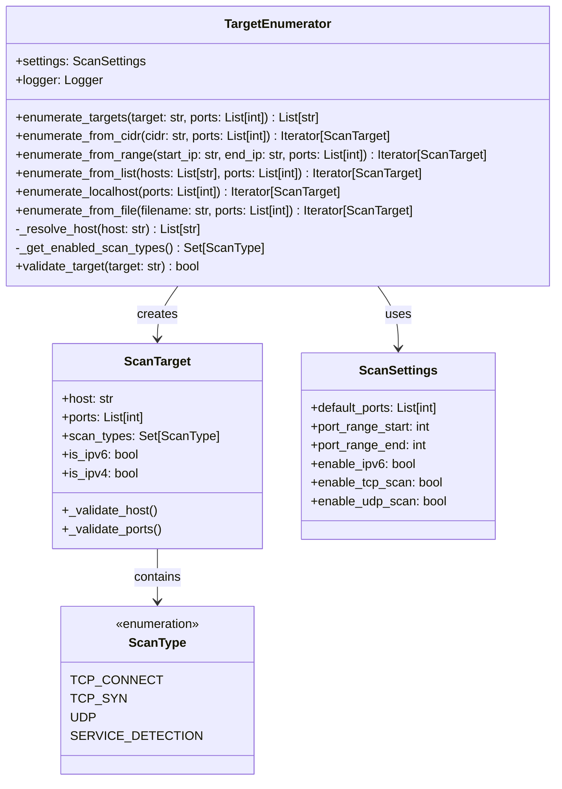

# Target Enumeration System

## Overview

The Target Enumeration System is responsible for expanding various target specifications into individual scannable targets. It supports multiple input formats including single hosts, CIDR networks, IP ranges, hostname resolution, and file-based target lists.

### Key Components

- **TargetEnumerator**: Main class handling target parsing and enumeration
- **ScanTarget**: Data structure representing individual scan targets
- **DNS Resolution**: Hostname-to-IP resolution with IPv4/IPv6 support
- **Validation**: Input validation and error handling

## Architecture



## Target Formats Supported

### 1. Single IP Address
```
192.168.1.100
2001:db8::1
```

### 2. CIDR Notation
```
192.168.1.0/24
10.0.0.0/8
2001:db8::/32
```

### 3. IP Address Ranges
```python
start_ip = "192.168.1.1"
end_ip = "192.168.1.50"
```

### 4. Hostname Resolution
```
example.com
localhost
mail.example.org
```

### 5. File-Based Target Lists
```
# targets.txt
192.168.1.0/24
example.com
10.0.0.1-10.0.0.10
# Comments and empty lines are ignored
```

## CIDR Expansion Algorithm

### Implementation Details

The CIDR expansion follows this process:

1. **Parse Network**: Use `ipaddress.ip_network()` with `strict=False`
2. **Generate Hosts**: Iterate through `network.hosts()` excluding network/broadcast
3. **Create Targets**: Generate `ScanTarget` objects for each host
4. **Apply Settings**: Include configured ports and scan types

```python
def enumerate_from_cidr(self, cidr: str, ports: List[int] = None) -> Iterator[ScanTarget]:
    network = ipaddress.ip_network(cidr, strict=False)
    scan_types = self._get_enabled_scan_types()
    
    for ip in network.hosts():
        yield ScanTarget(
            host=str(ip),
            ports=ports.copy(),
            scan_types=scan_types
        )
```

### CIDR Examples

| CIDR | Network Size | Host Count | Description |
|------|-------------|------------|-------------|
| `192.168.1.0/24` | 256 addresses | 254 hosts | Class C network |
| `10.0.0.0/16` | 65,536 addresses | 65,534 hosts | Class B network |
| `172.16.0.0/12` | 1,048,576 addresses | 1,048,574 hosts | Private range |
| `2001:db8::/32` | 2^96 addresses | 2^96 - 2 hosts | IPv6 network |

### Performance Considerations

- **Memory Efficiency**: Uses generators to avoid loading all targets into memory
- **Lazy Evaluation**: Targets generated on-demand during enumeration
- **Network Size Limits**: Consider memory and time constraints for large networks

## IP Range Processing

### Range Format Support

- **Dash-separated**: `192.168.1.1-192.168.1.50`
- **Same IP family**: IPv4-to-IPv4 or IPv6-to-IPv6 only
- **Ordered ranges**: Start IP must be ≤ End IP

### Algorithm Implementation

```python
def enumerate_from_range(self, start_ip: str, end_ip: str, ports: List[int] = None):
    start_addr = ipaddress.ip_address(start_ip)
    end_addr = ipaddress.ip_address(end_ip)
    
    # Validation
    if type(start_addr) != type(end_addr):
        raise ValueError("IP addresses must be same type")
    if start_addr > end_addr:
        raise ValueError("Start IP must be ≤ End IP")
    
    # Enumerate range
    current = start_addr
    while current <= end_addr:
        yield ScanTarget(host=str(current), ports=ports, scan_types=scan_types)
        current += 1
```

### Range Examples

| Range | Count | Notes |
|-------|-------|-------|
| `192.168.1.1-192.168.1.10` | 10 hosts | Small range |
| `10.0.0.1-10.0.1.255` | 511 hosts | Cross-subnet range |
| `2001:db8::1-2001:db8::100` | 256 hosts | IPv6 range |

## DNS Handling and Hostname Resolution

### Resolution Process

1. **IP Detection**: Check if input is already an IP address
2. **DNS Lookup**: Use `socket.getaddrinfo()` for resolution
3. **IPv6 Filtering**: Apply IPv6 settings to filter results
4. **Deduplication**: Remove duplicate IP addresses

### Implementation

```python
def _resolve_host(self, host: str) -> List[str]:
    # Check if already IP address
    try:
        ipaddress.ip_address(host)
        return [host]
    except ValueError:
        pass
    
    # DNS resolution
    addr_info = socket.getaddrinfo(host, None, socket.AF_UNSPEC, socket.SOCK_STREAM)
    ips = list(set(info[4][0] for info in addr_info))
    
    # IPv6 filtering
    if not self.settings.scan.enable_ipv6:
        ips = [ip for ip in ips if ':' not in ip]
    
    return ips
```

### DNS Features

- **Multi-record Support**: Handles A and AAAA records
- **IPv4/IPv6 Dual-stack**: Configurable IPv6 support
- **Error Handling**: Graceful handling of resolution failures
- **Logging**: Detailed resolution logging for debugging

### Resolution Examples

| Hostname | IPv4 Results | IPv6 Results | Notes |
|----------|-------------|-------------|--------|
| `localhost` | `127.0.0.1` | `::1` | Local resolution |
| `google.com` | Multiple IPs | Multiple IPs | Load-balanced |
| `invalid.local` | Error | Error | Resolution failure |

## IPv4/IPv6 Support

### Configuration Options

```python
class ScanSettings:
    enable_ipv6: bool = Field(default=False, description="Enable IPv6 support")
```

### IPv6 Handling

- **Disabled by Default**: IPv6 support is opt-in
- **Resolution Filtering**: IPv6 addresses filtered during DNS resolution
- **Validation**: Proper IPv6 address validation
- **Target Detection**: Automatic IPv4/IPv6 target classification

### IPv6 Examples

```python
# IPv6 CIDR
targets = enumerator.enumerate_from_cidr("2001:db8::/127")

# IPv6 Range
targets = enumerator.enumerate_from_range("2001:db8::1", "2001:db8::10")

# IPv6 Localhost
targets = enumerator.enumerate_localhost()  # Includes ::1 if IPv6 enabled
```

## Validation Logic

### Target Validation

The `validate_target()` method supports:

1. **CIDR Validation**: Uses `ipaddress.ip_network()`
2. **Range Validation**: Validates start/end IP addresses
3. **Host Validation**: Attempts DNS resolution

```python
def validate_target(self, target: str) -> bool:
    try:
        if '/' in target:
            ipaddress.ip_network(target, strict=False)
        elif '-' in target:
            start_ip, end_ip = target.split('-', 1)
            ipaddress.ip_address(start_ip.strip())
            ipaddress.ip_address(end_ip.strip())
        else:
            self._resolve_host(target)
        return True
    except Exception:
        return False
```

### ScanTarget Validation

Performed during object initialization:

- **Host Validation**: IPv4/IPv6 address or hostname format
- **Port Validation**: Range 1-65535
- **Type Safety**: Ensures proper data types

## Configuration Options

### Scan Settings

| Setting | Default | Description |
|---------|---------|-------------|
| `default_ports` | [3000-3010, 4000, 5000, 8000, 8080, 9000-9002] | Default ports for MCP scanning |
| `port_range_start` | 1 | Minimum port number |
| `port_range_end` | 65535 | Maximum port number |
| `enable_ipv6` | False | Enable IPv6 address support |
| `enable_tcp_scan` | True | Enable TCP port scanning |
| `enable_udp_scan` | False | Enable UDP port scanning |

### Environment Variables

Settings can be overridden using environment variables with `HAWKEYE_SCAN_` prefix:

```bash
export HAWKEYE_SCAN_ENABLE_IPV6=true
export HAWKEYE_SCAN_DEFAULT_PORTS="[80,443,8080]"
```

## Usage Examples

### Basic Target Enumeration

```python
from hawkeye.scanner.target_enum import TargetEnumerator

enumerator = TargetEnumerator()

# Single IP
targets = enumerator.enumerate_targets("192.168.1.100")

# CIDR network
targets = enumerator.enumerate_targets("192.168.1.0/24")

# Hostname
targets = enumerator.enumerate_targets("example.com")
```

### Advanced Enumeration

```python
# Custom ports
custom_ports = [80, 443, 8080]
targets = enumerator.enumerate_targets("192.168.1.0/24", custom_ports)

# IP range
targets = list(enumerator.enumerate_from_range("10.0.0.1", "10.0.0.50"))

# File-based targets
targets = list(enumerator.enumerate_from_file("targets.txt"))

# Localhost enumeration
localhost_targets = list(enumerator.enumerate_localhost())
```

### Error Handling

```python
try:
    targets = enumerator.enumerate_targets("invalid.target.format!")
except ValueError as e:
    print(f"Invalid target: {e}")

# Validation before enumeration
if enumerator.validate_target("192.168.1.0/24"):
    targets = enumerator.enumerate_targets("192.168.1.0/24")
```

## Performance Characteristics

### Memory Usage

- **Generator-based**: Uses iterators to minimize memory footprint
- **Lazy Loading**: Targets created on-demand
- **Scalable**: Handles large networks efficiently

### Network Performance

- **DNS Caching**: System-level DNS caching utilized
- **Parallel Resolution**: Multiple hostnames resolved concurrently
- **Timeout Handling**: Configurable DNS timeouts

### Scalability Metrics

| Network Size | Memory Usage | Enumeration Time |
|-------------|-------------|------------------|
| /24 (254 hosts) | ~50KB | <1 second |
| /16 (65K hosts) | ~10MB | ~5 seconds |
| /8 (16M hosts) | ~3GB | ~5 minutes |

## Error Handling

### Common Errors

1. **Invalid CIDR**: Malformed CIDR notation
2. **DNS Resolution Failure**: Unresolvable hostnames
3. **Invalid IP Range**: Mismatched IP versions or invalid order
4. **File Not Found**: Missing target files

### Error Recovery

- **Graceful Degradation**: Continue processing valid targets
- **Detailed Logging**: Comprehensive error reporting
- **User Feedback**: Clear error messages for troubleshooting

## Testing Strategy

### Unit Tests

- **Format Detection**: Test all supported input formats
- **Validation Logic**: Verify target validation accuracy
- **DNS Resolution**: Mock DNS responses for testing
- **IPv6 Support**: Test IPv6 functionality when enabled

### Integration Tests

- **End-to-end**: Full enumeration workflows
- **Performance**: Large network enumeration
- **Error Scenarios**: Network failure simulation

## Future Enhancements

### Planned Features

1. **Async Resolution**: Asynchronous DNS resolution
2. **Custom Resolvers**: Alternative DNS resolver support
3. **Target Prioritization**: Smart target ordering
4. **Geographic Filtering**: Location-based target filtering
5. **Rate Limiting**: Built-in DNS query rate limiting

### Optimization Opportunities

- **Parallel Processing**: Multi-threaded enumeration
- **Caching Strategies**: Target-level caching
- **Memory Optimization**: Further memory usage reduction 