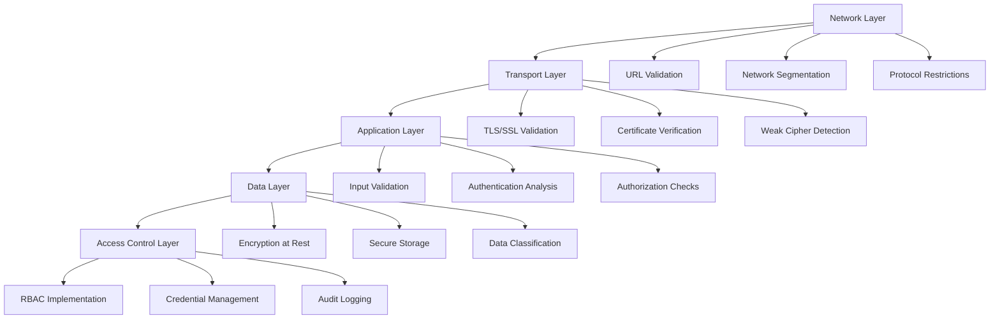
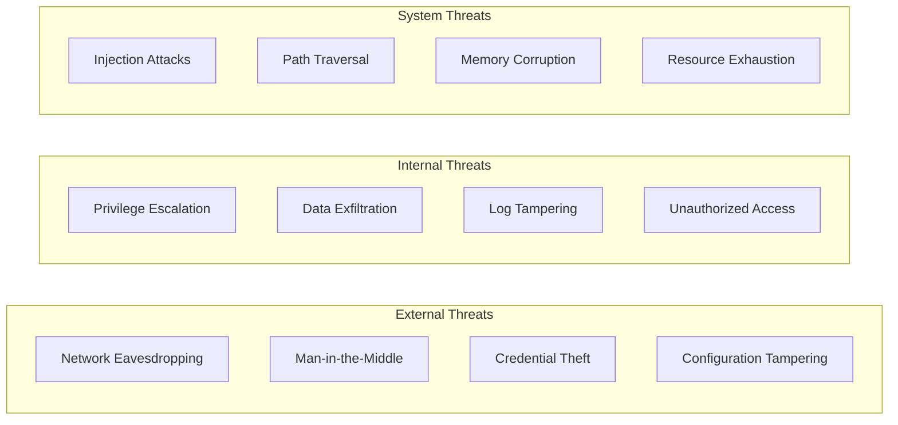
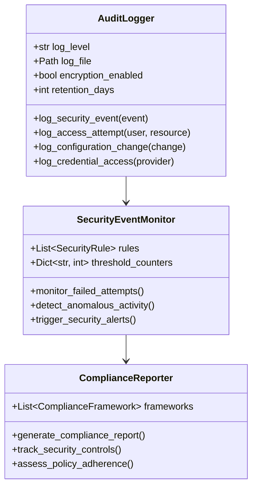

# Security Architecture and Design Principles

## 🛡️ Executive Summary

HawkEye implements a comprehensive security-by-design architecture that protects both the tool itself and the systems it analyzes. This document outlines the security principles, threat model, and defensive measures implemented throughout the application.

## Security Design Principles

### 1. Defense in Depth

**Layered Security Approach**:


### 2. Least Privilege Access

**Implementation Strategy**:
- **Read-Only Operations**: Default to read-only access where possible
- **Minimal Permissions**: Request only required system permissions
- **Temporary Credentials**: Use short-lived tokens and sessions
- **Scope Limitation**: Restrict access to authorized network ranges

```python
# Example: Scope validation implementation
def validate_scope(target: str, authorization: Dict[str, Any]) -> bool:
    """Validate target is within authorized scope."""
    
    authorized_ranges = authorization.get('authorized_ranges', [])
    excluded_ranges = authorization.get('excluded_ranges', [])
    
    # Check if target is in authorized ranges
    target_ip = ipaddress.ip_address(target)
    
    for range_str in authorized_ranges:
        if target_ip in ipaddress.ip_network(range_str):
            # Check if explicitly excluded
            for excluded in excluded_ranges:
                if target_ip in ipaddress.ip_network(excluded):
                    return False
            return True
    
    return False
```

### 3. Secure by Default

**Default Security Configurations**:
- **HTTPS Preferred**: Warn on HTTP connections, prefer HTTPS
- **Certificate Validation**: Enable SSL/TLS verification by default
- **Strong Encryption**: Use modern encryption algorithms (AES-256, TLS 1.2+)
- **Audit Logging**: Enable comprehensive logging by default

## Threat Model Analysis

### 1. HawkEye Tool Threats

**Attack Surface Analysis**:



### 2. Mitigation Strategies

**Network-Level Mitigations**:

| Threat | Mitigation | Implementation |
|--------|------------|----------------|
| Network Eavesdropping | Transport Encryption | TLS 1.2+ enforcement |
| Man-in-the-Middle | Certificate Pinning | SSL certificate validation |
| DNS Poisoning | Domain Validation | Hostname verification |
| Port Scanning Detection | Rate Limiting | Configurable request throttling |

**Application-Level Mitigations**:

| Threat | Mitigation | Implementation |
|--------|------------|----------------|
| Injection Attacks | Input Validation | URL and parameter sanitization |
| Path Traversal | Path Restriction | File system access controls |
| Credential Exposure | Secure Storage | Encrypted credential backends |
| Privilege Escalation | Access Controls | Role-based permissions |

### 3. Security Controls Implementation

**Transport Security Controls**:
```python
class TransportSecurityAssessor(RiskAssessor):
    """Implements comprehensive transport security analysis."""
    
    def _analyze_tls_configuration(self, host: str, port: int) -> Dict[str, Any]:
        """Analyze TLS configuration with security best practices."""
        
        config = {
            'weak_protocols': [],    # SSLv2, SSLv3, TLSv1.0, TLSv1.1
            'weak_ciphers': [],      # RC4, DES, MD5, NULL ciphers
            'certificate_valid': True,
            'certificate_info': {}
        }
        
        # Implementation includes:
        # - Protocol version validation
        # - Cipher suite strength analysis
        # - Certificate chain verification
        # - Certificate expiration checking
        
        return config
```

**Authentication Security Controls**:
```python
class AuthenticationAnalyzer(RiskAssessor):
    """Implements authentication security pattern detection."""
    
    def _init_authentication_rules(self) -> None:
        """Initialize comprehensive authentication security rules."""
        
        self.auth_rules = {
            'hardcoded_credentials': {
                'patterns': [
                    r'"username"\s*:\s*"admin".*"password"\s*:\s*"[^"]+"',
                    r'Basic\s+[A-Za-z0-9+/=]+',  # Base64 encoded credentials
                    r'Bearer\s+[A-Za-z0-9\-._~+/]+'  # Bearer tokens
                ],
                'severity': RiskLevel.HIGH
            },
            'weak_tokens': {
                'patterns': [
                    r'"api[_-]?key"\s*:\s*"(test|demo|example|sample|key)"',
                    r'"token"\s*:\s*"[^"]{1,16}"',  # Short tokens
                    r'"secret"\s*:\s*"(secret|key|token|password)"'
                ],
                'severity': RiskLevel.HIGH
            }
        }
```

## Security Architecture Components

### 1. Input Validation Framework

**URL Validation Implementation**:
```python
def _validate_url(self, url: str) -> bool:
    """Comprehensive URL validation with security checks."""
    
    try:
        parsed = urlparse(url)
        
        # Protocol security checks
        if parsed.scheme not in ('http', 'https'):
            self.logger.warning(f"Invalid URL scheme: {parsed.scheme}")
            return False
        
        # Hostname validation
        if not parsed.hostname:
            self.logger.warning("URL missing hostname")
            return False
        
        # Security preference for HTTPS
        if parsed.scheme == 'http':
            self.logger.warning(f"Using insecure HTTP connection: {url}")
        
        # Network range validation
        if self._is_private_network(parsed.hostname):
            return True
        else:
            self.logger.info(f"Connecting to external host: {parsed.hostname}")
            return self._validate_external_host(parsed.hostname)
            
    except Exception as e:
        self.logger.error(f"Error validating URL: {e}")
        return False
```

### 2. Secure Configuration Management

**Environment Variable Security**:
```python
def _assess_environment_security(self, env_vars: Dict[str, str]) -> List[SecurityFinding]:
    """Assess environment variables for security risks."""
    
    risks = []
    sensitive_patterns = ['secret', 'password', 'key', 'token', 'cert']
    
    for key, value in env_vars.items():
        key_lower = key.lower()
        
        # Check for exposed secrets
        if any(pattern in key_lower for pattern in sensitive_patterns):
            if value and len(value) > 0:
                risks.append(SecurityFinding(
                    id=f"exposed_secret_{key}",
                    title="Potentially Exposed Secret",
                    description=f"Sensitive information in environment variable: {key}",
                    severity=RiskLevel.HIGH,
                    category=VulnerabilityCategory.CONFIGURATION,
                    remediation="Use secure credential storage instead of environment variables"
                ))
        
        # Check for insecure protocols
        if 'http://' in value.lower() and 'https://' not in value.lower():
            risks.append(SecurityFinding(
                id=f"insecure_transport_{key}",
                title="Insecure Transport Protocol",
                description=f"HTTP protocol detected in {key}",
                severity=RiskLevel.MEDIUM,
                remediation="Use HTTPS instead of HTTP for secure communication"
            ))
    
    return risks
```

### 3. Audit and Monitoring Framework

**Comprehensive Logging Architecture**:


## Compliance Framework Integration

### 1. Security Standards Compliance

**NIST Cybersecurity Framework Mapping**:

| NIST Function | HawkEye Implementation | Security Controls |
|---------------|------------------------|-------------------|
| **Identify** | Asset Discovery | MCP server enumeration, service fingerprinting |
| **Protect** | Access Controls | Authentication analysis, credential management |
| **Detect** | Threat Detection | Vulnerability scanning, anomaly detection |
| **Respond** | Incident Response | Security finding prioritization, remediation guidance |
| **Recover** | Recovery Planning | Backup validation, system restoration guidance |

**PCI DSS Compliance Controls**:
- **Strong Cryptography**: TLS 1.2+ enforcement, strong cipher suites
- **Access Control**: Role-based access, least privilege principles
- **Audit Logging**: Comprehensive activity tracking
- **Vulnerability Management**: Regular security assessments

### 2. Regulatory Compliance Features

**GDPR Data Protection**:
- **Data Minimization**: Collect only necessary information
- **Encryption**: Encrypt sensitive data at rest and in transit
- **Access Controls**: Implement role-based data access
- **Audit Trails**: Maintain detailed access logs

**SOX Compliance**:
- **Change Management**: Track configuration changes
- **Access Monitoring**: Monitor privileged access
- **Data Integrity**: Implement data validation controls
- **Audit Evidence**: Generate compliance reports

## Security Testing and Validation

### 1. Automated Security Testing

**Security Test Categories**:
```python
# Security test implementation examples
class SecurityTestSuite:
    """Comprehensive security testing framework."""
    
    def test_input_validation(self):
        """Test input validation against injection attacks."""
        malicious_inputs = [
            "../../../etc/passwd",  # Path traversal
            "<script>alert('xss')</script>",  # XSS
            "'; DROP TABLE users; --",  # SQL injection
            "$(cat /etc/passwd)",  # Command injection
        ]
        
        for input_data in malicious_inputs:
            result = self.validate_input(input_data)
            assert result is False, f"Failed to reject malicious input: {input_data}"
    
    def test_transport_security(self):
        """Test transport layer security implementation."""
        # Test TLS version enforcement
        # Test certificate validation
        # Test cipher suite strength
        
    def test_credential_protection(self):
        """Test credential storage and handling."""
        # Test encryption at rest
        # Test secure transmission
        # Test access controls
```

### 2. Penetration Testing Considerations

**Internal Security Assessment**:
- **Code Review**: Static analysis for security vulnerabilities
- **Dependency Scanning**: Third-party library vulnerability assessment
- **Configuration Review**: Security configuration validation
- **Privilege Testing**: Access control effectiveness validation

## Risk Assessment and Management

### 1. Security Risk Categories

**Critical Risks**:
- Credential exposure in configuration files
- Weak authentication mechanisms
- Insecure transport protocols
- Insufficient access controls

**High Risks**:
- Weak encryption algorithms
- Missing security headers
- Inadequate input validation
- Insecure default configurations

**Medium Risks**:
- Information disclosure
- Session management issues
- Insufficient logging
- Missing security updates

### 2. Risk Mitigation Timeline

**Immediate Actions** (0-30 days):
- Enable TLS/SSL verification by default
- Implement secure credential storage
- Enable comprehensive audit logging
- Configure strong authentication

**Short-term Actions** (1-3 months):
- Deploy intrusion detection
- Implement automated security testing
- Establish incident response procedures
- Complete security training

**Long-term Actions** (3-12 months):
- Achieve compliance certification
- Implement zero-trust architecture
- Deploy advanced threat detection
- Establish security metrics program

## Incident Response and Recovery

### 1. Security Incident Categories

**Data Breach Incidents**:
- Unauthorized access to scan results
- Credential theft or exposure
- Configuration data exfiltration

**System Compromise Incidents**:
- Malware infection of analysis system
- Unauthorized system access
- Service disruption attacks

**Compliance Incidents**:
- Unauthorized scanning activities
- Policy violation incidents
- Regulatory compliance failures

### 2. Response Procedures

**Incident Detection**:
```python
class SecurityIncidentDetector:
    """Automated security incident detection."""
    
    def detect_anomalous_activity(self, activity_log: List[Dict]) -> List[SecurityIncident]:
        """Detect potential security incidents from activity logs."""
        
        incidents = []
        
        # Failed authentication attempts
        failed_attempts = self._count_failed_authentications(activity_log)
        if failed_attempts > self.config.max_failed_attempts:
            incidents.append(SecurityIncident(
                type=IncidentType.AUTHENTICATION_FAILURE,
                severity=IncidentSeverity.HIGH,
                description=f"Excessive failed authentication attempts: {failed_attempts}"
            ))
        
        # Suspicious network activity
        external_connections = self._analyze_network_connections(activity_log)
        for connection in external_connections:
            if self._is_suspicious_connection(connection):
                incidents.append(SecurityIncident(
                    type=IncidentType.SUSPICIOUS_NETWORK_ACTIVITY,
                    severity=IncidentSeverity.MEDIUM,
                    description=f"Suspicious external connection: {connection['host']}"
                ))
        
        return incidents
```

## Future Security Enhancements

### 1. Advanced Security Features

**Zero Trust Architecture**:
- Implement continuous authentication
- Deploy micro-segmentation
- Enable real-time access validation
- Implement behavior-based anomaly detection

**Machine Learning Security**:
- Automated threat pattern recognition
- Predictive vulnerability analysis
- Behavioral anomaly detection
- Intelligent risk scoring

### 2. Security Automation

**DevSecOps Integration**:
- Automated security testing in CI/CD
- Continuous compliance monitoring
- Automated vulnerability remediation
- Security metrics dashboards

## Conclusion

HawkEye's security architecture implements comprehensive defense-in-depth strategies, secure-by-design principles, and industry-standard security controls. The multi-layered approach ensures protection of both the tool and the systems it analyzes, while maintaining compliance with major security frameworks and regulatory requirements.

Regular security assessments, continuous monitoring, and proactive threat management ensure that HawkEye remains resilient against evolving security threats while providing reliable and secure reconnaissance capabilities for security professionals. 