# End-to-End Workflow Sequence Diagram

## Overview

This document provides a comprehensive sequence diagram for the complete HawkEye workflow, documenting the full `scan → detect → analyze-threats → report` pipeline with data transformation points, format conversions, error handling, and recovery mechanisms.

## Complete Workflow Sequence Diagram

The following Mermaid sequence diagram illustrates the end-to-end security assessment workflow:

```mermaid
sequenceDiagram
    participant User as User
    participant CLI as CLI Interface
    participant TE as TargetEnumerator
    participant Scanner as Network Scanner
    participant Pipeline as Detection Pipeline
    participant ProcessEnum as ProcessEnumerator
    participant ConfigDisc as ConfigDiscovery  
    participant ProtocolVer as ProtocolVerifier
    participant TransportDet as TransportDetector
    participant NPXDet as NPXDetector
    participant DockerInsp as DockerInspector
    participant EnvAnalyzer as EnvironmentAnalyzer
    participant MCPIntro as MCPIntrospector
    participant AIAnalyzer as AI Threat Analyzer
    participant ReportGen as Report Generator
    participant JSONReporter as JSON Reporter
    participant HTMLReporter as HTML Reporter
    participant FileSystem as File System
    participant ErrorHandler as Error Handler

    %% Phase 1: Network Scanning
    Note over User, FileSystem: Phase 1: Network Discovery & Port Scanning
    
    User->>CLI: hawkeye scan -t 192.168.1.100 -o scan.json
    CLI->>CLI: Parse and validate scan parameters
    CLI->>CLI: Initialize scan settings and logger
    
    alt CIDR Range Detection
        CLI->>TE: Check if target contains CIDR notation
        TE->>TE: enumerate_targets(192.168.1.0/24)
        TE-->>CLI: List of individual IP addresses
    else Single Target
        CLI->>CLI: Use target as single IP/hostname
    end
    
    CLI->>Scanner: scan_targets(target_list, ports, settings)
    Scanner->>Scanner: Create connection pool
    Scanner->>Scanner: Initialize TCP/UDP scanners
    
    loop For each target and port
        Scanner->>Scanner: Perform port scan (TCP/UDP)
        Scanner->>Scanner: Service fingerprinting
        Scanner->>Scanner: Banner grabbing
    end
    
    Scanner-->>CLI: ScanResult[] with open ports and services
    
    %% Error Handling for Scan Phase
    alt Scan Errors Detected
        Scanner->>ErrorHandler: Log scan failures
        ErrorHandler->>ErrorHandler: Create partial results
        ErrorHandler-->>CLI: Partial scan results with error info
    end
    
    CLI->>JSONReporter: serialize_scan_results(results)
    JSONReporter->>JSONReporter: Convert ScanResult objects to JSON
    JSONReporter->>FileSystem: Write scan.json
    FileSystem-->>User: scan.json created
    
    %% Phase 2: MCP Detection and Introspection
    Note over User, FileSystem: Phase 2: MCP Detection & Deep Introspection
    
    User->>CLI: hawkeye detect comprehensive -t 192.168.1.100 -o detect.json
    CLI->>CLI: Parse detection parameters
    CLI->>CLI: Create PipelineConfig with settings
    CLI->>CLI: Initialize Detection Pipeline
    
    CLI->>Pipeline: create_detection_pipeline(config, settings)
    Pipeline->>Pipeline: Initialize all detector components
    Pipeline->>Pipeline: Initialize MCP introspection system
    
    alt Load Previous Scan Results (Optional)
        CLI->>FileSystem: load_scan_results(scan.json)
        FileSystem-->>CLI: Previous scan data for context
    end
    
    CLI->>Pipeline: execute_pipeline(target_host)
    
    %% Traditional Detection Methods
    par Traditional Detection Methods
        Pipeline->>ProcessEnum: enumerate_mcp_processes()
        ProcessEnum->>ProcessEnum: Scan running processes
        ProcessEnum->>ProcessEnum: Analyze command lines and env vars
        ProcessEnum-->>Pipeline: ProcessInfo[] with MCP processes
    and
        Pipeline->>ConfigDisc: discover_config_files(target)
        ConfigDisc->>ConfigDisc: Search for package.json, .mcprc files
        ConfigDisc->>ConfigDisc: Parse configuration files
        ConfigDisc-->>Pipeline: ConfigInfo[] with MCP configs
    and
        Pipeline->>ProtocolVer: verify_mcp_protocol(target, port)
        ProtocolVer->>ProtocolVer: Attempt MCP handshake
        ProtocolVer->>ProtocolVer: Validate protocol responses
        ProtocolVer-->>Pipeline: HandshakeResult with protocol info
    and
        Pipeline->>TransportDet: detect_transport_layer(target, port)
        TransportDet->>TransportDet: Test HTTP, SSE, stdio transports
        TransportDet-->>Pipeline: TransportInfo with detected layers
    and
        Pipeline->>NPXDet: detect_npx_packages(target)
        NPXDet->>NPXDet: Analyze package.json for MCP packages
        NPXDet-->>Pipeline: NPXInfo[] with package details
    and
        Pipeline->>DockerInsp: inspect_containers(target)
        DockerInsp->>DockerInsp: Enumerate Docker containers
        DockerInsp->>DockerInsp: Analyze container configurations
        DockerInsp-->>Pipeline: ContainerInfo[] with MCP containers
    and
        Pipeline->>EnvAnalyzer: analyze_environment(target)
        EnvAnalyzer->>EnvAnalyzer: Scan environment variables
        EnvAnalyzer->>EnvAnalyzer: Detect MCP-related settings
        EnvAnalyzer-->>Pipeline: EnvironmentInfo with MCP context
    end
    
    %% Enhanced MCP Introspection
    Pipeline->>MCPIntro: execute_enhanced_introspection(detected_servers)
    
    loop For each detected MCP server
        MCPIntro->>MCPIntro: Create transport client (HTTP/SSE/stdio)
        MCPIntro->>MCPIntro: Establish connection with retry logic
        
        alt Successful Connection
            MCPIntro->>MCPIntro: Perform introspection handshake
            MCPIntro->>MCPIntro: Discover available tools
            MCPIntro->>MCPIntro: Discover available resources  
            MCPIntro->>MCPIntro: Analyze tool capabilities
            MCPIntro->>MCPIntro: Assess security risks
            MCPIntro->>MCPIntro: Generate capability summary
        else Connection Failed
            MCPIntro->>ErrorHandler: Log connection failure
            ErrorHandler->>ErrorHandler: Record partial server info
        end
    end
    
    MCPIntro-->>Pipeline: IntrospectionResults with full server details
    
    %% Pipeline Result Aggregation
    Pipeline->>Pipeline: aggregate_all_detection_results()
    Pipeline->>Pipeline: select_best_mcp_server()
    Pipeline->>Pipeline: calculate_confidence_scores()
    Pipeline->>Pipeline: perform_risk_assessment()
    
    alt Pipeline Errors Occurred
        Pipeline->>ErrorHandler: Handle detection failures
        ErrorHandler->>ErrorHandler: Create error summary
        ErrorHandler->>ErrorHandler: Generate warning messages
    end
    
    Pipeline-->>CLI: PipelineResult with comprehensive findings
    
    %% Detection Result Serialization
    CLI->>JSONReporter: serialize_detection_results(pipeline_result)
    JSONReporter->>JSONReporter: Convert PipelineResult to JSON
    JSONReporter->>JSONReporter: Enhance with metadata
    JSONReporter->>JSONReporter: Apply JSON transformations
    JSONReporter->>FileSystem: Write detect.json
    FileSystem-->>User: detect.json created
    
    %% Phase 3: AI Threat Analysis
    Note over User, FileSystem: Phase 3: AI-Powered Threat Analysis
    
    User->>CLI: hawkeye analyze-threats -i detect.json -o threats.json
    CLI->>CLI: Parse threat analysis parameters
    CLI->>CLI: Validate input file existence
    CLI->>FileSystem: Load detection results JSON
    FileSystem-->>CLI: Raw JSON detection data
    
    %% JSON Structure Detection and Conversion
    CLI->>CLI: Detect JSON structure (detection_results vs list vs results)
    
    alt Multiple JSON Formats Support
        Note over CLI: Handles different JSON structures:<br/>- detection_results key<br/>- direct list format<br/>- results key format
        CLI->>CLI: Extract detection_results from JSON
    else Invalid JSON Format
        CLI->>ErrorHandler: Raise ClickException for invalid format
        ErrorHandler-->>User: Error: Invalid JSON format
    end
    
    %% Detection Result Object Conversion
    loop For each detection result
        CLI->>CLI: Convert dict to DetectionResult object
        CLI->>CLI: Map detection_method strings to enums
        CLI->>CLI: Extract MCP server data from JSON
        CLI->>CLI: Create MCPServerInfo objects
        
        alt Conversion Errors
            CLI->>ErrorHandler: Log conversion warnings
            ErrorHandler->>ErrorHandler: Continue with other results
        end
    end
    
    CLI->>CLI: Filter servers by confidence threshold
    CLI->>CLI: Create EnvironmentContext from detection data
    CLI->>AIAnalyzer: Initialize AI threat analyzer
    
    %% AI Analysis Execution
    alt Parallel Processing Enabled
        CLI->>AIAnalyzer: analyze_threats_parallel(mcp_servers, env_context)
        
        par Parallel Analysis
            loop For each MCP server (parallel)
                AIAnalyzer->>AIAnalyzer: Analyze individual server threats
                AIAnalyzer->>AIAnalyzer: Generate attack vectors
                AIAnalyzer->>AIAnalyzer: Calculate risk scores
                AIAnalyzer->>AIAnalyzer: Create mitigation strategies
            end
        end
        
        AIAnalyzer-->>CLI: ThreatAnalysis[] with parallel results
    else Sequential Processing
        loop For each MCP server
            CLI->>AIAnalyzer: analyze_threats(mcp_server, env_context)
            
            alt Analysis Success
                AIAnalyzer->>AIAnalyzer: Perform comprehensive threat modeling
                AIAnalyzer->>AIAnalyzer: Generate threat scenarios
                AIAnalyzer->>AIAnalyzer: Calculate business impact
                AIAnalyzer-->>CLI: ThreatAnalysis for server
            else Analysis Failed
                AIAnalyzer->>ErrorHandler: Log analysis failure
                ErrorHandler->>ErrorHandler: Record error details
                ErrorHandler-->>CLI: Error information
            end
        end
    end
    
    %% Threat Analysis Result Processing
    CLI->>CLI: Aggregate threat analysis results
    CLI->>CLI: Calculate analysis statistics
    CLI->>CLI: Generate security recommendations
    
    %% Threat Analysis Serialization
    CLI->>JSONReporter: serialize_threat_results(threat_analyses)
    JSONReporter->>JSONReporter: Convert ThreatAnalysis objects to JSON
    JSONReporter->>JSONReporter: Add analysis metadata
    JSONReporter->>JSONReporter: Include error summaries and statistics
    JSONReporter->>FileSystem: Write threats.json
    FileSystem-->>User: threats.json created
    
    %% Phase 4: Report Generation (Optional)
    Note over User, FileSystem: Phase 4: Multi-Format Report Generation
    
    alt HTML Report Generation
        User->>CLI: hawkeye report generate -i threats.json -f html -o report.html
        CLI->>ReportGen: initialize_report_generator()
        CLI->>FileSystem: Load threat analysis JSON
        FileSystem-->>CLI: Threat analysis data
        
        CLI->>ReportGen: generate_html_report(threat_data)
        ReportGen->>HTMLReporter: prepare_report_data(data)
        HTMLReporter->>HTMLReporter: Convert to ReportData object
        HTMLReporter->>HTMLReporter: Aggregate statistics
        HTMLReporter->>HTMLReporter: Generate executive summary
        HTMLReporter->>HTMLReporter: Apply HTML templates
        HTMLReporter->>HTMLReporter: Create interactive visualizations
        HTMLReporter->>FileSystem: Write report.html
        FileSystem-->>User: report.html created
    end
    
    %% Error Recovery and Logging
    Note over ErrorHandler: Global Error Handling & Recovery
    ErrorHandler->>ErrorHandler: Maintain error context across phases
    ErrorHandler->>ErrorHandler: Provide graceful degradation
    ErrorHandler->>ErrorHandler: Generate comprehensive error reports
    ErrorHandler->>FileSystem: Write error logs and partial results
```



## Data Transformation Points

### 1. Scan Results Transformation

**Source**: Network scanner objects (ScanResult)
**Target**: JSON file format
**Transformation Process**:
```python
# Convert scan results to JSON
scan_dict = {
    'metadata': metadata.to_dict(),
    'scan_results': [result.to_dict() for result in scan_results],
    'summary': generate_scan_summary(scan_results)
}
json.dumps(scan_dict, indent=2, default=json_serializer)
```

### 2. Detection Results Transformation

**Source**: PipelineResult with nested detection data
**Target**: Structured JSON with enhanced metadata
**Transformation Process**:
```python
# Convert pipeline results to JSON
detection_dict = {
    'metadata': enhanced_metadata.to_dict(),
    'detection_results': [result.to_dict() for result in detection_results],
    'pipeline_results': [pipeline_result.to_dict() for result in pipeline_results],
    'introspection_data': {k: v.to_dict() for k, v in introspection_data.items()},
    'mcp_servers': [server.to_dict() for server in mcp_servers]
}
```

### 3. Threat Analysis Input Conversion

**Source**: JSON detection results (various formats)
**Target**: MCPServerInfo objects and EnvironmentContext
**Transformation Process**:
```python
# Handle multiple JSON input formats
if 'detection_results' in data:
    results = data['detection_results']
elif isinstance(data, list):
    results = data
elif 'results' in data:
    results = data['results']

# Convert to objects
for result_data in results:
    detection_result = DetectionResult(
        target_host=result_data['target_host'],
        detection_method=map_method_string_to_enum(result_data['detection_method']),
        mcp_server=create_mcp_server_from_json(result_data['mcp_server'])
    )
```

### 4. Report Data Transformation

**Source**: Threat analysis results
**Target**: Multi-format reports (HTML, JSON, CSV, XML)
**Transformation Process**:
```python
# Convert threat analysis to report data
report_data = ReportData(
    metadata=report_metadata,
    threat_analyses=convert_threat_analyses(analyses),
    statistics=calculate_statistics(analyses),
    recommendations=generate_recommendations(analyses)
)

# Format-specific transformations
if format == 'html':
    return html_reporter.generate_report(report_data)
elif format == 'json':
    return json_reporter.generate_report(report_data)
```

## Error Handling and Recovery Mechanisms

### 1. Scan Phase Error Handling

**Connection Timeouts**:
- **Detection**: Socket timeout exceptions
- **Recovery**: Retry with exponential backoff
- **Fallback**: Continue with partial results

**Host Unreachable**:
- **Detection**: Network unreachable errors
- **Recovery**: Skip unreachable hosts
- **Logging**: Record failed hosts for review

### 2. Detection Phase Error Handling

**MCP Server Connection Failures**:
- **Detection**: Transport connection errors
- **Recovery**: Try alternative transport methods
- **Fallback**: Use partial detection data

**Introspection Timeouts**:
- **Detection**: Introspection timeout exceeded
- **Recovery**: Reduce introspection scope
- **Partial Success**: Save discovered capabilities

**Configuration Parse Errors**:
- **Detection**: JSON/config file parse failures
- **Recovery**: Skip malformed configurations
- **Logging**: Record parse errors with context

### 3. Analysis Phase Error Handling

**Invalid JSON Input**:
- **Detection**: JSON decode errors
- **Recovery**: Attempt structure detection and repair
- **Error Exit**: Clear error message to user

**AI Provider Failures**:
- **Detection**: API errors, rate limits, key issues
- **Recovery**: Fallback to alternative providers
- **Graceful Degradation**: Generate basic analysis

**Insufficient Data**:
- **Detection**: Empty or invalid detection results
- **Recovery**: Generate warning and basic report
- **User Guidance**: Suggest re-running detection

### 4. Report Generation Error Handling

**Template Errors**:
- **Detection**: Template rendering failures
- **Recovery**: Use basic template fallback
- **Partial Reports**: Generate with available data

**File System Errors**:
- **Detection**: Permission or disk space issues
- **Recovery**: Try alternative output locations
- **User Notification**: Clear error message with suggestions

## Recovery Procedures

### 1. Pipeline Checkpoint System

Each phase creates recovery checkpoints:
```python
# Save intermediate results for recovery
checkpoint_data = {
    'phase': 'detection',
    'timestamp': datetime.now().isoformat(),
    'partial_results': current_results,
    'next_steps': remaining_tasks
}
save_checkpoint(checkpoint_data, 'recovery_checkpoint.json')
```

### 2. Graceful Degradation

**Scan Degradation**:
- Reduce port range if timeout issues
- Switch to single-threaded scanning
- Continue with successful targets only

**Detection Degradation**:
- Disable resource-intensive detectors
- Reduce introspection timeout
- Skip failed transport methods

**Analysis Degradation**:
- Use simpler analysis models
- Reduce parallel processing
- Generate basic threat assessment

### 3. Error Context Preservation

All errors maintain rich context:
```python
error_context = {
    'phase': current_phase,
    'target': current_target,
    'method': current_method,
    'timestamp': error_timestamp,
    'stack_trace': formatted_traceback,
    'recovery_suggestions': suggested_actions
}
```

## Workflow Validation

### Input Validation
- Target format validation (IP, CIDR, hostname)
- Port range validation
- File format validation
- Parameter compatibility checks

### Output Validation
- JSON schema validation
- Data completeness checks
- Cross-reference validation between phases
- Report format validation

### Recovery Testing
- Simulate network failures
- Test with malformed input data
- Validate checkpoint recovery
- Verify graceful degradation paths

## Performance Characteristics

### Typical Execution Times
- **Scan Phase**: 30 seconds - 5 minutes (depending on target scope)
- **Detection Phase**: 1-10 minutes (depending on introspection depth)  
- **Analysis Phase**: 2-15 minutes (depending on AI provider and complexity)
- **Report Generation**: 10-60 seconds (depending on format and data volume)

### Resource Requirements
- **Memory**: 100MB - 2GB (scales with target count and introspection depth)
- **Network**: Moderate bandwidth for API calls and target scanning
- **Storage**: 10MB - 500MB for intermediate files and reports
- **CPU**: Multi-core beneficial for parallel processing phases

### Scalability Considerations
- **Horizontal**: Multiple pipeline instances for large networks
- **Vertical**: Increased workers and memory for complex analysis
- **Rate Limiting**: Built-in controls for API usage and network politeness
- **Caching**: Intelligent caching of introspection and analysis results 