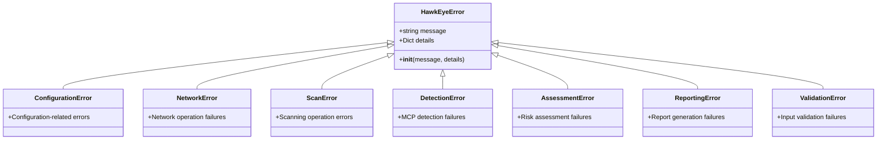
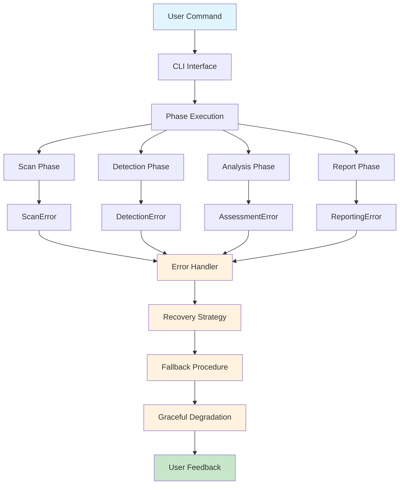
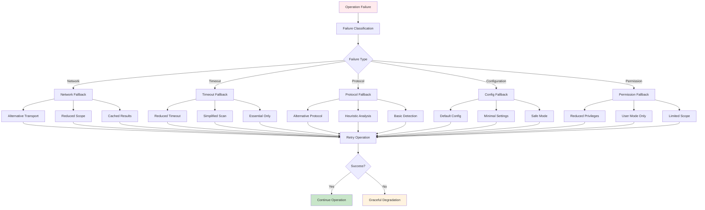
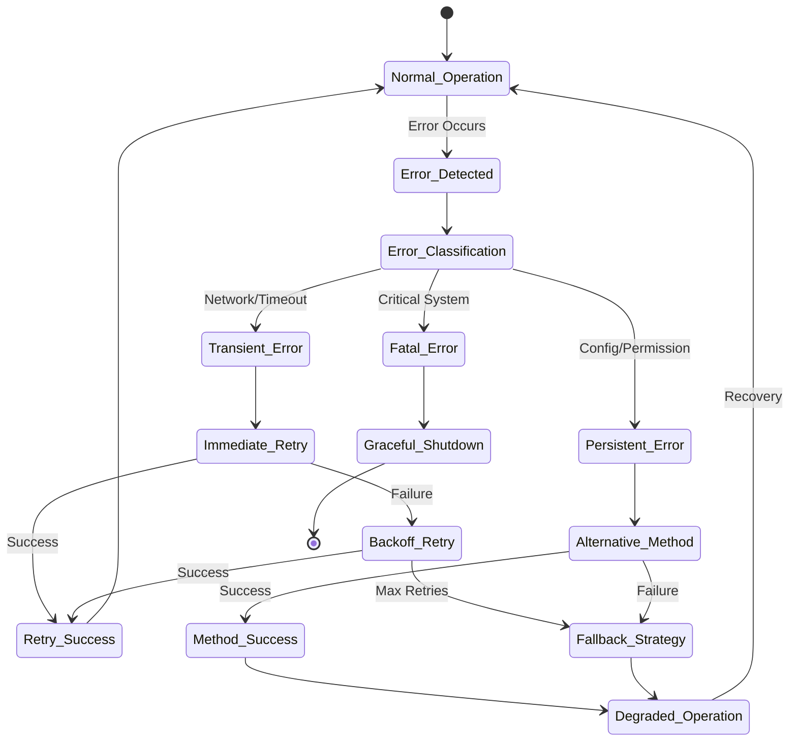

# Error Handling and Recovery

## Overview

This document provides a comprehensive analysis of error handling strategies, recovery mechanisms, and fallback procedures throughout the HawkEye security assessment workflow. It documents error propagation patterns, graceful degradation strategies, logging infrastructure, and debugging workflows to ensure robust operation even in adverse conditions.

## Exception Hierarchy

### Core Exception Framework



### Exception Structure

**Base Exception Class:**
```python
class HawkEyeError(Exception):
    """Base exception class for all HawkEye-related errors."""
    
    def __init__(self, message: str, details: Optional[Dict[str, Any]] = None):
        super().__init__(message)
        self.message = message
        self.details = details or {}
```

**Context-Rich Error Details:**
```python
error_details = {
    'phase': 'detection',
    'target': '192.168.1.100',
    'method': 'mcp_introspection',
    'timestamp': '2024-01-15T10:30:00Z',
    'context': {
        'transport_type': 'http',
        'port': 3000,
        'timeout': 180
    },
    'recovery_suggestions': [
        'Check network connectivity',
        'Verify target availability',
        'Try alternative transport methods'
    ]
}
```

## Error Propagation Patterns

### 1. Phase-Level Error Handling



### 2. Command-Level Error Propagation

**CLI Error Handling Framework:**
```python
class HawkEyeGroup(click.Group):
    """Custom Click group with enhanced error handling."""
    
    def invoke(self, ctx):
        """Invoke command with comprehensive error handling."""
        try:
            return super().invoke(ctx)
        except HawkEyeError as e:
            console.print(f"[red]Error:[/red] {e.message}")
            if e.details and ctx.obj.verbose:
                console.print(f"[yellow]Details:[/yellow] {e.details}")
            sys.exit(1)
        except Exception as e:
            if ctx.obj.verbose:
                console.print_exception()
            else:
                console.print(f"[red]Unexpected error:[/red] {e}")
            sys.exit(1)
```

### 3. Component-Level Error Handling

**Detection Pipeline Error Management:**
```python
def execute_pipeline(self, target_host: str) -> PipelineResult:
    """Execute detection pipeline with comprehensive error handling."""
    errors = []
    warnings = []
    successful_detections = 0
    
    for detector_name, detector in self.detectors.items():
        try:
            result = detector.detect(target_host)
            if result.success:
                successful_detections += 1
            else:
                warnings.append(f"{detector_name}: {result.error}")
        except DetectionError as e:
            errors.append(f"{detector_name}: {e.message}")
            logger.error(f"Detection failed for {detector_name}: {e}")
        except Exception as e:
            errors.append(f"{detector_name}: Unexpected error - {str(e)}")
            logger.exception(f"Unexpected error in {detector_name}")
    
    # Continue with partial results if any detection succeeded
    if successful_detections > 0:
        logger.info(f"Pipeline partially successful: {successful_detections} detections")
        return PipelineResult(success=True, errors=errors, warnings=warnings)
    else:
        logger.error("All detections failed")
        return PipelineResult(success=False, errors=errors, warnings=warnings)
```

## Recovery Mechanisms

### 1. Fallback Strategy Framework



### 2. Fallback Strategy Implementation

**MCP Introspection Fallback Manager:**
```python
class FallbackManager:
    """Manages graceful degradation for failed MCP introspections."""
    
    FALLBACK_STRATEGIES = {
        FallbackStrategy.SKIP: "_skip_strategy",
        FallbackStrategy.BASIC_INFO: "_basic_info_strategy", 
        FallbackStrategy.CACHED_RESULT: "_cached_result_strategy",
        FallbackStrategy.HEURISTIC_ANALYSIS: "_heuristic_analysis_strategy",
        FallbackStrategy.MINIMAL_SAFE: "_minimal_safe_strategy",
        FallbackStrategy.RETRY_WITH_TIMEOUT: "_retry_strategy",
        FallbackStrategy.DEGRADED_SCAN: "_degraded_scan_strategy"
    }
    
    def handle_failed_introspection(
        self,
        server_config: MCPServerConfig,
        original_error: Exception,
        error_context: Optional[Dict[str, Any]] = None
    ) -> FallbackResult:
        """Handle failed introspection with progressive fallback strategies."""
        
        # Classify failure reason
        failure_reason = self._classify_failure(original_error, error_context)
        
        # Select appropriate strategies based on failure type
        strategies = self._select_strategies(failure_reason)
        
        # Try strategies in order of preference
        for strategy in strategies:
            try:
                result = self._try_strategy(strategy, server_config, original_error, error_context)
                if result.success:
                    return result
            except Exception as e:
                logger.warning(f"Fallback strategy {strategy.value} failed: {e}")
                continue
        
        # Final fallback: return minimal safe result
        return self._minimal_safe_strategy(server_config, original_error)
```

### 3. Retry Mechanisms with Exponential Backoff

**Retry Manager:**
```python
class RetryManager:
    """Manages retry operations with configurable backoff strategies."""
    
    def __init__(self, config: RetryConfig):
        self.config = config
        self.retry_stats = defaultdict(int)
    
    async def retry_with_backoff(
        self,
        operation: Callable,
        operation_id: str,
        *args,
        **kwargs
    ) -> Any:
        """Execute operation with exponential backoff retry."""
        
        last_exception = None
        backoff_time = self.config.initial_delay
        
        for attempt in range(self.config.max_attempts):
            try:
                return await operation(*args, **kwargs)
                
            except Exception as e:
                last_exception = e
                self.retry_stats[operation_id] += 1
                
                # Don't retry on certain error types
                if self._should_not_retry(e):
                    raise e
                
                # Check if we should continue retrying
                if attempt < self.config.max_attempts - 1:
                    logger.warning(
                        f"Attempt {attempt + 1} failed for {operation_id}: {e}. "
                        f"Retrying in {backoff_time:.2f}s"
                    )
                    await asyncio.sleep(backoff_time)
                    backoff_time = min(
                        backoff_time * self.config.backoff_multiplier,
                        self.config.max_delay
                    )
        
        # All attempts failed
        raise last_exception
```

### 4. Circuit Breaker Pattern

**Circuit Breaker for External Services:**
```python
class CircuitBreaker:
    """Circuit breaker pattern for protecting against cascading failures."""
    
    def __init__(self, failure_threshold: int = 5, recovery_timeout: int = 60):
        self.failure_threshold = failure_threshold
        self.recovery_timeout = recovery_timeout
        self.failure_count = 0
        self.last_failure_time = None
        self.state = "CLOSED"  # CLOSED, OPEN, HALF_OPEN
    
    def call(self, func: Callable, *args, **kwargs):
        """Call function through circuit breaker."""
        
        if self.state == "OPEN":
            if self._should_attempt_reset():
                self.state = "HALF_OPEN"
            else:
                raise CircuitOpenError("Circuit breaker is OPEN")
        
        try:
            result = func(*args, **kwargs)
            self._on_success()
            return result
            
        except Exception as e:
            self._on_failure()
            raise e
    
    def _on_success(self):
        """Handle successful operation."""
        self.failure_count = 0
        self.state = "CLOSED"
    
    def _on_failure(self):
        """Handle failed operation."""
        self.failure_count += 1
        self.last_failure_time = time.time()
        
        if self.failure_count >= self.failure_threshold:
            self.state = "OPEN"
```

## Graceful Degradation Strategies

### 1. Progressive Feature Reduction

**Scan Phase Degradation:**
```python
class ScanDegradationManager:
    """Manages progressive degradation of scanning capabilities."""
    
    DEGRADATION_LEVELS = {
        'full': {'threads': 50, 'timeout': 30, 'port_range': 'all'},
        'reduced': {'threads': 20, 'timeout': 15, 'port_range': 'common'},
        'minimal': {'threads': 5, 'timeout': 5, 'port_range': 'essential'},
        'basic': {'threads': 1, 'timeout': 3, 'port_range': 'critical'}
    }
    
    def degrade_scan_parameters(self, current_level: str, error_type: str) -> Dict[str, Any]:
        """Degrade scan parameters based on encountered errors."""
        
        if error_type == 'timeout':
            # Reduce timeout and thread count
            next_level = self._get_next_degradation_level(current_level)
            return self.DEGRADATION_LEVELS[next_level]
            
        elif error_type == 'connection_refused':
            # Focus on essential ports only
            return {**self.DEGRADATION_LEVELS[current_level], 'port_range': 'essential'}
            
        elif error_type == 'permission_denied':
            # Switch to user-mode scanning
            return {**self.DEGRADATION_LEVELS[current_level], 'privileged': False}
        
        return self.DEGRADATION_LEVELS[current_level]
```

**Detection Phase Degradation:**
```python
class DetectionDegradationManager:
    """Manages detection capability degradation."""
    
    def degrade_detection_pipeline(self, pipeline_config: PipelineConfig, errors: List[str]) -> PipelineConfig:
        """Progressively disable detection methods based on errors."""
        
        degraded_config = pipeline_config
        
        # Disable resource-intensive methods first
        if 'timeout' in str(errors):
            degraded_config.enable_mcp_introspection = False
            degraded_config.introspection_timeout = min(degraded_config.introspection_timeout, 30.0)
        
        # Disable methods requiring elevated privileges
        if 'permission' in str(errors):
            degraded_config.enable_process_enumeration = False
            degraded_config.enable_docker_inspection = False
        
        # Disable network-dependent methods
        if 'network' in str(errors):
            degraded_config.enable_protocol_verification = False
            degraded_config.enable_transport_detection = False
        
        return degraded_config
```

### 2. Partial Success Handling

**Partial Result Management:**
```python
class PartialResultHandler:
    """Handles partial success scenarios gracefully."""
    
    def handle_partial_scan_results(self, scan_results: List[ScanResult], errors: List[str]) -> ScanSummary:
        """Process partial scan results and generate meaningful summary."""
        
        successful_results = [r for r in scan_results if r.is_open]
        failed_targets = len(errors)
        total_attempted = len(scan_results) + failed_targets
        
        # Calculate success rate
        success_rate = len(successful_results) / total_attempted if total_attempted > 0 else 0.0
        
        # Determine if results are sufficient for next phase
        sufficient_data = success_rate >= 0.1  # At least 10% success
        
        summary = ScanSummary(
            targets_scanned=len(set(r.target.host for r in scan_results)),
            ports_scanned=len(scan_results),
            open_ports=len(successful_results),
            success_rate=success_rate,
            sufficient_for_detection=sufficient_data,
            warnings=self._generate_warnings(errors, success_rate)
        )
        
        return summary
    
    def handle_partial_detection_results(self, detection_results: List[DetectionResult]) -> bool:
        """Determine if partial detection results are sufficient for analysis."""
        
        mcp_servers_found = sum(1 for r in detection_results if r.is_mcp_detected)
        high_confidence_results = sum(1 for r in detection_results if r.confidence >= 0.7)
        
        # Require at least one high-confidence MCP server detection
        return mcp_servers_found > 0 and high_confidence_results > 0
```

## Error Recovery Workflows

### 1. Phase Recovery Procedures



### 2. Recovery Workflow Implementation

**Scan Recovery Workflow:**
```python
class ScanRecoveryWorkflow:
    """Manages scan operation recovery procedures."""
    
    async def recover_failed_scan(
        self,
        target: ScanTarget,
        original_error: Exception,
        scan_config: ScanConfig
    ) -> Optional[List[ScanResult]]:
        """Attempt to recover from scan failure."""
        
        # Step 1: Classify the error
        error_type = self._classify_scan_error(original_error)
        
        # Step 2: Apply appropriate recovery strategy
        if error_type == ScanErrorType.NETWORK_UNREACHABLE:
            return await self._recover_network_error(target, scan_config)
        elif error_type == ScanErrorType.TIMEOUT:
            return await self._recover_timeout_error(target, scan_config)
        elif error_type == ScanErrorType.PERMISSION_DENIED:
            return await self._recover_permission_error(target, scan_config)
        elif error_type == ScanErrorType.PORT_FILTERED:
            return await self._recover_filtered_ports(target, scan_config)
        else:
            return await self._generic_recovery(target, scan_config)
    
    async def _recover_network_error(self, target: ScanTarget, config: ScanConfig) -> Optional[List[ScanResult]]:
        """Recover from network connectivity issues."""
        
        # Try different network approaches
        recovery_strategies = [
            self._try_alternative_routing,
            self._try_reduced_parallelism,
            self._try_basic_connectivity_test,
            self._try_dns_resolution_fallback
        ]
        
        for strategy in recovery_strategies:
            try:
                results = await strategy(target, config)
                if results:
                    logger.info(f"Network recovery successful using {strategy.__name__}")
                    return results
            except Exception as e:
                logger.debug(f"Recovery strategy {strategy.__name__} failed: {e}")
                continue
        
        return None
```

### 3. Data Recovery and Consistency

**Data Recovery Manager:**
```python
class DataRecoveryManager:
    """Manages data recovery and consistency maintenance."""
    
    def recover_corrupted_data(self, corrupted_file: Path) -> Optional[Dict[str, Any]]:
        """Attempt to recover data from corrupted files."""
        
        recovery_methods = [
            self._try_json_repair,
            self._try_partial_parsing,
            self._try_backup_restoration,
            self._try_structural_reconstruction
        ]
        
        for method in recovery_methods:
            try:
                recovered_data = method(corrupted_file)
                if self._validate_recovered_data(recovered_data):
                    logger.info(f"Data recovery successful using {method.__name__}")
                    return recovered_data
            except Exception as e:
                logger.debug(f"Recovery method {method.__name__} failed: {e}")
                continue
        
        return None
    
    def _try_json_repair(self, file_path: Path) -> Optional[Dict[str, Any]]:
        """Attempt to repair malformed JSON."""
        
        with open(file_path, 'r') as f:
            content = f.read()
        
        # Common JSON repair strategies
        repairs = [
            self._fix_trailing_commas,
            self._fix_unquoted_keys,
            self._fix_truncated_structures,
            self._extract_valid_segments
        ]
        
        for repair_func in repairs:
            try:
                repaired_content = repair_func(content)
                return json.loads(repaired_content)
            except json.JSONDecodeError:
                continue
        
        return None
```

## Logging and Debugging Infrastructure

### 1. Structured Logging Framework

**Multi-Level Logging Configuration:**
```python
class HawkEyeLogger:
    """Centralized logging with structured output and audit trails."""
    
    def configure(self) -> logging.Logger:
        """Configure comprehensive logging infrastructure."""
        
        # Main application logger
        logger = logging.getLogger("hawkeye")
        logger.setLevel(self.settings.log_level.upper())
        
        # Console handler with colored output
        console_handler = self._create_console_handler()
        logger.addHandler(console_handler)
        
        # File handler with rotation
        if self.settings.log_file:
            file_handler = self._create_file_handler()
            logger.addHandler(file_handler)
        
        # Structured logging for analysis
        if self.settings.enable_structured_logging:
            self._configure_structured_logging()
        
        return logger
    
    def _create_console_handler(self) -> logging.Handler:
        """Create colored console handler."""
        handler = logging.StreamHandler(sys.stdout)
        
        if self.settings.enable_color_logging:
            formatter = colorlog.ColoredFormatter(
                "%(log_color)s%(asctime)s - %(name)s - %(levelname)s - %(message)s",
                log_colors={
                    'DEBUG': 'cyan',
                    'INFO': 'green', 
                    'WARNING': 'yellow',
                    'ERROR': 'red',
                    'CRITICAL': 'red,bg_white'
                }
            )
        else:
            formatter = logging.Formatter(
                "%(asctime)s - %(name)s - %(levelname)s - %(message)s"
            )
        
        handler.setFormatter(formatter)
        return handler
```

### 2. Audit Trail and Security Events

**Security Event Logging:**
```python
class AuditLogger:
    """Specialized logger for security events and audit trails."""
    
    def log_security_event(self, event_type: str, details: str, user: str = "system"):
        """Log security-related events for audit trail."""
        self.logger.info(
            f"Security event: {event_type}",
            extra={
                "user": user,
                "action": event_type,
                "target": details,
                "result": "logged",
                "timestamp": datetime.now().isoformat(),
                "severity": self._calculate_severity(event_type)
            }
        )
    
    def log_scan_operation(self, operation: str, target: str, result: str):
        """Log scan operations for compliance."""
        self.logger.info(
            f"Scan operation: {operation}",
            extra={
                "operation_type": "scan",
                "target": target,
                "result": result,
                "compliance_relevant": True
            }
        )
    
    def log_error_with_context(self, error: Exception, context: Dict[str, Any]):
        """Log errors with full operational context."""
        self.logger.error(
            f"Error occurred: {error}",
            extra={
                "error_type": type(error).__name__,
                "error_message": str(error),
                "context": context,
                "stack_trace": self._get_stack_trace(),
                "recovery_attempted": context.get('recovery_attempted', False)
            }
        )
```

### 3. Debug Information Collection

**Debug Context Manager:**
```python
class DebugContext:
    """Collects and manages debug information across operations."""
    
    def __init__(self):
        self.debug_data = defaultdict(list)
        self.operation_stack = []
        self.timing_data = {}
    
    def start_operation(self, operation_name: str, **context):
        """Start tracking an operation."""
        operation_id = f"{operation_name}_{int(time.time() * 1000)}"
        
        operation_context = {
            'operation_id': operation_id,
            'operation_name': operation_name,
            'start_time': time.time(),
            'context': context
        }
        
        self.operation_stack.append(operation_context)
        self.debug_data[operation_id].append({
            'event': 'operation_start',
            'timestamp': time.time(),
            'data': operation_context
        })
        
        return operation_id
    
    def log_debug_event(self, operation_id: str, event_type: str, data: Any):
        """Log a debug event for an operation."""
        self.debug_data[operation_id].append({
            'event': event_type,
            'timestamp': time.time(),
            'data': data
        })
    
    def end_operation(self, operation_id: str, success: bool = True, **result_data):
        """End operation tracking."""
        end_time = time.time()
        
        # Find and remove from operation stack
        operation_context = None
        for i, op in enumerate(self.operation_stack):
            if op['operation_id'] == operation_id:
                operation_context = self.operation_stack.pop(i)
                break
        
        if operation_context:
            duration = end_time - operation_context['start_time']
            self.timing_data[operation_id] = duration
            
            self.debug_data[operation_id].append({
                'event': 'operation_end',
                'timestamp': end_time,
                'data': {
                    'success': success,
                    'duration': duration,
                    'result': result_data
                }
            })
    
    def export_debug_report(self, output_file: Path):
        """Export comprehensive debug report."""
        debug_report = {
            'metadata': {
                'export_time': datetime.now().isoformat(),
                'total_operations': len(self.debug_data),
                'active_operations': len(self.operation_stack)
            },
            'operations': dict(self.debug_data),
            'timing_summary': self.timing_data,
            'performance_metrics': self._calculate_performance_metrics()
        }
        
        with open(output_file, 'w') as f:
            json.dump(debug_report, f, indent=2, default=str)
```

## Error Monitoring and Alerting

### 1. Error Rate Monitoring

**Error Rate Tracker:**
```python
class ErrorRateMonitor:
    """Monitors error rates and triggers alerts."""
    
    def __init__(self, alert_threshold: float = 0.1, time_window: int = 300):
        self.alert_threshold = alert_threshold  # 10% error rate
        self.time_window = time_window  # 5 minutes
        self.error_history = deque(maxlen=1000)
        self.operation_history = deque(maxlen=1000)
    
    def record_operation(self, success: bool, operation_type: str):
        """Record operation result."""
        timestamp = time.time()
        
        self.operation_history.append({
            'timestamp': timestamp,
            'success': success,
            'operation_type': operation_type
        })
        
        if not success:
            self.error_history.append({
                'timestamp': timestamp,
                'operation_type': operation_type
            })
        
        # Check if alert should be triggered
        self._check_alert_conditions()
    
    def _check_alert_conditions(self):
        """Check if error rate exceeds threshold."""
        current_time = time.time()
        window_start = current_time - self.time_window
        
        # Count operations and errors in time window
        recent_operations = [
            op for op in self.operation_history 
            if op['timestamp'] >= window_start
        ]
        recent_errors = [
            err for err in self.error_history 
            if err['timestamp'] >= window_start
        ]
        
        if len(recent_operations) >= 10:  # Minimum sample size
            error_rate = len(recent_errors) / len(recent_operations)
            
            if error_rate >= self.alert_threshold:
                self._trigger_alert(error_rate, recent_errors)
    
    def _trigger_alert(self, error_rate: float, recent_errors: List[Dict]):
        """Trigger high error rate alert."""
        alert_data = {
            'alert_type': 'high_error_rate',
            'error_rate': error_rate,
            'threshold': self.alert_threshold,
            'recent_errors': len(recent_errors),
            'error_types': self._categorize_errors(recent_errors),
            'timestamp': datetime.now().isoformat()
        }
        
        logger.critical(f"High error rate detected: {error_rate:.2%}", extra=alert_data)
        
        # Could integrate with external alerting systems here
        self._send_notification(alert_data)
```

### 2. Health Check System

**System Health Monitor:**
```python
class HealthCheckManager:
    """Monitors system health and component status."""
    
    def __init__(self):
        self.health_checks = {}
        self.last_check_results = {}
    
    def register_health_check(self, name: str, check_func: Callable, interval: int = 60):
        """Register a health check function."""
        self.health_checks[name] = {
            'function': check_func,
            'interval': interval,
            'last_run': 0,
            'status': 'unknown'
        }
    
    async def run_health_checks(self) -> Dict[str, Any]:
        """Run all registered health checks."""
        current_time = time.time()
        results = {}
        
        for name, check_config in self.health_checks.items():
            if current_time - check_config['last_run'] >= check_config['interval']:
                try:
                    result = await check_config['function']()
                    check_config['status'] = 'healthy' if result else 'unhealthy'
                    check_config['last_run'] = current_time
                    results[name] = {
                        'status': check_config['status'],
                        'last_check': current_time,
                        'details': result
                    }
                except Exception as e:
                    check_config['status'] = 'error'
                    results[name] = {
                        'status': 'error',
                        'error': str(e),
                        'last_check': current_time
                    }
            else:
                results[name] = self.last_check_results.get(name, {'status': 'pending'})
        
        self.last_check_results = results
        return results
    
    def get_overall_health(self) -> str:
        """Get overall system health status."""
        if not self.last_check_results:
            return 'unknown'
        
        statuses = [check['status'] for check in self.last_check_results.values()]
        
        if 'error' in statuses:
            return 'critical'
        elif 'unhealthy' in statuses:
            return 'degraded'
        elif all(status == 'healthy' for status in statuses):
            return 'healthy'
        else:
            return 'unknown'
```

## Best Practices

### 1. Error Handling Guidelines

**Comprehensive Error Handling:**
- Always provide meaningful error messages with context
- Include recovery suggestions when possible
- Log errors with appropriate severity levels
- Preserve error chain for debugging
- Implement graceful degradation where feasible

**Example Implementation:**
```python
def handle_network_operation():
    """Example of comprehensive error handling."""
    try:
        result = perform_network_operation()
        return result
        
    except ConnectionTimeout as e:
        logger.warning(f"Network timeout: {e}")
        # Try with reduced timeout
        try:
            return perform_network_operation(timeout=10)
        except Exception as retry_error:
            raise NetworkError(
                "Network operation failed after retry",
                details={
                    'original_error': str(e),
                    'retry_error': str(retry_error),
                    'suggestions': [
                        'Check network connectivity',
                        'Verify target is reachable',
                        'Try again later'
                    ]
                }
            )
    
    except PermissionError as e:
        raise NetworkError(
            "Insufficient permissions for network operation",
            details={
                'error': str(e),
                'suggestions': [
                    'Run with appropriate privileges',
                    'Check firewall settings',
                    'Verify port access permissions'
                ]
            }
        )
    
    except Exception as e:
        logger.exception("Unexpected error in network operation")
        raise NetworkError(
            f"Unexpected network error: {str(e)}",
            details={'original_error': str(e)}
        )
```

### 2. Recovery Strategy Selection

**Failure Classification and Strategy Selection:**
```python
def select_recovery_strategy(error: Exception, context: Dict[str, Any]) -> RecoveryStrategy:
    """Select appropriate recovery strategy based on error type and context."""
    
    # Network-related errors
    if isinstance(error, (ConnectionError, ConnectionTimeout, NetworkError)):
        if context.get('retry_count', 0) < 3:
            return RecoveryStrategy.RETRY_WITH_BACKOFF
        else:
            return RecoveryStrategy.ALTERNATIVE_METHOD
    
    # Permission-related errors
    elif isinstance(error, PermissionError):
        return RecoveryStrategy.REDUCED_PRIVILEGES
    
    # Configuration errors
    elif isinstance(error, ConfigurationError):
        return RecoveryStrategy.DEFAULT_CONFIG
    
    # Timeout errors
    elif 'timeout' in str(error).lower():
        return RecoveryStrategy.REDUCED_SCOPE
    
    # Unknown errors
    else:
        return RecoveryStrategy.GRACEFUL_DEGRADATION
```

This comprehensive error handling and recovery framework ensures that HawkEye maintains robust operation even in adverse conditions, providing users with meaningful feedback and attempting intelligent recovery whenever possible. 